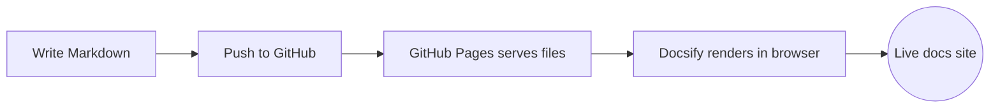

# Aeroskill Docs

> Documentation powered by [Docsify](https://docsify.js.org/), rendered straight from Markdown — with [Mermaid](https://mermaid.js.org/) diagram support.

Welcome 👋 This site is built from the Markdown files in this repository. There is **no build step**: Docsify renders the `.md` files on the fly in the browser, and GitHub Pages serves them as a static site.

## Highlights

- ✍️ **Write Markdown, get a website.** Add or edit `.md` files and the site updates.
- 📈 **Mermaid diagrams** render from fenced ` ```mermaid ` code blocks.
- 🔍 **Full-text search**, 📋 **copy-to-clipboard** code blocks, and 🎨 syntax highlighting out of the box.
- 🚀 **Deployed on GitHub Pages** — nothing to compile, just push.

## Quick example



## Where to next?

- [Getting Started](guide/getting-started.md) — run the site locally and add a page.
- [Writing Mermaid Diagrams](guide/mermaid.md) — every diagram type, with live examples.
- [Deploying to GitHub Pages](guide/deploy.md) — turn the repo into a published site.
