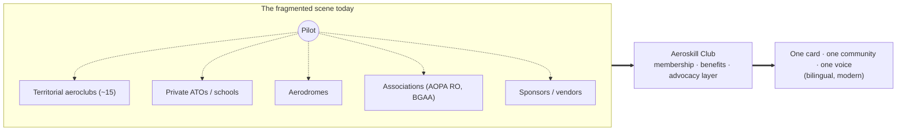
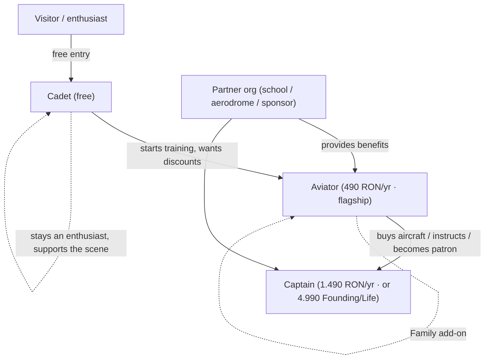
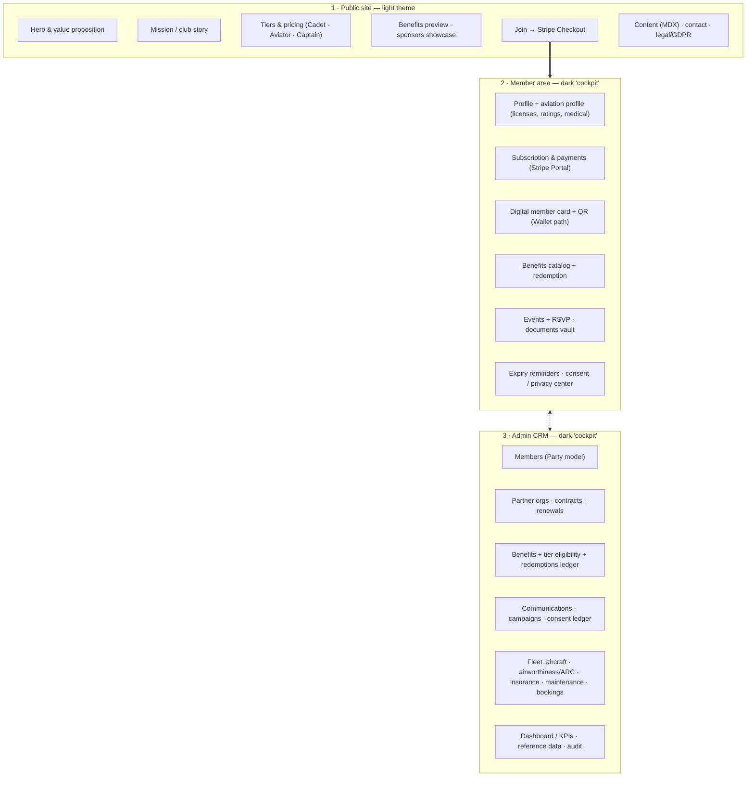
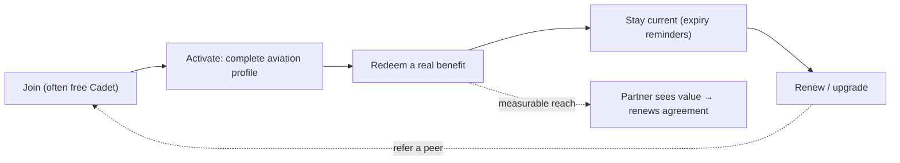
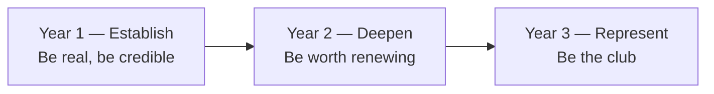

# Aeroskill Club — Product Vision

> Why we exist, who we serve, and what success looks like for a modern bilingual Romanian general-aviation members' club.
> _Part of the Aeroskill Club planning set — read alongside 00-foundation.md._

---

## 1. Vision & mission

### Vision statement

> **RO —** Fiecare pilot și pasionat de aviație din România are un club modern, bilingv, în care apartenența chiar contează.
>
> **EN —** Every pilot and aviation enthusiast in Romania belongs to one modern, bilingual club where membership actually means something.

One line, one promise: bring the scattered Romanian general-aviation (GA) community under a single, credible, well-designed roof — the way **ACR (Automobil Clubul Român)** did for drivers, but for the people who fly.

### Mission statement

> **RO —** Construim stratul de apartenență, beneficii și reprezentare pentru aviația generală din România: un card de membru real cu reduceri valabile la parteneri (școli, aerodromuri, sponsori), o comunitate bilingvă cu evenimente și fly-in-uri, și o voce care apără interesele piloților — așezat peste infrastructura existentă, niciodată în competiție cu ea.
>
> **EN —** We build the membership, benefits, and advocacy layer for Romanian general aviation: a real member card with discounts honored across partners (schools, aerodromes, sponsors), a bilingual community with events and fly-ins, and a voice that defends pilots' interests — layered on top of the existing infrastructure, never competing with it.

The mission deliberately names the three things a member can feel: a **card that saves money**, a **community that welcomes**, and an **advocacy voice that represents**. Those are the same three things across every tier — what changes between Cadet, Aviator, and Captain is depth of service, never basic belonging (see `00-foundation.md` §4).

---

## 2. The problem & why now

Romanian general aviation is **alive but fragmented**. There are active pilots, working aerodromes, a state aeroclub with deep roots, a handful of private ATOs, and real associations — but no modern connective tissue. A pilot who trains at one aerodrome, rents at another, and reads regulations from a third has no single home that recognizes them as a member, remembers their licenses, reminds them their SEP rating expires in 24 months, or gets them a discount on fuel.

### What is broken today

| Problem | What it looks like in Romania | Consequence |
|---|---|---|
| **Fragmentation** | Activity split across ~15–16 territorial aeroclubs (Aeroclubul României), private ATOs (Regional Air Services / Tuzla LRTZ, Aerowest, Transylvania Wings), and aerodromes (Clinceni LRCN, Strejnic LRPV, Tuzla LRTZ) with no shared membership | A pilot's identity, history, and benefits don't travel with them |
| **Romanian-only & dated** | The incumbent national body is institutional, Romanian-only, and visually dated; little serves visiting or English-speaking pilots | International and younger pilots feel locked out or unimpressed |
| **No "ACR for pilots"** | Romanians happily pay ~200–250 RON/yr to ACR for a card, assistance, and reciprocity — but there's no equivalent for aviation | A proven, trusted membership pattern is simply absent from GA |
| **Benefits are invisible** | Discounts and partnerships exist informally and by word of mouth, never as a structured, redeemable catalog | Value is unclaimed; partners get no measurable reach |
| **Compliance is manual** | Pilots track license / rating / medical / ARC expiries on paper or in their head (SEP 24-mo, IR 12-mo, ARC 1-yr) | Lapses, scrambles, and avoidable groundings |
| **No advocacy layer** | AOPA Romania and others exist, but the everyday pilot has no modern, low-friction way to add their voice | The GA community speaks softly when it should speak together |

### Why now

- **A credibility template already worked.** ACR proved Romanians will pay annually for a serious club with a card, assistance, and reciprocity. We borrow the model, modernize the execution, and point it at aviation.
- **The toolchain finally lets one person build it well.** Next.js 15, Supabase (EU/Frankfurt), Stripe Billing, Resend, and Vercel make a rigorous, bilingual, secure platform deliverable by a **single developer with Claude Code** — no enterprise team required (see `00-foundation.md` §10).
- **Bilingual is now table stakes, not a luxury.** Visiting pilots and a generation of younger Romanians who live in English mean a Romanian-first / English-second product is the obvious — and currently unoccupied — position.
- **The whitespace is clearly mapped.** Modern + bilingual + premium-yet-approachable is empty space. Nobody owns it. We can.

> **We are not** a flight school, an ATO, or a competitor to the state **Aeroclubul României**. We are the **benefits + community + advocacy layer on top of** that existing infrastructure. We partner; we don't replace.

---

## 3. Who we serve

Our market is the **Bucharest-area and national Romanian GA scene**, plus **international and visiting pilots** — which is exactly why the product is bilingual from day one. Disciplines are a **multi-select**, not airplane-only: airplane (LAPL/PPL), glider/sailplane (SPL), balloon (BPL), ultralight/ULM, parachuting, and "enthusiast / non-pilot."

### Personas (expanded from the foundation)

#### Andrei — the aspiring pilot · *likely tier: Cadet → Aviator*
19, a student eyeing a PPL/LAPL or a national ULM permit. He's price-sensitive, hungry for community, and quietly asking himself *"am I even cut out for this?"* He found free youth courses (~16–23) through Aeroclubul României and wants people to talk to. **What he needs from us:** a free way in (Cadet), honest answers, a path to cheaper training discounts, and the feeling that he belongs before he's qualified. **What converts him:** seeing Ioana and Mihai treat him as a future colleague, not a tourist.

#### Ioana — the active private pilot · *likely tier: Aviator (the flagship)*
38, holds a PPL(A) with SEP + Night, flies ~40 hours a year out of a field near Bucharest. She is exactly who the **"Most popular"** Aviator tier is built for. **What she needs from us:** meaningful fuel/landing and training discounts, **rating-expiry reminders** so SEP (24-mo) and her medical never catch her out, a member directory to fly with people, priority event seating, and an optional **Family add-on**. **What converts her:** the first time a partner aerodrome honors her digital card and the discount is real.

#### Mihai — the owner / instructor · *likely tier: Captain*
52, owns a **YR-** registered aircraft, holds an FI rating, flies semi-professionally. He cares about protection, recognition, and his time. **What he needs from us:** a negotiated insurance/legal advocacy layer, a concierge/priority helpline, the **premium physical metal card**, website recognition, the deepest discounts (conditioned on recurrent-training proof), and a CRM-grade place to keep his aircraft's airworthiness/ARC, insurance, and maintenance straight. **What converts him:** being treated as a patron and a peer-leader of the community, not just a high-paying user.

#### Elena — the enthusiast · *likely tier: Cadet*
45, not a pilot — an aviation fan and photographer who loves the scene. **What she needs from us:** events, fly-ins, community, and a legitimate way to support GA and be welcomed into it. **What converts her:** that the club explicitly designs for "enthusiast / non-pilot" instead of treating non-pilots as second-class.

#### A partner organization — *CRM-side, not a tier*
A flight school / ATO, an association/aeroclub, an aerodrome, or a sponsor/vendor. **What they need from us:** reach into an engaged, identifiable pilot audience; a clean way to manage the agreement (Contract + ContractDocument, renewal tracking); and a **redemptions ledger** that proves the partnership delivered measurable value. **What converts them:** seeing redemptions tick up against their benefit and a renewal that's one click, not a renegotiation.

---

## 4. Product principles & values

These are the non-negotiable instincts that should resolve any future design or scope argument.

| Principle | RO shorthand | What it means in practice |
|---|---|---|
| **Credible to real pilots** | *Credibil pentru piloți* | Correct vocabulary (PPL(A), LAPL, SEP, IR, ARC, aerodrome), the right authorities (AACR issues EASA Part-FCL; **SAUM issues ULM, not AACR**), and real seed entities. No toy aviation. |
| **Welcoming to enthusiasts** | *Primitor pentru pasionați* | A free Cadet tier and an explicit "enthusiast / non-pilot" discipline. You belong before you're licensed. |
| **Bilingual-first** | *Bilingv din temelie* | Romanian-first, English-second, everywhere — `/ro` default, `/en` peer, `hreflang`, no hardcoded UI copy, RO copy native-written (never machine-translated). Layouts designed for the **longer Romanian string**. |
| **Modern, not flashy** | *Modern, fără artificii* | Clean instrument-and-horizon design language, restrained motion, real GA photography over stock sunsets. Premium-yet-approachable, never gimmicky. |
| **One shared core, depth by tier** | *Un nucleu comun* | Community, card, and advocacy belong to everyone. Tiers differ by **depth of service** (discount size, protection, concierge) — never by withholding basic belonging. |
| **A layer, not a competitor** | *Un strat, nu un concurent* | We partner with schools, aeroclubs, and aerodromes. We are not an ATO and not a rival to Aeroclubul României. |
| **Privacy as a feature** | *Confidențialitatea ca produs* | We model sensitive data (license numbers, medical class). Granular, withdrawable consent; a member-facing privacy center; lawful basis = contract performance for core membership (GDPR / RO Law 190/2018). |
| **Dues ≠ flying spend** | *Cotizația ≠ zborul* | Membership dues are always separate from any flying/training cost. Fleet capability is modeled, but flight access is never bundled into a tier price. |
| **Built by one, sustainably** | *Construit de unul singur* | Every decision respects a solo developer's reality: one coherent low-ops stack, MoSCoW-scoped, concept-grade compliance with real review flagged where it matters. |

**Voice across all of it:** an experienced captain briefing a friend — confident, precise, warm. Aviation microcopy ("Cleared for takeoff" on signup) used sparingly.

---

## 5. What we're building, at a glance

One Next.js 15 codebase, one design system, three surfaces with two themes.

| Surface | Audience | Theme | The job it does |
|---|---|---|---|
| **Public site** | Visitors, prospects, partners | Light (airy, approachable) | Tell the story, show the three tiers, prove credibility, convert to a join |
| **Member area** | Authenticated members | Dark "cockpit" | Self-service: profile, subscription, the digital card, benefits, events, reminders, privacy |
| **Admin CRM** | Staff / admin | Dark "cockpit" | Run the club: members, partners, contracts, benefits, communications, fleet |

The membership ladder the public site sells:

| | **Cadet** | **Aviator** *(Most popular / Cel mai popular)* | **Captain** |
|---|---|---|---|
| RO name | Cadet | Aviator | Comandant |
| Price | **Free** (0 RON) | **490 RON/yr** (~€99) · or 49 RON/mo | **1.490 RON/yr** (~€299) · or 149 RON/mo |
| One-time | — | — | **Founding / Life: 4.990 RON** (~€999) |
| Accent | Sky | Brass | Engraved navy + brass |

(Full tier mechanics, headline value, and add-ons are locked in `00-foundation.md` §4.)

---

## 6. North star & vision of success

### North-star metric

> **Active, renewing members who have redeemed at least one real benefit.**

This single number resists vanity. A signup is cheap; a renewal after a member actually saved money on fuel, a landing fee, or training — that proves the loop closed. It forces every part of the product to cooperate: the public site must convert honestly, the member area must surface benefits, partners must honor them, and reminders must keep people current and engaged enough to renew.

### What success feels like (qualitative)

- A pilot pulls out the Aeroskill card at a partner aerodrome and the discount is honored without explanation — because the partner's redemptions ledger expects it.
- An English-speaking visiting pilot navigates the whole site in `/en` without ever hitting a Romanian-only wall — and a Romanian member never feels the product was translated *to* them.
- Ioana never again discovers a lapsed rating the hard way; the reminder reached her first.
- A flight school renews its partnership in one click because the ledger already proved the reach.
- When someone in the GA community says "I'm a member," the others know exactly what that means — and quietly respect it.

### Illustrative concept targets

> These are **directional concept figures** for a portfolio build, not forecasts or commitments. They exist to make "success" concrete and to size the product, not to be defended as projections.

| Horizon | Members (active) | Partner orgs | NPS | Annual retention | Benefit-redemption rate |
|---|---|---|---|---|---|
| **End of Year 1** | ~300–500 (Cadet-heavy funnel) | ~10–15 | ≥ 40 | ≥ 60% (paid tiers) | ≥ 40% of paid members redeem ≥1 |
| **End of Year 2** | ~1,000–1,500 | ~25–35 | ≥ 50 | ≥ 70% | ≥ 55% |
| **End of Year 3** | ~3,000+ | ~50+ | ≥ 55 | ≥ 75% | ≥ 65% |

Pricing is calibrated against real anchors — ACR (~250 RON/yr), Romanian net wages (~5.674 RON/mo, Q4 2025), and gym benchmarks — so these targets assume the value genuinely clears the price bar for Aviator and Captain.

---

## 7. Non-goals (what we are explicitly NOT building)

Naming the non-goals is how the vision stays buildable by one person and credible to real pilots.

| Non-goal | Why it's out |
|---|---|
| **Not a flight school / ATO / DTO** | We don't train, examine, or certify. We are a benefits + community + advocacy layer on top of schools and aeroclubs. |
| **Not a competitor to Aeroclubul României** | The state aeroclub is a partner and a respected institution, not a target. We occupy modern + bilingual + premium whitespace beside it. |
| **Not selling flight time** | Dues ≠ flying spend. Fleet/booking is **modeled** in the CRM as a concept capability; flight access/hire is **not** a launch promise and never bundled into a tier price. |
| **Not a regulator or authority of record** | We reference and respect AACR, EASA, SAUM, ROMATSA. We never imply we issue licenses, ratings, medicals, or airworthiness. |
| **Not production-grade legal/tax/payment compliance** | This is a concept/portfolio build. Real legal/tax/payment contracts (asociație formation under OG 26/2000, VAT/e-Factura merchant-of-record, payment review) are explicitly out of scope and flagged where relevant. |
| **Not a generic CRM or SaaS template** | Everything is shaped to Romanian GA specifics — the Party model, EASA vocabulary, YR- aircraft, ARC tracking — not a horizontal tool. |
| **Not storing card/payment data** | Hosted Stripe Checkout (SAQ-A); we keep only Stripe IDs + brand/last4. |
| **Not biometric** | No biometric data on the member card; QR token only. |
| **Not multi-country at launch** | Romania-first. The architecture is currency- and locale-ready, but international expansion is a later-horizon aspiration, not a v1 scope. |

---

## 8. The three-year aspirational arc

A grounded narrative of how the concept matures. Sequencing and effort detail live in `03-implementation-plan.md` and `10-roadmap.md`; this is the *story*, not the project plan.

### Year 1 — Establish: *be real, be credible*
Ship all three surfaces. A polished bilingual public site that converts; a member area with profile, aviation profile, subscription via Stripe, the **digital member card with QR**, and a first wave of benefits; a CRM that genuinely runs members, partners, contracts, and reference data. Sign the first ~10–15 partners (flight schools, an aerodrome, a few sponsors) and seed real entities (Clinceni LRCN, Strejnic LRPV, Tuzla LRTZ, Regional Air Services, AOPA Romania, BGAA). The goal isn't scale — it's a product the GA community looks at and says *"this is serious."*

### Year 2 — Deepen: *be worth renewing*
Make the value undeniable for the people who pay. Richer benefits with a working redemptions loop; **rating / medical / ARC expiry reminders** that members trust; events and fly-ins with RSVP; the **Family add-on** on Aviator+; **Google Wallet** card delivery; deeper fleet capability (airworthiness/ARC, insurance, maintenance, bookings) in the CRM; an aspirational **IAOPA-style advocacy affiliation path** taking shape. Retention and NPS become the scoreboard. This is the year the loop in §6 starts spinning on its own.

### Year 3 — Represent: *be the club*
Aeroskill becomes shorthand for serious GA membership in Romania. A meaningful partner network with one-click renewals; an advocacy voice that's actually heard; **Apple Wallet** card; a maturing content layer (MDX → Payload CMS). The platform is ready to graduate from concept toward production if the user chooses — the documented Vercel → Coolify-on-Hetzner migration path, e-Factura-ready invoicing, and full GDPR posture are all already designed in. The aspiration: when a Romanian pilot or a visiting one thinks "where do I belong," the answer is obvious.

---

## 9. How this connects to the rest of the set

| This vision says… | …and these documents make it real |
|---|---|
| Why we exist, who we serve, success | **01 (this doc)** |
| How we position, monetize, go to market | **02 · product-strategy** |
| How one developer builds it with Claude Code | **03 · implementation-plan** · **10 · roadmap** |
| Exactly what each surface must do | **04 · prd** |
| How it's organized and routed (RO/EN, RBAC) | **05 · information-architecture** |
| The Party model and every entity, as tables | **06 · database-schema** |
| Every step a user takes across three surfaces | **07 · user-flows** |
| The instrument-and-horizon look, logo-driven | **08 · design-system** |
| The locked stack, EU residency, GDPR, deploy | **09 · technical-infrastructure** |

> Every name, price, entity, and stack choice referenced here is governed by `00-foundation.md`. If anything in this document ever appears to drift from the foundation, the foundation wins.

---

_Aeroskill Club — Cleared for takeoff. / Liber pentru decolare._
