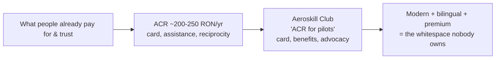
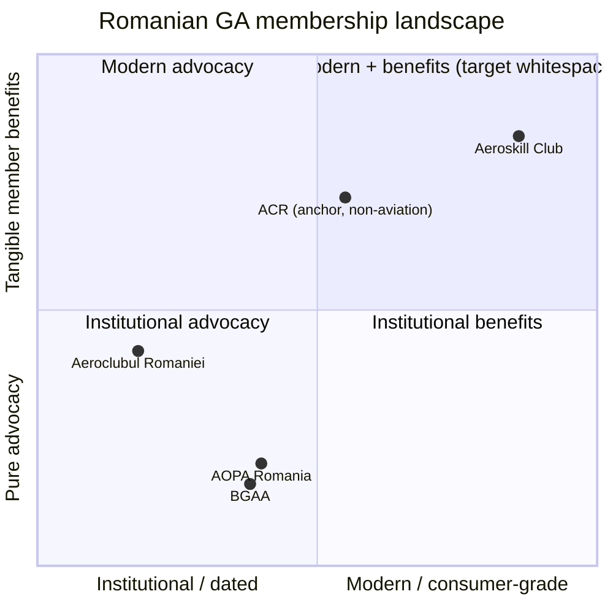
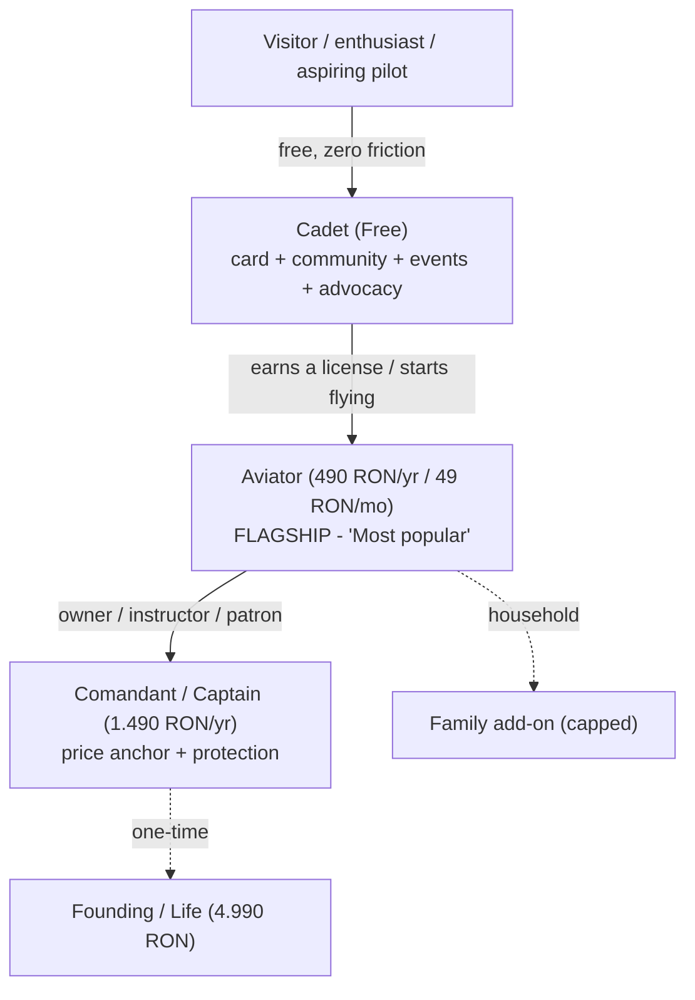
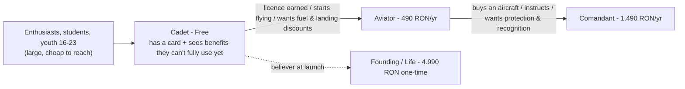
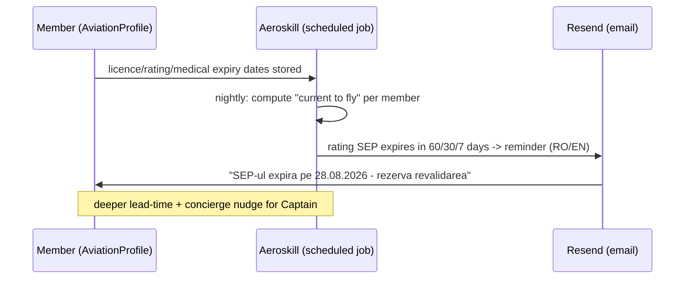
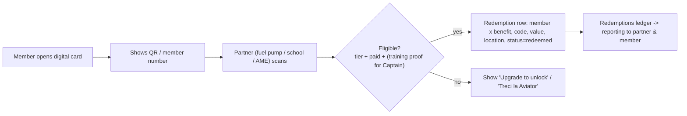
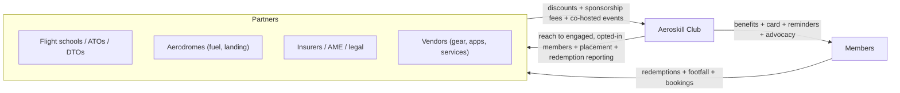
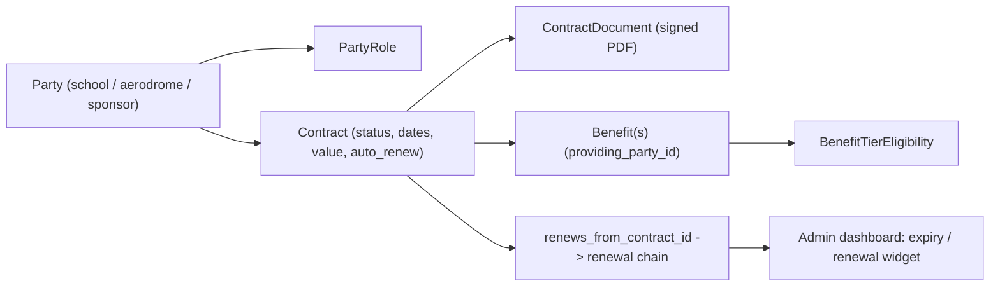
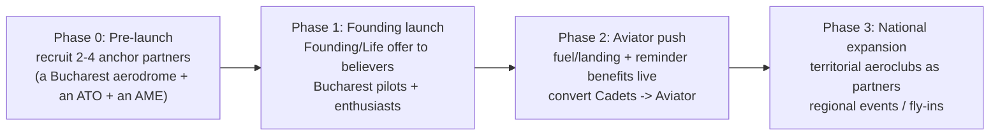
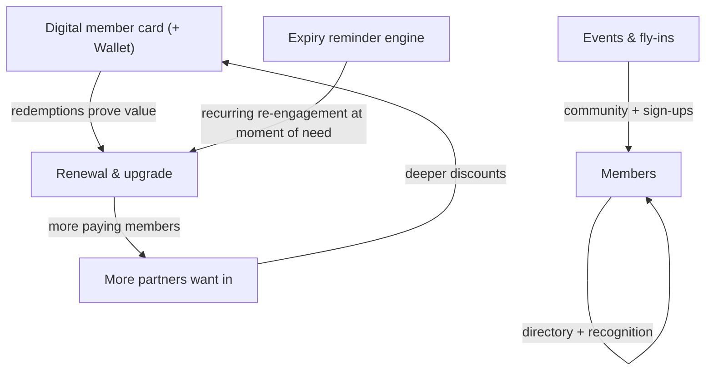

# Aeroskill Club — Product Strategy

> How Aeroskill Club wins: positioning, market, membership & sponsor strategy, monetization, go-to-market, growth, and risks.
> _Part of the Aeroskill Club planning set — read alongside 00-foundation.md._

---

## 1. Positioning statement & differentiation

**Positioning (one sentence):** _Aeroskill Club is the modern, bilingual membership club for Romanian general aviation — a benefits, community, and advocacy layer that sits on top of the existing flying infrastructure, giving pilots and enthusiasts a real digital member card, partner-redeemable perks, and an organized voice, without ever competing with the schools, aeroclubs, or aerodromes it partners with._

It is deliberately **not** a flight school, **not** an ATO/DTO, **not** a CAMO, and **not** a rival to the state **Aeroclubul României**. Dues are never flying spend (foundation §4): the club sells *belonging and leverage*, not flight hours.

### 1.1 The positioning ladder ("ACR for pilots, done in a modern way")

The clearest mental model for a Romanian audience is a familiar one: the **Automobil Clubul Român (ACR)**. Romanians already understand paying ~200–250 RON/yr for a serious club that gives them a card, roadside assistance, discounts, and international reciprocity (FIA). Aeroskill borrows that frame and lifts it into aviation and into 2026 design.

### 1.2 Differentiation pillars

| # | Pillar | What it means concretely | Who it beats |
|---|---|---|---|
| 1 | **Bilingual, modern UX** | RO-first, EN peer; `/ro` `/en` routing + hreflang; light public theme, dark "cockpit" member/admin theme; WCAG 2.2 AA | Aeroclubul României (RO-only, institutional, visually dated) |
| 2 | **A real digital member card** | Web/PDF card + QR → Google Wallet → Apple Wallet; partner-redeemable at fuel pumps, schools, aerodromes; metal card for Captain | AOPA RO / BGAA (advocacy memberships, no consumer card / perks engine) |
| 3 | **Advocacy & community** | Events, fly-ins, member directory, an organized voice; aspirational IAOPA-style affiliation path | Informal Facebook groups & scattered forums (no structure, no continuity) |
| 4 | **Deep partner network surfaced as perks** | Schools, aerodromes, fuel, insurers, medical examiners (AME) wired into a benefits + redemption ledger | Everyone — no Romanian GA body operates a partner-redemption engine |

### 1.3 Positioning map

_Note: ACR is non-aviation and appears only as a pricing/credibility anchor — its placement reflects the **anchor analogy** (a familiar modern club + card), not a measured position in the Romanian GA market._

The upper-right quadrant — **modern, consumer-grade, benefits-rich** — is empty in Romanian GA. That is the position Aeroskill claims.

---

## 2. The Romanian GA market & competitive landscape

### 2.1 Rough market sizing (concept-grade — illustrative, verify before public use)

Romanian general aviation is small but real, concentrated around Bucharest and a handful of aerodromes (Clinceni LRCN, Strejnic LRPV, Tuzla LRTZ, Băneasa). Sizing is built bottom-up from known anchors in the foundation (§8) and treated as a planning estimate, not a published figure.

| Segment | Rough size (concept estimate) | Basis / note |
|---|---|---|
| Active GA private pilots (LAPL/PPL, holding a medical) | ~1,500–3,000 | Small EU member state; flying concentrated near Bucharest |
| ULM / microlight pilots (SAUM-licensed) | ~1,000–2,000 | Cheaper entry; licensed by SAUM inside Aeroclubul României, **not AACR** |
| Glider (SPL) / balloon (BPL) pilots | ~500–1,000 | Aeroclubul Romaniei territorial clubs are the centre of gravity |
| Students in training (PPL/LAPL/ULM) | ~500–1,000/yr flow | ATOs (Regional Air Services, RAA/SSAvC, Aerowest…) + free youth courses |
| Aircraft owners (YR- registered) | ~600–1,200 | Owner/instructor persona (Mihai); Captain-tier candidates |
| Enthusiasts / non-pilots (Elena persona) | Large & cheap to reach | Spotters, photographers, fly-in attendees, families |
| **Serviceable obtainable audience (pilots + serious enthusiasts)** | **~5,000–8,000** | The realistic top-of-funnel for a Romanian GA club |

**Strategic read:** the *pilot* market is too small to support a benefits club on dues alone — which is exactly why the model deliberately bundles (a) a **free Cadet tier** to capture the much larger enthusiast/aspiring-pilot pool for funnel volume and advocacy weight, and (b) **sponsor/partner revenue** alongside dues (see §5 and §6). Aeroskill is sized to be a **healthy small club**, not a venture-scale business — consistent with its concept/portfolio framing (foundation §1).

### 2.2 Competitive map

| Player | What they are | Strength | Gap Aeroskill exploits |
|---|---|---|---|
| **Aeroclubul României** | State national aeroclub (founded 1920, FAI 1923); ~15–16 territorial clubs; trains PPL(A)/ULM/glider/parachute; hosts **SAUM**; free youth courses (~16–23) | Reach, heritage, infrastructure, the actual flying | RO-only, institutional, dated UX; no consumer benefits engine; not a "club you join for perks" |
| **AOPA Romania** (aopa.ro, IAOPA-affiliated) | Pilot-owner advocacy association | International affiliation, legitimacy on policy | Advocacy-first; no modern member card / redemption layer; small consumer surface |
| **BGAA** (bgaa.ro) | Business/general aviation association | B2B / industry voice | Not a member-pilot benefits club; no bilingual consumer platform |
| **ACR (non-aviation)** | Automobil Clubul Român | **Pricing & credibility anchor** | Proves Romanians pay for a club + card + assistance — but it's cars, not aviation |
| **Informal channels** (FB groups, forums) | Where the scene actually talks today | Free, active, immediate | No structure, no card, no benefits, no continuity, no advocacy weight |

**Posture toward Aeroclubul României:** *partner and complement, never compete.* The foundation is explicit (§3): Aeroskill is not a flight school and not a competitor to the state body. In practice the territorial aeroclubs and SAUM are *partners* in the CRM (`party_role` = `partner_association`), discount-providers, and event co-hosts — they own the flying and the licenses; Aeroskill owns the membership, the card, and the modern layer.

---

## 3. Membership & tier strategy

### 3.1 The ladder logic

Three tiers — **Cadet / Aviator / Comandant (Captain)** — built as **good / better / best** with one shared benefit core and differentiation by *depth of service*, never by withholding basic access (foundation §4). The ladder is engineered, not arbitrary:

| Lever | Tier | Strategic job |
|---|---|---|
| **Free entry** | Cadet | Funnel volume + advocacy headcount; remove all friction to "join the club" |
| **Flagship anchor** | Aviator | The intended default; visually flagged "Most popular / Cel mai popular"; where the real value (discounts, reminders) lives |
| **Price anchor** | Captain / Comandant | Makes Aviator look reasonable; captures owners/instructors/patrons who will pay for protection & recognition |
| **Conviction one-time** | Founding / Life (4.990 RON) | Converts early believers at launch into capital + permanent advocates |
| **Variant, not a new ladder** | Family add-on (capped, ADAC-style) on Aviator+ | Grows ARPU within a household without inventing a fourth tier |

### 3.2 Tier summary (LOCKED prices — foundation §4)

| | **Cadet** | **Aviator** _(Most popular / Cel mai popular)_ | **Comandant / Captain** |
|---|---|---|---|
| RO name | Cadet | Aviator | Comandant |
| Price | **Free** (0 RON) | **490 RON/yr** (~€99) · or 49 RON/mo | **1.490 RON/yr** (~€299) · or 149 RON/mo |
| One-time | — | — | **Founding / Life: 4.990 RON** (~€999) |
| Add-on | — | Family (capped) | Family (capped) |
| Core (all tiers) | Digital member card · bilingual community + events access · newsletter · basic partner discounts · advocacy voice | + | + |
| Depth | Basic discounts | Meaningful fuel/landing & training discounts · priority event seating · member directory · rating-expiry reminders | Negotiated insurance/legal advocacy · concierge/priority helpline · **premium metal card** · website recognition · deepest discounts (conditioned on recurrent-training proof) |
| Accent | Sky | Brass | Engraved navy + brass |

### 3.3 The free-Cadet funnel

Cadet is free **on purpose** (foundation §13.3): in a market of a few thousand pilots, advocacy weight and word-of-mouth come from *headcount*, and conversion happens *after* someone is already inside the club and carrying the card.

The Cadet card is the conversion engine: a member already holds a card and can *see* the Aviator-only fuel/landing/training discounts (gated, with a clear "Upgrade to unlock / Treci la Aviator"), so the upsell is contextual and earned, not nagged.

### 3.4 Pricing rationale (anchored, not invented)

Prices are concept figures calibrated against real anchors (foundation §4): ACR (~250 RON/yr), Romanian net wages (~5.674 RON/mo, Q4 2025), and gym benchmarks. Implications:

- **Aviator at 490 RON/yr (~41 RON/mo when paid annually, vs the 49 RON/mo pay-monthly option)** is roughly *2× an ACR membership* — justified because the perks target a high-spend hobby (flying), and it's a rounding error against the cost of a single SEP revalidation or a few fuel uplifts.
- **Captain at 1.490 RON/yr** is ~3× Aviator — a deliberate anchor that frames Aviator as the sensible choice while still being attractive to owners/instructors who spend tens of thousands of RON/yr on flying.
- **Founding/Life at 4.990 RON** = ~10× Aviator — priced as a *conviction purchase* for launch believers, not a break-even calculation.

---

## 4. Benefits strategy

### 4.1 Principle: every benefit maps to a real GA pain

Benefits are not generic discounts; each ties to a documented Romanian-GA cost or anxiety. They are **partner-sourced** (a `providing_party_id` on every `Benefit`), gated by tier via `BenefitTierEligibility`, and consumed through the `Redemption` ledger (foundation §7).

| Category (RO / EN) | Real pain it addresses | Example benefit | Tier depth |
|---|---|---|---|
| **Combustibil & aterizare** / Fuel & landing | AvGas/Jet-A1 and landing fees are recurring, painful costs | Negotiated cents-off per litre at partner aerodromes; reduced/waived landing fees | Basic (Cadet) → meaningful (Aviator) → deepest (Captain) |
| **Instruire & revalidare** / Training & revalidation | SEP (24-mo) / IR (12-mo) revalidation and checkrides are costly and recurring | % off recurrent training, dual hours, theory refreshers at partner ATOs/DTOs | Aviator+ |
| **Medical** / Medical | Class 1/2/LAPL exams at AeMC/AME are a recurring gate to flying | Discounted medicals at partner AME/AeMC; reminders before expiry | Aviator (discount) / all tiers (reminder) |
| **Asigurări & juridic** / Insurance & legal | Owners face opaque hull/liability pricing and legal exposure | Negotiated insurance access; legal advocacy layer | Captain only |
| **Mementouri de expirare** / Expiry reminders | "Am I current to fly?" — license **AND** rating **AND** medical all expire on different clocks | Automated reminders driven by `License`/`Rating`/`MedicalCertificate` expiry data | All tiers (deeper lead-time for higher tiers) |
| **Echipament & servicii** / Gear & services | Headsets, charts, apps, hangarage | Partner/sponsor discounts (vendors as `sponsor_vendor`) | All tiers, deeper by tier |
| **Evenimente & comunitate** / Events & community | The scene is fragmented across informal channels | Priority/free event seating, fly-ins, member directory | Cadet (access) → Aviator (priority) → Captain (concierge) |

### 4.2 The "Current to fly" reminder engine — the keystone benefit

The single most defensible, sticky benefit costs Aeroskill almost nothing to deliver and no competitor offers it. The foundation defines **"current to fly"** as a *computed* state: valid license **AND** valid rating **AND** valid medical, each on its own clock (§8). Because the member's `AviationProfile` already stores these expiries, the platform can proactively warn before any of them lapses.

This converts a regulatory chore into a felt benefit, drives re-engagement, and naturally surfaces the *training/medical discount* benefits at exactly the moment of need.

### 4.3 Redemption flow (card + ledger)

Redemption volume is the metric that proves value to partners (see §5) and to members (renewal justification).

---

## 5. Sponsor & partner strategy

### 5.1 The value exchange

Aeroskill controls something Romanian GA partners want and can't easily reach: **a clean, opted-in, bilingual audience of engaged pilots and enthusiasts, with a redemption ledger that proves ROI.** Partners give discounts and/or sponsorship money; Aeroskill gives reach, placement, and measurable redemptions.

### 5.2 Two kinds of partner, modeled distinctly

Both live as `Party` with a `PartyRole`, governed by a `Contract` (+ `ContractDocument`), but they play different roles:

| Type | `party_role` | What they provide | What they get |
|---|---|---|---|
| **Benefit partner** | `flight_school_ato`, `aerodrome`, `camo_cao`, `sponsor_vendor`, `partner_association` | A discount/perk wired into `Benefit` → `BenefitTierEligibility` → `Redemption` | Footfall, redemptions, a modern channel to engaged pilots, co-branded recognition |
| **Sponsor** | `sponsor_vendor` (or any party as sponsor) | Cash sponsorship and/or in-kind | Placement on public site & member area, event branding, logo on the sponsors showcase |

### 5.3 Sponsor placement tiers

Mirror the member ladder so the offer is legible. (Concept figures — illustrative, separate from member dues.)

| Sponsor tier | RO label | Illustrative annual | Placement |
|---|---|---|---|
| **Title / Founding partner** | Partener fondator | top band | Hero/sponsors showcase top slot, event title billing, member-area banner, named in newsletter |
| **Featured partner** | Partener principal | mid band | Sponsors showcase featured row, event co-branding, benefit highlight |
| **Listed partner** | Partener | entry band | Sponsors showcase logo grid, benefit listed in catalog with `providing_party` attribution |

Placement and discount obligations are recorded on the `Contract` (status, dates, value/currency, auto-renew, `renews_from_contract_id`) with renewal tracking surfaced in the CRM dashboard's compliance/expiry widget (foundation §6).

### 5.4 Contracts with schools & aerodromes

The CRM treats every agreement as a first-class object so the solo operator never loses track of a renewal:

---

## 6. Monetization & concept unit economics

### 6.1 Revenue streams

| Stream | Mechanism | Tax/legal note (foundation §8, §11) |
|---|---|---|
| **Membership dues (cotizații)** | Stripe Billing — RON-primary, recurring + one-time; Customer Portal for self-serve | As an *asociație* (OG 26/2000), **cotizații are non-taxable**; v1 issues simple *cotizație* receipts (distinct from commercial invoices) |
| **Sponsorships & paid placement** | Contract-driven invoicing | This is **economic activity** — may trigger **VAT (19%)** and **e-Factura**; the `Invoice` entity is e-Factura-ready; flagged as a real legal/accounting decision, not solved here |
| **Founding/Life one-time** | Stripe Checkout, 4.990 RON | Treated as membership (cotizație) unless structured otherwise — flagged |
| **(Future) paid services** | e.g. premium events, partner commissions | Economic activity → VAT/e-Factura scope |

**Critical nuance (locked):** the *cotizație* vs *economic activity* line is the single most important real-world tax distinction for this concept. Membership fees flow as non-taxable association dues; sponsorship and any sale of services are commercial and carry VAT/e-Factura obligations. The schema keeps **membership-fee receipts distinct from commercial invoices** precisely so the books stay clean. This is flagged as out-of-scope-to-solve (foundation §11) but designed-for.

### 6.2 Illustrative concept unit economics

Purely illustrative steady-state scenario to pressure-test the model — **not** a forecast.

| Line | Members | Avg annual (RON) | Annual (RON) |
|---|---:|---:|---:|
| Cadet (free) | 1,500 | 0 | 0 |
| Aviator | 350 | 490 | 171,500 |
| Comandant / Captain | 60 | 1,490 | 89,400 |
| Founding/Life (one-time, illustrative) | 40 one-time (excluded from recurring dues subtotal) | — | (capital, not recurring) |
| **Dues subtotal** | | | **~260,900** |
| Sponsorship (6–10 partners, blended) | — | — | ~120,000–200,000 |
| **Illustrative total revenue** | | | **~380,000–460,000 RON/yr** |

| Cost line | Annual (RON, illustrative) | Note |
|---|---:|---|
| Infra (Vercel/Supabase/Resend/Stripe fees) | low thousands | Low-ops stack chosen for solo dev (foundation §10) |
| Apple Wallet program | ~ $99/yr | Phased; Google Wallet is free first |
| Stripe processing | ~2–3% of dues (blended incl. Stripe Tax fee; EU-card base ~1.4%+€0.25 — see 09 §14) | SAQ-A scope, no card storage |
| Event & partner servicing | variable | Largely time, not cash, for a solo operator |

**Read:** dues alone roughly cover infra + processing and sustain a healthy small club; **sponsorship is the margin and the growth lever.** This is why the partner strategy (§5) is not optional decoration — it is half the business model. Founding/Life provides launch capital.

### 6.3 Money & currency conventions (locked)

All amounts stored as `amount_minor` (bani) + `currency char(3)` default `RON`; displayed RON-primary via `Intl` `ro-RO` (`1.234,56 lei`), EUR secondary (foundation §9). Stripe Prices are RON-primary; Stripe Tax handles 19% VAT/OSS computation, with the club as merchant of record (flagged).

---

## 7. Go-to-market

### 7.1 Strategy: Bucharest-first, bilingual reach, founding-member-led

Romanian GA is geographically concentrated near Bucharest (Clinceni LRCN, Strejnic LRPV, Tuzla LRTZ, Băneasa). Concentrate the launch there, win the local aerodromes and schools as anchor partners, then expand outward along the territorial-aeroclub map.

### 7.2 Channels

| Channel | Use | RO/EN |
|---|---|---|
| **Aerodrome & school noticeboards / counters** | The card and QR live where pilots already are; partner co-marketing | RO-first |
| **Existing FB groups & forums** | Where the scene talks today — seed the founding cohort | RO-first |
| **Events & fly-ins** | Live demos of the card + on-the-spot sign-up; co-hosted with partners | Bilingual |
| **AOPA Romania / BGAA adjacency** | Advocacy credibility, IAOPA-style affiliation path; not competition | Bilingual |
| **Newsletter (Resend + react-email)** | Retention + benefit/event drip; reminder engine | RO/EN per member preference |
| **Visiting/international pilots** | EN surface + Tuzla/Băneasa traffic; bilingual is a wedge | EN |

### 7.3 Launch sequence (the founding-member tactic)

The **Founding / Life (4.990 RON)** offer is the GTM centerpiece, not just a tier:

1. **Cap & badge it.** A capped, time-boxed "Membri fondatori / Founding members" cohort with permanent website recognition (foundation §4 ties recognition to Captain; Founding members get a named, dated badge).
2. **Capital + advocates.** Each founding sale funds the launch *and* creates a permanent, motivated advocate who recruits peers.
3. **Social proof for partners.** A visible founding cohort + early redemption numbers is the pitch that converts the next aerodrome/school into a partner.
4. **Free Cadet underneath.** Everyone else joins free as Cadet immediately — zero-friction headcount that feeds the Aviator conversion engine (§3.3).

---

## 8. Growth loops & retention

### 8.1 The reinforcing loops

| Loop | Engine | Why it compounds |
|---|---|---|
| **Card → redemption → renewal** | The member card + `Redemption` ledger | The more it's used, the more obvious the value at renewal |
| **Members → partners → deeper perks** | Sponsor/partner strategy (§5) | More members make Aeroskill a better deal for partners, which makes membership more valuable |
| **Reminders → re-engagement** | "Current to fly" engine (§4.2) | Touches members at the exact moment flying matters — the stickiest possible trigger |
| **Advocacy / referral** | Member directory, events, founding-member badges | A small, proud community recruits its peers cheaply |

### 8.2 Retention mechanics

- **Annual renewal moment** is pre-empted by a "your year in the club" recap (redemptions saved, events attended, reminders that kept you current).
- **Family add-on** raises switching cost per household.
- **Captain concierge + recognition** makes the top tier emotionally sticky, not just transactional.
- **Dark "cockpit" member area** that is genuinely pleasant to use (foundation §12) is itself a retention asset — the antithesis of the dated incumbent.

---

## 9. Risks & mitigations

| # | Risk | Severity | Mitigation |
|---|---|---|---|
| 1 | **Regulatory positioning** — being mistaken for / drifting into an ATO, CAMO, or rival to Aeroclubul României | High | Stay strictly a benefits/community/advocacy layer (foundation §3). Dues ≠ flying spend. Partner with, never compete with, the state body and SAUM. Clear "we are not a flight school" messaging. |
| 2 | **Partner dependency** — the model leans on schools/aerodromes/sponsors for both perks and margin | High | Recruit 2–4 anchor partners *before* launch (§7.1); diversify across categories (fuel, training, medical, gear); contracts with renewal tracking; redemption reporting that makes Aeroskill worth keeping. |
| 3 | **Adoption** — small absolute pilot market; free Cadet may not convert | High | Free Cadet for volume + contextual, earned upsell at moment of need (§3.3); reminder engine drives re-engagement; founding-member tactic seeds early believers. |
| 4 | **Legal/tax** — cotizație vs economic activity (VAT/e-Factura) on sponsorships | High | Keep membership receipts distinct from commercial invoices in the schema; e-Factura-ready `Invoice`; flag for real accounting review (foundation §11). Out of scope to *solve*, designed-for. |
| 5 | **GDPR / sensitive data** — modeling license numbers & medical class | High | Lawful basis = contract performance for core membership; separate, withdrawable consent for marketing/sponsor sharing; consent ledger; privacy center (export/erasure); EU/Frankfurt data residency; disclose US-incorporation/CLOUD-Act exposure (foundation §11). No biometrics on the card. |
| 6 | **Solo-dev capacity** — one developer must build & run three surfaces | Medium-High | Low-ops locked stack (Next.js/Supabase/Stripe/Resend/Vercel); MoSCoW scoping; phased Wallet (Google free first); MDX before a CMS; Claude Code as the force multiplier (foundation §10). |
| 7 | **Payment friction** — Stripe RON support & local card behavior | Medium | Stripe RON-primary now; **Netopia mobilPay** documented as a later RON-native fallback (foundation §10). |
| 8 | **Bilingual quality** — machine-translated RO reads as foreign/untrustworthy | Medium | RO copy native-written, never machine-translated; design for the longer RO string; `next-intl` catalogs from day one (foundation §9, §12). |
| 9 | **Sponsor over-commercialization** — perks engine feels like ad-spam, erodes trust | Medium | Restrained "instrument + horizon" brand; sponsor placement tiers with tasteful limits; benefits must map to real pain (§4.1), not filler. |
| 10 | **Incumbent/community pushback** — being seen as opportunistic | Medium | Position as *complement*; co-host events; offer territorial aeroclubs partner status; advocacy aligned with AOPA/IAOPA aims, not against them. |

---

## 10. Strategy on one page (summary)

| Dimension | The bet |
|---|---|
| **Position** | "ACR for pilots, done in a modern way" — the empty modern+benefits quadrant in Romanian GA |
| **Differentiation** | Bilingual modern UX · real digital card with partner redemptions · advocacy/community · deep partner network |
| **Market** | Small (~5,000–8,000 serviceable), Bucharest-concentrated; free Cadet for volume, sponsorship for margin |
| **Tiers** | Cadet free (funnel) · Aviator 490 RON flagship anchor · Comandant 1.490 RON price anchor + Founding/Life 4.990 RON · Family add-on |
| **Benefits** | Fuel/landing · training/revalidation · medicals · the "current to fly" reminder keystone · gear · events — all partner-sourced, tier-gated, ledger-tracked |
| **Partners/sponsors** | Modeled as Party+Contract; placement tiers; redemption reporting as proof of ROI |
| **Money** | Non-taxable cotizații (dues) + economic-activity sponsorships (VAT/e-Factura, flagged); dues cover ops, sponsorship is margin |
| **GTM** | Bucharest-first, bilingual, founding-member-led; anchor partners before launch; expand along territorial-aeroclub map |
| **Growth** | Card→redemption→renewal · members→partners→perks · reminders→re-engagement · advocacy loops |
| **Top risks** | Regulatory positioning · partner dependency · adoption · legal/tax · GDPR · solo-dev capacity |

---

_Next: `03-implementation-plan.md` (build philosophy & milestones) and `04-prd.md` (requirements per surface) operationalize this strategy. All names, prices, entities, and stack remain governed by `00-foundation.md`._
