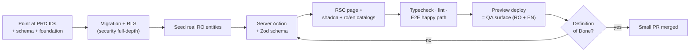
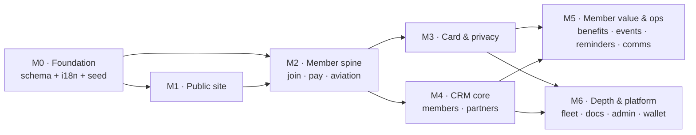
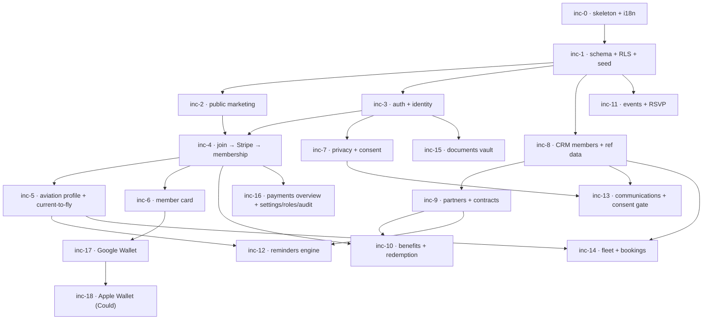
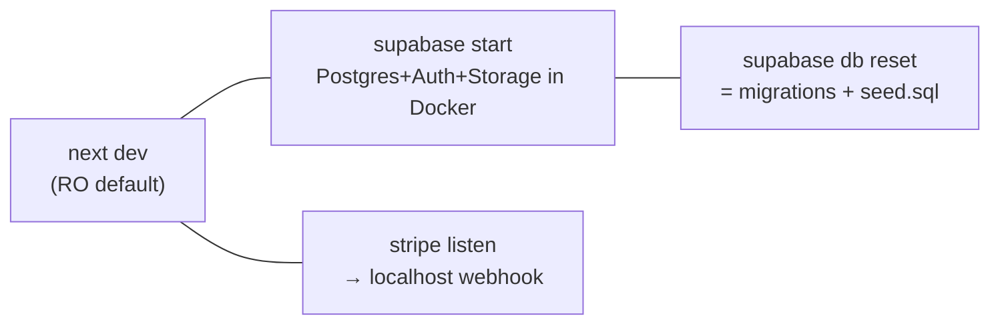

# Aeroskill Club — Implementation Plan

> How one developer, working with Claude Code, slices the locked scope into shippable vertical increments — build philosophy, milestones, workflow, quality bar, and dependency sequencing.

_Part of the Aeroskill Club planning set — read alongside 00-foundation.md._

---

## 1. Purpose & how this document relates to the others

This is the **build plan**: the bridge between *what* we are building (the PRD `04-prd.md`, the schema `06-database-schema.md`, the infrastructure `09-technical-infrastructure.md`) and *when* it happens (the roadmap `10-roadmap.md`). It does not re-derive requirements, tables, or stack choices — those are locked upstream and referenced by ID. It answers a narrower question:

> **Given the locked Next.js 15 + Supabase + Stripe stack, the hybrid Party model, and the three tiers (Cadet / Aviator / Comandant), in what order does a solo developer with Claude Code cut the work so that every step ships something usable, nothing is built before its dependency exists, and the concept stays inside one person's reach?**

| This document owns | This document defers to |
|---|---|
| Build philosophy (vertical slices, thin-then-deepen, scope discipline) | The roadmap `10` for calendar/effort sequencing |
| How to drive Claude Code (spec-first, small PRs, seed-first) | The PRD `04` for the testable requirement text |
| The scope sliced into increments mapped to PRD IDs + foundation MoSCoW | The schema `06` for column-level table definitions |
| A milestones table with entities, features, and exit criteria | The infra doc `09` for environments/secrets internals |
| Environment & workflow setup, quality/testing approach, Definition of Done | The IA `05` and flows `07` for navigation and step-by-step UX |

Where the roadmap `10` sequences **time and effort**, this plan sequences **construction logic and verification** — the two are aligned (same milestone names, same dependency arrows) but never duplicated.

---

## 2. Build philosophy

### 2.1 Five operating principles

| # | Principle | What it means for this build |
|---|---|---|
| P1 | **Vertical slices, not horizontal layers** | Every increment cuts top-to-bottom through schema → RLS → Server Action → RSC page → i18n catalog → a test, and ends with something a human can *use* in the browser. We never build "all the tables" then "all the screens". The first slice that touches a domain ships a usable thread through it. |
| P2 | **Thin slice, then deepen** | First pass through a feature is the happy path in both locales with the Must behaviour only. Depth (edge cases, Should/Could behaviours, polish) is a *later* pass over the *same* code, not a prerequisite for the next feature. Aviation profile ships as "add one license" before it grows ratings, medicals, and the "current to fly" computation. |
| P3 | **Concept scope discipline** | We build to the PRD's MoSCoW. **Must** is the contract. **Should** lands only when the Must set is solid. **Could** (Apple Wallet `MEM-023`, member self-booking) is modelled/stubbed, never fully built. **Won't-now** (real e-Factura submission, real flight hire, Payload migration, Netopia) is explicitly out and flagged in the UI where a visitor might expect it. The temptation that kills solo concepts is gold-plating a Should before the Musts are demonstrable. |
| P4 | **Seed-data-first** | The real Romanian entities (Clinceni LRCN, Strejnic LRPV, Tuzla LRTZ, Regional Air Services, AOPA Romania, BGAA, AACR/SAUM/EASA/ROMATSA authorities) are loaded as `supabase/seed.sql` *before* the screens that display them. Building a member list against an empty table is guesswork; building it against 40 seeded credible members is verification. Seed data is the standing fixture for every preview deploy and every manual QA pass. |
| P5 | **The database is the security boundary** | RLS is written *in the same slice* as the table, never "added later". A slice is not done if its tables are readable without a policy. `auth.uid()` → `current_party_id()` is the spine; every member-facing table gets its owner-scoped policy at birth (foundation §11, infra §5.3). This is the one place where "thin slice" does **not** apply — security is built full-depth from the first row. |

### 2.2 What "usable" means per slice

A slice ships usable value when, on a preview URL with seed data, a human in the relevant role can complete one real thread end-to-end in **both RO and EN**. Examples:

- *Public tiers slice:* a visitor lands on `/ro/membri`, sees the three tiers with correct RON-primary prices, toggles monthly/annual, and the Aviator card is flagged "Cel mai popular".
- *Join slice:* a visitor picks Cadet, signs up, verifies email, and lands on a (stub) dashboard with a member record created — no payment.
- *Member card slice:* an Aviator member opens `/ro/card`, sees a web card with the brass accent, member number in IBM Plex Mono, and a working QR that resolves to a status endpoint.

A slice that produces only a migration, or only a component with no route, is **not** a slice — it is a fragment, and fragments are where solo builds stall.

### 2.3 Why this fits a solo Claude Code build

The locked stack is chosen so a single developer never operates infrastructure (infra §1, §14): managed Supabase/Stripe/Resend/Vercel, near-zero ops, ~$0–10/mo at concept scale. The implementation plan inherits that discipline — small surface area, one repo, three route groups, no service the foundation does not list (`NFR-014`). Vertical slices keep each unit small enough to specify, generate, review, and verify in one focused session, which is exactly the granularity Claude Code is strongest at.

---

## 3. Working with Claude Code effectively

The build method *is* the plan as much as the slices are. Six practices keep a solo + Claude Code loop fast and correct.

### 3.1 Spec-driven, not vibe-driven

Each slice begins by pointing Claude Code at the **exact PRD requirement IDs** and **schema sections** it implements, plus the relevant foundation clauses. Claude Code does not infer the tier prices, the SAUM-vs-AACR distinction, or the bilingual column convention — it reads them from the locked docs. The prompt for a slice names: the PRD IDs (e.g. `MEM-009..011`), the schema tables (`licenses`, `ratings`, `medical_certificates`), the Definition of Done (§9), and the acceptance criteria to satisfy. This turns the planning set into the spec and removes guesswork.

### 3.2 Small PRs, one slice each

One slice = one branch = one preview deploy = one review = one merge (infra §10.2). A PR that spans two domains is split. Small PRs mean the preview URL reviews one coherent thread, the migration diff is legible (`supabase db diff` in CI), and a regression has one place to hide. The solo reviewer (you) uses the **preview URL as the QA surface**, not the diff alone.

### 3.3 Seed-data-first, generated from real entities

Before UI for a domain, Claude Code authors or extends `supabase/seed.sql` with the foundation §8 entities. The seed is not throwaway: it is the demo dataset the PRD success criteria require (`04` §1.3) and the fixture every E2E test runs against. Order is always **migration → RLS → seed → action → page**.

### 3.4 Generate shadcn components, own the code

UI primitives come from `shadcn/ui` (Radix-backed, WCAG 2.2 AA) generated into the repo and themed by the single token file (foundation §12, infra §3). We *own* the component code, so Claude Code edits it directly — no waiting on an upstream version. Brand components (member card, tier card, attitude-indicator divider, compliance widget) compose shadcn primitives; they are built once and reused across surfaces.

### 3.5 Zod at every trust boundary, types end-to-end

Every Server Action validates input with a **Zod** schema before it touches Postgres (`NFR-006`); the same schema drives the React Hook Form on the client. Database types are generated from the Supabase schema so the action, the RSC, and the form share one source of truth. Claude Code is asked to write the Zod schema *with* the action, not after.

### 3.6 The skill loop

A standing project skill (a `CLAUDE.md` plus reusable prompts) encodes the non-negotiables so they are reinjected every session: RO-default + bilingual catalogs from day one (`XC-031`), money as `amount_minor + currency` (`NFR-015`), soft-delete + audit columns everywhere relevant, RLS-on-by-default, no hardcoded copy, the SAUM-issues-ULM rule, and the "design for the longer Romanian string" reflex (`XC-035`). This is how a solo dev keeps a ten-document spec coherent across dozens of slices.

---

## 4. Scope sliced into build increments

The work is cut into **increments** grouped under milestones (§5). Each increment maps to PRD requirement IDs and inherits their foundation MoSCoW tag. Increments are ordered by **construction dependency**, not by surface — though the dependency graph happens to favour *public → member → admin* (see §6).

### 4.1 Increment catalogue

| Inc | Increment | Primary PRD IDs | Schema tables | MoSCoW | Ships (usable thread) |
|---|---|---|---|---|---|
| **0** | Project skeleton & i18n spine | `XC-030..033`, `NFR-014` | — | Must | App boots; `/ro` default, `/en` peer; empty themed shells for all 3 route groups; catalogs wired |
| **1** | Schema foundation + RLS + seed | `XC-038`, `NFR-010`, `ADM-027` (data) | `parties`, `person_profiles`, `organization_profiles`, `party_roles`, `party_relationships`, `contact_channels`, `addresses`, `users`, `authorities`, `aerodromes`, `reference_data`, `membership_tiers` | Must | Migrations apply; RLS on; seed loads real RO entities; tiers seeded with locked prices |
| **2** | Public marketing core | `PUB-001..004`, `PUB-010..013` | reads `membership_tiers` | Must | Home, mission, tier comparison (RON-primary, Aviator "Cel mai popular"), contact, legal, hreflang, SEO |
| **3** | Auth + identity + member shell | `MEM-001..006`, `XC-036`, `XC-001` | `users` ↔ `parties` trigger, `person_profiles` | Must | Sign-up → verify → login → land on member dashboard; one Party per human |
| **4** | Join → Stripe Checkout → membership | `PUB-008`, `MEM-014..017`, `XC-002`, `XC-039`, `NFR-009` | `memberships`, `payments`, `invoices` (webhook writes) | Must | Visitor picks tier → Cadet completes free / Aviator+Captain via hosted Checkout → webhook creates membership idempotently |
| **5** | Aviation profile + "current to fly" | `MEM-008..013`, `XC-... (sensitive)`, `NFR-007` | `licenses`, `ratings`, `medical_certificates`, `aviation_profiles` | Must | Member records license (SAUM for ULM, AACR for Part-FCL), ratings, medical; dashboard shows computed "current to fly" |
| **6** | Digital member card | `MEM-020..021`, `XC-003`, `XC-043` | `member_cards` | Should | Web + PDF card with tier accent, member number, QR → status endpoint |
| **7** | Privacy center + consent ledger | `MEM-029..032`, `XC-040..042`, `PUB-011` | `consents` (append-only) | Must | Member sets granular consent, withdraws (new row), requests export & erasure; lawful-basis disclosed |
| **8** | Admin CRM core (members + reference data) | `ADM-003..006`, `ADM-027`, `XC-037` | reads/writes Domain A, `reference_data`, `authorities`, `aerodromes` | Must | Staff browse/search/create/edit/soft-delete members; manage controlled vocabularies + validity windows |
| **9** | Partners + contracts + renewals | `ADM-007..012`, `PUB-007` | `contracts`, `contract_documents`, `party_roles`, `party_relationships`, `attachments` | Must | Staff manage partner orgs (ATO/DTO), contracts with renewal chains; public sponsors showcase reads flagged partners |
| **10** | Benefits catalog + eligibility + redemption | `PUB-006`, `MEM-024..025`, `ADM-013..015` | `benefits`, `benefit_tier_eligibility`, `redemptions` | Should | Admin manages benefits + tier depth; member redeems eligible benefit → ledger row; public preview |
| **11** | Events + RSVP | `MEM-026..027`, `ADM` events mgmt | `events`, `event_rsvps` | Should | Admin publishes event; member RSVPs with capacity + tier-priority |
| **12** | Reminders engine + transactional email | `MEM-019`, `XC-045`, `ADM-002` | reads aviation + airworthiness + contracts | Should | Vercel Cron scans expiries → Resend reminders (RO/EN); CRM compliance/expiry widget |
| **13** | Communications (activities, segments, campaigns, consent gate) | `ADM-016..019` | `activities`, `segments`, `campaigns`, `campaign_recipients` | Should | Staff log activity, build segment, send campaign gated by marketing consent |
| **14** | Fleet (aircraft, ARC, insurance, maintenance, hours, bookings) | `ADM-020..025` | `aircraft`, `aircraft_airworthiness`, `aircraft_insurance`, `maintenance_logs`, `flight_logs`, `bookings` | Should | Staff manage fleet; ARC/insurance feed compliance widget; booking is modelled (no-overlap, eligibility-gated) and labelled not-a-launch-promise |
| **15** | Documents vault + attachments | `MEM-028`, `ADM-011` (shared) | `attachments`, Storage buckets | Should | Member uploads license/medical scans to private bucket via signed URL; RLS-scoped |
| **16** | Subscriptions & payments overview + settings/roles/audit | `ADM-001`, `ADM-026`, `ADM-028..030` | reads billing; `roles`, `user_roles`, `audit_logs` | Should | CRM KPI dashboard; staff per-module permissions; append-only audit log |
| **17** | Google Wallet pass | `MEM-022` | `member_cards.wallet_google_object_id` | Should | Member adds card to Google Wallet (free) |
| **18** | Apple Wallet pass | `MEM-023` | `member_cards.wallet_apple_serial` | Could | `.pkpass` generated when capability enabled; otherwise hidden |

> **MoSCoW alignment:** each increment's tag matches the PRD requirement and foundation §6 inventory it implements. One nuance: the base member card + QR (inc-6) is not itself tagged in §6; it is treated as Should because its only tagged sub-features — Google Wallet [S] (inc-17) and Apple Wallet [C] (inc-18) — are Should/Could, so the parent artifact inherits the higher (Should) tag. The Must increments (0–5, 7, 8, 9) form the demonstrable concept spine; Should increments deepen it; the single Could (18) is gated behind the paid Apple program (infra §14) and modelled-only.

### 4.2 Out-of-scope guards built into the slices

The "Won't-now" register (PRD §12) is enforced *in the build*, not just on paper:

- **Flight hire** — increment 14 ships booking as a **CRM capability** with a visible UI note "modelled, not a launch flight-access promise" (`ADM-025`, foundation §13, item 6). Dues never bundle flying spend.
- **e-Factura submission** — increment 4's `invoices` rows are e-Factura-*ready* (issuer/buyer fiscal IDs, line items, VAT, `submission_status`) but v1 issues *cotizație* receipts only; no ANAF submission code is written.
- **Payload CMS / Netopia** — content stays MDX in-repo; payments stay Stripe-only. No stub for either beyond the documented migration path.

---

## 5. Milestones

Increments group into seven milestones. Each milestone ends with a demonstrable, deployable state on a preview URL with seed data. (Calendar/effort sizing lives in the roadmap `10`; this table is the *construction* contract.)

| Milestone | Increments | Key deliverables | Entities / features | Exit criteria |
|---|---|---|---|---|
| **M0 · Foundation** | 0, 1 | One Next.js 15 repo; `[locale]` routing RO-default; three themed route-group shells; full schema migrations; RLS on every table; seed of real RO entities; tiers seeded with locked prices | All Domain A + reference + `membership_tiers` | App boots in RO & EN; `supabase db reset` rebuilds schema + seed clean; every table has an explicit RLS policy (no policy ⇒ deny); typecheck + lint green in CI |
| **M1 · Public site** | 2 | Marketing surface a visitor can browse and trust | reads `membership_tiers`; SEO/i18n | Home, mission, tier table, contact, legal live in RO & EN; Aviator flagged "Cel mai popular"; prices render `490 lei` / `1.490 lei` / `4.990 lei` via `Intl ro-RO`; hreflang + sitemap present; Core Web Vitals within `NFR-001` |
| **M2 · Member spine** | 3, 4, 5 | A human joins, pays, and manages their aviation credentials | `users`↔`parties`, `memberships`, `payments`, `invoices`, `licenses`, `ratings`, `medical_certificates`, `aviation_profiles` | Visitor → Cadet free OR Aviator/Captain via Stripe Checkout → membership created idempotently by webhook; member records credentials with SAUM/AACR distinction enforced; dashboard shows computed "current to fly"; member sees only own rows (RLS verified) |
| **M3 · Card & privacy** | 6, 7 | The tangible membership artifact + the GDPR backbone | `member_cards`, `consents` | Web + PDF card reflects live tier with correct accent + member number; QR resolves to status endpoint exposing no personal data; granular consent grant/withdraw appends ledger rows; export + erasure request flows work; privacy notice discloses processors/residency |
| **M4 · CRM core** | 8, 9 | A solo operator can run members and partners | Domain A writes, `contracts`, `contract_documents`, reference data | Staff search/create/edit/soft-delete members; manage partner orgs with ATO/DTO + relationships; contracts with renewal chains; public sponsors showcase reads flagged partners; reference vocab (incl. rating validity windows) editable as data |
| **M5 · Member value & ops** | 10, 11, 12, 13 | The features that make membership *feel* worth paying for + the co-pilot reminders | `benefits`, `benefit_tier_eligibility`, `redemptions`, `events`, `event_rsvps`, `activities`, `segments`, `campaigns`, `campaign_recipients` | Member redeems an eligible benefit (ledger row, tier-depth honoured); RSVPs to a seeded event with capacity/priority; expiry reminders fire via Resend in member's locale; campaign send excludes non-consented recipients with a visible count |
| **M6 · Depth & platform** | 14, 15, 16, 17, 18 | Fleet, documents, admin platform, and the wallet bridge | `aircraft` + airworthiness/insurance/maintenance/hours/bookings, `attachments`, `roles`/`user_roles`/`audit_logs`, wallet refs | Fleet records feed compliance widget; ARC capped at ×2 extensions; member uploads scans to private bucket via signed URL; CRM KPI dashboard + per-module staff permissions + append-only audit log; Google Wallet add works; Apple Wallet stubbed behind capability flag |

---

## 6. Per-surface build approach & why this order

The dependency graph (§7) drives a **public → member → admin** rhythm, deliberately interleaved rather than strictly sequential.

### 6.1 Public first — but only the marketing core

The public tier table (`PUB-004`) reads `membership_tiers`, which M0 seeds. Building public marketing first means the **earliest possible demonstrable artifact** (a credible landing page) and forces the i18n spine, theme tokens, and `Intl ro-RO` money formatting into existence before anything authenticated needs them. It is low-risk, high-signal, and validates the brand on a real URL. The join *funnel* (`PUB-008`) is public-surface but deferred to M2 because it depends on auth + Stripe.

### 6.2 Member second — the value spine

The member area is the heart of the product and the hardest dependency knot: auth (M2/inc-3) must exist before the join funnel (inc-4), which must exist before a member can have a tier to show on a card (M3/inc-6) or gate benefits by (M5/inc-10). We build the member spine — *join → pay → aviation profile* — before the CRM because:

1. **The CRM mostly reads what members create.** A member 360° view (`ADM-004`) is empty until members exist. Seed data bridges this for early CRM work, but real flow integrity (`XC-001`: one Party across surfaces) is proven member-first.
2. **The hardest external integration (Stripe webhooks, `XC-002`/`NFR-009`) lives here.** Tackling idempotent billing sync early de-risks the whole concept; everything downstream assumes membership state is correct.
3. **Sensitive-data RLS (`NFR-007`) is exercised first** on licenses/medicals, setting the security pattern the CRM inherits.

### 6.3 Admin third — built on a populated database

By M4 the database holds seeded *and* member-created rows, so the CRM is built against realistic data from the first screen. The CRM is mostly TanStack Table list/detail patterns (infra §3) over tables that already exist with RLS — fast to build once the spine is solid. Partners/contracts (inc-9) precede benefits (inc-10) because a benefit's `providing_party_id` points at a partner org, and the public sponsors showcase (`PUB-007`) reads partner records.

### 6.4 Cross-surface threads

Three threads are built once and span surfaces, so they are slotted where their dependency first resolves:

| Thread | Built in | Spans |
|---|---|---|
| **i18n / RO-default / catalogs** (`XC-030..035`) | M0 | all three surfaces from day one |
| **Single Party identity** (`XC-001`) | M2 inc-3 | public join → member area → CRM member |
| **Member card reflects live membership** (`XC-003`) | M3 inc-6, kept live by inc-4 webhooks | member area + (status endpoint) public verify |

---

## 7. Sequencing dependencies

What must precede what — the construction logic behind the milestone order.

### 7.1 Hard prerequisites (cannot be reordered)

| Increment | Requires | Why |
|---|---|---|
| inc-1 schema | inc-0 skeleton | migrations need the Supabase project + repo wired |
| inc-4 join/pay | inc-3 auth **and** inc-2 tier display | a join selects a tier (public) and creates an account (auth) |
| inc-5 aviation | inc-4 membership | the member context owns the aviation records; dashboard hosts "current to fly" |
| inc-6 card | inc-4 membership | the card snapshots tier + period from `memberships` (`XC-003`) |
| inc-10 benefits | inc-4 **and** inc-9 | eligibility keys off tier (membership); `providing_party_id` keys off a partner |
| inc-12 reminders | inc-5 **and** inc-9 | scans aviation expiries + contract renewals |
| inc-13 campaigns | inc-7 **and** inc-8 | consent gate needs the ledger; recipients are parties |
| inc-17 → inc-18 | inc-6 card | wallet passes serialise an existing card |

### 7.2 Soft dependencies (smoother if ordered, not blocking)

- **Seed data (inc-1)** unblocks CRM screens (inc-8+) before members self-register — staff lists are credible from the first commit.
- **Compliance/expiry widget (`ADM-002`)** is more useful after fleet (inc-14) and contracts (inc-9) exist, but its first version (member ratings/medicals) can ship with inc-12.
- **Settings → Stripe Price mapping (`ADM-028`)** ideally exists before inc-4, but inc-4 can ship with prices mapped in config and migrate to the settings table in inc-16 (`NFR-015` keeps them data-driven either way).

---

## 8. Environment & workflow setup

Inherits infra §10 (three environments, CI/CD, secrets). This section is the *operational checklist* a solo dev runs.

### 8.1 Local development loop

- `supabase start` runs the full stack in Docker offline (infra §5.1); `supabase db reset` replays migrations + `seed.sql` to a clean, credible database in seconds.
- `stripe listen --forward-to localhost/api/webhooks/stripe` forwards **test-mode** events so the join flow (inc-4) is debuggable without a deploy.
- Local `.env.local` holds dev secrets; never committed (infra §10.3).

### 8.2 Migrations & promotion

- Migrations are timestamped SQL under `supabase/migrations/`, the **single source of truth** — never click-edit a hosted table (infra §5.1).
- CI runs `supabase db diff` to catch schema drift before merge; prod migrations apply only after merge to `main` (infra §10.2).
- Each schema-touching slice authors its migration **and** its RLS policies **and** any seed additions in the same PR.

### 8.3 Preview deploys as the QA surface

Every PR gets a Vercel preview URL against a Supabase preview project seeded with the same real RO entities (infra §10.1). The preview URL — not the diff — is where a slice is verified in **both locales**. This is the solo dev's stand-in for a QA team.

### 8.4 Seed dataset (the standing fixture)

`supabase/seed.sql` loads, at minimum:

- **Authorities:** AACR, EASA, ROMATSA, **SAUM** (flagged as ULM issuer inside Aeroclubul României).
- **Aerodromes:** Clinceni **LRCN**, Strejnic **LRPV**, Tuzla **LRTZ**, Băneasa, plus territorial sites.
- **Partner orgs:** Regional Air Services (Tuzla, ATO, `RO/ATO-06`), Aeroclubul României, AOPA Romania, BGAA.
- **Tiers:** Cadet / Aviator / Comandant with locked prices, both billing periods so the public monthly/annual toggle and the M1 exit criteria are backed by seed data (`price_month_minor` 0 / 4900 / 14900 bani alongside `price_year_minor` 0 / 49000 / 149000 bani; Founding/Life one-time 499000).
- **Demo members:** a spread across tiers and disciplines (a Cadet enthusiast, an Aviator PPL with SEP+Night, a Captain owner/instructor with a YR- aircraft) so all three surfaces render credibly and "current to fly" has both current and lapsed cases.

---

## 9. Quality & testing approach (concept-appropriate)

Calibrated to a concept/portfolio build: **rigorous where correctness is load-bearing (security, billing, i18n, accessibility), lightweight where the cost of a bug is cosmetic.** No 100%-coverage theatre.

### 9.1 The standing gates (every PR)

| Gate | Tool | Catches |
|---|---|---|
| **Typecheck** | `tsc` | type drift between schema, action, and UI |
| **Lint/format** | ESLint or Biome | style + a custom rule flagging hardcoded user-facing strings (`XC-031`) |
| **Schema diff** | `supabase db diff` | migration drift before deploy |
| **Input validation** | Zod schemas | every Server Action re-validates server-side (`NFR-006`); YR- registration + ICAO codes match patterns |
| **A11y automated** | axe in CI | WCAG 2.2 AA regressions on key pages (`NFR-012`) |

### 9.2 E2E happy paths (a few, not many)

A small Playwright suite covers the threads where a regression is expensive, run against the seed dataset in **both RO and EN**:

1. **Join → pay → card** (`PUB-008` → `MEM-017` → `XC-003`) — the money path, with Stripe test mode.
2. **Login → record license/rating/medical → "current to fly"** (`MEM-009..013`) — the domain-credibility path, including the SAUM/AACR distinction.
3. **Benefit redemption by an eligible member** (`MEM-025`) — the value path + tier gating.
4. **Consent withdraw → campaign excludes recipient** (`MEM-030` → `ADM-019`) — the GDPR path.
5. **RLS isolation** — a member request for another member's row is denied (`XC-038`), asserted at the data layer.

### 9.3 Manual QA checklist (per milestone, both locales + both themes)

- **Pseudo-localization for RO:** every screen reviewed with real Romanian copy (~15–30% longer than EN, `XC-035`) — no truncation, no clipping, no overflow; comma-below **ș/ț** and **ă/â/î** render without tofu (Space Grotesk → Inter fallback, `XC-032`).
- **Money & dates:** RON-primary, EUR secondary; `1.490 lei`, `28.06.2026`, 24h via explicit `Intl` locales (`XC-033`) — no locale-naive `toLocaleString()`.
- **Theme correctness:** public = light, member/admin = dark "cockpit"; tier accents (Cadet sky, Aviator brass, Captain navy+brass) correct on the card.
- **Accessibility manual pass:** keyboard nav + screen-reader on join, login, card, redemption, RSVP; status never colour-only (icon + label, `XC-044`); visible 3:1 focus ring.
- **RLS smoke:** log in as each role on the preview and confirm the data boundary by hand.

### 9.4 What we deliberately do **not** do (concept scope)

Load/performance testing beyond Core Web Vitals; penetration testing; exhaustive unit coverage of presentational components; real Stripe live-mode transactions; real ANAF e-Factura submission; real ANSPDCP filing. These are flagged as production work, not concept work (foundation §11).

---

## 10. Definition of Done (per slice)

A slice is **Done** only when **all** of the following hold on its preview URL with the seed dataset. This is the checklist Claude Code is handed at the start of each slice.

- [ ] **Maps to spec** — implements the named PRD requirement IDs; acceptance criteria (Given/When/Then) demonstrably pass.
- [ ] **Vertical & usable** — a human in the relevant role completes the slice's thread end-to-end in the browser.
- [ ] **Bilingual** — works natively in **RO and EN**; all copy from `ro.json`/`en.json` (no hardcoded strings, `XC-031`); RO layout does not clip (`XC-035`); diacritics correct (`XC-032`).
- [ ] **Locale-correct formatting** — money RON-primary via `Intl ro-RO`; dates `dd.mm.yyyy`, 24h (`XC-033`).
- [ ] **Secure by construction** — every new table has RLS enabled with explicit policies; members reach only their own rows; sensitive fields (license number, medical class) RLS-scoped and never on card/QR (`NFR-007`, `XC-038`); secrets server-side only.
- [ ] **Validated** — Server Actions Zod-validate input server-side; forms validate client-side with the same schema (`NFR-006`).
- [ ] **Audited & soft-deletable** — operational tables carry audit columns and `deleted_at` where the convention applies; ledgers (payments, redemptions, consents, audit) are append-only (`NFR-010`).
- [ ] **Accessible** — meets WCAG 2.2 AA in both themes; axe clean; keyboard + focus verified for interactive parts (`XC-044`).
- [ ] **Migration-clean** — `supabase db reset` rebuilds schema + seed with no manual steps; `supabase db diff` shows no drift.
- [ ] **Gates green** — typecheck, lint, and the relevant E2E happy path pass in CI.
- [ ] **Scope-honest** — anything modelled-only (booking, e-Factura) is labelled as such in the UI where a user would otherwise expect a live feature.

A slice that ships a migration without a policy, an English-only screen, or a Server Action without Zod is **not Done** — it is reopened, not merged.

---

## 11. Summary

| Pillar | Decision |
|---|---|
| **Philosophy** | Vertical slices that each ship a usable bilingual thread; thin-then-deepen; strict MoSCoW discipline; seed-data-first; the database is the security boundary |
| **Method** | Spec-driven (point Claude Code at PRD IDs + schema + foundation); small one-slice PRs; preview URL as QA surface; Zod at every boundary; a standing skill that reinjects the non-negotiables |
| **Order** | M0 foundation → M1 public → M2 member spine → M3 card & privacy → M4 CRM core → M5 member value & ops → M6 depth & platform; public→member→admin driven by dependency, not preference |
| **Quality** | Standing gates (typecheck, lint, schema diff, Zod, axe); a few E2E happy paths in RO+EN; per-milestone manual QA incl. RO pseudo-localization; explicitly not production-hardened |
| **Done** | An 11-point per-slice checklist; reopened, not merged, until every point holds on the preview with seed data |

Everything here inherits the locked vocabulary, prices, entities, and stack of `00-foundation.md`, expands the requirements in `04-prd.md`, builds on the schema in `06-database-schema.md` and the infrastructure in `09-technical-infrastructure.md`, and is sequenced in time by `10-roadmap.md`. Where a real legal/tax/payment decision is required, it is **flagged, not solved**, consistent with the concept's scope.
