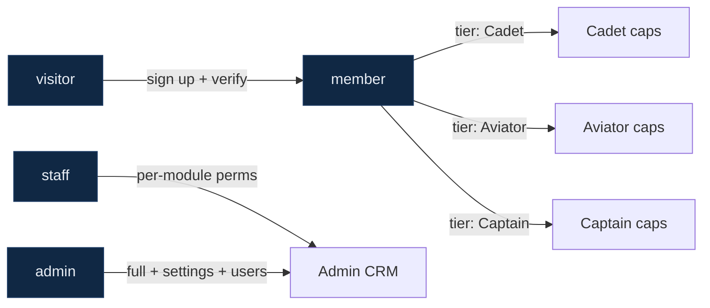
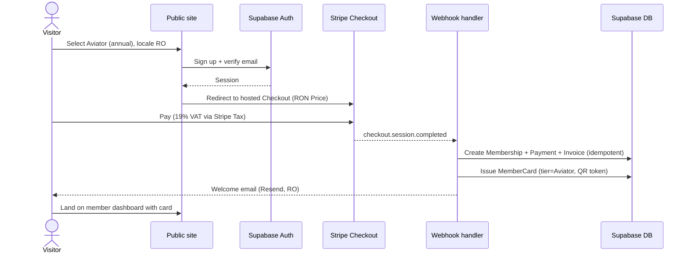
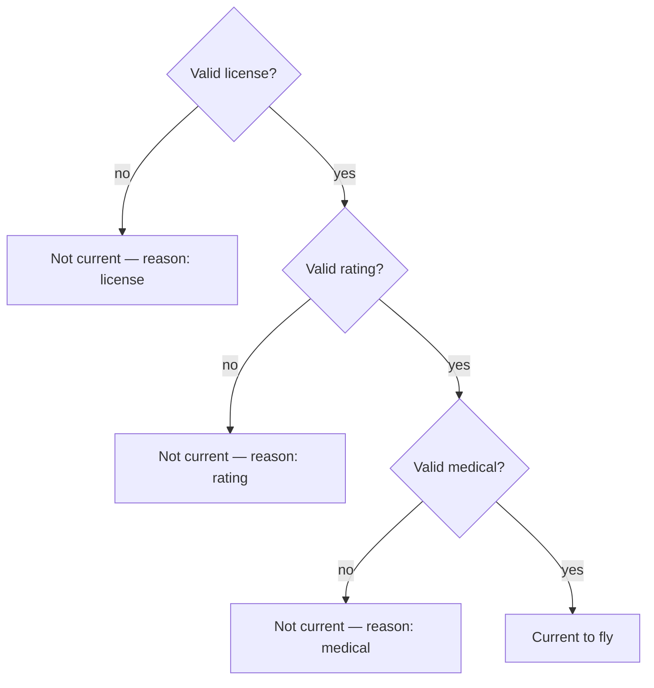
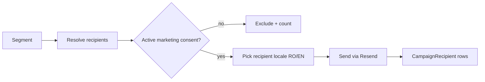

# Aeroskill Club — Product Requirements Document (PRD)

> The build contract: every feature in the foundation inventory expanded into stable, testable requirements with MoSCoW priority and acceptance criteria, organized by surface.

_Part of the Aeroskill Club planning set — read alongside 00-foundation.md._

---

## 1. Overview, goals & how to read this document

### 1.1 What this document is

This PRD is the **detailed, testable contract** the build follows. It takes the locked decisions in `00-foundation.md` — the three tiers (Cadet / Aviator / Captain), the hybrid Party data model, the Romanian/EASA domain vocabulary, and the Next.js 15 + Supabase + Stripe stack — and expands every feature in the foundation's **§6 feature inventory** into individually addressable requirements.

Where the foundation says *what* and *why*, this PRD says *exactly what behaviour must exist and how we will know it works*. It does not re-derive personas, prices, or entity names — those are locked upstream. It does not specify visual design (see `08-design-system.md`), screen-by-screen flows (see `07-user-flows.md`), or the database column list (see `06-database-schema.md`); it references them.

### 1.2 Product goals (the bar each requirement serves)

| # | Goal | What "good" looks like |
|---|------|------------------------|
| G1 | **Credible Romanian GA club** | A real Romanian pilot recognises the vocabulary (AACR vs SAUM, LAPL vs ULM, ARC, YR-) and trusts it. |
| G2 | **Bilingual-first, RO default** | Every screen, email, document and error works natively in Romanian and English; no machine-translated copy; longer RO strings never break layout. |
| G3 | **Frictionless join → pay → card** | A visitor can go from landing page to a working digital member card in under five minutes, in either language. |
| G4 | **Self-service member area** | Members manage profile, aviation credentials, subscription, payments, benefits, events and privacy without contacting staff. |
| G5 | **A CRM a solo operator can actually run** | One admin can manage members, partners, contracts, benefits, communications and fleet, and see at a glance what is expiring. |
| G6 | **Compliance posture by construction** | GDPR consent, data residency disclosure, RLS isolation and e-Factura-ready invoicing are built in, not retrofitted. |
| G7 | **Buildable solo with Claude Code** | Scope and complexity stay within one developer's reach; every "Must" is achievable on the locked stack. |

### 1.3 Success criteria (concept-level acceptance)

The concept is "done" when: all **[M]** (Must) requirements pass their acceptance criteria in both locales; a demo dataset seeded from the foundation's real entities (Clinceni LRCN, Regional Air Services, AOPA Romania, etc.) populates all three surfaces; and the cross-cutting and non-functional requirements in §10–§11 hold.

### 1.4 Requirement ID scheme

Every requirement has a **stable ID** that never changes once assigned (gaps left on removal, never renumbered):

- `PUB-###` — public marketing site
- `MEM-###` — authenticated member area
- `ADM-###` — admin CRM
- `XC-###` — cross-cutting (applies to two or more surfaces)
- `NFR-###` — non-functional requirement

> **XC numbering:** `XC-001..003` are the member↔CRM data-flow integrity requirements (§7) and `XC-030..045` are the broader cross-cutting requirements (§10); `XC-004..029` are intentionally reserved (left as a gap, never renumbered) to leave room for future §7 data-flow requirements.

Each requirement carries a **MoSCoW** tag inherited from or refined against the foundation's feature inventory:

| Tag | Meaning for the concept build |
|-----|-------------------------------|
| **Must** | Required for the concept to be coherent and demonstrable. |
| **Should** | High value; included if the Must set lands with room. |
| **Could** | Later phase; modelled/stubbed but not fully built. |
| **Won't (now)** | Explicitly out of scope for the concept — see §12. |

Acceptance criteria use **Given / When / Then** where a behaviour is conditional, and plain assertions otherwise.

### 1.5 Reading conventions

- Romanian labels are shown inline as `RO: …` where the exact string matters; all copy lives in `next-intl` catalogs (`ro.json` / `en.json`), never hardcoded.
- "Tier" always means one of Cadet / Aviator / Captain. "Role" always means one of `visitor` / `member` / `staff` / `admin`.
- "Current to fly" is the **computed** state from the foundation §8: valid license **AND** valid rating **AND** valid medical — never a single stored flag.

---

## 2. In scope vs out of scope

### 2.1 In scope (this concept build)

- Three surfaces in one Next.js 15 repo: **public site**, **member area**, **admin CRM**.
- Full bilingual RO/EN with `/ro` `/en` routing and hreflang.
- The complete foundation **§6 feature inventory** at its stated MoSCoW levels.
- Stripe-hosted Checkout + Customer Portal + Billing for the three tiers, RON-primary.
- Supabase Auth + Postgres + Storage + RLS (EU/Frankfurt).
- Digital member card (web + PDF + QR), with Google Wallet as a Should and Apple Wallet as a Could.
- GDPR consent center, data export and erasure request flow.
- Demo/seed data drawn from the foundation's real Romanian entities.

### 2.2 Out of scope (concept — see §12 for the full register)

- Real legal/tax/payment contracts; production e-Factura submission to ANAF; real ANSPDCP filings.
- Actual flight *access/hire* as a membership promise (fleet & booking are **modelled and shown** as a CRM capability only; dues ≠ flying spend — foundation §4, §13.6).
- Native mobile apps (the platform is responsive web; wallet passes bridge to phones).
- Payload CMS migration (MDX in-repo for the concept); Netopia mobilPay (future RON-native fallback).
- Automated insurance/legal advocacy *fulfilment* (Captain advocacy is presented and tracked, not automated).
- AI/ML features, public API for third parties, multi-club/white-label tenancy.

---

## 3. Personas & roles (reference)

Personas are **defined in `00-foundation.md` §2** and not re-derived here. Summary mapping for traceability:

| Persona | Foundation ref | Primary surface | Likely tier | Drives requirements like |
|---------|----------------|-----------------|-------------|--------------------------|
| Andrei (aspiring pilot) | §2 | Public → Member | Cadet → Aviator | Join funnel, free tier, community, expiry reminders |
| Ioana (active PPL) | §2 | Member | Aviator | Aviation profile, benefits, rating-expiry reminders, member directory |
| Mihai (owner/instructor) | §2 | Member + CRM-adjacent | Captain | Concierge, premium card, fleet/aircraft records, advocacy |
| Elena (enthusiast) | §2 | Public → Member | Cadet | Events, fly-ins, newsletter |
| Partner org | §2 | Admin CRM | n/a | Partner records, contracts, benefit provision, redemptions |
| Staff / Admin | §5 | Admin CRM | n/a | All ADM-### requirements |

**Roles (RBAC, foundation §5):** `visitor` (unauthenticated) · `member` (tier-scoped) · `staff` (per-module CRM permissions) · `admin` (full CRM + settings + users). Auth via Supabase Auth; `auth.uid()` drives RLS. The role × surface × capability matrix is owned by `05-information-architecture.md`; cross-cutting RBAC rules are in §10.2 here.

---

## 4. Functional requirements — Public marketing site (`PUB-###`)

Default theme: **light**. Locale-prefixed routes `/ro/...` (default) and `/en/...`. All copy from catalogs. Server-rendered for SEO.

### 4.1 Home / hero & value proposition

**PUB-001 — Home hero with value proposition · Must**
The landing page presents the club's positioning ("ACR for pilots, done modern" — foundation §3) with a primary CTA to join and a secondary CTA to explore tiers.
- Given a visitor opens `/` , When no locale is set, Then they are routed to `/ro` (Romanian default) with the hero rendered server-side.
- The hero shows the logo wordmark, a one-line bilingual value proposition, and two CTAs: primary `RO: Devino membru` / `EN: Become a member` → join; secondary `RO: Vezi planurile` / `EN: See plans` → tiers.
- Then the page achieves LCP within the NFR budget (§11.1) on a cold load.
- The aircraft silhouette / horizon motif appears as a brand stamp without blocking text contrast (WCAG AA).

**PUB-002 — Home content sections · Must**
Below the hero, the home page surfaces: mission teaser, three-tier summary, featured benefits preview, sponsor logos, and a final join CTA.
- Each section links to its full page (mission, tiers, benefits, sponsors).
- Given EN locale, When the page renders, Then every section string comes from `en.json` with no RO leakage.

### 4.2 Mission & about

**PUB-003 — Mission & club story page · Must**
A dedicated page explains why the club exists, the advocacy/community stance, and that it is **not** a flight school / ATO / competitor to Aeroclubul României (foundation §3).
- The page states the partner-layer positioning explicitly and names the IAOPA-style affiliation aspiration.
- Content is authored in MDX, available in both locales.

### 4.3 Membership tiers & pricing

**PUB-004 — Tier comparison table · Must**
A pricing/comparison page renders the three tiers exactly per foundation §4, with Aviator flagged **"Most popular" / "Cel mai popular"**.
- Then prices display RON-primary with EUR secondary: Cadet **Free / 0 RON**; Aviator **490 RON/yr (~€99)** or **49 RON/mo**; Captain **1.490 RON/yr (~€299)** or **149 RON/mo**; with the **Founding/Life one-time 4.990 RON (~€999)** option shown on Captain.
- Given the RO locale, When prices render, Then they use `Intl` `ro-RO` formatting (`490 lei`, `1.490 lei`, `4.990 lei`).
- The table shows the shared benefit core plus depth-of-service differences (discount size, protection, concierge) — never basic-access withholding (foundation §4 locked principle).
- A monthly/annual toggle updates Aviator and Captain prices; Cadet stays Free; Founding/Life shows only under Captain.
- Each tier card has a CTA that begins the join flow pre-selected to that tier.

**PUB-005 — Add-on presentation (Family, Founding/Life) · Should**
The tiers page presents add-ons as variants, not separate ladders: **Family** (capped, ADAC-style) available on Aviator and Captain; **Founding/Life** one-time on Captain.
- Then add-ons render as secondary options within their parent tier card, not as standalone tiers.

### 4.4 Benefits catalog (public preview)

**PUB-006 — Public benefits preview · Should**
A public benefits page previews the benefits catalog with tier-eligibility badges (Cadet / Aviator / Captain), but redemption requires membership.
- Given a visitor, When they view a benefit, Then they see its bilingual name, category, providing partner, and which tiers qualify — but no redemption code.
- A CTA prompts join/upgrade to unlock redemption.
- Benefits flagged member-only show a locked state with a sign-in/join prompt.

### 4.5 Sponsors / partners showcase

**PUB-007 — Sponsors & partners showcase · Must**
A page showcases partner organizations (flight schools/ATOs, associations, aerodromes, sponsors) sourced from CRM partner records flagged as publicly visible.
- Then each partner shows logo, bilingual name, category, and optional link; only partners with a "show on public site" flag and an active relationship appear.
- Partners are grouped by category (`RO: Școli de zbor`, `Asociații`, `Aerodromuri`, `Sponsori`).

### 4.6 Join / sign-up entry → checkout

**PUB-008 — Join entry funnel · Must**
A join flow collects the minimum to create an account and routes to Stripe Checkout for paid tiers, or completes immediately for Cadet (free).
- Given a visitor selects **Cadet**, When they complete sign-up + email verify, Then a membership is created with no payment and a member card is issued.
- Given a visitor selects **Aviator** or **Captain**, When they proceed, Then they are sent to Stripe-hosted Checkout with the correct RON Price and billing interval (monthly/annual or Founding/Life one-time).
- Then disciplines (multi-select: airplane LAPL/PPL, glider SPL, balloon BPL, ULM, parachuting, enthusiast/non-pilot — foundation §2) are captured during or immediately after sign-up.
- The funnel preserves the selected tier and locale through the auth + checkout round-trip.

### 4.7 Content / news

**PUB-009 — News & content (MDX) · Should**
A bilingual news/blog section renders MDX articles with list and detail views.
- Then each article exists in RO and EN; if a translation is missing, the UI offers the available locale with a notice rather than a broken page.
- Articles support a publish date, author, hero image, and tags; drafts are not publicly served.

### 4.8 Contact & legal

**PUB-010 — Contact page · Must**
A contact page offers a form and the club's coordinates (as an *asociație* under OG 26/2000).
- Then submissions create a CRM Activity/Interaction record (note type) against a new or matched party.
- The form includes anti-spam protection and a consent checkbox for being contacted.

**PUB-011 — Legal pages (privacy, terms, GDPR notice) · Must**
Privacy policy, terms, and a GDPR/data-processing notice are published bilingually.
- Then the privacy notice **discloses the US-incorporated processors with EU regions** (Supabase/Stripe/Resend/Vercel) and CLOUD-Act exposure, because sensitive pilot data (license numbers, medical class) is processed (foundation §10, §11).
- Then it states the lawful bases: **contract performance** for core membership; **separate granular consent** for marketing/sponsor sharing.
- The cookie/consent banner records choices to the consent ledger (see XC-040).

### 4.9 Public i18n & SEO surface

**PUB-012 — Locale routing & hreflang (public) · Must**
All public pages are served under `/ro/...` and `/en/...` with reciprocal `hreflang` and a visible language switch. (Detailed in XC-030.)
- Then each page emits `hreflang` tags for `ro-RO`, `en`, and `x-default`, plus canonical URLs.

**PUB-013 — Public SEO essentials · Should**
Public pages emit appropriate metadata, Open Graph/Twitter cards, sitemap.xml, robots.txt, and JSON-LD `Organization` structured data.
- Then the sitemap lists both locale variants of every indexable page; member/admin routes are excluded and `noindex`.

---

## 5. Functional requirements — Member area (`MEM-###`)

Default theme: **dark "cockpit"**. All routes require authentication; capabilities scoped by tier. RLS enforces that a member reads/writes only their own rows.

### 5.1 Authentication

**MEM-001 — Sign-up · Must**
A visitor creates an account with email + password (or magic link) via Supabase Auth, linked to a Party (person by default).
- Given valid details, When the account is created, Then a `User` row links to a new `Party` (`party_kind = person`) with a `member` PartyRole.
- Password rules and rate limiting follow the security NFRs (§11.2).
- The microcopy may use light aviation phrasing ("Cleared for takeoff") sparingly, in both locales.

**MEM-002 — Email verification · Must**
New accounts must verify their email before full member access.
- Given an unverified account, When the user tries to access gated member features, Then they are prompted to verify; verification emails are sent via Resend.
- Then the verification email exists in RO and EN matching the chosen locale.

**MEM-003 — Login · Must**
Members log in and land on the member dashboard in their preferred locale.
- Given valid credentials, When login succeeds, Then a session is established and the user lands on the dashboard.
- Failed attempts are rate-limited and never reveal whether the email exists.

**MEM-004 — Password reset · Must**
Members reset a forgotten password via a time-limited emailed link.
- Then the reset link expires and is single-use; on success the user is signed out of other sessions (optional) and prompted to log in.

**MEM-005 — Session & sign-out · Must**
Members can sign out, and sessions expire per security policy.
- Then sign-out invalidates the session; protected routes redirect unauthenticated users to login preserving the return path and locale.

### 5.2 Profile (personal details)

**MEM-006 — Personal profile · Must**
Members view and edit personal details on their PersonProfile (name, contact channels, address, locale preference).
- Given a logged-in member, When they save profile changes, Then the PersonProfile and attached ContactChannel/Address records update with audit columns set.
- Then the member's preferred locale persists and drives emails and UI default.

**MEM-007 — Organization (corporate) profile · Should**
A member acting for an organization (corporate membership) can maintain an OrganizationProfile with fiscal identifiers (CUI).
- Given `party_kind = organization`, When the org profile is edited, Then CUI and org contact details persist for invoice issuance.

### 5.3 Aviation profile

**MEM-008 — Disciplines · Must**
Members maintain a multi-select of disciplines (airplane, glider/SPL, balloon/BPL, ULM, parachuting, enthusiast/non-pilot).
- Then disciplines drive which aviation-profile sub-sections are emphasised and feed member-directory filters.

**MEM-009 — Licenses · Must**
Members record one or more licenses with type, issuing authority, number, issue/expiry.
- Then license type is chosen from the reference vocabulary: **LAPL(A), PPL(A), CPL, ATPL, SPL, BPL, ULM permit**.
- Given a **ULM permit**, When the authority is selected, Then it is **SAUM (inside Aeroclubul României)**, never AACR — and the UI enforces/defaults this distinction (foundation §8).
- Given an EASA Part-FCL license, When the authority is selected, Then it is **AACR**.
- License numbers are sensitive data, stored under RLS and surfaced only to the owner and authorised staff.

**MEM-010 — Ratings · Must**
Members record ratings with their own validity window and expiry, independent of the license.
- Then rating type is chosen from: **SEP (24-mo validity), MEP, Night, IR (12-mo)** with validity windows **data-driven**, not hardcoded (foundation §8).
- Given a rating with an expiry, When it nears expiry, Then it feeds the reminder engine (MEM-019) and the "current to fly" computation.

**MEM-011 — Medical certificate · Must**
Members record their highest medical held with class, expiry, and examiner.
- Then class is one of **Class 1 (AeMC), Class 2 (AME), LAPL medical (AME/GP)**, modelled as "highest held + expiry" (foundation §8).
- Medical class is sensitive; stored under RLS, never on the member card, never used for biometric purposes.

**MEM-012 — Home aerodrome · Should**
Members select a home aerodrome from reference data (e.g., Clinceni LRCN, Strejnic LRPV, Tuzla LRTZ, Băneasa).
- Then the aerodrome is chosen from ReferenceData by ICAO code; free text is not allowed for the canonical field.

**MEM-013 — "Current to fly" status · Must**
The member dashboard computes and displays a "current to fly" indicator from valid license AND valid rating AND valid medical.
- Given any one of license/rating/medical is expired or missing, When the dashboard renders, Then "current to fly" shows a clear not-current state with the reason, paired with an icon (never colour-only — WCAG, foundation §12).
- Then the status is computed live, not stored as a single boolean.

### 5.4 Subscription

**MEM-014 — Current subscription view · Must**
Members see their current tier, status, billing interval, renewal/period dates, and price.
- Then the view reflects the live Stripe subscription state via stored references and webhooks; prices display RON-primary / EUR-secondary.

**MEM-015 — Upgrade / downgrade · Must**
Members change tier (Cadet ↔ Aviator ↔ Captain) and billing interval.
- Given an Aviator member upgrades to Captain, When they confirm, Then Stripe handles proration and the new tier's capabilities + member-card tier apply on success.
- Given a downgrade to Cadet, When confirmed, Then paid features lapse at period end (not immediately) and the card tier updates accordingly.

**MEM-016 — Renew & cancel via Stripe Customer Portal · Must**
Members manage renewal, payment method, and cancellation through Stripe's hosted Customer Portal.
- Given a member opens billing management, When they are redirected to the Customer Portal, Then changes (cancel, update card, switch interval) sync back via webhook and reflect in MEM-014.
- Given a cancellation, When it takes effect, Then the membership status updates and the member card moves to an expiring/expired state at period end.

### 5.5 Payment

**MEM-017 — Payment via Stripe Checkout · Must**
Initial paid enrollment and upgrades route through Stripe-hosted Checkout (SAQ-A PCI scope; no card data stored).
- Then only Stripe IDs + card brand/last4 are persisted; raw card data never touches the platform (foundation §11).
- Then Stripe Tax computes 19% Romanian VAT and the receipt reflects it.

**MEM-018 — Payment history & invoices/receipts · Must**
Members view their payment history and download invoices/receipts.
- Then each payment row shows date, amount (RON), tier/period, status, and a downloadable document.
- Then **membership-fee receipts (*cotizație*)** are presented distinctly from **commercial invoices**, and invoice records carry e-Factura-ready fields (foundation §11).

### 5.6 Expiry reminders

**MEM-019 — Rating / medical / membership expiry reminders · Should**
The platform reminds members before ratings, medicals, and membership lapse.
- Given a rating/medical/membership expiry within a configurable window, When the threshold is crossed, Then an email reminder is queued via Resend in the member's locale, and an in-app notice appears.
- Then reminders respect communication preferences but membership-renewal reminders are treated as transactional (contract performance), not marketing.

### 5.7 Digital member card

**MEM-020 — Web digital member card · Should**
Each member has a web member card showing tier, member number, holder name, status, issue/expiry, and a QR token.
- Then the card reflects the live tier with the correct tier accent (Cadet=sky, Aviator=brass, Captain=engraved navy+brass) and the brand silhouette watermark.
- Then the QR encodes a verification token (not personal data) that resolves to a status-check endpoint.
- Given an expired/cancelled membership, When the card renders, Then it shows an invalid/expired state and the QR resolves to "not valid".

**MEM-021 — PDF member card · Should**
Members download a PDF of their card.
- Then the PDF mirrors the web card, is generated server-side, and includes the QR.

**MEM-022 — Google Wallet pass · Should**
Members add their card to Google Wallet (free tier).
- Given a member taps "Add to Google Wallet", When the pass is issued, Then it carries tier, member number, and QR, and updates when tier/status changes.

**MEM-023 — Apple Wallet pass · Could**
Members add their card to Apple Wallet (`.pkpass`, requires paid Apple program; later phase).
- Then a `.pkpass` is generated (e.g., via `passkit-generator`) when the capability is enabled; otherwise the option is hidden.

### 5.8 Benefits

**MEM-024 — Benefits catalog (member) · Should**
Members browse the benefits catalog filtered to what their tier is eligible for.
- Then eligibility is computed from BenefitTierEligibility; benefits above the member's tier are shown as upgrade incentives, locked.
- Then each benefit shows bilingual name/description, category, providing partner, and terms.

**MEM-025 — Benefit redemption · Should**
Eligible members redeem a benefit, producing a Redemption ledger record.
- Given an eligible member redeems a benefit, When they confirm, Then a Redemption row is created (member, benefit, code, issued timestamp, status) and a redemption code/QR is shown.
- Given a benefit with limited stock or per-period caps, When the cap is reached, Then redemption is blocked with a clear message.
- Given a member not eligible by tier, When they attempt redemption, Then it is denied with an upgrade prompt.

### 5.9 Events

**MEM-026 — Events list · Should**
Members view upcoming and past club events (fly-ins, meetups, briefings).
- Then events show bilingual title/description, date/time (24h, `ro-RO`), location, capacity, and tier-priority notes.

**MEM-027 — Event RSVP · Should**
Members RSVP to events, with capacity and tier-priority handling.
- Given an event with capacity, When a member RSVPs, Then an EventRSVP is created and capacity decremented; at capacity, members are waitlisted.
- Given priority seating for Aviator/Captain, When seats are limited, Then higher tiers retain priority per event configuration (foundation §4 "priority event seating").

### 5.10 Documents vault

**MEM-028 — Member document vault · Should**
Members upload and manage personal documents (license scans, medical certificate, receipts) to Supabase Storage.
- Then uploads are private, RLS-scoped to the owner, virus/size/type validated, and stored in the EU region.
- Given a member uploads a license scan, When saved, Then an Attachment record links it polymorphically to the owning record, with audit columns.

### 5.11 Communication preferences, consent & privacy center

**MEM-029 — Communication preferences · Must**
Members manage granular, channel-specific communication preferences (newsletter, sponsor offers, event invites).
- Then each preference maps to a Consent purpose with status, lawful basis, source, channel, timestamp, and version.
- Then transactional messages (receipts, renewal/expiry, security) are clearly distinguished and not subject to marketing opt-out.

**MEM-030 — Consent center · Must**
Members view and withdraw consents with a visible history.
- Given a member withdraws marketing consent, When saved, Then a new Consent ledger row records the withdrawal (never overwriting prior rows) and downstream sends stop.

**MEM-031 — Data export · Must**
Members request export of their personal data (GDPR access/portability).
- Given a member requests an export, When processed, Then a machine-readable bundle of their data is produced and delivered securely.

**MEM-032 — Data erasure request · Must**
Members request erasure ("right to be forgotten") with the platform handling legal-retention boundaries.
- Given an erasure request, When submitted, Then it is logged, the member is informed of what must be retained (e.g., invoice records for fiscal retention) versus erased, and erasable personal data is soft-deleted/anonymised on approval.
- Then the request and its resolution are recorded for accountability.

### 5.12 Member dashboard

**MEM-033 — Member dashboard · Must**
The authenticated landing surface summarises tier/card status, "current to fly", upcoming expiries, recent benefits, and next events.
- Then it links to each relevant section and respects tier-scoped visibility (e.g., concierge surfaces for Captain only).

**MEM-034 — Tier-scoped capability gating · Must**
Member features are gated by tier per foundation §4 (depth of service, never basic-access withholding).
- Given a Cadet, When they view benefits, Then they see basic partner discounts and full community/card/advocacy; deeper discounts show as upgrade prompts.
- Given a Captain, When they view their dashboard, Then concierge/priority-helpline and advocacy surfaces are present.
- Then gating is enforced server-side and via RLS, not only in the UI.

### 5.13 Member directory

**MEM-035 — Member directory · Should**
Aviator and Captain members can browse an opt-in directory of fellow members who have consented to be listed (the directory that MEM-008 disciplines feed and filter).
- Then listing is **opt-in** via the `member_directory` Consent purpose; a member appears only while that consent is active, and withdrawing it removes them.
- Then each listed entry shows only **holder name, disciplines, and home aerodrome** — and **never** license number or medical class (or any sensitive field, per NFR-007).
- Then the directory is filterable by discipline and home aerodrome.
- Given a Cadet, When they open the directory, Then they see a tier-gated upsell (Aviator+ feature) and no member data; access is enforced server-side and the query is RLS-scoped so non-consenting and out-of-tier rows are never returned.

### 5.14 Family add-on

**MEM-036 — Family add-on management · Could**
A member on a tier that allows the Family add-on can add and remove family sub-members up to the tier cap.
- Then family sub-members are modelled as rows in the `membership_family_members` join table (one membership → many sub-members), with the per-membership cap enforced in app/trigger; the `family_addon` flag toggles the capability on the membership.
- Then add/remove actions are audited, and exact cap/pricing mechanics remain subject to open question 1 (§13).

---

## 6. Functional requirements — Admin CRM (`ADM-###`)

Theme: **dark "cockpit"**. Access requires `staff` (per-module permissions) or `admin`. All list views use TanStack Table patterns; all mutations are audited.

### 6.1 Dashboard

**ADM-001 — CRM dashboard with KPIs · Should**
The CRM home shows operational KPIs: total/active members by tier, MRR/ARR, new joins, redemptions, upcoming events.
- Then KPIs reflect live data scoped to the viewer's permissions; figures display RON-primary.

**ADM-002 — Compliance / expiry widget · Should**
A dashboard widget surfaces upcoming and overdue expiries across the system: member ratings/medicals, aircraft ARC, insurance, contract renewals.
- Given items expiring within configurable windows, When the dashboard loads, Then they are listed with type, entity, due date, and severity (paired icon + colour, never colour-only).
- Then clicking an item deep-links to the underlying record.

### 6.2 Members management

**ADM-003 — Member list & search · Must**
Staff browse, search, filter, and sort members (the Party model with `member` role).
- Then filters include tier, status, discipline, home aerodrome, "current to fly", and join date.
- Then results are paginated and exportable (respecting permissions and audit).

**ADM-004 — Member detail (360° view) · Must**
A member detail page consolidates profile, aviation profile, membership/subscription, payments, benefits/redemptions, documents, consents, and activity timeline.
- Then sensitive fields (license number, medical class) are visible only to permitted staff and access is audited.
- Then staff can see, but the UI clearly separates, the member's own data versus internal CRM notes.

**ADM-005 — Member create / edit · Must**
Staff create and edit member records, including manual enrollment and tier assignment.
- Given a staff member creates a party, When saved, Then person/organization subtype, roles, and contact/address records are created with audit columns.
- Then editing membership tier manually flags whether billing is platform-managed (Stripe) or comp/manual.

**ADM-006 — Member soft-delete & restore · Must**
Members are soft-deleted (never hard-deleted from the UI) and restorable, subject to GDPR erasure handling.
- Given a soft-delete, When applied, Then `deleted_at` is set, the member disappears from default lists, and the action is audited and reversible by admin.

### 6.3 Partner organizations

**ADM-007 — Partner organization management · Must**
Staff manage partner organizations across all categories: **flight schools/ATOs, associations/aeroclubs, aerodromes, sponsors/vendors, CAMO/CAO**.
- Then each partner is a Party (`party_kind = organization`) with the appropriate PartyRole(s): `flight_school_ato`, `partner_association`, `aerodrome`, `sponsor_vendor`, `camo_cao`, `regulator`.
- Given a flight school, When the record is created, Then it can be tagged **ATO (approved)** vs **DTO (declared)** (foundation §8) and linked to an aerodrome via PartyRelationship.
- Then a "show on public site" flag controls whether the partner appears in PUB-007.

**ADM-008 — Party relationships · Should**
Staff define typed relationships between parties (e.g., aircraft owner → aerodrome; school → aerodrome).
- Given two parties, When a PartyRelationship is created, Then it carries a type and renders on both parties' detail views.

**ADM-009 — Partner detail with linked benefits & contracts · Must**
A partner detail view shows linked contracts, benefits they provide, redemptions against those benefits, and activity timeline.
- Then benefits where `providing_party_id` = this partner are listed with redemption counts.

### 6.4 Contracts / agreements

**ADM-010 — Contract management · Must**
Staff create and manage contracts/agreements with partner parties, including status, dates, value/currency, and auto-renew.
- Then contracts store value as `amount_minor + currency` and support `renews_from_contract_id` for renewal chains.
- Given an auto-renew contract nearing its end date, When the window is reached, Then it surfaces in the compliance/expiry widget (ADM-002).

**ADM-011 — Contract documents · Must**
Staff attach signed contract PDFs (ContractDocument) to a contract.
- Then documents are stored in Supabase Storage (EU), access-controlled, and listed with version/date on the contract.

**ADM-012 — Renewal tracking · Must**
The CRM tracks contract renewals and presents an actionable renewals queue.
- Given contracts approaching renewal, When staff open the renewals view, Then they see due dates, auto-renew status, and one-click access to create a renewing contract.

### 6.5 Benefits catalog management

**ADM-013 — Benefits catalog CRUD · Should**
Staff create and manage benefits (bilingual name/description, category, providing party, terms, stock/cap rules).
- Then each benefit requires `name_ro` and `name_en`; saving without both is blocked.

**ADM-014 — Tier eligibility management · Should**
Staff configure which tiers each benefit applies to (BenefitTierEligibility).
- Given a benefit, When tiers are toggled, Then member-facing eligibility (MEM-024) updates accordingly.

**ADM-015 — Redemptions ledger · Should**
Staff view and manage the redemptions ledger across all members and benefits.
- Then the ledger shows member, benefit, code, issued/redeemed timestamps, value, location, and status; staff can mark a redemption fulfilled or void with audit.

### 6.6 Communications

**ADM-016 — Activity / interaction log · Should**
Staff log and view CRM activities (call, email, meeting, note) against any party with a timeline view.
- Given a staff member logs a call, When saved, Then an Activity record attaches to the party and appears in its timeline.

**ADM-017 — Segments · Should**
Staff define and save segments (filter criteria) over members/parties for targeting.
- Then a segment stores its criteria and can be reused to build a campaign recipient set; counts preview live.

**ADM-018 — Campaigns · Should**
Staff compose and send bulk communications to a segment, recording recipients.
- Given a campaign targeting a segment, When sent, Then CampaignRecipient rows are created and sends route through Resend; only recipients with valid marketing consent are included.
- Then the campaign body supports bilingual variants and respects per-recipient locale.

**ADM-019 — Consent ledger (admin view) · Should**
Staff view the consent ledger to verify lawful basis before sending.
- Given a campaign send, When recipients are resolved, Then anyone without active marketing consent for the relevant purpose is excluded automatically and the exclusion count is shown.

### 6.7 Fleet

**ADM-020 — Aircraft register · Should**
Staff manage aircraft with natural key = registration (**YR-xxx**), ICAO type designator, manufacturer, model, category/class, seats, MTOW, owner, home aerodrome, status.
- Then category is from the enum: **CS-23 certified · ELA/LSA (≤600 kg) · experimental/amateur-built · national ULM (450 / 472.5 with ballistic chute / 600 kg)** (foundation §8).
- Then registration must match the `YR-` prefix pattern; owner and home aerodrome link to parties/reference data.

**ADM-021 — Airworthiness & ARC tracking · Should**
Staff record airworthiness: CofA, ARC issue/expiry, extension count, and managing CAMO/CAO.
- Then ARC is tracked as a recurring 1-year expiry, extendable a **maximum of twice** by a CAMO/CAO (foundation §8), and feeds the compliance widget.

**ADM-022 — Aircraft insurance · Should**
Staff record insurance policies (insurer, policy number, coverage, expiry).
- Given an insurance policy nearing expiry, When the window is reached, Then it appears in the compliance/expiry widget.

**ADM-023 — Maintenance log · Should**
Staff record maintenance entries (date, type, description, next-due by hours/date).
- Then next-due (hours or date) surfaces upcoming maintenance in the fleet view.

**ADM-024 — Flight log / hours · Should**
Staff record flight/hours entries (hobbs/tach, airframe total).
- Then the airframe total accumulates and informs hours-based maintenance due.

**ADM-025 — Bookings · Should**
Staff (and, where enabled, members) reserve aircraft, optionally with an instructor, with no-overlap enforcement and eligibility gating.
- Given a booking request, When it overlaps an existing booking for the same aircraft, Then it is rejected (no double-booking).
- Given a member without a valid medical/rating or paid membership, When they attempt a booking, Then it is blocked by eligibility gating (foundation §7).
- **Note:** booking is a **modelled CRM capability**, not a launch flight-access promise (foundation §13.6); the UI states this where members can see it.

### 6.8 Subscriptions & payments overview

**ADM-026 — Subscriptions & payments overview · Should**
Staff view subscriptions and payments across all members, reconciled with Stripe.
- Then the overview shows tier distribution, active/cancelled/past-due counts, revenue, and recent payments; figures display RON-primary.
- Then each row links to the member and to the corresponding Stripe references (read-only mirror; Stripe remains source of truth).

### 6.9 Reference data

**ADM-027 — Reference data management · Must**
Staff manage controlled vocabularies and lookups: authorities/regulators (**AACR, EASA, ROMATSA, SAUM**), aerodromes (ICAO codes), license types, rating types (+ validity windows), aircraft categories.
- Then validity windows for ratings (e.g., SEP 24-mo, IR 12-mo) are **editable data**, not code constants, and changes flow into expiry computation.
- Then bilingual labels are required for member-facing reference values.

### 6.10 Settings, roles, audit

**ADM-028 — Settings · Should**
Admins manage platform settings: tiers/prices mapping to Stripe Prices, reminder windows, public-site toggles, email templates.
- Then tier-to-Stripe-Price mappings are configurable so prices stay config-driven (foundation §7 "config-driven; links to Stripe Price").

**ADM-029 — Roles & permissions · Should**
Admins manage users, assign roles (`staff`/`admin`), and configure per-module staff permissions.
- Given an admin assigns a staff role with module-level permissions, When the staff user logs in, Then they see and can act only within permitted modules, enforced server-side + RLS.

**ADM-030 — Audit log · Should**
The CRM records an audit log of significant actions (create/update/delete, role changes, exports, sensitive-field views).
- Given any audited action, When performed, Then an AuditLog entry captures actor, action, entity, timestamp, and before/after where applicable.
- Then the audit log is viewable by admins and is itself append-only (not editable).

---

## 7. Functional requirements — Member ↔ CRM data flow integrity

These bind the surfaces together (cross-surface, but functional, so kept here).

**XC-001 — Single Party identity across surfaces · Must**
A person who joins via the public funnel, manages themselves in the member area, and appears in the CRM is **one Party**, not duplicates.
- Given a visitor signs up, When the account is created, Then the same Party powers the member area and the CRM member record.

**XC-002 — Stripe as billing source of truth · Must**
Subscription and payment state originate in Stripe and sync via webhooks to the platform mirror.
- Given a Stripe webhook (subscription updated/cancelled, invoice paid/failed), When received and verified, Then the platform updates Membership/Payment/Invoice mirrors idempotently.
- Then webhook handlers verify signatures and tolerate retries/out-of-order delivery.

**XC-003 — Member card reflects live membership · Must**
The member card (web/PDF/wallet) always reflects the current Membership and tier.
- Given a tier change or cancellation, When it takes effect, Then the card, QR validity, and wallet passes update accordingly.

---

## 8. Key flows (functional sequences)

These illustrate required behaviour; full step-by-step flows live in `07-user-flows.md`.

### 8.1 Join → pay → card (paid tier)

### 8.2 "Current to fly" computation

### 8.3 Campaign send with consent gate

---

## 9. Feature inventory → requirement traceability

Every foundation §6 feature maps to at least one requirement. (MoSCoW shown as in the foundation.)

| Surface | Foundation feature | Tag | Requirement IDs |
|---------|--------------------|-----|-----------------|
| Public | Home / hero + value prop | M | PUB-001, PUB-002 |
| Public | Mission & about | M | PUB-003 |
| Public | Tiers & pricing table | M | PUB-004, PUB-005 |
| Public | Benefits catalog (public preview) | S | PUB-006 |
| Public | Sponsors / partners showcase | M | PUB-007 |
| Public | Join / sign-up → checkout | M | PUB-008 |
| Public | Content/news (MDX) | S | PUB-009 |
| Public | Contact + legal (privacy/terms/GDPR) | M | PUB-010, PUB-011 |
| Public | Bilingual RO/EN + hreflang | M | PUB-012, XC-030 |
| Public | SEO (implied) | S | PUB-013 |
| Member | Auth (sign-up/login/verify/reset) | M | MEM-001..005 |
| Member | Profile (person/org type) | M | MEM-006, MEM-007 |
| Member | Aviation profile (lic/ratings/medical/aerodrome/disciplines) | M | MEM-008..013 |
| Member | Subscription (tier/up-down/renew/cancel) | M | MEM-014..016 |
| Member | Payment (Checkout/history/invoices) | M | MEM-017, MEM-018 |
| Member | Digital member card (web/PDF/QR; Google Wallet; Apple Wallet) | S/C | MEM-020, MEM-021, MEM-022, MEM-023 |
| Member | Benefits (catalog/eligibility/redemption) | S | MEM-024, MEM-025 |
| Member | Events (list + RSVP) | S | MEM-026, MEM-027 |
| Member | Documents vault | S | MEM-028 |
| Member | Comm prefs + consent center; export/erasure | M | MEM-029..032 |
| Member | Rating/medical/expiry reminders | S | MEM-019 |
| Member | Member directory (Aviator benefit, foundation §4/§6) | S | MEM-035 |
| Member | Family add-on (capped, ADAC-style) | C | MEM-036 |
| Member | Member dashboard | M | MEM-033 |
| Member | Tier-scoped capability gating | M | MEM-034 |
| Admin | Dashboard KPIs + compliance/expiry widget | S | ADM-001, ADM-002 |
| Admin | Members management (Party, member role) | M | ADM-003..006 |
| Admin | Partner orgs (schools/assoc/aerodromes/sponsors/CAMO-CAO) | M | ADM-007..009 |
| Admin | Contracts + documents + renewal tracking | M | ADM-010..012 |
| Admin | Benefits catalog mgmt + eligibility + redemptions | S | ADM-013..015 |
| Admin | Communications (activity/campaigns/segments/consent) | S | ADM-016..019 |
| Admin | Fleet (aircraft/ARC/insurance/maintenance/hours/bookings) | S | ADM-020..025 |
| Admin | Subscriptions & payments overview | S | ADM-026 |
| Admin | Reference data | M | ADM-027 |
| Admin | Settings, roles & permissions, audit log | S | ADM-028..030 |
| Cross-surface | Member ↔ CRM data-flow integrity (§7) | M | XC-001..003 |

> **PRD-introduced cross-cutting note:** MEM-033 (dashboard) and MEM-034 (tier gating) are PRD-level composites of the foundation surfaces rather than discrete §6 inventory items; XC-001..003 (§7) bind those surfaces together. They are listed here so every requirement ID is reachable from this table.

---

## 10. Cross-cutting requirements (`XC-###`)

### 10.1 Internationalization (RO / EN)

**XC-030 — Locale routing, default & hreflang · Must**
The entire platform uses next-intl with `[locale]` path prefixes: `/ro/...` (default) and `/en/...`, with reciprocal `hreflang` (`ro-RO`, `en`, `x-default`) on public pages.
- Given a request without a locale, When routed, Then RO is served by default and the URL is normalised to `/ro/...`.
- Then a visible language switch preserves the current page when switching locales.

**XC-031 — No hardcoded UI copy · Must**
All UI strings across public, member, and admin surfaces come from `ro.json` / `en.json` catalogs.
- Then a build/lint check flags hardcoded user-facing strings; missing keys surface as a detectable error, not silent English fallback in production.

**XC-032 — Native Romanian copy & diacritics · Must**
Romanian copy is native-written (never machine-translated) and renders correct diacritics including comma-below **ș/ț** and **ă/â/î**.
- Given Space Grotesk fails to render a Romanian glyph, When that string is RO display copy, Then it falls back to Inter (foundation §12) without tofu/boxes.

**XC-033 — Locale-correct formatting · Must**
Dates, times, numbers, and money format via `Intl` with explicit locales.
- Then RO shows `1.234,56 lei`, `28.06.2026`, 24-hour time; money is RON-primary with EUR secondary where shown.
- Then no locale-naive `toLocaleString()` without an explicit locale argument is used.

**XC-034 — Bilingual content & emails · Must**
User-facing content (benefits, events, news, partner names) carries `*_ro` / `*_en`, and transactional/marketing emails are sent in the recipient's locale.
- Given a member with RO preference, When any email is sent, Then the RO template is used; missing translation falls back with a visible notice, never a broken send.

**XC-035 — Design for the longer Romanian string · Should**
Layouts accommodate longer Romanian strings without truncation or overflow.
- Then components are tested with RO copy (typically ~15–30% longer) and remain WCAG-legible and non-clipping.

### 10.2 Authentication & RBAC

**XC-036 — Supabase Auth as identity provider · Must**
Authentication uses Supabase Auth; `auth.uid()` is the basis for RLS.
- Then sessions, email verification, and password reset are handled by Supabase Auth; Better Auth is documented only as an alternative (foundation §10, §13.4).

**XC-037 — Role model & enforcement · Must**
The four roles (`visitor`, `member`, `staff`, `admin`) gate access; member capabilities are further scoped by tier.
- Then authorization is enforced server-side and at the database via RLS — never in the client UI alone.
- Given a `member`, When they request another member's row, Then RLS denies it regardless of UI state.
- Given `staff`, When they access a module they lack permission for, Then access is denied and audited.

**XC-038 — Row Level Security posture · Must**
RLS policies enforce that members read/write only their own rows; staff/admin per role/permission.
- Then every table holding personal/sensitive data has RLS enabled with explicit policies; absence of a policy denies by default.

### 10.3 Payments / Stripe

**XC-039 — Stripe Billing integration · Must**
Payments use Stripe Billing + hosted Checkout + Customer Portal + Stripe Tax, RON-primary.
- Then tiers map to Stripe Prices (config-driven); monthly/annual and Founding/Life one-time are distinct Prices.
- Then Stripe Tax computes 19% VAT; the club is modelled as merchant of record (real legal/tax decision flagged, not solved — foundation §11).
- Then PCI scope is SAQ-A: no card data stored, only Stripe IDs + brand/last4.

### 10.4 GDPR / consent

**XC-040 — Consent ledger & lawful basis · Must**
A consent ledger records consents per party, purpose, status, lawful basis, source, channel, timestamp, and version; entries are append-only.
- Then core membership relies on **contract performance**; marketing/sponsor sharing relies on **separate, granular, withdrawable consent**.
- Given any consent change, When saved, Then a new ledger row is appended (history preserved), and downstream behaviour (sends, sharing) follows the latest state.

**XC-041 — Privacy center & data-subject rights · Must**
Members have a privacy center for preferences, consent history, export, and erasure (MEM-029..032), and the public privacy notice discloses processors and residency (PUB-011).
- Then the card avoids biometric data (foundation §11).

**XC-042 — Data residency · Must**
Personal data is stored in EU regions (Supabase EU/Frankfurt; Resend EU sending region; Vercel/Stripe EU regions where applicable).
- Then the privacy notice discloses US-incorporation/CLOUD-Act exposure of these processors (foundation §10).

### 10.5 Member card (cross-cutting)

**XC-043 — Member card lifecycle & verification · Should**
The member card is issued on enrollment, reflects tier/status live, and is externally verifiable via QR without exposing personal data.
- Then the QR resolves to a status endpoint returning valid/expired/invalid and tier — no license/medical/personal data.
- Then card serial, member number, and QR token are stable per member; tier accent and watermark follow the brand (foundation §12).

### 10.6 Accessibility (cross-cutting)

**XC-044 — WCAG 2.2 AA across all surfaces · Must**
All three surfaces meet WCAG 2.2 AA (foundation §12), in both themes (light public, dark cockpit) and both locales.
- Then contrast is ≥4.5:1 body, ≥3:1 large/UI/focus; brass is restricted to large/decorative use; focus rings are visible at ≥3:1.
- Then meaning is never conveyed by colour alone (status pairs icon + label); keyboard navigation and screen-reader labels work; forms have associated labels and clear errors.

### 10.7 Notifications & email

**XC-045 — Transactional vs marketing email separation · Must**
Email sends are classified as transactional (receipts, verification, renewal/expiry, security) or marketing (newsletter, sponsor offers), with marketing gated by consent.
- Given a member who opted out of marketing, When a renewal/expiry reminder is due, Then it still sends (transactional); marketing does not.

---

## 11. Non-functional requirements (`NFR-###`)

### 11.1 Performance

**NFR-001 — Core Web Vitals (public) · Must**
Public pages meet good Core Web Vitals on a mid-range mobile over typical Romanian broadband/4G.
- Then LCP ≤ 2.5s, CLS < 0.1, INP < 200ms at the 75th percentile for key public pages (home, tiers, join).

**NFR-002 — Authenticated responsiveness · Should**
Member and admin interactive views respond within budget for common operations.
- Then list views (members, redemptions, fleet) paginate server-side and return the first page within ~1s on the seed dataset; table interactions remain responsive.

**NFR-003 — Server rendering & caching · Should**
Public content is server-rendered/statically optimised and cached where safe; authenticated data is never cached across users.
- Then per-user data is request-scoped; CDN caching applies only to public, non-personalised responses.

### 11.2 Security

**NFR-004 — Authentication hardening · Must**
Auth flows resist common attacks.
- Then password reset and login are rate-limited; reset tokens are single-use and time-limited; login errors never disclose account existence.

**NFR-005 — Defense in depth & secrets · Must**
The platform enforces authorization in multiple layers and protects secrets.
- Then RLS (DB) + server-side checks (app) both enforce access; Stripe/Resend/Supabase keys live in server-side env, never in client bundles; webhook endpoints verify signatures.

**NFR-006 — Input validation · Must**
All inputs are validated server-side with Zod schemas.
- Then forms validate on client (React Hook Form) and re-validate on server; file uploads enforce type/size; YR- registration and ICAO codes validate against patterns/reference data.

**NFR-007 — Sensitive data handling · Must**
Sensitive pilot data (license numbers, medical class) is access-controlled, audited, and minimised.
- Then such fields are RLS-scoped, surfaced only to owner/permitted staff, never placed on the member card or in QR payloads, and never used as a biometric identifier.

### 11.3 Data residency & privacy (NFR)

**NFR-008 — EU data residency · Must**
All personal-data stores and email sending use EU regions (foundation §10).
- Then Supabase project is EU/Frankfurt; Resend uses an EU sending region; residency is disclosed in the privacy notice.

### 11.4 Reliability & data integrity

**NFR-009 — Idempotent billing sync · Must**
Stripe webhook processing is idempotent and resilient to retries/out-of-order events.
- Given a duplicate webhook, When processed, Then no duplicate Membership/Payment/Invoice is created.

**NFR-010 — Soft-delete & audit integrity · Must**
Core entities (members, partners, contracts, aircraft) are soft-deleted with audit columns; audit log is append-only.
- Then `deleted_at` filters default lists; `created_at/by`, `updated_at/by` are set on every relevant mutation; AuditLog rows cannot be edited via the app.

**NFR-011 — Backups & recovery · Should**
The database has automated backups with a documented recovery posture (concept-level).
- Then point-in-time recovery / scheduled backups are enabled on Supabase; restore steps are documented in `09-technical-infrastructure.md`.

### 11.5 Accessibility (NFR)

**NFR-012 — WCAG 2.2 AA conformance evidence · Must**
Accessibility is verified, not assumed.
- Then automated a11y checks run in CI and key flows (join, login, card, benefit redemption, RSVP) pass manual keyboard + screen-reader review in both locales and themes (ties to XC-044).

### 11.6 SEO & discoverability

**NFR-013 — Public SEO · Should**
Public pages are crawlable and well-described.
- Then valid metadata, OG/Twitter cards, sitemap.xml (both locales), robots.txt, and `Organization` JSON-LD are present; member/admin routes are `noindex` and excluded from the sitemap (ties to PUB-013).

### 11.7 Maintainability & buildability

**NFR-014 — Solo-buildable architecture · Must**
The system stays within one developer's reach on the locked stack (foundation §10).
- Then one Next.js 15 repo serves all three surfaces; tooling is TypeScript + ESLint/Biome + Zod + React Hook Form + TanStack Table; no service is introduced that the foundation does not list.

**NFR-015 — Config-driven domain values · Must**
Tier prices, rating validity windows, reminder thresholds, and reference vocabularies are data/config, not hardcoded.
- Then changing a price (via Stripe Price mapping) or a rating validity window (via reference data) requires no code change.

### 11.8 Observability

**NFR-016 — Logging & error monitoring · Should**
The platform logs server errors and key business events for a solo operator to diagnose issues.
- Then unhandled errors and failed webhooks/sends are captured with enough context to act, without logging sensitive personal data in plaintext.

---

## 12. Out of scope & future

| Item | Status | Notes / when |
|------|--------|--------------|
| Real legal/tax/payment contracts; ANAF e-Factura submission; ANSPDCP filings | Won't (now) | Concept-grade only; Invoice entity is e-Factura-*ready*. |
| Actual flight access/hire as a membership promise | Won't (now) | Fleet & booking modelled/shown only; dues ≠ flying spend (foundation §13.6). |
| Native mobile apps | Won't (now) | Responsive web + wallet passes instead. |
| Apple Wallet pass | Could | Needs paid Apple program ($99/yr); MEM-023 enabled later. |
| Payload CMS 3 migration | Future | MDX in-repo for the concept (foundation §10). |
| Netopia mobilPay (RON-native fallback) | Future | Later-phase payment option (foundation §10). |
| Automated insurance/legal advocacy fulfilment | Future | Captain advocacy presented/tracked, not automated. |
| Public API / third-party integrations / white-label multi-club | Future | Not modelled for the concept. |
| AI/ML features (recommendations, etc.) | Future | None in concept scope. |

---

## 13. Open questions

These extend the foundation's §13 assumptions log; resolve before any production use.

1. **Family add-on mechanics** — exact cap (number of family members) enforced on the `membership_family_members` join table, and the pricing delta. (Affects PUB-005, MEM-015, MEM-036.)
2. **Founding/Life accounting** — how a one-time 4.990 RON purchase maps to ongoing Captain entitlements and renewal-free status in Stripe. (Affects XC-039, MEM-014.)
3. **Merchant-of-record & VAT** — whether the *asociație* is the merchant of record and the real VAT/OSS treatment of *cotizații* vs commercial sponsorship income. (Flagged in foundation §11; affects XC-039.)
4. **Member-initiated bookings** — whether members ever self-book aircraft in the concept, or booking stays admin-only (foundation §13.6). (Affects ADM-025.)
5. **Public partner visibility consent** — whether partner logos on the public site require explicit per-partner contractual permission. (Affects PUB-007, ADM-007.)
6. **Reminder windows** — default lead times for rating/medical/ARC/contract reminders (e.g., 90/30/7 days). (Affects MEM-019, ADM-002.)
7. **Erasure vs fiscal retention** — precise retention period for invoice/payment records that overrides erasure. (Affects MEM-032.)
8. **Card verification surface** — whether the QR status endpoint is public or requires a partner-side login for redemption scanning. (Affects XC-043, MEM-025.)
9. **Brand navy exact value** — confirm `#102844` vs ~`#1B2A4A` from the source vector before locking tokens (foundation §13.7). (Affects XC-044 contrast checks.)
