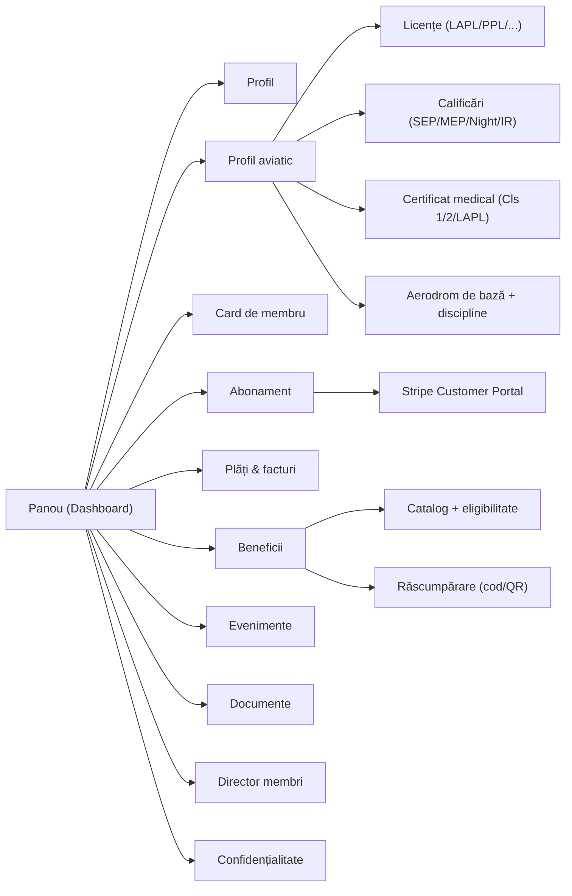
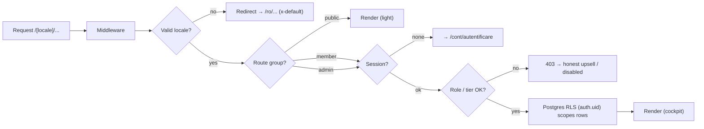

# Aeroskill Club — Information Architecture

> The sitemap, navigation systems, content model, URL/i18n routing, and the route × role RBAC map across all three surfaces.
> _Part of the Aeroskill Club planning set — read alongside 00-foundation.md._

---

## 1. Purpose & scope of this document

This document defines **how the Aeroskill Club platform is organised** — the structure beneath the visuals (08) and above the database (06). It is the contract between the PRD (04) and the build: every page, route, menu, and access rule named here is what the user flows (07), schema (06), and roadmap (10) assume exists.

It covers, in order:

1. **IA principles** — the rules that resolve every later layout decision.
2. **Global sitemap** — one Mermaid graph spanning public site + member area + admin CRM, with `/ro//en` localisation.
3. **Public site page inventory** — pages with RO/EN slugs and intent.
4. **Member area structure** — the dark "cockpit" self-service portal and its primary nav.
5. **Admin CRM module tree** — the back-office, organised around the Party model.
6. **URL & i18n routing table** — route → RO slug, EN slug, access role, notes.
7. **Content model** — MDX collections (news/pages), taxonomies, sponsors data.
8. **Navigation systems** — header, footer, member nav, admin sidebar.
9. **RBAC access map** — route/module × role (visitor / member-by-tier / staff / admin).
10. **SEO & hreflang structure** — sitemaps, canonicals, reciprocal locale links.

All names, prices, entities, and stack choices come from `00-foundation.md` and are used verbatim. Tiers are **Cadet / Aviator / Captain** (RO: Cadet / Aviator / **Comandant**); roles are **visitor / member / staff / admin**, with `member` permissions scoped by tier. The single Next.js 15 App Router repo serves all three surfaces under one `[locale]` segment.

---

## 2. Information architecture principles

These are the load-bearing decisions. Everything downstream defers to them.

1. **Three surfaces, one tree, one repo.** Public site, member area, and admin CRM are not three apps — they are three branches of one Next.js App Router tree, sharing one design system (Tailwind + shadcn/ui), one i18n catalog, and one Supabase backend. The boundary between them is a **route group + auth gate**, not a deployment.

2. **Locale is the outermost segment, always.** Every URL begins `/ro/…` or `/en/…`. RO is the default and the canonical content language; EN is a full peer. There is no un-prefixed route. A bare `/` redirects to the negotiated locale (`/ro` by default). This is non-negotiable because the entire club is bilingual-first.

3. **Slugs are localised, routes are not.** The internal route key (`/membership`) is stable and English-ish for the codebase; the *public slug* differs per locale (`/ro/membri` vs `/en/membership`). next-intl `pathnames` mapping owns this translation. Users and search engines see native slugs; developers reason about one route key. (§6 is the authoritative map.)

4. **Public = light, member + admin = dark "cockpit".** Theme follows surface, not user preference toggling alone. Crossing from marketing into the authenticated portal is a deliberate tonal shift — airy daylight to focused instrument panel.

5. **Tier gates depth, never basic access.** Per the membership model, all members get the **shared benefit core** (community, card, advocacy). Tier (`cadet` / `aviator` / `captain`) unlocks *deeper* features (member directory, expiry reminders, concierge), never withholds a whole section. So the member nav is **identical in shape** across tiers; individual items are present-but-upgrade-gated rather than hidden, with a clear upgrade affordance. This keeps the IA stable and the upsell honest.

6. **The CRM is organised by the Party model, not by screen.** Admin navigation mirrors the canonical entity glossary: Members, Partner Organizations, Benefits, Contracts, Communications, Fleet, Billing, Reference Data, Settings. A flight school and a sponsor are both **parties holding a role**, so they live under one "Partner Organizations" module filtered by `party_role`, not in scattered menus.

7. **Compliance is first-class navigation.** "Current to fly" (valid license **AND** rating **AND** medical) and ARC/insurance/contract expiries are computed, not flagged once — so expiry surfaces (member reminders, admin compliance widget) get **dedicated IA real estate**, not buried tabs.

8. **Design for the longer Romanian string.** RO labels run ~20–30% longer than EN ("Beneficii" vs "Benefits" is kind, but "Organizații partenere" vs "Partners" is not). Nav widths, breadcrumbs, and sidebar items are sized to the RO label; EN never sets the layout budget.

9. **No hardcoded copy, ever.** Every nav label, breadcrumb, and page title is a next-intl message key from day one. The slugs in this doc are the *concept* slugs; the labels rendered come from `ro.json` / `en.json`.

10. **Stable, shallow, signposted.** Public site ≤ 2 clicks to any page; member area ≤ 2 clicks to any self-service action; CRM ≤ 3 clicks to any record. Breadcrumbs on member + admin; flat utility nav on public.

---

## 3. Global sitemap (all three surfaces)

The graph below spans the whole platform under the `[locale]` root. Slugs shown are the **RO default**; the EN peer slug is in §6. Solid arrows are hierarchy; the three coloured clusters are the three surfaces and the auth gate that separates them.

```mermaid
flowchart TD
    ROOT["/ (locale redirect → /ro)"]
    ROOT --> LOC["/ro · /en (locale root)"]

    %% ---------- PUBLIC SITE ----------
    LOC --> HOME["Home /ro"]
    subgraph PUBLIC["PUBLIC SITE — light theme — visitor"]
        HOME --> ABOUT["Despre /ro/despre"]
        HOME --> TIERS["Membri /ro/membri"]
        HOME --> BEN["Beneficii /ro/beneficii"]
        HOME --> PART["Parteneri /ro/parteneri"]
        HOME --> NEWS["Noutati /ro/noutati"]
        HOME --> EVT["Evenimente /ro/evenimente"]
        HOME --> CONTACT["Contact /ro/contact"]
        NEWS --> NEWSITEM["Article /ro/noutati/[slug]"]
        EVT --> EVTITEM["Event /ro/evenimente/[slug]"]
        CONTACT --> LEGAL["Legal /ro/legal/*"]
        LEGAL --> PRIV["Confidentialitate"]
        LEGAL --> TERMS["Termeni"]
        LEGAL --> GDPR["Nota GDPR"]
        LEGAL --> COOKIES["Cookies"]
    end

    %% ---------- JOIN FUNNEL ----------
    TIERS --> JOIN["Inscriere /ro/inscriere"]
    BEN --> JOIN
    JOIN --> CHECKOUT["Stripe Checkout (hosted)"]
    CHECKOUT --> WELCOME["Bun venit /ro/bun-venit"]

    %% ---------- AUTH GATE ----------
    HOME --> AUTH{"Auth gate /ro/cont/*"}
    AUTH --> LOGIN["Autentificare"]
    AUTH --> SIGNUP["Cont nou"]
    AUTH --> RESET["Resetare parola"]
    AUTH --> VERIFY["Verificare email"]

    %% ---------- MEMBER AREA ----------
    WELCOME --> DASH
    LOGIN --> DASH
    subgraph MEMBER["MEMBER AREA — dark cockpit — member (tier-scoped)"]
        DASH["Panou /ro/membru"]
        DASH --> M_PROFILE["Profil /ro/membru/profil"]
        DASH --> M_AVIA["Profil aviatic /ro/membru/profil-aviatic"]
        DASH --> M_CARD["Card /ro/membru/card"]
        DASH --> M_SUB["Abonament /ro/membru/abonament"]
        DASH --> M_PAY["Plati /ro/membru/plati"]
        DASH --> M_BEN["Beneficii /ro/membru/beneficii"]
        DASH --> M_EVT["Evenimente /ro/membru/evenimente"]
        DASH --> M_DOCS["Documente /ro/membru/documente"]
        DASH --> M_DIR["Director membri /ro/membru/director"]
        DASH --> M_PREFS["Confidentialitate /ro/membru/confidentialitate"]
    end

    %% ---------- ADMIN CRM ----------
    LOGIN --> ADASH
    subgraph ADMIN["ADMIN CRM — dark cockpit — staff / admin"]
        ADASH["Tablou de bord /ro/admin"]
        ADASH --> A_MEM["Membri /ro/admin/membri"]
        ADASH --> A_PART["Organizatii partenere /ro/admin/parteneri"]
        ADASH --> A_BEN["Beneficii /ro/admin/beneficii"]
        ADASH --> A_CON["Contracte /ro/admin/contracte"]
        ADASH --> A_COMM["Comunicari /ro/admin/comunicari"]
        ADASH --> A_FLEET["Flota /ro/admin/flota"]
        ADASH --> A_BILL["Abonamente & plati /ro/admin/abonamente"]
        ADASH --> A_EVT["Evenimente /ro/admin/evenimente"]
        ADASH --> A_REF["Date de referinta /ro/admin/referinte"]
        ADASH --> A_SET["Setari /ro/admin/setari"]
    end

    classDef pub fill:#DCEBFB,stroke:#2E7DD1,color:#0A1322;
    classDef mem fill:#0F2440,stroke:#4F9BE8,color:#E8EDF4;
    classDef adm fill:#0A1A33,stroke:#B6883E,color:#E8EDF4;
    class HOME,ABOUT,TIERS,BEN,PART,NEWS,EVT,CONTACT,NEWSITEM,EVTITEM,LEGAL,PRIV,TERMS,GDPR,COOKIES,JOIN,CHECKOUT,WELCOME pub;
    class DASH,M_PROFILE,M_AVIA,M_CARD,M_SUB,M_PAY,M_BEN,M_EVT,M_DOCS,M_DIR,M_PREFS mem;
    class ADASH,A_MEM,A_PART,A_BEN,A_CON,A_COMM,A_FLEET,A_BILL,A_EVT,A_REF,A_SET adm;
```



The join funnel (Membri/Beneficii → Înscriere → Stripe Checkout → Bun venit) is the only path that crosses from the public surface into the authenticated surface without a prior login, because Checkout provisions the account.

---

## 4. Public site — page inventory

Light theme, `visitor` role. Every page is fully bilingual. Slugs below show the RO default; EN peer is in §6.

| # | Page (RO label) | RO slug | Intent / content | Feature ref |
|---|---|---|---|---|
| P1 | **Acasă** (Home) | `/ro` | Hero + value proposition; "ACR for pilots, done modern"; tier teaser; sponsor strip; primary CTA → Înscriere. | Home [M] |
| P2 | **Despre** | `/ro/despre` | Mission, the club story, what we are *not* (not an ATO, not a competitor to Aeroclubul României), advocacy/IAOPA-style aspiration. | Mission & about [M] |
| P3 | **Membri** (Tiers & pricing) | `/ro/membri` | The locked 3-tier comparison table: Cadet / Aviator *(Cel mai popular)* / Comandant, RON-primary + EUR secondary, monthly/annual toggle, Family + Founding/Life add-ons. | Tiers & pricing [M] |
| P4 | **Beneficii** | `/ro/beneficii` | Public preview of the benefits catalog, filterable by tier eligibility; partner-provided perks (fuel/landing/training discounts) shown as teasers. | Benefits preview [S] |
| P5 | **Parteneri** | `/ro/parteneri` | Sponsors/partners showcase — flight schools/ATOs, associations, aerodromes, sponsors — grouped by partner type; logos + short bilingual blurb. | Sponsors showcase [M] |
| P6 | **Noutăți** (News index) | `/ro/noutati` | MDX news/blog index, paginated, taxonomy-filterable. | Content/news [S] |
| P6a | News article | `/ro/noutati/[slug]` | A single MDX article; localised slug per article. | Content/news [S] |
| P7 | **Evenimente** (Events index) | `/ro/evenimente` | Public events list (fly-ins, briefings, fly-outs); each links to detail with public RSVP teaser → join/login. | Events [S] |
| P7a | Event detail | `/ro/evenimente/[slug]` | Single event; date/place (aerodrome), description, RSVP CTA. | Events [S] |
| P8 | **Contact** | `/ro/contact` | Contact form (Resend-backed), club coordinates, legal form note (asociație, OG 26/2000). | Contact [M] |
| P9 | **Legal hub** | `/ro/legal` | Index of legal pages. | Legal [M] |
| P9a | Confidențialitate (Privacy) | `/ro/legal/confidentialitate` | Privacy notice; discloses EU-region-but-US-incorporated processors (CLOUD Act), sensitive pilot data handling. | GDPR notice [M] |
| P9b | Termeni (Terms) | `/ro/legal/termeni` | Terms of membership. | Legal [M] |
| P9c | Notă GDPR | `/ro/legal/gdpr` | ANSPDCP / RO Law 190/2018 statement, data-subject rights pointer to member privacy center. | GDPR notice [M] |
| P9d | Cookies | `/ro/legal/cookies` | Cookie policy + consent banner reference. | Legal [M] |
| P10 | **Înscriere** (Join) | `/ro/inscriere` | Tier selection confirmation → Stripe hosted Checkout; Cadet (free) skips payment. | Join → checkout [M] |
| P11 | **Bun venit** (Welcome) | `/ro/bun-venit` | Post-checkout / post-signup landing; account provisioned; "Cleared for takeoff" microcopy; CTA → member dashboard. | Join → checkout [M] |
| P12 | **404 / 500** | `/ro/[...not-found]` | Localised error pages with horizon motif. | — |

**Public utility pages** (not in main nav): locale switcher target, sitemap.xml, robots.txt, RSS for Noutăți.

---

## 5. Member area — structure & primary navigation

Dark "cockpit" theme, `member` role, gated by Supabase Auth. Mounted under `/ro/membru` (EN `/en/member`). The structure is **identical across tiers**; tier (`cadet`/`aviator`/`captain`) only changes whether an item is fully usable or shows an upgrade affordance (principle §2.5).

### 5.1 Member area module tree



### 5.2 Member primary nav items

| Order | Item (RO) | Item (EN) | Route key | Slug (RO) | Tier behaviour | Feature ref |
|---|---|---|---|---|---|---|
| 1 | Panou | Dashboard | `/member` | `/membru` | All tiers. "Current to fly" status, next expiry, card preview, upcoming event. | Dashboard |
| 2 | Profil | Profile | `/member/profile` | `/membru/profil` | All. Person/organization details, disciplines multi-select. | Profile [M] |
| 3 | Profil aviatic | Aviation profile | `/member/aviation` | `/membru/profil-aviatic` | All. Licenses, ratings, medical, home aerodrome. | Aviation profile [M] |
| 4 | Card de membru | Member card | `/member/card` | `/membru/card` | All. Web/PDF card + QR; Google Wallet [S]; Apple Wallet [C]; Captain = premium metal card record. | Digital card [S] |
| 5 | Abonament | Subscription | `/member/subscription` | `/membru/abonament` | All. Current tier, upgrade/downgrade/renew/cancel → Stripe Customer Portal. | Subscription [M] |
| 6 | Plăți & facturi | Payments | `/member/payments` | `/membru/plati` | All. Payment history, invoices/cotizație receipts. | Payment [M] |
| 7 | Beneficii | Benefits | `/member/benefits` | `/membru/beneficii` | All, depth by tier; Cadet sees basic, Aviator+ deeper discounts, Captain deepest (recurrent-training-gated). Redemption codes. | Benefits [S] |
| 8 | Evenimente | Events | `/member/events` | `/membru/evenimente` | All; Aviator+ priority seating. RSVP. | Events [S] |
| 9 | Documente | Documents | `/member/documents` | `/membru/documente` | All. Vault: licenses/medicals/receipts (Supabase Storage). | Documents vault [S] |
| 10 | Director membri | Member directory | `/member/directory` | `/membru/director` | **Aviator + Captain only.** Cadet sees upgrade prompt. | Member directory · MEM-035 (Aviator+) |
| 11 | Confidențialitate | Privacy center | `/member/privacy` | `/membru/confidentialitate` | All. Communication preferences, consent center, data export/erasure. | Consent + privacy [M] |

**Member account menu** (avatar dropdown, not main nav): Setări cont (account settings), Schimbă limba (locale switch RO/EN), Temă (theme — cockpit is default), Deconectare (logout).

**Tier-aware affordance pattern:** gated items (e.g. Director membri for Cadet) remain visible in the nav with a small lock/upgrade badge; clicking routes to a contextual upsell anchored on `/ro/membri`, never a dead 403. This keeps IA stable and the funnel honest (§2.5).

**Reminders surface:** rating/medical/ARC expiry reminders are not a nav item — they are a **persistent dashboard widget + email (Resend)**, because "current to fly" is a computed cross-cutting status (§2.7), not a page.

---

## 6. Admin CRM — module tree & navigation

Dark "cockpit" theme, `staff` / `admin` roles. Mounted under `/ro/admin` (EN `/en/admin`). Sidebar-driven. Organised around the **Party model** (§2.6).

### 6.1 Admin module tree

```mermaid
flowchart TD
    AD["Tablou de bord (Dashboard)"]
    AD --> MEM["Membri"]
    AD --> PART["Organizații partenere"]
    AD --> BEN["Beneficii"]
    AD --> CON["Contracte"]
    AD --> COMM["Comunicări"]
    AD --> FLEET["Flotă"]
    AD --> BILL["Abonamente & plăți"]
    AD --> EVT["Evenimente"]
    AD --> REF["Date de referință"]
    AD --> SET["Setări"]

    MEM --> MEM1["Listă + fișă membru (Party→person)"]
    MEM --> MEM2["Profil aviatic + 'current to fly'"]
    PART --> P1["Școli/ATO · Asociații · Aerodromuri · Sponsori · CAMO/CAO"]
    PART --> P2["Relații între părți (party_relationship)"]
    BEN --> B1["Catalog + eligibilitate pe nivel"]
    BEN --> B2["Registru răscumpărări"]
    CON --> C1["Contracte + documente + reînnoiri"]
    COMM --> CM1["Jurnal activități"]
    COMM --> CM2["Campanii + segmente"]
    COMM --> CM3["Registru consimțăminte (GDPR)"]
    FLEET --> F1["Aeronave (YR-) + ARC + asigurare"]
    FLEET --> F2["Mentenanță + ore + rezervări"]
    BILL --> BL1["Abonamente (Stripe)"]
    BILL --> BL2["Plăți · facturi (e-Factura-ready)"]
    REF --> R1["Autorități · aerodromuri · licențe/calificări"]
    SET --> S1["Utilizatori · roluri · jurnal audit"]
```



### 6.2 Admin sidebar nav items

| Order | Module (RO) | Module (EN) | Route key | Slug (RO) | Primary entities | Min role |
|---|---|---|---|---|---|---|
| 1 | Tablou de bord | Dashboard | `/admin` | `/admin` | KPIs + compliance/expiry widget | staff |
| 2 | Membri | Members | `/admin/members` | `/admin/membri` | Party(person)+member role, Membership, MemberCard, License/Rating/Medical | staff |
| 3 | Organizații partenere | Partner orgs | `/admin/partners` | `/admin/parteneri` | Party(org)+roles (flight_school_ato, partner_association, aerodrome, sponsor_vendor, camo_cao), PartyRelationship | staff |
| 4 | Beneficii | Benefits | `/admin/benefits` | `/admin/beneficii` | Benefit, BenefitTierEligibility, Redemption | staff |
| 5 | Contracte | Contracts | `/admin/contracts` | `/admin/contracte` | Contract, ContractDocument, renewals | staff |
| 6 | Comunicări | Communications | `/admin/communications` | `/admin/comunicari` | Activity, Campaign+Recipient, Segment, **Consent ledger** | staff |
| 7 | Flotă | Fleet | `/admin/fleet` | `/admin/flota` | Aircraft (YR-), Airworthiness/ARC, Insurance, MaintenanceLog, FlightLog, Booking | staff |
| 8 | Abonamente & plăți | Billing | `/admin/billing` | `/admin/abonamente` | Membership/Subscription, Payment, Invoice | staff |
| 9 | Evenimente | Events | `/admin/events` | `/admin/evenimente` | Event, EventRSVP | staff |
| 10 | Date de referință | Reference data | `/admin/reference` | `/admin/referinte` | ReferenceData: authorities (AACR/EASA/ROMATSA/SAUM), aerodromes, license/rating vocab | staff |
| 11 | Setări | Settings | `/admin/settings` | `/admin/setari` | User, Role/Permission, AuditLog, platform config | **admin** |

Settings is the only `admin`-exclusive module; everything else is `staff` with per-module write permissions configurable in Settings (foundation §5). The compliance widget on the dashboard aggregates every recurring expiry: rating/medical (members), ARC/insurance (aircraft), contract auto-renew dates.

---

## 7. URL & i18n routing table (authoritative)

This is the single source for route → slug mapping, consumed by next-intl `pathnames`. **Route key** is the stable internal identifier; **RO slug** is canonical/default; **EN slug** is the peer. All routes are physically prefixed with the locale (`/ro` or `/en`); the prefix is omitted from the slug columns to keep the table readable. RO default; reciprocal `hreflang` on every page.

### 7.1 Public site

| Route key | RO slug | EN slug | Access | Notes |
|---|---|---|---|---|
| `/` | `/ro` | `/en` | visitor | Locale-negotiated redirect from bare `/`. |
| `/about` | `/despre` | `/about` | visitor | |
| `/membership` | `/membri` | `/membership` | visitor | Tiers & pricing; Aviator flagged "Cel mai popular". |
| `/benefits` | `/beneficii` | `/benefits` | visitor | Public preview. |
| `/partners` | `/parteneri` | `/partners` | visitor | Sponsors data source (§8.3). |
| `/news` | `/noutati` | `/news` | visitor | MDX index. |
| `/news/[slug]` | `/noutati/[slug]` | `/news/[slug]` | visitor | Per-article localised slug. |
| `/events` | `/evenimente` | `/events` | visitor | Public events index. |
| `/events/[slug]` | `/evenimente/[slug]` | `/events/[slug]` | visitor | |
| `/contact` | `/contact` | `/contact` | visitor | Same slug both locales. |
| `/legal` | `/legal` | `/legal` | visitor | Hub. |
| `/legal/privacy` | `/legal/confidentialitate` | `/legal/privacy` | visitor | |
| `/legal/terms` | `/legal/termeni` | `/legal/terms` | visitor | |
| `/legal/gdpr` | `/legal/gdpr` | `/legal/gdpr` | visitor | |
| `/legal/cookies` | `/legal/cookies` | `/legal/cookies` | visitor | |
| `/join` | `/inscriere` | `/join` | visitor | Tier select → Stripe Checkout. |
| `/welcome` | `/bun-venit` | `/welcome` | visitor→member | Post-checkout landing. |

### 7.2 Auth

| Route key | RO slug | EN slug | Access | Notes |
|---|---|---|---|---|
| `/account/login` | `/cont/autentificare` | `/account/login` | visitor | Supabase Auth. |
| `/account/signup` | `/cont/inregistrare` | `/account/signup` | visitor | |
| `/account/verify` | `/cont/verificare` | `/account/verify` | visitor | Email verify callback. |
| `/account/reset` | `/cont/resetare-parola` | `/account/reset` | visitor | Password reset. |

### 7.3 Member area (member; tier-scoped)

| Route key | RO slug | EN slug | Access | Notes |
|---|---|---|---|---|
| `/member` | `/membru` | `/member` | member | Dashboard. |
| `/member/profile` | `/membru/profil` | `/member/profile` | member | |
| `/member/aviation` | `/membru/profil-aviatic` | `/member/aviation` | member | Licenses/ratings/medical/aerodrome/disciplines. |
| `/member/card` | `/membru/card` | `/member/card` | member | Card + QR; Wallet phased. |
| `/member/subscription` | `/membru/abonament` | `/member/subscription` | member | → Stripe Customer Portal. |
| `/member/payments` | `/membru/plati` | `/member/payments` | member | History + invoices. |
| `/member/benefits` | `/membru/beneficii` | `/member/benefits` | member | Depth by tier. |
| `/member/events` | `/membru/evenimente` | `/member/events` | member | RSVP; Aviator+ priority. |
| `/member/documents` | `/membru/documente` | `/member/documents` | member | Storage vault. |
| `/member/directory` | `/membru/director` | `/member/directory` | **aviator, captain** | Cadet → upgrade prompt. |
| `/member/privacy` | `/membru/confidentialitate` | `/member/privacy` | member | Consent + export/erasure. |
| `/member/settings` | `/membru/setari` | `/member/settings` | member | Account settings. |

### 7.4 Admin CRM (staff / admin)

| Route key | RO slug | EN slug | Access | Notes |
|---|---|---|---|---|
| `/admin` | `/admin` | `/admin` | staff | Dashboard + compliance widget. |
| `/admin/members` | `/admin/membri` | `/admin/members` | staff | |
| `/admin/members/[id]` | `/admin/membri/[id]` | `/admin/members/[id]` | staff | Member record. |
| `/admin/partners` | `/admin/parteneri` | `/admin/partners` | staff | |
| `/admin/partners/[id]` | `/admin/parteneri/[id]` | `/admin/partners/[id]` | staff | Org record. |
| `/admin/benefits` | `/admin/beneficii` | `/admin/benefits` | staff | |
| `/admin/contracts` | `/admin/contracte` | `/admin/contracts` | staff | |
| `/admin/communications` | `/admin/comunicari` | `/admin/communications` | staff | Activity/campaigns/segments/consent. |
| `/admin/fleet` | `/admin/flota` | `/admin/fleet` | staff | |
| `/admin/fleet/[reg]` | `/admin/flota/[reg]` | `/admin/fleet/[reg]` | staff | Aircraft by YR- registration. |
| `/admin/billing` | `/admin/abonamente` | `/admin/billing` | staff | |
| `/admin/events` | `/admin/evenimente` | `/admin/events` | staff | |
| `/admin/reference` | `/admin/referinte` | `/admin/reference` | staff | |
| `/admin/settings` | `/admin/setari` | `/admin/settings` | **admin** | Users/roles/audit. |

**Routing implementation note:** next-intl `localePrefix: 'always'` + a `pathnames` map keyed by route key. Middleware does locale negotiation → auth gate (Supabase session) → role/tier check. The `[locale]` segment wraps three route groups: `(public)`, `(member)`, `(admin)`, each with its own theme provider and layout. A missing/invalid locale falls back to `ro` with `x-default` semantics.

---

## 8. Content model

Two content sources: **MDX in-repo** (marketing content — foundation locks "MDX → Payload CMS 3 later") and **Supabase Postgres** (everything transactional/relational from the entity glossary). This section covers the MDX collections, the taxonomies, and the sponsors data — the database tables are owned by `06-database-schema.md`.

### 8.1 MDX collections

Marketing content lives as MDX files in the repo, one folder per collection, with locale-paired files. Frontmatter is typed (Zod-validated at build).

| Collection | Path | Frontmatter (key fields) | Renders to |
|---|---|---|---|
| **news** | `content/news/{ro,en}/[slug].mdx` | `title`, `slug_ro`, `slug_en`, `excerpt`, `date`, `author`, `cover`, `tags[]`, `category`, `published` | `/[locale]/noutati/[slug]` |
| **pages** | `content/pages/{ro,en}/[slug].mdx` | `title`, `slug_ro`, `slug_en`, `seo_title`, `seo_description`, `updated`, `nav_group` | Static marketing/legal pages (Despre, Legal/*) |
| **events** (editorial copy) | `content/events/{ro,en}/[slug].mdx` | `title`, `slug_*`, `start`, `end`, `aerodrome_icao`, `summary`, `hero` | `/[locale]/evenimente/[slug]` — joins Supabase `events`/`event_rsvps` for live RSVP |

**Localisation rule:** each MDX document exists as an RO/EN pair sharing a stable `key` in frontmatter so the locale switcher can map article ↔ translation (drives per-page `hreflang` for content). If an EN translation is absent, the locale switcher points to the RO original (with `x-default` = RO) rather than 404.

### 8.2 Taxonomies

Taxonomies are bilingual and small; they back the Noutăți filter and content cross-linking. Defined in `content/taxonomies.ts` (typed), not free-text tags.

| Taxonomy | Members (RO / EN) | Used by |
|---|---|---|
| **Categorie** (category) | Comunitate/Community · Reglementări/Regulations · Siguranță/Safety · Evenimente/Events · Parteneri/Partners · Anunțuri/Announcements | news |
| **Disciplină** (discipline) | Avion/Airplane · Planor/Glider · Balon/Balloon · ULM · Parașutism/Parachuting · Entuziast/Enthusiast | news, events, member profile (multi-select) |
| **Nivel** (tier relevance) | Cadet · Aviator · Comandant | benefits, content targeting |
| **Regiune** (region) | Territorial-aeroclub cities (București/Clinceni, Ploiești, Brașov, Iași, Cluj-Napoca, …) | events, partners |

Disciplines and tiers are the **same controlled vocabularies** used in the member profile and tier model — taxonomies reuse the foundation enums, they do not invent parallel ones.

### 8.3 Sponsors / partners data

Two-tier model so the **public showcase** stays fast/static while the **CRM** owns the relationship:

- **Public showcase source** — a typed `content/partners.ts` (or MDX collection) with display-only fields: `name`, `logo`, `partner_type` (flight_school_ato / partner_association / aerodrome / sponsor_vendor / camo_cao), `blurb_ro`, `blurb_en`, `url`, `tier_sponsor_level`, `region`. This renders `/ro/parteneri` with zero DB hit.
- **CRM source of truth** — the Party model (`Party` + `OrganizationProfile` + `PartyRole`), `Contract`, `Benefit`. The public file is a **published projection** of approved partners; the relationship, contract, and redemptions live only in Supabase.

Seed partners (from foundation §8): Regional Air Services (Tuzla LRTZ), AOPA Romania, BGAA, Aeroclubul României + 15 territorial sites, Aerowest, Transylvania Wings — mapped to aerodromes Clinceni (LRCN), Strejnic (LRPV), Tuzla (LRTZ).

### 8.4 Member-generated & transactional data

Not MDX — lives in Supabase per the entity glossary: profiles, AviationProfile (License/Rating/MedicalCertificate), Membership, MemberCard, Redemption, EventRSVP, Documents (Storage), Consent. Card assets and uploaded documents go to Supabase Storage (EU/Frankfurt). This document only places them in the IA; columns/RLS are in 06.

---

## 9. Navigation systems

Four distinct navigation systems, one per surface plus the global locale/auth controls.

### 9.1 Public header

Sticky, light theme, logo-left. RO labels set the width budget.

- **Logo** (AEROSKILL ✈ CLUB wordmark) → Home.
- **Primary links:** Despre · Membri · Beneficii · Parteneri · Noutăți · Evenimente.
- **Right cluster:** locale switcher (RO/EN), `Autentificare` (login, text), **`Devino membru`** (Join, primary brass CTA → `/inscriere`).
- **Mobile:** hamburger → full-screen sheet (shadcn `Sheet`); CTA pinned at bottom.

### 9.2 Public footer

Four columns + utility row, light theme.

| Column | Items |
|---|---|
| **Club** | Despre · Misiune · Parteneri · Contact |
| **Membri** | Niveluri & prețuri · Beneficii · Devino membru · Autentificare |
| **Conținut** | Noutăți · Evenimente · RSS |
| **Legal** | Confidențialitate · Termeni · Notă GDPR · Cookies |
| **Utility row** | Logo · "Asociație, OG 26/2000" · locale switch · social · `© Aeroskill Club` |

Footer discloses the EU-data-residency note pointer (to Confidențialitate) since sensitive pilot data is modeled.

### 9.3 Member navigation

Dark cockpit. Two-region: a left rail (desktop) / bottom tab + drawer (mobile), plus a top bar.

- **Top bar:** logo (→ Panou), breadcrumb, "current to fly" status chip (green/amber/red, paired with icon — never colour-only, WCAG 2.2), notifications bell (expiry reminders), avatar menu (account settings, locale, theme, logout).
- **Left rail (primary):** Panou · Profil · Profil aviatic · Card · Abonament · Plăți · Beneficii · Evenimente · Documente · **Director membri** (Aviator+ badge) · Confidențialitate.
- **Tier badge:** the rail header shows the member's tier (Cadet/Aviator/Comandant) with its accent (sky/brass/engraved navy+brass) — orienting, not decorative.

### 9.4 Admin sidebar

Dark cockpit, collapsible, icon+label. Grouped:

```
ACTIVITATE
  Tablou de bord
PERSOANE & ORGANIZAȚII
  Membri
  Organizații partenere
PROGRAM
  Beneficii
  Contracte
  Evenimente
OPERAȚIUNI
  Comunicări
  Flotă
  Abonamente & plăți
SISTEM
  Date de referință
  Setări          (admin only)
```

- **Top bar:** global search (members/partners/aircraft by name or YR- reg), quick-add (`+`), locale, theme, admin avatar.
- **Compliance shortcut:** a persistent "Expirări" pill in the top bar linking to the dashboard compliance widget (members' medical/rating + aircraft ARC/insurance + contract renewals).
- Settings is visually present for all staff but role-gated; non-admins see it disabled with a tooltip, matching the member-area honest-gate pattern.

### 9.5 Cross-surface controls

- **Locale switcher** appears on all three surfaces; it swaps the locale segment while preserving the current route key and params (using `pathnames` reverse-lookup), so `/ro/membri` ↔ `/en/membership` round-trips losslessly.
- **Theme:** fixed per surface (light public, dark member/admin); a member-only override toggle is allowed but defaults to cockpit.

---

## 10. RBAC access map (route/module × role)

Roles: **visitor** · **member** (split by tier: **Cadet / Aviator / Captain**) · **staff** · **admin**. Enforced at three layers — middleware (route gate), RLS (row gate, `auth.uid()`), and UI (affordance). The table is the route-level gate; row-level scoping (a member sees only their own records) is RLS in 06.

Legend: ✅ full · 🔼 visible but upgrade-gated · 👁 read-only/own-rows · ⚙ per-module configurable · — no access.

Record/detail routes inherit their parent module's role gate: e.g. `/admin/members/[id]` and `/admin/fleet/[reg]` carry the same `staff` (⚙) gate as their list module, so they are not enumerated as separate rows below.

| Route / Module | visitor | member · Cadet | member · Aviator | member · Captain | staff | admin |
|---|---|---|---|---|---|---|
| Public pages (Home, Despre, Membri, Beneficii, Parteneri, Noutăți, Evenimente, Contact, Legal) | ✅ | ✅ | ✅ | ✅ | ✅ | ✅ |
| Join / Înscriere → Checkout → Bun venit (/welcome) | ✅ | ✅ | ✅ | ✅ | ✅ | ✅ |
| Auth (login/signup/verify/reset) | ✅ | — | — | — | — | — |
| **Member: Panou (dashboard)** | — | ✅ | ✅ | ✅ | —¹ | —¹ |
| **Member: Profil** | — | 👁/✅ own | 👁/✅ own | 👁/✅ own | — | — |
| **Member: Profil aviatic** | — | ✅ own | ✅ own | ✅ own | — | — |
| **Member: Card de membru** | — | ✅ basic | ✅ | ✅ metal | — | — |
| **Member: Abonament** | — | ✅ | ✅ | ✅ | — | — |
| **Member: Plăți & facturi** | — | ✅ own | ✅ own | ✅ own | — | — |
| **Member: Beneficii** | — | ✅ basic depth | ✅ deeper | ✅ deepest² | — | — |
| **Member: Evenimente / RSVP** | — | ✅ | ✅ priority | ✅ priority | — | — |
| **Member: Documente (vault)** | — | ✅ own | ✅ own | ✅ own | — | — |
| **Member: Director membri** | — | 🔼 upsell | ✅ | ✅ | — | — |
| **Member: Confidențialitate** | — | ✅ own | ✅ own | ✅ own | — | — |
| **Member: Setări cont** (avatar menu, not rail) | — | ✅ own | ✅ own | ✅ own | — | — |
| **Admin: Tablou de bord** | — | — | — | — | ✅ | ✅ |
| **Admin: Membri** | — | — | — | — | ⚙ | ✅ |
| **Admin: Organizații partenere** | — | — | — | — | ⚙ | ✅ |
| **Admin: Beneficii** | — | — | — | — | ⚙ | ✅ |
| **Admin: Contracte** | — | — | — | — | ⚙ | ✅ |
| **Admin: Comunicări (+ consent ledger)** | — | — | — | — | ⚙ | ✅ |
| **Admin: Flotă** | — | — | — | — | ⚙ | ✅ |
| **Admin: Abonamente & plăți** | — | — | — | — | ⚙ | ✅ |
| **Admin: Evenimente** | — | — | — | — | ⚙ | ✅ |
| **Admin: Date de referință** | — | — | — | — | ⚙ | ✅ |
| **Admin: Setări (utilizatori/roluri/audit)** | — | — | — | — | — | ✅ |

¹ Staff/admin are also platform users; they reach the member area only if they themselves hold a membership (a `Party` with both `member` and a staff `User.role`). The surfaces are independent gates.
² Captain's deepest discounts are additionally **conditioned on recurrent-training proof** (foundation §4) — an eligibility rule on Redemption, not a separate route.

**Enforcement summary:**



---

## 11. SEO & hreflang structure

SEO applies to the **public surface only**; member and admin routes are `noindex, nofollow` (auth-gated, no SEO value, and they hold sensitive data).

### 11.1 Locale & canonical model

- **Path-prefix i18n:** `/ro/...` and `/en/...`. RO is default and `x-default`.
- **Reciprocal hreflang** on every public page: `ro-RO`, `en`, and `x-default` → RO. next-intl emits these from the `pathnames` map, so `/ro/membri` and `/en/membership` reference each other automatically.
- **Self-canonical** per localised URL (each locale URL canonicals to itself, not to the other locale) — they are alternates, not duplicates.
- **MDX content** carries per-document `seo_title` / `seo_description` (bilingual frontmatter); when an EN translation is missing, `x-default` and the locale switcher fall back to RO rather than emitting a broken alternate.

### 11.2 hreflang example (rendered in `<head>`)

```html
<!-- on /ro/membri -->
<link rel="alternate" hreflang="ro-RO" href="https://aeroskill.club/ro/membri" />
<link rel="alternate" hreflang="en"    href="https://aeroskill.club/en/membership" />
<link rel="alternate" hreflang="x-default" href="https://aeroskill.club/ro/membri" />
<link rel="canonical" href="https://aeroskill.club/ro/membri" />
```

### 11.3 Sitemaps & crawl control

- **`sitemap.xml`** — generated, lists only public RO+EN URLs, each entry with `<xhtml:link rel="alternate" hreflang>` for its peer locale. News/events entries pulled from the MDX collections + Supabase events.
- **`robots.txt`** — allows public; `Disallow: /*/membru`, `/*/member`, `/*/admin`, `/*/cont`, `/*/account`.
- **Structured data:** `Organization` (the asociație) on Home/Despre; `Event` JSON-LD on event detail pages; `Article` on news. RON pricing surfaced as `Offer` on `/membri` (RON primary, EUR secondary).
- **Localised metadata:** every public page sets `title`/`description` from next-intl catalogs (RO + EN), Open Graph locale (`og:locale` = `ro_RO` / `en`, with `og:locale:alternate`).

### 11.4 What is deliberately not indexed

Member area, admin CRM, auth screens, Stripe Checkout/Customer Portal (external), and the post-checkout `bun-venit` confirmation — all `noindex`. The locale switcher and these gates never leak authenticated routes into the public sitemap.

---

## 12. Consistency checklist (for downstream docs)

This IA assumes — and downstream docs must honour:

- Tiers **Cadet / Aviator / Comandant**, Aviator flagged "Cel mai popular"; prices per foundation §4. Tier gates depth, not access.
- Roles **visitor / member / staff / admin**; member scoped by tier; RLS via `auth.uid()`.
- Three route groups under one `[locale]` segment; `localePrefix: 'always'`; RO default + `x-default`.
- CRM modules map 1:1 to the Party-model entity glossary (§7 of foundation); partners are parties-with-roles, not separate menus.
- "Current to fly" and all expiries are computed cross-cutting surfaces, not single flags.
- All labels/slugs are next-intl keys; RO sets layout width; no hardcoded copy.
- Light public theme, dark cockpit member/admin theme; brand navy `#102844`.
