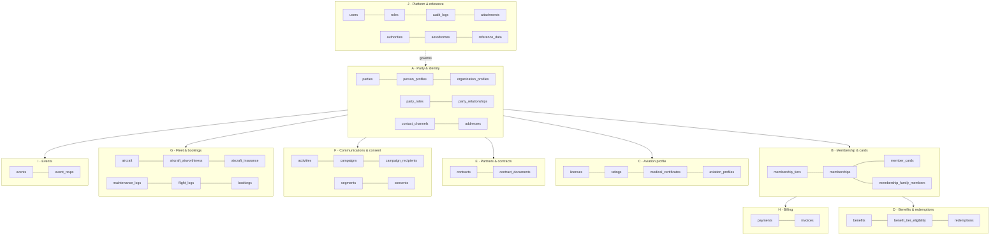
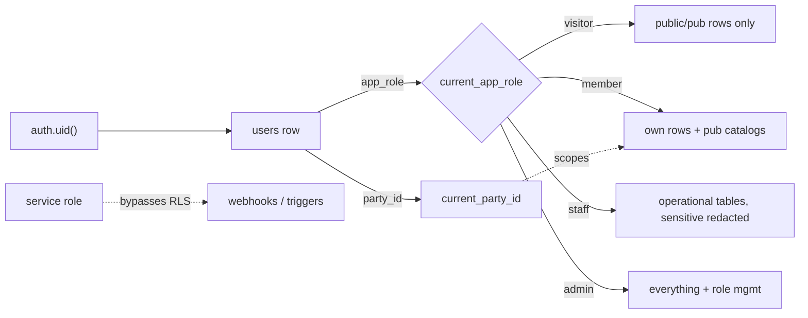

# Aeroskill Club — Database Schema

> The authoritative data model: entities, columns, relationships, ERD, enums, seed data, and Row Level Security posture for the Supabase Postgres database backing all three surfaces.
>
> _Part of the Aeroskill Club planning set — read alongside 00-foundation.md._

---

## 1. Purpose & scope

This document specifies the **Postgres schema** that Supabase will host (single project, EU / Frankfurt `eu-central-1`). It implements the canonical entity glossary from `00-foundation.md` §7 using the conventions from §9, the RBAC roles from §5, and the GDPR/RLS posture from §11. It is concept-grade but **implementable as written** — every table, column, enum, and policy here is intended to be turned into SQL migrations by Claude Code with minimal interpretation.

Three surfaces share one database:

- **Public site** (`visitor`) — reads almost nothing directly; mostly statically-generated content + a `join` write path that creates a `party` + `user`.
- **Member area** (`member`) — reads/writes only the authenticated party's own rows, scoped further by tier.
- **Admin CRM** (`staff`, `admin`) — broad read/write across operational tables, gated by role.

Everything is enforced in Postgres via **RLS keyed on `auth.uid()`**, not merely in the Next.js layer.

---

## 2. Modeling principles

These flow directly from the foundation and are non-negotiable across migrations.

1. **Hybrid Party model.** Every actor — a student pilot, an instructor, a flight school, an aerodrome, a sponsor, a regulator — is a single row in `parties` with a discriminator `party_kind ∈ {person, organization}`. Subtype detail lives in `person_profiles` / `organization_profiles` (1:1). Capacities are **roles** in `party_roles` (a party may be both a `member` and a `sponsor_vendor`); connections are typed edges in `party_relationships`. This avoids a `customers`/`companies`/`vendors` table sprawl and lets a flight-school owner who is also a Captain member exist exactly once.

2. **Roles ≠ auth roles.** `party_roles.role` is a *business capacity* (member, aerodrome, sponsor…). The RBAC role from foundation §5 (`visitor/member/staff/admin`) lives on `users.app_role` and drives RLS. A person can be a `member` (business) whose login is `staff` (RBAC) — both true, different columns.

3. **Plural snake_case tables, snake_case columns.** PK `id uuid default gen_random_uuid()`. FKs named `<entity>_id`. Timestamps `timestamptz`.

4. **Bilingual columns** `*_ro` / `*_en` on anything member-or-public-facing (tiers, benefits, events, reference data, contract titles). RO is the source of truth; EN is the peer. UI never hardcodes copy — these columns feed dynamic content; static chrome lives in next-intl catalogs.

5. **Money = `amount_minor int` + `currency char(3)` default `'RON'`.** Bani for RON, cents for EUR. Display via `Intl` `ro-RO` / `en-GB`. Never a single `float` price.

6. **Soft-delete + audit everywhere relevant.** `deleted_at timestamptz`, `created_at timestamptz not null default now()`, `created_by uuid`, `updated_at timestamptz`, `updated_by uuid` (FKs to `users.id`). Ledger/event tables (payments, redemptions, consents, audit) are **append-only** — no soft-delete, no updates after settlement.

7. **No EAV.** Fixed subtype tables + Postgres enums + a single optional `extra_attributes jsonb default '{}'` per major entity for genuinely sporadic fields. Controlled vocabularies are Postgres `enum` types (cheap, indexable, self-documenting) except where values change at runtime (aerodromes, authorities, tiers) which live in **reference/config tables**.

8. **"Current to fly" is computed, never stored as a flag.** It is the logical AND of (valid license ∧ valid rating for the intended operation ∧ valid medical). Modeled as a SQL view / function over `licenses`, `ratings`, `medical_certificates` — see §6.3 and §13.

9. **Stripe & PCI.** We store only Stripe object IDs + card `brand`/`last4`. No PAN, no CVV. `payments` and `invoices` mirror Stripe; Stripe Billing is the source of truth for subscription state, reconciled by webhook.

10. **e-Factura-ready, not e-Factura-live.** `invoices` carries issuer/buyer fiscal IDs, line items, VAT rate, and a `submission_status` so a future RO ANAF e-Factura (UBL/XML) export is a projection, not a remodel. Membership-fee *cotizație* receipts are kept distinct from commercial (sponsorship) invoices via `invoices.document_kind`.

11. **No standalone `members` table.** The foundation §9 "members" naming example is realized here as `parties` + `party_roles` (`role = 'member'`) + `memberships` — the business capacity is a role and the paid enrollment is a subscription. There is intentionally **no** `members` table.

---

## 3. Entity-relationship diagram (ERD)

A single Mermaid `erDiagram` covering the major entities and key cardinalities. Audit/soft-delete columns are omitted from the diagram for legibility (they exist on every operational table).

```mermaid
erDiagram
    parties ||--o| person_profiles : "is-a (person)"
    parties ||--o| organization_profiles : "is-a (org)"
    parties ||--o{ party_roles : "acts as"
    parties ||--o{ contact_channels : "reachable via"
    parties ||--o{ addresses : "located at"
    parties ||--o{ party_relationships : "source of"
    parties ||--o{ party_relationships : "target of"
    parties ||--o| users : "logs in as"

    parties ||--o{ memberships : "holds"
    membership_tiers ||--o{ memberships : "of tier"
    memberships ||--o{ membership_family_members : "covers family"
    parties ||--o{ membership_family_members : "linked as family"
    memberships ||--o{ member_cards : "issues"
    memberships ||--o{ payments : "paid by"
    memberships ||--o{ invoices : "billed by"

    parties ||--o{ licenses : "pilot holds"
    parties ||--o{ ratings : "pilot holds"
    parties ||--o{ medical_certificates : "pilot holds"
    parties ||--o{ aviation_profiles : "summary for"

    benefits ||--o{ benefit_tier_eligibility : "available to"
    membership_tiers ||--o{ benefit_tier_eligibility : "grants"
    benefits ||--o{ redemptions : "redeemed as"
    parties ||--o{ redemptions : "member redeems"
    parties ||--o{ benefits : "provided by"

    parties ||--o{ contracts : "partner of"
    contracts ||--o{ contract_documents : "evidenced by"
    contracts ||--o| contracts : "renews from"

    parties ||--o{ activities : "subject of"
    campaigns ||--o{ campaign_recipients : "sent to"
    parties ||--o{ campaign_recipients : "receives"
    segments ||--o{ campaigns : "targets"
    parties ||--o{ consents : "grants/withdraws"

    parties ||--o{ aircraft : "owns"
    aerodromes ||--o{ aircraft : "based at"
    aircraft ||--o{ aircraft_airworthiness : "has ARC"
    aircraft ||--o{ aircraft_insurance : "insured by"
    aircraft ||--o{ maintenance_logs : "maintained via"
    aircraft ||--o{ flight_logs : "flown in"
    aircraft ||--o{ bookings : "reserved"
    parties ||--o{ bookings : "booked by"

    events ||--o{ event_rsvps : "has"
    parties ||--o{ event_rsvps : "RSVPs"

    parties ||--o{ attachments : "owns docs"
    users ||--o{ audit_logs : "acts in"

    authorities ||--o{ licenses : "issued by"
    authorities ||--o{ medical_certificates : "validated under"
    aerodromes ||--o{ parties : "home base of person"
```

> Note on `attachments`, `activities`, and `audit_logs`: these are **polymorphic** (`owner_type` + `owner_id`) and attach to many entities; the ERD shows only the representative `parties` edge to keep the graph readable.

---

## 4. Domain map

Tables are grouped into ten domains. Each subsequent section (§5–§14) defines the tables in one domain.

---

## 5. Domain A — Party & identity

The spine of the CRM. Everything else hangs off `parties`.

### 5.1 `parties`

The universal actor. One row per real-world entity we interact with.

| Column | Type | Null / Default | Notes |
|---|---|---|---|
| `id` | uuid | PK, `gen_random_uuid()` | |
| `party_kind` | `party_kind` enum | not null | `person` \| `organization` discriminator |
| `display_name` | text | not null | denormalized "best" name for lists/search (e.g. "Andrei Pop" / "Regional Air Services SRL") |
| `name_ro` | text | null | bilingual display where the name differs by locale (mostly orgs) |
| `name_en` | text | null | |
| `primary_email` | citext | null | convenience cache of the primary `contact_channels` row; unique-ish, not enforced |
| `home_aerodrome_id` | uuid | FK → `aerodromes.id`, null | base airfield for a pilot |
| `country` | char(2) | default `'RO'` | ISO-3166-1 alpha-2 |
| `preferred_locale` | char(2) | default `'ro'` | `ro` \| `en` |
| `extra_attributes` | jsonb | not null default `'{}'` | sporadic fields, no EAV |
| `deleted_at` | timestamptz | null | soft delete |
| `created_at` / `created_by` / `updated_at` / `updated_by` | audit cols | | |

**PK:** `id`. **FKs:** `home_aerodrome_id`. **Indexes:** `(party_kind)`, `(lower(display_name))`, partial `(deleted_at) where deleted_at is null`.
**RLS:** a `member` may `select`/`update` only the `parties` row linked to their `users.party_id`; `staff`/`admin` full access; `visitor` none.

### 5.2 `person_profiles` (1:1 subtype, person)

| Column | Type | Null / Default | Notes |
|---|---|---|---|
| `party_id` | uuid | PK + FK → `parties.id` | shared-PK 1:1 |
| `first_name` | text | not null | |
| `last_name` | text | not null | |
| `date_of_birth` | date | null | drives youth-tier (16–23) eligibility logic |
| `gender` | text | null | free/optional |
| `cnp` | text | null | RO national ID (Cod Numeric Personal) — **sensitive**; nullable, only when fiscally needed for `asociație` membership |
| `disciplines` | `discipline[]` | not null default `'{}'` | multi-select per foundation §2 (airplane, glider, balloon, ultralight, parachuting, enthusiast) |
| `is_instructor` | boolean | not null default false | **denormalized convenience flag** derived from a valid FI/CRI rating — `ratings` is the source of truth |
| `bio_ro` / `bio_en` | text | null | optional member-directory blurb |
| audit + `deleted_at` | | | |

**PK/FK:** `party_id` (also FK). **RLS:** owner self-access; `cnp` column **column-masked** from `member` self-reads except own; full to `admin`, redacted to `staff` (view-layer).

### 5.3 `organization_profiles` (1:1 subtype, organization)

| Column | Type | Null / Default | Notes |
|---|---|---|---|
| `party_id` | uuid | PK + FK → `parties.id` | |
| `legal_name` | text | not null | e.g. "Regional Air Services S.R.L." |
| `legal_form` | text | null | `SRL` \| `SA` \| `asociație` \| `instituție publică` … |
| `cui` | text | null | RO fiscal code (Cod Unic de Înregistrare) |
| `reg_com` | text | null | Trade-registry no. (J-number) |
| `org_category` | `org_category` enum | null | flight_school_ato / dto / association / aerodrome_operator / sponsor / camo_cao / regulator |
| `is_ato` | boolean | null | ATO (approved) vs DTO (declared) — foundation §8 |
| `ato_approval_ref` | text | null | e.g. `RO/ATO-06` |
| `website` | text | null | |
| `logo_attachment_id` | uuid | FK → `attachments.id`, null | partner/sponsor logo |
| audit + `deleted_at` | | | |

**RLS:** `staff`/`admin` read/write; `member` read of non-sensitive org fields when surfaced as a partner (via security-definer view); `visitor` none direct.

### 5.4 `party_roles`

The capacities a party acts in. A party may have several.

| Column | Type | Null / Default | Notes |
|---|---|---|---|
| `id` | uuid | PK | |
| `party_id` | uuid | FK → `parties.id`, not null | |
| `role` | `party_role` enum | not null | member / flight_school_ato / partner_association / aerodrome / sponsor_vendor / camo_cao / regulator |
| `is_primary` | boolean | not null default false | the headline role for the party |
| `valid_from` | date | null | |
| `valid_to` | date | null | role can lapse without deleting the party |
| audit + `deleted_at` | | | |

**Unique:** `(party_id, role) where deleted_at is null`. **RLS:** `member` reads own roles; `staff`/`admin` all.

### 5.5 `party_relationships`

Typed directed edges between two parties.

| Column | Type | Null / Default | Notes |
|---|---|---|---|
| `id` | uuid | PK | |
| `source_party_id` | uuid | FK → `parties.id`, not null | |
| `target_party_id` | uuid | FK → `parties.id`, not null | |
| `relationship_type` | `relationship_type` enum | not null | owns_aircraft_at / school_operates_at / instructor_at / sponsor_of / member_of_org / family_of / camo_manages |
| `valid_from` / `valid_to` | date | null | |
| `notes` | text | null | |
| audit + `deleted_at` | | | |

**Check:** `source_party_id <> target_party_id`. **Unique:** `(source_party_id, target_party_id, relationship_type) where deleted_at is null`. **RLS:** `staff`/`admin` full; `member` reads edges where they are source or target.

### 5.6 `contact_channels`

Reusable contact points attached to any party.

| Column | Type | Null / Default | Notes |
|---|---|---|---|
| `id` | uuid | PK | |
| `party_id` | uuid | FK → `parties.id`, not null | |
| `channel_type` | `contact_channel_type` enum | not null | email / phone_mobile / phone_fixed / whatsapp / website / other |
| `value` | text | not null | |
| `is_primary` | boolean | not null default false | |
| `is_verified` | boolean | not null default false | email/phone verification |
| audit + `deleted_at` | | | |

**Partial unique:** one `is_primary` per `(party_id, channel_type)`. **RLS:** owner self; `staff`/`admin` all.

### 5.7 `addresses`

| Column | Type | Null / Default | Notes |
|---|---|---|---|
| `id` | uuid | PK | |
| `party_id` | uuid | FK → `parties.id`, not null | |
| `address_type` | `address_type` enum | not null | home / billing / business / aerodrome |
| `line1` | text | not null | |
| `line2` | text | null | |
| `city` | text | not null | |
| `county` | text | null | RO județ |
| `postal_code` | text | null | |
| `country` | char(2) | default `'RO'` | |
| `is_primary` | boolean | not null default false | |
| audit + `deleted_at` | | | |

**RLS:** owner self; `staff`/`admin` all.

---

## 6. Domain C — Aviation profile (licenses / ratings / medical)

> Placed before Membership in the prose because it is the most domain-specific block. The "current to fly" computation (§13) reads all three child tables. Pilot records hang off `parties` (a person), not off `memberships` — a pilot's licences survive a lapsed subscription.

### 6.1 `licenses`

License **type** is modeled separately from ratings (foundation §8).

| Column | Type | Null / Default | Notes |
|---|---|---|---|
| `id` | uuid | PK | |
| `party_id` | uuid | FK → `parties.id`, not null | the pilot |
| `license_type` | `license_type` enum | not null | LAPL_A / PPL_A / CPL / ATPL / SPL / BPL / ULM |
| `authority_id` | uuid | FK → `authorities.id`, not null | issuer — **AACR for Part-FCL, SAUM for ULM** |
| `license_number` | text | null | as printed; **sensitive** |
| `issued_on` | date | null | |
| `expires_on` | date | null | the licence document validity (ratings carry their own) |
| `state` | `credential_state` enum | not null default `'valid'` | valid / expired / suspended / revoked |
| `verified_by` | uuid | FK → `users.id`, null | staff who sighted the document |
| `verified_at` | timestamptz | null | |
| `document_attachment_id` | uuid | FK → `attachments.id`, null | scanned licence |
| `extra_attributes` | jsonb | default `'{}'` | |
| audit + `deleted_at` | | | |

**Index:** `(party_id, license_type)`. **RLS:** owner self read/write (self-declared, `verified_*` write-blocked to member); `staff`/`admin` full incl. verification.

### 6.2 `ratings`

Each rating carries **its own validity window** (data-driven, never hard-coded).

| Column | Type | Null / Default | Notes |
|---|---|---|---|
| `id` | uuid | PK | |
| `party_id` | uuid | FK → `parties.id`, not null | |
| `license_id` | uuid | FK → `licenses.id`, null | optional link to the licence it sits on |
| `rating_type` | `rating_type` enum | not null | SEP / MEP / SES / Night / IR / FI / CRI / aerobatic / towing |
| `valid_from` | date | null | |
| `expires_on` | date | null | SEP 24mo, IR 12mo etc. — value lives in data, not code |
| `validity_months` | smallint | null | snapshot of the rule applied at issue (24 / 12 …) |
| `state` | `credential_state` enum | not null default `'valid'` | |
| `document_attachment_id` | uuid | FK → `attachments.id`, null | |
| audit + `deleted_at` | | | |

**RLS:** owner self read/write; `staff`/`admin` full.

### 6.3 `medical_certificates`

Model **highest medical held + expiry**; the class hierarchy (Class 1 ⊃ Class 2 ⊃ LAPL) is interpreted in logic.

| Column | Type | Null / Default | Notes |
|---|---|---|---|
| `id` | uuid | PK | |
| `party_id` | uuid | FK → `parties.id`, not null | |
| `medical_class` | `medical_class` enum | not null | class_1 / class_2 / lapl |
| `issued_on` | date | null | |
| `expires_on` | date | not null | the recurring expiry we remind on |
| `examiner_name` | text | null | AME / AeMC |
| `examiner_ref` | text | null | |
| `state` | `credential_state` enum | not null default `'valid'` | |
| `limitations` | text | null | e.g. VDL (corrective lenses) |
| `document_attachment_id` | uuid | FK → `attachments.id`, null | **sensitive health data** |
| audit + `deleted_at` | | | |

**RLS:** owner self read/write; `staff` read **only** (no edit of medicals); `admin` full. Health data: never exposed to `visitor`; never to other members; the `document_attachment_id` storage object is private with signed URLs only.

### 6.4 `aviation_profiles` (1:1 rollup)

A denormalized, computed convenience row per pilot — kept in sync by trigger/cron from the three tables above, used by dashboards and the "current to fly" badge.

| Column | Type | Null / Default | Notes |
|---|---|---|---|
| `party_id` | uuid | PK + FK → `parties.id` | |
| `highest_license_type` | `license_type` enum | null | |
| `highest_medical_class` | `medical_class` enum | null | |
| `medical_expires_on` | date | null | soonest medical expiry |
| `soonest_rating_expiry` | date | null | min across active ratings |
| `is_current_to_fly` | boolean | not null default false | **computed** (license ∧ rating ∧ medical all valid today) |
| `total_hours` | numeric(7,1) | null | self-declared logbook total |
| `recurrent_training_verified` | boolean | not null default false | gates Captain's deepest discounts (foundation §4) |
| audit | | | |

**RLS:** owner self read; `staff`/`admin` read; writes only by trigger/service role.

---

## 7. Domain B — Membership & cards

### 7.1 `membership_tiers` (config / reference)

Config-driven, **not** an enum, because price/Stripe linkage changes at runtime. Seeded with the three LOCKED tiers.

| Column | Type | Null / Default | Notes |
|---|---|---|---|
| `id` | uuid | PK | |
| `code` | text | not null unique | `cadet` \| `aviator` \| `captain` (stable key) |
| `name_ro` | text | not null | Cadet / Aviator / **Comandant** |
| `name_en` | text | not null | Cadet / Aviator / Captain |
| `tagline_ro` / `tagline_en` | text | null | |
| `sort_order` | smallint | not null | 1 / 2 / 3 |
| `is_most_popular` | boolean | not null default false | **true only for Aviator** |
| `price_year_minor` | int | null | 0 / 49000 / 149000 (bani) |
| `price_month_minor` | int | null | null / 4900 / 14900 |
| `price_onetime_minor` | int | null | Founding/Life on Captain: 499000 |
| `currency` | char(3) | not null default `'RON'` | |
| `accent_token` | text | not null | `sky` / `brass` / `navy-brass` |
| `stripe_price_year_id` | text | null | Stripe Price ref |
| `stripe_price_month_id` | text | null | |
| `stripe_price_onetime_id` | text | null | |
| `allows_family_addon` | boolean | not null default false | true on Aviator & Captain |
| `is_active` | boolean | not null default true | |
| audit | | | |

**RLS:** `select` to **all roles incl. visitor** (drives the public pricing table); `insert/update/delete` `admin` only.

> Seed (concept figures from foundation §4):
> | code | name_ro | year (RON) | month (RON) | one-time | popular |
> |---|---|---|---|---|---|
> | cadet | Cadet | 0 | — | — | no |
> | aviator | Aviator | 490 | 49 | — | **yes** |
> | captain | Comandant | 1.490 | 149 | 4.990 (Founding/Life) | no |

### 7.2 `memberships` (a.k.a. subscription)

A party's enrollment in a tier. Mirrors Stripe subscription state.

| Column | Type | Null / Default | Notes |
|---|---|---|---|
| `id` | uuid | PK | |
| `party_id` | uuid | FK → `parties.id`, not null | the member (usually person; org allowed for corporate) |
| `tier_id` | uuid | FK → `membership_tiers.id`, not null | |
| `status` | `membership_status` enum | not null default `'pending'` | pending / active / past_due / canceled / expired / trialing |
| `billing_interval` | `billing_interval` enum | not null | month / year / one_time / free |
| `current_period_start` | timestamptz | null | |
| `current_period_end` | timestamptz | null | renewal/expiry anchor for reminders |
| `cancel_at_period_end` | boolean | not null default false | |
| `is_founding` | boolean | not null default false | Founding/Life flag |
| `family_addon` | boolean | not null default false | on/off flag for the capped Family add-on (Aviator+); linked members live in `membership_family_members` |
| `stripe_customer_id` | text | null | |
| `stripe_subscription_id` | text | null | source of truth = Stripe |
| `started_on` | date | null | |
| `canceled_at` | timestamptz | null | |
| `extra_attributes` | jsonb | default `'{}'` | |
| audit + `deleted_at` | | | |

**Index:** `(stripe_subscription_id)`. **Partial UNIQUE index** `UNIQUE (party_id) WHERE status = 'active' AND deleted_at IS NULL` — guarantees at most one concurrent active membership per party. **RLS:** member reads/initiates own (writes constrained — status mutated only by webhook/service role); `staff`/`admin` full.

### 7.3 `membership_family_members`

The linked family parties under a membership's Family add-on (Aviator+). One row per family member; a one-to-many join from `memberships` to `parties`.

| Column | Type | Null / Default | Notes |
|---|---|---|---|
| `id` | uuid | PK, `gen_random_uuid()` | |
| `membership_id` | uuid | FK → `memberships.id`, not null | the parent membership carrying the add-on |
| `member_party_id` | uuid | FK → `parties.id`, not null | the linked family party |
| `relationship` | text | null | e.g. spouse / child / partner |
| `status` | text | not null default `'active'` | active / removed |
| `added_at` | timestamptz | not null default now() | |
| audit + `deleted_at` | | | |

**Unique:** `(membership_id, member_party_id) where deleted_at is null`. **Per-membership cap** (number of family members) is **enforced in app logic / a BEFORE INSERT trigger** — not by a column constraint. **RLS:** member reads the rows under their own membership; `staff`/`admin` manage all.

### 7.4 `member_cards`

The issued digital (and, for Captain, physical metal) card.

| Column | Type | Null / Default | Notes |
|---|---|---|---|
| `id` | uuid | PK | |
| `membership_id` | uuid | FK → `memberships.id`, not null | |
| `party_id` | uuid | FK → `parties.id`, not null | denormalized holder |
| `member_number` | text | not null unique | human-facing ID, e.g. `ASK-2026-000412` (IBM Plex Mono in UI) |
| `holder_name` | text | not null | name as printed |
| `tier_code` | text | not null | snapshot of tier at issue |
| `card_kind` | `card_kind` enum | not null default `'digital'` | digital / physical_metal (Captain) |
| `status` | `card_status` enum | not null default `'active'` | active / suspended / expired / revoked / replaced |
| `qr_token` | text | not null unique | opaque token encoded in QR; rotated on revoke |
| `serial` | text | null | physical serial (metal cards) |
| `issued_on` | date | not null default `current_date` | |
| `expires_on` | date | null | aligns to membership period |
| `wallet_google_object_id` | text | null | Google Wallet pass ref |
| `wallet_apple_serial` | text | null | Apple .pkpass serial (phase C) |
| audit + `deleted_at` | | | |

**RLS:** member reads own card; the **QR verification** path (partner scanning at redemption) uses a security-definer function that takes `qr_token` and returns only `{valid, tier_code, holder_name, status}` — never the full row. `staff`/`admin` full.

---

## 8. Domain D — Benefits & redemptions

### 8.1 `benefits`

Catalog of partner-provided perks. Bilingual.

| Column | Type | Null / Default | Notes |
|---|---|---|---|
| `id` | uuid | PK | |
| `slug` | text | not null unique | stable URL/key |
| `name_ro` / `name_en` | text | not null | |
| `description_ro` / `description_en` | text | null | |
| `category` | `benefit_category` enum | not null | fuel / landing_fees / training / shop_retail / insurance / legal / events / partner_service / other |
| `providing_party_id` | uuid | FK → `parties.id`, null | the partner org delivering it |
| `value_kind` | `benefit_value_kind` enum | not null | percent_discount / fixed_discount / fixed_price / free / other |
| `value_amount_minor` | int | null | for fixed value kinds |
| `value_percent` | numeric(5,2) | null | for percent kinds |
| `currency` | char(3) | default `'RON'` | |
| `requires_recurrent_training` | boolean | not null default false | Captain deepest-discount condition |
| `redemption_kind` | `redemption_kind` enum | not null | show_card / unique_code / online_link / auto |
| `is_public_preview` | boolean | not null default false | shown on public benefits catalog |
| `is_active` | boolean | not null default true | |
| `valid_from` / `valid_to` | date | null | promo windows |
| audit + `deleted_at` | | | |

**RLS:** `select` to all roles for `is_public_preview = true`; full benefit detail to `member`/`staff`/`admin`; manage `staff`/`admin`.

### 8.2 `benefit_tier_eligibility` (join: benefit × tier)

| Column | Type | Null / Default | Notes |
|---|---|---|---|
| `id` | uuid | PK | |
| `benefit_id` | uuid | FK → `benefits.id`, not null | |
| `tier_id` | uuid | FK → `membership_tiers.id`, not null | |
| `override_value_percent` | numeric(5,2) | null | deeper discount for higher tier (foundation: tiers differ by depth) |
| `override_value_amount_minor` | int | null | |
| audit | | | |

**Unique:** `(benefit_id, tier_id)`. **RLS:** `select` member/staff/admin; manage staff/admin. Encodes the "shared core, deeper for higher tiers" principle — Cadet sees basic discount, Captain sees override.

### 8.3 `redemptions` (append-only ledger)

| Column | Type | Null / Default | Notes |
|---|---|---|---|
| `id` | uuid | PK | |
| `benefit_id` | uuid | FK → `benefits.id`, not null | |
| `party_id` | uuid | FK → `parties.id`, not null | redeeming member |
| `membership_id` | uuid | FK → `memberships.id`, null | tier at time of redemption |
| `code` | text | null | unique code issued (if `unique_code`) |
| `status` | `redemption_status` enum | not null default `'issued'` | issued / redeemed / expired / void |
| `issued_at` | timestamptz | not null default now() | |
| `redeemed_at` | timestamptz | null | |
| `value_amount_minor` | int | null | realized value (analytics) |
| `currency` | char(3) | default `'RON'` | |
| `location_party_id` | uuid | FK → `parties.id`, null | where redeemed (e.g. aerodrome/shop) |
| `verified_by_user_id` | uuid | FK → `users.id`, null | staff/partner who confirmed |
| `created_by` | uuid | | append-only; no `updated_*`, no soft-delete |

**Index:** `(party_id, issued_at)`, unique `(code) where code is not null`. **RLS:** member reads own redemptions + may `insert` (self-issue a code); `staff`/`admin` full; **no update/delete** by anyone (append-only — `void` is a new status row pattern or service-role-only state change).

---

## 9. Domain E — Partners & contracts

### 9.1 `contracts`

Agreement with a partner party (school, aerodrome, sponsor, CAMO).

| Column | Type | Null / Default | Notes |
|---|---|---|---|
| `id` | uuid | PK | |
| `partner_party_id` | uuid | FK → `parties.id`, not null | the org |
| `title_ro` / `title_en` | text | not null | |
| `contract_type` | `contract_type` enum | not null | sponsorship / benefit_provider / venue / data_processing / partnership / other |
| `status` | `contract_status` enum | not null default `'draft'` | draft / sent / active / expired / terminated / renewed |
| `starts_on` | date | null | |
| `ends_on` | date | null | renewal-tracking anchor |
| `auto_renew` | boolean | not null default false | |
| `renews_from_contract_id` | uuid | FK → `contracts.id` (self), null | renewal chain |
| `value_amount_minor` | int | null | contract value |
| `currency` | char(3) | default `'RON'` | |
| `vat_rate` | numeric(4,2) | default `19.00` | RO standard VAT |
| `owner_user_id` | uuid | FK → `users.id`, null | staff account manager |
| `notes` | text | null | |
| `extra_attributes` | jsonb | default `'{}'` | |
| audit + `deleted_at` | | | |

**Index:** `(status)`, `(ends_on) where status='active'` (renewal dashboard). **RLS:** `staff`/`admin` only (full); `member`/`visitor` no access.

### 9.2 `contract_documents`

Signed PDFs and supporting files per contract.

| Column | Type | Null / Default | Notes |
|---|---|---|---|
| `id` | uuid | PK | |
| `contract_id` | uuid | FK → `contracts.id`, not null | |
| `attachment_id` | uuid | FK → `attachments.id`, not null | the stored file |
| `document_kind` | `contract_doc_kind` enum | not null | draft / signed / amendment / annex |
| `version` | smallint | not null default 1 | |
| `signed_on` | date | null | |
| audit + `deleted_at` | | | |

**RLS:** `staff`/`admin` only.

---

## 10. Domain F — Communications & consent

### 10.1 `activities` (polymorphic CRM timeline)

| Column | Type | Null / Default | Notes |
|---|---|---|---|
| `id` | uuid | PK | |
| `subject_party_id` | uuid | FK → `parties.id`, not null | who it's about |
| `owner_type` | text | null | optional polymorphic link (contract/aircraft/membership) |
| `owner_id` | uuid | null | |
| `activity_type` | `activity_type` enum | not null | call / email / meeting / note / task / system |
| `subject` | text | not null | |
| `body` | text | null | |
| `occurred_at` | timestamptz | not null default now() | |
| `due_at` | timestamptz | null | for tasks |
| `is_done` | boolean | not null default false | |
| `actor_user_id` | uuid | FK → `users.id`, null | staff who logged it |
| audit + `deleted_at` | | | |

**RLS:** `staff`/`admin` only (internal CRM timeline; members never see staff notes).

### 10.2 `segments`

Saved filter criteria for targeting.

| Column | Type | Null / Default | Notes |
|---|---|---|---|
| `id` | uuid | PK | |
| `name_ro` / `name_en` | text | not null | |
| `definition` | jsonb | not null | serialized filter (tier, expiry window, aerodrome, discipline…) |
| `is_dynamic` | boolean | not null default true | recomputed vs frozen list |
| audit + `deleted_at` | | | |

**RLS:** `staff`/`admin` only.

### 10.3 `campaigns` & 10.4 `campaign_recipients`

**`campaigns`**

| Column | Type | Null / Default | Notes |
|---|---|---|---|
| `id` | uuid | PK | |
| `name_ro` / `name_en` | text | not null | |
| `channel` | `campaign_channel` enum | not null | email / sms / push |
| `segment_id` | uuid | FK → `segments.id`, null | target audience |
| `subject_ro` / `subject_en` | text | null | |
| `status` | `campaign_status` enum | not null default `'draft'` | draft / scheduled / sending / sent / canceled |
| `scheduled_at` | timestamptz | null | |
| `sent_at` | timestamptz | null | |
| `resend_broadcast_id` | text | null | Resend reference |
| audit + `deleted_at` | | | |

**`campaign_recipients`** (append-only delivery ledger)

| Column | Type | Null / Default | Notes |
|---|---|---|---|
| `id` | uuid | PK | |
| `campaign_id` | uuid | FK → `campaigns.id`, not null | |
| `party_id` | uuid | FK → `parties.id`, not null | |
| `delivery_status` | `delivery_status` enum | not null default `'queued'` | queued / sent / delivered / opened / bounced / complained / suppressed |
| `consent_checked` | boolean | not null default false | **gate: only sent if marketing consent active** |
| `sent_at` / `opened_at` | timestamptz | null | |
| `created_at` / `created_by` | | | append-only |

**Unique:** `(campaign_id, party_id)`. **RLS (both):** `staff`/`admin` only.

### 10.5 `consents` (GDPR consent ledger — append-only)

The legal heart of the platform. Each row is an immutable event; "current consent" = latest row per `(party_id, purpose)`.

| Column | Type | Null / Default | Notes |
|---|---|---|---|
| `id` | uuid | PK | |
| `party_id` | uuid | FK → `parties.id`, not null | |
| `purpose` | `consent_purpose` enum | not null | service (contract performance) / marketing_email / marketing_sms / sponsor_sharing / member_directory / analytics |
| `status` | `consent_status` enum | not null | granted / withdrawn |
| `lawful_basis` | `lawful_basis` enum | not null | contract / consent / legitimate_interest / legal_obligation |
| `source` | text | not null | `signup_form` / `member_portal` / `import` / `csr_admin` |
| `channel` | text | null | web / email_link / phone |
| `policy_version` | text | not null | privacy-notice version consented to |
| `occurred_at` | timestamptz | not null default now() | |
| `evidence` | jsonb | default `'{}'` | IP, user-agent, checkbox text snapshot |
| `created_by` | uuid | | append-only; **never updated or deleted** |

**Index:** `(party_id, purpose, occurred_at desc)`. **RLS:** member reads own consent history + may `insert` (grant/withdraw via portal); `staff`/`admin` read all + insert (on behalf, with `source='csr_admin'`); **no update/delete by anyone** — withdrawal is a new row. This is what makes the privacy center (export/erasure) provable.

---

## 11. Domain G — Fleet & bookings

> Modeled as a concept capability (foundation §6, open decision #6): fleet is fully represented in the CRM; flight *hire/access* is **not** a launch promise and dues never bundle flying spend.

### 11.1 `aircraft`

Natural key = Romanian registration `YR-xxx`.

| Column | Type | Null / Default | Notes |
|---|---|---|---|
| `id` | uuid | PK | |
| `registration` | text | not null unique | `YR-XXXX` (foundation prefix) |
| `icao_type_designator` | text | null | e.g. `C172`, `P28A` |
| `manufacturer` | text | null | |
| `model` | text | null | |
| `aircraft_category` | `aircraft_category` enum | not null | cs23_certified / ela_lsa / experimental / national_ulm |
| `ulm_class` | `ulm_class` enum | null | mtow_450 / mtow_472_chute / microlight_600 (only when national_ulm) |
| `class_rating_group` | `rating_type` enum | null | typical SEP / MEP for booking eligibility checks |
| `seats` | smallint | null | |
| `mtow_kg` | numeric(6,1) | null | |
| `owner_party_id` | uuid | FK → `parties.id`, null | owning party |
| `home_aerodrome_id` | uuid | FK → `aerodromes.id`, null | based-at |
| `status` | `aircraft_status` enum | not null default `'active'` | active / grounded / maintenance / sold / retired |
| `extra_attributes` | jsonb | default `'{}'` | |
| audit + `deleted_at` | | | |

**RLS:** `staff`/`admin` full; `member` read of fleet directory (non-sensitive cols) where surfaced; `visitor` none.

### 11.2 `aircraft_airworthiness`

CofA validated by **ARC** (EASA Form 15c, 1-yr, extendable ×2 by CAMO/CAO).

| Column | Type | Null / Default | Notes |
|---|---|---|---|
| `id` | uuid | PK | |
| `aircraft_id` | uuid | FK → `aircraft.id`, not null | |
| `cofa_issued_on` | date | null | Certificate of Airworthiness (non-expiring) |
| `arc_issued_on` | date | null | |
| `arc_expires_on` | date | not null | recurring expiry we remind on |
| `arc_form_ref` | text | null | Form 15c reference |
| `extension_count` | smallint | not null default 0 | max 2 |
| `managing_camo_party_id` | uuid | FK → `parties.id`, null | CAMO/CAO managing it |
| `state` | `credential_state` enum | not null default `'valid'` | |
| audit + `deleted_at` | | | |

**Check:** `extension_count between 0 and 2`. **RLS:** `staff`/`admin` full; owner-party read.

### 11.3 `aircraft_insurance`

| Column | Type | Null / Default | Notes |
|---|---|---|---|
| `id` | uuid | PK | |
| `aircraft_id` | uuid | FK → `aircraft.id`, not null | |
| `insurer_party_id` | uuid | FK → `parties.id`, null | |
| `policy_number` | text | null | |
| `coverage_kind` | `insurance_coverage_kind` enum | not null | hull / liability / hull_and_liability |
| `coverage_amount_minor` | bigint | null | |
| `currency` | char(3) | default `'RON'` | |
| `valid_from` / `valid_to` | date | null | `valid_to` = reminder anchor |
| audit + `deleted_at` | | | |

**RLS:** `staff`/`admin` full; owner-party read.

### 11.4 `maintenance_logs`

| Column | Type | Null / Default | Notes |
|---|---|---|---|
| `id` | uuid | PK | |
| `aircraft_id` | uuid | FK → `aircraft.id`, not null | |
| `maintenance_kind` | `maintenance_kind` enum | not null | scheduled_50h / scheduled_100h / annual / ad_sb / repair / other |
| `performed_on` | date | null | |
| `description_ro` / `description_en` | text | null | |
| `performed_by_party_id` | uuid | FK → `parties.id`, null | maintenance org |
| `airframe_hours_at` | numeric(8,1) | null | |
| `next_due_date` | date | null | |
| `next_due_hours` | numeric(8,1) | null | |
| `document_attachment_id` | uuid | FK → `attachments.id`, null | |
| audit + `deleted_at` | | | |

**RLS:** `staff`/`admin` full; owner-party read.

### 11.5 `flight_logs` (hours entries, append-only)

| Column | Type | Null / Default | Notes |
|---|---|---|---|
| `id` | uuid | PK | |
| `aircraft_id` | uuid | FK → `aircraft.id`, not null | |
| `pilot_party_id` | uuid | FK → `parties.id`, null | PIC |
| `flight_date` | date | not null | |
| `hobbs_start` / `hobbs_end` | numeric(8,1) | null | |
| `tach_start` / `tach_end` | numeric(8,1) | null | |
| `airframe_total_after` | numeric(8,1) | null | running total |
| `departure_aerodrome_id` | uuid | FK → `aerodromes.id`, null | |
| `arrival_aerodrome_id` | uuid | FK → `aerodromes.id`, null | |
| `created_at` / `created_by` | | | append-only |

> **Scope:** `flight_logs` tracks **fleet airframe hours only** (`aircraft_id NOT NULL` is intentional — every entry is against a club aircraft); a member's personal pilot total is **not** derived here but lives in `aviation_profiles.total_hours` (self-declared).

**RLS:** `staff`/`admin` full; `member` reads/inserts own flights (pilot_party_id = self).

### 11.6 `bookings`

Reservation against an aircraft (+optional instructor). **No overlap per aircraft**; gated by eligibility.

| Column | Type | Null / Default | Notes |
|---|---|---|---|
| `id` | uuid | PK | |
| `aircraft_id` | uuid | FK → `aircraft.id`, not null | |
| `booked_by_party_id` | uuid | FK → `parties.id`, not null | the member |
| `instructor_party_id` | uuid | FK → `parties.id`, null | optional FI |
| `time_range` | tstzrange | not null | exclusion-constraint range |
| `purpose` | `booking_purpose` enum | not null default `'private'` | private / training / checkride / maintenance |
| `status` | `booking_status` enum | not null default `'requested'` | requested / confirmed / canceled / completed / no_show |
| `eligibility_snapshot` | jsonb | default `'{}'` | frozen {membership_active, medical_valid, rating_valid} at booking time |
| audit + `deleted_at` | | | |

**Exclusion constraint:** `EXCLUDE USING gist (aircraft_id WITH =, time_range WITH &&) WHERE (status <> 'canceled' AND deleted_at IS NULL)` — guarantees no double-booking per aircraft. **RLS:** member creates/reads own bookings (insert blocked unless `memberships.status='active'` for that party — enforced in policy `WITH CHECK` + trigger that also verifies valid medical & rating); `staff`/`admin` full.

---

## 12. Domain H — Billing (payments / invoices)

### 12.1 `payments` (Stripe-mirrored, append-only)

| Column | Type | Null / Default | Notes |
|---|---|---|---|
| `id` | uuid | PK | |
| `party_id` | uuid | FK → `parties.id`, not null | payer |
| `membership_id` | uuid | FK → `memberships.id`, null | what it paid for |
| `amount_minor` | int | not null | |
| `currency` | char(3) | not null default `'RON'` | |
| `status` | `payment_status` enum | not null | requires_action / processing / succeeded / failed / refunded / partially_refunded |
| `stripe_payment_intent_id` | text | null | |
| `stripe_charge_id` | text | null | |
| `card_brand` | text | null | **only** brand stored |
| `card_last4` | char(4) | null | **only** last4 stored — no PAN/CVV ever |
| `paid_at` | timestamptz | null | |
| `created_at` / `created_by` | | | append-only |

**RLS:** member reads own payments; **no member writes** (created by Stripe webhook via service role); `staff`/`admin` read all.

### 12.2 `invoices` (e-Factura-ready)

Separates membership-fee *cotizație* receipts from commercial (sponsorship) invoices.

| Column | Type | Null / Default | Notes |
|---|---|---|---|
| `id` | uuid | PK | |
| `document_kind` | `invoice_document_kind` enum | not null | cotizatie_receipt / commercial_invoice / credit_note |
| `party_id` | uuid | FK → `parties.id`, not null | buyer party |
| `membership_id` | uuid | FK → `memberships.id`, null | |
| `payment_id` | uuid | FK → `payments.id`, null | |
| `series` | text | null | RO invoice series (e.g. `ASK`) |
| `number` | text | null | sequential within series |
| `issued_on` | date | null | |
| `issuer_fiscal_id` | text | null | club CUI |
| `issuer_name` | text | null | the asociație legal name |
| `buyer_fiscal_id` | text | null | buyer CUI/CNP |
| `buyer_name` | text | null | |
| `subtotal_minor` | int | not null default 0 | |
| `vat_rate` | numeric(4,2) | default `19.00` | RO 19% |
| `vat_minor` | int | not null default 0 | |
| `total_minor` | int | not null default 0 | |
| `currency` | char(3) | not null default `'RON'` | |
| `line_items` | jsonb | not null default `'[]'` | [{desc_ro, desc_en, qty, unit_minor, vat_rate}] |
| `submission_status` | `efactura_status` enum | not null default `'not_applicable'` | not_applicable / pending / submitted / accepted / rejected |
| `pdf_attachment_id` | uuid | FK → `attachments.id`, null | |
| audit | | | |

**Unique:** `(series, number) where number is not null`. **RLS:** member reads own invoices (download receipts); `staff`/`admin` full; insert by service role on payment success.

---

## 13. Domain I — Events

### 13.1 `events`

| Column | Type | Null / Default | Notes |
|---|---|---|---|
| `id` | uuid | PK | |
| `slug` | text | not null unique | |
| `title_ro` / `title_en` | text | not null | |
| `description_ro` / `description_en` | text | null | |
| `event_type` | `event_type` enum | not null | fly_in / seminar / social / training / agm (adunare generală) |
| `starts_at` / `ends_at` | timestamptz | not null / null | |
| `aerodrome_id` | uuid | FK → `aerodromes.id`, null | venue |
| `location_text` | text | null | freeform if not an aerodrome |
| `capacity` | int | null | |
| `min_tier_code` | text | null | gating (e.g. priority seating for Aviator+) |
| `is_published` | boolean | not null default false | |
| `cover_attachment_id` | uuid | FK → `attachments.id`, null | |
| audit + `deleted_at` | | | |

**RLS:** `select` to all roles for `is_published = true`; manage `staff`/`admin`.

### 13.2 `event_rsvps`

| Column | Type | Null / Default | Notes |
|---|---|---|---|
| `id` | uuid | PK | |
| `event_id` | uuid | FK → `events.id`, not null | |
| `party_id` | uuid | FK → `parties.id`, not null | |
| `status` | `rsvp_status` enum | not null default `'going'` | going / maybe / declined / waitlist |
| `guests` | smallint | not null default 0 | |
| `responded_at` | timestamptz | not null default now() | |
| audit + `deleted_at` | | | |

**Unique:** `(event_id, party_id)`. **RLS:** member reads/writes own RSVP; `staff`/`admin` full.

---

## 14. Domain J — Platform, auth & reference

### 14.1 `users` (auth bridge)

Bridges Supabase Auth (`auth.users`) to the Party model and holds the **RBAC** role.

| Column | Type | Null / Default | Notes |
|---|---|---|---|
| `id` | uuid | PK + FK → `auth.users.id` | shared PK with Supabase Auth |
| `party_id` | uuid | FK → `parties.id`, unique, null | the person/org this login represents |
| `app_role` | `app_role` enum | not null default `'member'` | **visitor / member / staff / admin** (RBAC, foundation §5) |
| `email` | citext | null | mirror of auth email |
| `is_active` | boolean | not null default true | |
| `last_login_at` | timestamptz | null | |
| audit + `deleted_at` | | | |

**RLS:** user reads/updates own row (cannot change own `app_role`); `admin` full incl. role assignment.

### 14.2 `roles` & permissions (configurable per-module staff permissions)

For finer staff scoping (foundation §5 "configurable per-module permissions").

| Column | Type | Null / Default | Notes |
|---|---|---|---|
| `id` | uuid | PK | |
| `code` | text | not null unique | e.g. `crm_partners_editor` |
| `name_ro` / `name_en` | text | not null | |
| `permissions` | jsonb | not null default `'[]'` | array of `module:action` grants |
| audit | | | |

Plus a join `user_roles(user_id, role_id)` for staff. **RLS:** `admin` only.

### 14.3 `attachments` (polymorphic document/file)

Single store for all files; Supabase Storage holds the blob, this row holds metadata.

| Column | Type | Null / Default | Notes |
|---|---|---|---|
| `id` | uuid | PK | |
| `owner_type` | text | not null | `party` / `contract` / `aircraft` / `license` / `medical_certificate` / `invoice` / `event` |
| `owner_id` | uuid | not null | polymorphic target |
| `storage_path` | text | not null | Supabase Storage object key (private bucket) |
| `file_name` | text | not null | |
| `mime_type` | text | null | |
| `size_bytes` | bigint | null | |
| `is_sensitive` | boolean | not null default false | medicals/licenses → signed-URL only, short TTL |
| audit + `deleted_at` | | | |

**Index:** `(owner_type, owner_id)`. **RLS:** access derived from the owner row's policy (security-definer helper checks the parent); sensitive blobs served only via short-lived signed URLs, never public.

### 14.4 `audit_logs` (append-only)

| Column | Type | Null / Default | Notes |
|---|---|---|---|
| `id` | uuid | PK | |
| `actor_user_id` | uuid | FK → `users.id`, null | who |
| `action` | text | not null | `insert` / `update` / `delete` / `login` / `export` / `erase` |
| `table_name` | text | not null | |
| `record_id` | uuid | null | |
| `diff` | jsonb | default `'{}'` | before/after (PII-redacted) |
| `occurred_at` | timestamptz | not null default now() | |
| `ip` | inet | null | |

**RLS:** `admin` read; inserted by triggers/service role; **never updated/deleted**.

### 14.5 Reference tables (runtime-editable vocabularies)

These are **tables, not enums**, because their rows are managed by staff and seeded with real Romanian data.

**`authorities`**

| Column | Type | Notes |
|---|---|---|
| `id` uuid PK | | |
| `code` text unique | | `AACR` / `EASA` / `ROMATSA` / `SAUM` / `ACR_AEROCLUB` |
| `name_ro` / `name_en` text | | |
| `authority_kind` enum (`authority_kind`) | | national_caa / eu_agency / ansp / national_ulm_service / national_aeroclub |
| `issues_part_fcl` boolean | | true for AACR; false for SAUM |
| `website` text | | |

**`aerodromes`**

| Column | Type | Notes |
|---|---|---|
| `id` uuid PK | | |
| `icao_code` text unique | | `LRCN`, `LRPV`, `LRTZ` … |
| `name_ro` / `name_en` text | | |
| `aerodrome_kind` enum (`aerodrome_kind`) | | public / private / military_shared |
| `operator_party_id` uuid FK → parties | | |
| `lat` / `lon` numeric(9,6) | | |
| `county` text | | RO județ |

**`reference_data`** — a generic key/label lookup for smaller controlled lists not worth their own table (e.g. county codes, EASA part references), with `category`, `code`, `label_ro`, `label_en`, `sort_order`, `is_active`.

**RLS (all reference tables):** `select` to all roles (incl. visitor — drives public dropdowns); manage `admin` only.

---

## 15. Enums & controlled vocabularies

Postgres `enum` types (created once; extended via `ALTER TYPE ... ADD VALUE`). Runtime-variable vocabularies (tiers, authorities, aerodromes) are **reference tables**, listed at the end.

| Enum type | Values |
|---|---|
| `party_kind` | `person`, `organization` |
| `party_role` | `member`, `flight_school_ato`, `partner_association`, `aerodrome`, `sponsor_vendor`, `camo_cao`, `regulator` |
| `org_category` | `flight_school_ato`, `dto`, `association`, `aerodrome_operator`, `sponsor`, `camo_cao`, `regulator`, `insurer`, `other` |
| `relationship_type` | `owns_aircraft_at`, `school_operates_at`, `instructor_at`, `sponsor_of`, `member_of_org`, `family_of`, `camo_manages` |
| `contact_channel_type` | `email`, `phone_mobile`, `phone_fixed`, `whatsapp`, `website`, `other` |
| `address_type` | `home`, `billing`, `business`, `aerodrome` |
| `discipline` | `airplane`, `glider`, `balloon`, `ultralight`, `parachuting`, `enthusiast` |
| `app_role` | `visitor`, `member`, `staff`, `admin` |
| `membership_status` | `pending`, `active`, `past_due`, `canceled`, `expired`, `trialing` |
| `billing_interval` | `month`, `year`, `one_time`, `free` |
| `card_kind` | `digital`, `physical_metal` |
| `card_status` | `active`, `suspended`, `expired`, `revoked`, `replaced` |
| `license_type` | `LAPL_A`, `PPL_A`, `CPL`, `ATPL`, `SPL`, `BPL`, `ULM` |
| `rating_type` | `SEP`, `MEP`, `SES`, `Night`, `IR`, `FI`, `CRI`, `aerobatic`, `towing` |
| `medical_class` | `class_1`, `class_2`, `lapl` |
| `credential_state` | `valid`, `expired`, `suspended`, `revoked` |
| `benefit_category` | `fuel`, `landing_fees`, `training`, `shop_retail`, `insurance`, `legal`, `events`, `partner_service`, `other` |
| `benefit_value_kind` | `percent_discount`, `fixed_discount`, `fixed_price`, `free`, `other` |
| `redemption_kind` | `show_card`, `unique_code`, `online_link`, `auto` |
| `redemption_status` | `issued`, `redeemed`, `expired`, `void` |
| `contract_type` | `sponsorship`, `benefit_provider`, `venue`, `data_processing`, `partnership`, `other` |
| `contract_status` | `draft`, `sent`, `active`, `expired`, `terminated`, `renewed` |
| `contract_doc_kind` | `draft`, `signed`, `amendment`, `annex` |
| `activity_type` | `call`, `email`, `meeting`, `note`, `task`, `system` |
| `campaign_channel` | `email`, `sms`, `push` |
| `campaign_status` | `draft`, `scheduled`, `sending`, `sent`, `canceled` |
| `delivery_status` | `queued`, `sent`, `delivered`, `opened`, `bounced`, `complained`, `suppressed` |
| `consent_purpose` | `service`, `marketing_email`, `marketing_sms`, `sponsor_sharing`, `member_directory`, `analytics` |
| `consent_status` | `granted`, `withdrawn` |
| `lawful_basis` | `contract`, `consent`, `legitimate_interest`, `legal_obligation` |
| `aircraft_category` | `cs23_certified`, `ela_lsa`, `experimental`, `national_ulm` |
| `ulm_class` | `mtow_450`, `mtow_472_chute`, `microlight_600` |
| `aircraft_status` | `active`, `grounded`, `maintenance`, `sold`, `retired` |
| `insurance_coverage_kind` | `hull`, `liability`, `hull_and_liability` |
| `maintenance_kind` | `scheduled_50h`, `scheduled_100h`, `annual`, `ad_sb`, `repair`, `other` |
| `booking_purpose` | `private`, `training`, `checkride`, `maintenance` |
| `booking_status` | `requested`, `confirmed`, `canceled`, `completed`, `no_show` |
| `payment_status` | `requires_action`, `processing`, `succeeded`, `failed`, `refunded`, `partially_refunded` |
| `invoice_document_kind` | `cotizatie_receipt`, `commercial_invoice`, `credit_note` |
| `efactura_status` | `not_applicable`, `pending`, `submitted`, `accepted`, `rejected` |
| `event_type` | `fly_in`, `seminar`, `social`, `training`, `agm` |
| `rsvp_status` | `going`, `maybe`, `declined`, `waitlist` |
| `authority_kind` | `national_caa`, `eu_agency`, `ansp`, `national_ulm_service`, `national_aeroclub` |
| `aerodrome_kind` | `public`, `private`, `military_shared` |

**Runtime reference tables (not enums):** `membership_tiers` (cadet/aviator/captain), `authorities` (AACR/EASA/ROMATSA/SAUM/ACR_AEROCLUB), `aerodromes` (LRCN/LRPV/LRTZ…), `roles` (staff permission sets), `reference_data` (misc lookups).

---

## 16. RLS policy summary

RLS is **enabled on every table** (`ALTER TABLE … ENABLE ROW LEVEL SECURITY`). The RBAC role comes from `users.app_role` via a `current_app_role()` security-definer helper; "own" means a row whose `party_id` resolves to the caller's `users.party_id` (helper `current_party_id()`). The Stripe/webhook path and triggers use the Supabase **service role**, which bypasses RLS.

Legend: **R** = select, **C** = insert, **U** = update, **D** = delete · **own** = only the caller's own rows · **pub** = public/published rows only · **—** = no access · **all** = all rows.

| Table | visitor | member | staff | admin |
|---|---|---|---|---|
| `parties` | — | R/U own | R/C/U all | R/C/U/D all |
| `person_profiles` | — | R/U own (cnp masked) | R/U all (cnp redacted) | R/C/U/D all |
| `organization_profiles` | pub (via view) | R pub partners | R/C/U all | R/C/U/D all |
| `party_roles` | — | R own | R/C/U all | full |
| `party_relationships` | — | R own-side | R/C/U all | full |
| `contact_channels` | — | R/C/U own | full | full |
| `addresses` | — | R/C/U own | full | full |
| `licenses` | — | R/C/U own (no verify) | R/U all (+verify) | full |
| `ratings` | — | R/C/U own | R/U all | full |
| `medical_certificates` | — | R/C/U own | **R only** all | full |
| `aviation_profiles` | — | R own | R all | full |
| `membership_tiers` | **R** | R | R | full |
| `memberships` | — | R own, C (start) | R/U all | full |
| `membership_family_members` | — | R own membership | R/C/U all | full |
| `member_cards` | QR-verify fn | R own | full | full |
| `benefits` | R pub-preview | R all active | R/C/U all | full |
| `benefit_tier_eligibility` | — | R | R/C/U | full |
| `redemptions` | — | R own, **C own** | R all, U all | R all (append-only; no hard D) |
| `contracts` | — | — | R/C/U all | full |
| `contract_documents` | — | — | R/C/U all | full |
| `activities` | — | — | R/C/U all | full |
| `segments` | — | — | R/C/U all | full |
| `campaigns` | — | — | R/C/U all | full |
| `campaign_recipients` | — | — | R all | R all (append-only) |
| `consents` | — | R own, **C own** | R all, C (on behalf) | R/C (append-only; no U/D) |
| `aircraft` | — | R directory | R/C/U all | full |
| `aircraft_airworthiness` | — | R own-aircraft | R/C/U all | full |
| `aircraft_insurance` | — | R own-aircraft | R/C/U all | full |
| `maintenance_logs` | — | R own-aircraft | R/C/U all | full |
| `flight_logs` | — | R/C own (as PIC) | R/C/U all | full |
| `bookings` | — | R/C/U own (active membership + valid medical/rating) | R/C/U all | full |
| `payments` | — | R own | R all | R all (append-only) |
| `invoices` | — | R own | R/C/U all | full |
| `events` | R pub | R pub | R/C/U all | full |
| `event_rsvps` | — | R/C/U own | R all | full |
| `users` | — | R/U own (not app_role) | R all | full (assign roles) |
| `roles` / `user_roles` | — | — | R | full |
| `attachments` | — | R/C own (via owner) | R/C/U all | full |
| `audit_logs` | — | — | — | R (append-only) |
| `authorities` | **R** | R | R | full |
| `aerodromes` | **R** | R | R | full |
| `reference_data` | **R** | R | R | full |

**Cross-cutting RLS rules:**

- **Sensitive columns** (`person_profiles.cnp`, `licenses.license_number`, medical attachments) are protected with column-level grants + security-definer views; even `staff` see redacted values unless `admin`.
- **Append-only tables** (`payments`, `redemptions`, `consents`, `campaign_recipients`, `flight_logs`, `audit_logs`) deny `update`/`delete` to **all** non-service roles; corrections are new rows (e.g. a `withdrawn` consent, a `void` redemption).
- **Service-role-only writes**: `payments`, `invoices`, `memberships.status`, `aviation_profiles`, `audit_logs` are mutated by Stripe webhooks / triggers, never directly by `member`.
- **Booking eligibility** is enforced both in the policy `WITH CHECK` (active membership) and a `BEFORE INSERT` trigger (valid medical ∧ rating for the aircraft's class) — the eligibility result is frozen into `bookings.eligibility_snapshot`.

---

## 17. Romanian seed & reference data

Seeded at migration time so the CRM demos with credible, real entities (foundation §8). Exact codes are illustrative.

### 17.1 `authorities`

| code | name_ro | name_en | authority_kind | issues_part_fcl |
|---|---|---|---|---|
| `AACR` | Autoritatea Aeronautică Civilă Română | Romanian Civil Aeronautical Authority | national_caa | true |
| `EASA` | Agenția Uniunii Europene pentru Siguranța Aviației | EU Aviation Safety Agency | eu_agency | false |
| `ROMATSA` | ROMATSA R.A. | Romanian Air Traffic Services | ansp | false |
| `SAUM` | Serviciul Aeronave Ultraușoare Motorizate | Powered Ultralight Aircraft Service | national_ulm_service | false |
| `ACR_AEROCLUB` | Aeroclubul României | Aeroclub of Romania | national_aeroclub | false |

> Critical modeled distinction: **SAUM issues ULM licences/airworthiness, not AACR**; `issues_part_fcl = false` for SAUM while AACR issues all EASA Part-FCL licences.

### 17.2 `aerodromes`

| icao_code | name_ro | aerodrome_kind | county |
|---|---|---|---|
| `LRCN` | Aerodrom Clinceni | public | Ilfov |
| `LRPV` | Aerodrom Strejnic (Ploiești) | public | Prahova |
| `LRTZ` | Aerodrom Tuzla | private | Constanța |
| `LRBS` | Aeroportul Băneasa (București) | public | București |
| `LRDV` | Aerodrom Deva | public | Hunedoara |
| `LRCV` | Aeroport Craiova / Podari | public | Dolj |

### 17.3 Partner parties (organizations + role + category)

| display_name | org_category | is_ato | ato_approval_ref | party_role |
|---|---|---|---|---|
| Aeroclubul României | association | true | — | flight_school_ato / partner_association |
| Regional Air Services (Tuzla) | flight_school_ato | true | `RO/ATO-06` | flight_school_ato |
| Romanian Aviation Academy / SSAvC | flight_school_ato | true | — | flight_school_ato |
| Aerowest (Timișoara/Buziaș) | flight_school_ato | true | — | flight_school_ato |
| Transylvania Wings (Brașov-Ghimbav) | dto | false | — | flight_school_ato |
| AOPA Romania | association | — | — | partner_association |
| BGAA | association | — | — | partner_association |

### 17.4 `membership_tiers` seed

Per §7.1 — `cadet` (free), `aviator` (490 RON/yr · 49/mo, **is_most_popular = true**), `captain` (1.490 RON/yr · 149/mo · 4.990 Founding/Life). Currency `RON`; accent tokens `sky` / `brass` / `navy-brass`.

### 17.5 Sample disciplines & credential seed (demo member "Ioana Marin")

- `person_profiles.disciplines = {airplane}`; `is_instructor = false`.
- `licenses`: `PPL_A`, authority `AACR`, valid.
- `ratings`: `SEP` (validity_months 24), `Night`.
- `medical_certificates`: `class_2`, expires in ~14 months.
- `aviation_profiles.is_current_to_fly = true`.

---

## 18. Cross-cutting implementation notes

- **Extensions:** `pgcrypto` (`gen_random_uuid`), `citext` (case-insensitive email), `btree_gist` (booking exclusion constraint).
- **Soft-delete + audit** applied via shared column defaults and a generic `set_updated_at()` / `write_audit_log()` trigger pair attached to operational tables; ledger tables get only `created_*`.
- **"Current to fly" view** (`v_pilot_currency`): joins `licenses`, `ratings`, `medical_certificates` on `party_id`, evaluates validity against `current_date`, returns the boolean that materializes into `aviation_profiles.is_current_to_fly`. Reminders (rating/medical/ARC/insurance/contract expiry) are driven by a daily Supabase scheduled function reading the relevant `expires_on` / `valid_to` / `arc_expires_on` / `ends_on` columns.
- **Bilingual integrity:** a `name_en` may be null and fall back to `name_ro` in the UI; the public surface always renders RO by default with EN as peer (foundation §9). Design DB text columns and UI for the longer Romanian string (`Comandant`, `Autoritatea Aeronautică Civilă Română`).
- **Money:** every monetary column is `*_minor` + a sibling `currency`; never a float. RON display via `Intl` `ro-RO` → `1.490,00 lei`.
- **Storage buckets:** one **public** bucket (tier accents, event covers, sponsor logos) and one **private** bucket (member docs, licences, medicals, contracts, invoices) served only via short-TTL signed URLs; `attachments.is_sensitive` routes the file to the private bucket.
- **GDPR export/erasure:** the privacy center compiles a per-party export by walking FKs from `parties`; erasure soft-deletes the party, anonymizes `person_profiles`, and **retains** append-only ledger rows (consents, payments, invoices) for legal-obligation lawful basis, recording an `audit_logs` `erase` entry.

---

## 19. Consistency checklist (vs. foundation)

- [x] Tiers Cadet / Aviator / Comandant; Aviator flagged `is_most_popular`; prices 0 / 490 / 1.490 RON·yr + 4.990 Founding/Life (§7.1, §17.4).
- [x] Hybrid Party model with `party_kind`, subtypes, `party_roles`, `party_relationships` (§5).
- [x] Every canonical entity from foundation §7 has a table (Membership/MembershipTier/MemberCard, License/Rating/MedicalCertificate, Benefit/BenefitTierEligibility/Redemption, Contract/ContractDocument, Activity/Campaign/Segment/Consent, Aircraft/Airworthiness/Insurance/MaintenanceLog/FlightLog/Booking, Payment/Invoice, Attachment, Event/EventRSVP, User/Role, ReferenceData).
- [x] Roles visitor/member/staff/admin on `users.app_role` driving RLS (§14.1, §16).
- [x] Conventions: plural snake_case, uuid PK, soft-delete + audit, `*_ro`/`*_en`, `amount_minor`+`currency` RON default (§2).
- [x] RO/EASA domain: AACR vs SAUM (ULM), EASA non-issuing, ROMATSA, Aeroclubul României; licences LAPL/PPL/CPL/ATPL/SPL/BPL/ULM; ratings SEP(24)/MEP/Night/IR(12); medical 1/2/LAPL; aircraft cs23/ela_lsa/experimental/national_ulm; YR- prefix; ARC 1yr ×2 extensions; e-Factura/19% VAT; asociație (§15, §17).
- [x] Supabase Postgres + RLS on `auth.uid()`; Stripe IDs + brand/last4 only; consent ledger append-only (§16, §18).
