# Aeroskill Club — User Flows

> Step-by-step flows across all three surfaces: every diagram, numbered narrative, and edge-case register the build follows to move a person from visitor to current-to-fly member, and to run the CRM behind them.
> _Part of the Aeroskill Club planning set — read alongside 00-foundation.md._

---

## 1. Purpose, scope & reading conventions

This document is the **behavioural script** for the platform. Where the PRD (`04-prd.md`) states *what must be true* (testable requirements with IDs) and the IA (`05-information-architecture.md`) states *where things live* (routes, slugs, RBAC), this document states *how a person moves through the system, step by step, including when things go wrong*. It sits directly on top of the database schema (`06-database-schema.md`) — every state transition below maps to a real enum value, RLS policy, or trigger named there.

It does not re-derive personas, prices, entities, or the stack — those are locked in `00-foundation.md`. It references requirement IDs (`PUB-008`, `MEM-016`, `XC-039`, …), route keys (`/join`, `/member/card`), and schema enums (`membership_status`, `payment_status`, `card_status`) rather than restating them.

### 1.1 What each flow contains

Every flow in §3–§12 has three parts, in this order:

1. **A Mermaid diagram** — `sequenceDiagram` where third parties (Stripe, Supabase Auth, Resend, Google Wallet) and timing matter; `flowchart` where the logic is branch-and-state.
2. **A numbered step narrative** — the happy path, in plain language, in the order it happens.
3. **Key states & edge cases** — a table of what can go wrong (errors, 3DS/SCA challenges, expired cards, ineligibility, consent withdrawal, idempotent retries) and the defined behaviour for each.

### 1.2 Conventions used throughout

- **Surfaces & themes:** Public = light; Member area + Admin CRM = dark "cockpit" (foundation §5).
- **Locale:** every URL is `/ro/…` (default) or `/en/…`; the locale and the chosen tier survive every redirect round-trip, including the bounce out to Stripe and back (`PUB-008`, `XC-030`). RO labels are shown inline where the exact string matters.
- **Roles:** `visitor` / `member` (tier-scoped: Cadet / Aviator / Captain) / `staff` / `admin`.
- **Billing truth:** **Stripe is the source of truth** for subscription and payment state; the platform holds an idempotent mirror updated by **verified webhooks** (`XC-002`, `NFR-009`). The member never has the platform write `memberships.status` directly — only the webhook/service role does (schema §RLS).
- **Sensitive data never leaves its lane:** license numbers and medical class are RLS-scoped, never placed on the card or in a QR payload (`NFR-007`, `XC-041`).
- **Microcopy:** light aviation phrasing ("Cleared for takeoff" / `RO: Liber de decolare`) is used sparingly at celebratory moments, in both locales (foundation §12).

### 1.3 Actor legend (used in sequence diagrams)

| Short | Actor / system |
|---|---|
| **V / M** | Visitor / authenticated Member |
| **Pub / Mem / Adm** | Public site / Member area / Admin CRM surface (Next.js 15) |
| **Auth** | Supabase Auth |
| **DB** | Supabase Postgres (+ RLS, triggers, scheduled functions) |
| **Stripe** | Stripe Billing / Checkout / Customer Portal / Tax |
| **WH** | Platform Stripe-webhook handler (service role) |
| **Resend** | Resend transactional/marketing email |
| **GW** | Google Wallet (later: Apple Wallet) |
| **Staff** | Staff / Admin operator in the CRM |
| **Partner** | Partner-side person scanning a member card QR |

---

## 2. Flow inventory

Ten primary flows, grouped by surface. Each lists its trigger, the actors, the principal entities it writes, and the governing requirements.

| # | Flow | Surface | Trigger | Writes (key entities) | Governing reqs |
|---|---|---|---|---|---|
| F1 | **Join → choose tier → sign up → Checkout (3DS) → member** | Public → Member | Visitor clicks *Devino membru* | `users`, `parties`, `party_roles`, `memberships`, `payments`, `invoices`, `member_cards` | PUB-004, PUB-008, MEM-017, XC-002, XC-039 |
| F2 | **Login / email verify / password reset** | Auth | Visitor opens `/cont/*` | `users` (auth), session | MEM-002..005, NFR-004 |
| F3 | **Build aviation profile (license + rating + medical)** | Member | Member opens *Profil aviatic* | `licenses`, `ratings`, `medical_certificates`, `aviation_profiles` | MEM-009..013, ADM-027 |
| F4 | **View card → add to wallet → partner QR verify/redeem** | Member + Partner | Member opens *Card*; partner scans | `member_cards`, `redemptions` | MEM-020..025, XC-043 |
| F5 | **Renew / upgrade / downgrade / cancel + dunning** | Member | Member opens *Abonament* | `memberships`, `payments`, `invoices`, `member_cards` | MEM-014..016, XC-002, NFR-009 |
| F6 | **Consent management + GDPR export & erasure** | Member | Member opens *Confidențialitate* | `consents`, export bundle, erasure log | MEM-029..032, XC-040, XC-041 |
| F7 | **Admin: create partner org → attach contract → renewal reminder** | Admin | Staff adds an organization | `parties`, `party_roles`, `party_relationships`, `contracts`, `contract_documents` | ADM-007..012 |
| F8 | **Admin: create benefit → set tier eligibility → track redemption** | Admin | Staff adds a benefit | `benefits`, `benefit_tier_eligibility`, `redemptions` | ADM-013..015, MEM-024..025 |
| F9 | **Admin: add aircraft → ARC/airworthiness + insurance → gated booking** | Admin | Staff registers a YR- aircraft | `aircraft`, `aircraft_airworthiness`, `aircraft_insurance`, `bookings` | ADM-020..025 |
| F10 | **Admin: build a segment → send a campaign respecting the consent ledger** | Admin | Staff builds a segment | `segments`, `campaigns`, `campaign_recipients` | ADM-017..019, XC-040, XC-045 |

Cross-cutting state machines referenced by several flows are collected in **§13** (membership, card, payment) so they are defined once.

---

## 3. F1 — Visitor → choose tier → sign up → Stripe hosted Checkout (3DS) → member

The flagship funnel. Goal (G3): landing page to a working digital member card in under five minutes, in either language. Two variants share most of the path: **paid** (Aviator / Captain) goes through Stripe Checkout; **free** (Cadet) skips payment entirely and issues the card immediately.

### 3.1 Diagram — paid tier (Aviator / Captain)

```mermaid
sequenceDiagram
    autonumber
    actor V as Visitor
    participant Pub as Public site
    participant Auth as Supabase Auth
    participant DB as Supabase DB
    participant Stripe as Stripe Checkout
    participant WH as Webhook handler
    participant Resend as Resend

    V->>Pub: /ro/membri — pick Aviator (annual), keep locale RO
    Pub->>Pub: /ro/inscriere — confirm tier + interval
    V->>Auth: Sign up (email + password)
    Auth-->>V: Verification email (Resend, RO)
    Note over V,Auth: Email verification may complete in parallel with / after Checkout — payment is the strong signal; the card still issues (see §3.4 "unverified but paid")
    V->>Auth: Click verify link
    Auth->>DB: Create user → party(person) + party_role(member)
    Pub->>Stripe: Create Checkout Session (RON Price, client_reference_id = party_id)
    V->>Stripe: Enter card — Stripe Tax adds 19% VAT
    Stripe-->>V: 3DS / SCA challenge (if issuer requires)
    V->>Stripe: Complete 3DS
    Stripe-->>WH: checkout.session.completed + invoice.paid
    WH->>DB: Upsert membership(status=active) — idempotent on event id
    WH->>DB: Insert payment(succeeded) + invoice(cotizatie_receipt)
    WH->>DB: Issue member_card(tier, member_number, qr_token, status=active)
    WH->>Resend: Welcome email (RO) + receipt
    Stripe-->>Pub: Redirect to /ro/bun-venit?session_id=...
    Pub->>DB: Poll membership status (active?) 
    Pub-->>V: "Liber de decolare" → /ro/membru dashboard + card
```

### 3.2 Diagram — free tier (Cadet)

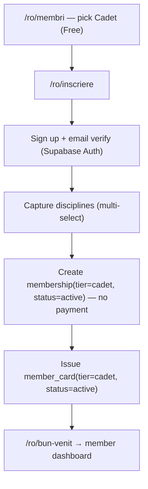

### 3.3 Step narrative (paid path)

1. On `/ro/membri` (`PUB-004`) the visitor reads the locked three-tier table — Cadet / **Aviator (Cel mai popular)** / Comandant, RON-primary with EUR secondary — and toggles monthly/annual. They pick **Aviator, annual (490 RON/yr, ~€99)**.
2. The tier CTA routes to `/ro/inscriere` (`PUB-008`) with the tier and interval pre-selected and preserved in the funnel state. Captain additionally offers the **Founding/Life one-time (4.990 RON, ~€999)** as a distinct Stripe Price.
3. The visitor creates an account (email + password, or magic link) via **Supabase Auth** (`MEM-001`). A `user` row is created and linked to a new `party` (`party_kind = person`) carrying a `member` `party_role` (`XC-001` — one Party, no duplicates).
4. A **verification email** (Resend, in the chosen locale) is sent (`MEM-002`). The visitor clicks the link; the account is marked verified.
5. **Disciplines** are captured (airplane LAPL/PPL, glider SPL, balloon BPL, ULM, parachuting, enthusiast/non-pilot) during or immediately after sign-up (foundation §2; `MEM-008`).
6. The platform creates a **Stripe Checkout Session** server-side with the correct **RON Price** and interval, passing `client_reference_id = party_id` and the locale (`XC-039`). The visitor is redirected to **hosted Checkout** (SAQ-A PCI scope — no card data touches us; `MEM-017`).
7. The visitor enters their card. **Stripe Tax** computes **19% Romanian VAT** on the line. If the issuer requires it, Stripe presents a **3DS / SCA challenge** in-flow.
8. On success Stripe fires `checkout.session.completed` and `invoice.paid` to the **webhook handler** (`XC-002`). The handler verifies the signature, **deduplicates on the Stripe event id** (`NFR-009`), then, using the service role:
   - upserts `memberships` → `status = active` with the Stripe subscription ref;
   - inserts `payments` (`status = succeeded`, brand + last4 only) and `invoices` (`document_kind = cotizatie_receipt`, e-Factura-ready fields populated);
   - **issues the `member_card`** (`tier`, `member_number` e.g. `ASK-2026-000412`, opaque `qr_token`, `status = active`) — see §13.2.
9. Resend sends the **welcome email + cotizație receipt** in the member's locale (`XC-045` — transactional).
10. Stripe redirects to `/ro/bun-venit?session_id=…` (IA page P11 `/ro/bun-venit`; `PUB-008`, the post-checkout landing). Because webhooks are asynchronous, the page **polls membership status** (or re-checks on focus) rather than trusting the redirect alone.
11. Once `status = active`, the page shows the **"Liber de decolare" / "Cleared for takeoff"** confirmation and routes to `/ro/membru` (`MEM-033`) with the live card visible.

### 3.4 Key states & edge cases

| Situation | Behaviour |
|---|---|
| **3DS / SCA challenge** | Handled inside hosted Checkout. If the challenge is abandoned or fails, no `checkout.session.completed` fires; no membership is created. Visitor returns to `/ro/inscriere` with the tier still selected and a retry CTA. |
| **Card declined / `requires_action` never resolved** | No webhook → no membership, no card. The Checkout Session can be retried; an abandoned session expires per Stripe and is garbage-collected. |
| **Redirect returns but webhook not yet processed** | `/bun-venit` shows a brief "Confirming your payment / `Confirmăm plata`" pending state and polls; it never issues a card from the redirect alone (avoids trusting client-side success). |
| **Duplicate / out-of-order webhooks** | Handler is idempotent on event id and tolerant of ordering (`NFR-009`); no duplicate `memberships` / `payments` / `invoices` / `member_cards`. |
| **Email unverified but payment made** | Card is issued (payment is the strong signal), but gated member features prompt verification (`MEM-002`); renewal/receipt emails still send. |
| **Visitor already has an account** | Sign-up step detects the existing email and routes to login (F2), then resumes the funnel with the tier preserved — still **one Party** (`XC-001`). |
| **Locale leakage** | Tier + locale ride through the Stripe round-trip via `client_reference_id` and the `success_url`/`cancel_url` locale segment; the welcome page and email match the chosen locale (`XC-030`, `XC-034`). |
| **Cadet (free) variant** | Skips steps 6–10 entirely: membership `status = active`, card issued at sign-up, no `payment`/`invoice` row. Upgrade to a paid tier later runs F5. |
| **VAT / merchant-of-record** | Stripe Tax applies 19% VAT; the club as merchant of record is a flagged real-world legal/tax decision, not solved here (foundation §11; open question PRD §13.3). |

---

## 4. F2 — Login / email verification / password reset

Three short auth flows on the `/cont/*` (EN `/account/*`) routes, all via Supabase Auth, all rate-limited and non-enumerating (`NFR-004`).

### 4.1 Diagram

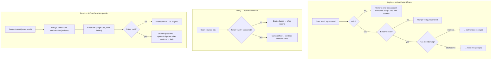

### 4.2 Step narrative

**Login (`MEM-003`).** 1) Member submits email + password (or requests a magic link). 2) On success Supabase establishes a session; the post-login destination depends on identity — a member lands on `/ro/membru`, a staff/admin on `/ro/admin` (the surfaces are independent gates; IA §10 note ¹). 3) The preferred locale persists and drives the landing locale.

**Email verification (`MEM-002`).** 1) New accounts receive a Resend verification email in their locale. 2) Until verified, gated member features prompt verification. 3) The link is single-use; an expired link offers a one-click resend.

**Password reset (`MEM-004`).** 1) The member requests a reset by email. 2) The UI shows an identical confirmation whether or not the email exists (no enumeration). 3) A **single-use, time-limited** link lets them set a new password; on success other sessions may be invalidated, then they are sent to login.

### 4.3 Key states & edge cases

| Situation | Behaviour |
|---|---|
| **Wrong password / unknown email** | Single generic error (`RO: Date de autentificare incorecte`) — never reveals whether the email exists (`NFR-004`, `MEM-003`). |
| **Brute-force attempts** | Login and reset are rate-limited; repeated failures back off. |
| **Expired / reused verify or reset token** | Token rejected; UI offers to resend a fresh link rather than dead-ending. |
| **Protected route hit while logged out** | Middleware redirects to `/ro/cont/autentificare` preserving the **return path and locale** (`MEM-005`, IA §10 enforcement diagram). |
| **Logged-in staff with no membership opening member area** | The member gate denies entry — staff reach the member area only if they personally hold a membership (IA §10 note ¹). |
| **Magic-link in a different browser** | Session is established in the browser that opens the link; the originating tab can re-check on focus. |

---

## 5. F3 — Build aviation profile (license + rating + medical)

The credibility core (G1). Members add their licenses, ratings (each with its own expiry), and highest medical on `/ro/membru/profil-aviatic` (`MEM-009..013`). These three feed the **computed "current to fly"** state (foundation §8) and the expiry-reminder engine — none of it is a single stored flag.

### 5.1 Diagram

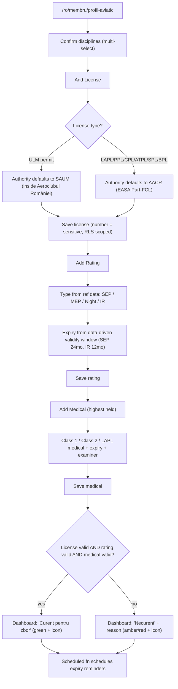

### 5.2 Step narrative

1. The member confirms their **disciplines**, which emphasise the relevant sub-sections (`MEM-008`).
2. **Add a license** (`MEM-009`): pick a type from reference data — **LAPL(A), PPL(A), CPL, ATPL, SPL, BPL, ULM permit**. The UI **enforces the authority distinction**: a **ULM permit** defaults to **SAUM (inside Aeroclubul României), never AACR**; an EASA Part-FCL license defaults to **AACR** (foundation §8; `MEM-009`). The license **number is sensitive** — RLS-scoped to the owner and permitted staff (`NFR-007`).
3. **Add ratings** (`MEM-010`): each rating (**SEP, MEP, Night, IR**) carries its **own validity window and expiry**, sourced from **data-driven** reference data (SEP 24-mo, IR 12-mo) — never hardcoded, so a regulator change is a data edit (`ADM-027`, `NFR-015`).
4. **Add the medical** (`MEM-011`): record the **highest medical held** — **Class 1 (AeMC) ⊃ Class 2 (AME) ⊃ LAPL medical (AME/GP)** — with expiry and examiner. Medical class is sensitive and **never placed on the card or in QR** (`NFR-007`).
5. The dashboard recomputes **"current to fly"** live from the `v_pilot_currency` view (schema §views): valid license **AND** valid rating **AND** valid medical (`MEM-013`). Status is shown with an **icon + label**, never colour alone (`XC-044`).
6. A **daily Supabase scheduled function** reads the `expires_on` / `valid_to` columns and **queues expiry reminders** at the configured lead windows via Resend, treated as transactional (`MEM-019`, `XC-045`).

### 5.3 Key states & edge cases

| Situation | Behaviour |
|---|---|
| **ULM pilot tries to set authority = AACR** | Blocked / auto-corrected to **SAUM** with an explanatory note — the EASA-vs-national distinction is a hard rule (foundation §8). |
| **Rating with no expiry entered** | Expiry is required; the validity window pre-fills the default from reference data but the member confirms the actual `valid_to`. |
| **Expired rating but valid licence + medical** | "Current to fly" shows **not current — reason: rating** (PRD §8.2 computation); the specific lapsed item is named. |
| **Missing medical entirely** | Treated as not-current with reason: medical; an "add your medical" prompt appears. |
| **License/medical scan upload** | Optional upload to the **Documents vault** (F-adjacent, `MEM-028`): private, RLS-scoped, EU-stored, type/size-validated, linked via a polymorphic `attachments` row. |
| **Editing later** | Each edit sets audit columns; the reminder schedule recomputes on the next daily run. |
| **Staff viewing the profile** | Sensitive fields (license number, medical class) are visible only to permitted staff and the **view is audited** (`ADM-004`, `ADM-030`). |

---

## 6. F4 — View & add card to wallet, then partner-side QR verification / redemption

The signature artefact: a real digital member card that a partner can verify at a fuel pump or school desk **without ever seeing personal data**. The QR resolves through a **security-definer function** that returns only `{valid, tier_code, holder_name, status}` (schema §member_cards RLS) — never the full row, never a license or medical.

### 6.1 Diagram

```mermaid
sequenceDiagram
    autonumber
    actor M as Member
    participant Mem as Member area
    participant DB as Supabase DB
    participant GW as Google Wallet
    actor Partner as Partner (scanner)

    M->>Mem: /ro/membru/card
    Mem->>DB: Read own card (tier, member_number, qr_token, status)
    Mem-->>M: Web card (tier accent + silhouette watermark) + PDF download
    M->>Mem: "Adaugă în Google Wallet"
    Mem->>GW: Issue pass (tier, member_number, QR) 
    GW-->>M: Pass saved (auto-updates on tier/status change)

    Note over Partner,DB: At a partner location
    Partner->>DB: Scan QR → verify endpoint (qr_token)
    DB-->>Partner: { valid, tier_code, holder_name, status } only
    alt Card valid + benefit eligible
        M->>Mem: Redeem benefit X
        Mem->>DB: Insert redemption(issued) → show code/QR
        Partner->>DB: Mark redeemed (or void) — audited
    else Card expired / revoked
        DB-->>Partner: status = expired/revoked → "Not valid"
    end
```

### 6.2 Step narrative

1. The member opens `/ro/membru/card` (`MEM-020`). The **web card** renders the live tier with the correct **accent** (Cadet = sky, Aviator = brass, Captain = engraved navy + brass) and the brand **silhouette watermark**; `member_number` is shown in IBM Plex Mono.
2. They can **download a PDF** of the card (`MEM-021`, server-generated, includes the QR).
3. They tap **"Adaugă în Google Wallet" / "Add to Google Wallet"** (`MEM-022`). A pass is issued carrying tier, member number, and the QR; it **auto-updates** when tier or status changes (`XC-003`). Apple Wallet (`.pkpass`) is the same shape, gated behind the paid Apple program (`MEM-023`, Could).
4. At a partner location a **partner scans the QR**. The QR encodes the opaque `qr_token` (not personal data); it resolves to the **verification endpoint** which calls the security-definer function and returns only `{valid, tier_code, holder_name, status}` (`XC-043`).
5. If the card is **valid** and the member's **tier is eligible** for the benefit (computed from `benefit_tier_eligibility`), the member redeems it (`MEM-025`): a `redemptions` row is inserted (`status = issued`, member, benefit, code, timestamp) and a redemption **code/QR** is shown. The partner marks it **redeemed** (or **void**), an audited state change.

### 6.3 Key states & edge cases

| Situation | Behaviour |
|---|---|
| **Expired / cancelled membership** | Card renders an **expired/invalid** state; `card_status` is `expired`/`revoked`; the QR verify endpoint returns `status = expired/revoked` → partner sees **"Not valid" / `Card invalid`** (`MEM-020`). |
| **Past-due (dunning grace window)** | While the membership is `past_due`, `card_status` is `suspended` (§13.2, §7.3): the verify endpoint returns `status = suspended` and the partner sees a **"valid — renewal pending" / `valid — reînnoire în curs`** warning, not "Not valid" — until the dunning window is exhausted and the card flips to `expired`. |
| **Tier change** | Card, QR validity semantics, and wallet passes update to the new tier (`XC-003`); accent and entitlements follow. |
| **Member not eligible for a benefit by tier** | Redemption denied with an **honest upgrade prompt** to `/ro/membri` (`MEM-025`, IA §2.5) — never a dead 403. |
| **Benefit out of stock / per-period cap reached** | Redemption blocked with a clear message; no `redemptions` row created (`MEM-025`). |
| **Captain "deepest discount" benefit** | Additionally **conditioned on recurrent-training proof** — an eligibility rule on `redemptions`, not a separate route (foundation §4; IA §10 note ²). |
| **QR payload privacy** | Token is opaque and rotates on card revoke; no license number / medical class / personal data is ever in the QR or the verify response (`NFR-007`, `XC-043`). |
| **Redemption ledger integrity** | `redemptions` is append-only to members (insert own; no update/delete); a "void" is a service-role/state change, never a row deletion (schema §redemptions RLS). |
| **Partner verification surface** | Whether the QR endpoint is fully public or requires a partner-side login is a flagged open question (PRD §13.8); the function-level data minimisation holds either way. |

---

## 7. F5 — Renew / upgrade / downgrade / cancel via Stripe Customer Portal + dunning

All subscription lifecycle changes flow through the **Stripe Customer Portal** (`MEM-016`); the platform only mirrors the result via webhooks (`XC-002`). Failed renewals enter **Stripe dunning**; the platform reflects `past_due` and recovers or expires the membership accordingly. The membership and card state machines are in §13.1–§13.2.

### 7.1 Diagram — portal-driven changes + dunning

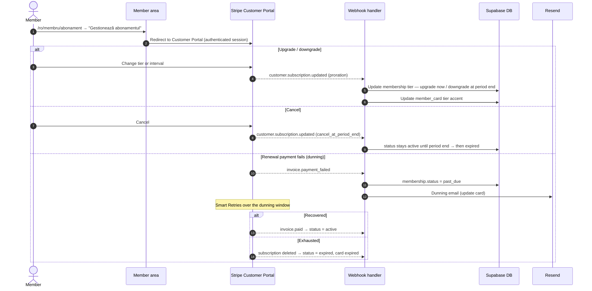

### 7.2 Step narrative

1. The member opens `/ro/membru/abonament` (`MEM-014`) and sees their **current tier, status, interval, renewal date, and price** (RON-primary), reflecting the live Stripe state via the mirror.
2. They click **"Gestionează abonamentul"** and are redirected to the **Stripe Customer Portal** (`MEM-016`).
3. **Upgrade** (e.g. Aviator → Captain): Stripe handles **proration**; on `customer.subscription.updated` the webhook updates the membership tier **immediately** and the **card tier accent** (`MEM-015`, `XC-003`).
4. **Downgrade** (e.g. Aviator → Cadet): paid features **lapse at period end**, not immediately; the card tier updates at that boundary (`MEM-015`).
5. **Cancel**: Stripe sets cancel-at-period-end; `membership.status` stays `active` until the period ends, then the webhook moves it to `expired` and the card to `expired` (§13.1–§13.2).
6. **Renewal**: at period end Stripe attempts the charge. On `invoice.paid` the membership renews (`active`); a **cotizație receipt** is generated.
7. **Dunning** (renewal charge fails): `invoice.payment_failed` → membership `past_due`; a **dunning email** (Resend, transactional) asks the member to update their card via the Portal. Stripe **Smart Retries** run across the dunning window. If a retry succeeds → `active`; if the window is exhausted → subscription deleted → membership `expired`, card `expired`.

### 7.3 Key states & edge cases

| Situation | Behaviour |
|---|---|
| **3DS/SCA required on a renewal** | Stripe marks the invoice `requires_action`; the dunning email links the member to complete authentication via the Portal. Until resolved, membership is `past_due` (off-session SCA case). |
| **Expired card on file** | First renewal attempt fails → `past_due` + dunning; member updates the card in the Portal; next retry recovers (`active`). |
| **Downgrade then re-upgrade mid-period** | Stripe proration reconciles; the mirror follows the latest `customer.subscription.updated`; no double-charge. |
| **Founding/Life (one-time) Captain** | A one-time Price, not a recurring subscription; renewal/dunning do not apply; entitlements are perpetual Captain (modelling flagged — PRD §13.2). |
| **Out-of-order / duplicate webhooks** | Mirror updates are idempotent on event id and tolerate ordering (`NFR-009`); the latest authoritative Stripe state wins. |
| **Member edits in Portal we don't expect** | The platform treats Stripe as source of truth — any Portal-side change is absorbed by the next webhook, never overridden by the app (`XC-002`). |
| **Cancellation reversal before period end** | If the member re-subscribes before expiry, `cancel_at_period_end` is cleared via the Portal and the mirror returns to `active`. |
| **Grace semantics on the card** | While `past_due`, the card moves to `card_status = suspended` (the grace window in §13.2) rather than flipping straight to invalid. During the dunning window the partner-verify endpoint returns `status = suspended` and the partner sees a **"valid — renewal pending" / `valid — reînnoire în curs`** warning (still honourable). If the dunning window is exhausted the card flips to `expired` and reads **"Not valid"**. |

---

## 8. F6 — Consent management + GDPR data export & erasure

The privacy center on `/ro/membru/confidentialitate` (`MEM-029..032`). The **consent ledger is append-only** — every grant or withdrawal is a *new* row, never an overwrite — and lawful basis distinguishes **contract performance** (core membership) from **consent** (marketing / sponsor sharing / directory) (`XC-040`).

### 8.1 Diagram

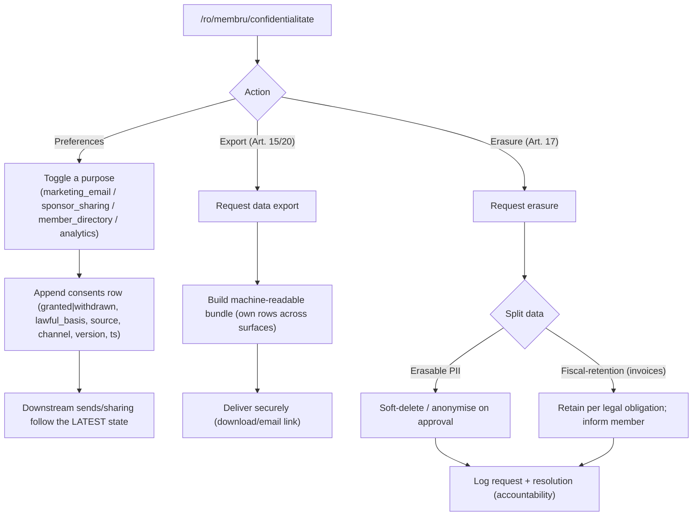

### 8.2 Step narrative

1. **Communication preferences (`MEM-029`).** Each preference maps to a **`consent_purpose`** — `marketing_email`, `marketing_sms`, `sponsor_sharing`, `member_directory`, `analytics` (and `service` for contract performance). Toggling one appends a `consents` row with `status`, `lawful_basis`, `source`, `channel`, `version`, and timestamp.
2. **Consent center (`MEM-030`).** The member sees their consent **history** and can withdraw. A withdrawal **appends** a `status = withdrawn` row (the prior row is preserved); downstream sends and sharing immediately follow the **latest** state (`XC-040`).
3. **Transactional vs marketing.** Receipts, verification, renewal/expiry, and security messages are **not** subject to marketing opt-out (`XC-045`); only marketing/sponsor/analytics purposes are consent-gated.
4. **Data export (`MEM-031`).** The member requests an export; the platform assembles a **machine-readable bundle** of their own rows across all surfaces and delivers it securely.
5. **Erasure (`MEM-032`).** The platform **splits** the request: erasable PII is soft-deleted/anonymised on approval; records under **fiscal retention** (invoices/payments) are retained per legal obligation, and the member is **told what must be kept versus erased**. The request and its resolution are logged for accountability.

### 8.3 Key states & edge cases

| Situation | Behaviour |
|---|---|
| **Withdraw marketing while a campaign is queued** | The campaign send-time consent check excludes them (F10); the latest ledger state governs, even mid-campaign (`XC-040`, `ADM-019`). |
| **Erasure vs active membership** | An active membership relies on **contract performance**; full erasure may require cancelling the membership first — the flow explains this rather than silently failing. |
| **Invoice records and erasure** | Fiscal-retention records are retained; the precise retention period is a flagged open question (PRD §13.7). |
| **Export of sensitive fields** | License numbers and medical class are the member's own data and are included in *their* export, delivered securely — but never exposed to other members or on the card. |
| **Cookie/consent banner** | Public-site banner choices also write to the consent ledger (`PUB-011`, IA), so the ledger is the single source for lawful basis. |
| **Append-only guarantee** | No UI path edits or deletes a prior consent row; the schema enforces append-only on `consents` (schema §consents). |

---

## 9. F7 — Admin: create partner organization (party + role) → attach contract → renewal reminder

The CRM is organised around the **Party model** (IA §2.6): a flight school and a sponsor are both **parties holding a role**, not separate menus. This flow creates the org, links it, attaches a contract, and wires it into the compliance/renewals surface.

### 9.1 Diagram

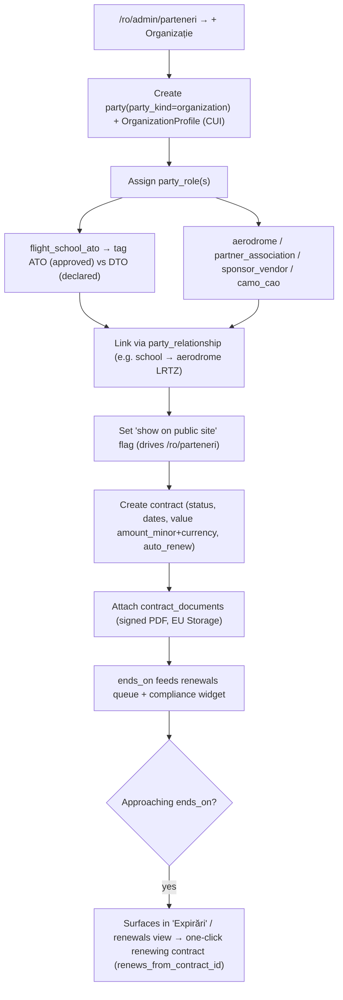

### 9.2 Step narrative

1. In **Organizații partenere** (`/ro/admin/parteneri`, `ADM-007`) staff create a `party` with `party_kind = organization` and an `OrganizationProfile` (including **CUI** for invoicing).
2. They assign one or more **`party_role`s**: `flight_school_ato`, `partner_association`, `aerodrome`, `sponsor_vendor`, `camo_cao`, `regulator`. A flight school is tagged **ATO (approved) vs DTO (declared)** (foundation §8).
3. They create **typed `party_relationship`s** (`ADM-008`) — e.g. *Regional Air Services → aerodrome Tuzla LRTZ*, or *school → aerodrome* — rendered on both parties' detail views.
4. A **"show on public site"** flag controls whether the partner appears in the public showcase `/ro/parteneri` (`ADM-007`, `PUB-007`); only flagged + active partners render there.
5. Staff create a **contract** (`ADM-010`): status, dates, **value as `amount_minor + currency`**, `auto_renew`, and (for renewals) `renews_from_contract_id`.
6. They attach **`contract_documents`** (signed PDF) to Supabase Storage (EU), access-controlled and versioned (`ADM-011`).
7. The contract's `ends_on` feeds the **renewals queue** and the dashboard **compliance/expiry widget** (`ADM-002`, `ADM-012`); a daily scheduled function surfaces contracts nearing their end date in the **"Expirări"** pill, with one-click creation of a renewing contract.

### 9.3 Key states & edge cases

| Situation | Behaviour |
|---|---|
| **Same legal entity is both sponsor and aerodrome** | One Party holding multiple `party_role`s — not two records (IA §2.6); avoids duplicates. |
| **Public visibility consent** | Whether logos on `/ro/parteneri` need explicit per-partner contractual permission is flagged (PRD §13.5); the "show on public site" flag is the control point. |
| **Auto-renew contract reaches end date** | Surfaces in the renewals queue regardless; auto-renew status is shown so staff can confirm or supersede (`ADM-012`). |
| **Contract document access** | `staff`/`admin` only; members/visitors have no access to contracts (schema §contracts RLS). |
| **Soft-delete a partner** | `deleted_at` set; the partner drops from default lists and the public showcase; restorable by admin (`NFR-010`). |
| **Currency** | Contract value stored with explicit currency (RON default but not assumed); display via `Intl ro-RO` (`XC-033`). |

---

## 10. F8 — Admin: create benefit → set tier eligibility → track redemption

Closes the loop with F4: staff define a benefit, set which tiers qualify, and watch redemptions accrue. Bilingual fields are mandatory (`ADM-013`).

### 10.1 Diagram

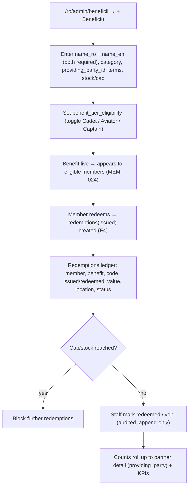

### 10.2 Step narrative

1. In **Beneficii** (`/ro/admin/beneficii`, `ADM-013`) staff create a benefit. **Both `name_ro` and `name_en`** are required — saving without both is blocked. They set category, **`providing_party_id`** (the partner from F7), terms, and any stock/per-period cap.
2. They configure **`benefit_tier_eligibility`** by toggling Cadet / Aviator / Captain (`ADM-014`); member-facing eligibility (`MEM-024`) updates immediately.
3. Eligible members see and redeem the benefit (F4); each redemption creates a `redemptions` row.
4. The **redemptions ledger** (`ADM-015`) shows member, benefit, code, issued/redeemed timestamps, value, location, and status; staff can mark a redemption **fulfilled or void** with audit. Redemption counts roll up onto the **partner detail** view (`ADM-009`) and dashboard KPIs (`ADM-001`).

### 10.3 Key states & edge cases

| Situation | Behaviour |
|---|---|
| **Missing a bilingual name** | Save blocked with a field-level error; both locales required (`ADM-013`, `XC-034`). |
| **Tier toggled off after redemptions exist** | Existing redemptions stand (append-only ledger); new redemptions for now-ineligible tiers are denied with an upgrade prompt (`MEM-025`). |
| **Stock / per-period cap reached** | Redemption blocked at the member side; no row created (`MEM-025`); the ledger shows the cap state. |
| **Captain recurrent-training-gated benefit** | Eligibility rule on redemption additionally checks recurrent-training proof (foundation §4; IA §10 note ²). |
| **Void a redemption** | Recorded as a status change, never a delete — the ledger is append-only (schema §redemptions RLS). |
| **Benefit above a member's tier** | Shown to members as a **locked upgrade incentive**, not hidden (`MEM-024`, IA §2.5). |

---

## 11. F9 — Admin: add aircraft → ARC/airworthiness + insurance → eligibility-gated booking

Fleet is a **modelled CRM capability**, not a launch flight-access promise — dues ≠ flying spend (foundation §13.6). The flow still enforces real airworthiness rules: a non-expiring CofA validated by an **ARC (1-yr, extendable max ×2)**, plus insurance, plus booking gated by member eligibility and no double-booking.

### 11.1 Diagram

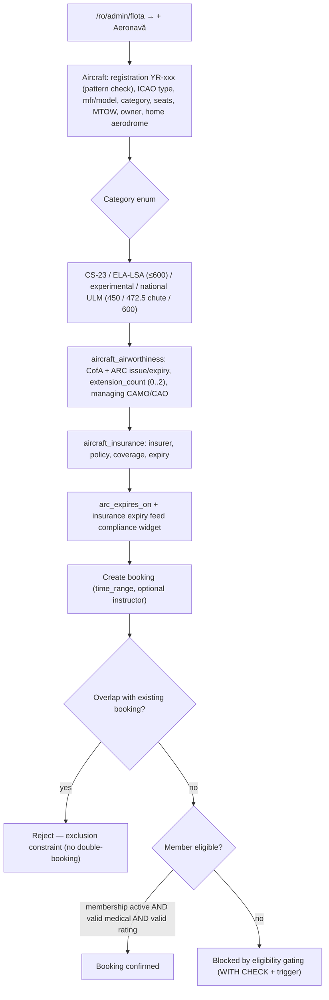

### 11.2 Step narrative

1. In **Flotă** (`/ro/admin/flota`, `ADM-020`) staff register an aircraft keyed by **registration `YR-xxx`** (pattern-validated), with ICAO type designator, manufacturer, model, **category** (enum: **CS-23 / ELA-LSA ≤600 kg / experimental / national ULM 450 / 472.5 with ballistic chute / 600**), seats, MTOW, owner (a party), and home aerodrome (reference data).
2. They record **airworthiness** (`ADM-021`): CofA plus the **ARC** as a recurring **1-year expiry** (`arc_expires_on`), extendable a **maximum of twice** (`extension_count` 0–2, enforced by check constraint) by a managing **CAMO/CAO**.
3. They record **insurance** (`ADM-022`): insurer, policy number, coverage, expiry.
4. `arc_expires_on` and the insurance expiry feed the **compliance/expiry widget** (`ADM-002`) via the daily scheduled function.
5. Staff (or, where enabled, members) create a **booking** (`ADM-025`) with a `time_range` and optional instructor. The booking is rejected if it **overlaps** an existing one for the same aircraft (GiST exclusion constraint — no double-booking) and is **blocked unless the member is eligible**: active membership **AND** valid medical **AND** valid rating (enforced in the RLS policy `WITH CHECK` plus a trigger — schema §bookings). The UI states that booking is a modelled capability, not a flight-access promise (`ADM-025`).

### 11.3 Key states & edge cases

| Situation | Behaviour |
|---|---|
| **Registration not matching `YR-`** | Rejected by pattern validation (`ADM-020`, `NFR-006`). |
| **ARC extension beyond ×2** | Blocked by the `extension_count between 0 and 2` check; staff must record a fresh ARC instead (foundation §8). |
| **Overlapping booking** | Hard rejection via the exclusion constraint — the DB guarantees no double-booking regardless of UI (schema §bookings). |
| **Member not current to fly** | Booking blocked at the policy/trigger layer (valid medical + rating + active membership), not just the UI (`ADM-025`, foundation §7). |
| **Aircraft grounded / in maintenance** | `aircraft_status` (`grounded`/`maintenance`) prevents/flags bookings; surfaced in the fleet view. |
| **Maintenance & hours** | `MaintenanceLog` next-due (by hours or date) and `FlightLog` airframe totals surface upcoming maintenance (`ADM-023`, `ADM-024`). |
| **Member-initiated booking scope** | Whether members ever self-book in the concept is a flagged open question (PRD §13.4); admin-side booking always works. |

---

## 12. F10 — Admin: build a segment → send a campaign respecting the consent ledger

The communications backbone, with the **consent gate as a hard, automatic step** at send time (`ADM-019`, `XC-040`). Marketing sends are gated; transactional sends are not (`XC-045`).

### 12.1 Diagram

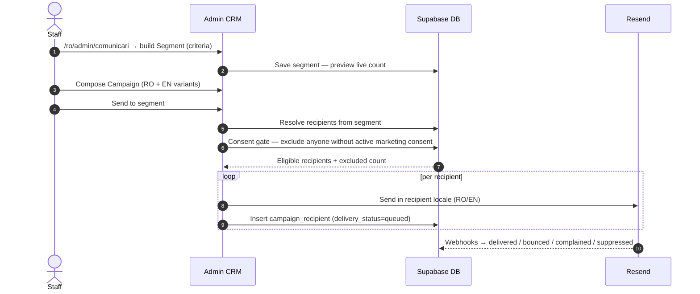

### 12.2 Step narrative

1. In **Comunicări** (`/ro/admin/comunicari`, `ADM-017`) staff define and save a **Segment** (filter criteria over members/parties) with a **live count preview**.
2. They compose a **Campaign** (`ADM-018`) with **bilingual variants** (RO + EN).
3. On send, recipients are resolved from the segment, then the **consent gate** runs (`ADM-019`): anyone **without active marketing consent** for the relevant purpose is **automatically excluded**, and the **exclusion count is shown** before/at send.
4. Eligible recipients each get the email in **their preferred locale** via Resend; a `campaign_recipients` row is created per recipient (`delivery_status = queued`).
5. Resend delivery webhooks update each recipient's `delivery_status` (`delivered` / `bounced` / `complained` / `suppressed`).

### 12.3 Key states & edge cases

| Situation | Behaviour |
|---|---|
| **Recipient withdrew consent between segment build and send** | Excluded at **send-time** evaluation — the latest ledger state governs, not the segment snapshot (`XC-040`, F6). |
| **Transactional vs marketing** | Renewal/expiry/receipt/security emails bypass the marketing consent gate (`XC-045`); only marketing/sponsor purposes are gated. |
| **Missing locale translation** | Falls back per `XC-034` with a visible notice — never a broken send. |
| **Hard bounce / complaint** | Recipient suppressed; future sends respect suppression; surfaced in the campaign report. |
| **All recipients excluded by consent** | Send is effectively empty; staff see the exclusion count and a warning rather than a silent no-op (`ADM-019`). |
| **Consent ledger as the gate of record** | The admin consent view (`ADM-019`) lets staff verify lawful basis before sending; the gate is enforced server-side, not advisory. |

---

## 13. Shared state machines (referenced by multiple flows)

Defined once here; F1, F4, and F5 point to them. Enum values are exactly those in `06-database-schema.md`.

### 13.1 Membership lifecycle (`membership_status`)

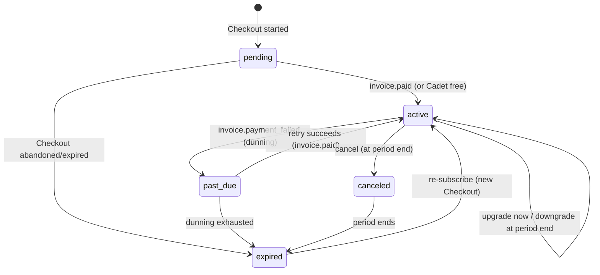

Values: `pending`, `active`, `past_due`, `canceled`, `expired`, `trialing`. `trialing` exists in the `membership_status` enum for forward-compatibility but is **unused in the concept build** (no trial offer ships; no `pending → trialing → active` transitions are wired). **Only the webhook/service role mutates `memberships.status`** (schema §RLS) — never the member directly.

### 13.2 Member card lifecycle (`card_status`)

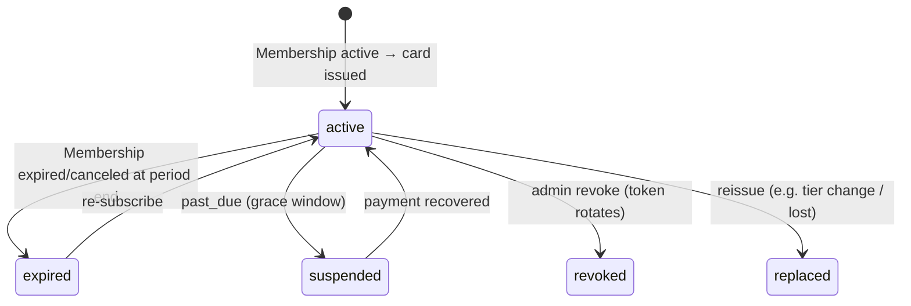

Values: `active`, `suspended`, `expired`, `revoked`, `replaced`. The QR `qr_token` **rotates on revoke**; the verify function always reflects the current `status` (§6).

### 13.3 Payment status (`payment_status`)

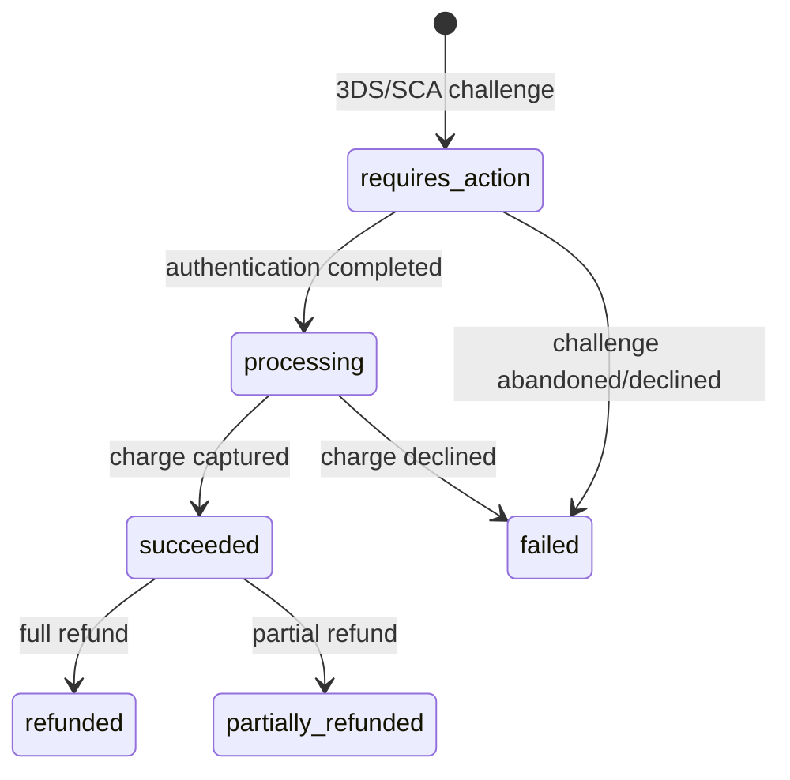

Values: `requires_action`, `processing`, `succeeded`, `failed`, `refunded`, `partially_refunded`. **`payments` rows are created only by the Stripe webhook** (service role); members never write them (schema §payments RLS). This is the row that carries the 3DS/SCA outcome surfaced in F1 and F5.

---

## 14. Cross-flow consistency checklist

This document assumes — and the build must honour:

- **One Party across surfaces** (`XC-001`): the same `party` powers public sign-up, the member area, and the CRM record; the funnel never creates a duplicate.
- **Stripe is billing truth** (`XC-002`): every membership/payment/invoice/card state change in F1 and F5 originates from a verified, idempotent webhook — never from a client redirect.
- **The card reflects live membership** (`XC-003`): tier changes, cancellation, and dunning all propagate to the web/PDF/wallet card and its QR validity (§13.2).
- **Consent ledger governs all marketing** (`XC-040`): F6 writes it append-only; F10 reads the latest state at send time; transactional email (`XC-045`) is never gated.
- **Sensitive data never on the card or in QR** (`NFR-007`, `XC-043`): the verify function returns only `{valid, tier_code, holder_name, status}`.
- **SAUM ≠ AACR** (foundation §8): the aviation-profile flow enforces SAUM as the ULM authority and AACR for EASA Part-FCL.
- **Computed currency, not a flag** (foundation §8): "current to fly" is recomputed live from license + rating + medical, and gates bookings (F9).
- **Locale + tier survive every redirect** (`XC-030`): including the Stripe round-trip; RO is default; emails match the recipient's locale.
- **RBAC enforced in depth** (`XC-037`, `XC-038`): middleware route gate + Postgres RLS + UI affordance; admin flows are `staff`/`admin` only, Settings is `admin`-exclusive.
