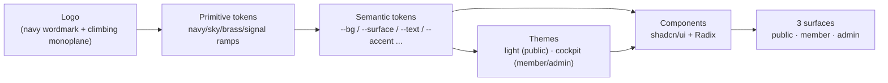
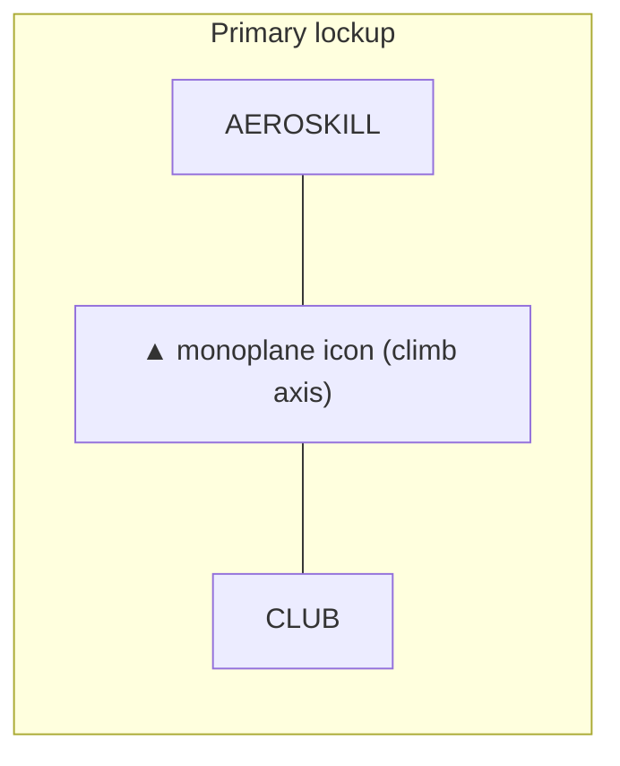
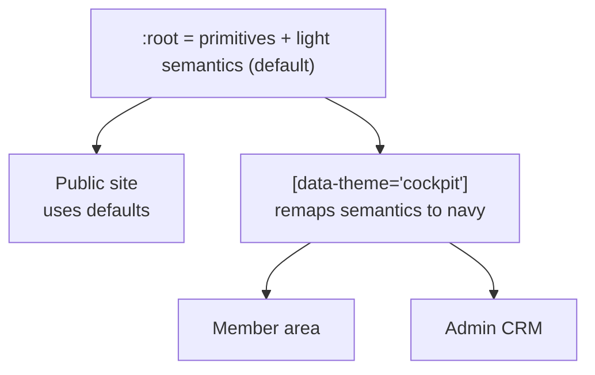
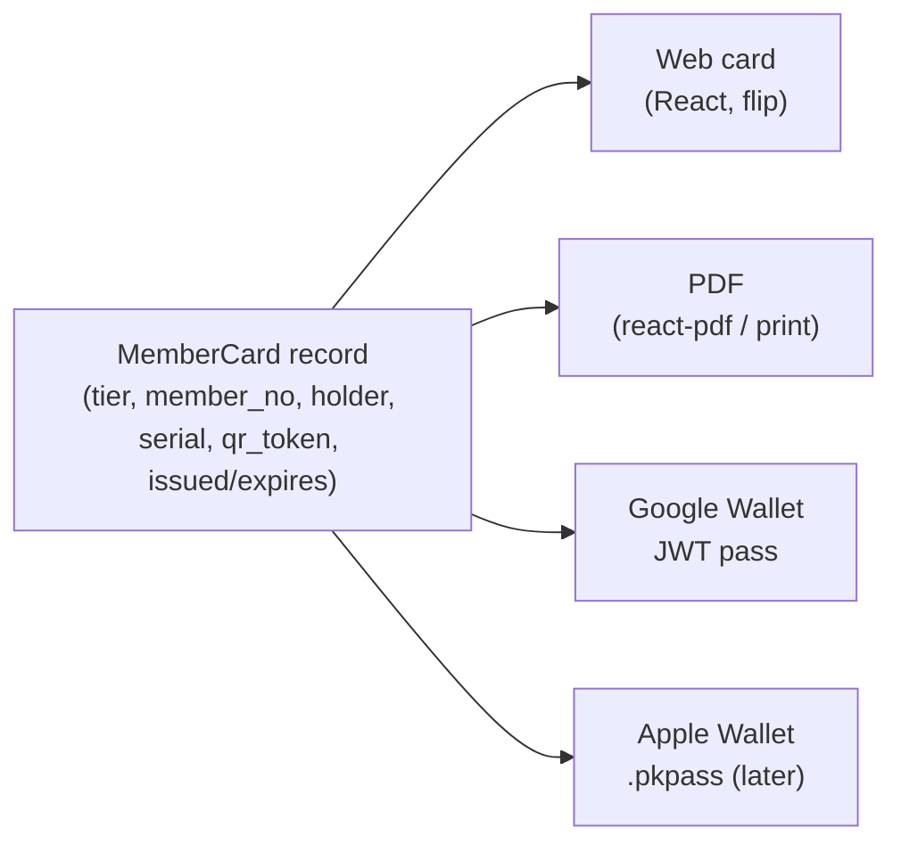
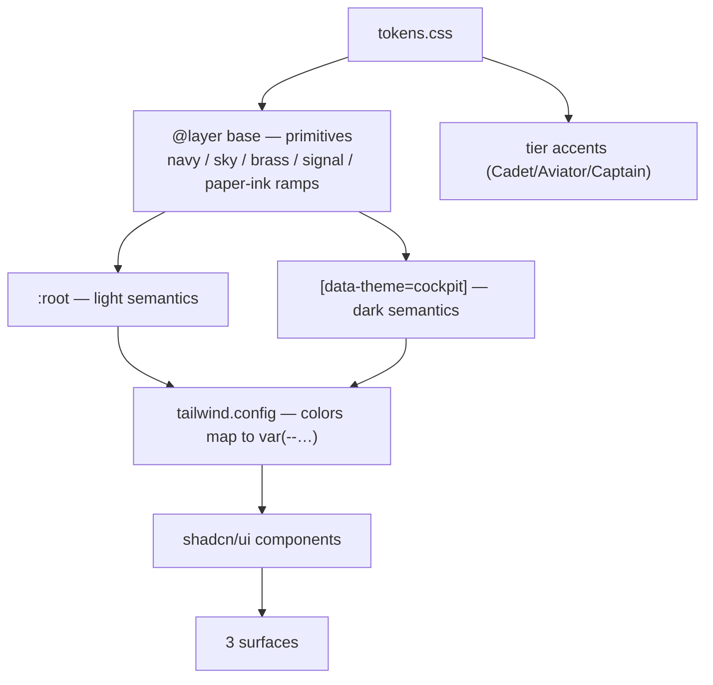

# Aeroskill Club — Design System

> The logo-driven brand, token, type, component, and motion language that makes the public site, member area, and admin CRM feel like one instrument panel.
>
> _Part of the Aeroskill Club planning set — read alongside 00-foundation.md._

---

## 0. How to use this document

This is the **visual + interaction source of truth** for all three surfaces. It turns the real Aeroskill Club mark into a re-skinnable token system, a Space Grotesk / Inter / IBM Plex Mono type system, a component kit (shadcn/ui + Radix on Tailwind), and a digital member card spec — all bilingual Romanian-first.

It inherits everything from `00-foundation.md` §12 and never contradicts it. Where the foundation gives a hex or a name (`--brand-navy #102844`, Cadet/Aviator/Captain, "cockpit" dark theme), this document keeps it verbatim and only *expands* it into a full ramp and semantic mapping.

**Token-first rule.** No component, no document, and no Claude Code prompt should ever hardcode a hex value or a pixel font size. Everything resolves through the CSS custom properties defined in §3–§7. Themes (light public / dark cockpit) and a future logo swap are therefore a **one-file** change (`tokens.css` + the Tailwind theme extension).



---

## 1. Brand essence

### 1.1 The idea in one line

Aeroskill Club is **"ACR for pilots, done in a modern way"** — a premium-yet-approachable, bilingual general-aviation members' club. The design must read as *credible to a 52-year-old aircraft owner* and *welcoming to a 19-year-old student* at the same time. The mood word is **calm authority** — the feeling of a well-lit cockpit at cruise, not a marketing funnel.

### 1.2 Personality coordinates

| Axis | We are… | We are NOT… |
|---|---|---|
| Tone | Confident, precise, warm | Salesy, jokey, hype-driven |
| Texture | Engineered, instrument-clean | Skeuomorphic gauges, leather, chrome bezels |
| Color | Deep navy + restrained sky/brass | Rainbow gradients, neon |
| Density | Generous whitespace, one focal action | Cluttered dashboards |
| Voice | "An experienced captain briefing a friend" | A regulator's PDF; a budget airline |

### 1.3 Three design pillars (from positioning)

1. **Bilingual, modern UX** — every layout is designed for the *longer Romanian string* first; English is the peer, never the source.
2. **A real digital member card** — the card is the brand's hero artifact (see §11). It must look good as a phone wallet pass, a web card, and a PDF.
3. **Instrument credibility** — correct aviation vocabulary and an "instrument + horizon" motif kit (§8) signal that this was built by people who understand GA.

---

## 2. Logo & mark usage

### 2.1 The actual mark

The locked logo is an uppercase, geometric-grotesk **"AEROSKILL ✈ CLUB"** lockup in a single deep navy, split into two words by a custom aircraft icon used as the visual "×"/separator:

- **Wordmark.** Heavy, near-monoline geometric grotesk caps with engineered (slightly rounded) terminals and generous, confident letter-spacing. The cut is close to **Space Grotesk** in spirit — which is exactly why Space Grotesk is the display face (§5). Single color: `--brand-navy`.
- **Icon.** A **climbing aerobatic low-wing monoplane** seen from a dynamic three-quarter top angle, posed on a **lower-left → upper-right diagonal** (the "climb-out" axis). Single tractor **propeller** at the nose; low wings; a defined tailplane. A signature detail: a **thin negative-space slipstream/contrail line** slices along the fuselage, giving the solid silhouette its only internal cut. This stroke is a brand asset — echoed by the divider and "contrail" motifs in §8.
- The icon is a **strong standalone silhouette** and is the canonical favicon, app icon, and member-card watermark.



### 2.2 Lockup variants

| Variant | File intent | Use |
|---|---|---|
| **Full horizontal** | `logo-full` (navy on transparent) | Public header, footer, emails, invoices, marketing |
| **Icon-only** | `mark` | Favicon, PWA/app icon, member-card watermark, avatar fallback, loading state, compact mobile nav |
| **Stacked** | `logo-stacked` (icon above wordmark) | Square social avatars, the physical/metal Captain card face |
| **Wordmark-only** | text without icon | Rare; only where the icon would be illegibly small but a square mark won't fit |

Each variant ships in two color treatments: **navy** (for light backgrounds) and **cloud/white** (for the cockpit dark backgrounds and photography). Never recolor the mark to sky, brass, or any signal color.

### 2.3 Clear space & minimum size

- **Clear space** = the cap-height of the wordmark ("**A**") on all four sides. Measured from the outermost ink (prop tip / descending tail). Nothing — text, rule, image edge, button — intrudes.
- **Minimum sizes:**
  - Full horizontal lockup: **≥ 132 px** wide on screen / **≥ 28 mm** in print. Below this the slipstream cut and prop fill in.
  - Icon-only: **≥ 24 px** on screen (favicon 32/16 px uses a simplified single-mass version with the slipstream removed) / **≥ 8 mm** print.

### 2.4 On light vs on dark

| Background | Logo treatment |
|---|---|
| `--paper` / white (public) | Navy mark |
| `--navy-900/800` cockpit (member/admin) | **Cloud** (`#E8EDF4`) mark — never pure `#FFFFFF` (too harsh against navy) |
| Photography | Cloud mark, placed over the darkest quadrant; add a subtle 0–40% navy scrim if local contrast < 3:1 |
| Brass/premium (Captain card) | Navy mark on brass, or cloud mark on engraved navy — both, never brass-on-brass |

### 2.5 Do / Don't

**Do**

- Keep the navy single-color treatment.
- Let the icon's climb axis run lower-left → upper-right.
- Use the icon-only mark as a watermark at 4–8% opacity behind hero/card art.

**Don't**

- ✗ Recolor the mark, add gradients, bevels, or drop shadows.
- ✗ Rotate, flip, or "level out" the climbing aircraft (it must climb, not dive).
- ✗ Stretch/condense the wordmark or re-letter-space it.
- ✗ Place the navy mark on a low-contrast mid-navy or busy photo without a scrim.
- ✗ Re-create the wordmark in a different typeface, or swap the icon separator for a literal "×".
- ✗ Box the logo in a colored chip unless it's the approved square app-icon container (navy field, cloud mark).

---

## 3. Color system

All colors live in **one tokens file** as **primitive** CSS variables, then are mapped to **semantic** variables per theme (§4). Primitives never appear directly in components — only semantics and tier accents do.

### 3.1 Primitive ramp — tokens table

> Values marked *(foundation)* are taken verbatim from `00-foundation.md` §12. The rest extend those anchors into accessible ramps.

#### Brand navy (core surface & ink in cockpit)

| Token | Hex | Role |
|---|---|---|
| `--navy-900` | `#0A1A33` *(foundation)* | Darkest cockpit background |
| `--navy-800` | `#0F2440` *(foundation)* | Cockpit base surface |
| `--brand-navy` | `#102844` *(foundation)* | **The brand navy** — logo ink, primary buttons (light theme) |
| `--navy-700` | `#1B3A63` *(foundation)* | Raised cockpit surface, navy borders |
| `--navy-600` | `#27507F` | Hover on navy surfaces |
| `--navy-500` | `#34689E` | Disabled / muted navy |

> **Open decision #7 (foundation):** `--brand-navy #102844` is sampled from the logo and pending source-vector confirmation (possibly ~`#1B2A4A`). It is a one-line re-skin edit to the primitive ramp; semantics and components follow automatically.

#### Paper & ink (light public theme)

| Token | Hex | Role |
|---|---|---|
| `--paper` | `#F7F9FC` *(foundation)* | Public page background |
| `--paper-raised` | `#FFFFFF` | Cards/inputs on public |
| `--paper-sunken` | `#EEF2F8` | Wells, table zebra, code blocks |
| `--ink` | `#0A1322` *(foundation)* | Body text on light |
| `--ink-muted` | `#42526B` | Secondary text on light (AA body; ~7:1 measured) |
| `--ink-faint` | `#6B7A92` | Hints/placeholders on light (large/UI only) |
| `--cloud` | `#E8EDF4` *(foundation)* | Body text on dark cockpit |
| `--cloud-muted` | `#A9B7CC` | Secondary text on dark (AA body; ~7:1 measured) |
| `--cloud-faint` | `#7C8AA3` | Hints on dark (large/UI only) |

#### Sky accent (links, secondary CTA, Cadet tier)

| Token | Hex | Role |
|---|---|---|
| `--sky-600` | `#2566B0` | Sky pressed; sky text on light needing 4.5:1 |
| `--sky-500` | `#2E7DD1` *(foundation)* | Primary link / accent base |
| `--sky-400` | `#4F9BE8` *(foundation)* | Accent on dark cockpit (4.5:1 on navy) |
| `--sky-300` | `#7FB8F0` | Hover glow on dark |
| `--sky-100` | `#DCEBFB` *(foundation)* | Tinted fills, selected rows (light) |

#### Brass (premium — large / decorative only)

| Token | Hex | Role |
|---|---|---|
| `--brass-600` | `#9A7230` | Brass text/icon at ≥18px needing AA |
| `--brass-500` | `#B6883E` *(foundation)* | Aviator accent, Captain metal |
| `--brass-300` | `#D9B26A` *(foundation)* | Decorative gilt edges, large numerals |
| `--brass-100` | `#F1E4C8` | Brass tint fill (light) |

> **Brass is never used for small body text, default links, or sole-meaning icons.** It is a *finish*, not a UI color (see contrast matrix §3.3).

#### Signal (cockpit convention — never color-only)

| Token | Hex (light) | Hex (dark) | Role |
|---|---|---|---|
| `--ok-green` | `#2FA66B` *(foundation)* | `#3FBF7F` | Valid / current / paid |
| `--caution-amber` | `#E0A106` *(foundation)* | `#F0B72A` | Expiring soon / attention |
| `--warn-red` | `#D14848` *(foundation)* | `#E36A6A` | Expired / failed (large/UI; pair icon+label) |
| `--warn-red-600` | `#B83A3A` | `#E36A6A` | Destructive button fill (white text ≥4.5:1) |
| `--info-sky` | `#2E7DD1` | `#4F9BE8` | Neutral info (small text uses `--sky-600`, see §3.4) |

Each signal also has a `-bg` tint (e.g. `--ok-green-bg #E4F4EC` / dark `#15301F`) for badge backgrounds.

### 3.2 Semantic tokens — light & dark mapping

Components consume **only** these. Switching `data-theme` swaps the whole UI.

| Semantic token | Light (public) | Dark / cockpit (member, admin) | Used by |
|---|---|---|---|
| `--bg` | `--paper` `#F7F9FC` | `--navy-900` `#0A1A33` | Page background |
| `--surface` | `--paper-raised` `#FFFFFF` | `--navy-800` `#0F2440` | Cards, sheets, inputs |
| `--surface-raised` | `#FFFFFF` + shadow | `--navy-700` `#1B3A63` | Popovers, menus, modals |
| `--surface-sunken` | `--paper-sunken` `#EEF2F8` | `#08152A` | Wells, table header, code |
| `--text` | `--ink` `#0A1322` | `--cloud` `#E8EDF4` | Body/headings |
| `--text-muted` | `--ink-muted` `#42526B` | `--cloud-muted` `#A9B7CC` | Secondary text |
| `--text-faint` | `--ink-faint` `#6B7A92` | `--cloud-faint` `#7C8AA3` | Placeholders (large/UI only) |
| `--accent` | `--sky-500` `#2E7DD1` | `--sky-400` `#4F9BE8` | Links, focus, secondary CTA |
| `--accent-contrast` | `#FFFFFF` | `--navy-900` `#0A1A33` | Text on accent fills |
| `--primary` | `--brand-navy` `#102844` | `--cloud` `#E8EDF4` | Primary button fill |
| `--primary-contrast` | `--cloud` `#E8EDF4` | `--navy-900` `#0A1A33` | Text on primary |
| `--border` | `#D9E1EC` | `#1F3556` | Hairlines, input borders |
| `--border-strong` | `#B9C6D8` | `#2E4A78` | Emphasized dividers |
| `--focus` | `--sky-500` `#2E7DD1` | `--sky-300` `#7FB8F0` | 3:1 focus ring |
| `--ring-offset` | `--paper` | `--navy-900` | Focus ring offset |
| `--scrim` | `rgba(10,19,34,.48)` | `rgba(4,10,22,.64)` | Modal overlay |

### 3.3 Tier accent tokens

Per `00-foundation.md` §4: Cadet = Sky · Aviator = Brass · Captain = engraved navy + brass.

| Tier | `--tier-accent` | `--tier-accent-soft` (bg tint) | `--tier-ink` (on accent) | Treatment |
|---|---|---|---|---|
| **Cadet** | `--sky-500` `#2E7DD1` | `--sky-100` `#DCEBFB` | `#FFFFFF` | Flat sky band |
| **Aviator** *(Most popular)* | `--brass-500` `#B6883E` | `--brass-100` `#F1E4C8` | `--navy-900` `#0A1A33` | Brass band + "Most popular / Cel mai popular" ribbon |
| **Captain** | navy `#102844` + brass edge `--brass-300` | `#0F2440` | `--brass-300` `#D9B26A` | **Engraved navy** field with a fine brass keyline; numerals in brass |

These drive pricing cards (§9.5), the tier dot in the member directory, and the member-card styling (§11).

### 3.4 Contrast / AA note matrix (WCAG 2.2 AA)

Targets: **4.5:1** normal text, **3:1** large text (≥24px or ≥18.66px bold) / UI components / focus.

| Foreground | Background | Ratio (approx) | Verdict |
|---|---|---|---|
| `--ink #0A1322` | `--paper #F7F9FC` | ~16.8:1 | ✅ AAA body |
| `--ink-muted #42526B` | `--paper` | ~6.9:1 | ✅ AA body |
| `--ink-faint #6B7A92` | `--paper` | ~4.2:1 | ⚠️ **Large/UI only** (placeholders) |
| `--cloud #E8EDF4` | `--navy-800 #0F2440` | ~13.1:1 | ✅ AAA body |
| `--cloud-muted #A9B7CC` | `--navy-800` | ~6.6:1 | ✅ AA body |
| `--sky-500 #2E7DD1` | `--paper` | ~4.0:1 | ⚠️ link **large or ≥600 weight**; use `--sky-600` for small link text → ~4.9:1 ✅ |
| `--sky-400 #4F9BE8` | `--navy-800` | ~5.6:1 | ✅ AA link on dark |
| `#FFFFFF` | `--brand-navy #102844` | ~14.4:1 | ✅ AAA (primary button, light) |
| `#FFFFFF` | `--sky-600 #2566B0` | ~5.8:1 | ✅ AA (accent button fill, light) |
| `#FFFFFF` | `--warn-red-600 #B83A3A` | ~5.7:1 | ✅ AA (destructive button fill, light) |
| `--sky-600 #2566B0` | `--paper` | ~5.5:1 | ✅ AA small info text (use for `--info-sky`) |
| `--brass-500 #B6883E` | `--navy-900 #0A1A33` | ~5.0:1 | ✅ AA for ≥18px / icons; ✗ small body |
| `--brass-500` | `--paper` | ~2.7:1 | ✗ text fail — **decorative/large only** |
| `--navy-900` | `--brass-500` | ~5.0:1 | ✅ navy text on brass (Aviator ribbon) |
| `--ok-green #2FA66B` | `--paper` | ~2.9:1 | ⚠️ **badge fill / icon only**, pair label |
| `--warn-red #D14848` | `--paper` | ~3.9:1 | ⚠️ large/UI; use text label + icon |
| `--focus #2E7DD1` | `--paper` | ~4.0:1 (>3:1) | ✅ focus ring |

**Rules that fall out of the matrix:**

1. Small link text on light uses `--sky-600`, not `--sky-500`.
2. Small **info** text on light uses `--sky-600` too — `--info-sky #2E7DD1` (= `--sky-500`) only clears AA at large/≥600 weight on paper.
3. Brass never carries text meaning below 18px.
4. Signal colors always pair with an **icon + text label** (never color alone) — see §10.6 badges.

---

## 4. Theme application



- `:root` ships **primitives + the light mapping** (public default).
- `[data-theme="cockpit"]` (set on `<html>` for `/member` and `/admin` route groups) overrides only the semantic block — primitives never change.
- A future re-skin (new logo/brand) edits the **primitive ramp only**; semantics, components, and both themes follow automatically.

```css
:root {
  /* primitives */
  --brand-navy:#102844; --navy-900:#0A1A33; --navy-800:#0F2440; --navy-700:#1B3A63;
  --sky-500:#2E7DD1; --sky-400:#4F9BE8; --sky-100:#DCEBFB;
  --brass-500:#B6883E; --brass-300:#D9B26A;
  --paper:#F7F9FC; --ink:#0A1322; --cloud:#E8EDF4; /* …full ramp above… */

  /* light semantics (public) */
  --bg:var(--paper); --surface:#FFFFFF; --surface-raised:#FFFFFF; --surface-sunken:#EEF2F8;
  --text:var(--ink); --text-muted:#42526B; --text-faint:#6B7A92;
  --accent:var(--sky-500); --accent-contrast:#FFFFFF;
  --primary:var(--brand-navy); --primary-contrast:var(--cloud);
  --border:#D9E1EC; --border-strong:#B9C6D8; --focus:var(--sky-500); --ring-offset:var(--paper);
}
[data-theme="cockpit"] {
  --bg:var(--navy-900); --surface:var(--navy-800); --surface-raised:var(--navy-700); --surface-sunken:#08152A;
  --text:var(--cloud); --text-muted:#A9B7CC; --text-faint:#7C8AA3;
  --accent:var(--sky-400); --accent-contrast:var(--navy-900);
  --primary:var(--cloud); --primary-contrast:var(--navy-900);
  --border:#1F3556; --border-strong:#2E4A78; --focus:#7FB8F0; --ring-offset:var(--navy-900);
}
```

Tailwind consumes these via `theme.extend.colors` mapped to `var(--…)`, so utility classes (`bg-surface`, `text-muted`, `border-border`) are theme-agnostic.

---

## 5. Typography

### 5.1 Type families (free, self-hostable, EU-friendly)

| Role | Family | Token | Notes |
|---|---|---|---|
| **Display** | **Space Grotesk** | `--font-display` | Echoes the wordmark; H1–H3, hero, big numerals, tier names |
| **UI / body** | **Inter** | `--font-ui` | All running text, forms, tables, buttons, nav |
| **Technical mono** | **IBM Plex Mono** | `--font-mono` | Tail numbers (YR-ABC), member IDs, ICAO codes (LRCN), coordinates, dates, money in ledgers, license/medical numbers |

All three self-hosted (`next/font/local`, `font-display: swap`, subset `latin` + `latin-ext` for Romanian).

### 5.2 The Romanian diacritics caveat (load-bearing)

Romanian needs **comma-below** Ș/ș and Ț/ț (U+0218–021B), distinct from the Turkish cedilla Ş/ş, plus Ă/ă, Â/â, Î/î.

- **Verify** Space Grotesk renders **true comma-below ș/ț** and the ă/â/î set. If any display glyph is missing or shows a cedilla, **fall back to Inter** for that Romanian display string (Inter's `latin-ext` is reliable). Implement as a font stack: `--font-display: "Space Grotesk", "Inter", system-ui` so the missing glyph degrades to Inter automatically — but QA the actual hero strings ("Comandant", "Înscrie-te", "Aviație", "Verificările tale").
- Always request the **`latin-ext`** subset; never ship `latin`-only (drops ă/â/î/ș/ț).
- Set `lang="ro"` / `lang="en"` on `<html>` so the browser picks correct shaping/hyphenation.
- IBM Plex Mono covers comma-below — safe for `YR-ȘXX`-style edge cases and dates.

### 5.3 Type scale (approx. 1.250 major-third — display/caption adjusted, 16px base)

| Token | px / line-height | Family / weight | Use |
|---|---|---|---|
| `--text-display` | 57 / 1.05 | Space Grotesk 600 | Public hero only |
| `--text-h1` | 39 / 1.1 | Space Grotesk 600 | Page title |
| `--text-h2` | 31 / 1.15 | Space Grotesk 600 | Section |
| `--text-h3` | 25 / 1.2 | Space Grotesk 500 | Subsection / card title |
| `--text-h4` | 20 / 1.25 | Inter 600 | Small heading / label group |
| `--text-body-lg` | 18 / 1.6 | Inter 400 | Lead paragraph |
| `--text-body` | 16 / 1.6 | Inter 400 | Default body |
| `--text-sm` | 14 / 1.5 | Inter 400/500 | Secondary, table cells |
| `--text-xs` | 12.5 / 1.4 | Inter 500 | Captions, badges, legal |
| `--text-mono` | 14 / 1.5 | IBM Plex Mono 400 | Technical values |
| `--text-mono-sm` | 12.5 / 1.4 | IBM Plex Mono 500 | Inline codes (YR-, LRCN) |

**Rules:** display weights cap at **600** (the logo is heavy but not black). Headings use `letter-spacing: -0.01em`; all-caps labels and the eyebrow use `+0.06em`. **Design every layout to the Romanian string**, which runs ~15–25% longer than English ("Membership" → "Abonament", "Settings" → "Setări", "Sign out" → "Deconectează-te"); never set fixed-width buttons/labels from the English measure. Body text max line length **66ch**.

---

## 6. Spacing, radius, elevation, grid

### 6.1 Spacing scale (4px base)

`--space-1: 4px` · `2: 8` · `3: 12` · `4: 16` · `5: 24` · `6: 32` · `7: 48` · `8: 64` · `9: 96` · `10: 128`. Component internals use 1–5; section rhythm uses 6–9. Default card padding `--space-5` (24px); section vertical rhythm `--space-8/9`.

### 6.2 Radius

| Token | px | Use |
|---|---|---|
| `--radius-sm` | 6 | Badges, chips, inputs (inner) |
| `--radius-md` | 10 | Buttons, inputs |
| `--radius-lg` | 16 | Cards, modals, pricing/tier cards |
| `--radius-xl` | 24 | Hero panels, the member card |
| `--radius-full` | 9999 | Avatars, pills, status dots |

Engineered-but-friendly: medium radii everywhere; never fully sharp (cold) nor pill-soft (toy-like). The member card uses `--radius-xl` to match a real plastic card.

### 6.3 Elevation

Light theme uses soft navy-tinted shadows; cockpit theme uses **borders + subtle inner glow** instead of shadows (shadows read poorly on near-black).

| Token | Light | Cockpit |
|---|---|---|
| `--elev-0` | none (flat on `--bg`) | none |
| `--elev-1` | `0 1px 2px rgba(16,40,68,.06)` | `border:1px var(--border)` |
| `--elev-2` | `0 4px 12px rgba(16,40,68,.10)` | `border:1px var(--border)` + `0 0 0 1px rgba(79,155,232,.08)` |
| `--elev-3` (modals) | `0 16px 40px rgba(16,40,68,.18)` | `0 16px 40px rgba(4,10,22,.6)` + `--border-strong` |

### 6.4 Grid & breakpoints

- 12-column fluid grid; gutter `--space-5` (24px); max content width **1200px** (public marketing) / **1320px** (admin tables).
- Breakpoints (Tailwind defaults kept): `sm 640 · md 768 · lg 1024 · xl 1280 · 2xl 1536`.
- Public is mobile-first single column → 12-col at `lg`. Member area is content-max **960px** for readability. Admin CRM is full-bleed table layout with a persistent left rail at `lg+`, collapsing to a sheet below.

---

## 7. Motif & iconography language

### 7.1 The "instrument + horizon" kit

A **restrained** set of brand-specific decorations drawn from the cockpit, used sparingly so they read as craft, not clip-art.

| Motif | What it is | Where |
|---|---|---|
| **Horizon divider** | An attitude-indicator line: thin rule with a centered pitch tick, `--border-strong`, optional 1px sky band above / navy below | Section breaks, between hero and content |
| **Heading ticks** | Compass/heading ruler ticks (every 10°, labeled 360/090/180/270) | Decorative section eyebrows, footer, card edge |
| **Contrail stroke** | The logo's negative-space slipstream extracted as a thin tapering stroke | Hover trails, the line under active nav, progress |
| **Runway numbers** | Mono digits (e.g. "27") as oversized faint background numerals | Empty states, page-section watermarks |
| **Brand stamp** | The icon-only monoplane at 4–8% opacity | Hero corners, member-card watermark, PDF letterhead |

Motifs are **decoration, never the only signal**. They sit at low opacity (`--text-faint` or 4–8% navy/cloud) and are `aria-hidden`.

### 7.2 Iconography

- Library: **Lucide** (ships with shadcn/ui), **2px stroke**, rounded caps/joins, 24px default / 20px in dense tables / 16px inline.
- Stroke color = `currentColor` so icons inherit `--text` / `--accent` / signal colors.
- A small **aviation glyph extension** (custom 2px-stroke set on the same grid): aircraft, propeller, control tower, runway, fuel drop, headset, logbook, medical cross, license card, ARC/airworthiness seal, compass rose. These match Lucide's metrics so they intermix cleanly.
- Never use filled/duotone icons for functional UI; filled is reserved for the tier dots and the brand stamp.

---

## 8. Imagery & photography direction

- **Real Romanian GA, not stock sunsets.** Aircraft on the apron at Clinceni (LRCN), Strejnic (LRPV), Tuzla (LRTZ); YR-registered SEPs and ULMs; pre-flight walk-arounds; instructors and students; hangar life; an aerodrome windsock at golden hour. Hands-on, candid, daylight.
- **Avoid:** glossy airliner/business-jet stock, lens-flare hero sunsets, fake "diverse team pointing at a laptop", AI-perfect renders.
- **Treatment:** natural color, slight cool grade toward navy in shadows; a **navy duotone** (`--navy-900` → `--sky-300`) for full-bleed hero/section banners so photos sit inside the palette. Optional subtle film grain on dark hero only.
- **Scrim:** any text over photo gets a navy gradient scrim (top or bottom) to hold ≥4.5:1.
- **Aspect ratios:** hero 16:9 / 21:9; cards 4:3; member/partner avatars 1:1.
- **Partner/sponsor logos:** mono-navy on light, cloud on dark, equal optical sizing in a tidy grid; never stretch a partner mark to fill.

---

## 9. Component specs

Built on **shadcn/ui + Radix** primitives, themed by the semantic tokens. Every interactive element has the five states: **default / hover / active(pressed) / focus-visible / disabled**, plus loading where relevant. Focus-visible is **always** a `2px` ring in `--focus` with a `2px --ring-offset` gap (≥3:1).

### 9.1 Buttons

| Variant | Light | Cockpit | Use |
|---|---|---|---|
| **Primary** | fill `--brand-navy`, text `--cloud` | fill `--cloud`, text `--navy-900` | The one main action per view |
| **Secondary** | outline `--border-strong`, text `--text` | outline `--border`, text `--cloud` | Alt actions |
| **Accent** | fill `--sky-600`, text white | fill `--sky-400`, text `--navy-900` | Marketing CTA ("Join") |
| **Ghost** | text `--text`, transparent | same | Toolbar, low-emphasis |
| **Destructive** | fill `--warn-red-600`, white text | fill dark `--warn-red`, navy text | Delete/cancel |
| **Brass** *(rare)* | fill `--brass-500`, text `--navy-900` | same | Captain/Founding CTA only |

States: hover = +6–8% darken (light) / +glow (cockpit); active = translateY(1px) + darken; **focus-visible ring**; disabled = 40% opacity, no pointer; loading = spinner + `aria-busy`, label retained (don't collapse width — Romanian label is longer). Sizes: sm 32 / md 40 / lg 48px height; radius `--radius-md`; label Inter 500, never all-caps.

### 9.2 Inputs, selects, textareas

- Height 40px (md); radius `--radius-md`; border `--border`; bg `--surface`; text `--text`; placeholder `--text-faint`.
- **Label always above** (top-aligned, Inter 500, `--text` ) — never placeholder-as-label (RO strings + a11y). Helper text `--text-muted` `--text-xs` below; error text `--warn-red` + alert icon.
- States: focus = `--focus` ring + border `--accent`; invalid = `--warn-red` border + `aria-invalid`; disabled = `--surface-sunken`, `--text-faint`.
- Aviation-specific inputs: **registration mask** `YR-___` (mono, auto-upper); **ICAO aerodrome** combobox seeded from ReferenceData (LRCN, LRPV, LRTZ…); **license/rating** multiselect; **expiry date** picker that drives status badges (§10.6). Money inputs render `1.234,56 lei` via `Intl` `ro-RO` (display) while storing `amount_minor`.

### 9.3 Cards

`--surface` bg, `--radius-lg`, padding `--space-5`, `--elev-1`. Optional header (title H4 + meta), body, footer actions. Hover (when clickable): `--elev-2` + 1px `--accent` keyline + contrail underline on title. A clickable card is a single `<a>`/`<button>` region with a real focus ring.

### 9.4 Data tables (TanStack Table)

- Cockpit-dense: row height 44px, header `--surface-sunken` + `--text-muted` uppercase `--text-xs`, hairline `--border` rows, zebra optional via `--surface-sunken` at 50%.
- **Mono columns** (IBM Plex Mono) for YR- registrations, member IDs, ICAO codes, dates, money — right-align money/dates.
- Features: sticky header, column sort (arrow + `aria-sort`), row selection (checkbox, not row-click-only), inline status badges, sticky first column on horizontal scroll, pagination + page-size. Empty state uses a runway-number watermark + a one-line bilingual prompt. Loading = skeleton rows. Horizontal overflow scrolls inside its own container (never the page).

### 9.5 Pricing / tier cards

Three cards, `--radius-lg`. The **Aviator** card is elevated (`--elev-2`), slightly taller, with a **brass "Cel mai popular / Most popular" ribbon** — this is the locked anchor.

| Element | Cadet | Aviator | Captain |
|---|---|---|---|
| Top accent band | `--sky-500` | `--brass-500` (+ribbon) | engraved navy + `--brass-300` keyline |
| Price | **Gratuit / Free** | **490 RON/an** (~€99) · sau 49 RON/lună | **1.490 RON/an** (~€299) · sau 149 RON/lună |
| One-time | — | — | **Founding / Life: 4.990 RON** (~€999) |
| Tier name | Cadet / Cadet | Aviator / Aviator | **Comandant** / Captain |
| CTA | Accent button | Brass button | Brass button |

Prices via `Intl` `ro-RO` (`1.490 RON`, comma-decimal); EUR secondary in `--text-muted`. Feature lists share a **common core** (community, card, advocacy) shown ticked on all three, then tier-specific rows — never hide the shared core to upsell. Each row pairs a check icon + label (not color-only). Annual/monthly toggle is a Radix segmented control.

### 9.6 Navigation

- **Public header:** logo left; RO/EN locale switch + "Autentificare / Log in" + accent "Înscrie-te / Join" right; light theme; sticky, gains `--elev-1` + `--surface` on scroll; mobile = full-screen sheet. Active link underlined with the **contrail stroke** in `--accent`.
- **Member/Admin (cockpit):** left rail (icons + RO labels), collapsible; top bar with breadcrumb, search, locale, theme is fixed dark, avatar menu. Active item: `--surface-raised` fill + 3px `--accent` left marker. Admin rail groups: Membri, Organizații partenere, Contracte, Beneficii, Comunicări, Flotă, Plăți, Date de referință, Setări.
- All nav is keyboard-traversable; current page `aria-current="page"`; locale switch preserves the route and sets `hreflang`.

### 9.7 Modals, sheets, toasts, tooltips (Radix)

- **Modal/Dialog:** `--surface-raised`, `--radius-lg`, `--elev-3`, `--scrim` overlay, centered ≤560px; focus trapped, `Esc` closes, focus returns to trigger; title + description wired to `aria-labelledby/describedby`.
- **Sheet:** right (forms/detail) or bottom (mobile). **Toast:** top-right, signal-colored left border + icon + text, auto-dismiss 5s (errors persist), max 3 stacked, polite live region. **Tooltip:** `--surface-raised`, `--text`, `--text-xs`, 200ms open delay; never the sole carrier of essential info.

### 9.8 Status badges (see §10.6)

Pill, `--radius-full`, `--text-xs` 500, **icon + label**, signal `-bg` fill + signal text. Used for membership status, payment status, and the aviation currency states (Valid / Expiră curând / Expirat).

---

## 10. Status & state language (aviation currency)

"Current to fly" is computed (valid license AND rating AND medical) — never one flag. The UI expresses each component's state with a consistent triad.

### 10.1 The status triad

| State | RO label | EN label | Token | Icon |
|---|---|---|---|---|
| Valid | **Valid** | Valid | `--ok-green` | check-circle |
| Expiring (≤90 days) | **Expiră curând** | Expiring soon | `--caution-amber` | alert-triangle |
| Expired | **Expirat** | Expired | `--warn-red` | x-circle |
| Missing/unknown | **Lipsește** | Not on file | `--text-muted` | minus-circle |

Used for SEP (24-mo), IR/medical (12-mo) ratings, Class 1/2/LAPL medicals, ARC (1-yr), and membership/payment status. Always icon **+** label so meaning never rides on color alone. The member dashboard "current to fly" summary is an attitude-indicator-styled panel that is green only when all three components are Valid.

---

## 11. Digital member card — design spec

The card is the brand's hero artifact (Cadet free → Captain premium metal). One design system renders three outputs: **web card**, **PDF**, **wallet pass** (Google Wallet first, Apple `.pkpass` later).



### 11.1 Layout (credit-card ratio 1.586:1, `--radius-xl`)

**Front**

- **Header row:** Aeroskill icon-only mark (cloud) + "AEROSKILL CLUB" wordmark; tier label top-right (RO/EN: "Aviator", "Comandant / Captain").
- **Holder block:** holder name (Space Grotesk 500), member number in **IBM Plex Mono** (`--text-mono`), home aerodrome ICAO (e.g. LRCN), disciplines as small glyphs.
- **Validity:** "Membru din / Member since" + "Valabil până / Valid thru" dates (mono, `dd.mm.yyyy` via `Intl` ro-RO).
- **Brand stamp:** climbing-monoplane watermark at 6% in the lower corner; faint heading-tick edge.
- **QR**: bottom-right, links to a public verification URL carrying the `qr_token` (verifies status + tier; reveals no sensitive license/medical data — GDPR §11 of foundation).

**Back**

- Bilingual benefit summary line, support contact, serial (mono), and a "not a license / nu este licență de zbor" disclaimer.

### 11.2 Tier styling

| Tier | Card field | Accent | Finish |
|---|---|---|---|
| **Cadet** | `--navy-800` field | `--sky-500` band + sky tier label | Flat, clean |
| **Aviator** | `--navy-900` field | `--brass-500` keyline + brass member number | Subtle brushed-navy texture |
| **Captain** | engraved `--navy-900` | `--brass-300` gilt edge + brass numerals | "Metal" look on screen; the **physical metal card** for Captain mirrors this; brass stamp embossed |

All tiers keep the same layout; only field color, accent metal, and finish change — so the card family reads as one product climbing in prestige.

### 11.3 Cross-output fidelity

- **Web:** flip interaction (front/back), respects `prefers-reduced-motion` (cross-fade instead of 3D flip); fully keyboard-operable; "Add to Google Wallet" button.
- **PDF:** print-safe (CMYK-friendly navy, no reliance on screen glow), 300dpi assets, crop-safe margins; bilingual labels stacked RO over EN.
- **Wallet:** map fields to pass JSON — tier → pass style/color, member number → primary field, validity → expiry, QR token → barcode (`PKBarcodeFormatQR`). Pass background = tier navy, foreground = cloud, label = brass for Aviator/Captain.
- **Accessibility:** the web card exposes all printed info as real text (not baked into an image) for screen readers; QR has an adjacent text fallback link.

---

## 12. Motion principles

"Instrument-like" — motion confirms state and guides the eye; it never performs.

- **Durations:** micro (hover/press) **120ms**; enter/exit **180–220ms**; page/route **240–300ms**. Easing `--ease-standard: cubic-bezier(.2,0,0,1)`; entrances ease-out, exits ease-in.
- **Signature moves:** the **contrail underline** sweeps in on active nav/links; cards lift one elevation step on hover; toasts slide+fade from top-right; the "current to fly" indicator settles like a needle (slight overshoot ≤4%, once).
- **Restraint:** no parallax storms, no autoplaying carousels, no looping decorative animation. Loading = skeletons (not spinners) for content; spinner only for button-scoped async.
- **`prefers-reduced-motion: reduce`** → replace all transforms/3D with opacity cross-fades, disable the card flip's rotation, freeze decorative motion. This is a hard guardrail, not optional.

---

## 13. Accessibility guardrails (WCAG 2.2 AA)

1. **Contrast:** 4.5:1 body, 3:1 large/UI/focus — enforced by the §3.4 matrix; brass restricted to large/decorative.
2. **Never color-only:** every signal (status, validity, errors) pairs an **icon + text label**.
3. **Focus visible:** `2px` `--focus` ring + offset on all interactive elements (WCAG 2.2 **2.4.11/2.4.13** focus-appearance respected; ring never fully clipped by overflow).
4. **Targets:** ≥**24×24px** min hit area (2.2 **2.5.8**); primary touch targets ≥44px.
5. **Keyboard:** full operability, logical tab order, visible focus, no traps (Radix gives this — keep it); modals trap+restore focus.
6. **Forms:** programmatic `<label>`, `aria-invalid` + `aria-describedby` errors, no placeholder-as-label, autocomplete tokens; **2.2 3.3.7** — don't re-ask info already entered.
7. **Semantics:** one `<h1>` per page, landmark regions, `aria-current`, live regions for toasts/async; bilingual `lang` attributes set per locale.
8. **Motion:** honor `prefers-reduced-motion`; no flashing > 3Hz.
9. **Bilingual integrity:** RO and EN both meet contrast at their longer string lengths; no clipped/ellipsized critical labels in RO.

---

## 14. Voice & tone

"An experienced captain briefing a friend" — confident, precise, warm. Correct GA vocabulary (PPL(A), LAPL, SEP, aerodrome, ARC) for credibility; plain language for warmth. **Romanian is native-written, never machine-translated**; English is the equal peer. Light aviation microcopy used **sparingly**.

### 14.1 Principles

- Lead with the member's benefit, not the feature.
- Be specific and numeric where it builds trust (490 RON/an, SEP valid 24 luni).
- One light aviation flourish per flow at most — never on errors or legal/medical content.
- Errors are plain, blame-free, and tell the user what to do next.

### 14.2 Bilingual copy examples

| Context | Română (primary) | English (peer) |
|---|---|---|
| Hero CTA | **Înscrie-te în club** | Join the club |
| Sign-up success microcopy | **Autorizat pentru decolare.** Contul tău e gata. | Cleared for takeoff. Your account is ready. |
| Aviator "most popular" ribbon | **Cel mai popular** | Most popular |
| Tier name (top) | **Comandant** | Captain |
| Currency status (good) | Toate verificările sunt valabile. **Ești gata de zbor.** | All checks valid. **You're current to fly.** |
| Expiry reminder | Calificarea **SEP** expiră în **30 de zile** (pe 28.07.2026). Programează revalidarea. | Your **SEP** rating expires in **30 days** (28.07.2026). Book your revalidation. |
| Payment error | Plata nu a putut fi procesată. Verifică datele cardului și încearcă din nou. | We couldn't process the payment. Check your card details and try again. |
| Empty state (benefits) | Încă nu ai folosit niciun beneficiu. Descoperă ce te așteaptă. | You haven't redeemed any benefits yet. See what's waiting. |
| Member card disclaimer | Acesta este un card de membru, **nu o licență de zbor**. | This is a membership card, **not a pilot licence**. |
| GDPR consent | Îți respectăm datele. Alege ce comunicări vrei să primești. | We respect your data. Choose which communications you'd like. |

**Avoid:** "Buckle up!", excessive puns, exclamation stacking, ALL-CAPS shouting (caps are for the wordmark and ruler labels only), and untranslated English in RO copy.

---

## 15. Token architecture for re-skinning



**Layering (single tokens file):**

1. **Primitives** — raw ramps. The *only* place hex literals live.
2. **Semantics** — `--bg/--surface/--surface-raised/--surface-sunken/--text/--text-muted/--text-faint/--accent/--accent-contrast/--primary/--primary-contrast/--border/--border-strong/--focus/--ring-offset/--scrim`, mapped per theme.
3. **Tier accents** — `--tier-accent/-soft/-ink` resolved by a `data-tier` attribute on tier-scoped components.
4. **Type/space/radius/elevation/motion** scales as their own token groups (§5–§6, §12).

**Consumption:** Tailwind theme maps utilities → `var(--…)`; shadcn/ui components reference only semantics + tier accents; no component file contains a hex value or a raw px font size.

**Re-skin in three edits:** (1) swap the **primitive ramp** to new brand colors; (2) drop in the new logo's two color treatments (navy-equivalent + cloud-equivalent); (3) re-run the §3.4 contrast matrix. Themes, components, the member card, and both surfaces inherit automatically — fulfilling the foundation's "themes + a future logo swap are one token file" requirement.

---

## 16. Quick reference — the system at a glance

| Layer | Decision |
|---|---|
| Brand color | `--brand-navy #102844`; ramp `#0A1A33 → #34689E` |
| Accents | Sky `#2E7DD1/#4F9BE8`; Brass `#B6883E/#D9B26A` (large/decorative) |
| Signals | Green `#2FA66B` · Amber `#E0A106` · Red `#D14848` (always icon+label) |
| Type | Space Grotesk (display) · Inter (UI) · IBM Plex Mono (technical); `latin-ext`, true comma-below ș/ț, Inter fallback |
| Themes | Light (public) · cockpit dark (member/admin) via `data-theme` |
| Tiers | Cadet=sky · Aviator=brass (Most popular) · Captain=engraved navy+brass |
| Radius / space | 4px space scale; radii 6/10/16/24; card `--radius-lg`, member card `--radius-xl` |
| Motion | 120/200/280ms, `cubic-bezier(.2,0,0,1)`; reduced-motion honored |
| A11y | WCAG 2.2 AA; 4.5:1/3:1; 24px targets; visible focus; never color-only |
| Hero artifact | The bilingual digital member card (web/PDF/wallet, QR, tier styling) |
| Re-skin | Edit primitives + logo treatments + re-check contrast — one tokens file |
