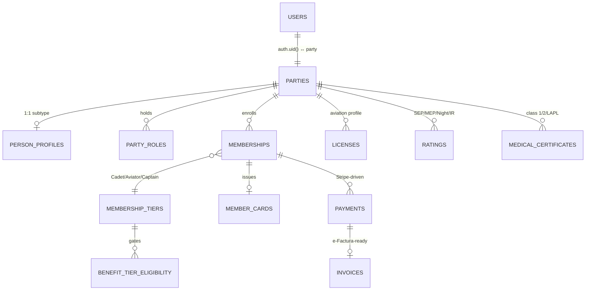
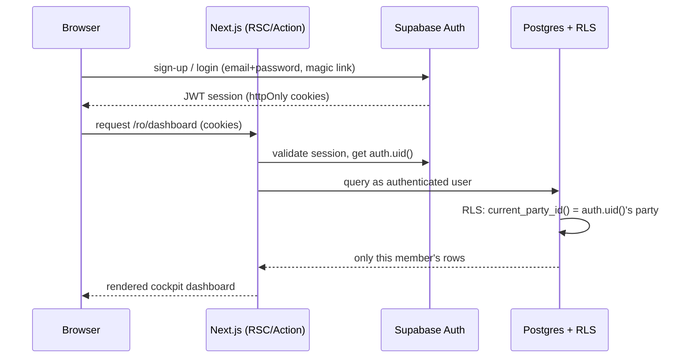
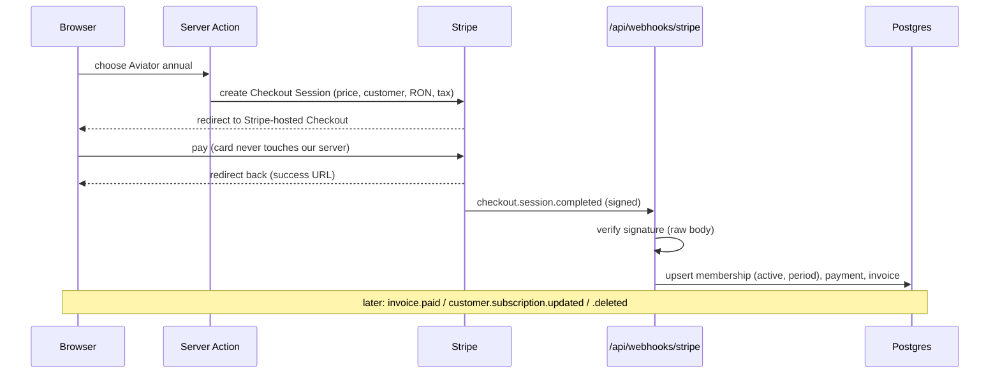
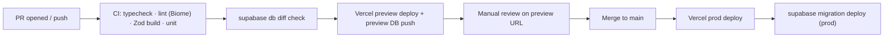
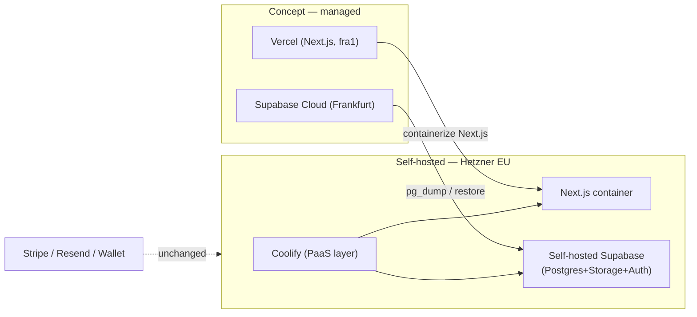

# Aeroskill Club — Technical Infrastructure

> The stack, services, environments, integrations, security/GDPR mechanisms, cost model, and deploy/migration path for a one-developer, bilingual Romanian GA club platform built with Claude Code.
> _Part of the Aeroskill Club planning set — read alongside 00-foundation.md._

---

## 1. Purpose & operating constraints

This document is the **infrastructure contract** for Aeroskill Club. It takes the locked stack from `00-foundation.md` §10 and turns it into concrete architecture: how the three surfaces (public site, member area, admin CRM) live in one Next.js app; how data, auth, payments, email, and the member card flow between managed services; how environments and secrets are organized; and how the whole thing stays GDPR-defensible while modeling **sensitive pilot data** (license numbers, medical class, home aerodrome).

Three constraints shape every decision below:

1. **One developer, with Claude Code.** Favor **managed, low-ops services** over self-hosted infrastructure. Every box on the architecture diagram that we operate ourselves is a box that pages us at 02:00. The concept budget for human ops is roughly zero.
2. **EU data residency, US-incorporated providers.** Supabase, Stripe, Resend, and Vercel all offer EU regions but are US companies (**CLOUD-Act exposure**). This is acceptable for a concept *if disclosed* — see §11. Frankfurt (`eu-central-1`) is the default region everywhere it can be set.
3. **Concept-grade, not production-certified.** The architecture is rigorous and shippable, but real legal/tax/payment contracts are explicitly out of scope (foundation §11, §13.8). Where a real-world legal decision is required (merchant of record, e-Factura submission, DPAs), it is **flagged**, not solved.

> **Voice note** — this doc is written for the captain in the left seat (the solo dev). It briefs the systems; it does not fly them for you.

---

## 2. System architecture overview

One **Next.js 15** application on Vercel's edge serves all three surfaces and both locales. It talks to a single **Supabase** project (Postgres + Storage + Auth, all in Frankfurt) and to four external service planes: **Stripe** (billing), **Resend** (transactional email), and the two **Wallet** providers (Google / Apple) for the digital member card.

```mermaid
flowchart TB
    subgraph Browser["Browser — RO default / EN peer"]
        PUB["(public) light theme"]
        MEM["(member) cockpit dark"]
        ADM["(admin) cockpit dark"]
    end

    subgraph Vercel["Vercel — EU edge (fra1)"]
        EDGE["Edge middleware<br/>next-intl locale routing"]
        RSC["React Server Components<br/>+ Server Actions"]
        RH["Route Handlers<br/>/api/webhooks/*"]
    end

    subgraph Supabase["Supabase — Frankfurt eu-central-1"]
        PG[("Postgres<br/>+ RLS")]
        ST[["Storage buckets<br/>member-docs / card-assets"]]
        AU["Supabase Auth<br/>auth.uid()"]
    end

    Stripe["Stripe<br/>Billing · Checkout · Portal · Tax"]
    Resend["Resend<br/>react-email · EU region"]
    GW["Google Wallet<br/>signed JWT"]
    AW["Apple Wallet<br/>.pkpass / passkit-generator"]

    Browser -->|HTTPS| EDGE
    EDGE --> RSC
    RSC -->|anon / authenticated (RLS)| PG
    RSC --> ST
    Browser -->|JWT session| AU
    AU -. issues JWT .-> PG
    RSC -->|create session| Stripe
    Stripe -->|webhook events| RH
    RH -->|service-role (bypasses RLS)| PG
    RSC -->|send| Resend
    RSC -->|sign pass| GW
    RSC -->|build pass| AW
    Browser -->|add to wallet| GW
    Browser -->|add to wallet| AW
```

**Read it as four flows:**

- **Render flow** — browser → edge middleware (resolves `/ro` or `/en`, see §9) → RSC reads from Postgres with the caller's RLS context → HTML/streamed UI back.
- **Billing flow** — RSC creates a Stripe Checkout/Portal session → browser is redirected to Stripe-hosted pages → Stripe fires webhooks to a Route Handler → handler writes `payments` / `invoices` / `memberships`.
- **Notification flow** — server-side events (welcome, receipt, SEP/IR/ARC expiry) render a react-email template and hand it to Resend's EU sending region.
- **Card flow** — the member card is issued as web/PDF first, then optionally signed into a Google Wallet JWT or built into an Apple `.pkpass`.

---

## 3. The locked stack — choices, rationale, trade-offs

Every row below is fixed in `00-foundation.md` §10. The added columns are *why we picked it* and *the one trade-off we accept*.

| Concern | Choice | Why this, for a solo Claude Code build | Main trade-off accepted |
|---|---|---|---|
| Framework | **Next.js 15** (App Router, TS) | One repo, three surfaces, SSR + RSC; Claude Code knows it deeply; Server Actions remove most bespoke API glue | App Router's RSC/caching model is subtle; cache invalidation bugs are easy to write |
| i18n | **next-intl** | First-class App Router `[locale]` segment, middleware routing, `Intl`-based formatting; no hardcoded copy from day one | Every string lives in two catalogs — discipline tax on every feature |
| UI | **Tailwind + shadcn/ui + Radix** | Copy-in components (we own the code), Radix gives WCAG 2.2 AA primitives; one token file re-skins all three surfaces | shadcn is not a versioned dependency — upgrades are manual diffs |
| DB + Storage + RLS | **Supabase** (Postgres, **Frankfurt eu-central-1**) | Postgres + Storage + Auth + RLS in one EU project; generous free tier; SQL we fully control | Single-vendor concentration; RLS policies are security-critical and easy to get subtly wrong |
| Auth | **Supabase Auth** | `auth.uid()` flows straight into RLS — zero glue between identity and row security; simplest for solo (foundation §13.4) | Coarser RBAC than Better Auth; complex per-module staff permissions need our own role tables. *Documented alternative:* choose **Better Auth** if richer per-module RBAC becomes first-class — it would replace the `auth.uid()`→RLS shortcut with an explicit auth↔Party adapter, so RLS policies would key off our own session/role tables instead of the Supabase JWT |
| Payments | **Stripe** (Billing + Checkout + Portal + Tax) | Hosted Checkout → **SAQ-A** PCI scope; Billing handles tiers/proration; Stripe Tax computes 19% RO VAT / OSS | **The club is the merchant of record; Stripe is the processor/tax calculator** — so VAT/OSS liability rests with the club (flagged, §7) |
| Local pay (future) | **Netopia mobilPay** | RON-native rails Romanians trust; later-phase fallback to Stripe | Second payment integration = double the webhook/reconciliation surface; deferred |
| Email | **Resend + react-email** (EU region) | Email templates as React/TSX components, bilingual via shared catalogs; EU sending region | Deliverability depends on our DNS hygiene (SPF/DKIM/DMARC on the club domain) |
| Member card | Web/PDF + QR → **Google Wallet** → **Apple Wallet** | Phased: ship value (web/PDF) before paying Apple's $99/yr; Google Wallet is free | Apple path needs a paid developer account + cert management (`passkit-generator`) |
| Marketing content | **MDX in-repo** → **Payload CMS 3** later | No CMS to operate for the concept; content is versioned with code | Non-dev editors can't publish until Payload lands; every edit is a commit |
| Hosting | **Vercel** (concept) → **Coolify on Hetzner** path | Zero-config Next.js deploys, preview URLs per PR, EU edge | Vendor lock-in to Vercel primitives (edge middleware, image opt) — mitigated by §13 |
| Tooling | TS, ESLint/Biome, Zod, React Hook Form, TanStack Table | Type-safety end to end; Zod validates at every trust boundary; TanStack Table for CRM grids | More moving parts in the toolchain; pinned versions to keep Claude Code reproducible |

---

## 4. Application structure

A **single Next.js App Router app**. The `[locale]` segment wraps three **route groups** — `(public)`, `(member)`, `(admin)` — that share components and the design-system token file but differ in theme, layout, and access. Route groups (`( )`) do not appear in the URL; the locale prefix always does.

```
app/
├── [locale]/                      # next-intl segment — "ro" | "en", RO default
│   ├── layout.tsx                 # html lang, fonts, NextIntlClientProvider
│   ├── (public)/                  # LIGHT theme — marketing
│   │   ├── layout.tsx             # public chrome (nav, footer, hreflang)
│   │   ├── page.tsx               # home / hero
│   │   ├── membri/                # RO-friendly slugs; tiers & pricing
│   │   ├── beneficii/             # benefits public preview
│   │   ├── parteneri/             # sponsors / partners showcase
│   │   ├── stiri/                 # MDX news/content
│   │   └── legal/                 # privacy, terms, GDPR notice
│   ├── (member)/                  # DARK "cockpit" — authenticated portal
│   │   ├── layout.tsx             # requires member session; cockpit theme
│   │   ├── dashboard/
│   │   ├── profil/                # profile + aviation profile (licenses/ratings/medical)
│   │   ├── abonament/             # subscription → Stripe Portal
│   │   ├── card/                  # digital member card + wallet add
│   │   ├── beneficii/             # eligible benefits + redemption
│   │   ├── evenimente/            # events + RSVP
│   │   ├── documente/             # documents vault
│   │   └── confidentialitate/     # privacy center: consent, export, erasure
│   └── (admin)/                   # DARK "cockpit" — CRM, staff/admin only
│       ├── layout.tsx             # requires staff|admin; admin gating
│       ├── dashboard/             # KPIs + compliance/expiry widget
│       ├── membri/                # Party model (member role)
│       ├── parteneri/             # orgs: schools/ATOs, aerocluburi, aerodromes, sponsors, CAMO/CAO
│       ├── contracte/             # contracts + documents + renewals
│       ├── beneficii/             # catalog mgmt + eligibility + redemptions ledger
│       ├── comunicare/            # activities, campaigns, segments, consent ledger
│       ├── flota/                 # aircraft + airworthiness/ARC + insurance + maintenance + bookings
│       ├── plati/                 # subscriptions & payments overview
│       ├── date-referinta/        # reference data (authorities, aerodromes, vocabularies)
│       └── setari/                # settings, roles & permissions, audit log
├── api/
│   └── webhooks/
│       ├── stripe/route.ts        # POST — Stripe events (raw body, signature verify)
│       └── resend/route.ts        # POST — delivery/bounce events (optional)
├── actions/                       # Server Actions, grouped by domain
│   ├── membership.ts              # join, upgrade, cancel → Stripe sessions
│   ├── aviation-profile.ts        # CRUD licenses/ratings/medicals (Zod-validated)
│   ├── card.ts                    # issue card, mint QR token, build wallet passes
│   ├── benefits.ts                # redeem, eligibility checks
│   └── privacy.ts                 # export, erasure request
├── lib/
│   ├── supabase/                  # server client (cookies) + service-role client
│   ├── stripe.ts                  # Stripe SDK init, price/tier map
│   ├── email/                     # Resend client + react-email templates
│   ├── wallet/                    # google-jwt.ts, apple-pkpass.ts
│   ├── auth.ts                    # session + role helpers, requireRole()
│   └── i18n/                      # request config, formatters
├── components/                    # shared shadcn/ui + brand components
└── messages/
    ├── ro.json                    # primary catalog
    └── en.json                    # peer catalog
```

### Where each kind of server code lives

| Need | Mechanism | Lives in | Why |
|---|---|---|---|
| Form submit / mutation from a member or staff | **Server Action** | `app/actions/*` | Co-located with UI, type-safe, no hand-rolled REST; Zod-validates input at the boundary |
| Inbound third-party callback | **Route Handler** (`/api/webhooks/*`) | `app/api/webhooks/*` | Needs a stable public URL + raw body for signature verification; not a user action |
| Data read for a page | **RSC** (`async` component) | `app/[locale]/**/page.tsx` | Reads run server-side with the caller's RLS context; nothing leaks to the client bundle |
| Cross-cutting routing | **Edge middleware** | `middleware.ts` | next-intl locale negotiation + cheap auth redirect before render |

**Rule:** anything that writes is a Server Action *or* a webhook handler — never a client-side `fetch` to a privileged endpoint. The Supabase **service-role key** is used only inside webhook handlers and explicitly trusted server code, never in a Server Action that runs with a user's identity.

---

## 5. Data layer

A single **Supabase Postgres** database in **Frankfurt (eu-central-1)** implements the hybrid Party model and all domains from foundation §7. Schema specifics belong to `06-database-schema.md`; this section covers the *infrastructure* of the data layer.

### 5.1 Migrations & schema management

- **Supabase CLI migrations**, checked into the repo under `supabase/migrations/` as timestamped SQL files. Migrations are the **single source of truth** for schema — never click-edit production tables in the dashboard.
- Local: `supabase start` runs the full stack (Postgres + Auth + Storage) in Docker for offline development.
- Promotion: `supabase db push` against preview, then prod, gated through CI (§8). A migration is just SQL Claude Code can author and review.
- **Seed data** (`supabase/seed.sql`) loads the real RO/EASA reference entities from foundation §8 — authorities (AACR, EASA, ROMATSA, **SAUM** as ULM issuer inside Aeroclubul României), aerodromes (Clinceni **LRCN**, Strejnic **LRPV**, Tuzla **LRTZ**), schools (Regional Air Services), associations (AOPA Romania, BGAA) — so every environment renders a credible CRM.

### 5.2 Storage buckets

| Bucket | Visibility | Holds | Access pattern |
|---|---|---|---|
| `member-docs` | **Private** | Uploaded license PDFs, medical certificate scans, payment receipts | RLS-gated; served via **short-lived signed URLs** only; never public |
| `card-assets` | **Private** | Generated member-card PDFs, QR pngs, wallet pass artifacts | Signed URLs; QR encodes an opaque `card.qr_token`, not personal data |
| `partner-logos` | **Public** | Sponsor / partner logos for the public showcase | Cacheable, CDN-fronted; non-sensitive |
| `content-media` | **Public** | MDX article images, event photos | Cacheable; real GA photography per brand §12 |

Sensitive buckets are private by default. A member document is reached only through a signed URL minted server-side after an RLS check — there is no path to a raw object key from the browser.

### 5.3 RLS strategy

Row Level Security is **on for every table** and is the security boundary, not a convenience. The app cannot "forget" to filter because Postgres enforces it.

| Audience | Policy shape |
|---|---|
| **Member** | `SELECT/UPDATE` only rows where the row's `party_id` resolves to the caller via `auth.uid()` — own profile, own memberships, own licenses/ratings/medicals, own redemptions, own documents |
| **Staff** | Read/write scoped per module via a `user_roles` / permissions table joined in policy `USING` clauses; e.g. fleet-only staff cannot read `consents` |
| **Admin** | Full access via an `is_admin(auth.uid())` security-definer helper |
| **Anon / visitor** | Read only explicitly public rows (published tiers, public benefits, sponsors, published content) |
| **Webhooks** | Use the **service-role key** which bypasses RLS — confined to `/api/webhooks/*` writing `payments`, `invoices`, `memberships` |

Pattern: a `SECURITY DEFINER` SQL helper (`current_party_id()`) maps `auth.uid()` → the linked `parties.id`, used across all member policies so the mapping is defined once. Audit columns (`created_by` / `updated_by`) capture `auth.uid()` via Server Action context.



*(Illustrative slice for the RLS narrative; the authoritative ERD is in `06-database-schema.md`.)*

---

## 6. Auth architecture

**Supabase Auth** owns identity; **Postgres RLS** owns authorization. They meet at `auth.uid()`.



- **Methods:** email + password with verification, password reset, and passwordless magic link (PRD MEM-001 / flows in `07`; the magic link is an addition beyond the foundation's four sign-up/login/email-verify/password-reset methods). Optional OAuth (Google) can be added later without schema change.
- **Identity ↔ Party link:** on first sign-up a Postgres trigger (or a Server Action in the join flow) creates a `parties` row (`party_kind = person`) and a `party_roles` row (`role = member`), linking `auth.users.id` → `parties.id`. This is the join that `current_party_id()` resolves.
- **Roles & claims:** the four foundation roles — `visitor` / `member` / `staff` / `admin` — live in app tables (`user_roles`, `role_permissions`), not only in the JWT, because staff permissions are **per-module configurable**. A lightweight `role` custom claim is added to the JWT for fast edge gating; the authoritative check is the DB join inside RLS.
- **Member tier scoping:** a member's *effective permissions* depend on their **active tier** (cadet/aviator/captain). Tier is read from the current `memberships` row, not the JWT, so a downgrade/cancel takes effect immediately without re-issuing tokens.
- **Admin gating, defense in depth:**
  1. Edge middleware redirects unauthenticated users away from `(member)`/`(admin)` groups.
  2. The `(admin)` layout calls `requireRole(['staff','admin'])` server-side before rendering.
  3. Every admin query is still RLS-gated in Postgres — even a bug in the layout cannot leak data.

---

## 7. Payments architecture

**Stripe Billing** with **hosted Checkout** and the **Customer Portal**. The app never sees a card number, which keeps PCI scope at **SAQ-A** (foundation §11).

### 7.1 Products & prices per tier

The three tiers map to Stripe Products; each price option is a Stripe Price. `MembershipTier.stripe_price_id` (foundation §7; implemented as per-interval columns `stripe_price_year_id` / `stripe_price_month_id` / `stripe_price_onetime_id` in `06`) links the config-driven tier to its Stripe Price(s).

| Tier (RO / EN) | Stripe Product | Price options | Stripe Price type |
|---|---|---|---|
| Cadet / Cadet | `prod_cadet` | **Free** (0 RON) | No Stripe price — local membership only |
| Aviator / Aviator *(Most popular)* | `prod_aviator` | 490 RON/yr · 49 RON/mo | Recurring (annual / monthly) |
| Comandant / Captain | `prod_captain` | 1.490 RON/yr · 149 RON/mo | Recurring (annual / monthly) |
| Founding / Life add-on | `prod_founding` | 4.990 RON one-time | One-time (Captain) |

All prices are created in **RON** (foundation: RON-primary). EUR figures (~€99 / €299 / €999) are **display conversions only** in the UI via `Intl`, not separate Stripe prices. The optional **Family add-on** (Aviator+) is modeled as a capped quantity/add-on item, not a separate tier ladder.

### 7.2 Flow & webhooks



- **Subscription self-service** (upgrade, downgrade, change card, cancel) is delegated to the **Stripe Customer Portal** — no bespoke billing UI to build or secure.
- **Webhook → DB mapping:** the handler verifies the signature against the raw body, then writes:
  - `checkout.session.completed` / `invoice.paid` → upsert `memberships` (status, current period), insert `payments` (Stripe IDs + brand/last4 only — never card data), insert `invoices`.
  - `customer.subscription.updated` / `.deleted` → reflect tier change / cancellation onto `memberships`.
- **Idempotency:** each event's Stripe `id` is stored; replays are no-ops. Webhooks are the **source of truth** for billing state — the success-redirect is treated as a hint, never as confirmation.

### 7.3 Tax, VAT & invoicing

- **Stripe Tax** computes Romanian **19% VAT** and supports **OSS** reporting, but Stripe is only the **processor/tax calculator** — **the club is the merchant of record**, so **VAT liability and OSS filing remain the club's** (a real legal/accounting decision, **flagged**, foundation §11).
- The `invoices` table is **e-Factura-ready** (issuer/buyer fiscal IDs — CNP/CUI, line items, VAT rate, submission status) even though v1 issues simple *cotizație* receipts. Membership-fee receipts are kept **distinct** from commercial (sponsorship/paid-service) invoices, because *cotizații* are non-taxable while economic activity may trigger VAT/e-Factura (foundation §8 legal form).
- **PCI scope:** hosted Checkout + Portal → **SAQ-A**. We store **only** Stripe IDs + card brand + last4. There is no card data in Postgres, ever.

---

## 8. Email architecture

**Resend** with **react-email** templates rendered server-side, **EU sending region**. All copy comes from the shared next-intl catalogs — emails are bilingual by the member's `locale`, designed for the **longer Romanian string**.

| Template | Trigger | Locale | Notes |
|---|---|---|---|
| `welcome` | Sign-up verified | member's | "Cleared for takeoff" microcopy (brand §12, used sparingly) |
| `email-verify` | Sign-up | member's | Supabase Auth can also send this; we override for branding |
| `password-reset` | Reset request | member's | — |
| `payment-receipt` | `invoice.paid` webhook | member's | Links to invoice; distinguishes *cotizație* vs commercial |
| `membership-renewal` | N days before renewal | member's | Stripe upcoming-invoice driven |
| `expiry-reminder` | Scheduled job | member's | **SEP 24-mo / IR 12-mo / medical / ARC 1-yr** — the flagship "current to fly" reminder |
| `card-issued` | Card issued/renewed | member's | Web/PDF link + wallet add buttons |
| `event-rsvp` | RSVP confirmed | member's | Event detail, add-to-calendar |
| `partner-contract` | Admin-triggered | RO (staff) | Contract/renewal correspondence from CRM |

The **expiry-reminder** is the email that makes the product feel like a co-pilot. A scheduled function (Vercel Cron, §10) scans licenses/ratings/medicals/airworthiness for upcoming expiries and queues reminders — the operational complement to the CRM's compliance/expiry dashboard widget. DNS hygiene (SPF/DKIM/DMARC on the club domain) is a setup checklist item, since deliverability is the one part of email we own.

---

## 9. i18n architecture

**next-intl**, **Romanian default, English peer** (foundation §9). The `[locale]` segment + edge middleware deliver `/ro/...` and `/en/...` with reciprocal `hreflang`.

- **Routing:** `middleware.ts` runs next-intl's middleware — negotiates locale from the path, falls back to RO, sets `<html lang>`, and emits the locale prefix. Localized **slugs** are used where they aid SEO/credibility (`/ro/membri`, `/en/membership`).
- **hreflang:** every page emits reciprocal `ro-RO`, `en`, and `x-default` (→ RO) link tags, so Google indexes both and search engines pick the right locale.
- **Catalogs:** `messages/ro.json` and `messages/en.json` — **no hardcoded UI copy anywhere**, across all three surfaces, from day one. RO copy is **native-written, never machine-translated** (brand §12).
- **Formatting:** all dates/money/numbers via `Intl` with explicit locales — RO `1.234,56 lei`, `28.06.2026`, 24h; EN secondary `en-GB`. Money is `amount_minor` + `currency` (RON default), formatted at the edge of display, never stored pre-formatted.
- **Layout for Romanian:** Romanian strings run ~15–30% longer than English; components are built **RO-first** so nothing clips. Font check: Space Grotesk must render comma-below **ș/ț** + ă/â/î, else fall back to Inter for RO display strings (brand §12).

---

## 10. Environments, CI/CD & secrets

### 10.1 Three environments

| Environment | Frontend | Database | Stripe | Purpose |
|---|---|---|---|---|
| **Local** | `next dev` | `supabase start` (Docker) | Stripe **test** + `stripe listen` | Build & debug offline; webhooks forwarded to localhost |
| **Preview** | Vercel preview per PR | Supabase **preview/staging** project | Stripe **test** | Review every change on a real URL before merge |
| **Production** | Vercel prod (`fra1`) | Supabase **prod** (Frankfurt) | Stripe **live** | The concept's public deployment |

### 10.2 CI/CD pipeline



- **Migrations gate merges:** CI runs `supabase db diff` so schema drift is caught before deploy; prod migrations apply only after merge to `main`.
- **Scheduled work:** **Vercel Cron** triggers the expiry-reminder scan (§8) and any nightly housekeeping; jobs are ordinary Route Handlers protected by a cron secret.
- **Solo workflow:** the pipeline assumes one reviewer (you) using preview URLs as the QA surface; Claude Code authors migrations, Server Actions, and tests against the same scripts.

### 10.3 Secrets management

- Secrets live in **Vercel Environment Variables** (scoped per environment) and `.env.local` for local dev; **never committed**.
- **Public** (`NEXT_PUBLIC_*`): Supabase URL + anon key, Stripe publishable key.
- **Server-only:** Supabase **service-role key**, Stripe secret key + webhook signing secret, Resend API key, Google Wallet service-account key, Apple pass cert + private key.
- The **service-role key** is the crown jewel — it bypasses RLS. It is referenced only in webhook handlers / trusted server modules, never shipped to the client bundle, and rotated on any suspicion.

---

## 11. Security, GDPR & data residency

The platform models **sensitive pilot data** — license numbers, medical class, home aerodrome — so privacy is load-bearing, not decorative.

| Mechanism | Implementation |
|---|---|
| **EU data residency** | Supabase (Frankfurt `eu-central-1`), Vercel edge (`fra1`), Resend EU sending region, Stripe EU processing. Default-EU everywhere a region is selectable |
| **Row Level Security** | On every table; members see only their own rows; staff per-module; admin gated; enforced in Postgres, not just the app (§5.3) |
| **PCI** | Hosted Stripe Checkout → **SAQ-A**; never store card data, only Stripe IDs + brand/last4 (§7.3) |
| **Lawful basis** | **Contract performance** for core membership; **separate, granular, withdrawable consent** for marketing / sponsor data sharing — recorded in the `consents` ledger (purpose, lawful_basis, source, channel, timestamp, version) |
| **Privacy center** | Member-facing **export** (machine-readable bundle of their data) + **erasure request** flow at `/[locale]/confidentialitate` (foundation §6, §11) |
| **No biometrics** | The member card carries a QR of an opaque token, **never** biometric data (foundation §11) |
| **Encryption** | TLS in transit everywhere; Supabase at-rest encryption; private buckets + short-lived signed URLs for documents |
| **Backups** | Supabase automated daily backups + point-in-time recovery (paid tiers); migrations in git allow full schema rebuild |
| **DPAs** | Data Processing Agreements signed with each sub-processor (Supabase, Vercel, Stripe, Resend) — **flagged** as a real legal step, listed in the privacy notice |
| **CLOUD-Act disclosure** | All four providers are US-incorporated despite EU regions; the **privacy notice explicitly discloses** potential US-government access (foundation §10 residency note). Mitigation path = Hetzner migration, §13 |
| **GDPR authority** | Romanian **Law 190/2018**, supervisory authority **ANSPDCP**; this is a concept and not a registered controller — flagged accordingly |

> **Concept caveat (foundation §11):** all of the above is **concept-grade**. Real legal/tax/payment review — DPAs, ANSPDCP posture, merchant-of-record/VAT, e-Factura submission — is explicitly out of scope and flagged where it appears.

---

## 12. Observability & ops

Lean, managed, solo-friendly — enough to know when something breaks and why, without an ops rotation.

| Concern | Tool | Notes |
|---|---|---|
| **Error tracking** | **Sentry** (Next.js SDK) | Client + server + edge; source maps; release tagging; free dev tier |
| **Logging** | Vercel function logs + Supabase logs | Structured logs from Server Actions / webhooks; no PII in log lines |
| **Uptime** | **Better Stack** (or UptimeRobot) | Pings public site + a `/api/health` route; alerts to email |
| **DB health** | Supabase dashboard | Slow-query insights, connection pool, storage usage |
| **Webhook health** | Stripe dashboard + stored event log | Failed/retried events visible; our event table catches gaps |
| **Product analytics** | **Plausible** (EU, cookieless) | Privacy-friendly, no consent banner needed; GDPR-aligned |

Alert philosophy: page on **payment webhook failures** and **site down**; everything else is reviewed in dashboards. PII is kept out of error payloads (Sentry scrubbing) — a Sentry breadcrumb must never carry a license or medical number.

---

## 13. Migration path — Vercel → Hetzner / Coolify

The concept runs on **Vercel + Supabase cloud** for zero ops. The **documented escape hatch** is full EU self-hosting on **Hetzner via Coolify** — relevant if data-residency or CLOUD-Act concerns ever harden into a real requirement, or to cut cost at scale.



**What changes vs. stays:**

| Layer | On Vercel/Supabase cloud | On Hetzner/Coolify | Migration effort |
|---|---|---|---|
| Next.js app | Vercel build/edge | Docker container behind Coolify | Containerize; replace Vercel-specific bits (image opt, edge middleware → Node middleware, Cron → Coolify scheduled tasks) |
| Database | Supabase cloud (Frankfurt) | Self-hosted Supabase / plain Postgres | `pg_dump` → restore; **migrations in git replay cleanly** |
| Storage | Supabase Storage | Self-hosted Supabase Storage / S3-compatible (e.g. Hetzner Object Storage) | Re-point bucket config; copy objects |
| Auth | Supabase Auth | Self-hosted Supabase Auth (GoTrue) | Same JWT model; `auth.uid()` + RLS unchanged |
| Stripe / Resend / Wallet | Managed | Managed (unchanged) | None — these are external regardless |
| Data residency | EU regions, US provider | **Fully EU-owned (Hetzner)** | Removes CLOUD-Act exposure (§11) |

Because we already use **Supabase primitives** (Postgres, RLS, GoTrue-compatible auth, Storage) and keep **migrations in git**, the data/auth layers move almost unchanged. The real work is containerizing the Next.js app and replacing Vercel-only conveniences. This is **documented, not executed** for the concept.

---

## 14. Concept cost model

Monthly USD at **concept / portfolio scale** (low traffic, a few hundred demo members). Figures are point-in-time estimates — verify before any real commitment.

| Service | Concept tier | Est. $/mo | Notes |
|---|---|---|---|
| **Vercel** | Hobby (or Pro if commercial) | **$0** (Pro $20) | Hobby fine for a portfolio concept; Pro if it's commercial |
| **Supabase** | Free → Pro | **$0** (Pro $25) | Free covers concept; Pro ($25) adds daily backups + PITR — worth it once data matters |
| **Stripe** | Pay-as-you-go | **~$0** | No monthly fee; ~1.4%+€0.25 EU cards per transaction; Stripe Tax adds a per-transaction fee |
| **Resend** | Free | **$0** | 3,000 emails/mo free — ample for transactional volume at concept scale |
| **Google Wallet** | — | **$0** | Free wallet API |
| **Apple Wallet** | Apple Developer Program | **~$8.25** | $99/yr amortized; only when the Apple `.pkpass` phase ships |
| **Domain** | `.ro` / `.club` | **~$1–2** | Annual registration amortized |
| **Sentry** | Developer | **$0** | Free tier covers concept error volume |
| **Plausible** | Starter (or self-host) | **$0–9** | Self-host on the Hetzner box for $0, or hosted ~$9 |
| **Better Stack / uptime** | Free | **$0** | Free uptime tier sufficient |
| **Estimated total** | **concept baseline** | **~$0–10/mo** | Stays near zero until Apple Wallet + paid backups + Pro tiers are switched on (then ~$60–70/mo) |

The deliberate design goal: a credible three-surface platform that costs **roughly the price of a coffee per month** to run at concept scale, because every service has a real free tier and we self-host nothing.

---

## 15. Infrastructure summary

| Pillar | Decision |
|---|---|
| **Topology** | One Next.js 15 app (3 route groups × 2 locales) on Vercel edge ↔ one Supabase project (PG+Storage+Auth, Frankfurt) ↔ Stripe + Resend + Wallet |
| **Code boundaries** | Server Actions for mutations · Route Handlers for webhooks · RSC for reads · edge middleware for i18n + gate |
| **Security model** | Supabase Auth `auth.uid()` → Postgres RLS on every table; admin gated in 3 layers; SAQ-A PCI; consent ledger |
| **Data residency** | EU-default everywhere; CLOUD-Act disclosed; Hetzner/Coolify migration documented |
| **Cost** | ~$0–10/mo at concept scale; ~$60–70/mo with Apple Wallet + paid tiers |
| **Ops load** | Near-zero: managed services, git-tracked migrations, dashboards over pagers |

Everything here inherits the locked stack, entities, prices, and conventions of `00-foundation.md`. Where a real legal/tax/payment decision is required — merchant of record, VAT/OSS, e-Factura, DPAs, ANSPDCP registration — it is **flagged, not solved**, consistent with the concept's scope.
