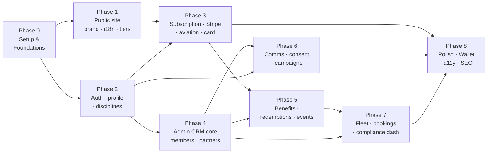
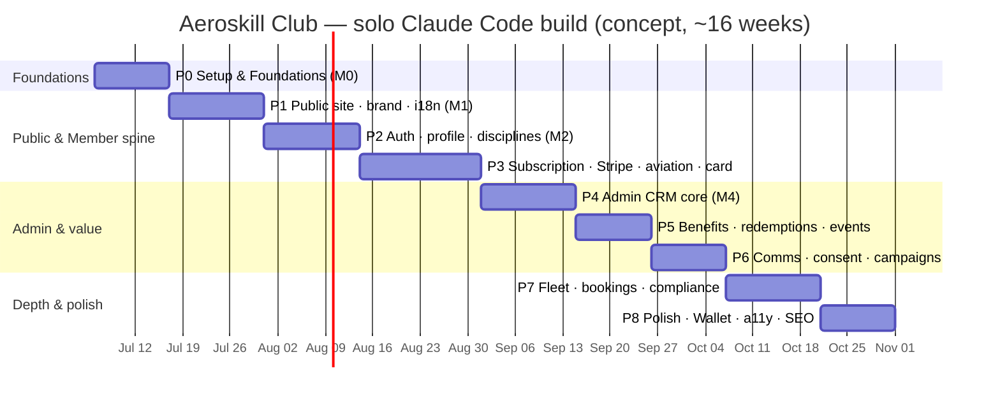

# Aeroskill Club — Roadmap

> The sequenced, solo-developer build roadmap: phases over calendar time, with goals, deliverables, entities, dependencies, effort in both solo-dev weeks and Claude Code sessions, per-phase Claude Code working tips, and a definition of "demo-ready" for the portfolio piece.

_Part of the Aeroskill Club planning set — read alongside 00-foundation.md._

---

## 1. Purpose & how this fits the planning set

This document answers one question: **in what order, over what calendar, does one developer with Claude Code build Aeroskill Club from empty repo to demo-ready portfolio piece?**

It is the **time-and-effort view**. It does not re-derive *what* to build (that is the PRD `04-prd.md`), *how the data is shaped* (`06-database-schema.md`), *what the stack is* (`09-technical-infrastructure.md`), or *the construction mechanics and Definition of Done* (`03-implementation-plan.md`). It sequences those into phases, sizes each phase, names its dependencies and risks, and gives phase-specific tips for driving Claude Code.

| This document owns | This document defers to |
|---|---|
| Phases over calendar time; effort in weeks + Claude Code sessions | `03` for build philosophy, vertical-slice mechanics, Definition of Done |
| Per-phase goals, deliverables (by PRD ID), entities, dependencies, risks | `04` for the testable requirement text behind each ID |
| Phase-specific Claude Code working tips | `06` for column-level schema; `09` for service/environment internals |
| A Gantt/timeline of the whole build; demo-ready checklist; deferral note | `05` IA and `07` flows for navigation and step-by-step UX |

### 1.1 Alignment with the implementation plan (`03`)

The implementation plan slices the work into **increments 0–18** grouped under **milestones M0–M6** and owns the *construction contract* (dependency arrows, the Definition of Done, the seed-first / RLS-at-birth rules). This roadmap groups those same increments into **nine build Phases (0–8)** laid over a calendar, and owns the *sizing and ordering*. The two are the same graph seen from two angles — **same increment IDs, same dependency arrows, no contradiction**. Every phase below names the milestone(s) and increment(s) it realizes so the mapping is explicit.

| Roadmap phase | Implementation-plan milestone(s) | Increment(s) |
|---|---|---|
| **Phase 0** — Setup & Foundations | M0 · Foundation | inc-0, inc-1 |
| **Phase 1** — Public site + brand + i18n + tiers/sponsors | M1 · Public site | inc-2 (+ inc-9 sponsors read) |
| **Phase 2** — Auth + personal/organization profile + disciplines | M2 (part) · Member spine | inc-3 |
| **Phase 3** — Subscription + Stripe + aviation profile + digital member card | M2 (part) + M3 (part) | inc-4, inc-5, inc-6 |
| **Phase 4** — Admin CRM core (Party: members + partners + contracts) | M4 · CRM core | inc-8, inc-9 |
| **Phase 5** — Benefits + redemptions + events | M5 (part) | inc-10, inc-11 |
| **Phase 6** — Communications + consent + campaigns | M3 (part) + M5 (part) | inc-7, inc-13 |
| **Phase 7** — Fleet + bookings + compliance/expiry dashboard | M5 (part) + M6 (part) | inc-12, inc-14, inc-16 (overview) |
| **Phase 8** — Polish (Wallet, reminders depth, a11y, SEO, content, docs) | M6 (part) | inc-15, inc-17, inc-18, + cross-cutting polish |

Two placement notes keep this roadmap faithful to the `03` dependency graph rather than contradicting it:

- **Aviation profile (inc-5) lives in Phase 3, not Phase 2.** `03` §7.1 makes inc-5 ← inc-4 (membership) a **hard prerequisite that cannot be reordered** — the member context owns the aviation records and the dashboard hosts "current to fly". So Phase 2 is **auth + personal/organization profile + disciplines only** (no membership/tier), and inc-5 joins inc-4/inc-6 in Phase 3 once a membership exists to anchor it. Same arrow as `03`, just grouped onto the calendar.
- **Privacy center + consent ledger (inc-7) sits in Phase 6.** It is a Must, but it is most efficient to build it *alongside* the communications engine that consumes it (inc-13), so this roadmap places both in **Phase 6**. Its hard prerequisite (auth, inc-3) is satisfied far earlier in Phase 2, so nothing is built before its dependency exists. This is a calendar choice, not a scope or dependency change.

---

## 2. Roadmap philosophy

Five ideas shape the shape of this plan. They are the *time-axis* corollaries of the implementation plan's five operating principles (`03` §2).

### 2.1 One developer, Claude-Code-assisted

The whole plan assumes a **single builder** pairing with Claude Code, on the locked low-ops stack (`09` §1, §14) where nothing is self-operated — managed Supabase, Stripe, Resend, Vercel, ~$0–10/mo (`09` §14). There is no team to parallelize across, so the calendar is a **single thread**: phases are sequential, sized to what one person can specify, generate, review, and verify without losing the thread. The estimates assume a realistic solo cadence — not a 40-hour sprint week, but focused part-time-to-full-time evenings-and-weekends effort with Claude Code doing the heavy generation.

### 2.2 Vertical slices, concept→demo-ready

Each phase ships **usable vertical threads** (`03` §2.2), never horizontal layers. The north star is not "feature-complete production system" — it is **demo-ready** (§13): a credible, bilingual, visually rigorous concept a Romanian pilot recognizes and a hiring manager is impressed by, with every **Must** demonstrable on a seeded preview URL in both RO and EN. We optimize for the *earliest credible artifact* (a real landing page by end of Phase 1) and steadily deepen.

### 2.3 Dependency-ordered, public→member→admin

The phase order follows the construction dependency graph (`03` §7), which happens to favor **public → member → admin**: the public tier table only reads seeded data (low risk, high signal, forces the i18n + token + money-formatting spine into existence early); the member spine then builds the hardest integration (Stripe webhooks) and the sensitive-data RLS pattern; the CRM is built last, against a database already populated by seed *and* real member rows.

### 2.4 Effort sized two ways

Every phase carries **two estimates**: solo-dev **weeks** (calendar reality for one person) and **Claude Code sessions** (a "session" ≈ one focused working block that produces one or a few vertical slices — typically one PR / one preview deploy, per `03` §3.2). The session count is the unit that actually predicts throughput with Claude Code; the weeks figure translates it to a calendar a stakeholder reads. The two are deliberately loose — a concept estimate, not a contract.

### 2.5 Strict MoSCoW, deferral is a feature

**Must** is the spine and lands first and solid; **Should** deepens it; the single **Could** (Apple Wallet) is modelled-only. The fastest way to sink a solo concept is gold-plating a Should before the Musts are demonstrable (`03` §2.1 P3). What is *deliberately deferred* (§14 — Netopia, Payload, Apple push updates, real legal/tax, real flight hire) is treated as a roadmap asset: a clear, flagged migration path that signals judgment rather than omission.

---

## 3. The phased plan at a glance

| Phase | Theme | Effort (weeks) | Claude Code sessions | MoSCoW center of gravity |
|---|---|---|---|---|
| **0** | Setup & Foundations | 1.5 | 6–8 | Must |
| **1** | Public site + brand + i18n + tiers/sponsors | 2 | 8–10 | Must |
| **2** | Auth + personal/organization profile + disciplines | 2 | 8–10 | Must |
| **3** | Subscription + Stripe + aviation profile + member card | 2.5 | 11–13 | Must |
| **4** | Admin CRM core (members + partners + contracts) | 2 | 8–10 | Must |
| **5** | Benefits + redemptions + events | 1.5 | 6–8 | Should |
| **6** | Communications + consent + campaigns | 1.5 | 6–8 | Must (consent) / Should (comms) |
| **7** | Fleet + bookings + compliance dashboard | 2 | 8–10 | Should |
| **8** | Polish (Wallet, reminders, a11y, SEO, content) | 1.5 | 6–8 | Should / Could |
| | **Total** | **~16.5 weeks** | **~68–86 sessions** | |

The total is a **concept budget**: roughly **four focused months** of solo part-to-full-time work, or compressed to **~10–12 weeks** at full-time pace. Phases 0–3 (~8 weeks) already produce the join→pay→aviation→card demo — the single most impressive thread — so a foreshortened portfolio cut can stop credibly after Phase 3 and still tell a complete story.

---

## 4. Phase 0 — Setup & Foundations

> **Milestone M0 · increments 0–1.** The runway: repo, i18n spine, schema, RLS, CI, design tokens, seed. Nothing is demonstrable to a visitor yet, but everything downstream stands on it.

### Goals
- One Next.js 15 repo that boots in **RO by default** and **EN as peer**, with three themed-but-empty route-group shells (`(public)` light, `(member)` / `(admin)` dark cockpit).
- The **full schema** applied as Supabase CLI migrations, **RLS on every table from birth** (`03` §2.1 P5), seeded with real Romanian entities.
- The design-token file (brand navy `#102844`, sky/brass accents, Space Grotesk / Inter / IBM Plex Mono) and the standing project skill / `CLAUDE.md` that reinjects the non-negotiables.

### Deliverables (PRD IDs)
- Project skeleton & i18n spine — `XC-030`, `XC-031`, `XC-033`, `NFR-014`.
- Schema + RLS + seed — `XC-038`, `NFR-010`, the data side of `ADM-027`.
- Tiers seeded with locked prices — feeds `PUB-004`, `XC-039`.
- CI standing gates (typecheck, lint with hardcoded-string rule, `supabase db diff`, axe) — `NFR-006`, `NFR-012`, `XC-031`.

### Key entities / tables
All of **Domain A (Party core)** + reference + tiers: `parties`, `person_profiles`, `organization_profiles`, `party_roles`, `party_relationships`, `contact_channels`, `addresses`, `users`, `authorities`, `aerodromes`, `reference_data`, `membership_tiers`.

### Seed (the standing fixture, `03` §8.4)
- **Authorities:** AACR, EASA, ROMATSA, **SAUM** (flagged as ULM issuer *inside Aeroclubul României*, never AACR).
- **Aerodromes:** Clinceni **LRCN**, Strejnic **LRPV**, Tuzla **LRTZ**, Băneasa, plus territorial sites.
- **Tiers:** Cadet / Aviator / Comandant with locked prices — `price_year_minor` 0 / 49000 / 149000 bani; Founding/Life 499000; Aviator flagged "Cel mai popular".
- **Partner orgs & demo members** scaffolded for later phases (Regional Air Services `RO/ATO-06`, AOPA Romania, BGAA; a Cadet enthusiast, an Aviator PPL with SEP+Night, a Captain owner/instructor with a YR- aircraft).

### Dependencies
None upstream. **Everything else depends on this.**

### Effort
**~1.5 weeks · 6–8 Claude Code sessions.** Roughly: 1 session repo + i18n + middleware; 1 token file + theme wiring + fonts; 2–3 schema migrations (Domain A, reference, billing-mirror stubs); 1 RLS pass + `current_party_id()` helper; 1 seed authoring; 1 CI wiring. The schema is the long pole.

### Claude Code working tips
- **Author the standing skill first.** Encode the non-negotiables (RO-default + bilingual catalogs from day one, money as `amount_minor + currency`, soft-delete + audit columns, RLS-on-by-default, the SAUM-issues-ULM rule, "design for the longer Romanian string") into `CLAUDE.md` so every later session inherits them (`03` §3.6). This is the single highest-leverage action of the whole build.
- **Migration → RLS → seed in one go, never split.** Have Claude Code write the table, its RLS policies, and the seed rows in the same slice. A table without a policy is not done (`03` §2.1 P5).
- **Verify diacritics on day one.** Render `ș/ț/ă/â/î` in Space Grotesk; wire the Inter fallback for RO display strings *before* any copy exists (`XC-032`), so you never retrofit it.
- **Point Claude Code at `06-database-schema.md` by section,** not "build the schema" — generate one domain's migration per slice and review the SQL.
- **Confirm the brand navy** (`#102844` vs ~`#1B2A4A`, foundation §13.7) against the source vector before locking the token file — it drives every later contrast check (`XC-044`).

### Risks
| Risk | Mitigation |
|---|---|
| RLS written "later" and forgotten | Make it part of the migration slice; CI denies a table with no policy by convention |
| Schema churn cascades into every later phase | Get Domain A + reference + tiers right; treat later domains as additive migrations |
| Token/theme decisions made ad hoc per surface | One token file, semantic tokens (`--bg`, `--surface`, `--accent`…) so themes + a future logo swap are one file (foundation §12) |

---

## 5. Phase 1 — Public site + brand + i18n + tiers/sponsors

> **Milestone M1 · increment 2** (plus the sponsors *read* that anticipates inc-9). The earliest demonstrable artifact: a credible, bilingual marketing site.

### Goals
- A marketing surface a visitor can browse and trust, in **RO and EN**, light theme, server-rendered for SEO.
- The **tier comparison table** rendering RON-primary prices with the Aviator card flagged "Cel mai popular", proving the money-formatting and brand systems on a real URL.
- Brand made tangible: instrument/horizon motifs, the aircraft-silhouette stamp, the "experienced captain briefing a friend" voice in native Romanian copy.

### Deliverables (PRD IDs)
- Home hero + content sections — `PUB-001`, `PUB-002`.
- Mission & about (MDX, partner-layer positioning) — `PUB-003`.
- **Tier comparison + add-on presentation** — `PUB-004`, `PUB-005`.
- Public benefits preview — `PUB-006` *(Should; can slip to Phase 5 if time-boxed)*.
- **Sponsors / partners showcase** — `PUB-007` (reads seeded partner rows flagged public; full CRM management lands Phase 4).
- Contact + legal (privacy/terms/GDPR notice disclosing US processors) — `PUB-010`, `PUB-011`.
- Locale routing + hreflang + SEO essentials — `PUB-012`, `PUB-013`, `XC-030`, `XC-033`, `XC-035`.

### Key entities / tables
Reads only: `membership_tiers`, partner `parties` (+ `party_roles`) flagged public. No new tables (MDX content is in-repo).

### Dependencies
**Phase 0** (i18n spine, tokens, seeded tiers + partners). The join *funnel* (`PUB-008`) is public-surface but deferred to **Phase 3** because it needs auth + Stripe.

### Effort
**~2 weeks · 8–10 sessions.** Roughly: 1 layout + nav + footer + hreflang; 1 hero + home sections; 2 tier table (toggle, RON-primary `Intl ro-RO`, EUR secondary, add-ons); 1 mission MDX; 1 sponsors showcase; 1 contact (writes a CRM Activity) + legal; 1 SEO (sitemap both locales, OG, `Organization` JSON-LD); 1–2 RO copy + a11y + Core Web Vitals pass.

### Claude Code working tips
- **Write the RO copy first, natively.** Have Claude Code draft Romanian display copy as the source, then EN as the peer — never machine-translate RO (`XC-032`). Review tier names stay exact: **Cadet / Aviator / Comandant**.
- **Build every component RO-first** and eyeball it with the ~15–30% longer Romanian string before EN (`XC-035`) — the tier table and nav are where clipping bites.
- **Make money a single formatter helper** (`amount_minor` + currency → `Intl ro-RO` → `490 lei`, `1.490 lei`, `4.990 lei`). No locale-naive `toLocaleString()` (`XC-033`). Claude Code should reuse this everywhere prices appear.
- **Use the preview URL as the QA surface** (`03` §3.2) — verify the home, tiers, and join CTA in both `/ro` and `/en` on Vercel before merge.
- **Seed the sponsors showcase from real partners** (Regional Air Services, AOPA Romania, BGAA) so the page looks credible immediately, grouped `Școli de zbor / Asociații / Aerodromuri / Sponsori`.

### Risks
| Risk | Mitigation |
|---|---|
| RO copy reads machine-translated, killing credibility | Author RO natively in the captain-briefing voice; correct aviation vocabulary (PPL(A), LAPL, aerodrom) signals trust |
| Brass accent overused, failing WCAG contrast | Brass restricted to large/decorative; 4.5:1 body / 3:1 UI enforced (`XC-044`); axe in CI |
| Over-investing in marketing polish before the value spine exists | Time-box to "credible, not perfect"; defer benefits preview to Phase 5 if needed |

---

## 6. Phase 2 — Auth + personal/organization profile + disciplines

> **Milestone M2 (part) · increment 3.** The identity spine. (Join/pay and the aviation profile split into Phase 3 — inc-5 has a hard dependency on the membership context, `03` §7.1 — so each phase ships one coherent thread.)

### Goals
- A human signs up, verifies email, logs in, and lands on a **member dashboard shell (no membership/tier yet)** — **one Party per human** across surfaces (`XC-001`). The free-tier Cadet membership is activated in Phase 3, once the join flow exists.
- The **personal and organization/corporate profile** plus the **disciplines** the member flies — the human side of the Party, captured before the aviation records that hang off the membership.
- The **sensitive-data RLS pattern** template is set up here on the profile tables, then exercised in full on the aviation records (license number, medical class) in Phase 3 — the same pattern the CRM later inherits.

### Deliverables (PRD IDs)
- Auth: sign-up, verify, login, reset, session — `MEM-001`..`MEM-005`, `XC-036`.
- Single Party identity — `XC-001`.
- Personal profile (+ org/corporate) — `MEM-006`, `MEM-007`.
- Disciplines multi-select — `MEM-008`.
- Member dashboard shell + tier-gating helper (no live tier yet) — `MEM-033`, `MEM-034`.
- Sensitive-data handling foundations — `NFR-007`, `XC-038`.

### Key entities / tables
`users` ↔ `parties` link (trigger or join-flow action), `person_profiles`, `organization_profiles`. Reads `reference_data` (disciplines). Aviation tables (`aviation_profiles`, `licenses`, `ratings`, `medical_certificates`) are populated in Phase 3.

### Dependencies
**Phase 0** (schema, reference data, auth tables). Auth (inc-3) is a **hard prerequisite** for join/pay (inc-4) and, transitively, for the aviation profile (inc-5) — both in Phase 3.

### Effort
**~2 weeks · 8–10 sessions.** Roughly: 2 auth flows (sign-up/verify/login/reset) + Party-link trigger; 1 dashboard shell + tier-gating helper; 1 personal/org profile; 1 disciplines; 1 profile-table RLS verification; 1 RO/EN + a11y pass.

### Claude Code working tips
- **Build the dashboard as a shell, not a tier view.** It hosts the profile and disciplines now; the live membership/tier widgets and "current to fly" land in Phase 3 once a membership and the aviation records exist. Wire the tier-gating helper (`MEM-034`) so later phases plug into it without restructuring.
- **Prove the Party link and RLS by hand on the preview** (`03` §9.3): log in as member A, attempt to read member B's profile row, confirm Postgres denies it. This is the security pattern the aviation records and the CRM inherit — get it right once on the profile tables.
- **Zod schema *with* the action, not after** (`03` §3.5) — validate profile fields and the disciplines multi-select server-side and reuse the schema in React Hook Form; the same discipline carries into the aviation forms in Phase 3.
- **Capture disciplines from reference data, not constants** — the multi-select reads `reference_data` so the catalog stays editable (`NFR-015`).
- **Seed demo personas now.** Ask Claude Code to seed the Cadet enthusiast, the Aviator PPL, and the Captain owner/instructor profiles so the dashboard and CRM look credible before any self-registration.

### Risks
| Risk | Mitigation |
|---|---|
| Auth ↔ Party link race (account with no party) | Idempotent trigger/action; verify one-Party-per-human on the preview (`XC-001`) |
| Dashboard shell quietly assuming a tier that does not exist yet | Treat membership/tier as absent in Phase 2; the shell renders a "join to activate" state until inc-4 lands in Phase 3 |
| Sensitive-field handling deferred and forgotten | Establish the RLS-scoping pattern on the profile tables here so the aviation records (license number, medical class) inherit it in Phase 3 (`NFR-007`) |

---

## 7. Phase 3 — Subscription + Stripe payment + aviation profile + digital member card

> **Milestone M2 (part) + M3 (part) · increments 4, 5, 6.** The money path, the domain-credibility records, and the tangible artifact — the single most impressive demo thread (`03` §2.2). The aviation profile (inc-5) lands here because it has a **hard dependency on the membership context** (`03` §7.1): the member context owns the aviation records and the dashboard hosts "current to fly".

### Goals
- A visitor picks a tier and either completes **Cadet free** or pays for **Aviator / Captain via Stripe-hosted Checkout** — with the membership created **idempotently by webhook** (`XC-002`, `NFR-009`).
- Self-service subscription management through the **Stripe Customer Portal** (upgrade/downgrade/renew/cancel).
- The **aviation profile** that makes the product credible to a real pilot: licenses, ratings, medical, home aerodrome — with the **SAUM-vs-AACR distinction enforced** and "current to fly" computed live on the now-active member dashboard.
- A **digital member card** (web + PDF + QR) that reflects the live tier with the correct accent, member number in IBM Plex Mono, and a QR that resolves to a status endpoint exposing no personal data.

### Deliverables (PRD IDs)
- Join entry funnel (tier + locale preserved through auth + checkout) — `PUB-008`.
- Current subscription view — `MEM-014`.
- Upgrade / downgrade with proration — `MEM-015`.
- Renew / cancel via Customer Portal — `MEM-016`.
- Payment via Checkout (SAQ-A; Stripe Tax 19% VAT) — `MEM-017`, `XC-039`.
- Payment history + invoices/receipts (cotizație vs commercial) — `MEM-018`.
- Stripe as billing source of truth, idempotent sync — `XC-002`, `NFR-009`.
- **Licenses / ratings / medical** — `MEM-009`..`MEM-011` (SAUM for ULM, AACR for Part-FCL; data-driven validity windows).
- Home aerodrome from reference data — `MEM-012`.
- **"Current to fly"** computed status on the live dashboard — `MEM-013`.
- Web + PDF member card, lifecycle, QR verification — `MEM-020`, `MEM-021`, `XC-003`, `XC-043`.

### Key entities / tables
`memberships`, `payments`, `invoices` (webhook-written, Stripe IDs + brand/last4 only), `member_cards`; plus the aviation records `aviation_profiles`, `licenses`, `ratings`, `medical_certificates` (reading `authorities`, `aerodromes`, `reference_data`).

### Dependencies
**Phase 2** (auth — a join creates an account) **and Phase 1** (tier display — a join selects a tier). The card **snapshots tier + period from `memberships`** (`XC-003`), so it follows inc-4. The **aviation profile (inc-5) has a hard prerequisite on the membership (inc-4)** (`03` §7.1) — the records hang off the member context — so it is built after the join flow within this phase.

### Effort
**~2.5 weeks · 11–13 sessions.** Roughly: 1 join funnel (tier/locale carried through); 2 Stripe Checkout + price/tier map + Customer Portal session; **2 webhook handler** (signature verify, idempotent upsert of membership/payment/invoice, card issue); 1 subscription view + upgrade/downgrade; 1 payment history + receipt vs invoice; 2 licenses + ratings + medical CRUD with the SAUM/AACR rule and Zod + sensitive-field RLS; 1 "current to fly" computation + dashboard UI; 2 member card (web accent + member number + QR) + PDF + status endpoint; 1 RO/EN + a11y + E2E happy path.

### Claude Code working tips
- **Stripe webhooks are the hardest external integration — de-risk them early and locally.** Use `stripe listen --forward-to localhost/api/webhooks/stripe` (`03` §8.1) so the join flow is debuggable without a deploy. Have Claude Code store each event's Stripe `id` and make handlers no-op on replay (`NFR-009`); treat the success redirect as a hint, never confirmation (`09` §7.2).
- **Webhooks use the service-role key; Server Actions never do.** Keep the crown-jewel key confined to `/api/webhooks/*` (`09` §10.3, §4). Ask Claude Code to write the handler with raw-body signature verification.
- **Keep prices config-driven** via `MembershipTier.stripe_price_id` (`ADM-028`, `NFR-015`) — RON prices in Stripe, EUR is display-only via `Intl`. Monthly / annual / Founding-Life are distinct Stripe Prices.
- **Build the membership before the aviation records.** inc-5 hangs off the member context (`03` §7.1), so wire the join → membership path first, then add licenses/ratings/medical against the now-active member.
- **"Current to fly" is computed, never a stored flag** (`MEM-013`, foundation §8). Have Claude Code implement it as a pure function over valid license AND valid rating AND valid medical, reading **data-driven validity windows** (SEP 24-mo, IR 12-mo) from reference data — not constants (`NFR-015`). Pair the status with an icon, never colour-only (`XC-044`). Seed both a current and a lapsed pilot so it demonstrates both states.
- **Encode the SAUM rule in the form, not just the docs.** When a member selects a **ULM permit**, the authority field defaults to/enforces **SAUM (inside Aeroclubul României)**; Part-FCL licenses default to **AACR** (`MEM-009`). This one detail is what makes a Romanian pilot trust the product.
- **Prove sensitive-field RLS by hand on the preview** (`03` §9.3): log in as member A, attempt to read member B's license row, confirm Postgres denies it. This extends the profile-table pattern from Phase 2 and is the security pattern the CRM inherits.
- **Never put personal data in the QR** (`XC-043`, `NFR-007`). The QR encodes an opaque `card.qr_token` resolving to a status endpoint returning valid/expired/invalid + tier only. Verify the payload by hand.
- **Card accent by tier:** Cadet=sky, Aviator=brass, Captain=engraved navy+brass (foundation §12) — reuse the brand components, don't restyle per surface.
- **Write the join→pay→card E2E now** in Stripe test mode (`03` §9.2) — it is the flagship regression guard for the rest of the build.

### Risks
| Risk | Mitigation |
|---|---|
| Duplicate membership/payment on webhook retry | Idempotency on Stripe event `id`; assert in E2E with a replayed event (`NFR-009`) |
| Card data accidentally stored | Hosted Checkout only; store Stripe IDs + brand/last4; SAQ-A (`MEM-017`) |
| Aviation records built before the membership exists to anchor them | Honour the inc-5 ← inc-4 prerequisite (`03` §7.1): join/membership first, then licenses/ratings/medical |
| Sensitive fields leaking to client bundle or card | RLS-scope license number / medical class; never on card or QR (`NFR-007`); confirm in the network tab |
| Hardcoding rating validity windows | Read from `reference_data`; changing SEP/IR validity must need no code change (`NFR-015`) |
| Founding/Life one-time mapping to ongoing Captain entitlements unclear | Flagged open question (PRD §13.2); model as one-time Price + entitlement flag; document, don't over-engineer |
| Card drifts from live membership | Card reads `memberships`; webhook updates both; verify a cancel flips the card to expired (`XC-003`) |

---

## 8. Phase 4 — Admin CRM core (Party: members + partner orgs + contracts)

> **Milestone M4 · increments 8, 9.** The back-office a solo operator can actually run — built last among the Musts, against a database already populated by seed *and* real member rows (`03` §6.3).

### Goals
- Staff browse / search / create / edit / soft-delete **members** (the Party model, member role) with a 360° detail view.
- Staff manage **partner organizations** across all categories (flight schools/ATOs, associations/aeroclubs, aerodromes, sponsors/vendors, CAMO/CAO), with ATO-vs-DTO tagging and typed relationships.
- **Contracts** with renewal chains and attached documents; the public sponsors showcase (`PUB-007`) reads partners flagged public.

### Deliverables (PRD IDs)
- Member list/search/filter, 360° detail, create/edit, soft-delete/restore — `ADM-003`..`ADM-006`.
- Partner org management + relationships + partner detail — `ADM-007`..`ADM-009`.
- Contracts + documents + renewal tracking — `ADM-010`..`ADM-012`.
- Reference data management (validity windows as editable data) — `ADM-027`.
- Single-Party integrity proven across surfaces — `XC-001`.

### Key entities / tables
Domain A writes (`parties`, `person_profiles`, `organization_profiles`, `party_roles`, `party_relationships`), `contracts`, `contract_documents`, `attachments`; manages `reference_data`, `authorities`, `aerodromes`.

### Dependencies
**Phase 0** (schema, seed) and **Phase 2** (members exist to manage; the 360° view is empty without them — seed bridges the gap for early screens). Partners/contracts (inc-9) **precede benefits** (Phase 5) because a benefit's `providing_party_id` points at a partner.

### Effort
**~2 weeks · 8–10 sessions.** Roughly: 2 member list (TanStack Table: search/filter/sort/paginate) + soft-delete; 2 member 360° detail (profile + aviation + membership + payments + timeline, sensitive-field gating); 1 partner orgs CRUD + roles + ATO/DTO; 1 party relationships + partner detail; 2 contracts + documents + renewal queue; 1 reference-data management UI; 1 a11y/RO pass.

### Claude Code working tips
- **CRM screens are TanStack Table list/detail patterns over tables that already exist with RLS** (`03` §6.3) — once you build the first list/detail well, ask Claude Code to **template the rest from it**. Speed comes from reuse, not novelty.
- **Per-module staff permissions are enforced server-side + RLS, not UI-only** (`ADM-029`, `XC-037`). Have Claude Code join the `user_roles`/permissions table in policy `USING` clauses; a fleet-only staffer must not read `consents`.
- **Sensitive fields in the 360° view are gated and audited** (`ADM-004`, `NFR-007`): viewing a license number / medical class is permission-checked and writes an audit row. Keep the member's own data visually separate from internal CRM notes.
- **Soft-delete, never hard-delete from the UI** (`ADM-006`, `NFR-010`): `deleted_at` filters default lists; the action is audited and admin-reversible.
- **Reference-data validity windows are editable data** (`ADM-027`, `NFR-015`) — changing SEP 24-mo flows into "current to fly" with no code change. Verify the round-trip.
- **Contract value is `amount_minor + currency`**; renewal chains via `renews_from_contract_id`. Surface upcoming renewals so they later feed the compliance widget (Phase 7).

### Risks
| Risk | Mitigation |
|---|---|
| Duplicate parties (same human as member + CRM record) | Enforce single Party identity (`XC-001`); match on sign-up, not re-create |
| Permission leak via a missing RLS policy on a CRM table | Every CRM table gets explicit policies at birth; manual RLS smoke per role (`03` §9.3) |
| 360° view sprawling into an unmaintainable mega-page | Compose from reusable section components; defer non-Must sections (fleet, campaigns) to their phases |

---

## 9. Phase 5 — Benefits + redemptions + events

> **Milestone M5 (part) · increments 10, 11.** The features that make membership *feel* worth paying for. First **Should** phase — lands because the Must spine (Phases 0–4) is solid.

### Goals
- Admin manages the **benefits catalog** with **tier-depth eligibility**; members redeem an eligible benefit, producing a **Redemption ledger** row with tier gating honoured.
- Admin publishes **events**; members **RSVP** with capacity and tier-priority handling.
- The public benefits preview (`PUB-006`, if deferred from Phase 1) lands here.

### Deliverables (PRD IDs)
- Benefits catalog CRUD (bilingual required) — `ADM-013`.
- Tier eligibility management — `ADM-014`.
- Redemptions ledger (admin) — `ADM-015`.
- Member benefits catalog (tier-filtered, upgrade prompts) — `MEM-024`.
- **Benefit redemption** (code/QR, caps, eligibility denial) — `MEM-025`.
- Events list + RSVP (capacity, tier-priority, waitlist) — `MEM-026`, `MEM-027`; admin events management.
- Public benefits preview — `PUB-006`.

### Key entities / tables
`benefits`, `benefit_tier_eligibility`, `redemptions`, `events`, `event_rsvps`.

### Dependencies
**Phase 3** (eligibility keys off the member's tier from `memberships`) **and Phase 4** (a benefit's `providing_party_id` points at a partner org). Events (inc-11) only need the schema + seed, so they can be built in parallel within the phase.

### Effort
**~1.5 weeks · 6–8 sessions.** Roughly: 1 benefits CRUD (bilingual gate) + tier eligibility; 1 member benefits catalog (locked upgrade incentives); 2 redemption flow (ledger row, code/QR, caps, tier denial) + admin ledger; 1 events admin + list; 1 RSVP (capacity, tier-priority, waitlist); 1 public preview + RO/EN/a11y pass.

### Claude Code working tips
- **Eligibility is computed from `benefit_tier_eligibility`, enforced server-side + RLS** (`MEM-025`, `XC-037`) — a member above-tier sees the benefit locked as an upgrade incentive; an ineligible redemption is denied server-side, not just hidden. Tier-depth is the locked principle: tiers differ by *depth*, never by withholding basic access (foundation §4).
- **Redemption is an append-only ledger** (`NFR-010`): member, benefit, code, issued/redeemed timestamp, value, status. Have Claude Code write the row, then surface the code/QR — never mutate prior rows.
- **Both `name_ro` and `name_en` required** on a benefit; saving without both is blocked (`ADM-013`). Reuse the bilingual-field component.
- **Tier-priority RSVP** (`MEM-027`): higher tiers retain priority when seats are limited (foundation §4 "priority event seating"); at capacity, waitlist. Seed an at-capacity event to demo the waitlist.
- **The redemption-by-eligible-member E2E** (`03` §9.2) is the "value path" guard — write it here.

### Risks
| Risk | Mitigation |
|---|---|
| Tier gating only in UI, bypassable | Enforce in Server Action + RLS; assert denial in E2E (`MEM-025`) |
| Redemption caps race (over-redeeming limited stock) | Check-and-insert in one transaction; clear "cap reached" message |
| Benefit without a providing partner | `providing_party_id` FK to a partner created in Phase 4 |

---

## 10. Phase 6 — Communications + consent + campaigns

> **Milestone M3 (part) + M5 (part) · increments 7, 13.** The GDPR backbone and the marketing engine that depends on it — built together so the consent gate is real, not decorative.

### Goals
- A member sets **granular, withdrawable consent**; withdrawal **appends** a ledger row and stops downstream sends. Export and erasure-request flows work. The privacy notice discloses processors and residency.
- Staff log **activities**, build **segments**, and send **campaigns** — with non-consented recipients **excluded automatically** and the exclusion count shown.
- **Transactional vs marketing** email separation enforced (`XC-045`): renewal/expiry reminders send even to marketing opt-outs.

### Deliverables (PRD IDs)
- Communication preferences + consent center (grant/withdraw, history) — `MEM-029`, `MEM-030`.
- Data export + erasure request — `MEM-031`, `MEM-032`.
- Consent ledger + lawful basis; privacy center; residency disclosure — `XC-040`, `XC-041`, `XC-042` (notice authored in Phase 1's `PUB-011`).
- Activity/interaction log — `ADM-016`.
- Segments — `ADM-017`.
- Campaigns (bilingual, per-recipient locale, Resend) — `ADM-018`.
- Consent gate (admin view, auto-exclusion) — `ADM-019`.
- Transactional vs marketing separation — `XC-045`.

### Key entities / tables
`consents` (append-only), `activities`, `segments`, `campaigns`, `campaign_recipients`.

### Dependencies
**Phase 2** (auth — inc-7's only hard prerequisite) for the consent center; **Phase 4** (campaign recipients are parties; segments filter members) for the comms engine. Consent (inc-7) is built first within the phase because the campaign gate (inc-13) consumes it.

### Effort
**~1.5 weeks · 6–8 sessions.** Roughly: 2 consent center (granular prefs → ledger, withdraw appends, history) + export bundle + erasure request; 1 activity log + timeline; 1 segments (live count preview); 2 campaigns (bilingual body, per-recipient locale, Resend send, CampaignRecipient rows) + consent gate with exclusion count; 1 transactional/marketing classification + RO/EN pass.

### Claude Code working tips
- **The consent ledger is append-only — withdrawal is a new row, never an overwrite** (`MEM-030`, `XC-040`, `NFR-010`). Have Claude Code model it as event-sourced: the latest row per (party, purpose) is the current state. This is the GDPR detail reviewers look for.
- **Wire the consent gate so a campaign *cannot* include a non-consented recipient** (`ADM-019`): resolve recipients → filter on latest active marketing consent → show the excluded count. The "consent withdraw → campaign excludes recipient" E2E (`03` §9.2) is the GDPR-path guard.
- **Classify every email as transactional or marketing at the template level** (`XC-045`, `09` §8): receipts, verification, renewal/expiry are transactional and bypass marketing opt-out; newsletter/sponsor offers are gated. Have Claude Code tag the react-email templates accordingly.
- **Erasure respects fiscal retention** (`MEM-032`, PRD §13.7): invoice/payment records are retained; erasable personal data is soft-deleted/anonymised. Inform the member what is kept vs erased — don't silently fail.
- **Export is a machine-readable bundle** (`MEM-031`) of the member's own rows — reuse the RLS-scoped reads; no service-role key here.

### Risks
| Risk | Mitigation |
|---|---|
| Marketing sent to an opted-out member | Consent gate is server-side and mandatory; exclusion count visible (`ADM-019`); E2E asserts it |
| Erasure deletes records under fiscal retention | Retention boundary explicit; soft-delete/anonymise, never hard-delete invoices |
| Transactional reminder accidentally suppressed by opt-out | Template-level classification; renewal/expiry always send (`XC-045`) |

---

## 11. Phase 7 — Fleet + bookings + compliance/expiry dashboard

> **Milestone M5 (part) + M6 (part) · increments 12, 14, 16 (overview).** The fleet domain, the expiry "co-pilot", and the operator's at-a-glance compliance view. Booking is **modelled, not a launch promise**.

### Goals
- Staff manage the **fleet**: aircraft (YR- register), airworthiness/ARC, insurance, maintenance, hours, and **bookings** (no-overlap, eligibility-gated) — labelled a modelled CRM capability, not a flight-access promise.
- A **reminders engine** (Vercel Cron → Resend) fires expiry reminders in the member's locale, and the **CRM compliance/expiry widget** surfaces ratings/medicals, ARC, insurance, and contract renewals at a glance.
- A **subscriptions & payments overview** + the platform backbone (settings, roles, audit log).

### Deliverables (PRD IDs)
- Reminders engine (Vercel Cron, RO/EN) — `MEM-019`, `XC-045`.
- Compliance/expiry widget (deep-links to records) — `ADM-002`.
- Aircraft register (YR-, categories enum) — `ADM-020`.
- Airworthiness & ARC (1-yr, max ×2 extensions, CAMO/CAO) — `ADM-021`.
- Insurance, maintenance, flight log/hours — `ADM-022`..`ADM-024`.
- **Bookings** (no-overlap, eligibility-gated, "modelled" label) — `ADM-025`.
- Subscriptions & payments overview — `ADM-026`, CRM dashboard KPIs `ADM-001`.
- Settings (Stripe price mapping), roles & permissions, audit log — `ADM-028`..`ADM-030`.

### Key entities / tables
`aircraft`, `aircraft_airworthiness`, `aircraft_insurance`, `maintenance_logs`, `flight_logs`, `bookings`; reads billing for the overview; `roles`, `user_roles`, `audit_logs`.

### Dependencies
**Phase 4** (members + contracts feed the compliance widget; partners can be CAMO/CAO). The reminders engine (inc-12) needs **Phase 2** (aviation expiries) and **Phase 4** (contract renewals). The first version of the widget (member ratings/medicals only) can ship with the reminders engine and deepen as fleet lands (`03` §7.2).

### Effort
**~2 weeks · 8–10 sessions.** Roughly: 2 aircraft register + airworthiness/ARC (×2 cap) + insurance; 1 maintenance + flight log/hours; 1 bookings (no-overlap, eligibility gate, modelled label); 2 reminders engine (Cron scan + Resend templates RO/EN) + compliance widget; 1 subscriptions/payments overview + KPIs; 1 settings + roles + audit log; 1 a11y/RO pass.

### Claude Code working tips
- **ARC is a recurring 1-year expiry, extendable a maximum of twice** by a CAMO/CAO (`ADM-021`, foundation §8) — have Claude Code enforce the `extension_count ≤ 2` cap and feed ARC into the compliance widget. The non-expiring-CofA-validated-by-ARC nuance is a credibility signal.
- **Booking carries a visible "modelled, not a launch flight-access promise" label** (`ADM-025`, foundation §13.6) wherever a member can see it. Build no-overlap enforcement per aircraft and eligibility gating (valid medical/rating/paid membership), but never bundle flying into dues.
- **The reminders engine is an ordinary Route Handler protected by a cron secret** (`09` §10.2), scanning licenses/ratings/medicals/airworthiness/contracts for upcoming expiries → queuing Resend sends in the member's locale. This is the flagship "feels like a co-pilot" feature — make the RO/EN templates good.
- **Aircraft category is the enum** CS-23 / ELA-LSA (≤600 kg) / experimental / national-ULM (450 / 472.5 w/ ballistic chute / 600 kg) (`ADM-020`, foundation §8); registration matches the `YR-` pattern (validate with Zod, `NFR-006`).
- **Audit log is append-only and admin-viewable** (`ADM-030`, `NFR-010`) — actor, action, entity, timestamp, before/after. Never editable via the app.
- **Reuse the compliance widget across expiry types** — one component fed by a unified "upcoming expiries" query (ratings, medicals, ARC, insurance, contracts), severity paired icon+colour (`ADM-002`, never colour-only).

### Risks
| Risk | Mitigation |
|---|---|
| Booking misread as a real flight-hire promise | Explicit UI label; dues ≠ flying spend (foundation §4, §13.6); flagged in deferral note |
| Cron reminder spam or missed sends | Idempotent per (entity, expiry, window); configurable lead times (90/30/7, PRD §13.6); test against seeded lapsing data |
| ARC extension cap not enforced | `extension_count ≤ 2` checked server-side; seed a twice-extended aircraft to verify |

---

## 12. Phase 8 — Polish (Google/Apple Wallet, reminders depth, a11y, SEO, content)

> **Milestone M6 (part) · increments 15, 17, 18 + cross-cutting polish.** The shine that makes it portfolio-grade — and the wallet bridge to a phone.

### Goals
- The member card bridges to a phone: **Google Wallet (free)** ships; **Apple Wallet (`.pkpass`)** is stubbed behind a capability flag (the single **Could**).
- The **documents vault** (license/medical scans to a private bucket via signed URL).
- A final cross-cutting pass: **WCAG 2.2 AA** in both themes/locales, **SEO** completeness, **MDX content** (news), reminder-template depth, and a documentation/README pass that frames the concept for a portfolio audience.

### Deliverables (PRD IDs)
- Documents vault (private bucket, signed URLs, RLS) — `MEM-028`, shared `ADM-011`.
- Google Wallet pass — `MEM-022`.
- Apple Wallet pass (capability-flagged, modelled-only) — `MEM-023` *(Could)*.
- News & content (MDX) — `PUB-009`.
- A11y conformance evidence — `XC-044`, `NFR-012`.
- SEO completeness — `PUB-013`, `NFR-013`.
- Observability / logging hygiene — `NFR-016`.

### Key entities / tables
`attachments` + Storage buckets (`member-docs` private); `member_cards.wallet_google_object_id`, `member_cards.wallet_apple_serial`.

### Dependencies
**Phase 3** (the card — wallet passes serialise an existing card; `MEM-022` → `MEM-023`). Documents vault needs **Phase 2** (auth). Content/SEO/a11y polish touches all prior surfaces.

### Effort
**~1.5 weeks · 6–8 sessions.** Roughly: 1 documents vault (signed-URL upload, RLS, type/size validation); 1 Google Wallet (signed JWT, card add); 1 Apple Wallet stub behind capability flag; 1 MDX news list/detail; 2 cross-surface a11y + SEO + RO clipping sweep; 1 README/portfolio framing + observability hygiene.

### Claude Code working tips
- **Google Wallet first (free), Apple stubbed (paid)** (`09` §3, §14): ship the free Google JWT pass; build the Apple `.pkpass` path behind a capability flag so the option is *hidden* until the $99/yr program is enabled (`MEM-023`). This is the right concept posture — capability present, cost deferred.
- **Wallet passes update on tier/status change** (`XC-003`, `MEM-022`) — the same membership change that flips the web card must update the Google object. Note that **Apple push updates are deliberately not implemented** (§14).
- **Documents reach the browser only via short-lived signed URLs minted after an RLS check** (`09` §5.2) — no raw object key path. Validate type/size/EU-region (`MEM-028`).
- **Run the full a11y + RO-clipping sweep across every surface now** (`03` §9.3): keyboard + screen-reader on join, login, card, redemption, RSVP; status never colour-only; visible 3:1 focus ring; diacritics render without tofu. axe clean in CI (`NFR-012`).
- **Frame it as a portfolio piece in the README:** what is real, what is concept-grade, what is deliberately deferred and why (§14). This judgment narrative is half of what a hiring manager evaluates.
- **Keep PII out of logs/Sentry** (`09` §12, `NFR-016`) — a breadcrumb must never carry a license or medical number.

### Risks
| Risk | Mitigation |
|---|---|
| Apple Wallet rabbit-hole (cert management, paid program) | Stub behind capability flag; modelled-only; explicitly deferred (§14) |
| A11y regressions accumulated across phases surface late | axe in CI from Phase 0; per-milestone manual passes; final sweep here is verification, not first contact |
| Polish phase expands without bound | Time-box; demo-ready checklist (§13) is the stopping condition |

---

## 13. Definition of "demo-ready" (the portfolio bar)

The concept is **demo-ready** when a stranger can open one seeded preview URL and, in **both RO and EN**, experience a credible Romanian GA club end to end. This is the per-phase Definition of Done (`03` §10) rolled up to the whole product. Tick every box:

**The flagship threads work (on the seeded preview, both locales):**
- [ ] A visitor lands on `/ro`, sees the three tiers with correct RON-primary prices (`490 lei` / `1.490 lei` / `4.990 lei`), toggles monthly/annual, and the Aviator card is flagged "Cel mai popular".
- [ ] A visitor picks Aviator → signs up → verifies → pays via Stripe test Checkout → a membership is created idempotently by webhook → lands on the dashboard with a live member card.
- [ ] A member records a **ULM permit (SAUM)** and a **PPL(A) (AACR)**, a SEP + Night rating, and a Class 2 medical, and the dashboard shows a correct **"current to fly"** state — with a lapsed case that correctly shows *not current*.
- [ ] A member redeems an eligible benefit (ledger row created, tier-depth honoured) and is denied an above-tier one with an upgrade prompt.
- [ ] A member withdraws marketing consent and a subsequent campaign **excludes** them with a visible count — while a renewal/expiry reminder still sends.
- [ ] Staff browse a credible seeded member + partner list, open a 360° member view, and manage a contract with a renewal chain.
- [ ] The compliance/expiry widget surfaces a soon-to-lapse rating, an ARC, and a contract renewal, each deep-linking to its record.

**Cross-cutting quality (foundation + PRD non-functionals):**
- [ ] **Bilingual & RO-native** — every screen, email, and document works in RO and EN; no hardcoded copy (`XC-031`); RO strings never clip (`XC-035`); diacritics render correctly (`XC-032`).
- [ ] **Locale-correct formatting** — money RON-primary via `Intl ro-RO`; dates `28.06.2026`, 24h (`XC-033`).
- [ ] **Secure by construction** — RLS on every table; a member cannot read another member's row; license number / medical class never on the card or QR (`NFR-007`, `XC-038`).
- [ ] **Themes** — public light, member/admin dark "cockpit"; tier accents correct (Cadet sky, Aviator brass, Captain navy+brass).
- [ ] **Accessible** — WCAG 2.2 AA in both themes/locales; axe clean; keyboard + screen-reader verified on the flagship flows (`NFR-012`).
- [ ] **SEO** — both-locale sitemap, hreflang, OG, `Organization` JSON-LD; member/admin `noindex`.
- [ ] **Performant** — public Core Web Vitals within budget (LCP ≤ 2.5s, CLS < 0.1, INP < 200ms, `NFR-001`).
- [ ] **Scope-honest** — anything modelled-only (booking, e-Factura, Apple Wallet) is labelled as such in the UI (`03` §10).
- [ ] **Self-contained demo** — `supabase db reset` rebuilds schema + seed clean; the preview is credible with zero manual data entry.
- [ ] **Portfolio-framed** — a README explains what is real vs concept-grade vs deferred, and why.

A **minimum viable portfolio cut** stops credibly after **Phase 3** (the join→pay→aviation→card thread + a browsable public site) — already a complete, impressive story. The full Phase 0–8 build is the *rich* demo.

---

## 14. Deliberately deferred (and why it is a feature, not a gap)

Concept scope is defended by what it consciously leaves out. Each item below is **flagged in the UI or docs where a user might expect it**, with a documented path — which demonstrates judgment, not omission (foundation §11, §13; PRD §12).

| Deferred | Status | Why deferred | Documented path |
|---|---|---|---|
| **Netopia mobilPay** (RON-native rails) | Future | A second payment integration doubles the webhook/reconciliation surface; Stripe covers the concept | `09` §3 lists it as the later RON-native fallback |
| **Payload CMS 3** | Future | No CMS to operate for the concept; MDX-in-repo is versioned with code | `09` §3 migration path; content is MDX until non-dev editors need it |
| **Apple Wallet push updates** | Could / partial | The `.pkpass` is stubbed behind a capability flag (needs $99/yr program + cert management); live push updates add server complexity | `MEM-023`, `09` §14; Google Wallet (free) ships instead |
| **Real legal / tax / payment** (DPAs, ANSPDCP filing, merchant-of-record/VAT decision, ANAF e-Factura submission) | Won't (now) | Requires real legal/accounting counsel outside a concept's scope | Invoice entity is e-Factura-*ready*; merchant-of-record/VAT **flagged not solved** (`09` §7.3, foundation §11) |
| **Real flight access / hire** | Won't (now) | Dues ≠ flying spend (foundation §4) — the club is a benefits/community layer, not an operator | Fleet + booking **modelled and shown** as a CRM capability with a visible "not a launch promise" label (`ADM-025`) |
| **Native mobile apps** | Won't (now) | Responsive web + wallet passes cover the phone use case | Wallet passes bridge to the phone; PWA-friendly responsive web |
| **Automated advocacy fulfilment**, public API, AI/ML, white-label multi-club | Future | Out of concept scope; each is its own product surface | Captain advocacy is presented/tracked, not automated (PRD §12) |

These deferrals also explain the **post-concept cost step** (`09` §14): the build stays ~$0–10/mo until Apple Wallet + paid Supabase backups + Vercel/Plausible Pro tiers are switched on (then ~$60–70/mo) — a deliberate "coffee-per-month" concept baseline.

---

## 15. Effort & dependency summary (full Gantt)

The whole build on a single calendar thread. Durations are concept estimates in solo-dev weeks; phases are sequential where a hard dependency exists and overlappable only where the dependency graph allows (a solo dev runs one thread, so the chart reads as sequence).

| Phase | Milestone | Increments | Weeks | Sessions | Hard prerequisite |
|---|---|---|---|---|---|
| 0 · Setup & Foundations | M0 | 0, 1 | 1.5 | 6–8 | — |
| 1 · Public site | M1 | 2 | 2 | 8–10 | P0 |
| 2 · Auth + profile + disciplines | M2 (part) | 3 | 2 | 8–10 | P0 |
| 3 · Subscription + Stripe + aviation + card | M2/M3 (part) | 4, 5, 6 | 2.5 | 11–13 | P1 + P2 (inc-5 ← inc-4, `03` §7.1) |
| 4 · Admin CRM core | M4 | 8, 9 | 2 | 8–10 | P0 (seed) + P2 |
| 5 · Benefits + redemptions + events | M5 (part) | 10, 11 | 1.5 | 6–8 | P3 + P4 |
| 6 · Comms + consent + campaigns | M3/M5 (part) | 7, 13 | 1.5 | 6–8 | P2 (consent) + P4 (comms) |
| 7 · Fleet + bookings + compliance | M5/M6 (part) | 12, 14, 16 | 2 | 8–10 | P4 (+ P2 expiries) |
| 8 · Polish + Wallet + a11y + SEO | M6 (part) | 15, 17, 18 | 1.5 | 6–8 | P3 (card) |
| **Total** | | | **~16.5** | **~68–86** | |

> **Critical path:** because a solo dev runs one thread, the chart is a single sequential chain — **P0 → P1 → P2 → P3 → P4 → P5 → P6 → P7 → P8** — and that chain *is* the critical path. Reading the cumulative durations off the sequential Gantt: the longest credible early demo (join→pay→aviation→card) is reachable by the end of **P3 (~week 8)**; the full Must spine (Phases 0–4, plus consent in Phase 6) lands by **~weeks 13–14**; the complete concept by **~week 16–17**. The ~16-week headline is the rounded concept budget for this single thread.

---

## 16. Summary

| Pillar | Decision |
|---|---|
| **Philosophy** | One developer + Claude Code; vertical slices; dependency-ordered public→member→admin; strict MoSCoW; concept→demo-ready; deferral as a flagged feature |
| **Shape** | Nine phases over ~16–17 solo-dev weeks (~68–86 Claude Code sessions); same increments and dependency graph as `03`, seen on the time axis |
| **Sequence** | P0 foundations → P1 public → P2 auth/profile → P3 Stripe/aviation/card → P4 CRM core → P5 benefits/events → P6 comms/consent → P7 fleet/compliance → P8 polish/wallet |
| **Demo bar** | A stranger experiences a credible Romanian GA club end-to-end on one seeded preview, in RO and EN, with every flagship thread working and every Must non-functional holding (§13) |
| **Deferred** | Netopia, Payload, Apple push updates, real legal/tax/payment, real flight hire, native apps — each flagged with a documented path (§14) |

Everything here inherits the locked vocabulary, prices, entities, and stack of `00-foundation.md`; expands the requirements of `04-prd.md`; builds on the schema of `06-database-schema.md` and the infrastructure of `09-technical-infrastructure.md`; and sequences in **time** what `03-implementation-plan.md` sequences in **construction**. Where a real legal/tax/payment decision is required, it is **flagged, not solved** — consistent with the concept's scope.
