# Aeroskill Club V1 Database Schema

Document date: 2026-06-28  
Product: Aeroskill Club web platform  
Version: V1 database planning draft  
Source documents:

- `aeroskill-club-v1-prd.md`
- `aeroskill-club-v1-wireframe-spec.md`

## 1. Purpose

This document converts the Aeroskill Club V1 product model into a buildable relational database schema. It defines tables, fields, relationships, statuses, indexes, and lifecycle rules for the public website, member portal, and admin CRM.

The schema is written for a PostgreSQL-style relational database, but the model can be adapted to another SQL database or ORM.

## 2. Schema Principles

- Use normalized relational tables for core business data.
- Use UUID primary keys for most entities.
- Use stable human-readable numbers for member cards and member records.
- Keep authentication users separate from member profiles.
- Treat organizations as a unified CRM entity with one or more organization types.
- Use many-to-many join tables for tier eligibility, organization types, role permissions, and related benefits.
- Preserve financial and membership history rather than overwriting it.
- Archive records instead of deleting business-critical records.
- Use explicit statuses for lifecycle visibility.
- Keep P0 entities lean, but leave room for P1 modules without breaking schema shape.

## 3. Naming and Type Conventions

### 3.1 Naming

- Table names: plural snake_case, for example `members`.
- Column names: snake_case, for example `created_at`.
- Primary key: `id`.
- Foreign keys: singular table name plus `_id`, for example `member_id`.
- Join tables: both entity names, for example `benefit_membership_tiers`.

### 3.2 Common Types

| Type | Recommended Database Type |
| --- | --- |
| ID | `uuid` |
| Human-readable number | `varchar(32)` |
| Name/title | `varchar(160)` |
| Email | `varchar(255)` |
| Phone | `varchar(40)` |
| URL | `text` |
| Short text | `varchar(255)` |
| Long text | `text` |
| Money | `numeric(12,2)` |
| Currency | `char(3)` |
| Date | `date` |
| Timestamp | `timestamptz` |
| Boolean | `boolean` |
| Structured metadata | `jsonb` |

### 3.3 Common Columns

Most business tables should include:

- `id uuid primary key`
- `created_at timestamptz not null`
- `updated_at timestamptz not null`

Archive-capable tables should also include:

- `archived_at timestamptz null`

Tables with user-created records should include:

- `created_by_user_id uuid null references users(id)`
- `updated_by_user_id uuid null references users(id)`

## 4. High-Level ERD

```mermaid
erDiagram
    users ||--o| members : "has profile"
    users ||--o{ admin_user_roles : "has roles"
    roles ||--o{ admin_user_roles : "assigned to"
    roles ||--o{ role_permissions : "grants"
    permissions ||--o{ role_permissions : "included in"

    members ||--o{ subscriptions : "has"
    membership_tiers ||--o{ subscriptions : "selected by"
    members ||--o{ payments : "makes"
    subscriptions ||--o{ payments : "paid by"
    members ||--o{ member_cards : "issued"
    members ||--|| communication_preferences : "sets"

    organizations ||--o{ organization_type_assignments : "classified as"
    organization_types ||--o{ organization_type_assignments : "assigned to"
    organizations ||--o{ contacts : "has"
    organizations ||--o{ contracts : "has"
    organizations ||--o{ benefits : "provides"

    benefit_categories ||--o{ benefits : "categorizes"
    benefits ||--o{ benefit_membership_tiers : "eligible for"
    membership_tiers ||--o{ benefit_membership_tiers : "can access"
    contracts ||--o{ contract_benefits : "supports"
    benefits ||--o{ contract_benefits : "linked to"

    organizations ||--o{ aircraft : "owns or operates"
    organizations ||--o{ aircraft : "base aerodrome"

    communication_campaigns ||--o{ communication_recipients : "sent to"

    users ||--o{ documents : "uploads"
    users ||--o{ admin_notes : "writes"
    users ||--o{ tasks : "assigned"
    users ||--o{ audit_logs : "acts"
```

## 5. P0 Core Tables

### 5.1 `users`

Purpose:

Authentication identity for members and admins.

Fields:

| Column | Type | Required | Notes |
| --- | --- | --- | --- |
| `id` | `uuid` | Yes | Primary key |
| `email` | `varchar(255)` | Yes | Unique, lowercase normalized |
| `password_hash` | `text` | Conditional | Required for local auth; nullable if external auth only |
| `external_auth_provider` | `varchar(80)` | No | For external auth provider |
| `external_auth_id` | `varchar(255)` | No | Provider user ID |
| `status` | `varchar(40)` | Yes | See user statuses |
| `email_verified_at` | `timestamptz` | No | Null until verified |
| `last_login_at` | `timestamptz` | No | Updated on login |
| `password_reset_required` | `boolean` | Yes | Default false |
| `created_at` | `timestamptz` | Yes |  |
| `updated_at` | `timestamptz` | Yes |  |

Recommended constraints:

- Unique index on `lower(email)`.
- Unique nullable index on `(external_auth_provider, external_auth_id)`.

Statuses:

- `pending_verification`
- `active`
- `suspended`
- `deactivated`

Lifecycle rules:

- A user can exist before member profile completion.
- A user can be both a member and an admin.
- Deactivated users cannot log in.
- Suspended users cannot log in until restored.

### 5.2 `members`

Purpose:

Club member profile and aviation identity.

Fields:

| Column | Type | Required | Notes |
| --- | --- | --- | --- |
| `id` | `uuid` | Yes | Primary key |
| `user_id` | `uuid` | Yes | FK to `users.id`, unique |
| `member_number` | `varchar(32)` | Yes | Unique, human-readable |
| `first_name` | `varchar(120)` | Yes |  |
| `last_name` | `varchar(120)` | Yes |  |
| `phone` | `varchar(40)` | No |  |
| `country` | `varchar(120)` | No | Required by onboarding policy if needed |
| `city` | `varchar(120)` | No |  |
| `date_of_birth` | `date` | No | Optional unless club policy requires |
| `aviation_interest` | `varchar(120)` | No | Example: enthusiast, student, pilot, owner |
| `pilot_status` | `varchar(80)` | No | Example: none, student, licensed, instructor |
| `license_type` | `varchar(80)` | No | Example: SPL, LAPL, PPL, CPL |
| `home_aerodrome` | `varchar(160)` | No | Free text in V1 |
| `flight_school` | `varchar(160)` | No | Free text in V1 |
| `aircraft_owner_flag` | `boolean` | Yes | Default false |
| `status` | `varchar(40)` | Yes | See member statuses |
| `joined_at` | `timestamptz` | No | Set when first activated |
| `created_at` | `timestamptz` | Yes |  |
| `updated_at` | `timestamptz` | Yes |  |
| `archived_at` | `timestamptz` | No | Archive instead of delete |

Recommended constraints:

- Unique index on `user_id`.
- Unique index on `member_number`.
- Index on `(status, created_at)`.
- Index on `(last_name, first_name)`.

Statuses:

- `draft`
- `pending_payment`
- `active`
- `past_due`
- `expired`
- `suspended`
- `cancelled`
- `archived`

Lifecycle rules:

- New registered users create a `members` row in `draft` or `pending_payment`.
- Member becomes `active` only when subscription is active.
- Member becomes `expired` when no active subscription exists after expiry.
- Member can be `suspended` manually by an authorized admin.
- Member number never changes after assignment.
- Member records should be archived, not deleted.

### 5.3 `membership_tiers`

Purpose:

Configurable public membership plans.

Fields:

| Column | Type | Required | Notes |
| --- | --- | --- | --- |
| `id` | `uuid` | Yes | Primary key |
| `name` | `varchar(120)` | Yes | Example: Explorer |
| `slug` | `varchar(120)` | Yes | Unique |
| `description` | `text` | No | Public description |
| `annual_price` | `numeric(12,2)` | Yes |  |
| `currency` | `char(3)` | Yes | Example: EUR, USD, RON |
| `billing_period` | `varchar(40)` | Yes | Default `annual` |
| `benefits_summary` | `text` | No | Public tier copy |
| `public_visible` | `boolean` | Yes | Default true |
| `sort_order` | `integer` | Yes | Display order |
| `active` | `boolean` | Yes | Default true |
| `created_at` | `timestamptz` | Yes |  |
| `updated_at` | `timestamptz` | Yes |  |

Recommended constraints:

- Unique index on `slug`.
- Check `annual_price >= 0`.
- Check `currency` length is 3.

Lifecycle rules:

- Deactivate tiers instead of deleting them.
- Historical subscriptions keep their tier reference.
- Public UI shows only active and public tiers.

### 5.4 `subscriptions`

Purpose:

Membership subscription periods and renewal lifecycle.

Fields:

| Column | Type | Required | Notes |
| --- | --- | --- | --- |
| `id` | `uuid` | Yes | Primary key |
| `member_id` | `uuid` | Yes | FK to `members.id` |
| `membership_tier_id` | `uuid` | Yes | FK to `membership_tiers.id` |
| `status` | `varchar(40)` | Yes | See subscription statuses |
| `start_date` | `date` | Yes | Membership period start |
| `current_period_start` | `date` | Yes | Current paid period start |
| `current_period_end` | `date` | Yes | Current paid period end |
| `renewal_date` | `date` | No | Usually same as or near period end |
| `cancelled_at` | `timestamptz` | No |  |
| `cancellation_reason` | `text` | No |  |
| `external_subscription_id` | `varchar(255)` | No | Payment provider subscription ID |
| `created_at` | `timestamptz` | Yes |  |
| `updated_at` | `timestamptz` | Yes |  |

Recommended constraints:

- Index on `member_id`.
- Index on `(status, current_period_end)`.
- Index on `external_subscription_id`.
- Optional partial unique index for one active subscription per member: `member_id where status in ('active','past_due','pending')`.

Statuses:

- `pending`
- `active`
- `past_due`
- `expired`
- `cancelled`

Lifecycle rules:

- Subscription starts as `pending` during checkout.
- Successful payment sets subscription to `active`.
- Failed renewal may set subscription to `past_due`.
- End of period without renewal sets subscription to `expired`.
- Manual cancellation sets status to `cancelled` and `cancelled_at`.
- Active subscription controls active member status and card validity.

### 5.5 `payments`

Purpose:

Payment and reconciliation records.

Fields:

| Column | Type | Required | Notes |
| --- | --- | --- | --- |
| `id` | `uuid` | Yes | Primary key |
| `member_id` | `uuid` | Yes | FK to `members.id` |
| `subscription_id` | `uuid` | No | FK to `subscriptions.id` |
| `amount` | `numeric(12,2)` | Yes |  |
| `currency` | `char(3)` | Yes |  |
| `status` | `varchar(40)` | Yes | See payment statuses |
| `payment_method` | `varchar(80)` | No | Card, bank transfer, cash, other |
| `provider` | `varchar(80)` | No | Stripe, Netopia, manual, etc. |
| `external_payment_id` | `varchar(255)` | No | Provider payment ID |
| `external_checkout_id` | `varchar(255)` | No | Provider checkout/session ID |
| `paid_at` | `timestamptz` | No |  |
| `failed_at` | `timestamptz` | No |  |
| `refunded_at` | `timestamptz` | No |  |
| `invoice_url` | `text` | No |  |
| `receipt_url` | `text` | No |  |
| `failure_reason` | `text` | No |  |
| `metadata` | `jsonb` | No | Provider payload summary |
| `created_at` | `timestamptz` | Yes |  |
| `updated_at` | `timestamptz` | Yes |  |

Recommended constraints:

- Index on `member_id`.
- Index on `subscription_id`.
- Index on `(status, created_at)`.
- Unique nullable index on `(provider, external_payment_id)`.

Statuses:

- `pending`
- `paid`
- `failed`
- `refunded`
- `cancelled`

Lifecycle rules:

- Payment records should not be deleted.
- Provider callbacks update status idempotently.
- Paid payment can activate or renew a subscription.
- Refunds should update payment status or later create a separate `refunds` table.
- Manual reconciliation requires admin permission and audit logging.

### 5.6 `member_cards`

Purpose:

Digital membership card credentials and QR validation token.

Fields:

| Column | Type | Required | Notes |
| --- | --- | --- | --- |
| `id` | `uuid` | Yes | Primary key |
| `member_id` | `uuid` | Yes | FK to `members.id` |
| `card_number` | `varchar(32)` | Yes | Unique, human-readable |
| `card_token` | `varchar(128)` | Yes | Unique, random, hard to guess |
| `status` | `varchar(40)` | Yes | See card statuses |
| `issued_at` | `timestamptz` | Yes |  |
| `valid_from` | `date` | Yes |  |
| `valid_until` | `date` | Yes |  |
| `revoked_at` | `timestamptz` | No |  |
| `revoked_reason` | `text` | No |  |
| `created_at` | `timestamptz` | Yes |  |
| `updated_at` | `timestamptz` | Yes |  |

Recommended constraints:

- Unique index on `card_number`.
- Unique index on `card_token`.
- Index on `(member_id, status)`.

Statuses:

- `pending`
- `active`
- `expired`
- `revoked`

Lifecycle rules:

- Card is issued when subscription first becomes active.
- Card validity must align with subscription period.
- Expired subscription sets card to `expired`.
- Reissue creates a new card token and revokes previous active card.
- Validation page resolves by `card_token`, not member ID.

### 5.7 `organizations`

Purpose:

Unified CRM entity for sponsors, flight schools, aerodromes, associations, benefit providers, aircraft operators, and other aviation partners.

Fields:

| Column | Type | Required | Notes |
| --- | --- | --- | --- |
| `id` | `uuid` | Yes | Primary key |
| `name` | `varchar(180)` | Yes | Display name |
| `legal_name` | `varchar(220)` | No |  |
| `description` | `text` | No | Public or internal summary |
| `website` | `text` | No |  |
| `email` | `varchar(255)` | No |  |
| `phone` | `varchar(40)` | No |  |
| `address` | `text` | No |  |
| `city` | `varchar(120)` | No |  |
| `country` | `varchar(120)` | No |  |
| `status` | `varchar(40)` | Yes | See organization statuses |
| `public_visible` | `boolean` | Yes | Default false |
| `logo_url` | `text` | No | Stored file URL |
| `notes` | `text` | No | Internal notes |
| `created_at` | `timestamptz` | Yes |  |
| `updated_at` | `timestamptz` | Yes |  |
| `archived_at` | `timestamptz` | No |  |

Recommended constraints:

- Index on `name`.
- Index on `(status, public_visible)`.
- Index on `(city, country)`.

Statuses:

- `lead`
- `in_negotiation`
- `active`
- `inactive`
- `archived`

Lifecycle rules:

- Organizations can have multiple types.
- Public partner pages show only `public_visible = true` and non-archived organizations.
- Organizations linked to benefits, contracts, or aircraft should be archived, not deleted.

### 5.8 `organization_types`

Purpose:

Lookup table for organization classifications.

Fields:

| Column | Type | Required | Notes |
| --- | --- | --- | --- |
| `id` | `uuid` | Yes | Primary key |
| `name` | `varchar(120)` | Yes | Example: Sponsor |
| `slug` | `varchar(120)` | Yes | Unique |
| `description` | `text` | No |  |
| `sort_order` | `integer` | Yes | Default 0 |
| `active` | `boolean` | Yes | Default true |

Recommended seed values:

- `sponsor`
- `flight_school`
- `aerodrome`
- `association`
- `benefit_provider`
- `aircraft_operator`
- `maintenance_provider`
- `insurance_partner`
- `event_partner`
- `other_aviation_partner`

### 5.9 `organization_type_assignments`

Purpose:

Many-to-many relationship between organizations and organization types.

Fields:

| Column | Type | Required | Notes |
| --- | --- | --- | --- |
| `organization_id` | `uuid` | Yes | FK to `organizations.id` |
| `organization_type_id` | `uuid` | Yes | FK to `organization_types.id` |
| `created_at` | `timestamptz` | Yes |  |

Recommended constraints:

- Primary key on `(organization_id, organization_type_id)`.
- Index on `organization_type_id`.

Lifecycle rules:

- An organization should have at least one type before being published.
- Types can be changed without deleting the organization.

### 5.10 `contacts`

Purpose:

People connected to CRM organizations.

Fields:

| Column | Type | Required | Notes |
| --- | --- | --- | --- |
| `id` | `uuid` | Yes | Primary key |
| `organization_id` | `uuid` | Yes | FK to `organizations.id` |
| `first_name` | `varchar(120)` | Yes |  |
| `last_name` | `varchar(120)` | Yes |  |
| `title` | `varchar(160)` | No | Role or job title |
| `email` | `varchar(255)` | No |  |
| `phone` | `varchar(40)` | No |  |
| `is_primary` | `boolean` | Yes | Default false |
| `notes` | `text` | No | Internal notes |
| `created_at` | `timestamptz` | Yes |  |
| `updated_at` | `timestamptz` | Yes |  |
| `archived_at` | `timestamptz` | No |  |

Recommended constraints:

- Index on `organization_id`.
- Index on `(last_name, first_name)`.
- Index on `email`.

Lifecycle rules:

- Contacts are internal CRM data by default.
- Only one primary contact per organization should be allowed by application logic or partial unique index.
- Archive contacts instead of deleting if tied to communications.

### 5.11 `benefit_categories`

Purpose:

Benefit grouping for public, member, and admin filtering.

Fields:

| Column | Type | Required | Notes |
| --- | --- | --- | --- |
| `id` | `uuid` | Yes | Primary key |
| `name` | `varchar(120)` | Yes |  |
| `slug` | `varchar(120)` | Yes | Unique |
| `description` | `text` | No |  |
| `sort_order` | `integer` | Yes | Default 0 |
| `active` | `boolean` | Yes | Default true |

Recommended seed values:

- `flight_training`
- `aircraft_rental`
- `aerodrome_fees`
- `fuel`
- `maintenance`
- `insurance`
- `pilot_equipment`
- `events`
- `travel_accommodation`
- `medical_aviation_services`
- `other`

### 5.12 `benefits`

Purpose:

Structured member benefits linked to organizations, tiers, and optionally contracts.

Fields:

| Column | Type | Required | Notes |
| --- | --- | --- | --- |
| `id` | `uuid` | Yes | Primary key |
| `provider_organization_id` | `uuid` | Yes | FK to `organizations.id` |
| `category_id` | `uuid` | Yes | FK to `benefit_categories.id` |
| `title` | `varchar(180)` | Yes |  |
| `short_description` | `varchar(255)` | No | Public/card summary |
| `full_description` | `text` | No | Member-facing description |
| `redemption_instructions` | `text` | No | Member-only unless configured |
| `public_visible` | `boolean` | Yes | Default false |
| `member_only` | `boolean` | Yes | Default true |
| `status` | `varchar(40)` | Yes | See benefit statuses |
| `valid_from` | `date` | No |  |
| `valid_until` | `date` | No |  |
| `contract_id` | `uuid` | No | Optional FK to `contracts.id` for primary contract |
| `created_at` | `timestamptz` | Yes |  |
| `updated_at` | `timestamptz` | Yes |  |
| `archived_at` | `timestamptz` | No |  |

Recommended constraints:

- Index on `provider_organization_id`.
- Index on `category_id`.
- Index on `(status, public_visible)`.
- Index on `(valid_from, valid_until)`.

Statuses:

- `draft`
- `scheduled`
- `active`
- `paused`
- `expired`
- `archived`

Lifecycle rules:

- Benefit starts as `draft`.
- Benefit can be `scheduled` if `valid_from` is in the future.
- Benefit is visible to members only when `active`, eligible, and within validity dates.
- Benefit can be paused without deletion.
- Expired benefit remains historically visible to admins.
- A benefit should not be published without provider, category, title, and at least one eligible tier.

### 5.13 `benefit_membership_tiers`

Purpose:

Many-to-many eligibility link between benefits and membership tiers.

Fields:

| Column | Type | Required | Notes |
| --- | --- | --- | --- |
| `benefit_id` | `uuid` | Yes | FK to `benefits.id` |
| `membership_tier_id` | `uuid` | Yes | FK to `membership_tiers.id` |
| `created_at` | `timestamptz` | Yes |  |

Recommended constraints:

- Primary key on `(benefit_id, membership_tier_id)`.
- Index on `membership_tier_id`.

Lifecycle rules:

- Eligibility changes affect future member access immediately.
- Historical usage tracking can be added later with a separate redemption table.

### 5.14 `contracts`

Purpose:

CRM agreement tracking for partners, sponsors, benefits, schools, aerodromes, associations, events, and fleet access.

Fields:

| Column | Type | Required | Notes |
| --- | --- | --- | --- |
| `id` | `uuid` | Yes | Primary key |
| `organization_id` | `uuid` | Yes | FK to `organizations.id` |
| `contract_type` | `varchar(80)` | Yes | See contract types |
| `status` | `varchar(40)` | Yes | See contract statuses |
| `title` | `varchar(180)` | Yes |  |
| `summary` | `text` | No |  |
| `start_date` | `date` | No |  |
| `end_date` | `date` | No |  |
| `renewal_reminder_date` | `date` | No |  |
| `responsible_admin_id` | `uuid` | No | FK to `users.id` |
| `notes` | `text` | No | Internal notes |
| `created_at` | `timestamptz` | Yes |  |
| `updated_at` | `timestamptz` | Yes |  |
| `archived_at` | `timestamptz` | No |  |

Recommended constraints:

- Index on `organization_id`.
- Index on `(status, end_date)`.
- Index on `renewal_reminder_date`.
- Index on `responsible_admin_id`.

Contract types:

- `sponsorship`
- `benefit_agreement`
- `flight_school_partnership`
- `aerodrome_partnership`
- `association_agreement`
- `fleet_access_agreement`
- `event_partnership`
- `other`

Statuses:

- `draft`
- `in_review`
- `active`
- `expiring_soon`
- `expired`
- `terminated`
- `archived`

Lifecycle rules:

- Contract starts as `draft`.
- Contract becomes `active` after agreement is finalized.
- Dashboard flags contracts where `renewal_reminder_date <= today`.
- `expiring_soon` can be computed or stored; if stored, update by scheduled job.
- Expired contracts do not automatically remove benefits unless business rules later require it.
- Contract documents are private by default.

### 5.15 `contract_benefits`

Purpose:

Many-to-many link between contracts and benefits.

Fields:

| Column | Type | Required | Notes |
| --- | --- | --- | --- |
| `contract_id` | `uuid` | Yes | FK to `contracts.id` |
| `benefit_id` | `uuid` | Yes | FK to `benefits.id` |
| `created_at` | `timestamptz` | Yes |  |

Recommended constraints:

- Primary key on `(contract_id, benefit_id)`.
- Index on `benefit_id`.

Lifecycle rules:

- Allows one contract to support multiple benefits.
- Allows one benefit to be related to more than one agreement if needed.

### 5.16 `documents`

Purpose:

File attachment metadata for members, organizations, contracts, payments, aircraft, and general admin files.

Fields:

| Column | Type | Required | Notes |
| --- | --- | --- | --- |
| `id` | `uuid` | Yes | Primary key |
| `file_name` | `varchar(255)` | Yes | Original or display name |
| `file_type` | `varchar(120)` | No | MIME type |
| `file_size` | `bigint` | No | Bytes |
| `storage_url` | `text` | Yes | Object storage URL/key |
| `visibility` | `varchar(40)` | Yes | See document visibility |
| `owner_type` | `varchar(60)` | Yes | Polymorphic owner type |
| `owner_id` | `uuid` | Yes | Owner entity ID |
| `uploaded_by_user_id` | `uuid` | No | FK to `users.id` |
| `created_at` | `timestamptz` | Yes |  |
| `updated_at` | `timestamptz` | Yes |  |
| `archived_at` | `timestamptz` | No |  |

Recommended constraints:

- Index on `(owner_type, owner_id)`.
- Index on `uploaded_by_user_id`.
- Index on `(visibility, created_at)`.

Owner types:

- `member`
- `organization`
- `contract`
- `payment`
- `aircraft`
- `general`

Visibility values:

- `admin_only`
- `member_visible`
- `public`

Lifecycle rules:

- Documents are admin-only by default.
- Do not delete files immediately; archive metadata first.
- Physical file deletion should be handled by a controlled cleanup process.
- Public files must be explicitly marked public.

### 5.17 `communication_preferences`

Purpose:

Member communication consent and preferences.

Fields:

| Column | Type | Required | Notes |
| --- | --- | --- | --- |
| `id` | `uuid` | Yes | Primary key |
| `member_id` | `uuid` | Yes | FK to `members.id`, unique |
| `service_emails_enabled` | `boolean` | Yes | Usually true and required |
| `marketing_emails_enabled` | `boolean` | Yes | Default false or explicit consent |
| `partner_offers_enabled` | `boolean` | Yes | Default false |
| `event_emails_enabled` | `boolean` | Yes | Default false |
| `newsletter_enabled` | `boolean` | Yes | Default false |
| `updated_at` | `timestamptz` | Yes |  |

Recommended constraints:

- Unique index on `member_id`.

Lifecycle rules:

- Create default preferences when member profile is created.
- Service emails can be operationally required.
- Optional preferences must be respected by campaigns.

## 6. P0 Admin Access Tables

### 6.1 `roles`

Purpose:

Admin role definitions.

Fields:

| Column | Type | Required | Notes |
| --- | --- | --- | --- |
| `id` | `uuid` | Yes | Primary key |
| `name` | `varchar(120)` | Yes | Example: Super Admin |
| `slug` | `varchar(120)` | Yes | Unique |
| `description` | `text` | No |  |
| `active` | `boolean` | Yes | Default true |
| `created_at` | `timestamptz` | Yes |  |
| `updated_at` | `timestamptz` | Yes |  |

Seed roles:

- `super_admin`
- `club_admin`
- `finance_admin`
- `communications_admin`
- `partnership_manager`
- `fleet_manager`
- `read_only_staff`

### 6.2 `permissions`

Purpose:

Atomic permission definitions.

Fields:

| Column | Type | Required | Notes |
| --- | --- | --- | --- |
| `id` | `uuid` | Yes | Primary key |
| `name` | `varchar(160)` | Yes | Human-readable |
| `slug` | `varchar(160)` | Yes | Unique |
| `description` | `text` | No |  |
| `created_at` | `timestamptz` | Yes |  |

Recommended permission groups:

- `members.read`
- `members.write`
- `subscriptions.read`
- `subscriptions.write`
- `payments.read`
- `payments.write`
- `organizations.read`
- `organizations.write`
- `benefits.read`
- `benefits.write`
- `contracts.read`
- `contracts.write`
- `documents.read`
- `documents.write`
- `communications.read`
- `communications.write`
- `fleet.read`
- `fleet.write`
- `settings.admin_users`
- `audit.read`

### 6.3 `role_permissions`

Purpose:

Many-to-many permission assignment.

Fields:

| Column | Type | Required | Notes |
| --- | --- | --- | --- |
| `role_id` | `uuid` | Yes | FK to `roles.id` |
| `permission_id` | `uuid` | Yes | FK to `permissions.id` |
| `created_at` | `timestamptz` | Yes |  |

Recommended constraints:

- Primary key on `(role_id, permission_id)`.

### 6.4 `admin_user_roles`

Purpose:

Admin role assignment to users.

Fields:

| Column | Type | Required | Notes |
| --- | --- | --- | --- |
| `user_id` | `uuid` | Yes | FK to `users.id` |
| `role_id` | `uuid` | Yes | FK to `roles.id` |
| `assigned_by_user_id` | `uuid` | No | FK to `users.id` |
| `assigned_at` | `timestamptz` | Yes |  |

Recommended constraints:

- Primary key on `(user_id, role_id)`.
- Index on `role_id`.

Lifecycle rules:

- A user is an admin if they have at least one active admin role.
- Only Super Admin can assign Super Admin or settings-level permissions.
- Role changes must be audited.

## 7. P1 Tables

### 7.1 `communication_campaigns`

Purpose:

Admin-created announcements and email campaigns.

Fields:

| Column | Type | Required | Notes |
| --- | --- | --- | --- |
| `id` | `uuid` | Yes | Primary key |
| `title` | `varchar(180)` | Yes | Internal title |
| `subject` | `varchar(255)` | Yes | Email subject |
| `body` | `text` | Yes | Message body |
| `audience_type` | `varchar(80)` | Yes | Segment type |
| `status` | `varchar(40)` | Yes | See campaign statuses |
| `created_by_admin_id` | `uuid` | Yes | FK to `users.id` |
| `scheduled_at` | `timestamptz` | No |  |
| `sent_at` | `timestamptz` | No |  |
| `created_at` | `timestamptz` | Yes |  |
| `updated_at` | `timestamptz` | Yes |  |

Audience types:

- `all_active_members`
- `members_by_tier`
- `expiring_memberships`
- `expired_members`
- `organizations`
- `contacts_by_organization_type`
- `custom`

Statuses:

- `draft`
- `scheduled`
- `sending`
- `sent`
- `cancelled`
- `failed`

Lifecycle rules:

- Campaign starts as `draft`.
- Campaign can be scheduled or sent immediately.
- Sent campaigns should not be edited; duplicate instead.
- Audience snapshot should be stored in `communication_recipients`.

### 7.2 `communication_recipients`

Purpose:

Recipient-level delivery record for campaigns.

Fields:

| Column | Type | Required | Notes |
| --- | --- | --- | --- |
| `id` | `uuid` | Yes | Primary key |
| `campaign_id` | `uuid` | Yes | FK to `communication_campaigns.id` |
| `recipient_type` | `varchar(60)` | Yes | `member`, `contact`, or `user` |
| `recipient_id` | `uuid` | No | Entity ID |
| `email` | `varchar(255)` | Yes | Snapshot email |
| `status` | `varchar(40)` | Yes | Delivery status |
| `sent_at` | `timestamptz` | No |  |
| `opened_at` | `timestamptz` | No | Optional if provider supports |
| `clicked_at` | `timestamptz` | No | Optional if provider supports |
| `failure_reason` | `text` | No |  |

Statuses:

- `pending`
- `sent`
- `delivered`
- `opened`
- `clicked`
- `bounced`
- `failed`
- `skipped`

Lifecycle rules:

- Preference checks should happen before recipient rows are created or before sending.
- If a recipient opts out after campaign creation but before send, mark `skipped`.

### 7.3 `aircraft`

Purpose:

Basic fleet registry for aircraft connected to club, partners, aerodromes, or operators.

Fields:

| Column | Type | Required | Notes |
| --- | --- | --- | --- |
| `id` | `uuid` | Yes | Primary key |
| `registration` | `varchar(40)` | Yes | Unique where active |
| `make` | `varchar(120)` | No |  |
| `model` | `varchar(120)` | No |  |
| `aircraft_type` | `varchar(120)` | No | Example: SEP, MEP, microlight |
| `base_aerodrome_organization_id` | `uuid` | No | FK to `organizations.id` |
| `owner_organization_id` | `uuid` | No | FK to `organizations.id` |
| `operator_organization_id` | `uuid` | No | FK to `organizations.id` |
| `status` | `varchar(40)` | Yes | See aircraft statuses |
| `insurance_expiry_date` | `date` | No |  |
| `airworthiness_reference_date` | `date` | No |  |
| `notes` | `text` | No |  |
| `created_at` | `timestamptz` | Yes |  |
| `updated_at` | `timestamptz` | Yes |  |
| `archived_at` | `timestamptz` | No |  |

Recommended constraints:

- Index on `registration`.
- Index on `status`.
- Index on `base_aerodrome_organization_id`.
- Index on `owner_organization_id`.
- Index on `operator_organization_id`.

Statuses:

- `active`
- `unavailable`
- `maintenance`
- `inactive`
- `archived`

Lifecycle rules:

- V1 fleet is registry-only.
- Do not model bookings or maintenance logs in V1.
- Documents can be attached via `documents` with owner type `aircraft`.

### 7.4 `admin_notes`

Purpose:

Internal notes attached to CRM entities.

Fields:

| Column | Type | Required | Notes |
| --- | --- | --- | --- |
| `id` | `uuid` | Yes | Primary key |
| `owner_type` | `varchar(60)` | Yes | Polymorphic owner type |
| `owner_id` | `uuid` | Yes | Owner entity ID |
| `note` | `text` | Yes |  |
| `created_by_admin_id` | `uuid` | Yes | FK to `users.id` |
| `created_at` | `timestamptz` | Yes |  |
| `updated_at` | `timestamptz` | Yes |  |
| `archived_at` | `timestamptz` | No |  |

Owner types:

- `member`
- `organization`
- `contact`
- `contract`
- `benefit`
- `payment`
- `subscription`
- `aircraft`

Lifecycle rules:

- Notes are admin-only.
- Archive notes instead of deleting when possible.

### 7.5 `tasks`

Purpose:

Operational follow-ups for contracts, members, organizations, payments, and other records.

Fields:

| Column | Type | Required | Notes |
| --- | --- | --- | --- |
| `id` | `uuid` | Yes | Primary key |
| `title` | `varchar(180)` | Yes |  |
| `description` | `text` | No |  |
| `owner_type` | `varchar(60)` | No | Optional related entity type |
| `owner_id` | `uuid` | No | Optional related entity ID |
| `assigned_to_admin_id` | `uuid` | No | FK to `users.id` |
| `due_date` | `date` | No |  |
| `status` | `varchar(40)` | Yes | See task statuses |
| `created_by_admin_id` | `uuid` | No | FK to `users.id` |
| `completed_at` | `timestamptz` | No |  |
| `created_at` | `timestamptz` | Yes |  |
| `updated_at` | `timestamptz` | Yes |  |
| `archived_at` | `timestamptz` | No |  |

Statuses:

- `open`
- `in_progress`
- `blocked`
- `completed`
- `cancelled`
- `archived`

Lifecycle rules:

- Contract renewal reminders may generate tasks.
- Completing a task sets `completed_at`.
- Archived tasks disappear from default lists but remain searchable.

### 7.6 `audit_logs`

Purpose:

Immutable record of sensitive actions.

Fields:

| Column | Type | Required | Notes |
| --- | --- | --- | --- |
| `id` | `uuid` | Yes | Primary key |
| `actor_user_id` | `uuid` | No | FK to `users.id` |
| `action` | `varchar(120)` | Yes | Example: `member.status_changed` |
| `entity_type` | `varchar(60)` | Yes |  |
| `entity_id` | `uuid` | No |  |
| `before_json` | `jsonb` | No | Snapshot before change |
| `after_json` | `jsonb` | No | Snapshot after change |
| `ip_address` | `inet` | No |  |
| `user_agent` | `text` | No |  |
| `created_at` | `timestamptz` | Yes |  |

Recommended constraints:

- Index on `(entity_type, entity_id)`.
- Index on `actor_user_id`.
- Index on `(action, created_at)`.

Lifecycle rules:

- Audit logs are append-only.
- Do not update or delete audit log rows.
- Audit payment status changes, role changes, member status changes, card revocations, document deletes/archives, benefit publish/pause, and contract status changes.

## 8. Optional Content Tables

These tables support public news/events if V1 includes that P1 module.

### 8.1 `news_posts`

Purpose:

Public club announcements and partner updates.

Fields:

| Column | Type | Required | Notes |
| --- | --- | --- | --- |
| `id` | `uuid` | Yes | Primary key |
| `title` | `varchar(220)` | Yes |  |
| `slug` | `varchar(220)` | Yes | Unique |
| `excerpt` | `varchar(300)` | No |  |
| `body` | `text` | Yes |  |
| `status` | `varchar(40)` | Yes | `draft`, `published`, `archived` |
| `published_at` | `timestamptz` | No |  |
| `author_user_id` | `uuid` | No | FK to `users.id` |
| `created_at` | `timestamptz` | Yes |  |
| `updated_at` | `timestamptz` | Yes |  |

### 8.2 `events`

Purpose:

Simple event listings. Full ticketing is out of scope.

Fields:

| Column | Type | Required | Notes |
| --- | --- | --- | --- |
| `id` | `uuid` | Yes | Primary key |
| `title` | `varchar(220)` | Yes |  |
| `slug` | `varchar(220)` | Yes | Unique |
| `description` | `text` | No |  |
| `starts_at` | `timestamptz` | Yes |  |
| `ends_at` | `timestamptz` | No |  |
| `location_name` | `varchar(220)` | No |  |
| `organization_id` | `uuid` | No | Optional host/partner FK |
| `status` | `varchar(40)` | Yes | `draft`, `published`, `cancelled`, `archived` |
| `created_at` | `timestamptz` | Yes |  |
| `updated_at` | `timestamptz` | Yes |  |

## 9. Status Reference

### 9.1 User Statuses

| Status | Meaning |
| --- | --- |
| `pending_verification` | Account exists, email not verified |
| `active` | Can log in |
| `suspended` | Temporarily blocked |
| `deactivated` | Disabled account |

### 9.2 Member Statuses

| Status | Meaning |
| --- | --- |
| `draft` | Account/profile started but incomplete |
| `pending_payment` | Profile ready, payment not completed |
| `active` | Has active subscription |
| `past_due` | Subscription payment issue |
| `expired` | Membership period ended |
| `suspended` | Admin-blocked membership |
| `cancelled` | Membership cancelled |
| `archived` | Hidden from active operations |

### 9.3 Subscription Statuses

| Status | Meaning |
| --- | --- |
| `pending` | Created but unpaid |
| `active` | Current paid membership period |
| `past_due` | Renewal/payment problem |
| `expired` | Period ended without renewal |
| `cancelled` | Cancelled before or after end |

### 9.4 Payment Statuses

| Status | Meaning |
| --- | --- |
| `pending` | Payment initiated |
| `paid` | Payment successful |
| `failed` | Payment failed |
| `refunded` | Payment refunded |
| `cancelled` | Payment cancelled |

### 9.5 Member Card Statuses

| Status | Meaning |
| --- | --- |
| `pending` | Card prepared but not active |
| `active` | Valid card |
| `expired` | Validity period ended |
| `revoked` | Invalidated manually or by reissue |

### 9.6 Organization Statuses

| Status | Meaning |
| --- | --- |
| `lead` | Potential partner |
| `in_negotiation` | Discussions ongoing |
| `active` | Active relationship |
| `inactive` | No active relationship |
| `archived` | Hidden from active CRM |

### 9.7 Benefit Statuses

| Status | Meaning |
| --- | --- |
| `draft` | Not visible |
| `scheduled` | Future valid date |
| `active` | Visible according to eligibility |
| `paused` | Temporarily hidden |
| `expired` | Past validity |
| `archived` | Retained historically |

### 9.8 Contract Statuses

| Status | Meaning |
| --- | --- |
| `draft` | Internal preparation |
| `in_review` | Being reviewed or negotiated |
| `active` | Agreement active |
| `expiring_soon` | Renewal window reached |
| `expired` | End date passed |
| `terminated` | Ended early |
| `archived` | Retained historically |

### 9.9 Communication Campaign Statuses

| Status | Meaning |
| --- | --- |
| `draft` | Editable |
| `scheduled` | Scheduled for send |
| `sending` | Send in progress |
| `sent` | Send completed |
| `cancelled` | Cancelled before send |
| `failed` | Send failed |

### 9.10 Task Statuses

| Status | Meaning |
| --- | --- |
| `open` | Needs action |
| `in_progress` | Being handled |
| `blocked` | Waiting on something |
| `completed` | Done |
| `cancelled` | No longer needed |
| `archived` | Hidden from active list |

## 10. Relationship Rules

### 10.1 User and Member

- One `users` row can have zero or one `members` row.
- One `members` row must belong to one `users` row.
- `users.email` is the login identity.
- `members.member_number` is the club identity.

### 10.2 Member, Subscription, Payment, Card

- One member can have many subscriptions historically.
- One member should have at most one current active/pending/past-due subscription.
- One subscription can have many payments.
- One payment belongs to one member and optionally one subscription.
- One member can have many member cards historically.
- One member should have at most one active card.

### 10.3 Organizations

- One organization can have many organization types.
- One organization can have many contacts.
- One organization can have many contracts.
- One organization can provide many benefits.
- One organization can own, operate, or represent an aircraft base.

### 10.4 Benefits and Tiers

- One benefit must belong to one provider organization.
- One benefit must belong to one benefit category.
- One benefit can be eligible for many membership tiers.
- One tier can unlock many benefits.
- Benefit visibility depends on benefit status, dates, member status, and tier eligibility.

### 10.5 Contracts

- One contract belongs to one organization.
- One contract can link to many benefits.
- One benefit can link to many contracts.
- A contract can have many documents.

### 10.6 Documents, Notes, Tasks

- `documents`, `admin_notes`, and `tasks` use polymorphic ownership via `owner_type` and `owner_id`.
- This keeps V1 flexible across CRM modules.
- If stricter foreign keys are required later, replace polymorphic ownership with dedicated join tables.

## 11. Lifecycle Rules

### 11.1 New Member Signup

1. Create `users` row with `pending_verification` or `active` depending on email verification policy.
2. Create `members` row with `draft`.
3. Create `communication_preferences` row with defaults.
4. When required profile fields are completed, member can choose tier.
5. Create `subscriptions` row with `pending`.
6. Create `payments` row with `pending`.
7. On successful payment, set payment to `paid`.
8. Set subscription to `active`.
9. Set member to `active`.
10. Create or activate `member_cards` row.
11. Set member `joined_at` if this is the first activation.

### 11.2 Payment Failure

1. Payment provider returns failed status or admin marks failed.
2. Set `payments.status = failed`.
3. Store `failure_reason`.
4. If first activation payment failed, member remains `pending_payment`.
5. If renewal payment failed, subscription may become `past_due`.
6. Member dashboard shows recovery CTA.

### 11.3 Renewal

1. Member starts renewal checkout.
2. Create new `payments` row.
3. On successful payment, extend `subscriptions.current_period_end`.
4. Update `subscriptions.renewal_date`.
5. Update or reissue `member_cards.valid_until`.
6. Keep historical payments intact.

### 11.4 Expiry

1. Scheduled job checks subscriptions where `current_period_end < today`.
2. If no successful renewal, set subscription to `expired`.
3. Set member to `expired` unless another active subscription exists.
4. Set active card to `expired`.
5. Member portal shows renewal CTA.

### 11.5 Suspension

1. Admin sets member to `suspended`.
2. Member login may remain allowed or blocked depending on club policy.
3. Member card should be considered invalid while suspended.
4. Record audit log with reason.

### 11.6 Benefit Publication

1. Admin creates benefit in `draft`.
2. Admin assigns provider, category, eligibility tiers, visibility, dates.
3. Admin publishes benefit.
4. If `valid_from` is future, status becomes `scheduled`.
5. If active now, status becomes `active`.
6. Benefit appears according to visibility and eligibility rules.

### 11.7 Contract Renewal

1. Admin creates contract with `end_date` and `renewal_reminder_date`.
2. Dashboard flags contract when renewal reminder date arrives.
3. Admin updates status or creates task.
4. If renewed, update dates or create a successor contract, depending on legal preference.
5. If not renewed, contract becomes `expired`.

### 11.8 Organization Archive

1. Admin archives organization instead of deleting.
2. Organization disappears from default CRM and public listings.
3. Linked contracts, benefits, contacts, documents, and aircraft remain historically available.
4. Active benefits from archived organizations should be reviewed manually.

### 11.9 Document Archive

1. Admin archives document metadata.
2. Document disappears from default lists.
3. Physical file remains in storage until cleanup policy removes it.
4. Audit log records the archive action.

## 12. Computed and Derived Values

These values can be computed by application logic or database views.

### 12.1 Member Effective Status

Member effective status should consider:

- `members.status`
- Latest subscription status
- Subscription period end
- Suspension status

Recommended rule:

- If member is `suspended`, effective status is `suspended`.
- Else if active subscription exists and period is current, effective status is `active`.
- Else if pending subscription exists, effective status is `pending_payment`.
- Else if prior subscription expired, effective status is `expired`.

### 12.2 Card Effective Validity

Card is valid only if:

- `member_cards.status = active`
- `valid_from <= today`
- `valid_until >= today`
- Member effective status is `active`

### 12.3 Benefit Effective Visibility

Benefit is visible to active member only if:

- Benefit status is `active`.
- Current date is between `valid_from` and `valid_until` if dates are set.
- Member has active subscription.
- Member tier is linked in `benefit_membership_tiers`.

### 12.4 Contract Renewal State

Contract should show as renewal attention if:

- Status is `active`.
- `renewal_reminder_date <= today`.
- `end_date` is null or `end_date >= today`.

## 13. Recommended Indexes

### 13.1 Authentication

- `users(lower(email)) unique`
- `users(status)`

### 13.2 Member Operations

- `members(member_number) unique`
- `members(user_id) unique`
- `members(status, created_at)`
- `members(last_name, first_name)`
- `subscriptions(member_id)`
- `subscriptions(status, current_period_end)`
- `payments(member_id, created_at)`
- `member_cards(card_token) unique`
- `member_cards(member_id, status)`

### 13.3 CRM Operations

- `organizations(name)`
- `organizations(status, public_visible)`
- `organization_type_assignments(organization_type_id)`
- `contacts(organization_id)`
- `contacts(email)`
- `contracts(organization_id)`
- `contracts(status, end_date)`
- `contracts(renewal_reminder_date)`

### 13.4 Benefits

- `benefits(provider_organization_id)`
- `benefits(category_id)`
- `benefits(status, public_visible)`
- `benefit_membership_tiers(membership_tier_id)`

### 13.5 Documents and Activity

- `documents(owner_type, owner_id)`
- `admin_notes(owner_type, owner_id)`
- `tasks(assigned_to_admin_id, status, due_date)`
- `audit_logs(entity_type, entity_id)`
- `audit_logs(actor_user_id, created_at)`

## 14. Deletion and Archive Policy

Hard deletion should be rare.

Archive instead of delete:

- Members.
- Organizations.
- Contacts.
- Benefits.
- Contracts.
- Documents.
- Aircraft.
- Admin notes.
- Tasks.

Never delete:

- Payments.
- Audit logs.
- Historical subscriptions.
- Historical member cards.

Allowed hard delete:

- Unused draft records during early creation if no related records exist.
- Test data in non-production environments.
- Seed data only during migrations before launch.

## 15. Seed Data

### 15.1 Membership Tiers

Seed default tiers:

| Name | Slug | Billing Period |
| --- | --- | --- |
| Explorer | `explorer` | `annual` |
| Pilot | `pilot` | `annual` |
| Aviator Plus | `aviator_plus` | `annual` |

Prices and currency should be configured before launch.

### 15.2 Organization Types

Seed:

- Sponsor.
- Flight school.
- Aerodrome.
- Association.
- Benefit provider.
- Aircraft operator.
- Maintenance provider.
- Insurance partner.
- Event partner.
- Other aviation partner.

### 15.3 Benefit Categories

Seed:

- Flight training.
- Aircraft rental.
- Aerodrome fees.
- Fuel.
- Maintenance.
- Insurance.
- Pilot equipment.
- Events.
- Travel and accommodation.
- Medical or aviation services.
- Other.

### 15.4 Admin Roles

Seed:

- Super Admin.
- Club Admin.
- Finance Admin.
- Communications Admin.
- Partnership Manager.
- Fleet Manager.
- Read-only Staff.

## 16. Implementation Notes

### 16.1 Enum Strategy

Two good implementation options:

1. Use database enums for statuses.
2. Use `varchar` columns with application-level constants and database check constraints.

Recommended for V1:

- Use `varchar` plus check constraints or application constants.
- This keeps status changes easier during early product development.

### 16.2 Polymorphic Attachments

The schema uses `owner_type` and `owner_id` for documents, notes, and tasks. This is flexible and fast for V1. The tradeoff is weaker database-level referential integrity.

If strict referential integrity is required, create dedicated join tables such as:

- `member_documents`
- `organization_documents`
- `contract_documents`
- `aircraft_documents`

Recommended for V1:

- Use polymorphic ownership.
- Add validation in application service layer.

### 16.3 Payment Provider Webhooks

Payment provider events should be processed idempotently.

Recommended addition if using webhooks:

Table: `payment_provider_events`

Fields:

- `id uuid primary key`
- `provider varchar(80) not null`
- `external_event_id varchar(255) not null`
- `event_type varchar(120) not null`
- `payload jsonb not null`
- `processed_at timestamptz null`
- `created_at timestamptz not null`

Constraint:

- Unique `(provider, external_event_id)`.

### 16.4 Member Number Generation

Recommended format:

- `ASC-YYYY-0001`

Generation rule:

- Year comes from `joined_at` or creation year.
- Sequence should be generated transactionally.
- Member number should never be reused.

### 16.5 Card Token Generation

Card token should be:

- Random.
- Long enough to avoid guessing.
- Non-sequential.
- Safe for URLs.

Recommended:

- 32 or more random bytes encoded as URL-safe string.

## 17. V1 Schema Acceptance Criteria

The database model is ready for implementation when:

- P0 public/member/admin flows can be represented without spreadsheet-style fields.
- Member activation, renewal, expiry, and card validation are fully modeled.
- Benefits can be linked to providers, contracts, categories, and eligible tiers.
- Organizations support multiple CRM types.
- Contracts support renewal tracking and document attachments.
- Admin access can be controlled by roles and permissions.
- Payment records preserve history and can be reconciled.
- P1 modules can be added without redesigning P0 tables.

