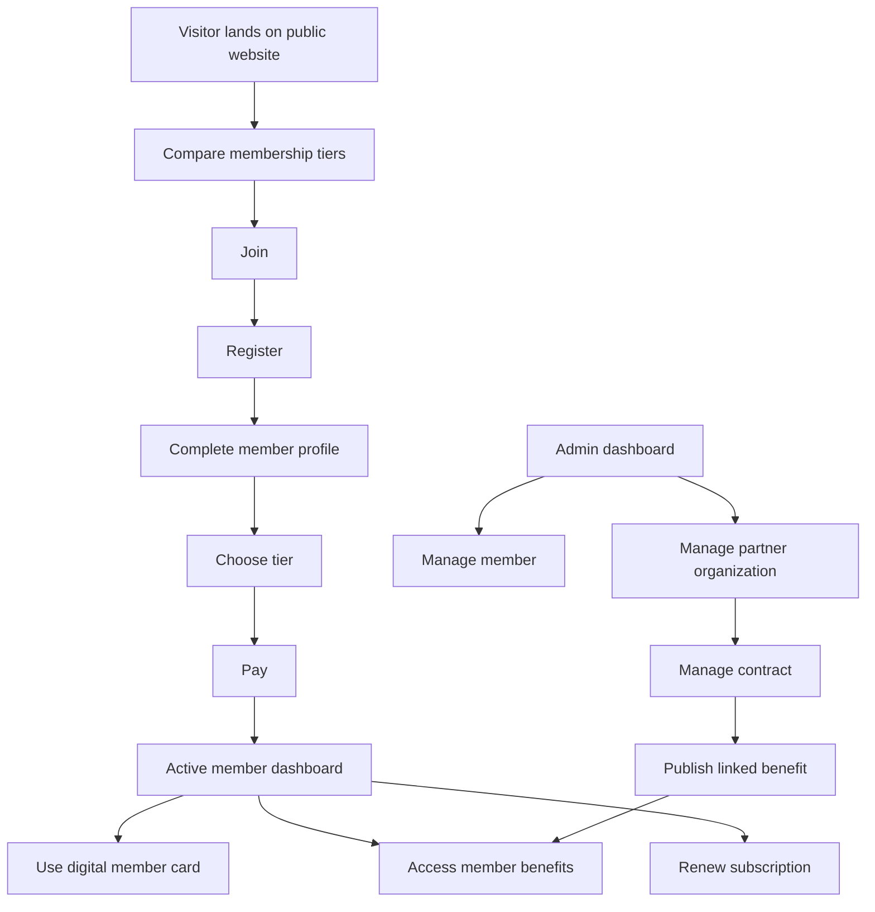
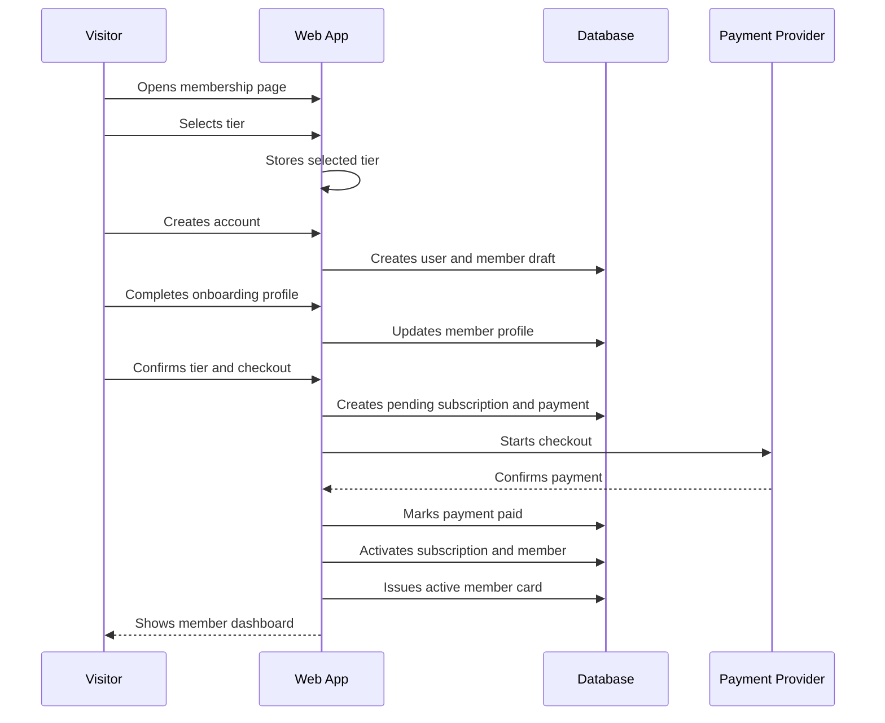
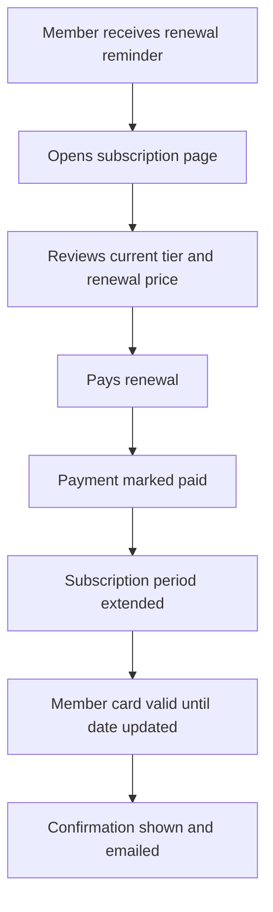
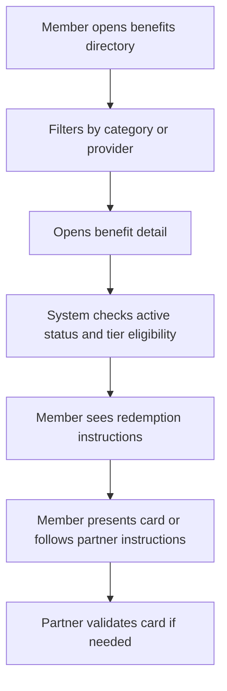
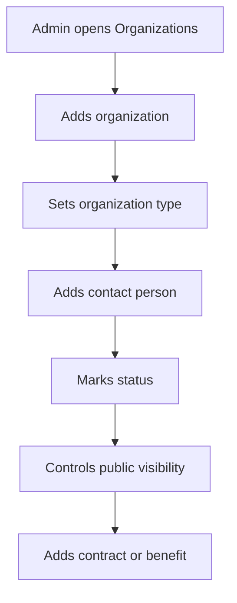
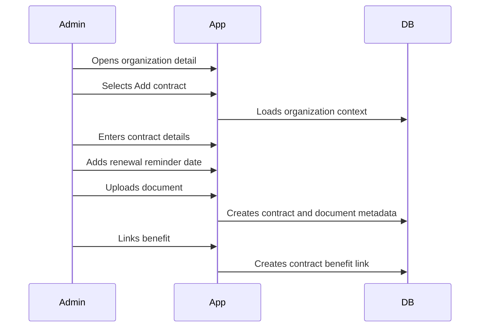

# Aeroskill Club V1 User Flows

Document date: 2026-06-28  
Product: Aeroskill Club web platform  
Version: V1 user flow planning draft  
Source documents:

- `aeroskill-club-v1-prd.md`
- `aeroskill-club-v1-wireframe-spec.md`
- `aeroskill-club-v1-database-schema.md`

## 1. Purpose

This document details the main V1 journeys for Aeroskill Club:

- Join.
- Pay.
- Renew.
- Use card.
- Access benefit.
- Manage member.
- Manage partner.
- Manage contract.

Each flow defines actors, screens, steps, system behavior, data changes, alternate paths, notifications, and acceptance criteria.

## 2. Flow Conventions

### 2.1 Actors

| Actor | Description |
| --- | --- |
| Visitor | Public user who has not logged in |
| Registered User | User account exists, membership may not be active |
| Member | Authenticated user with member profile |
| Active Member | Member with active subscription |
| Expired Member | Member with expired subscription |
| Partner Staff | Person scanning or validating a member card |
| Admin | Authenticated admin user |
| Finance Admin | Admin with payment/subscription permissions |
| Partnership Manager | Admin managing organizations, benefits, and contracts |

### 2.2 Key Statuses

User:

- `pending_verification`
- `active`
- `suspended`
- `deactivated`

Member:

- `draft`
- `pending_payment`
- `active`
- `past_due`
- `expired`
- `suspended`
- `cancelled`
- `archived`

Subscription:

- `pending`
- `active`
- `past_due`
- `expired`
- `cancelled`

Payment:

- `pending`
- `paid`
- `failed`
- `refunded`
- `cancelled`

Member card:

- `pending`
- `active`
- `expired`
- `revoked`

Benefit:

- `draft`
- `scheduled`
- `active`
- `paused`
- `expired`
- `archived`

Organization:

- `lead`
- `in_negotiation`
- `active`
- `inactive`
- `archived`

Contract:

- `draft`
- `in_review`
- `active`
- `expiring_soon`
- `expired`
- `terminated`
- `archived`

### 2.3 Critical Screens

Public:

- `/`
- `/membership`
- `/benefits`
- `/partners`
- `/join`
- `/login`
- `/register`

Member:

- `/member`
- `/member/onboarding`
- `/member/choose-plan`
- `/member/checkout`
- `/member/subscription`
- `/member/card`
- `/member/benefits`
- `/member/benefits/:benefitId`
- `/member/profile`
- `/member/payments`

Validation:

- `/validate/:cardToken`

Admin:

- `/admin`
- `/admin/members`
- `/admin/members/:memberId`
- `/admin/subscriptions`
- `/admin/payments`
- `/admin/organizations`
- `/admin/organizations/:organizationId`
- `/admin/benefits`
- `/admin/contracts`
- `/admin/contracts/:contractId`
- `/admin/documents`
- `/admin/tasks`

## 3. Flow Map

## 4. Flow 1: Join Aeroskill Club

### 4.1 Goal

Convert a public visitor into an active Aeroskill Club member with a completed profile, selected tier, paid subscription, and active digital member card.

### 4.2 Actors

- Visitor.
- Registered User.
- Member.
- Payment provider.
- System.
- Admin as optional support actor.

### 4.3 Entry Points

- Home hero CTA: `Join Aeroskill Club`.
- Membership tier card CTA.
- Benefits page CTA.
- Partner/sponsor page CTA.
- Direct route: `/join`.
- Admin-created invitation link, if added later.

### 4.4 Preconditions

- At least one membership tier is active and public.
- Registration is enabled.
- Terms and privacy links are available.
- Payment or manual payment path is configured.

### 4.5 Happy Path

Detailed steps:

| Step | Actor | Screen | Experience | System/Data Behavior |
| --- | --- | --- | --- | --- |
| 1 | Visitor | Home or Membership | Visitor reviews club value and tier options | App loads active public tiers |
| 2 | Visitor | `/membership` | Visitor chooses Explorer, Pilot, or Aviator Plus | Selected tier is stored in session or URL |
| 3 | Visitor | `/join` | Visitor confirms selected tier or changes tier | App validates tier is active |
| 4 | Visitor | `/register` | Visitor enters name, email, password, accepts required terms | Create `users` row and draft `members` row |
| 5 | System | Email service | Optional email verification is sent | User status may be `pending_verification` |
| 6 | Member | `/member/onboarding` | Member completes required profile fields | Update `members`, create/update `communication_preferences` |
| 7 | Member | `/member/choose-plan` | Member confirms tier | App validates tier and price |
| 8 | Member | `/member/checkout` | Member reviews price and policy | Create `subscriptions.pending` and `payments.pending` |
| 9 | Member | Payment provider | Member pays | Provider processes payment |
| 10 | System | Payment callback/webhook | Payment confirmed | Set `payments.paid`, `subscriptions.active`, `members.active` |
| 11 | System | Card service | System issues card | Create `member_cards.active` with card token |
| 12 | Member | `/member` | Member sees dashboard with status and card CTA | Dashboard loads member, subscription, card, benefits |

### 4.6 Data Created or Updated

Created:

- `users`
- `members`
- `communication_preferences`
- `subscriptions`
- `payments`
- `member_cards`

Updated:

- `members.status`
- `members.joined_at`
- `subscriptions.status`
- `payments.status`
- `member_cards.status`

### 4.7 Notifications

Required:

- Account verification, if enabled.
- Welcome email after activation.
- Payment confirmation.

Recommended:

- Signup abandoned reminder.
- Payment failed reminder.

### 4.8 Alternate Paths

Existing account:

1. Visitor chooses tier.
2. Visitor enters email already used.
3. App prompts login.
4. After login, user resumes join flow from selected tier.

Email verification required:

1. User registers.
2. User status is `pending_verification`.
3. User must verify email before checkout or before activation, depending on policy.
4. After verification, user continues onboarding.

Incomplete profile:

1. User skips required onboarding fields.
2. App saves draft if allowed.
3. User remains `members.draft`.
4. Dashboard shows profile completion CTA.

Tier no longer available:

1. User returns to checkout with an inactive tier.
2. App shows tier unavailable.
3. User returns to tier selection.

Payment abandoned:

1. Payment checkout is started.
2. User leaves before completion.
3. `payments.pending` and `subscriptions.pending` remain.
4. Dashboard shows resume payment CTA.

Payment failed:

1. Provider returns failed status.
2. `payments.status = failed`.
3. `members.status = pending_payment`.
4. Member sees retry payment CTA.

Manual payment:

1. Member chooses bank transfer or offline payment if enabled.
2. `payments.pending` remains until finance admin confirms.
3. Member status remains `pending_payment`.
4. Finance admin marks payment `paid`.
5. Subscription, member, and card activate.

### 4.9 Edge Cases

- Duplicate email registration.
- Payment provider callback arrives before user returns to app.
- User refreshes checkout success page.
- Multiple pending payments for the same subscription.
- Admin manually activates subscription before payment confirmation.
- Member is under age if age rules are introduced.

### 4.10 Acceptance Criteria

- Visitor can complete signup without admin intervention for online payment.
- Selected tier persists through registration and checkout.
- Member is not active before payment or manual confirmation.
- Member card is not active before subscription activation.
- Admin can see the new member, subscription, payment, and card status.
- Failed payment leaves the member with a clear retry path.

## 5. Flow 2: Pay for Membership

### 5.1 Goal

Process first membership payment or manual payment confirmation and activate membership.

### 5.2 Actors

- Member.
- Payment provider.
- System.
- Finance Admin for manual reconciliation.

### 5.3 Entry Points

- Join flow checkout.
- Member dashboard pending payment alert.
- Subscription page payment CTA.
- Admin manual payment creation.

### 5.4 Happy Path: Online Payment

| Step | Actor | Screen/System | Experience | System/Data Behavior |
| --- | --- | --- | --- | --- |
| 1 | Member | `/member/checkout` | Reviews tier, price, billing period, total | App reads selected tier and pending subscription |
| 2 | Member | `/member/checkout` | Confirms terms/payment policy | App validates required consent |
| 3 | System | Backend | Creates checkout session | Create or reuse `payments.pending` |
| 4 | Member | Payment provider | Enters payment details | Provider processes payment |
| 5 | Provider | Webhook/callback | Sends payment success | App verifies signature and idempotency |
| 6 | System | Backend | Activates membership | Payment `paid`, subscription `active`, member `active` |
| 7 | System | Backend | Issues card | Member card `active` |
| 8 | Member | `/member` | Sees success dashboard | Dashboard shows active status |

### 5.5 Happy Path: Manual Payment

| Step | Actor | Screen/System | Experience | System/Data Behavior |
| --- | --- | --- | --- | --- |
| 1 | Member | Checkout | Chooses manual payment instructions if enabled | Payment `pending`, provider `manual` |
| 2 | Member | Bank/offline | Sends payment outside platform | No automatic activation |
| 3 | Finance Admin | `/admin/payments` | Finds pending payment | Filter by `pending` |
| 4 | Finance Admin | Payment detail | Marks paid and adds reference | Payment `paid`, audit log created |
| 5 | System | Backend | Activates subscription/member/card | Subscription and member become active |
| 6 | Member | Email/member portal | Receives confirmation | Member sees active dashboard |

### 5.6 Data Changes

Payment success:

- `payments.status = paid`
- `payments.paid_at = now`
- `subscriptions.status = active`
- `subscriptions.current_period_start = today`
- `subscriptions.current_period_end = today + billing period`
- `members.status = active`
- `members.joined_at` set if first activation
- `member_cards.status = active`
- `member_cards.valid_until = subscriptions.current_period_end`

Payment failure:

- `payments.status = failed`
- `payments.failed_at = now`
- `payments.failure_reason` set if available
- `subscriptions.status` remains `pending` or becomes `past_due`
- `members.status` remains `pending_payment` or becomes `past_due`

### 5.7 Provider Webhook Rules

- Webhooks must be idempotent.
- Provider event IDs should be stored if webhook event table is implemented.
- Payment success should not create duplicate subscriptions.
- Payment success should not issue multiple active cards.
- Payment amount and currency must match expected checkout amount.

### 5.8 Member-Facing States

Pending:

- Message: Payment pending.
- CTA: Resume payment or view instructions.

Paid:

- Message: Membership active.
- CTA: View member card.

Failed:

- Message: Payment failed.
- CTA: Try again.

Manual pending:

- Message: Waiting for confirmation.
- CTA: Contact club or view bank transfer instructions.

### 5.9 Acceptance Criteria

- Successful payment activates membership and card.
- Failed payment does not activate membership.
- Manual payment can be reconciled by authorized admin.
- Payment history is visible to member and admin.
- Repeated provider callback does not duplicate payment activation.

## 6. Flow 3: Renew Membership

### 6.1 Goal

Allow a member to extend membership before or after expiry while preserving payment and subscription history.

### 6.2 Actors

- Active Member.
- Expired Member.
- Payment provider.
- System.
- Finance Admin if manual payment is used.

### 6.3 Entry Points

- Renewal reminder email.
- Member dashboard renewal alert.
- Subscription page.
- Expired member login.
- Admin member detail renewal action.

### 6.4 Happy Path: Active Member Renews Before Expiry

Detailed steps:

| Step | Actor | Screen/System | Experience | System/Data Behavior |
| --- | --- | --- | --- | --- |
| 1 | System | Email | Sends renewal reminder | Based on `current_period_end` |
| 2 | Member | `/member/subscription` | Reviews plan and expiry date | App shows current subscription |
| 3 | Member | Checkout | Confirms renewal payment | Create `payments.pending` |
| 4 | Provider | Webhook | Confirms payment | Payment `paid` |
| 5 | System | Backend | Extends subscription | Update current period dates |
| 6 | System | Backend | Updates card | `member_cards.valid_until` extends |
| 7 | Member | Dashboard | Sees renewed membership | Status remains `active` |

### 6.5 Happy Path: Expired Member Renews

| Step | Actor | Screen/System | Experience | System/Data Behavior |
| --- | --- | --- | --- | --- |
| 1 | Expired Member | `/login` | Logs in | Member dashboard opens with expired state |
| 2 | Expired Member | `/member` | Sees renewal CTA | Benefits are limited or preview-only |
| 3 | Expired Member | `/member/subscription` | Reviews renewal option | App shows expired subscription |
| 4 | Expired Member | Checkout | Pays renewal | Create new payment |
| 5 | System | Backend | Reactivates subscription | Either extend existing or create new period |
| 6 | System | Backend | Reactivates or reissues card | Card becomes active |
| 7 | Member | Dashboard | Sees active status | Benefits become available |

### 6.6 Data Changes

Before expiry renewal:

- New `payments` row.
- Existing `subscriptions` period extended.
- Member remains `active`.
- Card `valid_until` updated.

After expiry renewal:

- New `payments` row.
- Existing subscription may be renewed or new subscription created, depending on implementation policy.
- Member changes from `expired` to `active`.
- Card changes from `expired` to `active` or new card is issued.

### 6.7 Renewal Reminder Rules

Recommended reminder schedule:

- 30 days before expiry.
- 14 days before expiry.
- 7 days before expiry.
- On expiry date.
- 7 days after expiry.

Rules:

- Do not send marketing-style renewal reminders to members who opted out if the message is not service-related.
- Renewal reminders can be considered service emails if required for membership operation.
- Admin dashboard should show expiring memberships.

### 6.8 Alternate Paths

Member changes tier:

1. Member chooses change tier during renewal.
2. App shows new price and benefits.
3. Payment succeeds.
4. Subscription tier changes for next period or immediately, depending on policy.

Payment failed:

1. Payment fails.
2. Membership remains unchanged if before expiry.
3. If already expired, member remains expired.
4. Dashboard shows retry CTA.

Admin renews manually:

1. Admin opens member detail.
2. Admin records manual payment or adjusts subscription.
3. Audit log records action.
4. Member receives confirmation.

### 6.9 Acceptance Criteria

- Member can renew before expiry.
- Expired member can recover membership without creating duplicate account.
- Renewal updates subscription period and card validity.
- Payment history records the renewal payment.
- Admin can see expiring and expired members.

## 7. Flow 4: Use Digital Member Card

### 7.1 Goal

Allow active members to present a digital member card and allow partners or staff to validate status safely.

### 7.2 Actors

- Active Member.
- Expired Member.
- Partner Staff.
- System.

### 7.3 Entry Points

- Member dashboard card preview.
- Member portal navigation: Member Card.
- Benefit detail CTA: View member card.
- Saved screenshot or mobile browser.
- QR scan by partner.

### 7.4 Happy Path: Member Shows Card

| Step | Actor | Screen | Experience | System/Data Behavior |
| --- | --- | --- | --- | --- |
| 1 | Member | `/member` | Opens member dashboard | App loads active card |
| 2 | Member | `/member/card` | Views digital card | Card shows name, number, tier, validity, QR |
| 3 | Partner Staff | Physical/mobile interaction | Scans QR | QR opens validation URL |
| 4 | System | `/validate/:cardToken` | Shows validation result | Resolves `member_cards.card_token` |
| 5 | Partner Staff | Validation page | Confirms status | Sees valid/expired status and safe details |

### 7.5 Validation Result Rules

Valid result shown only if:

- Card token exists.
- Card status is `active`.
- Card validity dates include today.
- Member effective status is `active`.
- Subscription is active.

Public-safe fields:

- Validation status.
- Member display name.
- Membership tier.
- Valid until date.
- Checked at timestamp.

Never show:

- Email.
- Phone.
- Address.
- Date of birth.
- Payment data.
- Internal notes.

### 7.6 Card States

Active:

- Full card visible in member portal.
- QR validates as valid.

Expired:

- Card visible with expired styling.
- QR validates as expired.
- Member sees renewal CTA.

Pending:

- Card area says activation pending.
- QR may be hidden or show pending status.

Revoked:

- Member sees support message.
- QR validates as revoked or invalid.

Suspended member:

- Card should not validate as active.
- Validation page should show not valid or suspended wording according to club policy.

### 7.7 Admin Card Actions

Available from member detail:

- View card status.
- Reissue card.
- Revoke card.
- Refresh validity after subscription update.

Rules:

- Reissue revokes old active token.
- Revoke requires reason.
- Reissue/revoke actions are audited.

### 7.8 Acceptance Criteria

- Active member can quickly access card on mobile.
- QR code opens a public validation page.
- Validation page exposes only approved fields.
- Expired, revoked, suspended, and invalid tokens do not show valid status.
- Card validity stays aligned with subscription.

## 8. Flow 5: Access Member Benefit

### 8.1 Goal

Allow members to discover, filter, open, and redeem benefits based on membership tier and active status.

### 8.2 Actors

- Visitor.
- Active Member.
- Expired Member.
- Partner Staff.
- Admin.
- System.

### 8.3 Entry Points

- Public benefits page.
- Member dashboard featured benefits.
- Member benefits directory.
- Benefit detail page.
- New benefit announcement email.

### 8.4 Happy Path: Active Member Uses Benefit

Detailed steps:

| Step | Actor | Screen | Experience | System/Data Behavior |
| --- | --- | --- | --- | --- |
| 1 | Member | `/member/benefits` | Browses benefits | App loads active eligible benefits |
| 2 | Member | Benefits directory | Filters by category/provider | App filters by benefit category and eligibility |
| 3 | Member | Benefit detail | Opens benefit | App checks tier, subscription, dates, status |
| 4 | System | Backend | Confirms eligibility | Benefit is active and tier-linked |
| 5 | Member | Benefit detail | Reads redemption instructions | Instructions visible only if eligible |
| 6 | Member | Partner location/site | Claims benefit | Shows card or follows instructions |
| 7 | Partner Staff | QR validation | Validates membership if needed | Public validation confirms active status |

### 8.5 Public Visitor Benefit Preview

| Step | Actor | Screen | Experience | System/Data Behavior |
| --- | --- | --- | --- | --- |
| 1 | Visitor | `/benefits` | Views public benefit summaries | App loads public visible benefits |
| 2 | Visitor | Benefit card | Sees category, provider, eligible tiers | Redemption instructions hidden |
| 3 | Visitor | CTA | Clicks join or login | App routes to join/login |

### 8.6 Eligibility Rules

Member can access redemption instructions only if:

- Member effective status is `active`.
- Active subscription exists.
- Benefit status is `active`.
- Benefit is within validity dates.
- Member tier is linked in `benefit_membership_tiers`.

Expired member:

- Can see limited preview if configured.
- Cannot see redemption instructions.
- Sees renewal CTA.

Ineligible tier:

- Can see summary if configured.
- Sees message explaining eligible tiers.
- Sees upgrade or contact CTA if tier changes are allowed.

### 8.7 Data Read or Updated

Read:

- `benefits`
- `benefit_categories`
- `benefit_membership_tiers`
- `membership_tiers`
- `organizations`
- `subscriptions`
- `member_cards`

Updated in V1:

- No redemption tracking required.

Later optional:

- `benefit_redemptions` table for tracking usage.

### 8.8 Alternate Paths

Benefit expired:

1. Member opens old link.
2. App shows expired benefit state.
3. Redemption instructions hidden or clearly marked unavailable.

Benefit paused:

1. Admin pauses benefit.
2. Benefit disappears from member directory.
3. Direct URL shows unavailable state.

Provider organization archived:

1. Benefit remains historically stored.
2. Active benefits from archived organizations are flagged for admin review.

Partner cannot scan QR:

1. Member shows card details manually.
2. Partner may check member number through club contact process.

### 8.9 Acceptance Criteria

- Active eligible members can see redemption instructions.
- Public visitors cannot see member-only redemption instructions.
- Expired members are guided to renew.
- Ineligible members do not accidentally receive benefit instructions.
- Admin-published benefits appear correctly according to tier and visibility.

## 9. Flow 6: Admin Manages Member

### 9.1 Goal

Allow admins to find, review, update, support, suspend, renew, or reconcile member records from one CRM screen.

### 9.2 Actors

- Admin.
- Finance Admin.
- Super Admin.
- Member as indirect recipient.
- System.

### 9.3 Entry Points

- Admin dashboard metric.
- Members list.
- Subscription list.
- Payment list.
- Global admin search.
- Expiring membership alert.
- Failed payment alert.

### 9.4 Happy Path: Review and Update Member

| Step | Actor | Screen | Experience | System/Data Behavior |
| --- | --- | --- | --- | --- |
| 1 | Admin | `/admin` | Sees member metric or alert | Dashboard loads member summaries |
| 2 | Admin | `/admin/members` | Searches or filters member | App queries members with filters |
| 3 | Admin | Member detail | Opens CRM profile | App loads member, user, subscription, payments, card |
| 4 | Admin | Profile tab | Reviews or edits profile | Updates `members` fields |
| 5 | Admin | Subscription tab | Reviews current status | Reads `subscriptions` |
| 6 | Admin | Payments tab | Reviews payment history | Reads `payments` |
| 7 | Admin | Notes tab | Adds internal note | Creates `admin_notes` |
| 8 | System | Audit log | Records sensitive changes | Creates `audit_logs` for important actions |

### 9.5 Common Admin Member Actions

View:

- Member profile.
- Subscription.
- Payment history.
- Card status.
- Eligible benefits.
- Documents.
- Notes.
- Audit history.

Edit:

- Contact fields.
- Aviation profile.
- Status if permitted.
- Communication support fields if needed.

Operational actions:

- Mark payment paid.
- Adjust subscription.
- Suspend member.
- Restore member.
- Reissue card.
- Revoke card.
- Upload document.
- Add note.
- Create task.

### 9.6 Permission Rules

Read-only Staff:

- Can view member profile.
- Cannot edit, suspend, adjust payment, or reissue card.

Club Admin:

- Can edit member profile.
- Can add notes.
- Can manage most member status changes.

Finance Admin:

- Can manage payments and subscriptions.
- Can reconcile manual payments.

Super Admin:

- Can perform all member actions.
- Can assign admin roles.

### 9.7 Status Change Flows

Manual suspension:

1. Admin selects suspend.
2. App requires reason.
3. Member status becomes `suspended`.
4. Card becomes not valid for validation.
5. Audit log records action.

Restore suspended member:

1. Admin selects restore.
2. App checks active subscription.
3. If subscription active, member becomes `active`.
4. If no active subscription, member becomes `expired` or `pending_payment`.
5. Audit log records action.

Manual payment reconciliation:

1. Finance Admin opens pending payment.
2. Finance Admin marks paid and enters reference.
3. Payment becomes `paid`.
4. Subscription/member/card activate or renew.
5. Audit log records action.

Card reissue:

1. Admin opens Card tab.
2. Admin selects reissue.
3. Old active card is `revoked`.
4. New card token is created.
5. Audit log records action.

### 9.8 Notifications

Depending on action:

- Payment confirmation.
- Subscription activated.
- Subscription renewed.
- Account status changed.
- Card reissued.

Admin-only actions may not notify member unless configured.

### 9.9 Acceptance Criteria

- Admin can find a member quickly.
- Member detail shows profile, subscription, payment, and card status in one place.
- Sensitive actions require correct permission.
- Financial and status changes are auditable.
- Manual payment can activate or renew membership.
- Notes and documents can be attached without changing member-facing data.

## 10. Flow 7: Admin Manages Partner

### 10.1 Goal

Allow admins to manage the club's aviation ecosystem through unified organization records for sponsors, flight schools, aerodromes, associations, benefit providers, aircraft operators, and other partners.

### 10.2 Actors

- Partnership Manager.
- Club Admin.
- Super Admin.
- Contact person at partner organization.
- System.

### 10.3 Entry Points

- Admin dashboard quick action.
- Organizations list.
- Global admin search.
- Partner inquiry from contact form.
- Benefit creation flow.
- Contract creation flow.

### 10.4 Happy Path: Create Partner Organization

Detailed steps:

| Step | Actor | Screen | Experience | System/Data Behavior |
| --- | --- | --- | --- | --- |
| 1 | Admin | `/admin/organizations` | Clicks Add organization | App opens create form |
| 2 | Admin | Organization form | Enters name, legal name, website, contact info | Creates `organizations` |
| 3 | Admin | Organization form | Selects one or more types | Creates `organization_type_assignments` |
| 4 | Admin | Organization detail | Adds contact person | Creates `contacts` |
| 5 | Admin | Organization detail | Sets status to lead, negotiation, or active | Updates `organizations.status` |
| 6 | Admin | Organization detail | Marks public if appropriate | Updates `public_visible` |
| 7 | Admin | Organization detail | Adds contract or benefit | Routes to contract/benefit flow |

### 10.5 Organization Types

An organization can have one or more:

- Sponsor.
- Flight school.
- Aerodrome.
- Association.
- Benefit provider.
- Aircraft operator.
- Maintenance provider.
- Insurance partner.
- Event partner.
- Other aviation partner.

Example:

- A flight school can also be a benefit provider.
- An aerodrome can also be an event partner.
- A sponsor can also provide member benefits.

### 10.6 Common Partner Actions

Create or edit:

- Basic details.
- Legal name.
- Website.
- Email.
- Phone.
- Address.
- Public description.
- Logo.
- Internal notes.

Manage related records:

- Contacts.
- Contracts.
- Benefits.
- Aircraft.
- Documents.
- Tasks.
- Notes.

Public visibility:

- Public partner directory shows only non-archived organizations where `public_visible = true`.
- Admin controls whether the organization appears publicly.
- Internal CRM notes never appear publicly.

### 10.7 Partner Lifecycle

Lead:

- Initial potential partner.
- May have contacts and notes.
- Not public by default.

In negotiation:

- Active discussions.
- Contract may be `draft` or `in_review`.
- Tasks may track follow-up.

Active:

- Partnership confirmed.
- May be public.
- May have active contract and benefits.

Inactive:

- No current active relationship.
- Kept in CRM.

Archived:

- Hidden from default CRM lists and public pages.
- Historical contracts and benefits remain available.

### 10.8 Alternate Paths

Duplicate organization:

1. Admin enters organization name.
2. App suggests possible existing matches.
3. Admin opens existing record or confirms new record.

Organization without contact:

1. Admin creates organization.
2. No contact is available yet.
3. Organization remains valid but dashboard may flag missing primary contact.

Partner from contact form:

1. Visitor submits partner inquiry.
2. Admin reviews inquiry.
3. Admin creates organization and contact from inquiry data.

Organization should be hidden publicly:

1. Admin creates or updates organization.
2. `public_visible = false`.
3. Organization remains in CRM but not public site.

### 10.9 Acceptance Criteria

- Admin can create one organization and classify it with multiple types.
- Admin can attach contacts, contracts, benefits, documents, and notes.
- Public visibility is explicit.
- Archived organizations disappear from default public and CRM lists.
- Organization detail gives a complete view of relationship history.

## 11. Flow 8: Admin Manages Contract

### 11.1 Goal

Allow admins to track partner agreements, documents, linked benefits, renewal dates, and responsible owners.

### 11.2 Actors

- Partnership Manager.
- Club Admin.
- Super Admin.
- Responsible Admin.
- System.

### 11.3 Entry Points

- Organization detail.
- Contracts list.
- Admin dashboard expiring contracts widget.
- Benefit detail.
- Task reminder.

### 11.4 Happy Path: Create Contract

Detailed steps:

| Step | Actor | Screen | Experience | System/Data Behavior |
| --- | --- | --- | --- | --- |
| 1 | Admin | Organization detail | Clicks Add contract | Organization context is prefilled |
| 2 | Admin | Contract form | Enters title, type, dates, status, summary | Creates `contracts` |
| 3 | Admin | Contract form | Assigns responsible admin | Saves `responsible_admin_id` |
| 4 | Admin | Contract form | Sets renewal reminder date | Saves `renewal_reminder_date` |
| 5 | Admin | Contract detail | Uploads signed agreement | Creates `documents` with owner `contract` |
| 6 | Admin | Contract detail | Links existing or new benefit | Creates `contract_benefits` or sets benefit contract |
| 7 | System | Dashboard | Adds renewal visibility | Contract appears in renewal widgets when due |

### 11.5 Contract Types

- Sponsorship.
- Benefit agreement.
- Flight school partnership.
- Aerodrome partnership.
- Association agreement.
- Fleet access agreement.
- Event partnership.
- Other.

### 11.6 Contract Lifecycle

Draft:

- Internal preparation.
- Documents may be attached.
- Not treated as active.

In review:

- Being negotiated or reviewed.
- Follow-up tasks may be assigned.

Active:

- Agreement is valid.
- Related benefits may be published.
- Renewal reminder is monitored.

Expiring soon:

- Renewal reminder date reached.
- Dashboard highlights contract.
- Task may be created.

Expired:

- End date has passed.
- Related benefits are not automatically unpublished in V1.
- Admin should review linked benefits.

Terminated:

- Agreement ended early.
- Reason should be captured in notes.

Archived:

- Hidden from default active lists.
- Preserved for history.

### 11.7 Renewal Management

Happy path:

| Step | Actor | Screen/System | Experience | System/Data Behavior |
| --- | --- | --- | --- | --- |
| 1 | System | Scheduled check | Finds contracts where renewal date is due | Contract appears in dashboard |
| 2 | Admin | `/admin` | Opens expiring contracts widget | Filtered contracts list opens |
| 3 | Admin | Contract detail | Reviews dates, documents, benefits | App loads related records |
| 4 | Admin | Tasks or Notes | Creates follow-up task | Creates `tasks` |
| 5 | Admin | Contract detail | Updates status or dates | Updates `contracts` |
| 6 | System | Audit log | Records sensitive changes | Creates `audit_logs` if enabled |

Recommended renewal decisions:

- If only dates change, update existing contract.
- If a new signed agreement replaces the old one, create a successor contract and archive or expire the previous one.
- If contract expires without renewal, review linked benefits manually.

### 11.8 Contract and Benefit Relationship

Rules:

- A contract belongs to one organization.
- A contract can support many benefits.
- A benefit can link to one primary contract or many contracts through `contract_benefits`.
- Publishing a benefit should be allowed only when contract requirements are satisfied by club policy.
- Expiring a contract should flag linked active benefits for review.

### 11.9 Document Rules

- Contract documents are `admin_only` by default.
- Upload requires file type and size validation.
- Document archive should not delete the contract.
- Signed versions should be clearly named.

### 11.10 Alternate Paths

Contract created before organization active:

1. Organization is `lead` or `in_negotiation`.
2. Contract is created as `draft` or `in_review`.
3. Organization becomes `active` when agreement is finalized.

Contract without document:

1. Admin creates contract metadata.
2. Contract remains valid as CRM record.
3. Dashboard may flag missing signed document if required.

Contract expires:

1. Scheduled job or admin marks expired.
2. Contract status becomes `expired`.
3. Linked benefits appear in review list.

Contract terminated:

1. Admin chooses terminate.
2. App requires termination reason.
3. Contract status becomes `terminated`.
4. Linked benefits should be paused or reviewed manually.

### 11.11 Acceptance Criteria

- Admin can create contract from organization detail.
- Contract stores type, status, dates, owner, notes, and documents.
- Renewal reminder appears in dashboard.
- Related benefits are visible from contract detail.
- Expired or terminated contracts do not disappear from history.
- Contract changes can be audited.

## 12. Cross-Flow Rules

### 12.1 Status Synchronization

Membership activation:

- Payment `paid` leads to subscription `active`.
- Subscription `active` leads to member `active`.
- Member `active` plus subscription period leads to card `active`.

Membership expiry:

- Subscription `expired` leads to member `expired` if no other active subscription exists.
- Member `expired` leads to card `expired`.

Suspension:

- Member `suspended` overrides subscription/card display.
- Validation should not show suspended member as valid.

### 12.2 Idempotency

Must be idempotent:

- Payment provider callbacks.
- Card issuance after payment.
- Renewal confirmation.
- Email send retries where possible.

### 12.3 Audit Requirements

Audit these actions:

- Admin changes member status.
- Admin changes subscription status or dates.
- Admin reconciles payment.
- Admin refunds or marks payment failed.
- Admin reissues or revokes card.
- Admin changes admin roles.
- Admin publishes, pauses, or archives benefit.
- Admin changes contract status or renewal date.
- Admin archives documents.

### 12.4 Privacy Requirements

Public validation page must not expose sensitive member data.

Public pages must not expose:

- Member personal details.
- Internal partner notes.
- Contract documents.
- Payment information.
- Admin notes.

### 12.5 Permission Requirements

Finance actions require finance permission:

- Mark payment paid.
- Record refund.
- Adjust subscription period.

Admin role actions require Super Admin:

- Invite admin.
- Assign role.
- Remove role.

Partnership actions require partnership or club admin permission:

- Create organization.
- Publish benefit.
- Create contract.
- Archive partner.

## 13. Error and Recovery Matrix

| Situation | User/Admin Experience | System Behavior | Recovery |
| --- | --- | --- | --- |
| Duplicate email | Registration shows account exists | No new user created | Login and resume |
| Missing profile fields | Onboarding highlights fields | Member remains draft | Complete profile |
| Payment failed | Member sees retry CTA | Payment failed, subscription pending/past due | Retry checkout |
| Payment webhook delayed | Member sees pending state | Payment remains pending | Webhook updates later |
| Expired card scanned | Validation shows expired | Card not valid | Member renews |
| Revoked card scanned | Validation shows not valid | Token rejected | Admin reissues if appropriate |
| Benefit paused | Benefit unavailable | Benefit hidden from directory | Admin reactivates |
| Ineligible tier | Member sees not eligible | Instructions hidden | Upgrade/contact |
| Contract expired | Admin sees expired status | Benefits flagged for review | Renew or pause benefits |
| Permission denied | Admin sees restricted state | No write operation | Request correct role |

## 14. Test Scenarios

### 14.1 Join and Pay

- New visitor joins Explorer and pays successfully.
- New visitor joins Pilot and payment fails.
- Existing user logs in and resumes selected tier.
- User abandons checkout and resumes later.
- Finance admin confirms manual payment.

### 14.2 Renew

- Active member renews before expiry.
- Expired member renews after expiry.
- Renewal payment fails.
- Admin manually extends subscription.
- Card validity updates after renewal.

### 14.3 Card

- Active card validates.
- Expired card validates as expired.
- Revoked card does not validate.
- Suspended member card does not validate.
- Invalid token shows safe not found state.

### 14.4 Benefits

- Active Pilot member sees Pilot benefits.
- Explorer member cannot see Pilot-only redemption instructions.
- Expired member sees renewal prompt.
- Public visitor sees only public benefit preview.
- Paused benefit disappears from member directory.

### 14.5 Admin Member Management

- Admin searches by member number.
- Finance admin reconciles manual payment.
- Read-only staff cannot edit member.
- Admin suspends and restores member.
- Admin reissues card.

### 14.6 Partner and Contract

- Admin creates organization with multiple types.
- Admin adds primary contact.
- Admin creates active contract with document.
- Admin links contract to benefit.
- Expiring contract appears on dashboard.
- Archived organization is hidden from public site.

## 15. Open Decisions

These decisions should be finalized before implementation:

- Should email verification be required before checkout or only before activation?
- Will V1 use online card payments, manual payments, or both?
- Should subscription renewal create a new subscription record or extend the existing active subscription?
- Should card reissue happen on every renewal or only when manually requested?
- Should QR validation show full member name or partial name?
- Are tier upgrades allowed mid-period in V1?
- Should expired members see benefit summaries, or only renewal prompts?
- Should contract expiry automatically pause linked benefits, or only flag them for review?

## 16. Flow Acceptance Criteria

The V1 flow design is ready for implementation when:

- A visitor can become an active member through a complete join and payment journey.
- Payment success, failure, pending, and manual reconciliation states are defined.
- Renewal works before and after expiry.
- Card validation has safe states for active, expired, revoked, suspended, and invalid tokens.
- Benefit eligibility clearly depends on member status, tier, benefit status, and dates.
- Admin member management supports profile, subscription, payment, card, notes, and documents.
- Admin partner management supports unified organizations, contacts, public visibility, benefits, and contracts.
- Contract management supports lifecycle, renewal reminders, documents, linked benefits, and follow-up tasks.

