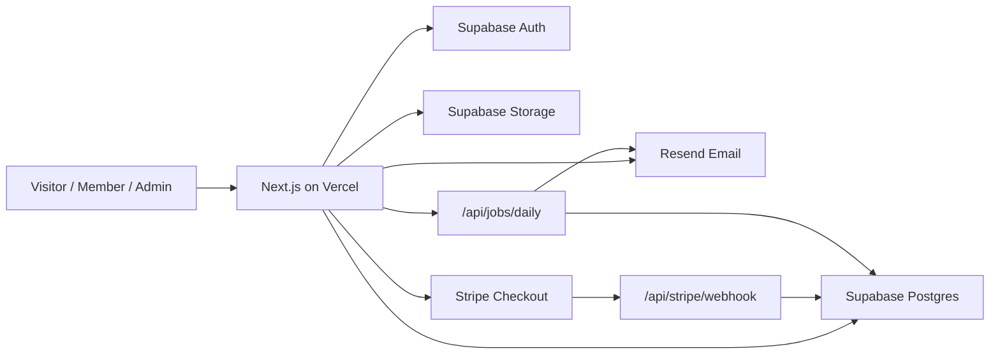

# Aeroskill Club V1 Technical Architecture

Document date: 2026-06-28  
Product: Aeroskill Club web platform  
Version: V1 technical architecture draft  
Goal: Simple, straightforward, Vercel-deployable architecture using free-tier-friendly services where practical

## 1. Architecture Decision

Use a single full-stack Next.js application deployed to Vercel, with Supabase as the backend platform for Postgres, authentication, and file storage. Use Resend for transactional email. Use Stripe Checkout for online membership payments, with manual bank transfer as a V1 fallback.

Recommended V1 stack:

| Layer | Choice | Why |
| --- | --- | --- |
| Web app | Next.js App Router + TypeScript | Best fit for public website, member portal, admin CRM, API routes, Vercel deployment |
| Styling | Tailwind CSS + shadcn/ui-style components + Lucide icons | Fast, consistent, design-system friendly |
| Database | Supabase Postgres | Relational, hosted, simple, good fit for CRM data |
| ORM / migrations | Drizzle ORM + SQL migrations | Lightweight, type-safe, straightforward |
| Auth | Supabase Auth | Email/password, password reset, sessions, future OAuth/MFA |
| File storage | Supabase Storage | Same platform as DB/auth, supports private buckets and signed URLs |
| Payments | Stripe Checkout | Low implementation complexity, hosted payment UI, Romania supported |
| Manual payments | Admin reconciliation in CRM | Useful for bank transfer and local club operations |
| Email | Resend + React Email templates | Simple developer experience, free tier suitable for MVP volume |
| Deployment | Vercel | Natural fit for Next.js, previews, CI/CD |
| Source control | GitHub | Standard Vercel integration |
| Background jobs | Vercel Cron endpoint or admin-triggered job | Keep V1 simple |
| Analytics | Vercel analytics/traffic insights or no analytics initially | Avoid extra services early |

## 2. Important Free-Tier Note

This architecture is free-tier-friendly for development, prototype, and early validation.

However, a real paid membership club is commercial use. Vercel's Hobby plan is free and described as a starting place for a web app or personal project. For an actual public launch that collects money, verify the current plan terms and expect Vercel Pro even if Supabase, Resend, and other services can start on free tiers.

Practical recommendation:

- Prototype/MVP validation: Vercel Hobby + Supabase Free + Resend Free + Stripe test mode.
- Controlled production launch: Vercel Pro + Supabase Free/Pro depending on volume + Resend Free/Pro depending on emails + Stripe live mode.

Payment processors are not truly "free tier" services. Stripe has no setup or monthly fee on standard pricing, but each transaction has processing fees.

## 3. System Overview



## 4. Application Shape

Use one Next.js app with route groups:

```text
app/
  (public)/
    page.tsx
    mission/
    membership/
    benefits/
    partners/
    contact/
  (auth)/
    login/
    register/
    reset-password/
  (member)/
    member/
      page.tsx
      onboarding/
      choose-plan/
      checkout/
      subscription/
      card/
      benefits/
      profile/
      payments/
      preferences/
  (admin)/
    admin/
      page.tsx
      members/
      subscriptions/
      payments/
      organizations/
      contacts/
      benefits/
      contracts/
      documents/
      communications/
      fleet/
      settings/
  validate/
    [cardToken]/
  api/
    stripe/
      webhook/
    jobs/
      daily/
    upload/
```

Recommended internal folders:

```text
src/
  components/
    ui/
    public/
    member/
    admin/
  features/
    auth/
    members/
    subscriptions/
    payments/
    member-card/
    organizations/
    benefits/
    contracts/
    documents/
    communications/
    fleet/
  lib/
    auth/
    db/
    email/
    payments/
    storage/
    permissions/
    validation/
  server/
    actions/
    queries/
    jobs/
  styles/
```

## 5. Frontend Stack

### 5.1 Core

Use:

- Next.js App Router.
- TypeScript.
- React Server Components where practical.
- Server Actions or Route Handlers for mutations.
- Tailwind CSS.
- shadcn/ui-style primitives.
- Lucide React icons.

### 5.2 Forms

Use:

- React Hook Form.
- Zod validation.

Pattern:

- Zod schema shared between client form validation and server validation.
- Server remains source of truth.
- Admin forms use sectioned layouts and sticky save footer.

### 5.3 Tables

Use:

- TanStack Table for admin CRM lists.

Tables needed:

- Members.
- Subscriptions.
- Payments.
- Organizations.
- Contacts.
- Benefits.
- Contracts.
- Documents.
- Fleet.
- Audit log.

### 5.4 QR Codes

Use:

- A small QR code package such as `qrcode` or `react-qr-code`.

Rules:

- QR payload is only the validation URL.
- Validation token is random and non-sequential.
- QR does not contain private member data.

## 6. Backend and Database

### 6.1 Database Platform

Use Supabase Postgres.

Reasons:

- Full Postgres database.
- Works well with relational CRM data.
- Same platform can handle auth and storage.
- Supabase can be queried from Next.js server code.

### 6.2 Logical vs Physical User Model

The database schema document defines a logical `users` entity. With Supabase, implementation should map this carefully:

- Supabase owns authentication users in `auth.users`.
- The application should create a public profile table such as `app_users` or `user_profiles`.
- `members.user_id`, `admin_user_roles.user_id`, and audit `actor_user_id` should reference the Supabase auth user ID or the app profile ID consistently.

Recommended physical model:

```text
auth.users
  Supabase-managed auth identity

public.app_users
  id uuid primary key references auth.users(id)
  email
  status
  last_login_at
  created_at
  updated_at
```

Then:

- `members.user_id` references `app_users.id`.
- `admin_user_roles.user_id` references `app_users.id`.
- `audit_logs.actor_user_id` references `app_users.id`.

This avoids confusion between Supabase's managed auth table and the app's CRM profile data.

### 6.3 ORM and Migrations

Use Drizzle ORM for:

- Type-safe queries.
- Schema definitions.
- Migrations.

Recommended approach:

- Keep migrations in repo.
- Apply migrations through Supabase CLI or a controlled deployment step.
- Do not let production schema drift through manual dashboard-only changes.

Possible folder:

```text
db/
  schema/
  migrations/
  seed/
```

### 6.4 Data Access Pattern

Keep V1 simple:

- Public pages can use server-side reads.
- Member pages use server-side reads scoped to the authenticated user.
- Admin pages use server-side reads after permission checks.
- Mutations go through Server Actions or Route Handlers.

Recommended pattern:

```text
Browser
-> Next.js page/action/route handler
-> requireAuth / requireAdmin
-> service function
-> Drizzle/Supabase Postgres
```

Avoid for V1:

- Direct browser writes to business tables.
- Complex client-side Supabase queries for admin CRM.
- Separate backend service.

### 6.5 Row Level Security

Use a layered model:

1. Application-level permission checks in Next.js.
2. Supabase Row Level Security for member-owned data and storage objects.
3. Server-only privileged access for admin operations.

Rules:

- Never expose Supabase service role key to the browser.
- Member can read/update own profile only.
- Member can read own subscription, payments, card, and documents.
- Public validation route can read only card validation fields.
- Admin operations must call `requireAdmin(permission)` before privileged DB access.

## 7. Authentication

### 7.1 Provider

Use Supabase Auth.

V1 auth methods:

- Email and password.
- Password reset.
- Email verification.

Later:

- Google login.
- Microsoft login.
- Admin MFA.

### 7.2 Session Handling

Use Supabase SSR helpers for Next.js session handling.

Required behavior:

- Public pages available without session.
- Member routes require authenticated user with member profile.
- Admin routes require authenticated user with admin role.
- Suspended or deactivated users cannot access protected areas.

### 7.3 Route Protection

Middleware-level checks:

- Redirect unauthenticated member users to `/login`.
- Redirect unauthenticated admin users to `/login`.
- Redirect authenticated non-admins away from `/admin`.

Server-level checks:

- Every admin mutation must call permission guard.
- Every member mutation must verify owner scope.

### 7.4 Admin Access Model

Use database-driven RBAC:

- `roles`
- `permissions`
- `role_permissions`
- `admin_user_roles`

Recommended helper:

```ts
await requireAdmin("members.write")
await requireAdmin("payments.write")
await requireAdmin("contracts.write")
```

Admin roles:

- Super Admin.
- Club Admin.
- Finance Admin.
- Communications Admin.
- Partnership Manager.
- Fleet Manager.
- Read-only Staff.

## 8. Payments

### 8.1 Provider

Use Stripe Checkout for online payments.

Why:

- Hosted checkout reduces payment UI and PCI scope.
- Supports one-time and subscription payments.
- Romania is listed as supported by Stripe.
- No setup or monthly fee on standard pricing, but transaction fees apply.

### 8.2 Recommended V1 Payment Model

Use local annual membership subscriptions in the Aeroskill database, paid through Stripe one-time Checkout payments.

This is simpler than full auto-renewing Stripe Billing.

V1 behavior:

- Member chooses tier.
- App creates local `subscriptions.pending`.
- App creates local `payments.pending`.
- App creates Stripe Checkout Session for the tier price.
- Stripe webhook confirms payment.
- App marks payment paid.
- App activates subscription for one year.
- App issues/updates member card.

Why this is best for V1:

- Simple renewal logic.
- Easy manual payment fallback.
- Less billing complexity.
- Works well for clubs where annual membership renewal can be explicit.

### 8.3 Optional Later Payment Model

Use Stripe Billing subscriptions if Aeroskill Club wants automatic renewal.

Only add auto-renew when:

- Refund/cancellation policy is finalized.
- VAT/invoice/accounting flow is clear.
- Failed renewal handling is ready.
- Members explicitly consent to recurring billing.

### 8.4 Manual Bank Transfer

Support manual payments in V1.

Flow:

1. Member selects bank transfer/manual payment.
2. App creates `payments.pending` with provider `manual`.
3. Member receives instructions.
4. Finance Admin confirms payment in admin CRM.
5. App activates subscription and member card.

Why:

- Useful for local club operations.
- No platform fee.
- Supports members who prefer bank transfer.
- Gives the club a fallback if Stripe setup is delayed.

### 8.5 Stripe Webhook

Endpoint:

```text
POST /api/stripe/webhook
```

Rules:

- Verify Stripe webhook signature.
- Store provider event ID if using `payment_provider_events`.
- Process idempotently.
- Never trust checkout success page alone.
- Only webhook confirmation activates membership.

Events to handle:

- `checkout.session.completed`
- `payment_intent.succeeded`
- `payment_intent.payment_failed`
- Later, if Stripe Billing is used: `invoice.paid`, `invoice.payment_failed`, `customer.subscription.updated`

## 9. Email

### 9.1 Provider

Use Resend.

Why:

- Simple API.
- Good fit for Next.js.
- Free tier is enough for early transactional email volume.
- Supports custom domain authentication.
- Works with React Email templates.

### 9.2 Email Types

Auth emails:

- Email verification.
- Password reset.

Membership emails:

- Welcome.
- Payment confirmation.
- Payment failed.
- Membership activated.
- Renewal reminder.
- Subscription expired.
- Card reissued.

CRM/admin emails:

- Partner inquiry received.
- Contract renewal reminder.
- Admin task notification.

### 9.3 Email Implementation

Use:

- Resend API from server-only code.
- React Email for templates.
- Database records for campaign sends later.

Recommended folder:

```text
src/lib/email/
  resend.ts
  templates/
    welcome.tsx
    payment-confirmation.tsx
    renewal-reminder.tsx
    contract-renewal.tsx
```

Rules:

- Do not send email directly from client code.
- Use one verified sending domain.
- Separate transactional emails from marketing/partner-offer emails.
- Respect `communication_preferences`.

## 10. File Storage

### 10.1 Provider

Use Supabase Storage.

Why:

- Same platform as auth/database.
- Supports files, documents, images, and private access patterns.
- Integrates with Row Level Security policies.

### 10.2 Buckets

Recommended buckets:

| Bucket | Access | Use |
| --- | --- | --- |
| `public-assets` | Public | Public images, partner logos if approved |
| `organization-logos` | Public or signed | Partner/sponsor logos |
| `member-documents` | Private | Member files, certificates, receipts if stored |
| `contracts` | Private admin-only | Contract PDFs |
| `aircraft-documents` | Private admin-only | Insurance, airworthiness, maintenance files |
| `admin-documents` | Private admin-only | Internal CRM files |

### 10.3 Upload Flow

Recommended:

- Uploads go through a Next.js route handler.
- Route checks authentication and permission.
- Route creates signed upload URL or uploads using server credentials.
- App stores file metadata in `documents`.

Rules:

- Keep contract documents private by default.
- Generate signed URLs for temporary access.
- Validate file type and size.
- Archive document metadata rather than hard delete.

## 11. Background Jobs

Keep V1 minimal.

Jobs needed:

- Expire subscriptions.
- Expire member cards.
- Send renewal reminders.
- Flag contract renewals.
- Send contract reminder emails.

Recommended V1 implementation:

```text
GET /api/jobs/daily
Authorization: Bearer CRON_SECRET
```

Triggered by:

- Vercel Cron if available on the selected plan.
- Manual Super Admin button as fallback.

Rules:

- Jobs must be idempotent.
- Store send timestamps to avoid duplicate reminders.
- Keep job execution short.
- For larger scale, move jobs to Supabase Edge Functions, a queue, or a dedicated worker later.

## 12. Deployment

### 12.1 Environments

Use three environments:

| Environment | Purpose |
| --- | --- |
| Local | Developer machine |
| Preview | Vercel preview deployment per branch/PR |
| Production | Public live site |

### 12.2 Vercel Setup

Use:

- GitHub repository.
- Vercel project connected to repo.
- Preview deployments.
- Environment variables in Vercel dashboard.
- Custom domain when ready.

Important:

- Vercel Hobby is fine for prototype validation.
- Verify Vercel plan terms before paid public launch; expect Vercel Pro for a real commercial deployment.

### 12.3 Environment Variables

Required:

```text
NEXT_PUBLIC_SUPABASE_URL=
NEXT_PUBLIC_SUPABASE_ANON_KEY=
SUPABASE_SERVICE_ROLE_KEY=
DATABASE_URL=

RESEND_API_KEY=
EMAIL_FROM=

STRIPE_SECRET_KEY=
STRIPE_WEBHOOK_SECRET=
NEXT_PUBLIC_STRIPE_PUBLISHABLE_KEY=

APP_URL=
CRON_SECRET=
ADMIN_BOOTSTRAP_EMAIL=
```

Rules:

- `NEXT_PUBLIC_*` values can be exposed to browser.
- Service role, database URL, Stripe secret, webhook secret, and Resend key are server-only.
- Never log secrets.

### 12.4 Database Migrations

Recommended flow:

1. Write migration locally.
2. Test against local or staging Supabase project.
3. Apply migration to production before deploying code that depends on it.
4. Deploy app to Vercel.

Avoid:

- Direct manual production schema edits without migration.
- Auto-running destructive migrations on every deploy.

## 13. Security Model

### 13.1 Data Classification

Public:

- Published public pages.
- Public partner names/logos.
- Public benefit summaries.
- Card validation status only.

Member-private:

- Profile.
- Subscription.
- Payment history.
- Member card.
- Member documents.
- Eligible redemption instructions.

Admin-private:

- Contracts.
- Internal notes.
- Partner contact details.
- Payment reconciliation.
- Audit logs.
- Private documents.

### 13.2 Core Security Rules

Authentication:

- Supabase Auth sessions.
- Email verification before activation or before checkout, depending on policy.
- Password reset enabled.
- Admin MFA recommended before launch if practical.

Authorization:

- Member routes require authenticated member.
- Admin routes require role and permission.
- All server mutations enforce permission.
- Read-only staff cannot mutate data.

Database:

- Use RLS for member-owned data where direct Supabase access is possible.
- Use server-only database access for admin operations.
- Keep service role key server-only.

Files:

- Private buckets for contracts and member documents.
- Signed URLs for temporary access.
- Explicit `documents.visibility`.

Payments:

- Use Stripe-hosted Checkout.
- Verify webhook signatures.
- Webhook is source of truth for payment success.
- Keep local payment records immutable except controlled status updates.

Web:

- HTTPS only.
- Secure cookies.
- SameSite cookies.
- CSRF-aware mutation patterns.
- Validate all server inputs with Zod.
- Rate-limit sensitive endpoints where possible.

Audit:

- Record admin changes to member status, payments, subscriptions, cards, contracts, benefits, documents, and roles.

### 13.3 Public Card Validation Safety

Validation URL:

```text
/validate/:cardToken
```

Rules:

- Token must be random and non-sequential.
- Show only safe fields.
- Never show email, phone, address, date of birth, payment data, or internal notes.
- Invalid/revoked/expired/suspended cards must not show valid status.

## 14. Admin Access

### 14.1 Admin Bootstrap

Initial setup:

1. Deploy app.
2. Create first user account.
3. Run bootstrap script using `ADMIN_BOOTSTRAP_EMAIL`.
4. Assign Super Admin role.
5. Disable bootstrap script or make it idempotent and restricted.

### 14.2 Admin Permissions

Use permission strings:

```text
members.read
members.write
subscriptions.read
subscriptions.write
payments.read
payments.write
organizations.read
organizations.write
benefits.read
benefits.write
contracts.read
contracts.write
documents.read
documents.write
communications.read
communications.write
fleet.read
fleet.write
settings.admin_users
audit.read
```

### 14.3 Admin Route Guard

Every admin page:

```text
requireAdmin("module.read")
```

Every admin mutation:

```text
requireAdmin("module.write")
```

Finance-sensitive actions:

- `payments.write`
- `subscriptions.write`

Super-admin-only actions:

- Assign admin roles.
- Remove admin roles.
- Bootstrap/deactivate admin access.

## 15. Observability and Logs

Keep simple for V1:

- Vercel deployment logs.
- Supabase database logs.
- Stripe event logs.
- Resend email logs.
- Application audit log table.

Optional later:

- Sentry for runtime errors.
- PostHog/Plausible for product analytics.
- Uptime monitoring.

V1 minimum:

- Make payment webhook failures visible.
- Make failed emails visible.
- Make failed background job runs visible.
- Add admin audit log for sensitive actions.

## 16. Performance Model

Public site:

- Static or cached where possible.
- Use optimized images.
- Avoid heavy client JavaScript.

Member portal:

- Server-side initial data load.
- Small client components for forms, filters, card/QR, and interactions.

Admin CRM:

- Server-side pagination.
- Server-side filtering/search.
- Avoid loading all members/organizations at once.
- Index the database according to schema plan.

## 17. V1 API and Server Actions

Prefer Server Actions for simple form submissions:

- Member profile update.
- Admin create/edit entity.
- Manual payment reconciliation.
- Publish/pause benefit.
- Create contract/task/note.

Use Route Handlers for external integrations:

- Stripe webhook.
- File upload.
- Daily job.
- Public validation endpoint if needed.

Example:

```text
app/api/stripe/webhook/route.ts
app/api/jobs/daily/route.ts
app/api/upload/route.ts
```

## 18. Recommended Implementation Order

1. Create Next.js app with TypeScript and Tailwind.
2. Add Supabase project and local environment variables.
3. Add Supabase Auth and route protection.
4. Add Drizzle schema and first migrations.
5. Implement public site pages.
6. Implement member registration/onboarding.
7. Implement tier selection and local subscription records.
8. Add Stripe Checkout and webhook.
9. Add member dashboard and digital card.
10. Add benefits directory and eligibility.
11. Add admin dashboard and member CRM.
12. Add organizations, contacts, contracts, benefits.
13. Add Supabase Storage uploads and document metadata.
14. Add Resend email templates.
15. Add daily job for expiry/reminders.
16. Add audit log and admin hardening.
17. Deploy preview and production on Vercel.

## 19. What Not To Build in V1

Do not add:

- Separate backend service.
- Microservices.
- Native mobile app.
- Full booking engine.
- Maintenance logbook.
- Partner self-service portal.
- Complex queue infrastructure.
- Custom payment form.
- Multi-tenant architecture.
- Custom CMS unless content editing becomes urgent.

## 20. Production Readiness Checklist

Before real public launch:

- Vercel plan suitable for commercial use.
- Supabase production project created.
- Database migrations applied.
- Backups and export process understood.
- Domain configured.
- Email domain verified.
- Stripe live account verified.
- Stripe webhook live endpoint configured.
- Manual payment instructions reviewed.
- Privacy, terms, and refund policy reviewed.
- Admin roles seeded.
- First Super Admin created.
- RLS/policies reviewed.
- File bucket access reviewed.
- Payment webhook tested.
- Card validation tested.
- Renewal/expiry job tested.
- Admin audit log enabled.

## 21. Source Notes Checked

Official docs/pricing pages reviewed on 2026-06-28:

- Vercel Pricing: https://vercel.com/pricing
- Next.js Deploying: https://nextjs.org/docs/app/getting-started/deploying
- Supabase Docs: https://supabase.com/docs
- Supabase Auth: https://supabase.com/docs/guides/auth
- Supabase Storage: https://supabase.com/docs/guides/storage
- Supabase Database: https://supabase.com/docs/guides/database/overview
- Resend Pricing: https://resend.com/pricing
- Stripe Global Availability: https://stripe.com/global
- Stripe Romania Pricing: https://stripe.com/ro/pricing
- Stripe Checkout Docs: https://docs.stripe.com/payments/checkout
- Stripe Webhooks Docs: https://docs.stripe.com/webhooks

## 22. Final Recommendation

Build Aeroskill Club V1 as:

```text
Next.js on Vercel
+ Supabase Auth/Postgres/Storage
+ Drizzle ORM
+ Resend emails
+ Stripe Checkout
+ Manual payment fallback
```

This is the simplest credible architecture for a polished membership club and CRM foundation. It keeps the system understandable, deployable, and affordable while leaving a clean path to grow into paid infrastructure when the club has real members, payments, partners, and documents flowing through the platform.
