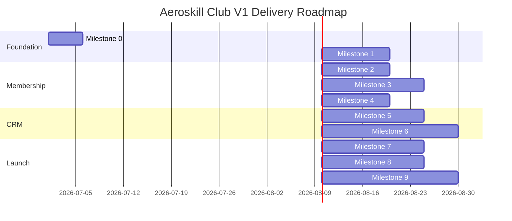

# Aeroskill Club V1 Milestone Roadmap

Document date: 2026-06-28  
Product: Aeroskill Club web platform  
Version: V1 delivery roadmap draft  
Source documents:

- `aeroskill-club-v1-prd.md`
- `aeroskill-club-v1-wireframe-spec.md`
- `aeroskill-club-v1-database-schema.md`
- `aeroskill-club-v1-user-flows.md`
- `aeroskill-club-v1-design-system-direction.md`
- `aeroskill-club-v1-technical-architecture.md`

## 1. Roadmap Goal

This roadmap breaks Aeroskill Club V1 into buildable milestones. Each milestone should produce a demoable increment, reduce delivery risk, and move the product closer to a controlled public launch.

The build should progress from foundation to member activation, then CRM, then communications and launch hardening.

## 2. Delivery Strategy

Recommended approach:

- Build one deployable Next.js application from the start.
- Keep public, member, and admin surfaces in the same codebase.
- Use Supabase for auth, database, and storage.
- Get the signup/payment/card path working before overbuilding CRM polish.
- Build admin CRM with consistent list/detail/create/edit patterns.
- Keep P1 modules behind feature flags or simple admin-only screens if needed.

Success test:

> A visitor can join, pay, receive a valid card, access benefits, and admins can manage the member and partner ecosystem from one place.

## 3. Milestone Overview

| Milestone | Name | Main Outcome | Priority |
| --- | --- | --- | --- |
| 0 | Project Setup and Delivery Foundation | App, repo, environments, base tooling ready | P0 |
| 1 | Brand, Design System, and Public Website | Credible public site and membership presentation | P0 |
| 2 | Auth and Member Onboarding | Users can register, log in, and complete profile | P0 |
| 3 | Membership, Payments, and Subscription Engine | Members can choose tier and become active after payment | P0 |
| 4 | Digital Member Card and Benefit Access | Active members can use card and view eligible benefits | P0 |
| 5 | Admin Member and Finance CRM | Admins can manage members, subscriptions, payments, cards | P0 |
| 6 | Partner CRM, Benefits, Contracts, Documents | Admins can manage organizations, contacts, benefits, contracts | P0 |
| 7 | Communications, Reminders, and Fleet Registry | Email flows, renewal reminders, basic fleet records | P1 |
| 8 | Security, QA, Content, and Launch Hardening | Production-ready controlled launch | P0/P1 |
| 9 | Post-Launch Stabilization | Fixes, analytics, operational improvements | P1 |

## 4. Milestone 0: Project Setup and Delivery Foundation

Priority: P0  
Suggested duration: 3-5 working days  
Depends on: None

### Goal

Create the technical foundation so every later feature can be built, reviewed, and deployed predictably.

### Deliverables

- GitHub repository.
- Next.js app with TypeScript.
- Tailwind CSS configured.
- Base component library setup.
- Lucide icons installed.
- Supabase project created.
- Supabase environment variables configured.
- Drizzle ORM configured.
- Initial database migration structure.
- Vercel project connected.
- Preview deployment working.
- Environment variable strategy documented.
- Basic app shell routes created.
- Initial CI checks: lint, typecheck, build.

### Demo

- Public homepage placeholder loads on Vercel preview.
- `/login`, `/member`, and `/admin` placeholder routes exist.
- App can connect to Supabase.
- A migration can be applied successfully.

### Acceptance Criteria

- Developer can run the app locally.
- Vercel preview deployment works from repository.
- Build passes.
- Database connection works.
- Secrets are not committed to repo.

### Risks

- Supabase/Vercel environment mismatch.
- Early schema decisions drifting from the planning docs.
- Missing production/preview environment separation.

## 5. Milestone 1: Brand, Design System, and Public Website

Priority: P0  
Suggested duration: 1-2 weeks  
Depends on: Milestone 0

### Goal

Launch a credible public-facing Aeroskill Club website that explains the club, membership tiers, benefits, partners, and join path.

### Deliverables

- Public layout shell.
- Header/navigation.
- Footer.
- Design tokens implemented.
- Button, card, chip, form, table base components.
- Logo integration.
- Home page.
- Mission/About page.
- Membership page.
- Public benefits page.
- Partners page.
- Contact page.
- Legal page placeholders: terms, privacy, refund policy.
- Responsive mobile navigation.
- Basic public SEO metadata.
- Content model or static content structure for public pages.

### Pages

- `/`
- `/mission` or `/about`
- `/membership`
- `/benefits`
- `/partners`
- `/contact`
- `/terms`
- `/privacy`
- `/refund-policy`

### Demo

- Visitor can browse the public website.
- Membership tiers are visible.
- Join CTAs route to `/join` or registration.
- Public pages look consistent with the Aeroskill Club design direction.

### Acceptance Criteria

- Public site is responsive on mobile and desktop.
- Header and footer work across all public pages.
- Membership tiers are understandable.
- Public benefits page does not reveal private redemption instructions.
- Partner visibility is ready for public organizations later.
- Legal pages exist even if final legal copy is pending.

### Risks

- Using generic aviation stock imagery.
- Overdesigning the public site before member flow works.
- Hardcoding tier data that should come from the database.

## 6. Milestone 2: Auth and Member Onboarding

Priority: P0  
Suggested duration: 1-2 weeks  
Depends on: Milestone 0, partial Milestone 1

### Goal

Allow users to register, log in, reset passwords, and complete a member profile.

### Deliverables

- Supabase Auth integration.
- Login page.
- Registration page.
- Password reset flow.
- Email verification policy.
- Auth session handling.
- Protected member routes.
- Member profile database tables.
- Member number generation.
- Communication preferences default record.
- Member onboarding form.
- Member dashboard shell.
- Member profile edit screen.
- Basic account menu/logout.

### Pages

- `/login`
- `/register`
- `/reset-password`
- `/member`
- `/member/onboarding`
- `/member/profile`

### Demo

- New user registers.
- User logs in.
- User completes onboarding profile.
- Member dashboard shows profile completion status.

### Acceptance Criteria

- Email uniqueness is enforced.
- Required onboarding fields are validated.
- User cannot access another member's profile.
- Member profile persists in database.
- Incomplete profiles show clear next step.

### Risks

- Confusion between Supabase `auth.users` and application user/profile tables.
- Insufficient route protection.
- Making onboarding too long for first signup.

## 7. Milestone 3: Membership, Payments, and Subscription Engine

Priority: P0  
Suggested duration: 2-3 weeks  
Depends on: Milestone 2

### Goal

Allow members to choose a tier, pay online or manually, and become active.

### Deliverables

- Membership tier seed data.
- Choose membership tier screen.
- Subscription tables and service logic.
- Payment tables and service logic.
- Checkout screen.
- Stripe Checkout integration.
- Stripe webhook endpoint.
- Manual payment option.
- Finance admin manual payment reconciliation.
- Subscription status page.
- Member payment history page.
- Payment confirmation email.
- Payment failed state.
- Subscription activation logic.

### Pages and Endpoints

- `/member/choose-plan`
- `/member/checkout`
- `/member/subscription`
- `/member/payments`
- `/api/stripe/webhook`

### Demo

- Member chooses Pilot tier.
- Member completes Stripe test payment.
- Payment webhook activates subscription.
- Member status changes to active.
- Manual bank transfer payment can be marked paid by finance admin.

### Acceptance Criteria

- Payment success activates subscription.
- Payment failure does not activate membership.
- Webhook processing is idempotent.
- Member sees payment history.
- Admin can see payments and subscriptions.
- Manual payment reconciliation requires permission.

### Risks

- Relying on checkout success page instead of webhook.
- Duplicate subscriptions from repeated payment callbacks.
- Auto-renew complexity creeping into V1.

## 8. Milestone 4: Digital Member Card and Benefit Access

Priority: P0  
Suggested duration: 1-2 weeks  
Depends on: Milestone 3

### Goal

Give active members a digital card and access to eligible benefits.

### Deliverables

- Member card generation.
- Card token generation.
- QR code generation.
- Digital member card screen.
- Public card validation page.
- Card states: active, expired, revoked, pending.
- Benefit category seed data.
- Member benefits directory.
- Member benefit detail page.
- Eligibility logic by tier, status, dates.
- Public-safe validation response.
- Card reissue/revoke service logic.

### Pages

- `/member/card`
- `/validate/:cardToken`
- `/member/benefits`
- `/member/benefits/:benefitId`

### Demo

- Active member opens card on mobile.
- QR code validates membership on public page.
- Expired/revoked cards do not validate as active.
- Member sees benefits eligible for their tier.

### Acceptance Criteria

- Card token is random and non-sequential.
- Validation page exposes no sensitive member data.
- Active card validity aligns with subscription.
- Expired members see renewal prompts.
- Benefit redemption instructions are visible only to eligible active members.

### Risks

- Accidentally exposing private member data on validation page.
- Benefit eligibility logic scattered across UI instead of centralized.
- Card validity drifting from subscription status.

## 9. Milestone 5: Admin Member and Finance CRM

Priority: P0  
Suggested duration: 2-3 weeks  
Depends on: Milestones 2-4

### Goal

Give admins operational control over members, subscriptions, payments, and card status.

### Deliverables

- Admin shell and navigation.
- Admin route protection.
- Roles and permissions seed data.
- Admin bootstrap process.
- Admin dashboard first version.
- Members list.
- Member detail screen.
- Subscriptions list.
- Subscription detail screen.
- Payments list.
- Payment detail screen.
- Manual payment reconciliation.
- Member status management.
- Card reissue/revoke admin controls.
- Admin notes.
- Member documents panel if storage is ready.
- Basic audit log for sensitive member/payment/card changes.

### Pages

- `/admin`
- `/admin/members`
- `/admin/members/:memberId`
- `/admin/subscriptions`
- `/admin/subscriptions/:subscriptionId`
- `/admin/payments`
- `/admin/payments/:paymentId`
- `/admin/settings/users`

### Demo

- Admin searches for a member.
- Admin opens member detail and sees profile, subscription, payments, card.
- Finance admin marks manual payment paid.
- Admin reissues card.
- Read-only staff cannot edit.

### Acceptance Criteria

- Admin access requires role.
- Sensitive actions require correct permission.
- Member, subscription, payment, and card data are visible in one place.
- Status changes are auditable.
- Admin tables support search/filter/pagination.

### Risks

- Building admin before permission model is solid.
- Over-customizing every admin module instead of reusing list/detail patterns.
- Missing audit trail for finance actions.

## 10. Milestone 6: Partner CRM, Benefits, Contracts, Documents

Priority: P0  
Suggested duration: 3-4 weeks  
Depends on: Milestones 1, 4, 5

### Goal

Build the CRM foundation for organizations, contacts, benefits, contracts, and documents.

### Deliverables

- Organizations list.
- Organization create/edit/detail.
- Organization type assignment.
- Public visibility controls.
- Contacts list and detail.
- Benefit admin list.
- Benefit create/edit/detail.
- Benefit publish/pause/archive.
- Contract list.
- Contract create/edit/detail.
- Contract renewal date tracking.
- Contract-benefit linking.
- Supabase Storage integration.
- Document upload and metadata.
- Document visibility controls.
- Organization public listing integration.
- Partner logos/storage flow.

### Pages

- `/admin/organizations`
- `/admin/organizations/:organizationId`
- `/admin/contacts`
- `/admin/contacts/:contactId`
- `/admin/benefits`
- `/admin/benefits/:benefitId`
- `/admin/contracts`
- `/admin/contracts/:contractId`
- `/admin/documents`

### Demo

- Admin creates a flight school partner.
- Admin adds contact person.
- Admin creates active contract.
- Admin uploads contract PDF.
- Admin creates a member benefit linked to the partner and contract.
- Benefit appears for eligible members.
- Public partners page shows only public organizations.

### Acceptance Criteria

- Organizations support multiple types.
- Contacts link to organizations.
- Benefits require provider, category, and tier eligibility before publish.
- Contracts link to organizations and benefits.
- Contract documents are private by default.
- Expiring contracts are visible in admin dashboard.

### Risks

- Treating flight schools, aerodromes, sponsors, and associations as separate unrelated systems.
- Missing public/private visibility boundaries.
- Document access permissions being too loose.

## 11. Milestone 7: Communications, Reminders, and Fleet Registry

Priority: P1  
Suggested duration: 2-3 weeks  
Depends on: Milestones 3, 5, 6

### Goal

Add operational emails, renewal reminders, basic communications, and fleet registry records.

### Deliverables

- Resend integration.
- React Email templates.
- Welcome email.
- Payment confirmation email.
- Payment failed email.
- Renewal reminder email.
- Subscription expired email.
- Contract renewal reminder email.
- Daily job endpoint.
- Renewal reminder job.
- Subscription/card expiry job.
- Contract renewal flagging job.
- Communications admin first version.
- Campaign recipient snapshot.
- Communication preferences screen.
- Fleet list.
- Aircraft create/edit/detail.
- Aircraft documents.

### Pages and Endpoints

- `/member/preferences`
- `/admin/communications`
- `/admin/fleet`
- `/admin/fleet/:aircraftId`
- `/api/jobs/daily`

### Demo

- Renewal reminder email sends in test mode.
- Expired subscription job updates member/card state.
- Admin sends a simple member announcement.
- Admin creates aircraft record linked to owner/operator and base aerodrome.

### Acceptance Criteria

- Transactional emails send from server-only code.
- Communication preferences are respected.
- Daily job is protected by secret.
- Expiry job is idempotent.
- Fleet is registry-only, not booking.

### Risks

- Campaign tooling becoming too ambitious.
- Email sending without verified domain.
- Duplicate renewal reminders.
- Fleet module creeping into booking/maintenance operations.

## 12. Milestone 8: Security, QA, Content, and Launch Hardening

Priority: P0/P1  
Suggested duration: 2-3 weeks  
Depends on: Milestones 1-7, with P1 scope adjusted as needed

### Goal

Prepare the platform for a controlled public launch.

### Deliverables

- Full P0 end-to-end testing.
- Role and permission audit.
- RLS/security review.
- File storage access review.
- Payment webhook test coverage.
- Error states.
- Empty states.
- Loading states.
- Mobile pass.
- Accessibility pass.
- Public content review.
- Legal pages finalized.
- Production environment variables configured.
- Stripe live mode configured.
- Email domain verified.
- Custom domain configured.
- Admin bootstrap complete.
- Backup/export process documented.
- Launch checklist completed.

### Demo

- Full join/pay/card/benefit flow works in production-like environment.
- Admin can manage a member and partner record.
- Payment failure and manual payment flows work.
- Expired card validation is safe.
- Permissions prevent unauthorized admin actions.

### Acceptance Criteria

- All P0 flows pass.
- No secret keys exposed.
- Public validation page exposes no private data.
- Contract documents are private.
- Stripe webhook works in live or production test environment.
- Legal pages are no longer placeholders.
- Production deployment is stable.

### Risks

- Launching before legal/payment policies are finalized.
- Missing edge states around failed payments and expired subscriptions.
- Free-tier limits or terms not matching commercial launch needs.

## 13. Milestone 9: Post-Launch Stabilization

Priority: P1  
Suggested duration: First 2-4 weeks after launch  
Depends on: Launch

### Goal

Stabilize real operations, fix issues, and identify the right V1.1 priorities.

### Deliverables

- Bug triage process.
- Payment and signup monitoring.
- Member support process.
- Admin feedback review.
- Analytics review.
- Performance review.
- Content and FAQ updates.
- Partner/benefit publishing workflow refinement.
- First V1.1 backlog.

### Demo

- Admin can report launch metrics.
- Issues are categorized and prioritized.
- V1.1 backlog is based on real usage.

### Acceptance Criteria

- Critical launch issues resolved.
- Admin team can operate without developer help for routine tasks.
- Payment/member/card flows remain stable.
- Clear next feature priorities are identified.

## 14. Suggested Delivery Sequence

Note:

- Public website and auth can overlap.
- Admin member CRM can begin once member/subscription schemas are stable.
- Partner CRM can begin before Stripe live mode is complete.
- Communications and fleet can be reduced or deferred if launch timing is tight.

## 15. MVP Cut Line

If time or budget gets tight, the minimum credible launch is:

- Milestone 0: complete.
- Milestone 1: complete P0 public pages.
- Milestone 2: complete auth/onboarding.
- Milestone 3: complete membership/payment/manual payment.
- Milestone 4: complete card/validation/basic benefits.
- Milestone 5: complete admin member/payment management.
- Milestone 6: complete organizations, benefits, contracts at basic level.
- Milestone 8: launch hardening.

Can defer:

- Communications campaigns.
- Fleet registry.
- News/events.
- Audit log beyond critical actions.
- Advanced analytics.
- Admin tasks.

Do not defer:

- Secure auth.
- Payment confirmation.
- Member status logic.
- Card validation safety.
- Admin member/payment visibility.
- Legal pages.

## 16. Dependency Map

| Feature | Depends On |
| --- | --- |
| Member dashboard | Auth, member profile |
| Checkout | Membership tiers, member profile, subscription/payment tables |
| Card generation | Active subscription |
| Card validation | Card token, member effective status |
| Benefit eligibility | Membership tiers, active subscription, benefits |
| Admin member detail | Members, subscriptions, payments, cards |
| Manual payment reconciliation | Payments, admin permissions, subscription activation |
| Partner public listing | Organizations, public visibility |
| Benefit publishing | Organizations, categories, tier eligibility |
| Contract renewal dashboard | Contracts, renewal dates, admin dashboard |
| Document uploads | Storage, document metadata, permissions |
| Renewal reminders | Subscriptions, email, daily job |
| Fleet registry | Organizations, documents |

## 17. Team Roles

For a lean build:

- Product owner: decisions, content, pricing, policy.
- Full-stack developer: Next.js, Supabase, payments, admin CRM.
- Designer or design-capable frontend developer: UI system, public/member/admin polish.
- QA/product tester: flows, edge cases, mobile, permissions.

Optional:

- Legal/accounting reviewer for terms, privacy, refund, payments, invoices.
- Aviation domain reviewer for terminology and partner workflows.

## 18. Milestone Review Format

At the end of each milestone, review:

- What is demoable?
- Which P0 flows now work?
- Which database entities were added or changed?
- Which admin operations are usable?
- Which risks remain?
- Which open decisions block the next milestone?
- What must be cut or deferred?

## 19. Roadmap Acceptance Criteria

This roadmap is ready to guide delivery when:

- Every milestone has concrete deliverables.
- Each milestone has a demoable outcome.
- Dependencies are clear.
- P0 launch scope is protected.
- P1 features can be deferred without breaking V1.
- The team can estimate and assign work from the milestone breakdown.

