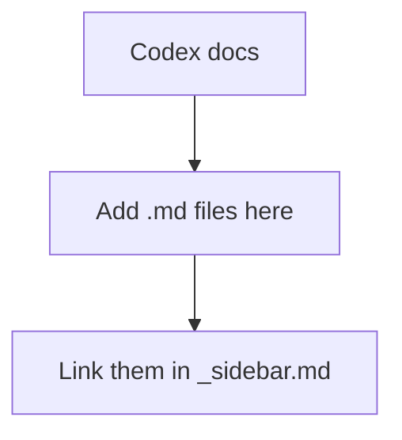

# Codex

Documentation for Codex. Add your Markdown files to the `docs/Codex/` folder and list them in [`_sidebar.md`](../_sidebar.md).

> [!TIP]
> Delete this placeholder once you've uploaded your own pages.
