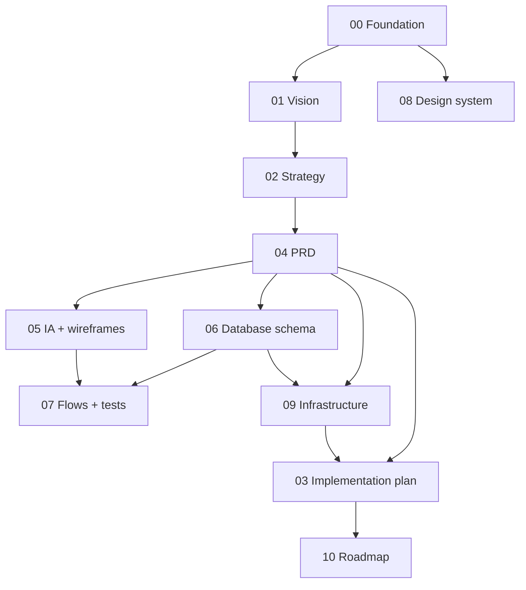

# 00 — Foundation (Combined)

> **Purpose:** the canonical decision registry for the Aeroskill Club platform, **Combined edition** — a synthesis of the three independent spec suites in this repository (Opus, Fable, Codex), taking the deepest treatment of every topic while staying strictly on the original brief. Every other Combined document inherits the names, prices, stack, roles, vocabularies, and conventions locked here. When any document conflicts with this one, **this one wins**.

---

## 0. What "Combined" is, and the merge rules

Three complete suites were written independently for the same platform; a July 2026 cross-review profiled them (see the site home page). Combined synthesizes them under explicit precedence rules:

1. **The brief is law.** Three paid tiers at **3000 / 4500 / 6000 RON/year**; public website (mission, tier benefits, sponsors); member portal (profile, subscription, payment, member card); admin CRM (members, flight schools, associations, aerodromes, sponsors, benefits, contracts, communication, fleet); general-aviation focus; built by one developer with Claude Code. Anything a source suite added beyond this scope is adopted only if it deepens the brief, never if it widens it.
2. **Verified beats plausible.** Where suites disagree on facts, the researched-and-cited value wins (Fable's evidence table, §10, extended here with anchors verified from Opus).
3. **Deepest craft wins the format.** Requirement style, edge-case treatment, wireframes, matrices — take the strongest technique from whichever suite has it.

**Provenance map (what Combined takes from where):**

| Source | Adopted into Combined |
|--------|----------------------|
| **Fable** | The locked canon: brief-fit tiers & prices, statuses, glossary, ID formats, stack (Next.js 16 / Supabase / Stripe + bank transfer), i18n, GDPR/e-Factura/EAA posture, benefit-economics rule, logo-derived palette, 53-source research base |
| **Opus** | Specification craft: Given/When/Then acceptance criteria, per-flow edge-case tables, measured contrast matrix, richer enum/constraint engineering, price-psychology anchors (ACR dues, INS net wage — verified), aviation-licensing depth (member licenses; the SAUM-vs-AACR ULM authority rule) |
| **Codex** | Breadth artifacts: ASCII wireframes for key screens, the error/recovery matrix, the test-scenario catalog, deletion/archive policy table, index catalog |
| **Rejected** | Opus's free tier + 490/1.490 RON pricing + 4.990 lifetime (contradicts the brief); Opus's bookings/events/news scope (out of brief; stays in the backlog); Codex's "configurable prices, decide later" posture (the brief decides); monthly billing (annual dues only in v1) |

Each Combined document notes its own primary sources in one line; the full defense of every decision lives here and in §10.

---

## 1. The Combined suite

| # | Document | What it covers |
|---|----------|----------------|
| 00 | `00-foundation.md` | The canonical decisions everything else inherits — read first |
| 01 | `01-product-vision.md` | Why we exist, who we serve, what success looks like |
| 02 | `02-product-strategy.md` | Positioning, tier & sponsor strategy, monetization, GTM, risks |
| 03 | `03-implementation-plan.md` | Build philosophy, scope slices, milestones, solo Claude Code workflow |
| 04 | `04-prd.md` | Requirements per surface — IDs, MoSCoW, Given/When/Then acceptance criteria |
| 05 | `05-information-architecture.md` | Sitemap, navigation, URL/i18n, RBAC map, key-screen wireframes |
| 06 | `06-database-schema.md` | Entities, columns, relationships, ERD, indexes, RLS policies |
| 07 | `07-user-flows.md` | Step-by-step flows + edge-case tables, error/recovery matrix, test catalog |
| 08 | `08-design-system.md` | Logo-driven brand, tokens, contrast matrix, components, member card |
| 09 | `09-technical-infrastructure.md` | Stack, services, environments, security/GDPR, deployment |
| 10 | `10-roadmap.md` | Sequenced solo Claude Code build roadmap, phase by phase |

Writing order (dependency order): 00 → 01/02/08 → 04 → 05/06 → 07/09 → 03/10.

---

## 2. Club identity & legal shape

| Fact | Decision |
|------|----------|
| Name | **Aeroskill Club** — two words, "Club" capitalized. Internal identifier prefix: **ASC** |
| Logo | Delivered: monochrome deep-navy lockup — "AEROSKILL ✈ CLUB" with an aircraft silhouette between the words. Brand navy anchored from its ink (≈ `#1C3355`); usage rules and palette in 08 |
| Legal form | Romanian non-profit association (*asociație*), OG 26/2000. Membership fees are annual dues (*cotizație anuală*) |
| Focus | **General aviation**: student pilots, PPL/LAPL holders, aviation enthusiasts. Not airline/commercial aviation |
| Market | Romania. Romanian-first; English secondary |
| Jurisdiction | EU — GDPR in full; supervisory authority **ANSPDCP** |
| Fiscal note | The platform issues payment confirmations, never fiscal invoices. See the e-Factura boundary below |

**OG 26/2000 constraints (researched):**

- Dues are set by the **general assembly** and must be **equal within a member category** → the three tiers exist legally as **statutory member categories** (Cadet/Pilot/Captain in the statute); price changes need a general-assembly decision (02 §7's 60-day notice).
- The association must keep a **member register**; the `members` table is its operational form — data quality is a legal duty.
- Voting rights follow the statute, never the tier: Captain buys benefits, not votes.

**e-Factura boundary (researched, locked):** RO e-Factura is mandatory B2C since 2025-01-01 and for NGOs with economic activity since 2025-07-01. Member *cotizații* are dues, not invoiceable supplies — outside e-Factura. **Sponsorship/service invoices to companies are B2B e-Factura documents issued by the club's accountant via ANAF SPV, entirely outside the platform.**

---

## 3. Locked product decisions

### 3.1 Membership tiers (per brief — locked)

| Tier (canonical) | Romanian UI | English UI | Price / year | One-line promise |
|------------------|-------------|------------|--------------|------------------|
| **Cadet** | Cadet | Cadet | **3000 RON** | Join the community: member card, base partner discounts, events, newsletter |
| **Pilot** | Pilot | Pilot | **4500 RON** | Fly more for less: enhanced discounts, fleet preferential rates, priority events, 2 guest passes/year |
| **Captain** | Căpitan | Captain | **6000 RON** | The full club experience: top discounts, first fleet access, all events included, 4 guest passes/year, concierge support |

Ranked Cadet (1) < Pilot (2) < Captain (3); a benefit's *minimum tier* extends upward. Tiers mirror statutory member categories (§2). **No free tier, no monthly billing, no lifetime membership in v1** — Opus's alternative model (free Cadet / 490 / 1.490 / 4.990 lifetime) was reviewed and rejected as off-brief; its *anchoring logic* is kept below.

**Price context (researched, anchors verified July 2026):** 3000 RON ≈ €600 ≈ four wet rental hours (€120–145/h at Romanian schools) and ~7% of a PPL(A) course (€8,000–10,000). Reference anchors Romanians already know: **ACR (Automobil Clubul Român) dues are 200–250 RON/yr** — Aeroskill is deliberately an order above the "roadside club" price point because it sells contracted purchasing power, not assistance; the **INS average net wage was ~5,900 RON/mo (Dec 2025)**, putting Cadet at ~half a monthly net wage per year. At 6–10× advocacy-association dues (AOPA US: $59–179/yr), the public site must lead with break-even math (02 §3).

### 3.2 Membership year model

- **Anniversary-based**: `ends_on = starts_on + 1 year − 1 day`. No calendar-year proration.
- **Renewal window** opens 30 days before expiry; renewal is **member-initiated** (card or bank transfer — no auto-charge in v1).
- **Grace period**: 30 days post-expiry with full access and valid card; then `expired` and the card verifies invalid.
- **Reminders**: T−30, T−7, T0, T+14, final lapse notice T+30.
- Renewal during grace starts the new year **from the previous expiry date** — no gap, no punishment.

### 3.3 Upgrades & downgrades

- **Upgrade**: any time, immediate; pro-rated price difference by remaining days, rounded up to whole RON.
- **Downgrade**: at renewal only. Dues non-refundable except legal obligation.

### 3.4 Sponsor program

| Package | Guide price / year | Headline deliverables |
|---------|--------------------|----------------------|
| **Bronze** | 10,000 RON | Logo + link on public sponsors page |
| **Silver** | 25,000 RON | Bronze + logo on member communications, 1 campaign mention/year |
| **Gold** | 50,000 RON | Silver + homepage placement, event presence, 2 campaign mentions/year |

Guide prices negotiable ±20% per contract; beyond that needs `admin` sign-off. Public visibility requires an `active` sponsorship contract **and** `visible_on_site = true`.

### 3.5 Founding-member offer (locked)

First **50** approved members: permanent "Founding member" badge + **2-year price lock** at joining price. No percentage discounts anywhere — price integrity is policy.

---

## 4. Locked platform decisions

### 4.1 The three surfaces

1. **Public website** — mission, tier comparison, sponsors, fleet showcase, contact, join.
2. **Member portal** — profile, membership & payments, digital member card, benefits catalog, communication preferences, GDPR self-service.
3. **Admin CRM** — members, flight schools, associations, aerodromes, sponsors, benefits, contracts, communication, fleet, users, audit.

One **Next.js application** (route groups), one deployment.

### 4.2 Stack (locked)

| Layer | Choice | Why (solo + Claude Code) |
|-------|--------|--------------------------|
| Framework | **Next.js 16** (App Router, TypeScript, Server Actions; LTS since 2025-10, Turbopack, route gating via `proxy.ts`) | One framework, three surfaces; first-class Vercel deploys |
| Database | **Supabase Postgres** + **RLS** (deny-by-default; role via JWT claim from a custom access-token auth hook) | Managed Postgres/auth/storage in one; RLS as authorization backstop |
| Auth | **Supabase Auth** — email + password, confirmation, reset | No extra service; JWT integrates with RLS |
| Styling | **Tailwind CSS 4 + shadcn/ui** | Token-driven; components live in-repo |
| i18n | **next-intl** | `ro` default at root, `/en` prefix; English path segments; admin CRM ro-only |
| Email | **Resend** + react-email | One provider for transactional and campaigns |
| Payments | **Stripe Checkout** (primary; ≈1.5% + 1 RON per EEA card, SCA inside Checkout) + **manual bank transfer** with staff reconciliation. Plan B: **Netopia** (0.99% + 0.30 RON, ~60% RO market share) only if Stripe onboarding fails | RON support; transfers are culturally expected for dues |
| Storage | **Supabase Storage** | Logos, contract PDFs, aircraft photos, avatars |
| Hosting | **Vercel** | Zero-ops deploys, previews, cron |
| Analytics | **Plausible** (EU, cookieless) | No consent banner needed |
| Validation | **Zod** at every boundary | Single idiom |

### 4.3 Payment mechanics (locked)

- Card: Stripe Checkout per purchase/renewal/upgrade; confirmation **only** via signature-verified webhook, idempotent via a `stripe_events` ledger.
- Bank transfer: club IBAN + unique **payment reference code `ASC-P-NNNNN`** per payment (member numbers don't exist before first activation); staff match and confirm in the CRM.
- All amounts **whole RON** (integer); single currency in v1.

### 4.4 i18n (locked)

Locales `ro` (default, no prefix) and `en` (`/en` prefix); English URL segments in both; bilingual content columns (`*_ro`/`*_en`); admin CRM Romanian-only in v1.

---

## 5. Roles & access (locked)

| Role | Stored | Scope |
|------|--------|-------|
| *visitor* | not a DB role | Public site + card verification |
| **`member`** | `profiles.role` | Portal, own data only |
| **`staff`** | `profiles.role` | Admin CRM: entity management, manual payment confirmation, campaigns |
| **`admin`** | `profiles.role` | Staff scope + user management, club settings, audit log, GDPR erasure |

Single role per profile. Role rides in the JWT (auth hook); demotion revokes sessions server-side. Partners verifying cards are anonymous visitors.

---

## 6. Canonical domain glossary

Tables are **snake_case, plural**.

| Entity (EN) | Romanian UI | Table |
|-------------|-------------|-------|
| Profile | Profil | `profiles` |
| Member | Membru | `members` |
| Member license *(adopted from Opus — P1 depth)* | Licență | `member_licenses` |
| Tier | Nivel de membru | `tiers` |
| Membership | Abonament | `memberships` |
| Payment | Plată | `payments` |
| Member card | Card de membru | `member_cards` |
| Flight school | Școală de zbor | `flight_schools` |
| Association | Asociație parteneră | `associations` |
| Aerodrome | Aerodrom | `aerodromes` |
| Sponsor | Sponsor | `sponsors` |
| Contract | Contract | `contracts` |
| Benefit | Beneficiu | `benefits` |
| Campaign | Campanie / Anunț | `campaigns` |
| Campaign send | — | `campaign_sends` |
| Email template | Șablon de email | `email_templates` |
| Aircraft | Aeronavă | `aircraft` |
| Audit log entry | Jurnal de audit | `audit_logs` |
| Consent event *(append-only history — GDPR Art. 7(1) demonstrability)* | Istoric consimțământ | `consent_events` |
| Job run *(daily-cron idempotency evidence, PLT-015)* | — | `job_runs` |
| Club settings | Setări club | `club_settings` |

**Partner** = the four contractable counterparty types (flight school, association, aerodrome, sponsor); polymorphic references use **one-nullable-FK-per-type + CHECK(exactly one)**.

**Member licensing rule (adopted from Opus, verified domain fact):** Romanian **ULM pilot permits are issued by SAUM (within Aeroclubul României), never AACR**; Part-FCL licenses (PPL/LAPL/CPL, glider) come under AACR/EASA. `member_licenses.authority` must enforce this pairing — the UI defaults it and the CRM validates it.

**Identifier formats (locked):** member number `ASC-YYYY-NNNN` (permanent); payment reference `ASC-P-NNNNN`; card token 22-char URL-safe at `/verify/{token}`; contract number `CTR-YYYY-NNN`.

---

## 7. Conventions registry

### 7.1 Requirement IDs

`PUB-` public site · `MEM-` member portal · `ADM-` admin CRM · `PLT-` cross-cutting — zero-padded three digits, assigned once, never reused. Flows are `FLOW-NN`; test scenarios `TS-NN`.

### 7.2 Status vocabularies (locked enum values)

| Enum | Values (exact) |
|------|----------------|
| `member_status` | `pending` · `active` · `grace` · `expired` · `archived` |
| `membership_status` | `pending` · `active` · `grace` · `expired` · `cancelled` |
| `payment_method` | `card` · `bank_transfer` |
| `payment_status` | `pending` · `confirmed` · `failed` · `refunded` |
| `contract_status` | `draft` · `active` · `expired` · `terminated` |
| `contract_type` | `partnership` · `sponsorship` · `service` |
| `partner_type` | `flight_school` · `association` · `aerodrome` · `sponsor` |
| `sponsor_package` | `bronze` · `silver` · `gold` |
| `campaign_kind` | `email` · `announcement` |
| `campaign_status` | `draft` · `scheduled` · `sent` · `cancelled` |
| `aircraft_status` | `active` · `maintenance` · `retired` |
| `aircraft_ownership` | `owned` · `leased` · `partner` |
| `role` | `member` · `staff` · `admin` |
| `license_type` *(new)* | `ppl_a` · `lapl_a` · `cpl_a` · `glider` · `ulm` · `other` |
| `license_authority` *(new)* | `aacr` · `saum` · `foreign_easa` |

Schema-local enums (06 defines): `pilot_status`, `payment_purpose`, `send_status`.

### 7.3 Formatting

| Context | Rule |
|---------|------|
| Prices in specs | `3000 RON` |
| Prices in UI | ro `3.000 RON` · en `3,000 RON` |
| Dates in specs | ISO `2026-07-06` |
| Dates in UI | ro `DD.MM.YYYY` · en `DD MMM YYYY` |
| Times | 24-hour, Europe/Bucharest |

### 7.4 Depth-format conventions (what makes Combined "combined")

| Artifact | Required format | Origin |
|----------|-----------------|--------|
| 04 requirements | Unique ID + MoSCoW + **Given/When/Then** acceptance criteria (2–5 per requirement) | Opus |
| 04 traceability | Requirement → flow → phase matrix at the end | Opus |
| 05 wireframes | ASCII wireframes for the ~12 key screens | Codex |
| 07 flows | Numbered steps **plus a per-flow edge-case table** | Opus |
| 07 quality | Error/recovery matrix + numbered test-scenario catalog (`TS-NN`) | Codex |
| 06 schema | Column tables + index catalog + deletion/archive policy + RLS policy SQL | Codex + Fable |
| 08 color | **Measured contrast matrix** (pair, ratio, pass/fail, rule derived) | Opus |
| Every doc | ≥1 informative Mermaid diagram; sources footer where research is cited | Fable |

---

## 8. Non-negotiables

1. **GDPR**: lawful bases documented (09); member export + erasure self-service; opt-in marketing consent; processor list = 09 §3.
2. **Security**: HTTPS-only; RLS on every table; secrets in env only; signed webhooks; admin actions audit-logged; rate limits on auth/verify/contact.
3. **Accessibility**: **WCAG 2.2 AA** (EAA enforced since 2025-06-28; EN 301 549 v3.2.1 = WCAG 2.1 AA floor, v4.1.1 expected 2026; the club is likely microenterprise-exempt but builds to 2.2 AA and publishes an accessibility statement).
4. **Mobile-first**: the card lives on a phone.
5. **Performance**: public LCP < 2.5 s mid-range mobile; portal interactive < 3 s.
6. **Backups**: daily, 30-day retention, restore drill before public launch.

---

## 9. Explicitly out of scope for v1

1. Native mobile apps (responsive web + add-to-home-screen).
2. Flight booking / aircraft scheduling / dispatch *(Opus specified bookings — parked here, its GiST-exclusion design noted for the backlog)*.
3. E-learning / ground-school content.
4. Forum, chat, member directory.
5. Events module with registration/ticketing (announcements cover event comms).
6. Benefit redemption tracking at partners.
7. Auto-recurring card payments / saved cards / monthly billing.
8. Fiscal invoicing integration (accountant issues sponsor invoices via ANAF SPV).
9. Multi-club / white-label.
10. Sponsor self-service portal.
11. Free/trial tier and lifetime membership *(evaluated via Opus, rejected — see §0)*.

---

## 10. Research basis

Inherited from Fable (verified July 2026) and extended with the anchors adopted from Opus, which were independently verified during the cross-review:

| Fact | Basis |
|------|-------|
| PPL(A) in Romania €8,000–10,000; hour building €120–145/h wet | [Aviation Academy](https://aviationacademy.ro/tarife-cursuri-personal-navigant/), [Cruiser Aviation](https://cruiseraviation.com/ro/articole/cat-costa-scoala-de-zbor), [Zbor cu Avionul](https://zborcuavionul.ro/scoala-de-zbor/) |
| Aeroclubul României: free gliding/parachuting/ultralight for ages 15–23; PPL(A) paid; territorial network | [aeroclubulromaniei.ro](https://aeroclubulromaniei.ro/page/cursuri-gratuite), [ar.ro](https://ar.ro/articol/cursuri-gratuite-2026) |
| AOPA Romania (IAOPA member since 2006) — advocacy body | [aopa.ro](https://www.aopa.ro/) |
| AOPA US dues $59–179/yr (benchmark) | [aopa.org](https://www.aopa.org/membership) |
| **ACR dues 200–250 RON/yr** (price anchor, adopted from Opus, verified) | [acr.ro](https://www.acr.ro/reduceri-importante-ale-cotizatiei-de-membru-acr.html) |
| **INS net wage ~5,914 RON/mo Dec 2025** (anchor, adopted from Opus, verified) | [news.ro / INS](https://www.news.ro/economic/ins-castigul-salarial-mediu-net-a-crecut-cu-5-3-in-decembrie-2025-la-5-914-lei-fata-de-luna-noiembrie-2025-1922402112242026020922345042) |
| e-Factura: B2C 2025-01-01; NGOs with economic activity 2025-07-01 | [mfinante.gov.ro](https://mfinante.gov.ro/en/acasa/-/asset_publisher/uwgr/content/id/11741330), [avocatnet.ro](https://www.avocatnet.ro/articol_67338/e-Factura-ONG-urile-cultele-%C8%99i-agricultorii-persoane-fizice-scap%C4%83-temporar-de-obliga%C8%9Bia-folosirii-sistemului.html) |
| OG 26/2000: dues by general assembly, equal within category; member register | [legislatie.just.ro](https://legislatie.just.ro/Public/DetaliiDocument/20740) |
| Retention: 5 years supporting docs, 10 financial statements (Law 36/2023) | [contzilla.ro](https://www.contzilla.ro/documentele-contabile-se-vor-pastra-in-arhiva-contabila-5-ani-in-loc-de-10-ani/) |
| EAA 2025-06-28; microenterprise exemption; EN 301 549 v3.2.1 → v4.1.1 (WCAG 2.2) 2026 | [accessible.org](https://accessible.org/eaa-ecommerce-services-requirements/), [levelaccess.com](https://www.levelaccess.com/blog/is-wcag-conformance-enough-for-eaa-compliance/) |
| Stripe RO ≈1.5% + 1 RON EEA cards; Netopia 0.99% + 0.30 RON, ~60% share | [stripe.com/en-ro/pricing](https://stripe.com/en-ro/pricing), [noda.live](https://noda.live/ro/articles/recenzie-netopia-payments) |
| Next.js 16 LTS (2025-10-21): Turbopack, `proxy.ts` | [nextjs.org/blog/next-16](https://nextjs.org/blog/next-16) |
| Supabase RLS: JWT custom claims, initPlan caching, indexed policy columns | [supabase.com docs](https://supabase.com/docs/guides/troubleshooting/rls-performance-and-best-practices-Z5Jjwv) |
| Real GA aerodromes: `LRCN` Clinceni, `LRPV` Strejnic, `LRTZ` Tuzla, `LRSP` Sânpetru, `LRBS` Băneasa | AACR register, [metar-taf.com](https://metar-taf.com/airport/LRCN-clinceni-airfield), [skyvector.com](https://skyvector.com/airport/LRSP/Sanpetru-Airport) |
| SAUM (not AACR) issues Romanian ULM permits | Adopted from Opus's domain research; encode as validation rule (§6) |

**Known unknowns:** no public AACR census of active PPL/LAPL holders or the GA fleet — market sizing in 01/02 is flagged assumption with a validation plan, never presented as statistics.
