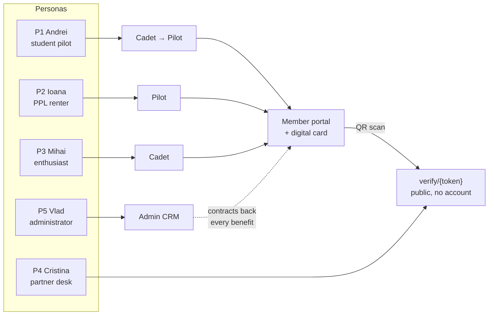

# 01 — Product Vision

> **Purpose:** why Aeroskill Club exists, who it serves, and what success looks like — **Combined edition**: Fable's verified, brief-fit vision as the skeleton, deepened with Opus's problem framing and persona craft and Codex's audience breadth, all under the locked canon of `00-foundation.md`. Everything measurable here is restated (not re-decided) by 02.

---

## 1. Mission

**Aeroskill Club exists to make general aviation in Romania more accessible, more affordable, and less lonely — by pooling the buying power and community of pilots and enthusiasts into one club that partners with the flight schools, aerodromes, and associations they already use.**

One-line version (website hero):

> **Zbori mai mult. Plătești mai puțin. Aparții.** / *Fly more. Pay less. Belong.*

The mission names the three things a member can feel: a **card that proves** (live-verifiable membership that partners honor at the desk), **benefits that pay back** (contracted discounts that recoup the dues — 02 §3), and a **community that welcomes** (across schools and aerodromes, not inside one). All three belong to every tier: Cadet, Pilot, and Captain differ in depth of service, never in basic belonging (00 §3.1).

## 2. The problem

General aviation in Romania is alive but fragmented — and expensive. The numbers are researched, not guessed (00 §10):

1. **Cost is the #1 dropout reason.** A PPL(A) at a Romanian school costs **€8,000–10,000** (~40,000–50,000 RON: €8,305 on a Tecnam P2008, €9,965 on a Cessna 172 at published price lists) and staying current afterwards costs **€120–145 per wet rental hour**. Students abandon licenses mid-way and licensed pilots fly too few hours to stay proficient. Nobody negotiates on their behalf — every pilot pays rack rate at every school and aerodrome.
2. **The pipeline has a cliff.** The state Aeroclubul României gives youth aged 15–23 **free** gliding, parachuting, and ultralight training across ~11 territorial aeroclubs — then the subsidy ends. At 24, a freshly hooked aviator faces full PPL prices with zero collective buying power. That cliff is exactly where a buying club belongs.
3. **The community is invisible — and identity doesn't travel.** GA life happens in scattered WhatsApp and Facebook groups tied to individual schools. A pilot who trains at one aerodrome, rents at a second, and spends weekends at a third has no single home that recognizes them — their identity, history, and standing stay locked inside each provider. AOPA Romania (IAOPA member since 2006) does valuable *advocacy*, but no one plays the neutral, benefits-first home that connects pilots *across* schools and aerodromes.
4. **Benefits exist only by word of mouth — so partners lack a channel.** Where discounts and goodwill deals exist today, they are informal, unwritten, and invisible: value goes unclaimed by members, and flight schools, aerodromes, and aviation businesses get no measurable reach in return. Sponsorships are handshake deals with no deliverables.
5. **Clubs run on spreadsheets.** Where associations exist, membership, dues, contracts, and communication are managed manually, so renewals lapse silently and partner deals expire unnoticed.

Aeroskill Club answers all five with one platform — one Next.js application, three surfaces (00 §4.1), operated by a single administrator:

| Surface | Audience | The job it does |
|---------|----------|-----------------|
| **Public website** | Visitors, prospects, partner desks | Sell the promise: mission, tier comparison with break-even math, sponsors, fleet showcase, join |
| **Member portal** | Authenticated members | Deliver the promise: profile, membership & payments, the digital member card, benefits catalog, GDPR self-service |
| **Admin CRM** | The administrator (`staff`/`admin`) | Keep the machine running: members, partners, contracts, benefits, campaigns, fleet — with alerts doing the remembering |

### Why now

Four conditions make this the right moment, none speculative:

1. **The membership pattern is already proven in Romania.** ACR (Automobil Clubul Român) collects **200–250 RON/yr** from drivers for a card, assistance, and discounts — the annual-dues-for-tangible-benefits habit exists; aviation simply has no equivalent. Aeroskill ports that trusted pattern to a hobby where the recoverable spend is an order of magnitude larger (€120–145 per flying hour).
2. **The pipeline keeps producing the member.** Every year the Aeroclubul României free-course program graduates young aviators straight into the age-24 cost cliff — a recurring cohort for whom collective buying power is immediately rational.
3. **One person can now build it well.** The locked low-ops stack (00 §4.2) plus Claude Code makes a rigorous, bilingual, secure three-surface platform deliverable by a single developer — the club does not need to hire to exist.
4. **The modern, bilingual position is unoccupied.** Incumbent GA institutions are Romanian-only and institutional in tone; no player offers a current, English-capable membership surface for Romanian GA (02 §1).

### Market reality (honest sizing)

There is **no public AACR census** of active PPL/LAPL holders or of the Romanian GA fleet (the authority publishes airline statistics — 19 carriers, 66 aircraft in 2023 — but not GA licensing counts). Sizing below is therefore a **structured assumption, never a statistic**:

| Segment | Working assumption | Why we believe it exists |
|---------|-------------------|--------------------------|
| Active PPL/LAPL holders | Low thousands nationally | Schools' published price lists and fleets imply an active training/rental market; no census exists |
| ULM pilots (SAUM-licensed) | Comparable order to PPL | ULM permits are issued by SAUM within Aeroclubul României (00 §6) — a cheaper, active entry path |
| Students in training at ATOs/DTOs | Hundreds per year, flowing | Schools know their exact enrollment — the most verifiable segment |
| Aeroclubul României alumni | Steady yearly outflow | The free-course program (ages 15–23, ~11 territorial aeroclubs) is documented; alumni counts are not |
| Enthusiasts (unlicensed) | Larger than all pilot segments; cheap to reach | Spotter, photography, and sim communities congregate visibly online |

The cross-review's bottom-up estimate of a **~5,000–8,000-person serviceable audience** (pilots plus serious enthusiasts) is carried as a *planning assumption only* — unverified. What matters is that the Year-1 target of 120 members (§5) deliberately requires only a sliver of any plausible market size. **Validation plan:** request aggregate licensing counts from AACR, and instrument the partner-school channel (02 §6) — schools know exactly how many students they enroll per year, which grounds the Cadet funnel within the first quarter of operation.

## 3. Who we serve

Five personas anchor every requirement in 04. How they map to tiers and surfaces:

### P1 — Andrei, the student pilot (28, Bucharest)
Mid-way through a €9,000 PPL(A) at a DTO flying Tecnam P2008s from Clinceni (`LRCN`). Burning savings; every hour matters — and he is quietly asking himself *"am I even cut out for this?"*
- **Goals:** finish the license without going broke; meet pilots beyond his school.
- **Frustrations:** rack-rate pricing; no visibility into deals; feels like a customer, not a peer.
- **Platform must:** show him concretely how a **Cadet** (3000 RON) membership pays for itself — a contracted 10% discount on the remainder of his training package alone can exceed the dues (02 §3) — and give him a card he can show at the school desk.
- **Converts when:** licensed members treat him as a future colleague, not a tourist — and the discount math is visible before he pays.

### P2 — Ioana, the licensed pilot (41, Cluj)
PPL holder, ~40 hours/year in rented aircraft at €135–145/h wet (≈ €5,500/year of flying), cross-country with friends.
- **Goals:** fly more hours for the same budget; preferential access to well-maintained aircraft.
- **Frustrations:** rental availability and cost; benefits scattered and undocumented.
- **Platform must:** make **Pilot** (4500 RON) obviously worth it — enhanced rental discounts, fleet preferential rates, waived landing fees at partner aerodromes, priority event access — with the break-even math visible in one benefits catalog (02 §3).
- **Converts when:** the first partner aerodrome honors her digital card and the discount is real — no explanation needed at the desk.

### P3 — Mihai, the enthusiast (35, Brașov)
Aviation photographer and sim pilot; not licensed (yet). Hangs around Sânpetru (`LRSP`) on weekends. Aged out of the Aeroclubul României free-course window years ago.
- **Goals:** belong to the scene; aerodrome access moments; a realistic path toward the license.
- **Frustrations:** GA feels closed to outsiders.
- **Platform must:** make **Cadet** a legitimate enthusiast membership, not a lesser pilot one; events and community first — and when he's ready, the training discount is his on-ramp.
- **Converts when:** he sees the club explicitly designs for the non-pilot — enthusiasts are members, never second-class guests.

### P4 — Cristina, the partner contact (38, flight school operations manager)
Runs day-to-day ops at a partner school operating from Ploiești-Strejnic (`LRPV`). She stands in for the whole partner-desk class: school front desks, aerodrome offices, sponsor marketing contacts.
- **Goals:** predictable student inflow; honor club discounts without friction or fraud.
- **Frustrations:** can't tell who is actually a member in good standing; partnership value is invisible at renewal time.
- **Platform must:** let her verify a member card in **under 10 seconds** by scanning its QR — no account, no phone call (route `/verify/{token}`) — and let the club show her, at contract renewal, exactly what was delivered.
- **Converts when:** renewal is one decision backed by evidence, not a renegotiation from zero.

### P5 — Vlad, the club administrator (founder, `admin` role)
Runs the club solo, alongside the developer building this platform with Claude Code.
- **Goals:** grow membership without drowning in ops; never let a contract or renewal lapse silently.
- **Frustrations:** spreadsheets, manual reconciliation, ad-hoc email.
- **Platform must:** one CRM for members, partners, contracts, benefits, campaigns, and fleet — with alerts doing the remembering.
- **Converts when:** the whole club runs in ≤ 5 hours/week and nothing expires unnoticed (§5).

### Secondary audiences (breadth, not personas)

Three further groups shape requirements without owning them (see 04):

- **Aircraft owners and instructors** — natural **Captain** candidates who spend tens of thousands of RON/yr on flying; they respond to recognition, first fleet access, and being treated as patrons and peer-leaders — not to discount arithmetic (§4).
- **Visiting and English-speaking pilots** — served entirely by the `/en` surface (00 §4.4); a credibility and reach argument, not a v1 revenue segment.
- **The wider partner cast** — beyond schools and aerodromes: maintenance shops, fuel providers, insurance brokers, equipment retailers. They enter the platform as sponsors or contract partners (02 §4), never as member tiers.

## 4. Value proposition by tier

| Persona | Natural tier | The trade they're making (grounded in real prices) |
|---------|-------------|--------------------------|
| Mihai (enthusiast) | **Cadet** — 3000 RON | Belonging + base discounts + events for the price of ~4 rental hours |
| Andrei (student) | **Cadet → Pilot** | A contracted 10% training-package discount (€800–1,000 on a full PPL) exceeds the dues on its own; upgrade when licensed |
| Ioana (active pilot) | **Pilot** — 4500 RON | Rental discounts + waived landing fees + fleet preferential rates target break-even at ~20 flying hours/year — half her actual usage (02 §3) |
| Owners, instructors, patrons | **Captain** — 6000 RON | Everything, first, everywhere — top discounts, first fleet access, all events, 4 guest passes — plus visible recognition as a patron of Romanian GA; against tens of thousands of RON/yr of flying spend, the dues are noise |

The tier ladder is a commitment ladder, not a paywall ladder: every member gets a card, the community, and real benefits; higher tiers deepen the same promise (per `00-foundation.md` §3.1).

## 5. What success looks like

### North-star metric

**Active members** (members with status `active`) — the single number that proves the promise is worth paying for, year after year.

The metric resists vanity only when paired with its co-metric, **renewal rate**: a signup is cheap, but a renewal after a year of actually using the card and the discounts is proof the loop closed. v1 deliberately tracks no benefit-redemption telemetry (out of scope, 00 §9), so renewal is the honest, measurable proxy for value delivered.

### Targets

| Metric | Year 1 | Year 2 | Year 3 |
|--------|--------|--------|--------|
| Active members | **120** | **250** | **450** |
| — Cadet / Pilot / Captain mix | 80 / 30 / 10 | 150 / 70 / 30 | 260 / 130 / 60 |
| Membership revenue (RON) | 435,000 | 945,000 | 1,725,000 |
| Renewal rate | — (first cohort) | ≥ 70% | ≥ 80% |
| Active sponsors | 4 | 8 | 12 |
| Sponsor revenue (RON) | 60,000 | 150,000 | 300,000 |
| Partner flight schools | 5 | 10 | 15 |
| Partner aerodromes | 4 | 8 | 12 |

(Revenue = tier mix × locked prices from `00-foundation.md`; scenario spreads and sensitivity in 02 §5.)

### The three-year arc

The targets read as a story (sequencing detail lives in 03 and 10):

- **Year 1 — Establish: be real, be credible.** 120 members, 5 schools, 4 aerodromes, 4 sponsors. Ship all three surfaces, sign the founding cohort, and back every public benefit with a contract. The goal isn't scale — it's that the GA community looks at the club and says *"this is serious."*
- **Year 2 — Deepen: be worth renewing.** 250 members and the first renewal season (≥ 70%). The flywheel (02 §1) starts spinning under its own power: more members → better contracts → richer benefits → renewals. Retention becomes the scoreboard.
- **Year 3 — Compound: be the club.** 450 members, ≥ 80% renewal, 12 sponsors. "Aeroskill" becomes shorthand for GA membership in Romania: partners renew on evidence, and the card is the expected object at every partner desk.

### Qualitative outcomes

- A member card that partners **ask for** rather than tolerate — the discount honored at the desk without explanation, because the desk expects the card.
- An English-speaking visiting pilot navigates the entire site in `/en` without hitting a Romanian-only wall — and a Romanian member never feels the product was translated *at* them.
- Zero contracts or memberships lapsing *unnoticed* (alerts fired, decisions made).
- The club administrator runs everything in ≤ 5 hours/week inside the CRM.
- Members introduce themselves at aerodromes as "Aeroskill" before naming their school — and the people around the table know exactly what that means.

## 6. Guiding principles

Later documents cite these by name:

1. **Members first, always.** Every feature must make membership more valuable or easier to keep. Sponsor and partner features exist to fund and deepen member value.
2. **Every benefit is backed by a contract.** Nothing is promised publicly that isn't secured in the CRM (`contracts` → `benefits`).
3. **The card is the product.** The digital member card is the daily, physical-world proof of membership — it gets design priority (08) and a public verification route (05).
4. **Romanian-first, bilingual always.** Default `ro`, full `en` parity on public and member surfaces (00 §4.4). Romanian copy is native-written, never machine-translated, and layouts are designed for the longer Romanian string.
5. **Boring technology, exciting flying.** One app, few services, managed everything (00 §4.2). Excitement belongs at the aerodrome, not in the stack.
6. **Privacy is a feature.** GDPR self-service, cookieless analytics, no data ever sold or shared beyond the processor list (09).
7. **Ship vertical slices.** Every increment is demoable end-to-end (03).
8. **Credible to real pilots.** Correct vocabulary (PPL(A), LAPL, ULM, aerodrome — never "airport" for a strip), the right authorities (AACR for Part-FCL licenses, **SAUM — not AACR — for ULM permits**, per 00 §6), and real aerodromes (`LRCN`, `LRPV`, `LRSP`) in every example. No toy aviation.
9. **A layer, not a competitor.** We partner with schools, aeroclubs, and aerodromes; we never train, examine, or sell flight hours. Dues are never flying spend — fleet benefits are preferential *rates*, not bundled hours. Aeroclubul României and AOPA Romania are counterparts to work with, never targets.

## 7. Non-goals (vision guardrails)

Naming what we are **not** keeps the vision buildable by one person and credible to real pilots (full out-of-scope list: 00 §9):

| Non-goal | Why it's out |
|----------|--------------|
| Not a flight school / ATO / DTO | We don't train, examine, or certify — we negotiate on behalf of members with those who do |
| Not a competitor to Aeroclubul României or AOPA Romania | The state aeroclub and the advocacy body are partners; we occupy the neutral benefits-club position beside them |
| Not selling flight time | Dues ≠ flying spend; fleet benefits are preferential rates, never bundled hours; no booking/dispatch in v1 |
| Not a free or monthly club | Three paid annual tiers only (00 §3.1) — no free tier, no monthly billing, no lifetime membership |
| Not a generic CRM | Every entity is shaped to Romanian GA — real aerodromes, the AACR/SAUM licensing rule (00 §6), *cotizație* semantics |
| Not an events/booking/e-learning platform (yet) | Announcements cover event comms in v1; the rest lives in the backlog (00 §9) |

---

*Sources for the researched figures in this document: Romanian school price lists ([Aviation Academy](https://aviationacademy.ro/tarife-cursuri-personal-navigant/), [Cruiser Aviation](https://cruiseraviation.com/ro/articole/cat-costa-scoala-de-zbor), [Zbor cu Avionul](https://zborcuavionul.ro/scoala-de-zbor/)), [Aeroclubul României free-course program](https://aeroclubulromaniei.ro/page/cursuri-gratuite), [AOPA Romania](https://www.aopa.ro/), [ACR membership dues](https://www.acr.ro/reduceri-importante-ale-cotizatiei-de-membru-acr.html). Full research basis: 00 §10. Market-sizing rows in §2 are flagged assumptions, not sourced statistics.*
