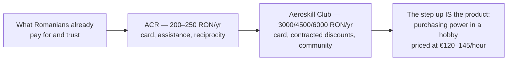
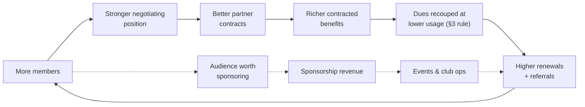

# 02 — Product Strategy

> **Purpose:** how Aeroskill Club wins — positioning, tier & sponsor strategy, monetization, go-to-market, and risks — **Combined edition**: Fable's verified strategy as the skeleton, with Opus's anchor-based positioning, pricing psychology, and sensitivity discipline converted to the locked 3000/4500/6000 model, and Codex's partner breadth. Inherits `00-foundation.md` (all prices, tier names, policies) and 01 (personas, targets).

---

## 1. Positioning

**For** Romanian general-aviation pilots, students, and enthusiasts **who** pay rack rate everywhere and belong nowhere, **Aeroskill Club** is a national GA membership club **that** converts annual dues into negotiated partner benefits, a verifiable member card, and a real community — **unlike** school-bound loyalty schemes or informal groups, it is neutral across schools and aerodromes, a layer on top of the existing flying infrastructure rather than a competitor to any part of it, and every promised benefit is secured by a signed contract.

### 1.1 The anchor ladder: "ACR for pilots" — at aviation prices

The clearest mental model for a Romanian audience is one they already trust: **ACR (Automobil Clubul Român)**. Romanians happily pay **200–250 RON/yr** for a serious club that gives them a card, assistance, and discounts — the annual-dues-for-tangible-benefits pattern is culturally proven; aviation simply has no equivalent. Aeroskill borrows the frame and lifts it into aviation:

Two verified anchors calibrate the ladder honestly (00 §10):

- **ACR dues (200–250 RON/yr)** set the *pattern*, not the price. Aeroskill is deliberately **12–24× above** the roadside-club price point, because it sells contracted purchasing power against €120–145/h flying costs, not assistance. The gap is only defensible while §3's break-even math holds — which is why that math is a binding contracting rule, not marketing copy.
- **The INS average net wage (~5,914 RON/mo, Dec 2025)** frames affordability: Cadet costs about half a monthly net wage per year; Captain about one. For an audience already spending €5,000+/yr on flying (01 P2), that is a rational hobby-adjacent expense — but only if the recoup story is explicit.

### 1.2 Alternatives landscape (researched — real organizations)

| Alternative | Who / what it is | What it offers | Our wedge |
|-------------|------------------|----------------|-----------|
| Doing nothing | The default | Rack rates, no community | Show the math: benefits recoup dues (§3) |
| **AOPA Romania** | Advocacy association, IAOPA member since 2006 ([aopa.ro](https://www.aopa.ro/)) | Representation, safety education ("Educație, nu legislație") | We are complementary, not competitive: they lobby, we negotiate discounts. Dual membership is natural — pursue a partnership contract, not a rivalry |
| **Aeroclubul României** | State aeroclub, ~11 territorial branches; **free** gliding/parachuting/ultralight courses for ages 15–23 | Subsidized entry into airsports; PPL(A) at cost | We start where the subsidy stops: their alumni hit full GA prices at 24 — the exact moment Cadet membership becomes rational (01 §2) |
| **BGAA** | Business & General Aviation Association ([bgaa.ro](https://bgaa.ro/)) | Industry / B2B voice for business and general aviation | It represents the industry side; it is not a member-pilot benefits club and runs no consumer membership surface |
| Facebook/WhatsApp groups | Informal school- and aerodrome-centric groups | Chatter, occasional tips | Structure: verified membership, contracted benefits, curated comms |
| Single flight-school loyalty | e.g. house discounts at private schools such as the Tuzla (`LRTZ`) operation | Discounts at one school | Neutrality: benefits across many schools + aerodromes; portable card |

The whitespace, read across the table: **modern + bilingual + tangible-benefits** is empty space in Romanian GA. The incumbents are either advocacy-first (AOPA Romania, BGAA), state-institutional (Aeroclubul României), or informal (groups) — no named player occupies the neutral buying-club position today.

Our defensible asset is the **two-sided network**: members make partner contracts worth signing; contracted benefits make membership worth renewing.

*The flywheel the whole platform exists to spin: solid arrows = membership loop, dotted = sponsor loop feeding it.*

### 1.3 Pricing benchmark (researched)

Membership organizations pilots already know charge an order of magnitude less than our tiers — because they sell *representation* or *assistance*, not *purchasing power*:

| Organization | Annual dues | What dues buy |
|--------------|-------------|---------------|
| ACR (non-aviation anchor) | 200–250 RON | Card, roadside assistance, discounts, reciprocity |
| AOPA US | $59 / $99 / $179 (~300–900 RON) | Advocacy, media, helplines |
| AOPA Romania | Not publicly listed | Advocacy, community |
| **Aeroskill Club** | **3000 / 4500 / 6000 RON** | **Contracted discounts + card + community** |

The conclusion is a strategic constraint, not a vanity claim: at 6–10× advocacy-level dues and 12–24× the ACR anchor, **the public site must lead with break-even math** (§3), and every tier's contracted benefit pool must clear its dues at realistic usage — otherwise renewals (§5) collapse in Year 2.

## 2. Tier strategy

Three tiers (Cadet 3000 / Pilot 4500 / Captain 6000 RON — locked, 00 §3.1) form a commitment ladder built as good / better / best: one shared core (card, community, base discounts, events, newsletter) with differentiation by **depth of service, never by withholding basic belonging**.

- **Why three:** one price excludes either enthusiasts or patrons; four+ splinters benefit negotiation. Three maps cleanly to the personas: enthusiast/student → Cadet, active pilot → Pilot, owner/instructor/patron → Captain. Legally, the three tiers are statutory member categories with general-assembly-set dues (00 §2) — a fourth tier would also mean a statute amendment.
- **Price psychology (grounded in verified anchors):**
  - **Cadet 3000 RON** (~€600) ≈ four wet rental hours — small against a €8,000–10,000 (~40,000–50,000 RON) license, recouped outright by a single contracted training-package discount (§3), and about half an average monthly net wage (INS ~5,914 RON/mo, Dec 2025) for a full year of membership.
  - **Pilot 4500 RON** is a 1.5× step justified for pilots who actually fly: the enhanced-discount pool targets break-even at roughly half of a typical renter's annual hours (§3).
  - **Captain 6000 RON** is deliberately compressed — 2× Cadet, only 1.33× Pilot. It works as a top anchor in the classic sense: its presence makes Pilot read as the sensible middle rather than the expensive option, while Captain itself is positioned as "everything, first, everywhere," priced as patronage rather than luxury.
  - **Monthly-equivalent framing** (250 / 375 / 500 RON per month) appears on the public tier page as a communication device only — billing stays strictly annual (00 §3.1); no monthly plan exists.
- **Display strategy:** the public tier page flags Pilot as **"Recomandat piloților activi / Recommended for active pilots"** — a targeted flag, not a "most popular" claim, because Cadet will genuinely be the most numerous tier and the club does not decorate pages with claims its own numbers contradict.
- **Target mix:** ~67% Cadet / 25% Pilot / 8% Captain (01 §5). Cadet is the volume engine; Pilot is the margin engine; Captain is the prestige engine and funds nothing structural (never make solvency depend on Captains).
- **Upgrade path:** in-portal, immediate, pro-rated (00 §3.3). The renewal email at T−30 recommends an upgrade when the member's tier no longer matches obvious usage (post-v1 automation; manual in v1).
- **Downgrade:** at renewal only. No mid-year refunds — keeps accounting trivial for a solo operator.

## 3. Benefit ladder (what justifies each step)

Benefits are contracted per partner (`benefits.min_tier`, 06) but the *public promise* is:

| Benefit class | Cadet | Pilot | Captain |
|---------------|-------|-------|---------|
| Digital member card + verification | ✔ | ✔ | ✔ |
| Partner discounts (base level) | ✔ | ✔ | ✔ |
| Newsletter + announcements | ✔ | ✔ | ✔ |
| Club events & fly-ins | ✔ | priority registration | free entry, all events |
| Enhanced partner discounts | — | ✔ | ✔ |
| Club fleet preferential rates | — | ✔ | first access |
| Guest passes / year | — | 2 | 4 |
| Concierge support | — | — | ✔ |

Rule (from 01, principle 2): **nothing appears in this table publicly until at least one signed contract delivers it.** The public tier page renders from the same data the CRM manages.

### Benefit categories map to real GA pain

Every negotiated benefit must answer a documented cost or friction — no filler perks:

| Category (RO / EN) | The real pain | Source partner type | Depth by tier |
|--------------------|---------------|---------------------|---------------|
| Instruire / Training packages | PPL(A) costs €8,000–10,000 | Flight schools | Base % (Cadet) → enhanced (Pilot+) |
| Închiriere / Rental hours | €120–145/h wet, rack rate everywhere | Flight schools / operators | Base → enhanced → deepest |
| Taxe de aterizare / Landing & aerodrome fees | Recurring cost on every flight | Aerodromes | Reduced (Cadet) → waived at partners (Pilot+) |
| Flota clubului / Club fleet | Access to well-maintained aircraft | Club + partner fleet | — → preferential rates (Pilot) → first access (Captain) |
| Echipament & servicii / Gear & services | Headsets, charts, insurance, maintenance | Sponsors (retailers, brokers, shops, fuel providers) | Base → deeper by tier |
| Evenimente & comunitate / Events & community | Fragmented, school-bound scene | Club + partners | Access → priority → all included |

### Benefit economics (the honest break-even math)

Because dues are 6–10× advocacy-club levels (§1), every tier must clear its price at *realistic* usage. Worked profiles at researched Romanian prices (€1 ≈ 5 RON; rental €135–145/h wet; PPL package €8,000–10,000):

| Member profile | Contracted benefits used | Annual value | vs. dues |
|----------------|--------------------------|--------------|----------|
| Student (Cadet, 3000 RON) | 10% off remaining training package (€5,000 left) | ~€500 (2,500 RON) + events/newsletter | ≈ break-even on the discount alone; ahead with any event |
| New student (Cadet) | 10% off a full €9,000 PPL enrollment | ~€900 (4,500 RON) | **1.5× dues** — the killer conversion story for the school desk |
| Enthusiast (Cadet) | Events, fly-in access, shop/partner perks, community | Subjective | Sold on belonging, not arithmetic — never promise them break-even |
| Renter, 40 h/yr (Pilot, 4500 RON) | 10–15% off rentals (€14–21/h) + waived landing fees at partner aerodromes + fleet preferential rates | €560–840 rental + fees | Break-even at **~20–30 h/yr** — half to three-quarters of actual usage |
| Low-hours renter, 12 h/yr (stays **Cadet**) | 10% base rental discount (~€170 / ~850 RON) + events | Well below dues on flying alone | The honest anti-sell: below ~20 h/yr we advise Cadet, where the value rests on training discounts and belonging — an upsold member who can't recoup is a Year-2 non-renewal (§5) |
| Owner / instructor (Captain, 6000 RON) | Deepest partner and sponsor discounts + first fleet access + all events + 4 guest passes | Exceeds Pilot value | Against tens of thousands of RON/yr of flying spend, dues are noise; sold as patronage and peer-leadership — arithmetic secondary by design |

**Contracting rule derived from this table (binding for admin negotiations):** a tier's contracted benefit pool must let its *median target member* recoup dues at **≤ 50% of typical usage**. Training-package percentage discounts are the single highest-leverage benefit to negotiate first — schools give margin on a €9,000 package far more readily than on hourly rates, and one such contract makes Cadet self-evidently rational for every student in Romania. The rule's converse is equally binding: where the math doesn't clear (the 12 h/yr renter), the club recommends the *lower* tier — price integrity includes not overselling.

## 4. Sponsor strategy

Packages Bronze 10,000 / Silver 25,000 / Gold 50,000 RON per year (guide prices, locked 00 §3.4).

- **The value exchange:** Aeroskill controls something Romanian GA businesses want and cannot assemble elsewhere — a clean, opted-in, verified audience of engaged pilots and enthusiasts. Sponsors pay for reach and placement; members' attention is protected by contract-capped inventory (below).
- **Who sponsors:** avionics and pilot-supply retailers, fuel providers, insurance brokers, maintenance shops, flight schools buying visibility beyond their partnership, non-aviation premium brands reaching an affluent audience.
- **Two counterparty modes, one CRM.** The same organization can hold both contract types (00 §7.2):

| Mode | Contract type | They provide | They get |
|------|--------------|--------------|----------|
| **Benefit partner** (school, aerodrome, association) | `partnership` | Contracted member discounts / preferential terms | Member inflow, desk-level verification, visibility in the benefits catalog |
| **Sponsor** (any organization) | `sponsorship` | Cash per package | Placement: public logo (Bronze) → member-communication presence + 1 campaign mention (Silver) → homepage placement, event presence, 2 campaign mentions (Gold) |

- **CRM-backed, provable delivery:** every sponsorship is a `contract`; deliverables are tracked as contract terms; campaign mentions execute through the communication module and placement periods are dated — so at renewal the club shows exactly what was delivered, and renewal becomes one decision, not a renegotiation (01 P4).
- **Taste guardrail:** placement inventory is finite by design (one Gold homepage slot; capped campaign mentions), and benefits must map to real member pain (§3) — sponsor presence that reads as ad-spam erodes the very trust the club sells. Restraint is a feature of the Gold package, not a limitation.
- **Sourcing motion:** administrator-led. Target 1 Gold anchor early (credibility), fill Bronze from member-adjacent businesses. Sponsor logos appear only while the contract is `active` and `visible_on_site = true`.

## 5. Monetization model

Revenue = membership dues + sponsorships. Costs are structurally negligible and verified: platform ~480 RON/month (09), card fees ≈ 1.5% + 1 RON per Stripe EEA transaction (~46 RON on a Cadet payment; Netopia plan B would be 0.99% + 0.30 RON — 00 §4.3): **two Cadet memberships cover a year of infrastructure.** The real cost is administrator time — which is exactly what the CRM minimizes.

### Scenarios (RON, rounded; mix per 01 §5)

| Scenario | Y1 members / revenue | Y2 members / revenue | Y3 members / revenue |
|----------|---------------------|----------------------|----------------------|
| Conservative | 70 / 254,000 | 140 / 508,000 | 250 / 906,000 |
| **Base (targets)** | **120 / 435,000** | **250 / 945,000** | **450 / 1,725,000** |
| Stretch | 180 / 653,000 | 380 / 1,425,000 | 650 / 2,438,000 |

| Sponsor revenue | Y1 | Y2 | Y3 |
|-----------------|----|----|----|
| Conservative | 25,000 (2) | 70,000 (4) | 150,000 (7) |
| **Base** | **60,000 (4)** | **150,000 (8)** | **300,000 (12)** |
| Stretch | 110,000 (6) | 250,000 (11) | 450,000 (16) |

Break-even framing: the platform pays for itself at ~2 members; the *club* (events, negotiation time, admin stipend) is sustainable from ~60 members — below even the conservative Y1 case.

### Renewal economics

Renewal rate is the lever that dominates Y2+ (targets: ≥70% Y2, ≥80% Y3). The platform's renewal machinery — reminder sequence T−30/T−7/T0/T+14/T+30, 30-day grace, no-gap renewal during grace (00 §3.2) — exists because each retained member is worth 3625 RON/year on average versus a ~0 marginal cost to retain.

### Sensitivity: what if renewal lands at 60%?

Illustrative arithmetic on the base mix (not a new forecast):

| | Base plan (70% → 80%) | At 60% renewal, same acquisition |
|---|----------------------|----------------------------------|
| Y2 members | 250 (84 renewed + 166 new) | ~238 (72 renewed + 166 new) |
| Y2 revenue | 945,000 RON | ~900,000 RON (−45,000, −4.8%) |
| Y3 members | 450 (200 renewed + 250 new) | ~393 (143 renewed + 250 new) |
| Y3 revenue | 1,725,000 RON | ~1,506,000 RON (−219,000, −12.7%) |

Three strategic reads:

1. **Renewal compounds.** A 10-point renewal miss costs ~5% of revenue in Y2 but ~13% by Y3 — and widens every year after.
2. **Below ~65% the model becomes an acquisition treadmill:** replacing 40% of the base annually means acquisition effort must grow every year just to stand still. This is why the renewal machinery is v1 core (not polish) and why the ≤50%-of-usage contracting rule (§3) is binding — under-recouping members are exactly the ones who churn.
3. **Tripwire:** if first-cohort renewal tracks below 65% three months into the Y2 renewal season, the response is a benefit-pool review (renegotiate or add contracts until §3's rule clears for the median member of each tier) *before* any acquisition push — retention problems are value problems, not marketing problems.

## 6. Go-to-market

**Sequencing** (mirrors milestones in 03 and 10):

1. **Private alpha** — 10–15 seed members (friends of the club) join and pay real dues through the platform; 2 partner contracts signed so the benefits page is honest at launch.
2. **Founding-member launch** — the locked offer (00 §3.5): first 50 members get the founding badge + 2-year price lock. Scarcity is real (counter on the public site) and price-integrity-safe (no discount, only a lock). The visible founding cohort doubles as the partner pitch: schools and aerodromes sign faster when 50 named members already carry the card.
3. **Public launch** — full site live, ≥5 flight schools, ≥4 aerodromes, ≥2 sponsors contracted; PR push through partner channels.

**Geography:** Bucharest-first. Romanian GA density concentrates around the capital's aerodromes — Clinceni (`LRCN`), Ploiești-Strejnic (`LRPV`), Băneasa (`LRBS`) — so the first partner contracts and the founding cohort are recruited there, then coverage expands along the territorial-aeroclub map and the coast (Tuzla `LRTZ`).

**Channels, in priority order:**

1. **Partner flight schools as distribution** — the school desk recommends Cadet to every student (the school gains loyal, subsidized customers; we gain P1/Andrei at the moment of maximum motivation).
2. **Aerodrome presence** — fly-in visits, posters with QR to `/join` at partner aerodromes.
3. **Organic social** — Romanian GA Facebook groups, Instagram (aviation photography angle courts P3/Mihai).
4. **The card itself** — every desk verification (`/verify/{token}`) is a live demo in front of non-members.
5. **The English surface** — visiting and English-speaking pilots find a fully navigable `/en` site (00 §4.4); a credibility wedge no incumbent offers, worked passively rather than as a paid channel.

## 7. Pricing & discount policy

1. Tier prices are public, fixed, and identical for everyone: **3000 / 4500 / 6000 RON**. No percentage discounts, no promo codes in v1.
2. The only price mechanism is the **founding-member 2-year price lock** (00 §3.5).
3. Sponsor guide prices may be negotiated **±20%** per contract; anything beyond requires `admin` sign-off and lives in the contract record.
4. Upgrades pro-rated per 00 §3.3; downgrades at renewal only; dues non-refundable.
5. Price changes apply to *new* membership years only and require a **general-assembly decision** (tiers are statutory member categories under OG 26/2000 — 00 §2) plus **60 days' public notice**.

## 8. Risk register

| # | Risk | L | I | Mitigation |
|---|------|---|---|------------|
| R1 | Too few partner contracts at launch → benefits promise rings hollow | M | H | Gate public launch on ≥5 schools + ≥4 aerodromes signed (10); alpha proves the pitch |
| R2 | Stripe onboarding friction for a Romanian *asociație* | M | H | Bank-transfer fallback is first-class from day one (00 §4.3); Netopia as documented plan B |
| R3 | Renewal underperformance in Y2 | M | H | Renewal machinery in v1 core (not bolted on); track cohort renewal monthly in CRM dashboard; sensitivity tripwire at 65% (§5) |
| R4 | Solo-developer bus factor | M | M | The Combined docs as source of truth; boring managed stack; everything reproducible from repo + migrations (03) |
| R5 | Card fraud (screenshots, expired cards) | M | M | Verification is server-side live status at `/verify/{token}` — a screenshot can't fake the verification page (04) |
| R6 | GDPR complaint or breach | L | H | Non-negotiables (00 §8): RLS everywhere, minimal data, export/erasure self-service, processor list in 09 |
| R7 | Partner honors benefits inconsistently | M | M | Contracted terms + partner briefing sheet; verification page shows exactly what the tier entitles |
| R8 | Administrator overload as membership scales | M | M | CRM alerts (contract expiry, pending bank transfers) and campaign tooling from v1; 5 h/week budget tracked (01 §5) |
| R9 | A school launches a copycat club | L | M | Neutrality moat — multi-school benefits can't be copied by any single school; move fast on aerodrome coverage |
| R10 | Scope creep (events, booking, e-learning) delays launch | H | M | Locked out-of-scope list (00 §9); cut lines per milestone (03) |
| R11 | Fiscal compliance friction: sponsorship invoices are B2B and must flow through ANAF e-Factura (mandatory for NGOs with economic activity since 2025-07-01) | M | M | Boundary locked in 00 §2: accountant issues sponsor invoices via SPV outside the platform; e-Factura workflow confirmed with the accountant before the first sponsor contract (10) |
| R12 | Statute/tier mismatch: dues per tier are only lawful if tiers exist as statutory member categories with general-assembly-set amounts (OG 26/2000) | L | H | Statute drafted/amended with the three categories before launch; price changes follow the general-assembly + 60-day-notice path (§7) |
| R13 | Positioning drift — mistaken for a flight school/ATO, or seen as a rival to Aeroclubul României / an opportunist by the community | M | H | "A layer, not a competitor" principle (01 §6): never train, never sell flight hours, dues ≠ flying spend; partner posture toward Aeroclubul României and AOPA Romania; co-hosted presence at fly-ins before public launch |
| R14 | Bilingual quality — machine-flavored Romanian reads as foreign and erodes trust with the exact audience we court | M | M | Romanian copy native-written, English second (01 §6); next-intl catalogs from day one (00 §4.4); layouts sized for the longer Romanian string (05, 08) |

L/I = likelihood / impact (H·M·L). Reviewed quarterly by the administrator.

---

*Sources for the researched claims in this document: [AOPA Romania](https://www.aopa.ro/), [AOPA US membership](https://www.aopa.org/membership), [Aeroclubul României](https://aeroclubulromaniei.ro/page/cursuri-gratuite), [BGAA](https://bgaa.ro/), Romanian school price lists ([Aviation Academy](https://aviationacademy.ro/tarife-cursuri-personal-navigant/), [Cruiser Aviation](https://cruiseraviation.com/ro/articole/cat-costa-scoala-de-zbor)), [ACR membership dues](https://www.acr.ro/reduceri-importante-ale-cotizatiei-de-membru-acr.html), [INS net wage via news.ro](https://www.news.ro/economic/ins-castigul-salarial-mediu-net-a-crecut-cu-5-3-in-decembrie-2025-la-5-914-lei-fata-de-luna-noiembrie-2025-1922402112242026020922345042), [Stripe Romania pricing](https://stripe.com/en-ro/pricing), [Netopia review](https://noda.live/ro/articles/recenzie-netopia-payments), [e-Factura NGO deadlines](https://www.avocatnet.ro/articol_67338/e-Factura-ONG-urile-cultele-%C8%99i-agricultorii-persoane-fizice-scap%C4%83-temporar-de-obliga%C8%9Bia-folosirii-sistemului.html), [OG 26/2000](https://legislatie.just.ro/Public/DetaliiDocument/20740). Full research basis: 00 §10.*
