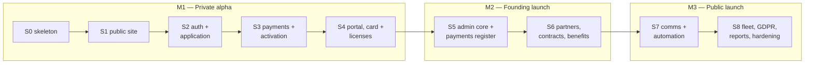

# 03 — Implementation Plan (Combined)

> **Purpose:** how one developer, working with Claude Code, builds the platform — philosophy, scope slices, milestones, and working method — **Combined edition**. Structure: **Fable's** plan skeleton kept intact (build philosophy, slices S0–S8, milestones M1–M3, solo Claude Code workflow, cut lines, assumptions-to-validate), re-planned over Combined's real scope: the **111 requirements of `04-prd.md`** (Fable's originals plus the Combined additions PUB-016..020 · MEM-023..029 · ADM-036..045 · PLT-013..017), the **24 tables and migrations 001–013 of `06-database-schema.md`**, and the **route canon of `05-information-architecture.md`** including `/admin/payments` and `/admin/reports/renewals`. Craft: **Opus's** session-granular increment breakdowns, per-slice risk notes, and deferral-register-with-rationale technique (its 19-increment events/bookings/news scope is rejected — 00 §0/§9). Breadth: **Codex's** "do not defer" discipline. Reads third; **written after** `04`–`09`; `10-roadmap.md` sequences these slices into phases 1:1.

---

## 1. Build philosophy

1. **Spec-first, specs stay true.** The Combined documents are the source of truth. When implementation reveals a better decision, the spec is updated **in the same PR** as the code (the "spec-update rule"). Divergence between doc and code is a bug.
2. **Vertical slices over horizontal layers** (01 §6, principle 7). Every slice ends with something demoable end-to-end on production infrastructure — never "the API is done but has no UI".
3. **Every schema change is a migration.** No dashboard-edited schema, ever; CI fails on drift (09 §8). The migration content registry is 06 §8 (001–013); a slice authors the migrations named in its section — where a numbered concern spans slices (003, 010, 013), the slice authors its *partial* and the registry stays the map of what lives where (§2.2).
4. **Deploy from day one.** S0 puts the walking skeleton on Vercel + Supabase production before any feature exists; there is no "integration phase".
5. **Boring, few, managed** (01 §6, principle 5). Any proposed new dependency or service must displace one or answer a locked requirement; the processor list (09 §3) is closed.
6. **Testing posture — automate the money and the math, eyeball the pixels** (09 §8 keeps CI honest to this):
   - **Vitest (unit):** pro-rata upgrade math (00 §3.3), membership date arithmetic and status transitions (PLT-006), the founding price lock (MEM-029), send-time segment resolution (ADM-040), Zod schemas including the SAUM/AACR pairing (MEM-024). These are the bug-costly parts.
   - **Playwright (smoke):** the golden path FLOW-01 in Stripe test mode, login, and the `/verify/{token}` valid + invalid verdicts — run in CI against the preview (09 §8).
   - **Manual per-slice verification:** each slice's 04 acceptance criteria walked on the preview URL before merge, plus the slice's rows from the 07 test-scenario catalog (TS-01..32); visual/UX review is human.
   - No coverage targets; tests exist where regressions are expensive (payments, statuses, dates, RLS).
7. **RLS proves itself.** Each slice that adds tables adds its 06 §7 policies in the same PR **and** a small RLS assertion script (deny-by-default checks run as anon/member/staff) — cheap insurance that PLT-002 AC2 stays true. Security is the one place "thin slice" never applies: policies ship with the table, at birth.

## 2. Scope slices

Effort unit: one Claude Code working session ≈ a focused half-day. Requirement IDs from 04 §7; tables and migration numbers from 06 §8; routes verbatim from 05 §2. Session breakdowns and the per-slice risk line are technique adopted from Opus.

| Slice | Theme | Sessions | Lands in |
|-------|-------|----------|----------|
| S0 | Walking skeleton | 3–4 | M1 |
| S1 | Public website | 5–6 | M1 |
| S2 | Auth & application | 4–6 | M1 |
| S3 | Payments & activation | 6–8 | M1 |
| S4 | Portal, card & licenses | 6–8 | **M1 exit** |
| S5 | Admin core & payments register | 8–10 | M2 |
| S6 | Partners, contracts, benefits | 6–8 | **M2 exit** |
| S7 | Communication & automation | 6–8 | M3 |
| S8 | Fleet, GDPR, reports, hardening | 6–8 | **M3 exit** |

Total: **50–66 sessions** — Fable planned 42–59 over its 84 requirement IDs; Combined's **27 additional requirements** (PUB-016..020, MEM-023..029, ADM-036..045, PLT-013..017 — 04 §7) land mostly in S3–S5 and S7–S8 and are priced honestly rather than absorbed. Every one of 04's **111** IDs appears in exactly one primary slice below (partials noted); the mapping is 1:1 with 10's phase work items.

Slices are strictly ordered — each depends on the previous (S5 needs S4's live members and payments to administer; S6 needs S5's CRM shell; S7 needs S6's contracts for expiry emails):

### 2.1 Why this order *(rationale adopted from Opus, redrawn for Combined's slices)*

The public → member → admin rhythm is dependency-driven, not preference:

1. **Public first (S1), but only static content.** The tier page reads only seeded `tiers`; building it first is low-risk, high-signal, and forces the i18n spine, the 08 tokens, and locale money formatting into existence before anything authenticated needs them. The club has a credible URL from week two — which the partner pipeline (02 §6) needs long before launch.
2. **Member spine second (S2–S4).** The hardest external integration (Stripe webhooks, PLT-009/014) and the most bug-costly math (dates, proration, the founding lock) live here; de-risking them early protects everything downstream, and the sensitive-data RLS pattern (licenses, MEM-025) is set where it matters most. The CRM mostly *reads* what members create — a member 360° built before members exist is guesswork.
3. **Admin third (S5–S6), against a populated database.** By S5 the database holds demo-seeded *and* real alpha rows, so every CRM list and queue is built against realistic data from its first render. Partners precede benefits because a benefit's granting partner and backing contract must exist first (ADM-021/022).
4. **Automation and law last (S7–S8), never optional.** Cron dunning needs real memberships to act on and contracts to alert about; GDPR self-service and the hardening pass close the launch gate. "Last" is a sequencing fact, not a priority statement — §5's do-not-defer list protects both.

Three cross-surface threads are built once, where their dependency first resolves: the **i18n/token spine** (S0, spans everything), the **one activation engine** (S3 — the webhook and the S5 staff confirmation converge on the same MEM-007 transaction; 07 §cross-flow guarantee 1), and the **live-truth publication predicates** (S6 — benefit publication and sponsor visibility as RLS-evaluated predicates, so S7's contract-expiry cron needs no cascade writes).

### 2.2 Migration authoring map

06 §8 numbers migrations **by concern**; slices author them in build order. Three concerns span slices and are authored in named partials — the registry below is the reconciliation, so `supabase db reset` replays a coherent set at every merge:

| Migration (06 §8) | Authored in | Note |
|-------------------|-------------|------|
| 001–002 (extensions/enums · identity) | S0 | Auth hook configured per 09 §5.3, verified before S1 |
| 003 (membership core) | S1 partial (`tiers` + seed) · S2 completes (`members`, `memberships`) | Fable's same split, kept |
| 004–005 (billing · cards) | S3 | `verify_card()` ships here, goes live at S4 |
| 006–008 (partners · contracts · benefits) | S6 | |
| 009 (fleet) | S8 | |
| 010 (communication) | S3 partial (`email_templates` lifecycle subset, `email_log`) · S7 completes (`campaigns`, `campaign_sends`) | Lifecycle emails must log from the first send (PLT-004) |
| 011 (audit) | S5 | |
| 012 (RLS) | Incremental — each slice ships its tables' 06 §7 policies in the same PR (§1.7) | 012 is the consolidated policy registry, not a big-bang slice |
| 013 (licensing & ops evidence) | S4 partial (`member_licenses`) · S7 partial (`job_runs`) · S8 completes (`consent_events` + backfill) | Task-shaped: licenses with the portal, job evidence with automation, consent ledger with GDPR |

### S0 — Walking skeleton

**Goal:** production-deployed empty app with the entire toolchain proven.
**PRD IDs:** PLT-003 (partial), PUB-014. **Tables/migrations:** 001–002 (`profiles`, `club_settings`). **Routes:** layout shells for the three route groups; `/` placeholder.

Sessions (**3–4**), roughly:
1. Repo, Next.js 16 + TypeScript strict (Turbopack), `proxy.ts` route-group gating, next-intl scaffold (`ro` root, `/en` prefix).
2. Tailwind/shadcn wired to the 08 token file; layout shells; branded 404/403 in both locales (PUB-014).
3. Supabase project + local stack; migrations 001–002; **custom access-token auth hook** configured and verified (06 §7.1, 09 §5.3); CI: lint, types, unit, migration drift; Vercel deploy + preview pipeline.
4. Buffer: DNS, env-var registry seeding (09 §5.2), smoke of the whole loop.

**Key risk:** a misconfigured auth hook breaks RLS *silently* — verify the `user_role` claim on a fresh token before S1 (09 §5.3 step 2). Start Stripe onboarding paperwork **now** (§7).

### S1 — Public website

**Goal:** the club exists publicly — bilingual, fast, honest about the math.
**PRD IDs:** PUB-001 (static teaser), PUB-002, PUB-003 (seeded tiers), PUB-008, PUB-009 (entry only), PUB-010, PUB-011, PUB-012, PUB-015, **PUB-018, PUB-019, PUB-020** *(Combined additions)*. **Tables/migrations:** 003 partial (`tiers` + production seed, 00 §3.1). **Routes:** `/`, `/mission`, `/membership`, `/contact`, `/join`, `/legal/*`.

Sessions (**5–6**), roughly:
1. Public shell: header/nav/footer per 05 §4, locale switcher + hreflang (PUB-011).
2. Home hero + static tier teaser (PUB-001); `/mission` (PUB-002).
3. `/membership`: tier comparison from seeded `tiers` (PUB-003), **break-even module** (PUB-019, gated on contract-backed categories), **FAQ accordion** (PUB-020).
4. `/contact` with **inquiry categories + organization field** (PUB-008/018, honeypot + rate limit), `/legal/*` incl. the accessibility statement (PUB-010/015).
5. SEO: titles/OG/sitemap/robots + JSON-LD per 05 §8 (PUB-012); `/join` entry with `?tier=` preselect (PUB-009).
6. Romanian copy + a11y + Core Web Vitals pass (04 §5 budget).

**Key risk:** PUB-019's break-even examples may cite only contract-backed categories (01 §6) — content is gated on the two anchor contracts (02 §6). Commission legal-page copy from the lawyer during this slice.

### S2 — Auth & application

**Goal:** a visitor can become an applicant, and the RLS pattern every later table inherits is set.
**PRD IDs:** MEM-001, MEM-002, MEM-003, MEM-004, MEM-009 (profile basics), PLT-001, PLT-002, PLT-008. **Tables/migrations:** 003 complete (`members`, `memberships` + GiST overlap exclusion) + their policies. **Routes:** `/register`, `/login`, `/reset-password`, `/portal`, `/portal/apply`, `/portal/profile`.

Sessions (**4–6**), roughly:
1. Register/confirm/login/logout with non-enumerating copy (MEM-001/003, PLT-001); role-based redirect.
2. Password reset, single-use ≤ 1 h links (MEM-004); auth rate limits (PLT-011 partial).
3. Application form → `members` + `memberships` `pending` rows; marketing consent as separate default-unticked checkbox; tier carried from `/join` (MEM-002); the Zod idiom set for everything after (PLT-008).
4. Portal shell with status-shaped nav (05 §5); `/portal/profile` basics (MEM-009).
5. RLS policies + the first **assertion script** (§1.7); TS-fixture QA.

**Key risk:** the RLS + Zod pattern set here propagates — a sloppy first policy is repaid nine slices long; the assertion script is non-negotiable from this slice on.

### S3 — Payments & activation

**Goal:** money in, membership on — both rails, one activation engine, every odd event decided.
**PRD IDs:** MEM-005, MEM-006, MEM-007, **MEM-027**, PLT-009, **PLT-014** (handler; queue surface lands in S5), PLT-004 (subset), **PUB-017** (transactional part), ADM-005 (minimal). **Tables/migrations:** 004–005 (`payments` + one-open-payment index, `stripe_events`, `member_cards`, identifier generators, `verify_card()`); 010 partial (`email_templates` lifecycle subset of the 21 keys, `email_log`). **Routes:** `/portal/membership/pay`, `/api/webhooks/stripe`.

Sessions (**6–8**), roughly:
1–2. Stripe Checkout session creation (exact whole-RON price) + signature-first webhook + `stripe_events` ledger (MEM-005, PLT-009).
3. **Decided anomaly outcomes** — duplicate/out-of-order no-ops, amount-mismatch → `anomaly` never auto-confirmed, unknown-session acknowledged (PLT-014).
4. Bank-transfer rail: instructions from `club_settings`, unique `ASC-P-NNNNN`, pending record (MEM-006).
5. Activation engine: payment `confirmed` + approval → number, card token, founding flag **in one transaction** (MEM-007, PUB-017); minimal staff approve action for alpha (ADM-005).
6. Lifecycle-email subset via `email_log` (PLT-004): application received, transfer instructions, payment confirmed, activated, pending-transfer staff alert.
7. **Resume without duplicates**: fresh Checkout against the same pending row, same transfer reference re-shown (MEM-027; the `payments_one_open` index is the guarantee).
8. QA: TS-01..08 against the demo seed.

**Key risk:** Stripe onboarding for the *asociație* may stall (02 R2) — the transfer rail ships **first** inside this slice so alpha can run on transfers alone; Netopia plan B stays on paper (00 §4.3).

### S4 — Portal, card & licenses  → **M1: Private alpha**

**Goal:** membership feels real — dashboard, history, the flagship card, hardened verification, and the licensing depth adopted from Opus.
**PRD IDs:** MEM-008–MEM-016, **MEM-023, MEM-024, MEM-025, MEM-026, MEM-029**, PUB-013, **PLT-013**. **Tables/migrations:** 013 partial (`member_licenses` + SAUM/AACR pairing CHECK + verification-reset trigger + policies); 005's `verify_card()` goes live. **Routes:** `/portal/membership` (+`/renew`, `/upgrade`), `/portal/payments`, `/portal/card`, `/portal/profile` (licenses section), `/verify/{token}`.

Sessions (**6–8**), roughly:
1. Dashboard with status chip + context action + resume entry (MEM-008/027); membership view/history (MEM-011).
2–3. Renewal with the **founding price lock** (MEM-012/029) and upgrade with server-side pro-rata (MEM-013) — unit-tested to TS-10/14/16/17 before any UI polish.
4. Payment history + non-fiscal confirmation PDFs (MEM-014).
5–6. The card per 08 §7 (MEM-015) + offline cache (MEM-016) + `/verify/{token}` via the RPC (PUB-013) with **anti-abuse**: CSPRNG tokens, indistinguishable invalids, 429 (PLT-013).
7. Member licenses on the profile: types/authorities, the **SAUM-vs-AACR rule** at UI, Zod, and CHECK (MEM-023/024), off every public surface (MEM-025).
8. Expired-state experience (MEM-026) + QA: TS-18..22, TS-27.

**Key risk:** the card is the flagship (08 §7) and M1's demo; proration + price-lock math is bug-costly — unit-test exhaustively (§1.6) before eyeballing pixels. PLT-013's indistinguishable-invalid rule is easy to break with one helpful error message.

### S5 — Admin core & payments register

**Goal:** staff replace the developer for people-ops and money-ops.
**PRD IDs:** ADM-001–ADM-011, ADM-032, ADM-033, ADM-034, **ADM-036, ADM-037, ADM-038, ADM-039, ADM-041, ADM-043, ADM-044**, PLT-007, **PLT-017**, PLT-014 (anomaly queue surface). **Tables/migrations:** 011 (`audit_logs`, `updated_at` triggers, sent-campaign freeze). **Routes:** `/admin`, `/admin/members` (+`/{id}`), `/admin/payments` (+`/{id}`), `/admin/users`, `/admin/settings`, `/admin/audit`.

Sessions (**8–10**), roughly:
1. CRM shell (sidebar groups per 05 §4, `ro`-only) + dashboard metrics + action queues incl. mismatches and webhook anomalies (ADM-001/002, PLT-014).
2. The **ADM-038 list fabric, built once and generically**: 50-row pagination, URL-encoded filter state, clearable chips, empty states — proven on the member list (ADM-003).
3–4. Member 360°: licenses with staff verify (ADM-036), internal notes (ADM-041), full application review replacing the S3 minimal action (ADM-005), edits with audit diff (ADM-007), archive (ADM-008).
5. **Payments register** at `/admin/payments`: filters, member deep links, period CSV for the accountant (ADM-039).
6–7. Transfer confirmation (ADM-006) + the **ADM-044 mismatch decision tree** (partial / surplus / unmatched-parked / returned — FLOW-18); `admin`-only refund recording (ADM-043).
8. Adjustments, card reissue, member CSV, bulk actions (ADM-009/010/011/037).
9. Users/roles with **session-revoking propagation** (ADM-032, PLT-017), club settings (ADM-033), audit log view (ADM-034, PLT-007).
10. QA: staff dry-run of FLOW-09/10/18; TS-29/30.

**Key risk:** the biggest slice. Build the list fabric once or every later module re-pays it; exercise the ADM-044 paths against realistic statement fixtures (garbled references, partial amounts), not happy-path data.

### S6 — Partners, contracts, benefits  → **M2: Founding launch**

**Goal:** the promise becomes contractual, and the public site starts telling live truth.
**PRD IDs:** ADM-012–ADM-022, **ADM-042**, PUB-004, PUB-005, PUB-006, **PUB-016**, PUB-017 (display part), MEM-017, MEM-018. **Tables/migrations:** 006–008 (`flight_schools`, `flight_school_aerodromes`, `associations`, `aerodromes`, `sponsors`; `contracts` + exactly-one CHECK; `benefits`). **Routes:** `/admin/flight-schools|associations|aerodromes|sponsors|contracts|benefits` (+`/{id}`), `/sponsors` live, `/membership` live benefit rows.

Sessions (**6–8**), roughly:
1–2. Four partner CRUDs on the S5 list fabric (ADM-012..015), partner 360° with linked records (ADM-016), **archive/delete policy** (ADM-042).
3. Contracts: `CTR-YYYY-NNN`, exactly-one counterparty, lifecycle rules (ADM-017/018); document upload to private Storage (ADM-019); expiry queue entries (ADM-020 — alert *emails* arrive with S7's cron).
4. Benefits CRUD + the publication predicate (ADM-021/022).
5. Public go-live: benefit rows with the **tease rule** (PUB-004/016), sponsors page + homepage Gold strip (PUB-006), founding counter (PUB-005/017 display).
6. Member benefits catalog with tier locks + filters (MEM-017/018); QA: FLOW-11/12/16 dry-runs with expired-contract fixtures.

**Key risk:** public promises go live here — probe the ADM-022 publication predicate and the PUB-006 sponsor RLS gate with expired/terminated-contract fixtures **before** real logos ship.

### S7 — Communication & automation

**Goal:** the machine talks and remembers by itself — and can prove it.
**PRD IDs:** ADM-023–ADM-028, **ADM-040**, MEM-019, MEM-020, PLT-004 (full), PLT-005, PLT-006, **PLT-015, PLT-016**. **Tables/migrations:** 010 complete (`campaigns` + `send_stats`, `campaign_sends`); 013 partial (`job_runs`). **Routes:** `/admin/campaigns` (+`/{id}`), `/admin/templates`, `/admin/send-log`, `/portal/announcements`, `/api/cron/daily`.

Sessions (**6–8**), roughly:
1–2. Cron engine at `/api/cron/daily`: status transitions from `ends_on` arithmetic (PLT-006), **`job_runs` evidence rows** with per-action counts and the zero-count re-run proof (PLT-015).
3. Full dunning set T−30/T−7/T0/T+14/T+30 + remaining lifecycle templates — all 21 keys seeded (PLT-004); contract/aircraft alert emails go live (ADM-020/030 wiring).
4. Template management with preview (ADM-023); consent toggle + unsubscribe path (MEM-019).
5–6. Campaigns: composer + segments + live counts (ADM-024), test send (ADM-025), **send-time re-resolution with authoritative `send_stats`** (ADM-040), per-recipient log + scoped retry (ADM-026).
7. Announcements (ADM-027, MEM-020), automated-send log (ADM-028), day-3 onboarding deduped via `email_log` (PLT-016).
8. QA: compressed-clock cohort — TS-09/11/12/25/26/31/32.

**Key risk:** date-sensitive correctness. A dunning bug discovered on real members is a trust incident, not a defect — the compressed-clock staging cohort is the gate, and `job_runs` makes idempotency provable rather than assumed.

### S8 — Fleet, GDPR, reports, hardening  → **M3: Public launch**

**Goal:** complete the CRM, honor the law, watch the tripwire, harden the edges.
**PRD IDs:** ADM-029, ADM-030, ADM-031, ADM-035, **ADM-045**, PUB-007, MEM-021, MEM-022, **MEM-028**, PLT-010, PLT-011 (full pass; login/contact/verify ceilings shipped with their slices), PLT-012. **Tables/migrations:** 009 (`aircraft`); 013 complete (`consent_events` + policies + backfill from `members.marketing_consent`/`consent_updated_at`). **Routes:** `/admin/fleet` (+`/{id}`), `/admin/reports/renewals`, `/fleet`, `/portal/settings`.

Sessions (**6–8**), roughly:
1. Fleet CRUD + ARC/insurance expiry alerts + public visibility toggle (ADM-029..031); `/fleet` page (PUB-007).
2. GDPR export: machine-readable JSON incl. licenses + consent history, audit-logged (MEM-021).
3–4. Erasure: member request (MEM-022) + admin execution in the 06 §6 order (ADM-035); **consent ledger** completed with backfill + member-visible history (MEM-028).
5. **Renewal cohort report** at `/admin/reports/renewals`, reconciling with the dashboard rate and flagging the 02 §5 65% tripwire (ADM-045).
6. Hardening: rate-limit full pass (PLT-011), Plausible (PLT-010), empty/error-state sweep (PLT-012).
7. WCAG 2.2 AA audit per 08 §8 + manual keyboard/screen-reader pass on join, pay, card, verify (04 §5).
8. Backup **restore drill** per 09 §6 (nightly `pg_dump` snapshot → scratch project → verify a member 360°, a payment, a card verification); QA: TS-23/24.

**Key risk:** erasure execution is irreversible — rehearse on staging fixtures before the first real request; the consent backfill must reconcile against `consent_updated_at` before the ledger is presented as history.

### 2.3 Coverage check

Every 04 §7 ID has exactly one primary slice (partials and staged go-lives noted in the slice sections — e.g. ADM-005 minimal in S3/full in S5, PLT-014 handler in S3/queue surface in S5, PUB-017 transaction in S3/display in S6):

| Slice | PUB | MEM | ADM | PLT |
|-------|-----|-----|-----|-----|
| S0 | 014 | — | — | 003 |
| S1 | 001, 002, 003, 008, 009, 010, 011, 012, 015, 018, 019, 020 | — | — | — |
| S2 | — | 001, 002, 003, 004, 009 | — | 001, 002, 008 |
| S3 | 017 | 005, 006, 007, 027 | 005 (minimal) | 004 (subset), 009, 014 |
| S4 | 013 | 008–016, 023, 024, 025, 026, 029 | — | 013 |
| S5 | — | — | 001–011, 032, 033, 034, 036, 037, 038, 039, 041, 043, 044 | 007, 017 |
| S6 | 004, 005, 006, 016 | 017, 018 | 012–022, 042 | — |
| S7 | — | 019, 020 | 023–028, 040 | 004 (full), 005, 006, 015, 016 |
| S8 | 007 | 021, 022, 028 | 029, 030, 031, 035, 045 | 010, 011, 012 |

Tally: 20 PUB + 29 MEM + 45 ADM + 17 PLT = **111** — no requirement is homeless, no slice does unrequired work.

## 3. Milestones

| Milestone | Slices | Exit criteria (Definition of Done) |
|-----------|--------|-------------------------------------|
| **M1 — Private alpha** | S0–S4 | 10–15 seed members complete FLOW-01 with real money (card **and** at least one bank transfer, confirmed via the minimal approve); every member holds a working card verified at least once via `/verify/{token}` from a real phone at desk distance; an interrupted join resumes without duplicates (TS-03/04); at least one member records a license and a forced invalid pairing is rejected (TS-27); Playwright smoke green in CI |
| **M2 — Founding launch** | S5–S6 | CRM operational: staff run FLOW-09, FLOW-10, FLOW-11, FLOW-12, FLOW-16, and FLOW-18 without developer help; a below-amount and an unmatched transfer each resolved through the ADM-044 paths (TS-29/30); ≥ 2 real partner contracts and ≥ 1 sponsor live on the public site; founding counter (PUB-005/017) live and correct against the database; every mutation visible in `/admin/audit` |
| **M3 — Public launch** | S7–S8 | Dunning proven on a compressed-clock staging cohort (FLOW-04 end-to-end; TS-11/12/31/32); a real campaign reaches a consented segment with authoritative send-time counts (FLOW-14; TS-25/26); GDPR export + erasure executed once for real (FLOW-08; TS-23/24); 10 §4 launch-readiness checklist fully green — including **all 32 test scenarios** of the 07 catalog |

## 4. Solo Claude Code workflow

**Session cadence.** One slice-scoped goal per session. A session = pick the next unchecked item from the slice → implement → verify → PR → merge. Never two slices in flight.

**Context feeding per slice.** Every session starts by loading `00-foundation.md` plus the slice's relevant docs — S1: 04 (PUB) + 05 + 08; S2–S4: 04 (MEM/PLT) + 05 + 06 + the 07 flows being built; S5–S8: 04 (ADM) + 06 + 07. A repo `CLAUDE.md` points at `docs/Combined/` and states the spec-update rule so any session can re-anchor. Slices with domain-rule payloads carry their rule docs explicitly: S4 loads the MEM-024 licensing rule (00 §6) and the 08 §7 card spec; S5 loads FLOW-18's decision tree; S7 loads the membership clock (07, intro table).

**Branch & commit conventions.** Trunk-based: short-lived branches `s{n}/{topic}` (e.g. `s3/stripe-webhook`, `s5/payments-register`) off `main`, merged via PR same-or-next day. Conventional commits (`feat:`, `fix:`, `chore:`, `spec:`); `spec:` commits carry Combined-doc updates, satisfying the spec-update rule reviewably.

**Review-verify loop (before every merge).**
1. CI green (lint, types, unit, migration drift, smoke on preview — 09 §8).
2. Walk the slice's 04 acceptance criteria on the preview URL; check the flow against 07 step by step, **including its edge-case table**.
3. Run the slice's rows from the TS catalog (07) against the preview's demo seed (06 §8).
4. RLS assertion script for any new table (§1.7).
5. Claude Code self-review pass on the diff (correctness + simplification) before human merge.

**Keeping specs and code honest.** The PR template has a checkbox: "Combined docs updated or confirmed unaffected." Renaming a route, table, or status without updating 05/06/00 fails review by convention; a new env var without its 09 §5.2 registry row fails the same way.

**Definition of Done per slice** *(checklist technique adopted from Opus, cut to Combined's conventions — handed to Claude Code at the start of every slice):*

- [ ] **Maps to spec** — the named 04 requirement IDs implemented; their Given/When/Then acceptance criteria demonstrably pass on the preview.
- [ ] **Vertical & usable** — a human in the relevant role completes the slice's thread end-to-end in the browser, on production infrastructure.
- [ ] **Bilingual** — `ro` and `en` both work (admin `ro`-only, 00 §4.4); all copy from next-intl catalogs, no hardcoded strings (PLT-003); diacritics correct (ș/ț comma-below, ă/â/î); layouts survive the longer Romanian string.
- [ ] **Locale-correct formatting** — money `3.000 RON` / `3,000 RON`, dates `DD.MM.YYYY` / `DD MMM YYYY`, 24-hour Europe/Bucharest (00 §7.3).
- [ ] **Secure by construction** — every new table has RLS enabled with its 06 §7 policies; the assertion script passes as anon/member/staff (§1.7); no license or token data on public surfaces (MEM-025, PLT-013).
- [ ] **Validated** — every new Server Action Zod-guards its input (PLT-008); file uploads type- and size-checked.
- [ ] **Audited** — every new admin mutation writes `audit_logs` with before/after (PLT-007); service-role writes carry a system `actor_label`.
- [ ] **Migration-clean** — `supabase db reset` rebuilds schema + seeds with no manual step; `supabase db diff` empty (09 §8).
- [ ] **Tested where it counts** — the slice's §1.6 unit targets covered; its TS rows pass against the demo seed.
- [ ] **Spec-honest** — Combined docs updated in the same PR, or confirmed unaffected (the spec-update rule).

A slice that ships a migration without its policies, a screen with hardcoded copy, or an action without Zod is **not done** — it is reopened, not merged.

## 5. Cut lines and the do-not-defer list

If a milestone is running late, drop in this order (never cut below the line of its own exit criteria):

- **M1:** PUB-020 (FAQ) → MEM-016 (offline card) → MEM-010 (avatar) → MEM-023/024/025 (licenses — defer to M2, landing together with ADM-036 in S5) → MEM-013 (upgrade — defer to M2) → PUB-012 OG polish. MEM-029 is **not** cuttable: the founding price lock is a Must and a price-integrity promise (00 §3.5).
- **M2:** ADM-011 (CSV export) → ADM-037 (bulk actions) → ADM-041 (internal notes) → ADM-009 (manual adjustment) → PUB-005 (founding counter) → ADM-022 automation (staff toggle benefits manually). ADM-044 is **not** cuttable — mismatched transfers arrive whether or not the CRM has an answer for them.
- **M3:** ADM-023 (template-editing UI — edit seeds in the repo instead) → ADM-045 (cohort report — the dashboard rolling rate stays) → MEM-028 (consent-history UI — the ledger keeps writing) → MEM-020/ADM-027 (announcements) → ADM-030 (aircraft document alerts) → PLT-010 (analytics).

**Do not defer** *(discipline adopted from Codex's MVP cut line, extended to Combined's scope)* — these survive every cut, at every milestone:

| # | Never cut | Why |
|---|-----------|-----|
| 1 | **Payment correctness** — PLT-009 (signed, idempotent webhook), PLT-014 (decided anomaly outcomes), MEM-007 (one activation engine), ADM-006/044 (transfer confirmation + mismatch paths) | Money handled wrong once costs more trust than every feature combined |
| 2 | **Card-verification safety** — PUB-013 (minimal live verdict), PLT-013 (non-enumerable tokens, indistinguishable invalids, 429), ADM-010 (revocation) | The card is the product's public face; a verification page that leaks or lies kills the partner channel |
| 3 | **Status engine** — PLT-006, with PLT-005/015 evidence | Statuses moved by dates, provably idempotent — hand-flipped statuses are how member registers rot |
| 4 | **RLS + role enforcement** — PLT-002 (three layers), PLT-017 (no stale-claim window) | The database is the security boundary; a UI bug must never widen data access |
| 5 | **GDPR self-service** — MEM-021, MEM-022, ADM-035; consent gating MEM-019 | Legal obligations, not features (00 §8.1) |
| 6 | **Audit** — PLT-007, insert-only, every mutation | The accountability record everything above depends on |
| 7 | **Legal pages** — PUB-010 (with the 09 §3 processor list) | Launching without reviewed terms/privacy is legal exposure, not a shortcut |

## 6. Deferral register *(technique adopted from Opus — every deferral carries its rationale and its revisit trigger)*

Deliberately not in v1, decided — not forgotten. 10 §5 orders these into the post-v1 backlog; 00 §9 is the locked scope authority.

| Deferred | Source suite | Why deferred | Revisit trigger |
|----------|--------------|--------------|-----------------|
| Events module with registration/ticketing | Opus (events + RSVP) | Announcements (ADM-027/MEM-020) cover event comms; ticketing drags payments, capacity, and refund policy into v1 | The first recurring club event outgrows an announcement plus the contact form |
| Flight booking / scheduling | Opus (bookings increment) | Dues ≠ flying spend (01 §6); the club operates no aircraft for hire in v1. **Opus's GiST no-overlap exclusion design is parked with the idea** (00 §9) — the same constraint family already guards membership years (06 §3.2) | The club owns/leases aircraft for member hire |
| Wallet passes (Apple/Google) | Opus | The responsive card + offline cache (MEM-016) covers the phone; Apple adds $99/yr + certificate ops | Member demand; the 08 §7.4 field mapping is reserved so the card model never blocks it |
| Benefit redemption tracking | Codex (defer list) | Partners verify by card and apply terms per contract; a redemption ledger adds partner-side operations v1 cannot support | Contract renewals need per-benefit ROI (pairs with ADM-045) |
| Auto-recurring card payments / saved cards | Fable (00 §3.2) | Member-initiated annual renewal matches Romanian dues culture; saved cards add SCA/liability surface | ADM-045 cohorts show renewal friction measurably costing members |
| Fiscal e-invoicing integration (e-Factura/SmartBill) | All three | Sponsor invoices are the accountant's B2B e-Factura documents via ANAF SPV, outside the platform (00 §2) | Invoice volume grows, or the accountant asks for automation |
| News/MDX content module | Opus | Announcements + campaigns carry club news; a content pipeline is CMS weight without an editor | A non-developer needs to publish long-form content |
| Member directory / community features | Opus + Codex | Privacy-first posture; a directory is a consent and safety surface of its own | Members ask, and an opt-in model is designed first |
| Per-module staff permissions | Opus (roles matrix), Codex (finance/comms roles) | 00 §5 locks single role per profile; a two-person staff needs no matrix | Staff count > 3, or a segregation-of-duties requirement |
| Threaded internal-notes table | Codex (`admin_notes`) | One rich-text field + the audit log covers authorship at this scale (06 §3.9) | Notes volume makes single-field editing collide |
| Netopia integration | Fable (plan B) | Stripe covers cards; a second processor doubles the webhook/reconciliation surface | Stripe onboarding fails, or card volume makes the 0.99% vs ~1.5% delta material (09 §3: >500 members) |
| Free/trial tier, lifetime membership, monthly billing | Opus (pricing model) | **Rejected, not deferred** — contradicts the brief (00 §0/§3.1); recorded here so it is never "rediscovered" | — |

## 7. Sequencing risks

Program-level risks (per-slice risks live in §2's slice sections):

| Risk | Mitigation |
|------|------------|
| Stripe onboarding for the *asociație* stalls (02 R2) | Start Stripe activation paperwork during S0; S3 builds the bank-transfer path first so alpha can run on transfers alone; Netopia plan B documented with real fees (00 §4.3, 09 §3) |
| Logo source vector arrives late (08 §1.1) | **Logo delivered** (navy lockup, PNG) and the palette is anchored to its ink; only the SVG/AI for the white variant + favicons is outstanding — raster fallbacks unblock everything until S4's card polish |
| Legal-page content (PUB-010/015) needs a lawyer | Commission during S1; ship with reviewed drafts no later than M2 |
| Approval flow blocks alpha activations (ADM-005 full CRM lands in S5) | S3 ships the minimal approve action explicitly for this |
| Cron/dunning correctness is date-sensitive | Unit-test the transition engine exhaustively (§1.6); compressed-clock staging cohort before M3 (TS-11/12/31/32); `job_runs` makes idempotency provable, not assumed (PLT-015) |
| Statute doesn't yet define the three member categories (02 R12) | Legal prerequisite, not code: confirm the statute (or its amendment) before taking the first real payment in alpha |
| The S5 scope bulge (payments register + mismatch paths) slips M2 | ADM-039's period export and ADM-037's bulk actions are the pressure valves (§5 cut lines); ADM-006/044 core matching is do-not-defer |
| Accountant's e-Factura SPV workflow unconfirmed at the first sponsor contract (02 R11) | Confirm the process with the accountant during S5, before S6 signs sponsorship paper (10 §3) |

## 8. Assumptions to validate during the build

Research (00 §10) grounded most numbers, but three assumptions remain open and each has a validation hook:

1. **Market depth** — no public AACR census of PPL/LAPL holders exists (01 §2). *Validate:* AACR aggregate-data request + enrollment counts from the first two partner schools, by end of M1.
2. **Benefit recoup targets** — the ≤50%-of-usage break-even rule (02 §3) assumes schools contract ~10% on training packages. *Validate:* the first two partnership negotiations; if packages come in at 5%, tier promises, the PUB-019 public math, and M2's public benefit rows must be re-anchored before going live. *Instrument:* ADM-045's cohort report against the 02 §5 **65% tripwire** once renewals begin.
3. **Bank-transfer share** — reconciliation load (FLOW-10/18) scales with the share of members choosing transfers over cards. *Validate:* alpha cohort payment-method split; if transfers dominate, prioritize the ADM-006 matching UX and ADM-044 mismatch tooling ahead of other S5 polish, and reconsider the Netopia trigger (§6).

---

*Merged from: Fable `03-implementation-plan.md` (build philosophy, slice/milestone/workflow/cut-line/assumption skeleton — re-scoped to Combined's 111 requirements, 24 tables, migrations 001–013, and the 05 route canon), Opus `03-implementation-plan.md` and `10-roadmap.md` (session-granular increment breakdowns, per-slice risk notes, the deferral-register-with-rationale technique — its 19-increment events/bookings/news scope and "portfolio cut" framing rejected per 00 §0/§9: Combined is built to operate, not to demo), Codex `03. aeroskill-club-v1-implementation-plan.md` and `10. aeroskill-club-v1-milestone-roadmap.md` (the "do not defer" discipline — card-validation safety, payment confirmation, member-status logic, legal pages — extended here to Combined's requirement IDs). All requirement IDs trace to Combined `04-prd.md` §7; tables and migrations to `06-database-schema.md` §8; routes to `05-information-architecture.md` §2; flows and test scenarios to `07-user-flows.md`. No new external claims.*
