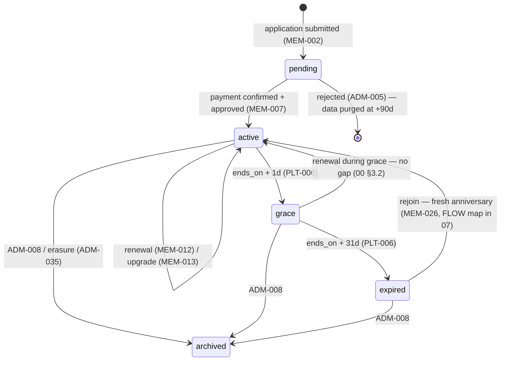

# 04 — Product Requirements Document (Combined)

> **Purpose:** the complete v1 requirements for all three surfaces — **Combined edition**: Fable's 86-requirement skeleton kept intact under its original IDs, rewritten and deepened in Opus's Given/When/Then acceptance-criteria discipline (licensing, payment edges, anti-abuse, NFR crispness), and swept for Codex's form-, list-, and state-level breadth — all under the locked canon of `00-foundation.md`.

**How to read:** every requirement has a stable ID (`PUB-`/`MEM-`/`ADM-`/`PLT-`, per 00 §7.1), a MoSCoW priority (**M**ust / **S**hould / **C**ould), a one-line description, and 2–5 acceptance criteria in **Given / When / Then** form (the mandatory format per 00 §7.4). Fable's original IDs (`PUB-001..015`, `MEM-001..022`, `ADM-001..035`, `PLT-001..012`) are preserved unchanged in meaning — only their criteria are deepened; Combined additions continue each sequence with new, higher numbers and are marked *(Combined addition)* with provenance. IDs are assigned once and never reused or renumbered. "Member" always means a person with role `member`; statuses always use the locked vocabularies (00 §7.2); tiers, prices, and identifier formats are 00's and are never re-decided here. Route names follow the canonical map that 05 inherits (`/join`, `/portal/card`, `/verify/{token}`, `/admin/members`, …). The requirement index (§7) is the traceability spine that 07 (flows) and 10 (roadmap) map against.

---

## 1. Public website (PUB)

### 1.1 Content pages

**PUB-001 — Home page** (M)
Landing page presenting the club promise, tier teaser, Gold sponsors, and the Join call to action.
- Given a visitor opens `/`, When the page renders (fully server-side), Then the hero shows the mission one-liner (01 §1), a three-tier price teaser (3000/4500/6000 RON, locale-formatted per 00 §7.3), and an accent Join button linking to `/join`.
- Given at least one sponsor with an `active` sponsorship contract and `visible_on_site = true`, When the home page renders, Then Gold-package sponsor logos appear; When none qualifies, Then the section is absent entirely.
- Given a cold load on a mid-range mobile, When Core Web Vitals are measured, Then the page meets the §5 performance budget (LCP ≤ 2.5 s).

**PUB-002 — Mission page** (M)
The "why we exist" page at `/mission`.
- Given a visitor opens the page, When it renders, Then it presents the mission, the problem (01 §2), and the club's legal identity (*asociație* under OG 26/2000, 00 §2).
- Given either locale, When the page is compared across `ro` and `en`, Then content parity is full — no section exists in only one language.

**PUB-003 — Membership page with tier comparison** (M)
The conversion page at `/membership`.
- Given a visitor opens the page, When it renders, Then all three tiers appear side by side with the locked names and prices (00 §3.1) and the benefit-class comparison of 02 §3.
- Given the tier cards render, When the visitor scans them, Then Pilot is visually flagged "Recomandat piloților activi / Recommended for active pilots" per the 08 §6 pricing-card spec — never a "most popular" claim (02 §2).
- Given a tier's CTA is clicked, When navigation occurs, Then it goes to `/join?tier={slug}` with that tier preselected.
- Given any locale, When prices render, Then they are locale-formatted per 00 §7.3 and no currency other than RON is shown.

**PUB-004 — Tier benefits rendered from live data** (S)
The comparison's concrete benefit rows come from the database, not hardcoded copy.
- Given published benefits exist (`benefits.active = true` with a qualifying contract, ADM-022), When the membership page renders, Then they appear grouped by partner type with their `min_tier` mapping.
- Given a benefit is unpublished in the CRM, When the public page next renders, Then the benefit is gone without a deploy.

**PUB-005 — Founding-member counter** (S)
Scarcity indicator for the founding offer (00 §3.5).
- Given fewer than 50 approved founding members exist, When the counter renders, Then it shows remaining slots computed live as 50 − (approved founding members).
- Given the count reaches 0, When the page renders, Then the founding section disappears automatically.

**PUB-006 — Sponsors page** (M)
Public sponsor showcase at `/sponsors`.
- Given visible sponsors exist, When the page renders, Then they are grouped by package (Gold, Silver, Bronze) with logo, name, and outbound link carrying `rel="sponsored"` (08 §6 sponsor grid).
- Given a sponsor lacks an `active` sponsorship contract or has `visible_on_site = false`, When the page renders, Then that sponsor does not appear.
- Given no sponsor is visible, When the page renders, Then an empty state shows the "Become a sponsor" pitch with a contact CTA.

**PUB-007 — Fleet showcase page** (S)
Public aircraft gallery at `/fleet`.
- Given aircraft with `status = active` and public visibility enabled (ADM-031), When the page renders, Then each shows photo, type, registration, and base aerodrome.
- Given an aircraft in `maintenance`/`retired` or non-public, When the page renders, Then it never appears.

**PUB-008 — Contact page** (M)
Club contact details and form at `/contact`.
- Given a visitor opens the page, When it renders, Then club contact details (from `club_settings`) and a contact form (name, email, message) appear, Zod-validated with localized messages.
- Given a valid submission, When it is sent, Then the club inbox receives it via Resend and the visitor sees a success state; spam is deterred by honeypot plus rate limit (PLT-011).

**PUB-009 — Join entry point** (M)
The `/join` funnel start.
- Given a visitor opens `/join` (optionally with `?tier={slug}`), When it renders, Then the three tiers are presented and the registration/application flow (MEM-001/002) starts with the chosen tier carried through.
- Given a logged-in `active` member visits `/join`, When routing resolves, Then they are redirected to `/portal`.

**PUB-010 — Legal pages** (M)
Privacy, terms, and cookies at stable URLs.
- Given either locale, When `/legal/privacy`, `/legal/terms`, or `/legal/cookies` is opened, Then the page exists with full content parity (05 §2 URL scheme).
- Given the privacy policy renders, When its processor list is compared to 09 §3, Then they are consistent.

### 1.2 Public platform behavior

**PUB-011 — Locale switching** (M)
Header locale switcher on every public page.
- Given a visitor on any public page, When they toggle `ro` (root) ↔ `en` (`/en` prefix), Then the current page is preserved across the switch (00 §4.4).
- Given any public page, When it renders, Then `hreflang` alternates are emitted for both locales.

**PUB-012 — SEO basics** (M)
Discoverability essentials.
- Given any public page in either locale, When it renders, Then it carries a unique title and meta description, an Open Graph image, and appears in the generated `sitemap.xml` (with `robots.txt` present).
- Given `/portal`, `/admin`, or `/verify/*` routes, When crawled, Then they are `noindex` and excluded from the sitemap.

**PUB-013 — Member-card verification page** (M)
The partner-facing live card check at `/verify/{token}` (02 R5, 08 §7.5).
- Given a partner scans a card QR, When `GET /verify/{token}` resolves without authentication, Then it renders the verdict (member in `active` or `grace` → valid; anything else → invalid), first name + last initial, tier badge, validity date, and check timestamp.
- Given an unknown or revoked token, When the page resolves, Then the invalid verdict renders with no member data, inside the same layout (never an error page).
- Given any verification request, When the response is produced, Then it is server-rendered from live data with no caching beyond 60 s.
- Given the response body, When inspected, Then no personal data beyond the fields above is present (GDPR minimization).

**PUB-014 — Error pages** (M)
Branded failure states.
- Given a missing route or a forbidden access, When the error renders, Then a branded 404 or 403 page appears in both locales with a path back home; the portal 403 explains the login/role requirement.

**PUB-015 — Accessibility statement** (S)
Voluntary EAA-aligned statement (00 §8: likely microenterprise-exempt, targets WCAG 2.2 AA anyway).
- Given `/legal/accessibility` is opened in either locale, When it renders, Then it states the WCAG 2.2 AA conformance target, known limitations, and a feedback contact.
- Given any public or portal page, When the footer renders, Then the statement is linked from the consistent-help position (08 §8, criterion 3.2.6).

### 1.3 Combined additions (public)

**PUB-016 — Public benefit tease without redemption detail** *(Combined addition — Opus PUB-006 + Codex §8.4)* (S)
Public benefit rows sell the promise but never leak the redemption mechanics.
- Given a visitor views the public benefit rows (PUB-004), When any benefit renders, Then it shows bilingual title, partner name, partner type, and `min_tier` badge — and never the redemption note (that stays member-only, MEM-017).
- Given a visitor interacts with a benefit row, When they seek details, Then a join CTA to `/join?tier={min_tier slug}` appears instead of redemption instructions.

**PUB-017 — Founding-counter integrity** *(Combined addition — hardening of PUB-005)* (S)
The scarcity counter can never overstate or oversell.
- Given the founding flag is assigned inside the activation transaction (MEM-007), When concurrent activations occur near slot 50, Then never more than 50 members carry the flag and the counter never displays a negative number.
- Given the counter is cached, When it renders, Then the cache window is ≤ 60 s and the display always rounds *down* to the safe remaining count.
- Given 0 slots remain, When a visitor proceeds through `/join`, Then no step of the flow promises the founding offer.

**PUB-018 — Contact inquiry categories** *(Combined addition — Codex §8.8)* (S)
The contact form routes intent without a CRM inbox.
- Given the contact form (PUB-008), When it renders, Then a category select offers: interes de membru / parteneriat / sponsorizare / altele (membership / partnership / sponsorship / other), localized.
- Given a submission with a category, When the notification email is composed, Then the category prefixes the subject line and partnership/sponsorship submissions include an optional organization-name field's value.

**PUB-019 — Break-even math on the membership page** *(Combined addition — mandated by 02 §1.3/§3)* (S)
The public tier page leads with honest recoup arithmetic.
- Given the membership page renders, When the break-even module appears, Then it presents the worked examples of 02 §3 (student training-package discount; renter break-even at ~20 flying hours/year) with amounts locale-formatted per 00 §7.3 and labeled as illustrative.
- Given a benefit category has no signed backing contract, When the module renders, Then no example cites that category (01 §6, principle 2 — nothing promised without a contract).

**PUB-020 — Membership FAQ** *(Combined addition — Codex §8.3)* (C)
Bilingual FAQ accordion on the membership page.
- Given the FAQ renders, When its answers are compared to 00 §3.2/§3.3 and 02 §7, Then renewal window, 30-day grace, both payment methods, non-refundable dues, upgrade/downgrade rules, and the founding offer are stated consistently with the locked policy.
- Given either locale, When the FAQ renders, Then all entries come from next-intl catalogs with full parity.

---

## 2. Member portal (MEM)

### 2.1 Account & application

**MEM-001 — Registration** (M)
Account creation at `/register` via Supabase Auth.
- Given a visitor signs up with email + password, When the account is created, Then a confirmation email is sent and the application (MEM-002) cannot be submitted until the email is confirmed.
- Given a password shorter than 10 characters or present in the breach list (Supabase settings), When submitted, Then registration is rejected with a localized message.
- Given an email that already has an account, When registration is attempted, Then the response never reveals the account's existence (non-enumerating copy).

**MEM-002 — Membership application** (M)
The application form at `/portal/apply`.
- Given a confirmed account, When the applicant submits, Then the form has captured: tier, full name, phone, county, date of birth, pilot status (`pilot_status` schema enum: enthusiast/student/licensed — 00 §7.2), and terms acceptance; marketing consent is a separate, default-unticked checkbox (00 §8.1).
- Given submission succeeds, When records are written, Then a `members` row (status `pending`) and a `memberships` row (chosen tier, status `pending`) exist and the flow routes to payment (MEM-005/006).
- Given any field, When validated, Then Zod rules apply with localized messages, and data already given at registration (email) is never re-asked (08 §8, criterion 3.3.7).

**MEM-003 — Login / logout** (M)
Session management at `/login`.
- Given valid credentials, When login succeeds, Then a Supabase Auth cookie session is established and redirect follows role: `member` → `/portal`, `staff`/`admin` → `/admin`.
- Given logout, When invoked, Then the session is invalidated server-side.
- Given repeated failed logins, When the limit trips, Then attempts are rate-limited (PLT-011) with a non-enumerating error message.

**MEM-004 — Password reset** (M)
Self-service reset at `/reset-password`.
- Given a reset request, When the email is sent, Then the link is single-use and expires within 1 hour.
- Given any email address is entered, When the flow responds, Then it never confirms whether that email has an account.

### 2.2 Payment & activation

**MEM-005 — Card payment via Stripe Checkout** (M)
Card path at `/portal/membership/pay`.
- Given an unpaid `pending` membership, When the member chooses "Pay by card", Then a Stripe Checkout session is created server-side for the exact tier price in whole RON (00 §4.3), with SCA/3-D Secure handled inside Checkout.
- Given Checkout completes, When the signature-verified webhook (PLT-009) processes the event, Then the payment becomes `confirmed` and activation (MEM-007) is triggered — never via the success redirect alone.
- Given a cancelled or failed Checkout, When the member returns, Then a retry screen offers card retry plus the bank-transfer alternative, and a session that concluded unsuccessfully records the payment `failed`.

**MEM-006 — Bank-transfer payment instructions** (M)
The culturally first-class alternative (00 §4.3).
- Given the member chooses "Pay by bank transfer", When instructions render, Then they show the club IBAN and beneficiary (from `club_settings`), the exact amount, and a unique payment reference code `ASC-P-NNNNN` — payment-scoped, because member numbers don't exist before first activation.
- Given instructions are issued, When records are written, Then a `payments` row exists (`bank_transfer`, `pending`, with `reference_code`), it appears in the admin queue (ADM-002), and the member sees "awaiting confirmation".

**MEM-007 — Activation** (M)
The gate where a paid, approved application becomes a membership.
- Given a `pending` membership, When its payment is `confirmed` **and** the application is approved (ADM-005), Then whichever completes last triggers activation.
- Given activation runs, When it commits, Then `starts_on` = activation date, `ends_on` per 00 §3.2, member status `active`, the member number is assigned (first activation only, `ASC-YYYY-NNNN`, 00 §6), the member card is issued (token + card record), and the welcome/activation email sends (PLT-004).
- Given the member is among the first 50 approved, When activation commits, Then the founding-member flag is set automatically inside the same transaction (00 §3.5, PUB-017).

### 2.3 Portal core

**MEM-008 — Dashboard** (M)
The authenticated landing surface at `/portal`.
- Given an authenticated member, When `/portal` renders, Then it shows the membership status chip (08 §6.1), tier, validity dates, the latest announcements (MEM-020), and the context-appropriate primary action (Pay / Renew / View card).
- Given a member in `grace`, When the dashboard renders, Then a warning banner shows days remaining and an accent Renew button (08 §7.2).

**MEM-009 — Profile view & edit** (M)
Self-service profile at `/portal/profile`.
- Given a member edits contact data (phone, county, address), When they save, Then changes apply; a name change instead flags the member for staff review rather than applying silently.
- Given an email change, When requested, Then it completes only through Supabase re-confirmation.
- Given any profile write, When executed, Then RLS restricts it to the member's own row (06 §RLS).

**MEM-010 — Avatar upload** (C)
Optional profile photo.
- Given a JPEG/PNG ≤ 2 MB, When uploaded to Supabase Storage, Then it renders in the portal header and in the admin member detail; other types/sizes are rejected with a localized error.

**MEM-011 — Membership view** (M)
Current and past memberships at `/portal/membership`.
- Given an authenticated member, When the page renders, Then it shows the current membership (tier, status, `starts_on`/`ends_on`, price paid) and the full membership history.

**MEM-012 — Renewal** (M)
Member-initiated renewal at `/portal/membership/renew` (00 §3.2).
- Given the window from T−30 before `ends_on` through end of grace, When the member opens Renew, Then same-tier renewal (or downgrade, 00 §3.3) is offered with both payment methods.
- Given renewal payment confirms, When the next `memberships` row activates, Then it starts at previous `ends_on + 1 day` — no gap, even when renewed during grace.
- Given grace ends unpaid, When the transition runs (PLT-006), Then status becomes `expired` and the portal shows a rejoin path (fresh anniversary, MEM-026).

**MEM-013 — Tier upgrade** (M)
Immediate mid-year upgrade at `/portal/membership/upgrade`.
- Given an `active` member, When they open the upgrade screen, Then the pro-rated price difference per 00 §3.3 (remaining days, rounded up to whole RON) is computed server-side and shown before payment.
- Given the upgrade payment confirms, When it applies, Then the current membership's tier updates immediately and card + benefits reflect the new tier at once.
- Given a member looks for a mid-year downgrade, When they browse the portal, Then no such action exists — downgrade is renewal-time only (00 §3.3).

**MEM-014 — Payment history** (M)
Own payments at `/portal/payments`.
- Given an authenticated member, When the page renders, Then it lists their payments (date, amount, method, status) with a downloadable payment-confirmation PDF for each `confirmed` one.
- Given the confirmation PDF, When generated, Then it explicitly states it is not a fiscal invoice (e-Factura boundary, 00 §2).

### 2.4 Member card

**MEM-015 — Digital member card** (M)
The flagship credential at `/portal/card`.
- Given an authenticated member, When the card renders, Then it follows the 08 §7 spec exactly: name, member number `ASC-YYYY-NNNN`, tier badge, validity date, founding badge when applicable, and QR encoding `/verify/{token}`.
- Given member status changes, When the card renders, Then its state follows 08 §7.3 (full color for `active`, warning notice for `grace`, grayscale + "Expirat / Expired" overlay otherwise).
- Given another phone's camera at typical desk distance, When the QR is scanned, Then it resolves successfully (08 §6 QR block: ≥160 px, quiet zone, level M).

**MEM-016 — Card offline tolerance** (S)
The card must survive a hangar with no signal.
- Given no network, When `/portal/card` is opened, Then the last-known card renders from cache; verification itself always requires the live lookup (PUB-013).
- Given a mobile member, When they visit the portal, Then "add to home screen" guidance is offered (00 §9.1 posture).

### 2.5 Benefits & communication

**MEM-017 — Benefits catalog** (M)
The member-facing catalog at `/portal/benefits`.
- Given an `active` or `grace` member, When the catalog renders, Then each published benefit shows partner name, bilingual description, and the redemption note (show the card); benefits above the member's tier render locked with an upgrade prompt.
- Given the CRM publication state (ADM-021/022), When the catalog is compared against it, Then they match exactly.

**MEM-018 — Benefit filtering** (S)
Findability in the catalog.
- Given the catalog, When the member filters, Then filtering works by partner type (`flight_school` / `association` / `aerodrome` / `sponsor`) and by "available to my tier".

**MEM-019 — Communication preferences** (M)
Consent controls at `/portal/settings`.
- Given the settings page, When it renders, Then the marketing-consent toggle (default off, change timestamped) is present and transactional email is labeled non-optional.
- Given a member without marketing consent, When campaigns send (ADM-026), Then that member is excluded; every marketing email contains an unsubscribe link that flips this toggle.

**MEM-020 — Announcements feed** (S)
Portal news without email.
- Given published announcements (campaigns of kind `announcement`), When `/portal/announcements` renders, Then they list newest-first and the dashboard shows the latest.

### 2.6 GDPR self-service

**MEM-021 — Data export** (M)
One-click GDPR access/portability.
- Given an authenticated member, When they request export, Then a machine-readable JSON of their personal data, licenses, memberships, payments, and consent history is produced as a download.
- Given an export completes, When it is delivered, Then the action is audit-logged (PLT-007).

**MEM-022 — Erasure request** (M)
Right-to-be-forgotten intake.
- Given an authenticated member, When they request deletion, Then the request is queued for admin execution (ADM-035) and confirmed by email.
- Given the request screen, When it renders, Then it states the legal retention carve-outs (payment records) per 09 §GDPR.

### 2.7 Member licenses *(Combined additions — adopted from Opus per 00 §6; P1 depth)*

**MEM-023 — License management** *(Combined addition — Opus MEM-009)* (S)
Members record their pilot licenses in `member_licenses` from `/portal/profile`.
- Given an authenticated member, When they add a license, Then they choose type from `license_type` (`ppl_a` · `lapl_a` · `cpl_a` · `glider` · `ulm` · `other`, 00 §7.2), authority from `license_authority` (`aacr` · `saum` · `foreign_easa`), optional license number, and optional expiry date — multiple licenses per member are allowed.
- Given an existing license entry, When the member edits or deletes it, Then the change applies only to their own rows (RLS, 06 §RLS).
- Given a member with pilot status `enthusiast`, When they add a first license, Then the UI suggests updating pilot status — it never changes it silently.

**MEM-024 — License type/authority validation** *(Combined addition — the SAUM-vs-AACR rule, 00 §6)* (S)
The domain-credibility rule enforced at every boundary.
- Given license type `ulm`, When authority is selected, Then the UI defaults to `saum` and the server rejects `aacr` — Romanian ULM permits are issued by SAUM, never AACR (00 §6, verified).
- Given a Part-FCL or glider type (`ppl_a`/`lapl_a`/`cpl_a`/`glider`), When authority is selected, Then only `aacr` or `foreign_easa` is accepted, never `saum`.
- Given an invalid pairing submitted directly to the server action, When Zod validation runs (PLT-008), Then it is rejected with a localized message — the rule holds even if UI defaults are bypassed.

**MEM-025 — License data minimization** *(Combined addition — Opus NFR-007)* (S — binding whenever MEM-023 ships)
License data is sensitive and stays off every public surface.
- Given a member's licenses, When the member card (MEM-015) or verification page (PUB-013) renders, Then no license field appears on either.
- Given license rows, When read access is evaluated, Then only the owner and `staff`/`admin` can read them (RLS); campaign personalization (ADM-024) never references license fields.
- Given a data export (MEM-021) or erasure execution (ADM-035), When it runs, Then licenses are included in the export and anonymized on erasure.

### 2.8 Lifecycle-edge experience *(Combined additions)*

**MEM-026 — Expired-state portal experience** *(Combined addition — Codex §9.1/§9.11)* (S)
An expired member sees a dignified, conversion-ready portal, never a dead end.
- Given an `expired` member logs in, When `/portal` renders, Then the primary action is Rejoin (fresh anniversary year, 00 §3.2) and the card renders in its expired state (08 §7.3).
- Given an `expired` member opens `/portal/benefits`, When the catalog renders, Then benefits appear locked with a rejoin prompt and no redemption notes are readable.

**MEM-027 — Application & payment resume** *(Combined addition — Codex §9.1 alerts + Opus edge discipline)* (M)
An interrupted join or renewal is always resumable without re-entry.
- Given a member with a `pending` membership and no `confirmed` payment, When they log in, Then the dashboard's primary action resumes exactly at the payment step, with no previously entered data re-asked (08 §8, criterion 3.3.7).
- Given an abandoned Stripe Checkout, When the member retries, Then a fresh Checkout session is created against the same pending payment intent — no duplicate `payments` rows accumulate as `confirmed`.
- Given bank transfer was chosen earlier, When instructions are reopened, Then the **same** reference code `ASC-P-NNNNN` is shown — a new code is never generated for the same pending payment.

**MEM-028 — Consent history** *(Combined addition — Opus MEM-030, trimmed to v1 scope)* (C)
Members can see their own consent trail.
- Given `/portal/settings`, When the member opens consent history, Then a read-only, timestamped list of marketing-consent changes (granted/withdrawn, source) renders.
- Given a data export (MEM-021), When produced, Then the consent history is included.

**MEM-029 — Founding price-lock at renewal** *(Combined addition — enforcement of 00 §3.5)* (M)
The founding offer's 2-year price lock applies itself.
- Given a founding member renewing within 2 years of first activation, When the renewal price is computed (server-side), Then the joining price applies automatically — even if general-assembly prices have changed since (02 §7).
- Given the lock is in force, When the renewal screen renders, Then it labels the lock: "Preț fondator blocat până la `DD.MM.YYYY`" (locale-formatted).
- Given the lock has lapsed, When renewal is priced, Then the current tier price applies with no discount (price integrity, 00 §3.5).

---

## 3. Admin CRM (ADM)

Admin CRM is Romanian-only (00 §4.4). Every mutating action here is audit-logged (PLT-007). Access: `staff` and `admin` roles; requirements marked **[admin]** are `admin`-only (00 §5).

### 3.1 Dashboard & queues

**ADM-001 — Dashboard metrics** (M)
Operational truth at `/admin`.
- Given the dashboard renders, When metrics compute, Then it shows: active members (total + per tier), members in `grace`, revenue year-to-date (whole RON, `confirmed` payments only), rolling-12-month renewal rate, active contracts, and sponsors live on site.
- Given any dashboard number, When its underlying list view is opened with equivalent filters, Then the figures reconcile exactly.

**ADM-002 — Action queues** (M)
The "nothing lapses silently" surface (01 P5).
- Given open work exists, When the dashboard renders, Then queues surface: pending applications (ADM-005), pending bank transfers (ADM-006), transfer mismatches (ADM-044), webhook anomalies (PLT-014), contracts expiring ≤ 60 days (ADM-020), and aircraft documents expiring ≤ 60 days (ADM-030).
- Given a queue item, When clicked, Then it deep-links to the record; Given an empty queue, When rendered, Then a zero state appears (08 §6 empty state).

### 3.2 Member management

**ADM-003 — Member list** (M)
The member register view at `/admin/members`.
- Given the list renders, When staff search or filter, Then search covers name, email, and member number, and filters cover status, tier, founding flag, county, and marketing consent (list mechanics per ADM-038).
- Given each row, When rendered, Then the status chip follows the 08 §6.1 mapping.

**ADM-004 — Member detail (360°)** (M)
One page, the whole member, at `/admin/members/{id}`.
- Given a member record, When the detail opens, Then it shows profile data, licenses (ADM-036), membership history, payments, card (token status + verification link), consents, internal notes (ADM-041), and campaign sends received.
- Given any member-related action (ADM-005..010), When staff need it, Then it is launchable from this page.

**ADM-005 — Application review** (M)
The human gate on membership.
- Given a `pending` application, When staff approve it, Then approval contributes to activation per MEM-007 (payment + approval, last one triggers).
- Given staff reject an application, When they confirm, Then a reason is recorded, the applicant is emailed (PLT-004), and the applicant's data is purged automatically 90 days later (09 §retention, executed by PLT-005).

**ADM-006 — Manual payment confirmation** (M)
Bank-transfer reconciliation.
- Given a `pending` bank-transfer payment, When staff match a statement line by reference code `ASC-P-NNNNN` and amount, Then confirming records paid date + bank reference and triggers activation/renewal exactly as a Stripe confirmation would.
- Given an unannounced received transfer, When staff register it, Then it can be attached to a member and membership (mismatched amounts follow ADM-044).
- Given a confirmed payment, When staff attempt to undo it, Then no UI path exists except the `admin` refund action (ADM-043); both directions are audit-logged.

**ADM-007 — Edit member data** (M)
Staff corrections with a trail.
- Given a profile correction, When staff save it, Then the change applies and the audit log captures before/after values (PLT-007).

**ADM-008 — Archive member** (M)
The terminal administrative state.
- Given staff archive a member, When they type the confirmation (08 §6 modal rules), Then status becomes `archived`, card validity is revoked, and the member is excluded from campaigns.
- Given archived members, When the list renders, Then they are hidden by default and visible via an "include archived" filter.

**ADM-009 — Manual membership adjustment** (S)
Escape hatch with accountability.
- Given an `admin`, When they extend `ends_on` or correct a tier, Then a reason is mandatory and the adjustment appears in the membership history.

**ADM-010 — Card token reissue** (S)
Lost or leaked card handling.
- Given staff revoke and reissue a member's verification token, When the old token is next checked at `/verify/{token}`, Then it verifies invalid immediately and the new token verifies per the member's live status.

**ADM-011 — Member export** (S)
CSV out of the register.
- Given a filtered member list, When staff export, Then a CSV downloads (UTF-8, semicolon-delimited for Romanian Excel) matching the active filter, and the export is audit-logged with the filter definition.

### 3.3 Partner management

**ADM-012 — Flight schools CRUD** (M)
Partner records at `/admin/flight-schools`.
- Given staff create or edit a flight school, When they save, Then the record holds: name, contact person, email, phone, aerodrome(s) of operation, notes, and active flag.

**ADM-013 — Associations CRUD** (M)
Partner records at `/admin/associations`.
- Given staff create or edit an association, When they save, Then the record holds the ADM-012 pattern: name, scope, contacts, active flag.

**ADM-014 — Aerodromes CRUD** (M)
Partner records at `/admin/aerodromes`.
- Given staff create or edit an aerodrome, When they save, Then the record holds: name, ICAO code (validated 4 letters, unique — e.g. `LRCN`), county, optional coordinates, contacts, and active flag.

**ADM-015 — Sponsors CRUD** (M)
Sponsor records at `/admin/sponsors`.
- Given staff create or edit a sponsor, When they save, Then the record holds: name, package (`bronze`/`silver`/`gold`), logo upload, website URL, contact, `visible_on_site` toggle, and display order.
- Given `visible_on_site = true` without an `active` sponsorship contract, When the form saves, Then a warning explains public visibility still requires the contract (PUB-006).

**ADM-016 — Partner detail** (M)
The counterparty 360°.
- Given any partner detail page, When it renders, Then linked contracts and benefits are listed with statuses and deep links, plus internal notes (ADM-041).

### 3.4 Contracts

**ADM-017 — Contracts CRUD** (M)
Agreements at `/admin/contracts`.
- Given staff create a contract, When they save, Then it stores: auto-assigned number `CTR-YYYY-NNN` (00 §6), exactly one counterparty across the four partner types (one-nullable-FK-per-type + CHECK, 00 §6), type (`partnership`/`sponsorship`/`service`), `starts_on`/`ends_on`, optional value in whole RON, terms summary, and status.
- Given the contract list, When staff filter, Then status, type, partner type, and expiry-window filters apply (mechanics per ADM-038).

**ADM-018 — Contract lifecycle** (M)
State machine per 00 §7.2.
- Given a `draft` contract, When staff activate it, Then activation requires dates + counterparty; Given an `active` contract, When staff terminate it, Then a reason is mandatory; Given `ends_on` passes, When the daily job runs, Then it becomes `expired` automatically (PLT-006).
- Given a status change, When it commits, Then cascades fire: benefit publication (ADM-022) and sponsor visibility (PUB-006) re-evaluate.

**ADM-019 — Contract documents** (M)
Signed PDFs under lock.
- Given a PDF ≤ 10 MB, When uploaded, Then it stores in private Supabase Storage and downloads only for `staff`/`admin`; other types/sizes are rejected.

**ADM-020 — Contract expiry alerts** (M)
Renewal never surprises anyone.
- Given a contract at 60 and again at 30 days before `ends_on`, When the daily job runs, Then an email alert goes to club staff and the contract appears in the ADM-002 queue.

### 3.5 Benefits

**ADM-021 — Benefits CRUD** (M)
The catalog source of truth at `/admin/benefits`.
- Given staff create or edit a benefit, When they save, Then it stores: granting partner (one of the four types), optional linked contract, bilingual title/description (`*_ro`/`*_en` — both required for publication), `min_tier`, redemption note, and active flag.
- Given the benefits list, When staff filter, Then partner, tier, and active-state filters apply.

**ADM-022 — Benefit publication rule** (S)
Contracts back every public promise (01 §6, principle 2).
- Given a benefit, When public (PUB-004) and member (MEM-017) surfaces render, Then it appears only while `active = true` **and** its linked contract (when set) is `active`.
- Given the linked contract expires, When the cascade runs (ADM-018), Then the benefit disappears from both surfaces automatically.

### 3.6 Communication

**ADM-023 — Email template management** (S)
Lifecycle emails, editable.
- Given the seeded lifecycle templates (PLT-004 list), When staff edit subject or body per locale, Then variable placeholders are documented in the editor and a test render preview is available.

**ADM-024 — Campaign composer** (M)
Bulk communication at `/admin/campaigns`.
- Given staff compose a campaign, When they configure it, Then they set: kind (`email`/`announcement`), subject/title, rich-text body, and audience segment — all members / by tier(s) / by status(es) — with a live recipient count.
- Given an email campaign, When the audience resolves, Then members without marketing consent are excluded automatically (MEM-019) and the count shows both totals (precision rules in ADM-040).

**ADM-025 — Campaign test send** (S)
Never send blind.
- Given a draft campaign, When staff request a test, Then it sends to a staff address before scheduling.

**ADM-026 — Campaign send & log** (M)
Execution with evidence.
- Given a campaign, When sent immediately or on schedule, Then one `campaign_sends` row per recipient records the outcome.
- Given the campaign lifecycle, When statuses change, Then they follow 00 §7.2 (`draft` → `scheduled` → `sent`; `cancelled` allowed before sending) and a `sent` campaign is immutable.
- Given per-recipient failures, When staff review the log, Then failures are visible per recipient with a retry action scoped to the failed subset only.

**ADM-027 — Announcements** (S)
Portal-only publishing.
- Given an announcement campaign, When published, Then it appears in the portal feed (MEM-020) without any email, and it can be unpublished.

**ADM-028 — Automated email visibility** (S)
The lifecycle-send paper trail.
- Given lifecycle emails (PLT-004), When staff open the send log at `/admin/send-log`, Then entries are filterable by recipient, template, timestamp, and outcome.

### 3.7 Fleet

**ADM-029 — Aircraft CRUD** (M)
The fleet register at `/admin/fleet`.
- Given staff create or edit an aircraft, When they save, Then it stores: registration (unique, e.g. `YR-ABC`), manufacturer, model, year, seats, ownership (`owned`/`leased`/`partner`), base aerodrome (FK), status, hourly-rate note, and photo.
- Given the fleet list, When it renders, Then rows show status chips (08 §6.1) and base aerodrome.

**ADM-030 — Aircraft document tracking** (S)
ARC and insurance never lapse unnoticed.
- Given an aircraft's ARC expiry and insurance expiry dates, When either falls ≤ 60 days away, Then it appears in the ADM-002 queue and a staff email alert fires.

**ADM-031 — Fleet public visibility** (S)
Per-aircraft publication control.
- Given an aircraft's public toggle, When flipped, Then PUB-007 listing follows it on next render.

### 3.8 System [admin]

**ADM-032 — Staff & admin user management** (M) [admin]
Role administration at `/admin/users`.
- Given an `admin`, When they invite staff, Then an email invite creates an account with role `staff`; roles can be changed and accounts deactivated (propagation per PLT-017).
- Given only one `admin` remains, When demotion of that account is attempted, Then it is blocked.

**ADM-033 — Club settings** (M) [admin]
The operational singleton at `/admin/settings`.
- Given an `admin`, When they edit settings, Then club contact details, IBAN + beneficiary for transfers, and addresses used in emails and legal pages persist and take effect without deploy.

**ADM-034 — Audit log view** (M) [admin]
The immutable record at `/admin/audit`.
- Given the audit log (PLT-007), When an `admin` filters by actor, entity, action, or date range, Then matching entries render read-only — no edit or delete surface exists.

**ADM-035 — GDPR erasure execution** (M) [admin]
The right to be forgotten, executed.
- Given a queued erasure request (MEM-022), When an `admin` executes it, Then personal data (including licenses and internal notes) is anonymized in place, the auth account is deleted, and payment records are retained in anonymized form (legal basis, 09 §GDPR).
- Given execution, When confirmed, Then it is typed-confirmation gated, irreversible, audit-logged, and the requester receives a completion email before their address is erased.

### 3.9 Combined additions (admin)

**ADM-036 — Member licenses in the 360° view** *(Combined addition — staff side of MEM-023)* (S)
Staff see and correct licenses with the same rules members face.
- Given a member detail (ADM-004), When the licenses section renders, Then each license shows type, authority, number, and expiry, with an "expirat" marker when the expiry date has passed.
- Given staff add or correct a license, When they save, Then the MEM-024 type/authority validation applies identically and the change is audit-logged with before/after (PLT-007).

**ADM-037 — Bulk actions on the member list** *(Combined addition — Codex §10.2 breadth)* (S)
Filtered sets become one action, safely.
- Given a filtered member list, When staff invoke a bulk action, Then the available actions are: export the set (ADM-011) and seed a campaign audience (ADM-024) — bulk archive is deliberately not offered (archiving stays per-member with typed confirmation, ADM-008).
- Given a bulk action, When confirmed, Then the dialog states the exact member count, and the audit log records one entry with count + filter definition.

**ADM-038 — Admin list behavior guarantees** *(Combined addition — Codex list craft + Opus admin UX)* (S)
Every admin list behaves identically, predictably.
- Given any admin list, When it renders, Then it paginates at 50 rows, shows the total match count, and encodes filter + sort state in the URL (shareable, back-button safe).
- Given active filters, When displayed, Then they render as individually clearable chips; Given zero matches, When rendered, Then the designed empty state appears (08 §6, PLT-012).

**ADM-039 — Payments register** *(Combined addition — Codex §10.4)* (S)
Cross-member payment operations at `/admin/payments` (route added to 05's canon here).
- Given the register, When staff filter, Then status, method, purpose, and date-range filters apply and each row deep-links to its member.
- Given a period filter, When staff export, Then a CSV (UTF-8, semicolon-delimited) of `confirmed` payments in that period downloads for the accountant, with a totals footer matching the current filter; the export is audit-logged.

**ADM-040 — Send-time recipient resolution** *(Combined addition — Opus ADM-019 precision)* (S)
Campaign counts are facts, not estimates.
- Given a scheduled campaign, When the send fires, Then the audience is re-resolved against live data at send time — never frozen at composition time.
- Given the resolution completes, When counts are recorded on the campaign, Then they break down as: matched, excluded (no marketing consent — email kind only), excluded (status: `archived`), sent, failed.
- Given composition-time and send-time counts differ, When staff review the campaign, Then the send-time record is the authoritative one displayed.

**ADM-041 — Internal notes** *(Combined addition — Codex §10.2/§11.18)* (S)
Staff memory that never leaks.
- Given a member or partner detail page, When staff add a note, Then it stores author + timestamp and renders only in the CRM — never in the portal, on any public surface, or in any email.
- Given a note is edited or deleted, When the mutation commits, Then it is audit-logged; Given member erasure (ADM-035), When executed, Then that member's notes are anonymized with the rest.

**ADM-042 — Partner archive & delete policy** *(Combined addition — Codex §14.6)* (S)
History is never orphaned.
- Given a partner with linked contracts or benefits, When staff attempt deletion, Then it is blocked and archiving is offered instead; the archived partner disappears from pickers and public surfaces but remains on historical records.
- Given a partner with no linked records, When staff delete it, Then typed confirmation is required and the deletion is audit-logged.

**ADM-043 — Refund recording** *(Combined addition — deepens ADM-006 AC3)* (S) [admin]
Refunds are recorded facts with explicit consequences.
- Given a `confirmed` payment, When an `admin` records a refund with a mandatory reason, Then the payment status becomes `refunded` (executed in the Stripe dashboard for card, by bank for transfer — the platform records, it does not move money) and the member's payment history (MEM-014) reflects it.
- Given a refund is recorded, When membership consequences are considered, Then nothing changes automatically — any adjustment is a separate, explicit ADM-009 or ADM-008 action, each audit-logged.

**ADM-044 — Transfer amount mismatch handling** *(Combined addition — the partial-payment edge, per 00 §4.3 reality)* (M)
Real bank transfers arrive wrong; the CRM has a decided path for each case.
- Given a transfer arrives below the expected amount, When staff open the matching screen (ADM-006), Then plain confirmation is blocked and staff choose: mark partial (payment stays `pending`, the member is emailed the outstanding difference quoting the **same** reference code) or return the funds (recorded with reason).
- Given a transfer arrives above the expected amount, When staff confirm, Then the payment confirms at the expected amount and the surplus is recorded in the payment note with the resolution decision.
- Given a transfer whose reference matches no pending payment, When staff process the statement, Then they register it via ADM-006 against a member or park it in the unmatched queue (ADM-002); every mismatch resolution is audit-logged.

**ADM-045 — Renewal cohort report** *(Combined addition — the 02 §5 tripwire, instrumented)* (C)
Retention is watched per cohort, not just as one rolling number.
- Given members grouped by first-activation month, When the report renders, Then each cohort shows its renewal percentage, reconciling with ADM-001's rolling rate.
- Given a cohort tracking below 65%, When the report renders, Then the row is flagged per the 02 §5 tripwire.

---

## 4. Platform / cross-cutting (PLT)

**PLT-001 — Authentication** (M)
One identity path.
- Given any authentication need, When it is served, Then Supabase Auth (email + password, confirmation, reset) is the only path and sessions are HTTP-only secure cookies.

**PLT-002 — Authorization (RBAC + RLS)** (M)
Defense in depth per 00 §5.
- Given any route, When accessed, Then guards enforce the 05 §5 access map (visitor/member/staff/admin) in the Next.js network boundary (`proxy.ts`, Next 16) and again in every server action.
- Given direct API/database access bypassing the UI, When a query runs, Then RLS deny-by-default policies (06 §RLS) cap it at the role's rights — a UI failure never widens access.

**PLT-003 — i18n mechanics** (M)
Bilingual by construction (00 §4.4).
- Given any UI string, When rendered, Then it comes from next-intl catalogs (no hardcoded copy); bilingual content fields render by locale with `ro` fallback; locale routing follows 00 §4.4.
- Given the admin CRM, When rendered, Then it is `ro`-only.

**PLT-004 — Transactional email set** (M)
The complete lifecycle-email inventory, via Resend.
- Given their trigger events, When they fire, Then these templated emails send automatically: email confirmation, application received, application rejected, bank-transfer instructions, payment confirmed, membership activated (with card link), renewal reminders at T−30/T−7/T0/T+14/T+30 (00 §3.2), upgrade confirmed, erasure request received, erasure completed, staff invite; plus staff alerts: contract expiry (ADM-020), aircraft documents (ADM-030), new pending transfer (ADM-002), transfer mismatch (ADM-044).
- Given a member-facing email, When sent, Then it uses the member's locale; staff alerts send in `ro`.

**PLT-005 — Scheduled jobs** (M)
The daily heartbeat at `/api/cron/daily` (09 §deployment).
- Given the daily schedule, When the job runs, Then it executes: status transitions (PLT-006), renewal reminders, contract/aircraft expiry alerts, and the rejected-application purge (ADM-005).
- Given any run, When it executes, Then it is idempotent and logged with evidence per PLT-015.

**PLT-006 — Status transition engine** (M)
Dates drive states; nobody flips statuses by hand.
- Given a membership at `ends_on + 1 day`, When the job runs, Then `active` → `grace`; Given `ends_on + 31 days` unpaid, Then `grace` → `expired`; member status mirrors the membership (00 §7.2).
- Given a contract past `ends_on`, When the job runs, Then `active` → `expired` the following day.
- Given any automatic transition, When it commits, Then it is audit-logged with the job identity as actor.

The member lifecycle these requirements implement (statuses per 00 §7.2):

**PLT-007 — Audit logging** (M)
Every mutation leaves a trace.
- Given any admin CRM mutation or automatic transition, When it commits, Then an `audit_logs` row records actor, action, entity type + id, before/after diff, and timestamp.
- Given audit rows, When any role attempts update or delete, Then the operation is impossible — the table is insert-only.

**PLT-008 — Validation** (M)
Zod at every boundary (00 §4.2).
- Given any form, server action, or webhook payload, When input arrives, Then it is Zod-validated and invalid input never reaches the database.

**PLT-009 — Stripe webhook handling** (M)
Confirmation is a verified, idempotent event — never a redirect.
- Given an incoming webhook, When processed, Then the signature is verified first, the event id is recorded in the `stripe_events` ledger (00 §4.3) and processed at most once, and unknown event types are acknowledged and ignored.
- Given `checkout.session.completed`, When processed, Then the payment becomes `confirmed` and MEM-007/012/013 effects trigger exactly once.

**PLT-010 — Analytics** (S)
Cookieless measurement (Plausible, 00 §4.2).
- Given public and portal pages, When instrumented, Then Plausible runs with no personal data in events; `/verify/{token}` carries no analytics beyond an aggregate hit count.

**PLT-011 — Rate limiting** (M)
Abuse ceilings on the exposed endpoints.
- Given login, password reset, contact form, or `/verify/*`, When per-IP request rates exceed their limits, Then requests are rejected and each tripped limit is logged.

**PLT-012 — Empty & error states** (S)
No blank screens, no stack traces.
- Given any list view, When it has no rows, Then the designed empty state renders (08 §6); Given any server-action failure, When surfaced, Then the user sees a localized, non-technical error toast (08 §6 toast rules: errors persist until dismissed).

### 4.1 Combined additions (platform)

**PLT-013 — Card-verification anti-abuse** *(Combined addition — Opus hardening of PUB-013)* (M)
The public verification surface resists scraping and enumeration.
- Given the 22-character URL-safe token (00 §6, ≈131 bits, CSPRNG-generated, non-sequential), When an attacker attempts enumeration, Then the token space makes discovery of a valid token computationally infeasible.
- Given an unknown token and a revoked token, When each is requested, Then the responses are indistinguishable — same layout, same invalid verdict, same status code, no wording that confirms whether a token ever existed.
- Given per-IP requests to `/verify/*` beyond the PLT-011 limit, When the ceiling trips, Then subsequent requests receive HTTP 429 and the event is logged.

**PLT-014 — Webhook anomaly handling** *(Combined addition — Opus NFR-009 payment edges)* (S)
Beyond idempotency, the handler has a decided answer for every odd event.
- Given a duplicate or out-of-order delivery of an already-processed event, When it arrives, Then processing is a no-op (ledger check, PLT-009) and the duplicate is recorded without side effects.
- Given a session whose paid amount does not match the expected tier price, When the event processes, Then the payment is **not** auto-confirmed; it is flagged into the ADM-002 anomaly queue for staff decision.
- Given an event referencing no known session/payment, When it arrives, Then it is acknowledged (2xx, so Stripe stops retrying) and logged for investigation; Given an invalid signature, Then the request is rejected 4xx and logged.

**PLT-015 — Daily-job run log (idempotency evidence)** *(Combined addition — auditability of PLT-005)* (M)
Every run proves what it did — and what it correctly didn't.
- Given a daily-job run, When it completes, Then a run record stores: started/finished timestamps, per-action counts (memberships → `grace`, → `expired`; reminders per template; contract expiries; alerts; purges), and any errors — viewable by `admin`.
- Given the job runs twice in one day, When the second run completes, Then its run record shows zero duplicate transitions and zero duplicate reminder sends — the idempotency evidence.
- Given a missed day, When the next run executes, Then date-based transitions catch up correctly (computed from `ends_on` arithmetic, never from "today only"); Given a run fails, Then staff receive an email alert and the run record carries the error.

**PLT-016 — Onboarding email mini-sequence** *(Combined addition — activation follow-through)* (S)
The welcome doesn't end at activation.
- Given activation (MEM-007), When the welcome email has sent, Then a "using your card & benefits" service email follows at day 3, in the member's locale, once per member — never re-triggered by renewal or upgrade.
- Given a founding member, When the welcome email composes, Then it includes the founding badge and the price-lock terms with the lock end date (00 §3.5, MEM-029).
- Given the member is `archived` before day 3, When the sequence evaluates, Then the follow-up is suppressed; the sequence is service communication (non-marketing) and does not depend on marketing consent.

**PLT-017 — Role-change propagation** *(Combined addition — enforcement of 00 §5)* (M)
A demoted role dies immediately, everywhere.
- Given an `admin` demotes or deactivates a user (ADM-032), When the change commits, Then existing sessions are revoked server-side and the next request carries fresh JWT claims (auth hook, 00 §4.2).
- Given a user demoted to `member`, When they next request any `/admin` route, Then access is denied — admin-surface guards re-validate the role server-side per request, so no stale-claim window exists on staff surfaces.
- Given any role change, When it commits, Then it is audit-logged (PLT-007).

---

## 5. Non-functional requirements

Merged: Fable's table, sharpened with Opus's numeric crispness.

| Area | Requirement |
|------|-------------|
| Performance (public) | Core Web Vitals at p75 on a mid-range mobile over Romanian 4G: **LCP ≤ 2.5 s · CLS < 0.1 · INP < 200 ms** on home, membership, join, and verify pages; fully server-rendered |
| Performance (authenticated) | Portal interactive < 3 s; admin lists paginate at 50 rows server-side and return the first page in ~1 s on the design dataset |
| Caching | Authenticated responses never cached across users; CDN caching only for public, non-personalized pages; `/verify/{token}` ≤ 60 s (PUB-013) |
| Availability | Single-region managed stack (09); target 99.5% monthly; `/verify/{token}` is the availability-critical path; the public site degrades gracefully if portal services fail |
| Backup | Daily automated Postgres backups, 30-day retention, restore drill completed before public launch (09) |
| Security | 00 §8 baseline: HTTPS-only, RLS deny-by-default on every table, signed webhooks, secrets in env only, rate limits (PLT-011/013), single-use time-limited reset tokens, no account enumeration anywhere |
| Accessibility | **WCAG 2.2 AA** on public + portal in both locales (08 §8; EAA context in 00 §8); automated a11y checks in CI plus a manual keyboard + screen-reader pass over join, pay, card, and verify before launch |
| Observability | Server errors, failed webhooks, and failed email sends captured with actionable context; no sensitive personal data in logs |
| Data volumes | Designed for ≤ 5,000 members, ≤ 200 partners/contracts, ≤ 50 aircraft — no premature scaling work |

## 6. Out of scope

The v1 exclusion list is locked in 00 §9 and applies here by reference: no native apps, no flight booking/scheduling/dispatch, no e-learning, no forum/chat/member directory, no events module with registration/ticketing, no benefit-redemption tracking, no auto-recurring payments or saved cards, no fiscal e-invoicing integration (sponsor invoices are B2B e-Factura documents issued by the club's accountant via ANAF SPV, outside the platform — 00 §2), no multi-club/white-label, no sponsor self-service portal, and no free/trial tier or lifetime membership.

Explicitly evaluated from the source suites and **rejected** for this PRD: Opus's free Cadet tier and 490/1.490/4.990-lifetime pricing, monthly billing, its events + RSVP module, news/MDX content module, member directory, family add-on, ratings/medical-certificate tracking and the "current to fly" computation (only `member_licenses` is adopted — medical data is deliberately not collected, by data minimization), wallet passes (post-v1 backlog; field mapping reserved in 08 §7.4), the redemption ledger, and per-module staff permissions (single role per profile, 00 §5); Codex's "configurable prices, decide later" posture (the brief decides: 3000/4500/6000 RON), its generic multi-type organizations model (the four fixed partner types of 00 §6 stand), and its tasks module. Anything not covered by an ID in this document is out of scope for v1.

## 7. Requirement index

The traceability spine: 07 maps flows against these IDs; 10 sequences them into phases.

| ID | Title | Priority | Surface |
|----|-------|----------|---------|
| PUB-001 | Home page | M | Public |
| PUB-002 | Mission page | M | Public |
| PUB-003 | Membership page with tier comparison | M | Public |
| PUB-004 | Tier benefits rendered from live data | S | Public |
| PUB-005 | Founding-member counter | S | Public |
| PUB-006 | Sponsors page | M | Public |
| PUB-007 | Fleet showcase page | S | Public |
| PUB-008 | Contact page | M | Public |
| PUB-009 | Join entry point | M | Public |
| PUB-010 | Legal pages | M | Public |
| PUB-011 | Locale switching | M | Public |
| PUB-012 | SEO basics | M | Public |
| PUB-013 | Member-card verification page | M | Public |
| PUB-014 | Error pages | M | Public |
| PUB-015 | Accessibility statement | S | Public |
| PUB-016 | Public benefit tease without redemption detail | S | Public |
| PUB-017 | Founding-counter integrity | S | Public |
| PUB-018 | Contact inquiry categories | S | Public |
| PUB-019 | Break-even math on the membership page | S | Public |
| PUB-020 | Membership FAQ | C | Public |
| MEM-001 | Registration | M | Portal |
| MEM-002 | Membership application | M | Portal |
| MEM-003 | Login / logout | M | Portal |
| MEM-004 | Password reset | M | Portal |
| MEM-005 | Card payment via Stripe Checkout | M | Portal |
| MEM-006 | Bank-transfer payment instructions | M | Portal |
| MEM-007 | Activation | M | Portal |
| MEM-008 | Dashboard | M | Portal |
| MEM-009 | Profile view & edit | M | Portal |
| MEM-010 | Avatar upload | C | Portal |
| MEM-011 | Membership view | M | Portal |
| MEM-012 | Renewal | M | Portal |
| MEM-013 | Tier upgrade | M | Portal |
| MEM-014 | Payment history | M | Portal |
| MEM-015 | Digital member card | M | Portal |
| MEM-016 | Card offline tolerance | S | Portal |
| MEM-017 | Benefits catalog | M | Portal |
| MEM-018 | Benefit filtering | S | Portal |
| MEM-019 | Communication preferences | M | Portal |
| MEM-020 | Announcements feed | S | Portal |
| MEM-021 | Data export | M | Portal |
| MEM-022 | Erasure request | M | Portal |
| MEM-023 | License management | S | Portal |
| MEM-024 | License type/authority validation | S | Portal |
| MEM-025 | License data minimization | S | Portal |
| MEM-026 | Expired-state portal experience | S | Portal |
| MEM-027 | Application & payment resume | M | Portal |
| MEM-028 | Consent history | C | Portal |
| MEM-029 | Founding price-lock at renewal | M | Portal |
| ADM-001 | Dashboard metrics | M | Admin |
| ADM-002 | Action queues | M | Admin |
| ADM-003 | Member list | M | Admin |
| ADM-004 | Member detail (360°) | M | Admin |
| ADM-005 | Application review | M | Admin |
| ADM-006 | Manual payment confirmation | M | Admin |
| ADM-007 | Edit member data | M | Admin |
| ADM-008 | Archive member | M | Admin |
| ADM-009 | Manual membership adjustment | S | Admin |
| ADM-010 | Card token reissue | S | Admin |
| ADM-011 | Member export | S | Admin |
| ADM-012 | Flight schools CRUD | M | Admin |
| ADM-013 | Associations CRUD | M | Admin |
| ADM-014 | Aerodromes CRUD | M | Admin |
| ADM-015 | Sponsors CRUD | M | Admin |
| ADM-016 | Partner detail | M | Admin |
| ADM-017 | Contracts CRUD | M | Admin |
| ADM-018 | Contract lifecycle | M | Admin |
| ADM-019 | Contract documents | M | Admin |
| ADM-020 | Contract expiry alerts | M | Admin |
| ADM-021 | Benefits CRUD | M | Admin |
| ADM-022 | Benefit publication rule | S | Admin |
| ADM-023 | Email template management | S | Admin |
| ADM-024 | Campaign composer | M | Admin |
| ADM-025 | Campaign test send | S | Admin |
| ADM-026 | Campaign send & log | M | Admin |
| ADM-027 | Announcements | S | Admin |
| ADM-028 | Automated email visibility | S | Admin |
| ADM-029 | Aircraft CRUD | M | Admin |
| ADM-030 | Aircraft document tracking | S | Admin |
| ADM-031 | Fleet public visibility | S | Admin |
| ADM-032 | Staff & admin user management | M | Admin |
| ADM-033 | Club settings | M | Admin |
| ADM-034 | Audit log view | M | Admin |
| ADM-035 | GDPR erasure execution | M | Admin |
| ADM-036 | Member licenses in the 360° view | S | Admin |
| ADM-037 | Bulk actions on the member list | S | Admin |
| ADM-038 | Admin list behavior guarantees | S | Admin |
| ADM-039 | Payments register | S | Admin |
| ADM-040 | Send-time recipient resolution | S | Admin |
| ADM-041 | Internal notes | S | Admin |
| ADM-042 | Partner archive & delete policy | S | Admin |
| ADM-043 | Refund recording | S | Admin |
| ADM-044 | Transfer amount mismatch handling | M | Admin |
| ADM-045 | Renewal cohort report | C | Admin |
| PLT-001 | Authentication | M | Platform |
| PLT-002 | Authorization (RBAC + RLS) | M | Platform |
| PLT-003 | i18n mechanics | M | Platform |
| PLT-004 | Transactional email set | M | Platform |
| PLT-005 | Scheduled jobs | M | Platform |
| PLT-006 | Status transition engine | M | Platform |
| PLT-007 | Audit logging | M | Platform |
| PLT-008 | Validation | M | Platform |
| PLT-009 | Stripe webhook handling | M | Platform |
| PLT-010 | Analytics | S | Platform |
| PLT-011 | Rate limiting | M | Platform |
| PLT-012 | Empty & error states | S | Platform |
| PLT-013 | Card-verification anti-abuse | M | Platform |
| PLT-014 | Webhook anomaly handling | S | Platform |
| PLT-015 | Daily-job run log (idempotency evidence) | M | Platform |
| PLT-016 | Onboarding email mini-sequence | S | Platform |
| PLT-017 | Role-change propagation | M | Platform |

**Totals:** 111 requirements — 20 PUB · 29 MEM · 45 ADM · 17 PLT (70 Must · 37 Should · 4 Could). Fable's 86 originals are all present under their original IDs; the 25 Combined additions carry new, higher numbers.

---

*No new external claims are introduced in this document; every researched figure referenced here (prices and anchors, e-Factura boundary, EAA/WCAG context, SAUM-vs-AACR licensing rule) traces to the sources in 00 §10.*
