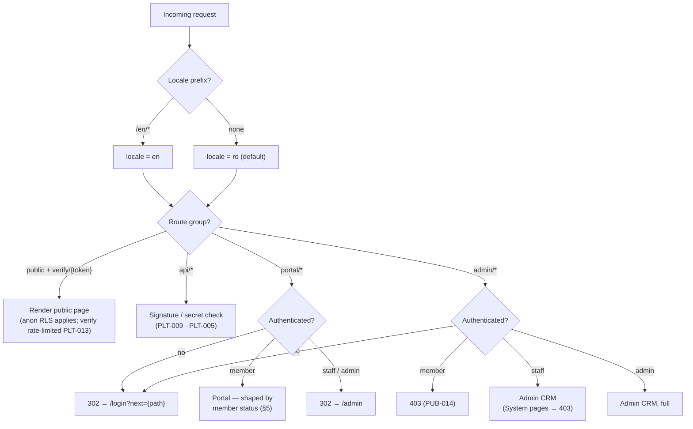

# 05 — Information Architecture (Combined)

> **Purpose:** sitemap, routes, navigation, RBAC, and key-screen wireframes for all three surfaces — **Combined edition**: Fable's structural skeleton (canonical route names, access map, redirects, SEO) deepened with Opus's page-inventory and URL-state craft and Codex's ASCII-wireframe technique, redrawn under the locked canon of `00-foundation.md` and traced to every requirement ID in `04-prd.md`.

**How to read:** §1–§2 are the authoritative route canon (07 cites these routes verbatim; 06 scopes RLS to the access column). §9's wireframes are functional blueprints, not visual design — 08 owns tokens, components, and the card spec they reference. Every route carries the PRD IDs it renders; §2.2 verifies that all **111** requirements (PUB-001..020 · MEM-001..029 · ADM-001..045 · PLT-001..017) have a home.

---

## 1. Sitemap

One Next.js 16 app, three route groups (00 §4.1). Romanian at root, English under `/en`; path segments are English and unlocalized in both locales (00 §4.4). Admin is `ro`-only.

```
PUBLIC (visitor)
├── /                          Home
├── /mission                   Mission & who we are
├── /membership                Tiers, break-even math, live benefits, FAQ
├── /sponsors                  Sponsors showcase
├── /fleet                     Fleet showcase
├── /contact                   Contact & categorized form
├── /join                      Join entry point (tier preselect via ?tier=)
├── /legal/privacy             Privacy policy
├── /legal/terms               Terms of membership
├── /legal/cookies             Cookie notice
├── /legal/accessibility       Accessibility statement (WCAG 2.2 AA target)
└── /verify/{token}            Member-card verification (partner-facing, locale-less)

AUTH (visitor)
├── /login
├── /register
└── /reset-password            (+ confirmation step)

MEMBER PORTAL (role: member)
├── /portal                    Dashboard (status-shaped, §5)
├── /portal/apply              Membership application (pre-member state)
├── /portal/membership         Current membership + history
│   ├── /portal/membership/pay       Payment method & execution
│   ├── /portal/membership/renew     Renewal (founding price-lock applies here)
│   └── /portal/membership/upgrade   Tier upgrade (pro-rated)
├── /portal/payments           Payment history & confirmation PDFs
├── /portal/card               Digital member card (offline-tolerant)
├── /portal/benefits           Benefits catalog (tier-aware, filterable)
├── /portal/announcements      Announcements feed
├── /portal/profile            Profile + avatar + pilot licenses (MEM-023)
└── /portal/settings           Communication preferences, consent history,
                               GDPR export & erasure request

ADMIN CRM (roles: staff, admin — Romanian-only)
├── /admin                     Dashboard, metrics & action queues
├── /admin/reports/renewals    Renewal cohort report                 (new)
├── /admin/members             Member register  → /admin/members/{id}
├── /admin/payments            Payments register, transfer matching,
│                              mismatch & refund handling            (new)
├── /admin/flight-schools      → /admin/flight-schools/{id}
├── /admin/associations        → /admin/associations/{id}
├── /admin/aerodromes          → /admin/aerodromes/{id}
├── /admin/sponsors            → /admin/sponsors/{id}
├── /admin/contracts           → /admin/contracts/{id}
├── /admin/benefits            → /admin/benefits/{id}
├── /admin/campaigns           → /admin/campaigns/{id}
├── /admin/templates           Email templates
├── /admin/send-log            Automated + campaign email log
├── /admin/fleet               → /admin/fleet/{id}
├── /admin/users               Staff & roles                        [admin]
├── /admin/settings            Club settings                        [admin]
└── /admin/audit               Audit log + daily-job run log        [admin]

API (machine)
├── /api/webhooks/stripe       Stripe webhook (PLT-009/014; triggers MEM-007)
└── /api/cron/daily            Scheduled job endpoint (PLT-005/006/015)
```

### 1.1 Placement decisions (Combined deltas)

| Decision | Rationale |
|----------|-----------|
| **Member licenses live on `/portal/profile`** — a "Licențe" section, not a separate route | 04 words MEM-023 as managed "from `/portal/profile`"; licenses are profile facts, and the portal nav stays five items (08 §6). MEM-024 validation runs in the same form; MEM-025 keeps license data off card/verify |
| **`/admin/payments` added** (the only new list module beyond Fable's set) | ADM-039 explicitly adds the payments register to 05's canon; the ADM-006 transfer-matching screen, ADM-044 mismatch resolution, and the `admin`-only ADM-043 refund action are payment-scoped operations, not member-scoped — they need the cross-member view |
| **`/admin/reports/renewals` added** | ADM-045's cohort table is a full-page report, not a dashboard widget; it deep-links from the ADM-001 renewal-rate metric and reconciles with it |
| **PLT-015's run log is a tab of `/admin/audit`** — no new route | Same access profile (`admin`, read-only, system evidence); "Jurnal de audit" and "Rulări job zilnic" tabs |
| **All other ADM-036..045 behaviors sit on existing routes** | ADM-036/041 on member & partner detail, ADM-037/038 on the lists, ADM-040 on the campaign detail, ADM-042 on partner routes |
| **Rejected from Opus** | Localized slugs (`/ro/membri`) — 00 §4.4 locks English unlocalized segments, `ro` at root with no prefix; `/noutati` news + MDX collections, events routes, bookings, member directory, documents vault, aviation-profile page with ratings/medical (out of brief or rejected in 04 §6). Its `pathnames` machinery is unnecessary once slugs don't localize |
| **Rejected from Codex** | `/member/*` naming (canon is `/portal/*`), `/validate/:cardToken` (canon is `/verify/{token}`), the subscriptions/tasks/documents/contacts admin modules (memberships live on the member 360°, follow-ups are the ADM-002 queues, documents attach to their records), `/refund-policy` (dues policy lives in `/legal/terms`) |

---

## 2. Route table

Access: **V** visitor (public) · **M** member · **S** staff · **A** admin (S implies A except where marked **A**). `{id}` = UUID; `{token}` = 22-char card token (00 §6). Detail routes inherit their list's access.

| Route | Page | Access | Primary PRD IDs |
|-------|------|--------|-----------------|
| `/` | Home | V | PUB-001, PUB-005, PUB-017 |
| `/mission` | Mission | V | PUB-002 |
| `/membership` | Tier comparison + break-even + FAQ | V | PUB-003, PUB-004, PUB-005, PUB-016, PUB-017, PUB-019, PUB-020 |
| `/sponsors` | Sponsors showcase | V | PUB-006 |
| `/fleet` | Fleet showcase | V | PUB-007 |
| `/contact` | Contact & categorized form | V | PUB-008, PUB-018, PLT-011 |
| `/join` | Join entry (tier preselect) | V | PUB-009, PUB-017 |
| `/legal/privacy` · `/legal/terms` · `/legal/cookies` | Legal | V | PUB-010 |
| `/legal/accessibility` | Accessibility statement | V | PUB-015 |
| `/verify/{token}` | Card verification | V | PUB-013, PLT-013, PLT-011 |
| `/login` | Login | V | MEM-003, PLT-001, PLT-011 |
| `/register` | Registration | V | MEM-001, PLT-001 |
| `/reset-password` | Password reset | V | MEM-004, PLT-001, PLT-011 |
| `/portal` | Member dashboard | M | MEM-008, MEM-026, MEM-027 |
| `/portal/apply` | Application | M (pre-member) | MEM-002 |
| `/portal/membership` | Membership view + history | M | MEM-011 |
| `/portal/membership/pay` | Payment (card / transfer) | M | MEM-005, MEM-006, MEM-027 |
| `/portal/membership/renew` | Renewal | M | MEM-012, MEM-029 |
| `/portal/membership/upgrade` | Upgrade | M | MEM-013 |
| `/portal/payments` | Payment history + PDFs | M | MEM-014 |
| `/portal/card` | Member card | M | MEM-015, MEM-016, MEM-025 |
| `/portal/benefits` | Benefits catalog | M | MEM-017, MEM-018, MEM-026 |
| `/portal/announcements` | Announcements | M | MEM-020 |
| `/portal/profile` | Profile, avatar, licenses | M | MEM-009, MEM-010, MEM-023, MEM-024, MEM-025 |
| `/portal/settings` | Preferences, consent history, GDPR | M | MEM-019, MEM-021, MEM-022, MEM-028 |
| `/admin` | CRM dashboard & queues | S | ADM-001, ADM-002, PLT-014 (queue surface) |
| `/admin/reports/renewals` | Renewal cohort report | S | ADM-045 |
| `/admin/members` | Member register | S | ADM-003, ADM-011, ADM-037, ADM-038 |
| `/admin/members/{id}` | Member 360° | S | ADM-004, ADM-005, ADM-006, ADM-007, ADM-008, ADM-009 **A**, ADM-010, ADM-035 **A**, ADM-036, ADM-041 |
| `/admin/payments` (+`/{id}`) | Payments register & matching | S | ADM-039, ADM-006, ADM-043 **A**, ADM-044, PLT-014 (anomaly triage) |
| `/admin/flight-schools` (+`/{id}`) | Flight schools | S | ADM-012, ADM-016, ADM-041, ADM-042 |
| `/admin/associations` (+`/{id}`) | Associations | S | ADM-013, ADM-016, ADM-041, ADM-042 |
| `/admin/aerodromes` (+`/{id}`) | Aerodromes | S | ADM-014, ADM-016, ADM-041, ADM-042 |
| `/admin/sponsors` (+`/{id}`) | Sponsors | S | ADM-015, ADM-016, ADM-041, ADM-042 |
| `/admin/contracts` (+`/{id}`) | Contracts | S | ADM-017, ADM-018, ADM-019, ADM-020 |
| `/admin/benefits` (+`/{id}`) | Benefits | S | ADM-021, ADM-022 |
| `/admin/campaigns` (+`/{id}`) | Campaigns & composer | S | ADM-024, ADM-025, ADM-026, ADM-027, ADM-040 |
| `/admin/templates` | Email templates | S | ADM-023 |
| `/admin/send-log` | Send log (lifecycle + campaigns) | S | ADM-028, ADM-026, PLT-004 (evidence), PLT-016 (evidence) |
| `/admin/fleet` (+`/{id}`) | Fleet | S | ADM-029, ADM-030, ADM-031 |
| `/admin/users` | Staff management | **A** | ADM-032, PLT-017 |
| `/admin/settings` | Club settings | **A** | ADM-033 |
| `/admin/audit` | Audit log + job-run log tabs | **A** | ADM-034, PLT-007 (view), PLT-015 (view) |
| `404` / `403` (special files) | Branded error pages | V | PUB-014, PLT-012 |
| `/api/webhooks/stripe` | Webhook | machine (signature) | PLT-009, PLT-014, MEM-007 (trigger) |
| `/api/cron/daily` | Cron | machine (secret header) | PLT-005, PLT-006, PLT-015 (write) |

### 2.1 Cross-cutting requirements (no single route)

These IDs bind everywhere or run server-side; each names its operator-visible surface so nothing is unauditable.

| ID(s) | Nature | Where it manifests |
|-------|--------|--------------------|
| PUB-011 | Locale switching | Header/top bar of every public and portal page; admin excluded (`ro`-only) |
| PUB-012 | SEO basics | Every public page + generated `sitemap.xml`, `robots.txt` (§8) |
| MEM-007 | Activation transaction | Server-side; triggered by PLT-009 webhook or ADM-005/ADM-006 — whichever completes last; visible on `/portal` and the member 360° |
| ADM-038 | Admin list guarantees | Every `/admin/*` list (pagination 50, URL state, filter chips, empty states — §3.2) |
| PLT-001, PLT-002 | Auth + RBAC/RLS | `proxy.ts` network boundary + server-action guards on every gated route; RLS backstop (06) |
| PLT-003 | i18n mechanics | All UI strings from next-intl catalogs; `ro` fallback for bilingual columns |
| PLT-004, PLT-016 | Transactional + onboarding emails | No routes; send evidence filterable at `/admin/send-log` |
| PLT-007 | Audit logging (write) | Insert-only ledger written by every admin mutation and job transition; read at `/admin/audit` |
| PLT-008 | Zod validation | Every form, server action, and webhook payload |
| PLT-010 | Analytics | Public + portal pages; `/verify/{token}` aggregate hit count only |
| PLT-011 | Rate limiting | `/login`, `/reset-password`, `/contact`, `/verify/*` |
| PLT-012 | Empty & error states | Every list view and server-action failure, all surfaces |
| PLT-017 | Role-change propagation | Session revocation platform-wide; per-request role re-validation on `/admin/*` |

### 2.2 Coverage check

Every one of 04's 111 IDs appears in §2 exactly where it renders: **PUB** 20/20 (PUB-011/012/014 via the cross-cutting and error rows), **MEM** 29/29 (MEM-007 is the one member requirement with no URL — it is a server transaction listed against its triggers), **ADM** 45/45 (ADM-036..045 all landed on existing routes except ADM-039 → `/admin/payments` and ADM-045 → `/admin/reports/renewals`), **PLT** 17/17 (webhook/cron under the API routes; the rest cross-cutting with named evidence surfaces). No requirement is homeless; no route exists without a requirement.

### 2.3 URL & i18n rules

- Locale prefix applies to **public and portal** routes: `/membership` (ro) ↔ `/en/membership`. Path segments are English and unlocalized in both locales (00 §4.4) — Opus's localized-slug scheme is explicitly rejected.
- `/admin/*` renders `ro` only and takes no `/en` prefix (PLT-003); `/en/admin/*` redirects to `/admin/*` (§7).
- `/verify/{token}` is locale-less and renders bilingually on one screen (08 §7.5).
- No public entity slugs in v1 — partners/aircraft have no public detail pages; admin uses UUIDs.
- Tier slugs in URLs: `cadet` · `pilot` · `captain` (e.g. `/join?tier=captain`) — English segments even for Căpitan; the UI label localizes, the URL does not.

---

## 3. Page conventions *(craft adopted from Opus)*

### 3.1 Public page inventory

| Page | Route | Intent | Content source | Render |
|------|-------|--------|----------------|--------|
| Home | `/` | Sell the promise, route to `/join` | Catalogs + live: Gold sponsors, founding counter | SSR, cacheable ≤ 60 s (counter, PUB-017) |
| Mission | `/mission` | Trust: why we exist, legal identity | next-intl catalogs (static) | Static |
| Membership | `/membership` | Conversion: tiers, break-even, FAQ | Catalogs + live benefits (PUB-004) + counter | SSR, cacheable ≤ 60 s |
| Sponsors | `/sponsors` | Reciprocity: sponsor showcase | Live: `active` contract + `visible_on_site` | SSR |
| Fleet | `/fleet` | Aspiration: aircraft gallery | Live: `active` + public aircraft | SSR |
| Contact | `/contact` | Intake with categories | `club_settings` + catalogs | SSR |
| Join | `/join` | Funnel start | Catalogs + tier preselect + counter | SSR |
| Legal ×4 | `/legal/*` | Compliance | Catalogs (versioned copy) | Static |
| Verify | `/verify/{token}` | Partner-facing verdict | Live member/card status | SSR, ≤ 60 s cache, `noindex` |

Portal and admin pages inherit their shells (§4) and are never cached across users (04 §5). Auth pages use a focused shell without marketing navigation.

### 3.2 Breadcrumbs & URL state

- **Public:** flat, no breadcrumbs — any page ≤ 2 clicks from home.
- **Portal:** no breadcrumbs; sub-pages of `/portal/membership` carry a back link to their parent; the join/pay sequence shows a step indicator (Cont → Email → Cerere → Plată).
- **Admin:** breadcrumb `Listă / Înregistrare` on every detail page (e.g. `Membri / Ion Popescu`). List state — search, filters, sort, page — lives in the URL query per ADM-038 (`/admin/members?status=grace&tier=pilot&sort=-ends_on&page=2`), shareable and back-button safe; active filters render as clearable chips.
- **Tab deep links:** detail tabs address via `?tab=` (e.g. `/admin/members/{id}?tab=payments`), so ADM-002 queue items land on the exact pane.
- **Reserved params:** `?tier=` (join preselect) · `?next=` (post-login return) · `?tab=` (detail panes) · list-state params above. Nothing else goes in URLs; tokens never appear in query strings.

---

## 4. Navigation model

**Public header** (08 §6): logo → `/` · Misiune · Niveluri · Sponsori · Flotă · Contact · locale switcher (RO/EN, preserves route) · Autentificare · **Înscriere** (accent button, the single accent per region). **Footer:** nav repeat, legal links incl. `/legal/accessibility` in the consistent-help position (PUB-015), contact details from `club_settings`, Gold sponsor strip, no-tracker note (Plausible).

**Portal nav** (top bar on desktop; bottom tabs on mobile): Panou · Abonament · Card · Beneficii · Profil — plus the avatar menu (Setări = preferences & privacy, Deconectare). A persistent status banner renders for `pending` (awaiting payment/approval) and `grace` (days left + accent Renew) states; `expired` swaps the primary action to Rejoin everywhere (MEM-026).

**Admin sidebar** (grouped exactly per 08 §6 — the seven groups are locked; Combined places the two new pages inside them):

| Group | Items (ro labels) | Routes |
|-------|-------------------|--------|
| Overview | Tablou de bord · Raport reînnoiri | `/admin`, `/admin/reports/renewals` |
| People | Membri · **Plăți** | `/admin/members`, `/admin/payments` |
| Partners | Școli de zbor · Asociații · Aerodromuri · Sponsori | `/admin/flight-schools` … `/admin/sponsors` |
| Agreements | Contracte · Beneficii | `/admin/contracts`, `/admin/benefits` |
| Comms | Campanii · Șabloane · Jurnal de trimiteri | `/admin/campaigns`, `/admin/templates`, `/admin/send-log` |
| Fleet | Aeronave | `/admin/fleet` |
| System *(admin only)* | Utilizatori · Setări · Audit | `/admin/users`, `/admin/settings`, `/admin/audit` |

The payments register sits under **People** because every payment row deep-links to its member; it is the money view of the same population. Admin top bar: global search (members by name/email/`ASC-YYYY-NNNN`, partners, aircraft by registration), then the user menu. System group renders only for `admin` — hidden, not disabled (00 §5 has no per-module grants to tease).

---

## 5. State-dependent portal access

A logged-in member's portal is shaped by `member_status` (00 §7.2):

| Status | Portal behavior |
|--------|-----------------|
| *(no application yet)* | Only `/portal/apply` (plus profile/settings); nav prompts the application |
| `pending` | Dashboard shows awaiting payment/approval and **resumes at the exact incomplete step** (MEM-027 — same Checkout intent, same `ASC-P-NNNNN` reference); card page shows "not yet issued" |
| `active` | Everything; Renew appears from T−30 (MEM-012) |
| `grace` | Everything + warning banner with days remaining; Renew is the primary action everywhere; card stays valid (00 §3.2) |
| `expired` | Card renders grayscale + "Expirat / Expired" (08 §7.3); benefits locked with rejoin prompt, redemption notes unreadable (MEM-026); history/profile/settings intact; Rejoin = fresh anniversary |
| `archived` | Login allowed; read-only history + GDPR self-service only; card verifies invalid |

---

## 6. RBAC access map

Role × area (roles locked in 00 §5). ✔ = full per PRD; **R** = read-only; — = no access (403).

| Area | visitor | member | staff | admin |
|------|---------|--------|-------|-------|
| Public pages, `/verify/{token}` | ✔ | ✔ | ✔ | ✔ |
| Auth pages | ✔ | ✔ (logout) | ✔ | ✔ |
| Portal (own data only, RLS-scoped) | — | ✔ | — * | — * |
| Admin dashboard, queues, cohort report | — | — | ✔ | ✔ |
| Members management (incl. licenses, notes, bulk) | — | — | ✔ | ✔ |
| Manual membership adjustment (ADM-009) | — | — | — | ✔ |
| Payments register & transfer matching (ADM-039/006/044) | — | — | ✔ | ✔ |
| Refund recording (ADM-043) | — | — | — | ✔ |
| Partners (schools/associations/aerodromes/sponsors) | — | — | ✔ | ✔ |
| Contracts & benefits | — | — | ✔ | ✔ |
| Campaigns, templates, send log | — | — | ✔ | ✔ |
| Fleet | — | — | ✔ | ✔ |
| Users (ADM-032) | — | — | — | ✔ |
| Club settings (ADM-033) | — | — | — | ✔ |
| Audit log + job-run log (ADM-034, PLT-015) | — | — | — | ✔ (**R** by design — insert-only) |
| GDPR erasure execution (ADM-035) | — | — | — | ✔ |

\* Staff/admin are not members in v1; `/portal/*` redirects them to `/admin`.

Enforcement is dual-layer (PLT-002): the Next.js network boundary (`proxy.ts`, Next 16) plus per-request server-action guards — admin surfaces re-validate the role server-side on every request so demotion has no stale-claim window (PLT-017) — with Supabase RLS as the data backstop (06 §RLS). The decision every request goes through:



---

## 7. Redirects & error handling

| Situation | Behavior |
|-----------|----------|
| Anonymous → any `/portal/*` or `/admin/*` | Redirect to `/login?next={path}` |
| `member` → `/admin/*` | 403 page (PUB-014) explaining the role requirement |
| `staff`/`admin` → `/portal/*` | Redirect to `/admin` |
| Logged-in `active` member → `/join` | Redirect to `/portal` (PUB-009) |
| `/en/admin/*` | Redirect to `/admin/*` — admin takes no locale prefix (§2.3) |
| `/join?tier={unknown slug}` | Render `/join` with no tier preselected — never an error |
| Unknown route | Localized, branded 404 (PUB-014) with a path back home |
| Unknown or revoked `{token}` | `/verify` renders the invalid verdict, HTTP 200, indistinguishable from never-existed (PUB-013, PLT-013) |
| Rate limit tripped on `/verify/*` | HTTP 429, logged (PLT-013) |
| Legacy/trailing-slash URLs | 301 to canonical form |
| Server-action failure | Localized error toast, persists until dismissed (PLT-012, 08 §6) |

---

## 8. SEO, meta & JSON-LD

- **Title pattern:** `{Page} — Aeroskill Club`; home: `Aeroskill Club — Zbori mai mult. Plătești mai puțin. Aparții.` (01 §1, per locale).
- **hreflang:** pairs `ro-RO` ↔ `en` on all public routes, `x-default` → `ro` (root, unprefixed); canonical = self per locale — alternates, not duplicates (PUB-011).
- **OG:** unique title/description per public page and locale; branded card-motif default OG image (PUB-012).
- **Crawl control:** generated `sitemap.xml` lists public routes only, each entry with its alternate-locale link; `robots.txt` disallows `/portal`, `/admin`, `/verify`, `/api`; those routes also emit `noindex` (PUB-012).
- **JSON-LD:** `Organization` with `nonprofitStatus` on `/`; `Offer` markup for the three tiers on `/membership` — price in RON, `priceValidUntil` tied to the 60-day general-assembly notice (02 §7); `FAQPage` on `/membership` ships with PUB-020's FAQ and is cut if the FAQ is cut. No review/rating or `Event`/`Article` markup — nothing backs it in v1.
- **Analytics:** Plausible on public + portal, no personal data in events; `/verify/{token}` carries an aggregate hit count only (PLT-010).

---

## 9. Key-screen wireframes *(technique adopted from Codex, redrawn to Combined canon)*

Twelve screens — the funnel, the flagship credential, and the CRM's operational core. Conventions: boxes are content zones, not pixels; `[...]` = interactive control; `(...)` = annotation; `[● Label]` = status chip per 08 §6.1; double-edged box = the accent/recommended element. Portal screens are drawn mobile-first (00 §8: the card lives on a phone); admin screens desktop (staff work at a desk). All copy shown is Romanian-first per surface rules; amounts and dates are UI-formatted (00 §7.3).

### 9.1 Home — `/` (PUB-001, PUB-005, PUB-006, PUB-011, PUB-017)

```text
+------------------------------------------------------------------------+
| [AEROSKILL ✈ CLUB]   Misiune  Niveluri  Sponsori  Flotă  Contact       |
|                                     [RO|EN]  Autentificare  [ÎNSCRIERE] |
+------------------------------------------------------------------------+
|  Zbori mai mult. Plătești mai puțin. Aparții.                          |
|  Clubul de aviație generală al României.                               |
|                                                                        |
|   +--------------+   +==============+   +--------------+              |
|   | CADET        |   || PILOT      ||   | CĂPITAN      |              |
|   | 3.000 RON/an |   || 4.500 RON/an||  | 6.000 RON/an |              |
|   +--------------+   +==============+   +--------------+              |
|          [ Devino membru ]        [ Compară nivelurile ]               |
+------------------------------------------------------------------------+
|  Membri fondatori: au mai rămas 17 din 50 de locuri — preț blocat      |
|  2 ani (dispare automat la 0; niciodată negativ — PUB-017)             |
+------------------------------------------------------------------------+
|  SPONSORI GOLD  (doar contract activ + visible_on_site; altfel         |
|  secțiunea lipsește complet)                                           |
|  [logo]   [logo]   [logo]                            → /sponsors       |
+------------------------------------------------------------------------+
|  Footer: nav · /legal/* · Declarație de accesibilitate · contact ·     |
|  bandă sponsori Gold · fără bannere de cookie (Plausible)              |
+------------------------------------------------------------------------+
```

### 9.2 Membership — `/membership` (PUB-003, PUB-004, PUB-005, PUB-016, PUB-019, PUB-020)

```text
+------------------------------------------------------------------------+
| NIVELURI DE MEMBRU                                                     |
|  +----------------+   +==================+   +----------------+       |
|  | CADET          |   || PILOT          ||   | CĂPITAN        |       |
|  | 3.000 RON/an   |   || 4.500 RON/an   ||   | 6.000 RON/an   |       |
|  | card, reduceri |   || reduceri mărite||   | reduceri maxime|       |
|  | de bază, eveni-|   || tarife flotă,  ||   | primul la flotă|       |
|  | mente, newslet.|   || 2 invitați/an  ||   | 4 invitați/an, |       |
|  |                |   || „Recomandat    ||   | concierge      |       |
|  | [Alege Cadet]  |   || piloților      ||   | [Alege Căpitan]|       |
|  |                |   || activi"        ||   |                |       |
|  |                |   || [Alege Pilot]  ||   |                |       |
|  +----------------+   +==================+   +----------------+       |
|  CTA → /join?tier={slug} — nivelul se transmite preselectat            |
+------------------------------------------------------------------------+
| MATEMATICA RECUPERĂRII (PUB-019 — exemple ilustrative, 02 §3)          |
|  Elev pilot (Cadet): −10% la pachetul de școală ≈ 2.500 RON ≈ cotizația|
|  Pilot chiriaș ~20 h/an (Pilot): reduceri + taxe de aterizare ≈ prag   |
|  (nicio categorie fără contract semnat nu apare aici)                  |
+------------------------------------------------------------------------+
| BENEFICII DIN DATE LIVE (PUB-004/016) — grupate pe tip de partener     |
|  Școli de zbor: −10% pachet PPL ......................... [min. Cadet] |
|  Aerodromuri:   taxe de aterizare 0 ..................... [min. Pilot] |
|  (fără detalii de răscumpărare pe public — CTA: [Înscrie-te])          |
+------------------------------------------------------------------------+
| Fondatori: 17/50 · FAQ (PUB-020): reînnoire T−30, grație 30 z, card    |
| sau transfer, upgrade oricând, downgrade doar la reînnoire, cotizație  |
| nerambursabilă                                                         |
+------------------------------------------------------------------------+
```

### 9.3 Join — `/join` (PUB-009, PUB-017 → MEM-001/002)

```text
+--------------------------------------------------+
| ÎNSCRIERE                        pasul 1 din 4   |
| Cont → Confirmare email → Cerere → Plată         |
+--------------------------------------------------+
| Nivelul tău:                                     |
|  ( ) Cadet 3.000 RON   (x) Pilot 4.500 RON       |
|  ( ) Căpitan 6.000 RON     (preselectat ?tier=)  |
+--------------------------------------------------+
| Email   [____________________________]           |
| Parolă  [____________________________]           |
|         (min. 10 caractere, verificare breșe)    |
| [ Creează cont ]                                 |
| Ai deja cont? [Autentificare]                    |
+--------------------------------------------------+
| Oferta de fondator apare doar dacă locuri > 0    |
| (PUB-017). Membru activ autentificat → /portal.  |
| Cererea (MEM-002) continuă în /portal/apply după |
| confirmarea emailului.                           |
+--------------------------------------------------+
```

### 9.4 Verification result — `/verify/{token}` (PUB-013, PLT-013) — mobile, partner-facing

```text
        VALID                          INVALID
+-----------------------+     +-----------------------+
| AEROSKILL CLUB        |     | AEROSKILL CLUB        |
|                       |     |                       |
|   MEMBRU ACTIV        |     |   CARD INVALID /      |
|   ACTIVE MEMBER       |     |   EXPIRAT             |
|   (verde succes)      |     |   (roșu danger)       |
|                       |     |                       |
|  Ion P.               |     |  (fără date de membru |
|  [● Pilot]            |     |   — necunoscut și     |
|  Valabil până la      |     |   revocat arată       |
|  14.03.2027           |     |   identic, PLT-013)   |
|                       |     |                       |
|  Verificat la         |     |  Verificat la         |
|  06.07.2026, 14:32    |     |  06.07.2026, 14:32    |
+-----------------------+     +-----------------------+
  bilingv pe un singur ecran · fără login · SSR live,
  cache ≤ 60 s · `active` sau `grace` = valid · fără
  alte date personale · HTTP 200 în ambele cazuri
```

### 9.5 Portal dashboard — `/portal` (MEM-008, MEM-026, MEM-027) — mobile

```text
+--------------------------------+
| [ASC]      [● Grație]    (RO)  |
+--------------------------------+
| Salut, Ion                     |
| Pilot · valabil până la        |
| 14.03.2027                     |
|                                |
| !  Perioadă de grație:         |
|    mai ai 12 zile              |
| [ REÎNNOIEȘTE ACUM ]  (accent) |
+--------------------------------+
| Cardul meu          [vezi] →   |
+--------------------------------+
| Anunțuri (MEM-020)             |
|  · Fly-in Clinceni — 20.09     |
|  · Partener nou: LRTZ          |
+--------------------------------+
| stări alternative:             |
|  pending → „Reia plata" exact  |
|  la pasul rămas (MEM-027)      |
|  expired → [ REÎNSCRIE-TE ]    |
|  (an aniversar nou, MEM-026)   |
+--------------------------------+
| Panou | Abonam. | Card | Benef.|
+--------------------------------+
```

### 9.6 Member card — `/portal/card` (MEM-015, MEM-016) — mobile, the flagship screen

```text
+----------------------------------------+
| Card de membru                         |
|                                        |
| +------------------------------------+ |
| | [ASC alb]                [● PILOT] | |  fundal navy-900,
| |                                    | |  motiv orizont
| |  ION POPESCU                       | |
| |  ASC-2026-0142        (mono, sky)  | |
| |  [MEMBRU FONDATOR]    (auriu)      | |
| |                                    | |
| |  Valabil până la        +-------+  | |
| |  14.03.2027             |  QR   |  | |
| |  Valid until            +-------+  | |
| |                        ≥160px, M   | |
| +------------------------------------+ |
|   QR → https://…/verify/{token}        |
+----------------------------------------+
| Beneficiile nivelului Pilot →          |
| grație: „Abonament în perioada de      |
| grație până la 13.04.2027 —            |
| [Reînnoiește]" (08 §7.2)               |
| „Acesta este un card de membru, nu o   |
|  licență de zbor."                     |
| offline: ultima variantă din cache;    |
| verificarea e mereu live (MEM-016)     |
| expirat: tot cardul gri + „Expirat /   |
| Expired" (08 §7.3)                     |
+----------------------------------------+
```

### 9.7 Benefits catalog — `/portal/benefits` (MEM-017, MEM-018, MEM-026)

```text
+--------------------------------------------------------------+
| Beneficii                                                     |
| Filtre: [Tip partener v]  [x] Doar disponibile nivelului meu  |
+--------------------------------------------------------------+
| +--------------------------+  +--------------------------+   |
| | −10% pachet PPL          |  | Taxe de aterizare 0      |   |
| | Școala X — școală de zbor|  | Aerodrom LRCN — aerodrom |   |
| | [min. Cadet]             |  | [min. Pilot]             |   |
| | Răscumpărare: arată      |  | Răscumpărare: arată      |   |
| | cardul la recepție       |  | cardul                   |   |
| +--------------------------+  +--------------------------+   |
| +--------------------------+                                 |
| | [blocat] Concierge       |  peste nivelul meu:             |
| | charter — [min. Căpitan] |  [ Fă upgrade → /portal/        |
| | (fără notă de răscump.)  |    membership/upgrade ]         |
| +--------------------------+                                 |
+--------------------------------------------------------------+
| catalogul = exact starea de publicare din CRM (ADM-021/022)   |
| expirat: totul blocat + [Reînscrie-te], fără note (MEM-026)   |
+--------------------------------------------------------------+
```

### 9.8 Payment — `/portal/membership/pay` (MEM-005, MEM-006, MEM-027)

```text
+---------------------------------------------------+
| Plata abonamentului                               |
| Pilot — an aniversar până la 14.03.2027           |
| Total: 4.500 RON  (sumă exactă, RON întregi)      |
+---------------------------------------------------+
| ( ) Card — Stripe Checkout (SCA/3-DS inclus)      |
| (x) Transfer bancar                               |
+---------------------------------------------------+
| INSTRUCȚIUNI TRANSFER (MEM-006)                   |
|  Beneficiar: Asociația Aeroskill Club             |
|  IBAN:       RO49 AAAA 1B31 0075 9384 0000        |
|  Sumă:       4.500 RON                            |
|  Referință:  ASC-P-00347   (obligatorie în        |
|              detaliile plății!)                   |
|  Stare: [● În așteptare] — confirmăm după         |
|  potrivirea extrasului de către club              |
+---------------------------------------------------+
| Reluare (MEM-027): la redeschidere, ACEEAȘI       |
| referință ASC-P-00347 — niciodată una nouă.       |
| Checkout eșuat/anulat → reîncearcă cu card sau    |
| alege transfer; confirmarea vine DOAR prin        |
| webhook semnat (PLT-009), nu prin redirect.       |
+---------------------------------------------------+
```

### 9.9 Admin dashboard & queues — `/admin` (ADM-001, ADM-002)

```text
+------------------------------------------------------------------------+
| ASC Admin   Căutare globală [__________________]        (ro-only)  ▾   |
+-------------+----------------------------------------------------------+
| Overview    |  TABLOU DE BORD                                          |
|  Tablou de  |  Membri activi 312 (Cadet 118 · Pilot 152 · Căpitan 42)  |
|   bord      |  În grație 9 · Venit YTD 1.183.500 RON (doar confirmate) |
|  Raport     |  Rată reînnoire 12 luni 78% → /admin/reports/renewals    |
|   reînnoiri |  Contracte active 14 · Sponsori publici 6      (ADM-001) |
| People      +----------------------------------------------------------+
|  Membri     |  COZI DE LUCRU (ADM-002) — fiecare rând = deep-link      |
|  Plăți      |   Cereri în așteptare ................  4  →             |
| Partners    |   Transferuri de confirmat ...........  7  →             |
|  Școli de   |   Nepotriviri de sumă (ADM-044) ......  1  →             |
|   zbor      |   Anomalii webhook (PLT-014) .........  0  (stare goală) |
|  Asociații  |   Contracte care expiră ≤ 60 z .......  2  →             |
|  Aerodromuri|   Documente aeronave ≤ 60 z ..........  3  →             |
|  Sponsori   +----------------------------------------------------------+
| Agreements  |  cifrele reconciliază exact cu listele filtrate          |
| Comms       |  echivalent (ADM-001); System vizibil doar pentru admin  |
| Fleet       |                                                          |
| System [A]  |                                                          |
+-------------+----------------------------------------------------------+
```

### 9.10 Member 360° — `/admin/members/{id}` (ADM-004, ADM-005/006/007/008/010, ADM-036, ADM-041)

```text
+------------------------------------------------------------------------+
| Membri / Ion Popescu                                      (breadcrumb) |
+------------------------------------------------------------------------+
| ION POPESCU    ASC-2026-0142     [● Activ] [Pilot] [Fondator]          |
| [Editează] [Confirmă plata] [Reemite token] [Ajustează (A)] [Arhivează]|
+------------------------------------------------------------------------+
| Abonament: Pilot → 14.03.2027    | Ultima plată: 4.500 RON [● Confirmat]|
| Card: token activ → /verify/…    | Consimțământ marketing: DA, 12.01.26 |
+------------------------------------------------------------------------+
| [Prezentare][Abonamente][Plăți][Card][Licențe][Consimțăminte][Notițe]  |
| [Trimiteri]                                    (?tab= deep-link, §3.2) |
|                                                                        |
|  Licențe (ADM-036):                                                    |
|   PPL(A) · AACR · RO.FCL.12345 · exp. 30.09.2026                       |
|   ULM    · SAUM · —            · —      (perechea tip/autoritate se    |
|   validează la salvare identic cu portalul — MEM-024)                  |
|                                                                        |
|  Notițe interne (ADM-041): autor + timestamp; DOAR în CRM — niciodată  |
|  în portal, pe public sau în emailuri                                  |
|                                                                        |
|  Acțiuni de pe această pagină: aprobare/respingere cerere (ADM-005),   |
|  corecții cu diff în audit (ADM-007), arhivare cu confirmare tastată   |
|  (ADM-008), ajustare abonament cu motiv [admin] (ADM-009), ștergere    |
|  GDPR [admin], ireversibilă, cu email de finalizare (ADM-035)          |
+------------------------------------------------------------------------+
```

### 9.11 Contract detail — `/admin/contracts/{id}` (ADM-017, ADM-018, ADM-019, ADM-020, ADM-022)

```text
+------------------------------------------------------------------------+
| Contracte / CTR-2026-012                                               |
+------------------------------------------------------------------------+
| CTR-2026-012 · Sponsorizare · Aerotech SRL (sponsor)     [● Activ]     |
| !  Expiră în 43 de zile — alertă trimisă la 60 z, urmează 30 z         |
| [Editează] [Încarcă PDF] [Termină contractul (motiv obligatoriu)]      |
+------------------------------------------------------------------------+
| Perioadă: 01.09.2025 → 31.08.2026     Valoare: 25.000 RON (Silver)     |
| Contraparte: exact UNA dintre cele 4 tipuri (school/assoc/aerodrome/   |
| sponsor — CHECK în schemă, 00 §6)     Tip: sponsorizare                |
+------------------------------------------------------------------------+
| Documente (ADM-019): contract-semnat.pdf · 2,1 MB · storage privat,    |
| descărcabil doar staff/admin · PDF ≤ 10 MB                             |
+------------------------------------------------------------------------+
| Beneficii legate (ADM-022):                                            |
|   „Logo pe comunicările membrilor"  [● Activ]  → /admin/benefits/{id}  |
|   La expirare/terminare, cascada retrage automat beneficiile de pe     |
|   public + portal și re-evaluează vizibilitatea sponsorului (PUB-006)  |
+------------------------------------------------------------------------+
| draft → active → expired/terminated (00 §7.2); expirarea o face jobul  |
| zilnic (PLT-006); orice tranziție e audit-logată                       |
+------------------------------------------------------------------------+
```

### 9.12 Campaign composer — `/admin/campaigns/{id}` (ADM-024, ADM-025, ADM-026, ADM-027, ADM-040)

```text
+------------------------------------------------------------------------+
| Campanii / Ciornă nouă                                    [● Ciornă]   |
+------------------------------------------------------------------------+
| Tip:  (x) Email    ( ) Anunț — doar în portal, fără email (ADM-027)    |
| Subiect: [Fly-in Clinceni — 20 septembrie__________________]           |
| Corp (rich text):                                                      |
| [__________________________________________________________]          |
+------------------------------------------------------------------------+
| AUDIENȚĂ:  ( ) Toți membrii   (x) După nivel: [x Pilot][x Căpitan]     |
|            ( ) După status: [ activ ][ grație ]                        |
| Număr live: 194 potriviți · −118 fără consimțământ marketing           |
| (doar email) · −0 arhivați  →  76 de trimis                            |
| (re-rezolvat pe date live LA TRIMITERE — numărul de la compunere e     |
|  doar estimativ; înregistrarea de la trimitere e autoritativă, ADM-040)|
+------------------------------------------------------------------------+
| [ Trimite test către staff (ADM-025) ]   [ Programează ]  [ Trimite ]  |
+------------------------------------------------------------------------+
| ciclu: draft → scheduled → sent (imutabil după trimitere; anulare      |
| permisă doar înainte) · un rând campaign_sends per destinatar ·        |
| reîncercare doar pe subsetul eșuat (ADM-026) · fiecare email de        |
| marketing conține link de dezabonare (MEM-019)                         |
+------------------------------------------------------------------------+
```

---

*Merged from: Fable `05-information-architecture.md` (sitemap, route canon, nav model, state-dependent access, RBAC map, redirects, SEO/JSON-LD, routing diagram), Opus `05-information-architecture.md` (page-inventory rigor, breadcrumb/URL-state conventions, hreflang discipline — its localized slugs, news/events/bookings/directory routes rejected per 00 §0/§4.4/§9), Codex `05. aeroskill-club-v1-information-architecture.md` (ASCII-wireframe technique and screen-state discipline — redrawn here for the locked tiers 3000/4500/6000 RON, statuses of 00 §7.2, and identifier formats `ASC-YYYY-NNNN` / `ASC-P-NNNNN` / `CTR-YYYY-NNN`). All requirement IDs trace to Combined `04-prd.md`; no new external claims.*
