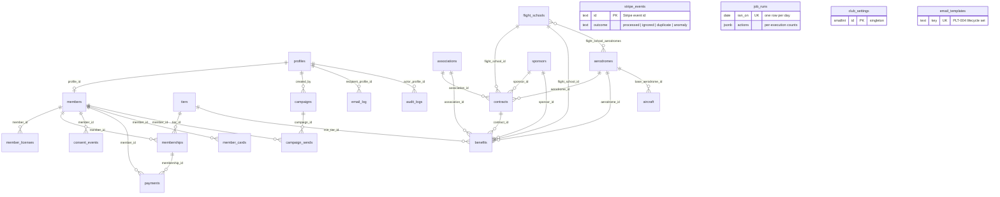

# 06 — Database Schema (Combined)

> **Purpose:** the complete Postgres data model for Supabase — enums, tables, relationships, ERD, index catalog, deletion/archive policy, and RLS — **Combined edition**. Structure: **Fable's** schema skeleton kept intact (its 20-table catalogue, membership-overlap exclusion constraint, `payments.reference_code`, one-unrevoked-card rule, `verify_card()` RPC, JWT-claim RLS with initPlan-cached policies, real-aerodrome seeds). Craft: **Opus's** constraint engineering, role×table CRUD matrix, and column-masking technique (applied here to `members.date_of_birth`). Breadth: **Codex's** explicit index catalog, deletion/archive policy table, and idempotent provider-events pattern (extended onto Fable's `stripe_events`, name kept). Additions beyond Fable are driven only by `04-prd.md`'s Combined requirements: `member_licenses` (MEM-023..025, ADM-036), `job_runs` (PLT-015), `consent_events` (MEM-028), and the column/constraint deltas each new requirement forces. Names and enum values are locked in `00-foundation.md` §6–§7; `07-user-flows.md` references these tables verbatim.

---

## 1. Conventions

- Tables: **snake_case, plural**, exactly as the 00 §6 glossary. Columns: snake_case.
- PKs: `id uuid DEFAULT gen_random_uuid()` unless noted (`tiers` and `club_settings` use smallint; `audit_logs` and `consent_events` use bigserial).
- Money: **integer whole RON** (00 §4.3), columns suffixed `_ron`. No currency column — RON is the single v1 currency. Day-granular dates: `date`; instants: `timestamptz`.
- Every mutable table has `created_at timestamptz DEFAULT now()` and `updated_at` (trigger-maintained) — omitted from the column tables below for brevity. Append-only tables (`audit_logs`, `consent_events`, `stripe_events`, `campaign_sends`, `email_log`) carry `created_at`/`sent_at`/`processed_at` only.
- Polymorphic partner references use **one nullable FK per partner type + `CHECK` exactly-one** (00 §6). Chosen over Opus's party-supertype model — rejected per 00 §0: there are exactly four fixed partner types, each with different fields, and native FK integrity wins at this scale (≤ 200 partners, 04 §5). Applied identically in `contracts` and `benefits`.
- `auth.users` is Supabase-managed; `profiles` is its 1:1 public mirror.
- Identifier formats per 00 §6: member number `ASC-YYYY-NNNN`, payment reference `ASC-P-NNNNN`, card token 22-char URL-safe, contract number `CTR-YYYY-NNN`. All generated by `security definer` functions over per-year sequences — race-safe, never reused.

## 2. Enums registry

Values for the first fifteen types are locked in 00 §7.2 — including the two licensing enums adopted from Opus's domain research. The last three are **schema-local** (00 §7.2 delegates them here).

```sql
CREATE TYPE role               AS ENUM ('member','staff','admin');
CREATE TYPE member_status      AS ENUM ('pending','active','grace','expired','archived');
CREATE TYPE membership_status  AS ENUM ('pending','active','grace','expired','cancelled');
CREATE TYPE payment_method     AS ENUM ('card','bank_transfer');
CREATE TYPE payment_status     AS ENUM ('pending','confirmed','failed','refunded');
CREATE TYPE contract_status    AS ENUM ('draft','active','expired','terminated');
CREATE TYPE contract_type      AS ENUM ('partnership','sponsorship','service');
CREATE TYPE partner_type       AS ENUM ('flight_school','association','aerodrome','sponsor');
CREATE TYPE sponsor_package    AS ENUM ('bronze','silver','gold');
CREATE TYPE campaign_kind      AS ENUM ('email','announcement');
CREATE TYPE campaign_status    AS ENUM ('draft','scheduled','sent','cancelled');
CREATE TYPE aircraft_status    AS ENUM ('active','maintenance','retired');
CREATE TYPE aircraft_ownership AS ENUM ('owned','leased','partner');
CREATE TYPE license_type       AS ENUM ('ppl_a','lapl_a','cpl_a','glider','ulm','other');
CREATE TYPE license_authority  AS ENUM ('aacr','saum','foreign_easa');
-- schema-local (defined here, per 00 §7.2):
CREATE TYPE pilot_status       AS ENUM ('enthusiast','student','licensed');
CREATE TYPE payment_purpose    AS ENUM ('new','renewal','upgrade');
CREATE TYPE send_status        AS ENUM ('sent','failed');
```

Enum discipline (Opus craft, kept): controlled vocabularies that never change at runtime are Postgres enums — cheap, indexable, self-documenting. Vocabularies that staff edit at runtime (tiers, aerodromes, partners, email templates) are **tables**, never enums. `partner_type` exists as an enum only for filter parameters and Zod schemas — the partner reference itself is always a real FK, so the enum never carries integrity.

## 3. Table catalogue

**24 tables**: Fable's catalogue (21 including the `flight_school_aerodromes` join) plus `member_licenses`, `job_runs`, and `consent_events`.

### 3.1 Identity & access

**`profiles`** — 1:1 with `auth.users`; every authenticated person, member and staff alike (PLT-001, ADM-032).

| Column | Type | Null | Default / constraints |
|--------|------|------|-----------------------|
| id | uuid | no | PK, FK → `auth.users(id)` ON DELETE CASCADE |
| email | text | no | UNIQUE; mirror of auth email, kept in sync |
| full_name | text | no | |
| role | role | no | `'member'`; copied into the JWT by the auth hook (§7.1) |
| locale | text | no | `'ro'`, CHECK in (`'ro'`,`'en'`) — drives email locale (PLT-004) |
| avatar_path | text | yes | Supabase Storage path (MEM-010) |
| active | boolean | no | `true` — staff deactivation (ADM-032, PLT-017) |

**`club_settings`** — the operational singleton (ADM-033).

| Column | Type | Null | Notes |
|--------|------|------|-------|
| id | smallint | no | PK, CHECK (id = 1) |
| club_name, contact_email, contact_phone, address | text | no | used in emails, legal pages, contact page (PUB-008) |
| iban, bank_name, beneficiary_name | text | no | bank-transfer instructions (MEM-006) |
| updated_by | uuid | yes | FK → profiles |

### 3.2 Membership & billing

**`tiers`** — seeded, matches 00 §3.1 exactly; edited only by `admin`, never deleted (statutory member categories, 00 §2).

| Column | Type | Null | Notes |
|--------|------|------|-------|
| id | smallint | no | PK (1, 2, 3) |
| slug | text | no | UNIQUE: `cadet` / `pilot` / `captain` |
| name_ro / name_en | text | no | Cadet/Cadet · Pilot/Pilot · Căpitan/Captain |
| rank | smallint | no | UNIQUE: 1 / 2 / 3 — min-tier comparisons (PUB-004, MEM-017) |
| annual_price_ron | integer | no | 3000 / 4500 / 6000 (00 §3.1) |
| active | boolean | no | `true` |

**`members`** — the club-member record: application data + lifecycle status; 1:1 with a profile. This table is the OG 26/2000 member register in operational form (00 §2).

| Column | Type | Null | Notes |
|--------|------|------|-------|
| id | uuid | no | PK |
| profile_id | uuid | no | FK → profiles, UNIQUE — RLS anchor column |
| member_number | text | yes | UNIQUE, `ASC-YYYY-NNNN` (00 §6); null until first activation (MEM-007) |
| status | member_status | no | `'pending'`; mirrors latest membership (PLT-006) |
| phone | text | no | MEM-002 |
| county | text | no | |
| date_of_birth | date | no | **masked column** — staff read year only (§7.5) |
| pilot_status | pilot_status | no | MEM-002 |
| founding_member | boolean | no | `false`; set inside the activation transaction (MEM-007, PUB-017) |
| first_activated_on | date | yes | set once at first activation — drives the founding price-lock window (MEM-029), cohort grouping (ADM-045), and the day-3 onboarding send (PLT-016) |
| terms_accepted_at | timestamptz | no | |
| marketing_consent | boolean | no | `false` (MEM-019); current value — history in `consent_events` |
| consent_updated_at | timestamptz | yes | |
| erasure_requested_at | timestamptz | yes | MEM-022 queue flag |
| rejected_at | timestamptz | yes | ADM-005 — the +90-day purge job (PLT-005) selects on this |
| rejection_reason | text | yes | required when `rejected_at` is set (ADM-005) |
| staff_notes | text | yes | internal notes (ADM-041) — never member-visible; authorship + timestamps ride in the audit log (PLT-007) |
| archived_at | timestamptz | yes | ADM-008 |

**`member_licenses`** — *(Combined addition — adopted from Opus per 00 §6; MEM-023..025, ADM-036)* pilot licenses, self-declared by members, verifiable by staff. Multiple rows per member. Deliberately minimal: no ratings, no medical certificates (rejected as off-brief, 04 §6 — medical data is not collected, by data minimization).

| Column | Type | Null | Notes |
|--------|------|------|-------|
| id | uuid | no | PK |
| member_id | uuid | no | FK → members ON DELETE CASCADE — RLS anchor column |
| license_type | license_type | no | 00 §7.2 values |
| license_authority | license_authority | no | 00 §7.2 values; pairing CHECK below |
| license_number | text | yes | as printed — sensitive, never on public surfaces (MEM-025) |
| issued_on | date | yes | |
| expires_on | date | yes | drives the "expirat" marker in the 360° view (ADM-036) |
| verified_by_staff | boolean | no | `false`; settable by staff/admin only — member writes reset it to `false` via trigger (§7.3) |

```sql
-- The SAUM-vs-AACR rule (00 §6, verified domain fact; MEM-024):
-- Romanian ULM permits are issued by SAUM, never AACR; Part-FCL and
-- glider licenses come under AACR or a foreign EASA authority.
CHECK (
  (license_type = 'ulm' AND license_authority = 'saum')
  OR
  (license_type IN ('ppl_a','lapl_a','cpl_a','glider')
     AND license_authority IN ('aacr','foreign_easa'))
  OR
  (license_type = 'other')  -- catch-all: any authority (04 MEM-024)
)
```

The same rule is enforced in Zod at the server action (PLT-008) and defaulted in the UI (MEM-024) — the CHECK is the last line of defense, not the only one.

**`memberships`** — one row per member-year (00 §3.2).

| Column | Type | Null | Notes |
|--------|------|------|-------|
| id | uuid | no | PK |
| member_id | uuid | no | FK → members — RLS anchor column |
| tier_id | smallint | no | FK → tiers; updated in place on upgrade (MEM-013) |
| status | membership_status | no | `'pending'` |
| starts_on / ends_on | date | yes | set at activation; `ends_on = starts_on + interval '1 year' - interval '1 day'`; renewal rows start at previous `ends_on + 1 day` (MEM-012) |
| price_ron | integer | no | price locked at purchase — the founding price lock is realized here (MEM-029) |
| activated_at / cancelled_at | timestamptz | yes | |
| adjustment_reason | text | yes | mandatory on manual `ends_on`/tier adjustment (ADM-009) |

Constraint (Fable, kept — the schema-level guarantee behind PLT-006):

```sql
-- no overlapping active years per member (btree_gist)
EXCLUDE USING gist (member_id WITH =,
                    daterange(starts_on, ends_on, '[]') WITH &&)
  WHERE (status IN ('active','grace'))
```

**`payments`** — every payment attempt, both methods (MEM-005/006, ADM-006/039/043/044).

| Column | Type | Null | Notes |
|--------|------|------|-------|
| id | uuid | no | PK |
| membership_id | uuid | yes | FK → memberships; **null only for unmatched incoming transfers** (ADM-044 queue) |
| member_id | uuid | yes | FK → members (denormalized for RLS); null only while unmatched |
| amount_ron | integer | no | CHECK > 0 |
| method | payment_method | no | |
| purpose | payment_purpose | no | `new` / `renewal` / `upgrade` |
| status | payment_status | no | `'pending'` |
| stripe_session_id | text | yes | UNIQUE; card payments only |
| reference_code | text | yes | UNIQUE, `ASC-P-NNNNN` (00 §4.3); generated for bank transfers — payment-scoped because member numbers don't exist before first activation |
| bank_reference | text | yes | statement line recorded at manual confirmation (ADM-006) |
| note | text | yes | staff note — surplus/partial resolution (ADM-044), refund reason context (ADM-043) |
| paid_at | timestamptz | yes | |
| refunded_at | timestamptz | yes | ADM-043; reason mandatory, captured in `note` + audit log |
| confirmed_by | uuid | yes | FK → profiles; staff for bank transfers, null for webhook |

```sql
-- a payment may be confirmed/refunded only once attached to a member+membership (ADM-044)
CHECK (status IN ('pending','failed')
       OR (member_id IS NOT NULL AND membership_id IS NOT NULL));

-- one open payment per membership+purpose: retries reuse it, the same
-- reference code is re-shown, and no duplicate rows accumulate (MEM-027)
CREATE UNIQUE INDEX payments_one_open
  ON payments (membership_id, purpose) WHERE (status = 'pending');
```

**`stripe_events`** — webhook idempotency ledger (PLT-009), extended with Codex's provider-events pattern so anomalies are records, not log lines (PLT-014). Insert-only; name kept from Fable.

| Column | Type | Null | Notes |
|--------|------|------|-------|
| id | text | no | PK = Stripe event id — the idempotency key: `INSERT … ON CONFLICT DO NOTHING`; a duplicate delivery is a no-op |
| event_type | text | no | e.g. `checkout.session.completed`; unknown types stored + acknowledged |
| payload | jsonb | no | raw event body — investigation evidence (PLT-014) |
| outcome | text | no | CHECK in (`'processed'`,`'ignored'`,`'duplicate'`,`'anomaly'`) |
| anomaly_note | text | yes | e.g. "paid amount ≠ expected tier price" (PLT-014) |
| resolved_at / resolved_by | timestamptz / uuid | yes | staff decision closes the ADM-002 anomaly queue item |
| processed_at | timestamptz | no | `now()` |

**`member_cards`** — verification tokens (00 §6; MEM-015, ADM-010, PLT-013).

| Column | Type | Null | Notes |
|--------|------|------|-------|
| id | uuid | no | PK |
| member_id | uuid | no | FK → members — RLS anchor column |
| verification_token | text | no | UNIQUE, 22-char URL-safe, CSPRNG (≈131 bits, PLT-013) |
| issued_at | timestamptz | no | `now()` |
| revoked_at | timestamptz | yes | reissue revokes (ADM-010); revoked and unknown tokens verify identically invalid |

```sql
-- one unrevoked card per member (Fable, kept)
CREATE UNIQUE INDEX member_cards_one_active
  ON member_cards (member_id) WHERE (revoked_at IS NULL);
```

**`consent_events`** — *(Combined addition — MEM-028, MEM-019, MEM-021)* append-only marketing-consent trail. `members.marketing_consent` is the current value; this ledger is the history the member sees and the export includes. Written by the same server action that flips the flag.

| Column | Type | Null | Notes |
|--------|------|------|-------|
| id | bigserial | no | PK |
| member_id | uuid | no | FK → members — RLS anchor column |
| granted | boolean | no | `true` = consent given, `false` = withdrawn |
| source | text | no | CHECK in (`'application'`,`'portal'`,`'unsubscribe_link'`,`'staff'`) |
| occurred_at | timestamptz | no | `now()` |

### 3.3 Partners

**`flight_schools`** (ADM-012)

| Column | Type | Null |
|--------|------|------|
| id | uuid | no |
| name | text | no |
| contact_name / email / phone | text | yes |
| notes | text | yes (internal, ADM-041) |
| active | boolean | no (`true`) |
| archived_at | timestamptz | yes (ADM-042) |

**`flight_school_aerodromes`** — m:n operating locations: `flight_school_id` FK, `aerodrome_id` FK, PK (both).

**`associations`** (ADM-013) — as `flight_schools`, plus `scope text` (what the association does).

**`aerodromes`** (ADM-014)

| Column | Type | Null | Notes |
|--------|------|------|-------|
| id | uuid | no | PK |
| name | text | no | |
| icao_code | char(4) | no | UNIQUE, CHECK `~ '^[A-Z]{4}$'` (e.g. `LRCN`) |
| county | text | no | |
| latitude / longitude | numeric | yes | |
| contact_name / email / phone | text | yes | |
| notes | text | yes | |
| active | boolean | no | `true` |
| archived_at | timestamptz | yes | ADM-042 |

**`sponsors`** (ADM-015, PUB-006)

| Column | Type | Null | Notes |
|--------|------|------|-------|
| id | uuid | no | PK |
| name | text | no | |
| package | sponsor_package | no | bronze / silver / gold (00 §3.4) |
| logo_path | text | yes | Storage |
| website_url | text | yes | rendered with `rel="sponsored"` (PUB-006) |
| contact_name / email / phone | text | yes | |
| visible_on_site | boolean | no | `false`; public visibility additionally requires an `active` sponsorship contract (00 §3.4 — enforced in the RLS policy, §7.3) |
| display_order | integer | no | `100` |
| notes | text | yes | |
| archived_at | timestamptz | yes | ADM-042 |

### 3.4 Contracts

**`contracts`** (ADM-017..020)

| Column | Type | Null | Notes |
|--------|------|------|-------|
| id | uuid | no | PK |
| contract_number | text | no | UNIQUE, `CTR-YYYY-NNN` (00 §6), generated |
| type | contract_type | no | |
| status | contract_status | no | `'draft'`; `active` requires dates + counterparty (ADM-018) |
| flight_school_id | uuid | yes | FK → flight_schools |
| association_id | uuid | yes | FK → associations |
| aerodrome_id | uuid | yes | FK → aerodromes |
| sponsor_id | uuid | yes | FK → sponsors |
| starts_on / ends_on | date | yes | expiry job flips `active` → `expired` (PLT-006) |
| value_ron | integer | yes | whole RON |
| terms_summary | text | yes | deliverables/obligations |
| document_path | text | yes | private Storage, PDF ≤ 10 MB (ADM-019) |
| terminated_reason | text | yes | required on `terminated` (ADM-018) |
| created_by | uuid | no | FK → profiles |

```sql
CHECK (num_nonnulls(flight_school_id, association_id,
                    aerodrome_id, sponsor_id) = 1)
```

### 3.5 Benefits

**`benefits`** (ADM-021/022, PUB-004/016, MEM-017/018) — same polymorphic mechanism + CHECK as `contracts`.

| Column | Type | Null | Notes |
|--------|------|------|-------|
| id | uuid | no | PK |
| flight_school_id / association_id / aerodrome_id / sponsor_id | uuid | yes | exactly one non-null (CHECK as §3.4) |
| contract_id | uuid | yes | FK → contracts; publication gate (ADM-022) |
| title_ro / title_en | text | no | bilingual content (00 §4.4) — both required for publication |
| description_ro / description_en | text | no | |
| redemption_note_ro / redemption_note_en | text | yes | member-only — never rendered publicly (PUB-016) |
| min_tier_id | smallint | no | FK → tiers; available where member tier `rank >=` this tier's rank |
| active | boolean | no | `true` |

Publishable = `active AND (contract_id IS NULL OR contract is 'active')` — evaluated live in the RLS policy, so a contract expiry removes the benefit from both surfaces with no cascade write (ADM-018/022).

### 3.6 Fleet

**`aircraft`** (ADM-029..031, PUB-007)

| Column | Type | Null | Notes |
|--------|------|------|-------|
| id | uuid | no | PK |
| registration | text | no | UNIQUE (e.g. `YR-ABC`) |
| manufacturer / model | text | no | |
| year | integer | yes | |
| seats | integer | yes | |
| ownership | aircraft_ownership | no | |
| base_aerodrome_id | uuid | no | FK → aerodromes |
| status | aircraft_status | no | `'active'` |
| hourly_rate_note | text | yes | free text — no booking module in v1 (00 §9) |
| photo_path | text | yes | Storage |
| arc_expires_on / insurance_expires_on | date | yes | ADM-030 ≤ 60-day alerts |
| public_visible | boolean | no | `false` (ADM-031) |
| notes | text | yes | |

### 3.7 Communication

**`email_templates`** (ADM-023) — seeded with the full PLT-004 lifecycle set (§8).

| Column | Type | Null | Notes |
|--------|------|------|-------|
| id | uuid | no | PK |
| key | text | no | UNIQUE (seed list in §8) |
| subject_ro / subject_en | text | no | |
| body_ro / body_en | text | no | react-email-compatible markup with `{{variables}}` |
| variables | text[] | no | documented placeholders (ADM-023 editor) |
| updated_by | uuid | yes | FK → profiles |

**`campaigns`** (ADM-024..027, ADM-040, MEM-020) — staff-authored in `ro` (admin surface ro-only, 00 §4.4).

| Column | Type | Null | Notes |
|--------|------|------|-------|
| id | uuid | no | PK |
| kind | campaign_kind | no | `email` / `announcement` |
| status | campaign_status | no | `'draft'`; `sent` campaigns are immutable (ADM-026) |
| title | text | no | internal + announcement headline |
| subject | text | yes | email kind only |
| body | text | no | rich text |
| segment | jsonb | no | `{"tiers":[1,2],"statuses":["active","grace"]}` or `{"all":true}`; re-resolved at send time (ADM-040) |
| send_stats | jsonb | yes | written at send time: `{matched, excluded_no_consent, excluded_archived, sent, failed}` — the authoritative counts (ADM-040) |
| scheduled_at / sent_at / published_at | timestamptz | yes | `published_at`: announcements feed (MEM-020); nullable for unpublish (ADM-027) |
| created_by | uuid | no | FK → profiles |

**`campaign_sends`** (ADM-026) — one row per email recipient; append-only. Failed subset drives the scoped retry.

| Column | Type | Null | Notes |
|--------|------|------|-------|
| id | uuid | no | PK |
| campaign_id | uuid | no | FK → campaigns |
| member_id | uuid | no | FK → members |
| email | text | no | snapshot at send time |
| status | send_status | no | |
| error | text | yes | |
| sent_at | timestamptz | no | |

`UNIQUE (campaign_id, member_id)` — a retry updates the failed row, never duplicates it.

**`email_log`** (ADM-028, PLT-016) — automated/lifecycle sends, append-only.

| Column | Type | Null | Notes |
|--------|------|------|-------|
| id | uuid | no | PK |
| template_key | text | no | FK-by-convention to `email_templates.key` |
| recipient_profile_id | uuid | yes | FK → profiles; null after erasure |
| recipient_email | text | no | snapshot |
| status | send_status | no | |
| error | text | yes | |
| sent_at | timestamptz | no | |

The PLT-016 "once per member" guarantee is a lookup here: the day-3 job sends `onboarding_day3` only where no prior row exists for that recipient + key.

### 3.8 Audit & operations

**`audit_logs`** (PLT-007, ADM-034) — insert-only; no UPDATE/DELETE grant to any role, no policy permitting either.

| Column | Type | Null | Notes |
|--------|------|------|-------|
| id | bigserial | no | PK |
| actor_profile_id | uuid | yes | null for system jobs |
| actor_label | text | no | e.g. `admin:vlad`, `cron:daily`, `webhook:stripe` (PLT-006 job identity) |
| action | text | no | verb, e.g. `payment.confirm`, `license.verify`, `member.erase` |
| entity_type / entity_id | text | no | |
| before / after | jsonb | yes | diff payloads (ADM-007) |
| created_at | timestamptz | no | `now()` |

**`job_runs`** — *(Combined addition — PLT-015)* the daily job's idempotency evidence. One row per calendar day, upserted; a same-day re-run appends a second execution entry whose counts are all zero — that zero is the proof.

| Column | Type | Null | Notes |
|--------|------|------|-------|
| id | uuid | no | PK |
| ran_on | date | no | UNIQUE — one row per day |
| started_at | timestamptz | no | first execution start |
| finished_at | timestamptz | yes | latest execution end; null = in flight or crashed (alerting hook) |
| actions | jsonb | no | `'[]'`; one entry per execution: `{started, finished, to_grace, to_expired, reminders: {…per template}, contract_expiries, aircraft_alerts, purges, errors}` |

Missed-day catch-up needs no schema support — transitions compute from `ends_on` arithmetic, never from "today only" (PLT-015).

### 3.9 Requirements that deliberately create no table

- **PUB-008/018 contact form** — submissions are delivered to the club inbox via Resend, not persisted; the category and optional organization name travel in the email subject/body. No CRM inbox in v1.
- **ADM-041 internal notes** — a single rich-text field per record (`members.staff_notes`, partners' `notes`); per-edit authorship and timestamps are the audit log's job (PLT-007). A threaded notes table was evaluated (Codex `admin_notes`) and rejected as CRM sprawl at this scale.
- **ADM-001/045 metrics & cohorts** — computed queries over `memberships`/`payments` (cohort key: `members.first_activated_on` month). No reporting tables.
- **PUB-005/017 founding counter** — `count(*) WHERE founding_member` against the constant 50 (00 §3.5); assignment happens inside the activation transaction, so the count can never exceed 50.

## 4. ERD



(`contracts`/`benefits` show four partner edges each — exactly one is populated per row, per the §3.4/§3.5 CHECK. `stripe_events`, `job_runs`, `club_settings`, and `email_templates` are deliberately unlinked — ledger, evidence, singleton, and keyed-content tables.)

## 5. Index catalog

Adopted from Codex: every non-PK index, explicitly, with its purpose. Per 00 §4.2 (researched Supabase guidance), **every column referenced by an RLS policy is indexed** — those rows are marked *RLS*. PKs are omitted (implicit).

| # | Table | Index | Type | Purpose |
|---|-------|-------|------|---------|
| 1 | profiles | (email) | UNIQUE | login mirror integrity; staff search (ADM-003) |
| 2 | members | (profile_id) | UNIQUE | 1:1 with profile; *RLS* — every own-row policy resolves through it |
| 3 | members | (member_number) | UNIQUE | identifier integrity; admin search (ADM-003) |
| 4 | members | (status) | btree | list filters (ADM-003), dashboard counts (ADM-001), campaign segments (ADM-024) |
| 5 | members | (rejected_at) WHERE rejected_at IS NOT NULL | partial | the +90-day purge scan (ADM-005, PLT-005) |
| 6 | members | (erasure_requested_at) WHERE erasure_requested_at IS NOT NULL | partial | erasure queue (MEM-022, ADM-002) |
| 7 | members | (founding_member) WHERE founding_member | partial | founding counter (PUB-005/017) |
| 8 | member_licenses | (member_id) | btree | *RLS* — own-rows policy; 360° view (ADM-036) |
| 9 | memberships | (member_id, daterange(starts_on, ends_on)) | GiST EXCLUDE | **no overlapping active/grace years** (00 §3.2) |
| 10 | memberships | (member_id, ends_on DESC) | btree | *RLS*; current-membership lookup (MEM-008/011) |
| 11 | memberships | (status, ends_on) | btree | daily transition + reminder scans (PLT-005/006) |
| 12 | memberships | (tier_id) | btree | FK; per-tier dashboard counts (ADM-001) |
| 13 | payments | (member_id) | btree | *RLS* — member-own policy (MEM-014) |
| 14 | payments | (membership_id) | btree | FK; activation gate lookup (MEM-007) |
| 15 | payments | (stripe_session_id) | UNIQUE | webhook → payment resolution (PLT-009) |
| 16 | payments | (reference_code) | UNIQUE | transfer matching (ADM-006/044) |
| 17 | payments | (membership_id, purpose) WHERE status = 'pending' | partial UNIQUE | one open payment — resume without duplicates (MEM-027) |
| 18 | payments | (status, method) | btree | pending-transfer queue (ADM-002), register filters (ADM-039) |
| 19 | payments | (paid_at) | btree | period export for the accountant (ADM-039) |
| 20 | stripe_events | (outcome) WHERE outcome = 'anomaly' AND resolved_at IS NULL | partial | webhook anomaly queue (PLT-014, ADM-002) |
| 21 | member_cards | (verification_token) | UNIQUE | **the `/verify` hot path** (PUB-013) — availability-critical |
| 22 | member_cards | (member_id) WHERE revoked_at IS NULL | partial UNIQUE | one unrevoked card per member (ADM-010) |
| 23 | member_cards | (member_id) | btree | *RLS* — member reads own card (MEM-015) |
| 24 | consent_events | (member_id, occurred_at DESC) | btree | *RLS*; consent history render + export (MEM-028/021) |
| 25 | flight_school_aerodromes | (aerodrome_id) | btree | reverse side of the m:n (PK covers the forward side) |
| 26 | aerodromes | (icao_code) | UNIQUE | ADM-014 validation |
| 27 | sponsors | (visible_on_site, display_order) | btree | public sponsors grid (PUB-006) |
| 28 | contracts | (contract_number) | UNIQUE | identifier integrity (00 §6) |
| 29 | contracts | (status, ends_on) | btree | expiry alerts + queue (ADM-020, PLT-006) |
| 30 | contracts | (flight_school_id), (association_id), (aerodrome_id), (sponsor_id) | 4 × btree | FK joins; *RLS* — the sponsor policy's `EXISTS` probe runs on (sponsor_id) |
| 31 | benefits | (contract_id) | btree | *RLS* — publishable probe (ADM-022) |
| 32 | benefits | (flight_school_id), (association_id), (aerodrome_id), (sponsor_id) | 4 × btree | FK joins; partner detail (ADM-016) |
| 33 | benefits | (min_tier_id) | btree | tier filtering (MEM-018) |
| 34 | aircraft | (registration) | UNIQUE | ADM-029 |
| 35 | aircraft | (base_aerodrome_id) | btree | FK; fleet list (ADM-029) |
| 36 | aircraft | (status, public_visible) | btree | *RLS* — public fleet policy (PUB-007) |
| 37 | aircraft | (arc_expires_on), (insurance_expires_on) | 2 × btree | ≤ 60-day document alerts (ADM-030) |
| 38 | email_templates | (key) | UNIQUE | template resolution (PLT-004) |
| 39 | campaigns | (status, scheduled_at) | btree | scheduled-send picker (ADM-026) |
| 40 | campaigns | (published_at DESC) WHERE kind = 'announcement' AND published_at IS NOT NULL | partial | *RLS*; announcements feed (MEM-020) |
| 41 | campaign_sends | (campaign_id, member_id) | UNIQUE | retry updates, never duplicates (ADM-026) |
| 42 | campaign_sends | (member_id) | btree | sends received in the 360° view (ADM-004) |
| 43 | email_log | (template_key, recipient_profile_id) | btree | once-per-member checks (PLT-016); send-log filters (ADM-028) |
| 44 | email_log | (sent_at DESC) | btree | send-log default ordering (ADM-028) |
| 45 | audit_logs | (entity_type, entity_id) | btree | per-record history (ADM-034) |
| 46 | audit_logs | (actor_profile_id, created_at DESC) | btree | per-actor filter (ADM-034) |
| 47 | job_runs | (ran_on) | UNIQUE | one evidence row per day (PLT-015) |

## 6. Deletion & archive policy

Adopted from Codex, aligned with GDPR erasure (ADM-035) and Romanian accounting retention (Law 36/2023: 5 years supporting documents, 10 years financial statements — 00 §10). **Hard deletion is the exception**; the platform's four verbs:

| Table | Policy | Detail |
|-------|--------|--------|
| profiles | **delete on erasure** | auth account deleted with it (ADM-035); staff accounts are deactivated (`active = false`), never deleted while audit rows reference them |
| members | **anonymize — never delete**, with one exception | erasure (ADM-035) overwrites personal fields in place (name→`[șters]`, phone/county/DOB/notes nulled), keeps `id`/`member_number`/statuses so history stays countable. Exception: **rejected applications hard-delete at +90 days** (ADM-005, PLT-005) — no legal basis to keep them |
| member_licenses | **member-deletable; anonymize on erasure** | members delete their own rows freely (MEM-023); erasure nulls `license_number` and deletes rows (MEM-025) |
| memberships | **never delete** | membership history is the dues record (OG 26/2000 member register); survives anonymization via the retained `members` row |
| payments | **never delete** | Law 36/2023 financial retention; erasure keeps rows attached to the anonymized member (ADM-035, 09 §GDPR). Refunds are a status, not a deletion (ADM-043) |
| stripe_events | **never delete** | payment-evidence ledger (PLT-009/014) |
| member_cards | **never delete** | revocation is the lifecycle verb (ADM-010); tokens of anonymized members verify invalid via member status |
| consent_events | **never delete; detach on erasure** | consent proof is a GDPR accountability record; rows survive with the anonymized member id |
| flight_schools / associations / aerodromes / sponsors | **archive; delete only when unlinked** | ADM-042: linked to any contract or benefit → archive (`archived_at`), hidden from pickers and public surfaces, retained on history. Zero links → typed-confirmation hard delete, audit-logged |
| contracts | **never delete** | legal agreements under retention; lifecycle ends at `expired`/`terminated` (ADM-018); PDFs stay in private Storage |
| benefits | **deactivate (archive)** | `active = false` removes from all surfaces (ADM-022); rows keep partner history |
| aircraft | **archive via `retired`** | status is the archive (ADM-029); no deletion while referenced by public history |
| email_templates | **never delete** | seeded set is the PLT-004 contract; edits only (ADM-023) |
| campaigns | **draft deletable; `sent` immutable** | a sent campaign is evidence of what was communicated (ADM-026) |
| campaign_sends / email_log | **never delete; anonymize on erasure** | erasure nulls `member_id`/`recipient_profile_id` and overwrites the snapshot email; delivery facts remain |
| audit_logs | **never delete, never update** | insert-only by construction (PLT-007); erasure is itself audit-logged with the anonymized reference |
| job_runs | **never delete** | idempotency evidence (PLT-015); negligible volume (≤ 366 rows/year) |
| tiers / club_settings | **never delete** | statutory categories (00 §2) and the singleton; deactivation and edits only |

**Erasure execution order (ADM-035):** anonymize `members` → null/delete `member_licenses` → detach `consent_events`, `campaign_sends`, `email_log` → delete `profiles` + auth account → send completion email (before the address is erased) → audit-log the run. Payments, memberships, cards, and audit rows remain, anonymized — the 09 §GDPR legal-obligation carve-out the MEM-022 request screen discloses.

## 7. RLS

RLS is **enabled on every table, deny-by-default** (00 §8.2). Mechanism is Fable's, per researched Supabase guidance (sources §9):

### 7.1 Mechanism

1. **Role lives in the JWT, not in a per-row subquery.** A **Custom Access Token Auth Hook** copies `profiles.role` into a `user_role` claim at token issue (00 §4.2). Policies read the claim — no `profiles` lookup per row:

```sql
CREATE FUNCTION public.jwt_role() RETURNS role
LANGUAGE sql STABLE
AS $$ SELECT COALESCE((auth.jwt() ->> 'user_role'), 'member')::role $$;
```

2. **Never trust `user_metadata` in policies** — it is end-user-writable. Only the hook-issued claim is authoritative.
3. **Role changes propagate on token refresh** (~1 h staleness ceiling). Consequence, per PLT-017: demoting or deactivating a staff account (ADM-032) also revokes the user's sessions server-side, and admin-surface guards re-validate the role per request — the claim is a performance cache, not the only gate.
4. **Performance rules** (researched, kept from Fable): wrap volatile calls so Postgres caches them per statement as an initPlan instead of per row — `(SELECT auth.uid())`, `(SELECT public.jwt_role())`; scope every policy `TO authenticated` (or `TO anon` where truly public) so the other population skips evaluation; and index every policy-referenced column — the *RLS*-marked rows of the §5 catalog.
5. **Service role** (webhooks, the daily job, triggers, exports) bypasses RLS; every service-role mutation writes `audit_logs` with a system `actor_label` (PLT-006/007).

### 7.2 Role × table CRUD matrix

Format adopted from Opus. Legend: **R** select · **C** insert · **U** update · **D** delete · *own* = rows resolved through the caller's `members.profile_id` · *pub* = published/public rows only · — = no access · **svc** = service-role only.

| Table | anon | member | staff | admin |
|-------|------|--------|-------|-------|
| profiles | — | R/U own (never `role`, never `active`) | R all | R/U all (role changes only via ADM-032 action) |
| club_settings | — | — | R | R/U |
| tiers | R where `active` | R | R | R/U (no D — statutory) |
| members | — | R own · U own contact fields · C own application | R/U all (`date_of_birth` masked, §7.5) | R/C/U all · anonymize via ADM-035 |
| member_licenses | — | R/C/U/D own (not `verified_by_staff`) | R/U all (+ verify) | R/C/U/D all |
| memberships | — | R own · C own `pending` | R/U all | R/C/U all (adjustment reason mandatory, ADM-009) |
| payments | — | R own · C own `pending` | R all · C/U (register, confirm — ADM-006/044) | all (+ refund recording, ADM-043) |
| stripe_events | — | — | R (anomaly queue, PLT-014) · U resolve | R/U | 
| member_cards | — (verification via RPC only) | R own | R all · C/U (reissue/revoke, ADM-010) | all |
| consent_events | — | R own · C own | R all | R all (append-only — no U/D for anyone) |
| flight_schools | — | — | R/C/U all | all (delete only when unlinked, ADM-042) |
| flight_school_aerodromes | — | — | R/C/D all | all |
| associations | — | — | R/C/U all | all (ADM-042) |
| aerodromes | R where `active` (fleet page context, PUB-007) | R where `active` | R/C/U all | all (ADM-042) |
| sponsors | R where visible + active sponsorship contract (PUB-006) | same as anon | R/C/U all | all (ADM-042) |
| contracts | — | — | R/C/U all | all |
| benefits | R where publishable (PUB-004/016 — public columns only; redemption notes stay member+) | R where publishable (full row, MEM-017) | R/C/U all | all |
| aircraft | R where `public_visible AND status = 'active'` (PUB-007) | same as anon | R/C/U all | all |
| email_templates | — | — | R/U all (ADM-023) | all |
| campaigns | — | R announcements: `kind='announcement' AND published_at IS NOT NULL` (MEM-020) | R/C/U all (`sent` immutable via trigger) | all |
| campaign_sends | — | — | R all · C/U via send path | R all |
| email_log | — | — | R all (ADM-028) | R all (insert **svc**) |
| audit_logs | — | — | — | R only (insert **svc**/trigger; no U/D exists) |
| job_runs | — | — | — | R (PLT-015; write **svc**) |

Anon's entire read surface is four policies (tiers, sponsors, benefits, aircraft — plus aerodrome names for the fleet page) and one RPC. Everything else a visitor sees is server-rendered content, not table access.

### 7.3 Instructive policies

```sql
-- members: self-read (auth.uid() wrapped in SELECT → cached initPlan, not per-row)
CREATE POLICY members_self_select ON members FOR SELECT
  TO authenticated
  USING (profile_id = (SELECT auth.uid()));

-- staff/admin: full access on members (role from the JWT claim, no table lookup)
CREATE POLICY members_staff_all ON members FOR ALL
  TO authenticated
  USING ((SELECT public.jwt_role()) IN ('staff','admin'));

-- member_licenses: member manages own rows (MEM-023)
CREATE POLICY licenses_self_all ON member_licenses FOR ALL
  TO authenticated
  USING (member_id IN (SELECT id FROM members
                       WHERE profile_id = (SELECT auth.uid())))
  WITH CHECK (member_id IN (SELECT id FROM members
                            WHERE profile_id = (SELECT auth.uid())));

-- member_licenses: staff read + verify/correct (ADM-036)
CREATE POLICY licenses_staff_all ON member_licenses FOR ALL
  TO authenticated
  USING ((SELECT public.jwt_role()) IN ('staff','admin'));

-- payments: member sees own payments only (payments.member_id is indexed)
CREATE POLICY payments_self_select ON payments FOR SELECT
  TO authenticated
  USING (member_id IN (SELECT id FROM members
                       WHERE profile_id = (SELECT auth.uid())));

-- benefits: public read only while publishable (ADM-022)
CREATE POLICY benefits_public_select ON benefits FOR SELECT
  TO anon, authenticated
  USING (active AND (contract_id IS NULL OR EXISTS (
    SELECT 1 FROM contracts c WHERE c.id = contract_id AND c.status = 'active')));

-- sponsors: public read gated by an active sponsorship contract (PUB-006)
CREATE POLICY sponsors_public_select ON sponsors FOR SELECT
  TO anon, authenticated
  USING (visible_on_site AND archived_at IS NULL AND EXISTS (
    SELECT 1 FROM contracts c WHERE c.sponsor_id = sponsors.id
      AND c.type = 'sponsorship' AND c.status = 'active'));

-- audit_logs: admin read; nobody updates or deletes (PLT-007)
CREATE POLICY audit_admin_select ON audit_logs FOR SELECT
  TO authenticated
  USING ((SELECT public.jwt_role()) = 'admin');
```

Two guarantees policies alone cannot express ride on triggers:

```sql
-- a member's write never sets verification; any member edit re-opens it (ADM-036)
CREATE TRIGGER licenses_member_writes BEFORE INSERT OR UPDATE ON member_licenses
  FOR EACH ROW EXECUTE FUNCTION public.reset_verification_for_member_writes();
  -- when jwt_role() = 'member': NEW.verified_by_staff := false

-- sent campaigns are immutable (ADM-026)
CREATE TRIGGER campaigns_sent_frozen BEFORE UPDATE ON campaigns
  FOR EACH ROW EXECUTE FUNCTION public.reject_update_when_sent();
```

### 7.4 Card verification RPC

Verification (PUB-013) never exposes tables to anon; it calls a `security definer` RPC returning the minimal verdict payload — GDPR minimization enforced at the function signature:

```sql
CREATE FUNCTION public.verify_card(p_token text)
RETURNS TABLE (valid boolean, first_name text, last_initial text,
               tier_slug text, valid_until date)
LANGUAGE sql SECURITY DEFINER STABLE ...
```

`valid = true` only for an unrevoked token whose member is `active` or `grace` (00 §3.2). Unknown and revoked tokens return the identical invalid shape — indistinguishable by design (PLT-013). `member_licenses` is never joined here (MEM-025). Rate limiting sits in front at the route (PLT-011).

### 7.5 Column masking — `members.date_of_birth`

Opus's column-masking idea, applied to the one column where staff-vs-admin differ. Because `staff` and `admin` are JWT claims on the same Postgres role (`authenticated`), plain column-level `GRANT` cannot separate them — so the **chosen mechanism is column-level privilege revocation plus a security-definer accessor**:

```sql
REVOKE SELECT (date_of_birth) ON public.members FROM authenticated, anon;

CREATE FUNCTION public.member_dob(p_member_id uuid)
RETURNS text LANGUAGE plpgsql SECURITY DEFINER STABLE AS $$
-- owner (self) and admin → full ISO date
-- staff                  → year only (age-bracket context for ADM-004)
-- anyone else            → null
$$;
```

Direct `SELECT date_of_birth FROM members` fails for every JWT client; the portal profile (MEM-009), the 360° view (ADM-004), and the CRM edit form (ADM-007 — admin-gated for this field) all read through the accessor. Data export (MEM-021) and erasure (ADM-035) run under the service role, which is unaffected. This is the template for future sensitive columns (`member_licenses.license_number` stays un-revoked in v1 — staff legitimately verify it per ADM-036 — but would follow the same pattern if that changes).

## 8. Migrations & seeds

Ordered migration list — Fable's twelve, plus one for the Combined additions (one concern per migration, 03 §philosophy):

| # | Migration | Contents |
|---|-----------|----------|
| 001 | extensions & enums | `pgcrypto`, `btree_gist`; the full §2 registry |
| 002 | identity | `profiles` (+ signup trigger creating the profile row), `club_settings`; **Custom Access Token auth hook** (§7.1) — configured in Supabase Auth settings per environment, on the 09 §5 checklist |
| 003 | membership core | `tiers`, `members`, `memberships` (+ GiST overlap exclusion) |
| 004 | billing | `payments` (+ one-open-payment partial unique, attach CHECK), `stripe_events` (provider-events shape, §3.2) |
| 005 | cards | `member_cards`, `verify_card()`, identifier-generator functions (`member_number`, `reference_code`, `contract_number`) |
| 006 | partners | `flight_schools`, `flight_school_aerodromes`, `associations`, `aerodromes`, `sponsors` |
| 007 | contracts | `contracts` + exactly-one CHECK + indexes |
| 008 | benefits | `benefits` + exactly-one CHECK |
| 009 | fleet | `aircraft` |
| 010 | communication | `email_templates`, `campaigns` (+ `send_stats`), `campaign_sends`, `email_log` |
| 011 | audit | `audit_logs`, `updated_at` triggers, audit helpers, sent-campaign freeze trigger |
| 012 | RLS | enable RLS everywhere + all §7 policies + the `date_of_birth` column revocation and `member_dob()` accessor |
| 013 | licensing & ops evidence | `member_licenses` (+ SAUM/AACR pairing CHECK + verification-reset trigger + policies), `job_runs`, `consent_events` (+ policies) |

**Seeds (production):**

- `tiers` — exactly per 00 §3.1: `(1, cadet, Cadet/Cadet, rank 1, 3000)` · `(2, pilot, Pilot/Pilot, rank 2, 4500)` · `(3, captain, Căpitan/Captain, rank 3, 6000)`.
- `club_settings` — the singleton placeholder row (real IBAN and contacts entered via ADM-033 before launch).
- `email_templates` — one row per PLT-004 key: `application_received`, `application_rejected`, `bank_transfer_instructions`, `payment_confirmed`, `membership_activated`, `renewal_minus_30`, `renewal_minus_7`, `renewal_day_0`, `renewal_grace_14`, `lapse_final_30`, `upgrade_confirmed`, `onboarding_day3` (PLT-016), `transfer_outstanding` (ADM-044 member notice), `erasure_received`, `erasure_completed`, `staff_invite`, plus the staff alerts `alert_contract_expiry`, `alert_aircraft_docs`, `alert_pending_transfer`, `alert_transfer_mismatch` (ADM-044), `alert_job_failure` (PLT-015) — **21 keys**. (Signup email confirmation is Supabase Auth's own template, outside this table.)
- Bootstrap `admin` — one profile created via Supabase invite, promoted to `admin` by seed (ADM-032's "last admin" guard counts from here).

**Seeds (local/dev only, never production):** demo partners, contracts, benefits, members, licenses, and aircraft — using **real Romanian GA aerodromes** so demo data reads true: Clinceni `LRCN` (Ilfov), Ploiești-Strejnic `LRPV` (Prahova), Brașov-Sânpetru `LRSP` (Brașov), Tuzla `LRTZ` (Constanța), București-Băneasa `LRBS` (București). Demo licenses exercise both authority pairings (a `ppl_a`/`aacr` and a `ulm`/`saum` row) so the MEM-024 rule is visible in dev.

---

## 9. Sources

*RLS mechanics per Supabase's published guidance: [RLS performance & best practices](https://supabase.com/docs/guides/troubleshooting/rls-performance-and-best-practices-Z5Jjwv), [Custom claims & RBAC](https://supabase.com/docs/guides/database/postgres/custom-claims-and-role-based-access-control-rbac), [Row Level Security](https://supabase.com/docs/guides/database/postgres/row-level-security). SAUM-vs-AACR licensing rule and the licensing model adopted from Opus's domain research, locked in 00 §6/§10. Retention terms per Law 36/2023 (00 §10). Aerodrome codes: AACR aerodrome register and flight-planning databases (00 §10). Merged formats: index catalog and deletion/archive policy from Codex; CRUD matrix and column masking from Opus; all structure from Fable.*
