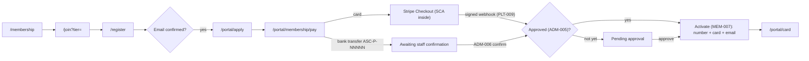
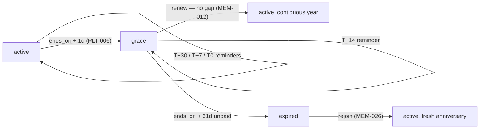
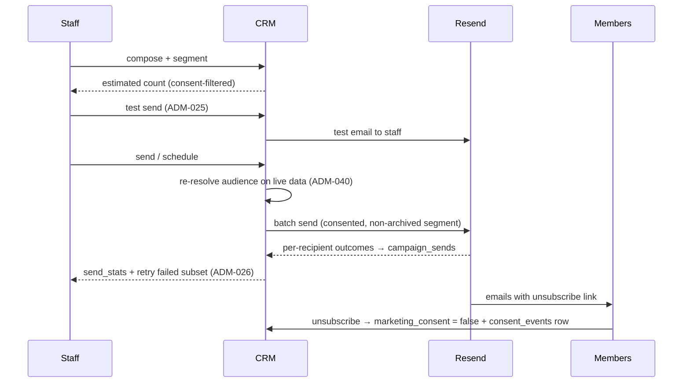
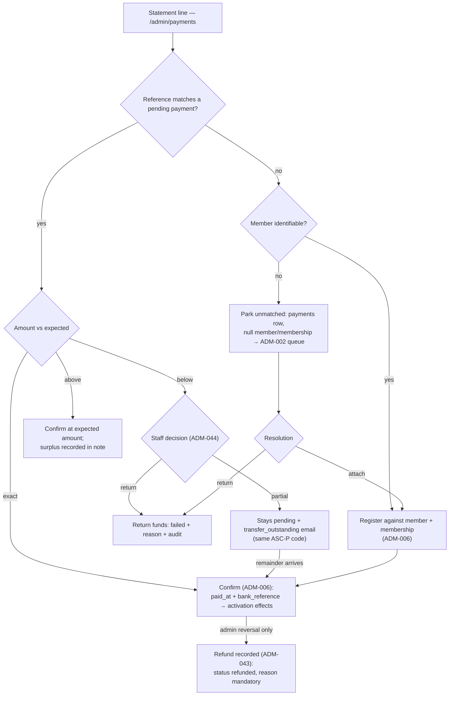

# 07 — User Flows (Combined)

> **Purpose:** step-by-step flows across the public website, member portal, and admin CRM — **Combined edition**: **Fable's** sixteen-flow skeleton (actors, triggers, numbered steps, inline failure paths, post-conditions, three Mermaid diagrams) kept intact under its original FLOW numbering and updated to the Combined canon; **Opus's** per-flow edge-case discipline applied to every flow (3DS/SCA abandonment, webhook replay and ordering, consent withdrawal mid-campaign, grace-boundary dates, token-revocation timing — converted from its Stripe-Billing/free-tier model to Combined's member-initiated annual dues; its bookings/events/news flows rejected per 00 §9); **Codex's** error/recovery matrix and numbered test-scenario catalog closing the document. Two Combined flows are added for 04's new requirements: FLOW-17 (member licenses) and FLOW-18 (unmatched/mismatched bank transfers).

**How to read:** steps use `route → user action → system response`; failure and alternate paths are indented under the step where they branch; post-conditions list resulting data states. Routes are cited verbatim from `05-information-architecture.md`, tables and columns from `06-database-schema.md`, requirement IDs from `04-prd.md` §7; statuses, timing rules, and identifier formats are `00-foundation.md`'s (§3.2/§6/§7.2) and are never re-decided here. **Every flow ends with an edge-case table** — # · edge case · expected behavior · covering requirement — the mandatory format per 00 §7.4. Test scenarios are `TS-NN` (00 §7.1); 10 sequences these flows into build phases.

**Actor legend** (used in steps and diagrams):

| Actor | Meaning |
|-------|---------|
| Visitor | Anonymous person on the public site — including the partner desk verifying a card (no partner accounts exist, 00 §5) |
| Member | Authenticated `member` role; portal access shaped by `member_status` (05 §5) |
| Staff | `staff` role in the admin CRM (Romanian-only surface) |
| Admin | `admin` role — staff scope plus the [admin]-marked actions (ADM-009/032/033/034/035/043) |
| System | The daily job (`/api/cron/daily`, actor label `cron:daily`) or the webhook handler (`webhook:stripe`) — every automatic mutation is audit-logged under its label (PLT-006/007) |
| Stripe / Resend | Third parties: Checkout + signed webhooks; transactional and campaign email |

**The membership clock** (referenced by FLOW-03/04 and the TS catalog; days relative to `ends_on`, per 00 §3.2):

| Moment | Day | What happens | Evidence |
|--------|-----|--------------|----------|
| Renewal window opens | T−30 | Renew action appears in the portal; `renewal_minus_30` sends | `email_log`, `job_runs` |
| Second reminder | T−7 | `renewal_minus_7` sends | `email_log` |
| Expiry day | T0 | `renewal_day_0` sends; membership still `active` through the whole day | `email_log` |
| Grace begins | T+1 | Job: membership `active → grace`; card stays valid | `audit_logs` (`cron:daily`) |
| Grace reminder | T+14 | `renewal_grace_14` sends | `email_log` |
| Last grace day | T+30 | Renewal today is still gap-free (starts at `ends_on + 1 day`) | — |
| Expiry | T+31 | Job: `grace → expired`; `lapse_final_30` sends; card verifies invalid | `audit_logs`, `email_log` |

---

## Flow index

| ID | Flow | Surface | Actor | PRD IDs covered |
|----|------|---------|-------|-----------------|
| FLOW-01 | Visitor becomes active member (golden path) | Public + Portal | Visitor → member | PUB-003/009/017/019, MEM-001/002/005/006/007/027, PLT-009/014/016 |
| FLOW-02 | Login & password reset | Auth | Member | MEM-003/004, PLT-001/002/011 |
| FLOW-03 | Renewal — happy path | Portal | Member | MEM-012/027/029, PLT-004 |
| FLOW-04 | Lapsed renewal — dunning, grace, expiry | Portal + system | System + member | PLT-004/005/006/015, MEM-008/012/026 |
| FLOW-05 | Tier upgrade | Portal | Member | MEM-013/017/027 |
| FLOW-06 | Card issuance & partner verification | Portal + Public | Member + partner desk | MEM-015/016/025, PUB-013, PLT-011/013, ADM-010 |
| FLOW-07 | Profile update | Portal | Member | MEM-009/010, PLT-002/008 |
| FLOW-08 | GDPR export & erasure | Portal + Admin | Member + admin | MEM-021/022/025/028, ADM-035/041, PLT-007 |
| FLOW-09 | Application review | Admin | Staff | ADM-002/005, MEM-007, PUB-017, PLT-005 |
| FLOW-10 | Manual bank-transfer confirmation | Admin | Staff | ADM-002/006/044, MEM-007, PLT-004 |
| FLOW-11 | Onboard flight school + contract | Admin | Staff | ADM-012/014/016/017/018/019/042 |
| FLOW-12 | Create benefit linked to contract | Admin | Staff | ADM-021/022, PUB-004/016, MEM-017/018 |
| FLOW-13 | Contract expiry alert → renewal decision | Admin + system | System + staff | ADM-018/020/022, PLT-005/006/007 |
| FLOW-14 | Campaign to a member segment | Admin | Staff | ADM-024/025/026/027/040, MEM-019/028 |
| FLOW-15 | Add aircraft to fleet | Admin | Staff | ADM-029/030/031, PUB-007 |
| FLOW-16 | Sponsor onboarding → public site | Admin + Public | Staff | ADM-015/017/018, PUB-001/006 |
| FLOW-17 | Member adds/edits a pilot license *(Combined addition)* | Portal + Admin | Member + staff | MEM-023/024/025, ADM-036, PLT-007/008 |
| FLOW-18 | Unmatched/mismatched bank transfer *(Combined addition)* | Admin | Staff + admin | ADM-002/006/039/043/044, PLT-004/007 |

**Coverage against the 04 §7 spine.** Every flow-shaped requirement is exercised above; the remainder are page-render or cross-cutting requirements with no step sequence of their own, exercised where they bind:

| Requirement group | Where it is exercised |
|-------------------|----------------------|
| Static/content pages — PUB-002, PUB-010, PUB-015, PUB-020 | Render per their own acceptance criteria; no flow needed |
| Contact form — PUB-008, PUB-018 | Single submit; covered by the rate-limit and email rows of the error matrix |
| Locale, SEO, error pages — PUB-011, PUB-012, PUB-014, PLT-003 | Bind on every route; FLOW-02 edge table covers the 403 path |
| Portal read views — MEM-011, MEM-014, MEM-020 | Landing surfaces of FLOW-03/04/14 (membership view, payment history + non-fiscal PDF, announcements feed) |
| Admin list/queue/report fabric — ADM-001/002/003/011/013/028/037/038/039/045, PUB-005 | The operating surface of FLOW-09..18; queue → deep-link mechanics appear in every admin flow's step 1 |
| Platform invariants — PLT-001/002/008/010/011/012 | Edge rows and matrix rows throughout; §Cross-flow guarantees names the mechanisms |

---

## Member-facing flows (FLOW-01..08)

## FLOW-01 — Visitor becomes active member (golden path)

**Actor:** anonymous visitor (personas per 01). **Trigger:** lands on `/` or `/membership`. **Preconditions:** none.

**Entry points:** home hero CTA (`/` → `/join`), tier-card CTAs on `/membership` (`/join?tier={slug}`), direct `/join`, and the benefit-tease join CTAs (PUB-016). All converge on the same funnel; the chosen tier survives every step (05 §3.2 reserved params).

1. `/membership` → compares tiers → cards show the locked prices (3000/4500/6000 RON, locale-formatted); Pilot is flagged "Recomandat piloților activi" (PUB-003); the break-even module and live benefit rows inform the choice (PUB-019, PUB-004).
2. `/membership` → clicks a tier CTA → `/join?tier=cadet` with the tier preselected (PUB-009); the founding offer renders only while slots remain (PUB-017).
3. `/join` → "Creează cont" → `/register` opens with the tier carried in funnel state.
4. `/register` → submits email + password → account created (`auth.users` + `profiles` row via signup trigger); confirmation email sent (MEM-001).
   - Email already registered → non-enumerating message with a link to `/login`; after login the funnel resumes with the tier preserved.
5. Email inbox → clicks the confirmation link → session established → redirected to `/portal/apply`.
6. `/portal/apply` → fills the application (full name, phone, county, date of birth, `pilot_status`, terms; marketing consent as a separate default-unticked checkbox) → `members` row (`status = 'pending'`) + `memberships` row (chosen `tier_id`, `status = 'pending'`, `price_ron` locked) created; a granted consent also appends a `consent_events` row (`source = 'application'`); `application_received` email logged in `email_log` (MEM-002).
   - Validation failure → inline Zod errors, nothing persisted (PLT-008).
7. `/portal/membership/pay` → chooses **card** → Stripe Checkout session created server-side for the exact tier price; `payments` row (`card`, `purpose = 'new'`, `status = 'pending'`, `stripe_session_id`) → redirect to Stripe (MEM-005).
   - Chooses **bank transfer** → IBAN + beneficiary (from `club_settings`) + unique reference code `ASC-P-NNNNN` written to the `payments` row (`bank_transfer`, `pending`, `reference_code`); member sees "În așteptare — confirmăm după potrivirea extrasului" with the code prominently copyable (MEM-006). *Flow continues at FLOW-10.*
   - Cancels/abandons Checkout → returned to `/portal/membership/pay`; a retry creates a **fresh Checkout session against the same pending `payments` row** (the `payments_one_open` partial unique index forbids duplicates, MEM-027) and offers the bank-transfer alternative.
8. Stripe → member completes payment (any SCA/3-D Secure challenge happens inside Checkout) → webhook `/api/webhooks/stripe` verifies the signature, inserts the event id into `stripe_events` (`ON CONFLICT DO NOTHING`), sets the payment `confirmed` (PLT-009).
9. System → activation gate (MEM-007): payment `confirmed` **and** application approved (FLOW-09) — whichever completes last triggers activation: membership `active`, `starts_on` = today, `ends_on = starts_on + 1 year − 1 day`; member `active`; `member_number` `ASC-YYYY-NNNN` assigned (first activation only) and `first_activated_on` set; `member_cards` row issued (22-char token); founding flag set **inside the same transaction** if among the first 50 (PUB-017); `membership_activated` email with card link; the day-3 onboarding follow-up is scheduled once per member (PLT-016).
   - Application not yet approved → member stays `pending` with "plată primită, cerere în evaluare"; activation fires on approval.
10. `/portal` → dashboard shows the `active` chip and card CTA → member opens `/portal/card` (FLOW-06).

**Post-conditions:** `members.status = 'active'`, one `active` membership, `confirmed` payment, one unrevoked card, `stripe_events` outcome `processed`, audit rows for activation.

| # | Edge case | Expected behavior | Covers |
|---|-----------|-------------------|--------|
| 1 | Application submitted before email confirmation | Blocked — the application requires a confirmed account; the portal prompts confirmation with a resend option | MEM-001 |
| 2 | SCA/3-DS challenge abandoned inside Checkout | No completion event fires; the session expires unpaid; the payment concludes `failed` and the retry screen offers card retry + bank transfer — the success redirect alone never activates anything | MEM-005 |
| 3 | Member returns from Stripe before the webhook is processed | Pay page shows "Confirmăm plata…" and re-checks; activation happens only via the verified webhook | MEM-005, PLT-009 |
| 4 | Duplicate or out-of-order webhook delivery | `stripe_events` ledger makes reprocessing a no-op; the duplicate is recorded with outcome `duplicate`, zero side effects | PLT-009, PLT-014 |
| 5 | Paid amount ≠ expected tier price | Payment is **not** auto-confirmed; `stripe_events.outcome = 'anomaly'` and the item enters the ADM-002 anomaly queue for staff decision | PLT-014 |
| 6 | Two activations race for founding slot 50 | The flag is assigned inside the activation transaction — never more than 50 founding members; the public counter never goes negative | PUB-017 |
| 7 | Logged-in `active` member opens `/join` | Redirected to `/portal` — the funnel is for non-members | PUB-009 |
| 8 | Member archived before day 3 | The onboarding follow-up is suppressed; it never re-triggers on renewal or upgrade | PLT-016 |

## FLOW-02 — Login & password reset

**Actor:** member (or staff/admin). **Trigger:** visits `/login`.

1. `/login` → submits credentials → HTTP-only cookie session set → redirect by role: `member` → `/portal`, `staff`/`admin` → `/admin` (MEM-003, PLT-001).
   - Wrong credentials → non-enumerating error; repeated failures trip the rate limit (PLT-011).
   - Deep link (`/login?next=/portal/card`) → honored post-login (05 §3.2 reserved params).
2. Forgot password → `/reset-password` → submits email → identical confirmation copy whether or not the account exists (MEM-004).
3. Email link (single-use, ≤ 1 h) → sets new password → session established → `/portal`.
   - Expired/used link → error with a restart option, never a dead end.

**Post-conditions:** active session; no data changes beyond auth.

| # | Edge case | Expected behavior | Covers |
|---|-----------|-------------------|--------|
| 1 | Wrong password or unknown email | One generic localized error — account existence is never revealed | MEM-003 |
| 2 | Brute-force attempts on `/login` or `/reset-password` | Per-IP rate limit rejects further attempts; each trip is logged | PLT-011 |
| 3 | Reset requested for an email with no account | Same confirmation screen as for a real account — no enumeration | MEM-004 |
| 4 | Reset link reused after success | Rejected (single-use); the user re-requests a fresh link | MEM-004 |
| 5 | Anonymous request to `/portal/*` or `/admin/*` | 302 → `/login?next={path}`; the return path survives login | PLT-002 |
| 6 | `member` navigates to `/admin` | Branded 403 explaining the role requirement — never a blank error | PLT-002, PUB-014 |

## FLOW-03 — Renewal, happy path

**Actor:** `active` member. **Trigger:** `renewal_minus_30` reminder email at T−30 (PLT-004). **Preconditions:** membership `active`, `ends_on` within 30 days.

**Entry points:** the reminder email's CTA, the dashboard's context-appropriate primary action (MEM-008), and `/portal/membership` → Renew. All land on `/portal/membership/renew`.

1. Email → "Reînnoiește acum" → `/portal/membership/renew` (post-login via `?next=`).
2. Renew page → shows current tier, contiguous next-year dates (`starts_on = ends_on + 1 day`), the renewal price, and the optional downgrade choice (renewal-time only, 00 §3.3) → member confirms the tier (MEM-012).
   - Founding member within 2 years of `first_activated_on` → the joining price applies automatically, labeled "Preț fondator blocat până la `DD.MM.YYYY`" (MEM-029).
3. → chooses payment method → as FLOW-01 steps 7–8 with `purpose = 'renewal'`; a new `memberships` row (`pending`, next-year dates, `price_ron` locked at this purchase) carries the pending payment.
4. Payment `confirmed` (webhook or FLOW-10) → the new membership activates with no-gap dates; `payment_confirmed` email; card validity extends automatically — the card reads the live membership, no reissue (MEM-015); the payment appears at `/portal/payments` with its confirmation PDF (explicitly not a fiscal invoice, MEM-014).
5. Daily job at the old row's boundary → the completed row is retired (a confirmed successor exists, so it passes directly to `expired` — the member stays `active` through the successor; PLT-006 governs the unpaid case in FLOW-04).

**Post-conditions:** two membership rows (old until its `ends_on`, new `active` contiguous), payment `confirmed`, `email_log` rows for reminder + confirmation.

| # | Edge case | Expected behavior | Covers |
|---|-----------|-------------------|--------|
| 1 | Member opens Renew before T−30 | The action is not offered yet — the window opens 30 days before `ends_on` | MEM-012 |
| 2 | Founding price-lock in force despite a general-assembly price change | Server-side pricing applies the joining price; the lock label shows the lock end date | MEM-029 |
| 3 | Founding lock lapsed (> 2 years since first activation) | Current tier price applies, no discount — price integrity | MEM-029 |
| 4 | Downgrade chosen at renewal | Allowed: the new `memberships` row carries the lower tier from its `starts_on`; no mid-year path exists | MEM-012, MEM-013 |
| 5 | Renewal payment abandoned | The pending renewal row + payment persist; the dashboard resumes at the payment step; a transfer reopened shows the **same** `ASC-P-NNNNN` | MEM-027 |
| 6 | Overlapping renewal attempt (double-click, second tab) | The `payments_one_open` unique index and the GiST no-overlap exclusion make a second pending year impossible | MEM-027, PLT-006 |

## FLOW-04 — Lapsed renewal: dunning, grace, expiry

**Actor:** system (daily job at `/api/cron/daily`, PLT-005/006) + member. **Trigger:** `ends_on` approaches without renewal.

1. T−30 / T−7 / T0 → job sends `renewal_minus_30`, `renewal_minus_7`, `renewal_day_0` → `email_log` rows; each run writes its per-template counts into `job_runs.actions` (PLT-015).
2. `ends_on + 1 day` → job transitions membership `active → grace`; member mirrors `grace`; audit row with actor `cron:daily` (PLT-006, PLT-007).
3. Portal during grace → warning banner with days remaining and the accent Renew button everywhere (MEM-008); card renders full color with the grace notice; `/verify/{token}` still returns valid (00 §3.2).
4. T+14 → `renewal_grace_14` email.
5. Member renews during grace → FLOW-03 from step 2; the new year starts at old `ends_on + 1 day` — no gap, no punishment (MEM-012).
6. `ends_on + 31 days`, still unpaid → job transitions `grace → expired`; member `expired`; `lapse_final_30` email; card renders grayscale + "Expirat / Expired" (08 §7.3); verification returns invalid.
7. Expired member later returns → `/portal` primary action is **Rejoin** (MEM-026): a new membership starting today (fresh anniversary), payment `purpose = 'new'`, same permanent member number.

**Post-conditions:** statuses per 00 §7.2 at every stage; every transition audit-logged; every send and transition evidenced in `job_runs`.

| # | Edge case | Expected behavior | Covers |
|---|-----------|-------------------|--------|
| 1 | Renewal confirmed on the last grace day (T+30) | Still a renewal: new year starts at old `ends_on + 1 day`, no gap; the T+31 transition finds a confirmed successor and expires only the old row | MEM-012, PLT-006 |
| 2 | Transfer initiated in grace, confirmed by staff after T+31 | The pending renewal payment remains resumable and confirmable; on confirmation the renewal row still starts at old `ends_on + 1 day` (MEM-012 AC2) and member status recomputes to `active` | MEM-012, ADM-006 |
| 3 | Cron missed a day | Next run catches up — transitions compute from `ends_on` arithmetic, never from "today only"; nothing is skipped or doubled | PLT-015 |
| 4 | Job runs twice in one day | Second execution appends a `job_runs.actions` entry with all-zero counts — the idempotency evidence | PLT-015 |
| 5 | Reminder email bounces | `email_log` row `failed` with the error; visible and filterable at `/admin/send-log`; the member's status timeline is unaffected | ADM-028, PLT-004 |
| 6 | Expired member opens `/portal/benefits` | Benefits render locked with a rejoin prompt; redemption notes unreadable | MEM-026 |
| 7 | Card scanned during grace | Full-color card; `/verify/{token}` verdict is **valid** until T+31 | MEM-015, PUB-013 |

## FLOW-05 — Tier upgrade

**Actor:** `active` member (Cadet → Pilot shown). **Trigger:** locked benefit in the catalog or self-initiated.

**Entry points:** a locked benefit's upgrade prompt (`/portal/benefits`), the membership page, or direct navigation to `/portal/membership/upgrade`.

1. `/portal/benefits` → a benefit shows the `min. Pilot` lock → "Fă upgrade" → `/portal/membership/upgrade` (MEM-017).
2. Upgrade page → server computes the pro-rated difference per 00 §3.3 — remaining days, rounded **up** to whole RON (e.g. 200 days remaining: `(4500 − 3000) × 200/365 = 821.9 → 822 RON`) → shows the amount and the immediate effect (MEM-013).
3. → pays (card or transfer; `payments` row `purpose = 'upgrade'`, attached to the current membership).
4. Confirmation (webhook or FLOW-10) → the current membership row's `tier_id` updates **in place** (06 §3.2); `upgrade_confirmed` email; card badge and benefits catalog reflect Pilot at once.

**Post-conditions:** same membership row, higher tier, unchanged `ends_on`; payment `confirmed`; audit row.

| # | Edge case | Expected behavior | Covers |
|---|-----------|-------------------|--------|
| 1 | Fractional proration | Always rounded up to whole RON — amounts are integers everywhere | MEM-013 |
| 2 | Upgrade payment abandoned | Tier unchanged until confirmation; the pending `upgrade` payment resumes exactly like any other (same row, same reference if transfer) | MEM-013, MEM-027 |
| 3 | Upgrade paid by bank transfer | Tier changes only at staff confirmation (FLOW-10) — never at instruction time | ADM-006, MEM-013 |
| 4 | Member already Captain | No upgrade target exists; the action is absent | MEM-013 |
| 5 | Member in `grace` seeks an upgrade | Upgrade requires `active`; the portal's primary action in grace is Renew — upgrade is offered again after renewal | MEM-013, MEM-008 |
| 6 | Mid-year downgrade attempt | No such action exists anywhere in the portal — downgrade is renewal-time only | MEM-013 |

## FLOW-06 — Card issuance & partner verification

**Actors:** member + partner desk (no account — anonymous visitor). **Preconditions:** member `active` or `grace`.

1. Activation (FLOW-01 step 9) issued the `member_cards` row with its `verification_token` (22-char, CSPRNG).
2. Member: `/portal/card` → card renders per 08 §7 with the QR encoding `/verify/{token}` (MEM-015); offline, the last-known card renders from cache (MEM-016).
3. Desk: scans the QR with any camera → `/verify/{token}` → `verify_card()` RPC (06 §7.4) → ✅ "Membru activ / Active member", first name + last initial, tier badge, validity date, check timestamp (PUB-013).
   - Member `expired`/`archived` → ❌ invalid verdict, no member data.
   - Unknown or revoked token → ❌ identical invalid verdict, indistinguishable (PLT-013).
   - Screenshot of an old card → still live-checked: the verdict reflects current status.
4. Desk applies the tier benefit per its contract terms (no redemption logging in v1, 00 §9).

**Lost card variant:** member reports → staff `/admin/members/{id}` → "Reemite token" (ADM-010) → old token `revoked_at` set (verifies invalid immediately), new `member_cards` row → `/portal/card` shows the new QR instantly.

**Post-conditions:** exactly one unrevoked card per member (06 partial unique index); verification always reflects live status; no personal data beyond the PUB-013 field set ever leaves the RPC.

| # | Edge case | Expected behavior | Covers |
|---|-----------|-------------------|--------|
| 1 | Expired or archived member scanned | Invalid verdict in the same layout — never an error page, no personal data | PUB-013 |
| 2 | Unknown token vs revoked token | Responses are indistinguishable: same layout, same verdict, same status code | PLT-013 |
| 3 | Token revocation timing | The old token verifies invalid on the very next request after reissue — no cache window beyond the 60 s ceiling | ADM-010, PUB-013 |
| 4 | Scraping/enumeration of `/verify/*` | ≈131-bit token space + per-IP rate limit; beyond the ceiling requests get HTTP 429 and are logged | PLT-013, PLT-011 |
| 5 | No network in the hangar | Card renders from cache; verification itself always requires the live lookup | MEM-016 |
| 6 | License data leakage | No `member_licenses` field ever appears on the card or the verification response — the RPC never joins the table | MEM-025 |

## FLOW-07 — Profile update

**Actor:** member. **Trigger:** opens `/portal/profile`.

1. `/portal/profile` → edits phone/county/address → Zod-validated save on own row only (RLS anchor `members.profile_id`) → confirmation toast (MEM-009).
   - Name change → flagged for staff review instead of applying silently; staff apply via ADM-007.
2. Email change → Supabase re-confirmation cycle; effective only on confirm.
3. Avatar → JPEG/PNG ≤ 2 MB to Supabase Storage → renders in the portal header and the admin member detail (MEM-010).

**Post-conditions:** own `members`/`profiles` fields updated; pending name change visible to staff.

| # | Edge case | Expected behavior | Covers |
|---|-----------|-------------------|--------|
| 1 | Name change | Never silent — held for staff review; the audit log captures before/after on apply | MEM-009, ADM-007 |
| 2 | Email change without confirmation | Old address stays effective until the Supabase re-confirmation completes | MEM-009 |
| 3 | Avatar wrong type or > 2 MB | Rejected with a localized error; nothing stored | MEM-010 |
| 4 | Write against another member's row (crafted request) | RLS denies — a UI failure never widens access | PLT-002 |
| 5 | Invalid payload sent directly to the server action | Zod rejects at the boundary; invalid input never reaches the database | PLT-008 |
| 6 | `archived` member logs in | Portal is read-only history plus GDPR self-service (05 §5); no profile edits apply | ADM-008 |

## FLOW-08 — GDPR export & erasure

**Actor:** member; `admin` for erasure execution. **Trigger:** `/portal/settings` GDPR section.

**Export:**
1. `/portal/settings` → "Descarcă datele mele" → server compiles machine-readable JSON — member, licenses, memberships, payments, consent history — under the service role (MEM-021).
2. → file downloads to the authenticated owner only → the action is audit-logged (PLT-007).

**Erasure:**
1. `/portal/settings` → "Șterge contul" → the screen states the legal retention carve-outs (payment records) → typed confirmation → `members.erasure_requested_at` set; `erasure_received` email (MEM-022).
2. Admin queue (`/admin`, ADM-002) → admin opens `/admin/members/{id}` → "Execute erasure" → typed confirmation, `admin`-only (ADM-035).
3. System → executes the 06 §6 order: anonymize `members` in place → null/delete `member_licenses` → detach `consent_events`/`campaign_sends`/`email_log` → delete `profiles` + auth account → `erasure_completed` email sent **before** the address is erased → audit row.

**Post-conditions:** member row anonymized (`status = 'archived'`), no personal data recoverable, payment and membership history intact in anonymized form, card verifies invalid.

| # | Edge case | Expected behavior | Covers |
|---|-----------|-------------------|--------|
| 1 | Export content | Includes licenses and the full consent history; delivered only to the authenticated owner; audit-logged | MEM-021, MEM-025, MEM-028 |
| 2 | Erasure requested while membership is `active` | Executed regardless; membership/payment history survives anonymized (legal-obligation carve-out the request screen disclosed) | MEM-022, ADM-035 |
| 3 | Completion notice ordering | `erasure_completed` sends before the address is destroyed — afterwards there is no address to notify | ADM-035 |
| 4 | Internal notes and licenses | `members.staff_notes` anonymized, `member_licenses` rows deleted with `license_number` nulled | ADM-041, MEM-025 |
| 5 | Card after erasure | Token verifies invalid via the archived member status; the card row itself is never deleted | PUB-013, ADM-035 |
| 6 | Attempt to edit an audit row afterwards | Impossible for every role — the table is insert-only | PLT-007 |

## Admin flows (FLOW-09..16)

## FLOW-09 — Application review (admin)

**Actor:** staff. **Trigger:** ADM-002 queue shows pending applications.

1. `/admin` → "Cereri în așteptare (3)" → `/admin/members?status=pending` (URL-encoded filter state, ADM-038).
2. `/admin/members/{id}` → reviews application data (profile, chosen tier, payment state) → **Approve** (ADM-005).
   - **Reject** → mandatory reason → `rejected_at` + `rejection_reason` recorded → `application_rejected` email → hard purge scheduled at +90 days, executed by the daily job (PLT-005).
3. System → if the payment is already `confirmed` → activation exactly as FLOW-01 step 9; else the member remains `pending` awaiting payment (MEM-007 — last gate triggers).

**Post-conditions:** approval or rejection recorded; activation fired when both gates are closed; audit rows for both decisions.

| # | Edge case | Expected behavior | Covers |
|---|-----------|-------------------|--------|
| 1 | Rejection without a reason | Blocked — the reason is mandatory and stored | ADM-005 |
| 2 | Approval while payment still pending | Member stays `pending`; activation fires later from the payment confirmation | MEM-007 |
| 3 | Payment confirmed first, approval second | Activation fires at approval — order never matters, the last gate triggers | MEM-007 |
| 4 | Approval lands on founding slot 50 | Flag assigned inside the activation transaction; slot 51 activates without it | PUB-017 |
| 5 | Rejected applicant's data at +90 days | Hard-deleted by the daily job; the purge count appears in `job_runs.actions` | ADM-005, PLT-005, PLT-015 |
| 6 | Approve/reject audit trail | Every decision writes an `audit_logs` row with actor and before/after | PLT-007 |

## FLOW-10 — Manual bank-transfer confirmation (admin)

**Actor:** staff. **Trigger:** the bank statement shows an incoming transfer; the ADM-002 queue lists `pending` bank-transfer payments (an `alert_pending_transfer` email also fired at instruction time, PLT-004).

1. `/admin` → "Transferuri de confirmat (2)" → `/admin/payments?status=pending&method=bank_transfer` (ADM-039).
2. `/admin/payments/{id}` → staff match the statement line by the unique reference code `ASC-P-NNNNN` **and** amount → **Confirmă plata** → records `paid_at`, `bank_reference`, `confirmed_by` = staff profile (ADM-006).
   - Member forgot the code and referenced their name → staff search pending payments by member name/amount; the code is a fast path, not a hard gate (ADM-006).
   - Amount above or below expected → plain confirmation is blocked; the ADM-044 mismatch paths apply (FLOW-18).
   - Transfer matches no pending payment at all → register against a member or park unmatched (FLOW-18).
3. System → confirmation triggers activation/renewal/upgrade effects **identically to the Stripe webhook path** (FLOW-01 step 9, FLOW-03 step 4, FLOW-05 step 4) — one activation engine, two rails (MEM-007).

**Post-conditions:** payment `confirmed` with `bank_reference`, downstream effects fired, audit row.

| # | Edge case | Expected behavior | Covers |
|---|-----------|-------------------|--------|
| 1 | Statement line without the reference code | Manual match by name/amount via search; confirmation records the actual `bank_reference` | ADM-006 |
| 2 | Amount below expected | Confirmation blocked → partial or return path per FLOW-18 | ADM-044 |
| 3 | Amount above expected | Confirm at the expected amount; surplus recorded in `payments.note` with the resolution decision | ADM-044 |
| 4 | Unannounced transfer, member identifiable | Staff register the payment against the member and membership, then confirm | ADM-006 |
| 5 | Undo after confirmation | No staff path exists; the only reversal is the `admin`-only refund action, both directions audit-logged | ADM-006, ADM-043 |
| 6 | Same statement line processed twice | The payment is already `confirmed`; re-confirmation has no path — the register shows the confirmed state | ADM-006, ADM-039 |
| 7 | Reference resolves to a payment that already ended `failed` (funds returned earlier) | No pending match — the line follows the unmatched path of FLOW-18, never a silent re-open | ADM-044 |

## FLOW-11 — Onboard a flight school + contract (admin)

**Actor:** staff. **Trigger:** partnership agreed with a school.

1. `/admin/flight-schools` → "Adaugă școală" → name, contacts, operating aerodromes (m:n via `flight_school_aerodromes`) → saved `active` (ADM-012).
2. `/admin/contracts` → "Contract nou" → counterparty = the school (exactly-one-of-four rule), type `partnership`, `starts_on`/`ends_on`, terms summary → saved `draft` with auto number `CTR-YYYY-NNN` (ADM-017).
3. Contract detail → uploads the signed PDF (≤ 10 MB, private Storage, ADM-019) → **Activate** → status `active` (ADM-018 — activation requires dates + counterparty).
4. `/admin/flight-schools/{id}` → shows the linked `active` contract with deep links (ADM-016). *Benefits follow in FLOW-12.*

**Post-conditions:** school `active`, contract `active` with document, partner 360° complete.

| # | Edge case | Expected behavior | Covers |
|---|-----------|-------------------|--------|
| 1 | Activation without dates or counterparty | Blocked — `active` requires both | ADM-018 |
| 2 | Non-PDF or > 10 MB document | Rejected; the contract record is unaffected | ADM-019 |
| 3 | Two counterparties on one contract | Impossible — the exactly-one CHECK holds even against crafted writes | ADM-017 |
| 4 | Operating aerodrome not yet in the register | Created first at `/admin/aerodromes` (ICAO code validated, e.g. `LRPV`), then linked | ADM-014 |
| 5 | Deleting a school with linked contracts | Blocked; archiving is offered — the partner leaves pickers and public surfaces but stays on history | ADM-042 |
| 6 | Contract activated with `ends_on` already in the past | The next daily run expires it — dates drive states even when staff race the calendar | ADM-018, PLT-006 |

## FLOW-12 — Create a benefit linked to a contract (admin)

**Actor:** staff. **Trigger:** contract from FLOW-11 grants member benefits. **Preconditions:** the granting partner exists; a linked contract, when set, must be `active` for publication.

1. `/admin/benefits` → "Beneficiu nou" → partner = the school, contract linked, bilingual title/description (`*_ro`/`*_en` both required), `min_tier` = Cadet, redemption note → saved `active` (ADM-021).
2. Publication evaluates live (ADM-022): `active AND (contract IS NULL OR contract 'active')` → publishable.
3. Public `/membership` shows it in the live rows — title, partner, `min_tier` badge, **no redemption note** (PUB-004, PUB-016); `/portal/benefits` lists it with the redemption note for eligible tiers; below-tier members see the upgrade lock (MEM-017 → FLOW-05 entry).
4. Later, the contract expires (FLOW-13) → the benefit disappears from both surfaces automatically — the publication predicate is evaluated live, no cascade write needed.

**Post-conditions:** benefit `active`, published on both surfaces, filterable by partner type and tier (MEM-018).

| # | Edge case | Expected behavior | Covers |
|---|-----------|-------------------|--------|
| 1 | Missing one locale's title or description | Publication blocked — both languages are required | ADM-021 |
| 2 | Linked contract expires or is terminated | Benefit auto-hides from public and portal on next render, no staff action | ADM-022 |
| 3 | Redemption note on the public page | Never rendered — public rows tease, members redeem | PUB-016 |
| 4 | Member below `min_tier` opens the catalog | Locked card with an upgrade prompt; the redemption note is unreadable | MEM-017 |
| 5 | Benefit with no linked contract | Publishable while `active = true` — the contract gate applies only when set | ADM-022 |
| 6 | Staff deactivate a benefit (`active = false`) | Gone from both surfaces on next render; the row is kept as partner history — deactivation is the archive verb | ADM-021, ADM-022 |

## FLOW-13 — Contract expiry alert → renewal decision

**Actor:** system + staff. **Trigger:** contract `ends_on` approaches.

1. Daily job (PLT-005) → contract `ends_on` in 60 days → `alert_contract_expiry` email to staff + ADM-002 queue entry (ADM-020); repeats at 30 days.
2. `/admin/contracts/{id}` → staff negotiate with the partner:
   - **Renewed** → staff create a successor contract (new `CTR-YYYY-NNN`, new dates) → activate it → relink benefits to the successor.
   - **Not renewed** → the day after `ends_on`, the job sets `expired` (PLT-006) → linked benefits unpublish (ADM-022), sponsor logos drop (PUB-006).
   - **Early termination** → **Terminate** with mandatory reason → the same cascades apply immediately (ADM-018).

**Post-conditions:** contract lifecycle per 00 §7.2; every transition audit-logged; public surfaces consistent with contract truth.

| # | Edge case | Expected behavior | Covers |
|---|-----------|-------------------|--------|
| 1 | Alert cadence | Exactly two alerts — 60 and 30 days before `ends_on` — plus the standing queue entry | ADM-020 |
| 2 | Termination without a reason | Blocked — the reason is mandatory and stored in `terminated_reason` | ADM-018 |
| 3 | Expiry cascade | Benefit publication and sponsor visibility re-evaluate automatically on the status change | ADM-018, ADM-022, PUB-006 |
| 4 | Renewal by editing the old contract's dates | Not the path — a successor contract with a new number preserves history; the old one expires or is terminated | ADM-017, ADM-018 |
| 5 | Automatic expiry attribution | The transition is audit-logged with the job identity (`cron:daily`) as actor | PLT-006, PLT-007 |
| 6 | Queue hygiene | The ADM-002 entry persists until the contract leaves `active` (successor activated, expired, or terminated) — expiring work never disappears unresolved | ADM-002, ADM-020 |

## FLOW-14 — Campaign to a member segment (admin)

**Actor:** staff. **Trigger:** club news for a member segment. **Preconditions:** at least one member matches the intended segment; email campaigns reach only members with marketing consent.

1. `/admin/campaigns` → "Campanie nouă" → kind `email`, subject, body, segment `{"tiers":[2,3],"statuses":["active","grace"]}` → the live count previews matched members and how many are excluded for missing marketing consent (ADM-024, MEM-019).
2. → **Test send** to a staff address → rendering checked before anything ships (ADM-025).
3. → **Send now** (or schedule → status `scheduled`) → at send time the audience is **re-resolved against live data** — never the composition-time snapshot; `send_stats` records matched / excluded-no-consent / excluded-archived / sent / failed as the authoritative counts (ADM-040) → Resend batch delivers → one `campaign_sends` row per recipient (ADM-026).
   - Per-recipient failures → visible in the log → "Retrimite eșuate" re-sends only the failed subset (the `UNIQUE (campaign_id, member_id)` row updates, never duplicates).
4. Campaign becomes `sent` (immutable); evidence at `/admin/campaigns/{id}` and `/admin/send-log`.

**Announcement variant (ADM-027):** kind `announcement` → title + body, no subject, no audience consent gate → **Publish** sets `published_at` → appears newest-first at `/portal/announcements` and as the latest item on the member dashboard (MEM-020); **Unpublish** clears `published_at` and removes it from the feed. No email is ever sent for this kind.

**Post-conditions:** campaign `sent` with authoritative `send_stats`; one `campaign_sends` row per recipient; consent ledger updated by any unsubscribes.

| # | Edge case | Expected behavior | Covers |
|---|-----------|-------------------|--------|
| 1 | Consent withdrawn between composition and send | Excluded at send time — the live re-resolution governs, even for a scheduled campaign | ADM-040, MEM-019 |
| 2 | Composition-time and send-time counts differ | The send-time record is the authoritative one displayed | ADM-040 |
| 3 | Member archived after scheduling | Excluded at send time and counted in `excluded_archived` | ADM-040, ADM-008 |
| 4 | Per-recipient delivery failure | Row marked `failed` with the error; retry is scoped to the failed subset only | ADM-026 |
| 5 | Editing a `sent` campaign | Impossible — immutability is enforced by trigger, not convention | ADM-026 |
| 6 | Cancel after sending | Not allowed — `cancelled` is reachable only before sending | ADM-026 |
| 7 | Unsubscribe link clicked | `marketing_consent = false` + an appended `consent_events` row (`source = 'unsubscribe_link'`) | MEM-019, MEM-028 |
| 8 | Announcement kind | Publishes to the portal feed only — no email, no consent gate, unpublishable | ADM-027 |

## FLOW-15 — Add aircraft to the fleet (admin)

**Actor:** staff. **Trigger:** aircraft joins the club fleet.

1. `/admin/fleet` → "Adaugă aeronavă" → registration `YR-ABC` (unique), manufacturer/model, ownership, base aerodrome (FK — must exist, else `/admin/aerodromes` first), photo, ARC + insurance expiry dates → saved `active` (ADM-029/030).
2. → toggles `public_visible` → aircraft appears on `/fleet` (ADM-031, PUB-007).
3. Daily job → ARC or insurance expiry ≤ 60 days → `alert_aircraft_docs` email + ADM-002 queue entry (ADM-030).
4. Maintenance → status `maintenance` → drops off the public page until `active` again.

**Post-conditions:** aircraft in the register with status chip and base aerodrome; public gallery reflects `public_visible AND status = 'active'` exactly; document expiries feed the daily alert scan.

| # | Edge case | Expected behavior | Covers |
|---|-----------|-------------------|--------|
| 1 | Duplicate registration | Rejected — `aircraft.registration` is unique | ADM-029 |
| 2 | `maintenance` or `retired` aircraft | Never renders publicly regardless of the visibility toggle | PUB-007 |
| 3 | ARC/insurance ≤ 60 days | Queue entry + staff alert; nothing lapses silently | ADM-030 |
| 4 | Visibility toggled off | Gone from `/fleet` on next render — no deploy | ADM-031 |
| 5 | Base aerodrome archived later | The aircraft keeps its historical reference; the archived aerodrome disappears from pickers only | ADM-042 |

## FLOW-16 — Sponsor onboarding → public site

**Actor:** staff. **Trigger:** sponsorship agreed.

1. `/admin/sponsors` → "Adaugă sponsor" → name, package `gold`, logo upload, website, contacts → saved (ADM-015); the form warns that public visibility additionally requires an `active` sponsorship contract.
2. FLOW-11 pattern with type `sponsorship`, value 50000 RON (guide price; ±20% negotiable per 00 §3.4) → contract `active` (ADM-017/018).
3. → toggle `visible_on_site` → the sponsor appears on `/sponsors` under Gold and in the homepage Gold strip (PUB-006, PUB-001).
4. Deliverables: campaign mentions run via FLOW-14 and are noted on the contract record; at expiry FLOW-13 governs — the logo drops automatically if not renewed.

**Post-conditions:** sponsor record with package and logo; `active` sponsorship contract `CTR-YYYY-NNN`; public visibility exactly equal to `visible_on_site AND active sponsorship contract` (the RLS predicate, 06 §7.3).

| # | Edge case | Expected behavior | Covers |
|---|-----------|-------------------|--------|
| 1 | `visible_on_site = true` with no active sponsorship contract | Saved with a warning; the sponsor does **not** render publicly — the RLS policy requires the contract | ADM-015, PUB-006 |
| 2 | Contract expires | Logo drops off `/sponsors` and `/` on next render, automatically | PUB-006, ADM-018 |
| 3 | Negotiated value beyond ±20% of guide price | Requires `admin` sign-off before the contract activates | ADM-017 |
| 4 | No visible sponsor at all | `/sponsors` renders the "Become a sponsor" empty state with a contact CTA | PUB-006 |
| 5 | Silver/Bronze sponsor on the homepage | Never — only Gold qualifies for the home placement | PUB-001 |
| 6 | Sponsor holds only a `service`-type contract | The public gate requires an `active` contract of type `sponsorship` — the logo stays off the site | PUB-006 |

## Combined-addition flows (FLOW-17..18)

## FLOW-17 — Member adds/edits a pilot license *(Combined addition)*

**Actor:** member; staff for verification. **Trigger:** member opens the "Licențe" section of `/portal/profile` (05 §1.1). **Preconditions:** authenticated member (any status — licenses are profile facts).

1. `/portal/profile` → "Adaugă licență" → chooses type from `license_type` (`ppl_a` · `lapl_a` · `cpl_a` · `glider` · `ulm` · `other`), authority from `license_authority` (`aacr` · `saum` · `foreign_easa`), optional license number, optional issue/expiry dates (MEM-023).
   - Type `ulm` selected → the UI defaults authority to `saum`; `aacr` is rejected server-side — Romanian ULM permits are issued by SAUM, never AACR (MEM-024, 00 §6).
   - Part-FCL or glider type → only `aacr` or `foreign_easa` accepted, never `saum` (MEM-024).
2. → saves → Zod validates the type/authority pairing at the server action (PLT-008); the 06 §3.2 CHECK is the last line of defense; the row writes with `verified_by_staff = false`.
   - Member with pilot status `enthusiast` adds a first license → the UI suggests updating pilot status — it never changes it silently (MEM-023).
3. Member edits or deletes an existing entry → applies to own rows only (RLS); **any member write resets `verified_by_staff` to `false` via trigger** (06 §7.3) — an edited license is an unverified license.
4. Staff: `/admin/members/{id}` → licenses section of the 360° shows type, authority, number, expiry, with an "expirat" marker when the expiry date has passed (ADM-036) → staff verify against the presented document → set `verified_by_staff = true`; corrections apply the identical MEM-024 validation; every change is audit-logged with before/after (PLT-007).

**Post-conditions:** `member_licenses` rows owned by the member; verification state honest with respect to the latest member edit; no license field on any public surface (MEM-025).

| # | Edge case | Expected behavior | Covers |
|---|-----------|-------------------|--------|
| 1 | `ulm` + `aacr` submitted via the UI | The UI defaults to `saum`; a forced submission is rejected with a localized message | MEM-024 |
| 2 | `ppl_a` + `saum` posted directly to the server action | Zod rejects it; the 06 CHECK would reject it even below Zod — the rule holds when UI defaults are bypassed | MEM-024, PLT-008 |
| 3 | Type `other` with authority `saum` | Rejected — the schema CHECK confines non-ULM types to `aacr`/`foreign_easa` | MEM-024 |
| 4 | Member edits a staff-verified license | `verified_by_staff` resets to `false` by trigger; the 360° shows it as unverified until staff re-verify | MEM-023, ADM-036 |
| 5 | Member attempts to set `verified_by_staff` directly | Impossible — the member policy excludes the column and the trigger forces `false` on member writes | ADM-036 |
| 6 | License expiry passes | The 360° shows the "expirat" marker; portal and card behavior are unaffected — licenses never gate membership | ADM-036 |
| 7 | License fields on card, verification page, or campaigns | Never — the card and `verify_card()` exclude them; campaign personalization cannot reference license fields | MEM-025 |
| 8 | Export and erasure | Licenses are included in the member's export; erasure deletes the rows with `license_number` nulled | MEM-021, MEM-025 |

## FLOW-18 — Unmatched/mismatched bank transfer handling *(Combined addition)*

**Actor:** staff; `admin` for refunds. **Trigger:** a statement line does not match any pending payment cleanly — wrong amount, missing reference, or no counterpart at all. An `alert_transfer_mismatch` email fires when a mismatch is registered (PLT-004). **Preconditions:** staff processing the statement at `/admin/payments` (ADM-039).

1. `/admin/payments` → staff work the statement line against the register (filters: status, method, purpose, date range).
2. **Reference matches, amount below expected** → plain confirmation is blocked (ADM-044); staff choose:
   - **Mark partial** → the payment stays `pending`; the member is emailed the outstanding difference (`transfer_outstanding`) quoting the **same** reference code `ASC-P-NNNNN` — a new code is never generated (MEM-027 discipline); when the remainder arrives, the same row is confirmed at the full expected amount, both statement lines recorded in `bank_reference`/`note`.
   - **Return the funds** → the return is recorded with a mandatory reason: payment `failed`, resolution in `note`, audit-logged.
3. **Reference matches, amount above expected** → staff confirm at the **expected** amount; the surplus and its resolution decision are recorded in `payments.note` (ADM-044).
4. **No reference / reference matches nothing** →
   - Member identifiable by name/amount → staff register the transfer against the member and membership via ADM-006, then confirm normally (FLOW-10).
   - Not identifiable → staff **park it in the unmatched queue**: a `payments` row with `member_id` and `membership_id` null (`bank_transfer`, `pending` — 06 §3.2 allows null FKs only for this case); it surfaces in the ADM-002 queue until resolved.
5. Unmatched resolution → attach to a member + membership (then the confirm path opens — the 06 CHECK forbids confirming an unattached payment) **or** return the funds (step 2b recording).
6. **After confirmation** a reversal is `admin`-only: ADM-043 records the refund with a mandatory reason (`status = 'refunded'`, `refunded_at`; money moves at the bank, the platform records) — membership consequences never apply automatically; any adjustment is a separate ADM-009/ADM-008 action, each audit-logged.

**Post-conditions:** every statement line ends in exactly one recorded state — `confirmed` (full or expected-amount), `pending` (partial, outstanding notice sent), `pending` unmatched (queued), `failed` (returned), or `refunded` (admin reversal) — with the decision trail in `note`, `bank_reference`, and `audit_logs`.

| # | Edge case | Expected behavior | Covers |
|---|-----------|-------------------|--------|
| 1 | Partial payment, remainder arrives weeks later | Same `payments` row, same reference code; confirmed once the total reaches the expected amount — no second row | ADM-044, MEM-027 |
| 2 | Partial payment, member never completes | Grace/expiry timelines run unaffected (PLT-006); staff eventually return the funds with reason — the payment ends `failed` | ADM-044 |
| 3 | Surplus transfer | Confirmed at the expected amount only; the surplus and its resolution decision live in `payments.note` | ADM-044 |
| 4 | Transfer with a garbled or missing reference | Register by identity via ADM-006 or park unmatched — never guessed onto the wrong member without staff decision | ADM-006, ADM-044 |
| 5 | Attempt to confirm an unmatched (unattached) payment | Blocked by the 06 §3.2 CHECK — confirmation requires member + membership attached | ADM-044 |
| 6 | Returned funds | Recorded with a mandatory reason and audit-logged; the platform records the return, the bank moves the money | ADM-044, PLT-007 |
| 7 | Refund after a wrong confirmation | `admin`-only ADM-043: status `refunded`, reason mandatory; membership stays untouched unless an explicit ADM-009/ADM-008 follows | ADM-043 |
| 8 | Mismatch registered | Staff alert email `alert_transfer_mismatch` + ADM-002 queue entry — mismatches never sit silent | ADM-044, PLT-004 |

---

## Cross-flow guarantees

Invariants the flows above assume everywhere — each one enforced by a named mechanism, never by convention:

1. **One activation engine, two rails.** Stripe webhook confirmation (PLT-009) and staff transfer confirmation (ADM-006) converge on the identical MEM-007 transaction — number, card, founding flag, email. No flow activates anything any other way.
2. **Confirmation is never a redirect.** Only the signed, ledger-deduplicated webhook or an explicit staff action flips a payment to `confirmed` (MEM-005, PLT-009); the success URL is presentation only.
3. **Statuses move only by dates.** `active → grace → expired` transitions belong to the daily job, computed from `ends_on` arithmetic — resilient to missed days, idempotent on re-runs, evidenced in `job_runs` (PLT-005/006/015). No human flips a lifecycle status by hand; the only manual levers are the audited ADM-008/009 actions.
4. **Resume never re-asks and never duplicates.** Every interrupted payment resumes on its existing `pending` row — fresh Checkout session, same transfer reference `ASC-P-NNNNN` (MEM-027; the `payments_one_open` index is the guarantee).
5. **The card lies never.** `/portal/card` may render from cache, but every verdict at `/verify/{token}` is a live read of member status through `verify_card()` — valid only for `active`/`grace`, minimal fields, unknown ≡ revoked (PUB-013, PLT-013, MEM-016).
6. **Consent is a ledger, not a flag.** `members.marketing_consent` is the current value; every change appends a `consent_events` row, and campaign audiences re-resolve against the live value at send time (MEM-019/028, ADM-040).
7. **Contracts back every public promise.** Benefit publication and sponsor visibility are live predicates over contract status — expiry and termination cascade without staff action (ADM-018/022, PUB-006).
8. **Everything mutating leaves a trace.** Admin actions, job transitions, and webhook effects write `audit_logs` (insert-only) under a real actor label (PLT-007).
9. **Roles die immediately.** Demotion/deactivation revokes sessions server-side and admin surfaces re-validate the role per request — no stale-claim window (PLT-017).
10. **Licenses stay in their lane.** `member_licenses` never reaches the card, the verification RPC, or campaign personalization; member edits always reset staff verification (MEM-024/025, ADM-036).

---

## Error & recovery matrix *(technique adopted from Codex, populated with Combined's failure modes)*

| # | Situation | Detection | User experience | Recovery | Data effect |
|---|-----------|-----------|-----------------|----------|-------------|
| 1 | Card declined in Checkout (MEM-005) | Stripe, in-session | Decline shown inside Checkout; return lands on the retry screen with the transfer alternative | Retry card or switch to transfer | Payment stays `pending` on retry; a concluded failed session records `failed` |
| 2 | SCA/3-DS abandoned (MEM-005, MEM-027) | Session expires with no completion event | Dashboard resumes at the payment step | Fresh Checkout session against the same pending payment | One `pending` payment row, never duplicates |
| 3 | Webhook replay / out-of-order (PLT-009/014) | `stripe_events` PK conflict | None — invisible | None needed | Duplicate recorded (`outcome = 'duplicate'`), zero side effects |
| 4 | Webhook amount ≠ tier price (PLT-014) | Handler comparison against the expected price | Member still sees "awaiting confirmation" | Staff decide in the ADM-002 anomaly queue | `stripe_events.outcome = 'anomaly'`; payment not confirmed |
| 5 | Webhook references no known session (PLT-014) | Payment lookup miss | None | Investigation from the stored payload | Acknowledged 2xx (Stripe stops retrying), logged |
| 6 | Invalid webhook signature (PLT-009) | Signature verification | None | Stripe retries; persistent failures alert via observability (04 §5) | Rejected 4xx, logged; no ledger row |
| 7 | Double payment — Checkout completes after a transfer was confirmed (PLT-014, ADM-043) | Webhook lands on an already-`confirmed` payment | Member may see two charges | Anomaly queue → `admin` records the refund | Anomaly row; refund recorded `refunded` with reason |
| 8 | Rate limit tripped on `/verify/*` (PLT-011/013) | Per-IP counter | HTTP 429 | Wait; legitimate desks are far below the ceiling | Trip logged; no data change |
| 9 | Login/reset/contact brute force (PLT-011) | Per-IP counter | Non-enumerating rejection | Back off; use password reset | Trip logged |
| 10 | Transactional email bounce (PLT-004, ADM-028) | Resend failure result | None for the member | Staff see it at `/admin/send-log`, correct the address via ADM-007, resend | `email_log` row `failed` with the error |
| 11 | Campaign recipient failure (ADM-026) | Per-recipient send outcome | None | "Retry failed" re-sends the failed subset only | `campaign_sends` row updated in place |
| 12 | Storage upload failure — avatar/logo/contract PDF (MEM-010, ADM-015/019) | Type/size validation or Storage error | Localized error toast (persists until dismissed, PLT-012) | Re-upload a valid file | Nothing persisted on failure |
| 13 | Cron missed a day (PLT-015) | `job_runs` gap; no run row for the date | None | Next run catches up — transitions compute from `ends_on` arithmetic | Transitions applied exactly once; evidence in `job_runs` |
| 14 | Daily job fails mid-run (PLT-015) | `finished_at` null / error in `actions` | None | `alert_job_failure` email to staff; re-run is idempotent | Error captured in the run record; re-run appends its entry |
| 15 | Role demoted or account deactivated mid-session (PLT-017) | Server-side session revocation + per-request role re-validation | Next `/admin` request is denied | Re-login with the new role | Sessions revoked; change audit-logged |
| 16 | Unmatched transfer sits unresolved (ADM-044) | Standing ADM-002 queue entry | Member (if any) sees "awaiting confirmation" | Staff attach to a member or return the funds | Unattached `payments` row until resolution; outcome per FLOW-18 |

---

## Test-scenario catalog *(technique adopted from Codex; IDs per 00 §7.1)*

Thirty-two numbered scenarios spanning the golden path, both payment rails, the dunning boundaries (T+30/T+31), proration math, verification states, GDPR, consent gating, license validation, the founding price lock, and job idempotency. Each is written to be executable against the local seed set (06 §8 — demo members, both license authority pairings, real GA aerodromes); "entry state" names the fixture, "expected outcome" names the observable data facts. These are the acceptance floor for launch, not the full test suite.

| ID | Scenario | Entry state | Steps | Expected outcome | Covers |
|----|----------|-------------|-------|------------------|--------|
| TS-01 | Golden path, card rail | Clean visitor | `/membership` → `/join?tier=pilot` → register → confirm → apply → pay card → webhook → staff approve | Member `active`, `ASC-YYYY-NNNN` assigned, card issued, `membership_activated` sent | PUB-009, MEM-001/002/005/007, PLT-009 |
| TS-02 | Golden path, transfer rail | Application submitted, transfer chosen | Instructions with `ASC-P-NNNNN` → staff match + confirm at `/admin/payments` | Activation identical to the card rail | MEM-006, ADM-006, MEM-007 |
| TS-03 | Checkout abandoned, resume | `pending` membership + `pending` card payment | Leave Checkout → log in later → dashboard resume → retry | Fresh Checkout session, same payment row — no duplicates | MEM-027, MEM-005 |
| TS-04 | Transfer instructions reopened | `pending` transfer payment | Reopen `/portal/membership/pay` | The **same** reference code renders — never a new one | MEM-027, MEM-006 |
| TS-05 | Webhook replay | Payment `confirmed` | Redeliver the same Stripe event id | No-op; `stripe_events.outcome = 'duplicate'`; no second activation | PLT-009, PLT-014 |
| TS-06 | Webhook amount mismatch | Checkout session paid at a wrong amount | Process the event | Not confirmed; anomaly queued for staff decision | PLT-014, ADM-002 |
| TS-07 | Approval before payment | Application approved, payment `pending` | Confirm the payment | Activation fires at confirmation — last gate triggers | MEM-007, ADM-005 |
| TS-08 | Payment before approval | Payment `confirmed`, application `pending` | Staff approve | Activation fires at approval | MEM-007, ADM-005 |
| TS-09 | Rejection purge | Application rejected 90 days ago | Daily job runs | Applicant data hard-deleted; purge count in `job_runs` | ADM-005, PLT-005, PLT-015 |
| TS-10 | Renewal at T−30 | `active`, `ends_on` in 30 days | Renew same tier, pay | New row starts at old `ends_on + 1 day` — no gap | MEM-012 |
| TS-11 | Renewal on the last grace day (T+30) | `grace`, day 30 after `ends_on` | Renew and confirm same day | Contiguous year from old `ends_on + 1 day`; member `active` | MEM-012, PLT-006 |
| TS-12 | Expiry at T+31 | `grace`, unpaid | Daily job at `ends_on + 31 days` | `expired`; `lapse_final_30` sent; card verifies invalid | PLT-006, PLT-004, PUB-013 |
| TS-13 | Rejoin after expiry | `expired` member | Rejoin from `/portal` | New membership starts today (fresh anniversary), same member number | MEM-026, MEM-012 |
| TS-14 | Upgrade proration math | `active` Cadet, 200 days remaining | Upgrade to Pilot | Charge `⌈1500 × 200/365⌉ = 822 RON`; `tier_id` updates in place; `ends_on` unchanged | MEM-013 |
| TS-15 | Mid-year downgrade absent | `active` Pilot mid-year | Search the portal for a downgrade | No such action exists; downgrade offered only at renewal | MEM-013, MEM-012 |
| TS-16 | Founding price-lock renewal | Founding member, joined at 3000 RON, tier price since raised, within 2 years | Open renew | Priced 3000 RON with the lock label and end date | MEM-029 |
| TS-17 | Founding lock lapsed | Founding member, > 2 years since first activation | Open renew | Current tier price, no discount | MEM-029 |
| TS-18 | Verify an active card | `active` member, unrevoked token | GET `/verify/{token}` | Valid verdict: first name + initial, tier, validity, timestamp — nothing more | PUB-013 |
| TS-19 | Verify during grace | `grace` member | GET `/verify/{token}` | Valid verdict — grace keeps the card honorable | PUB-013 |
| TS-20 | Revoked vs unknown token | One revoked token, one random string | Request both | Byte-identical invalid responses, same status code | ADM-010, PLT-013 |
| TS-21 | Verify rate limit | Scripted requests beyond the per-IP limit | Keep requesting | HTTP 429; trip logged | PLT-011, PLT-013 |
| TS-22 | Token reissue timing | Member with an active card | Staff reissue → immediately re-scan the old QR | Old token invalid at once; new token verifies per live status | ADM-010 |
| TS-23 | GDPR export | `active` member with licenses and consent changes | Request export at `/portal/settings` | JSON includes member, licenses, memberships, payments, consent history; audit row written | MEM-021, MEM-025, MEM-028 |
| TS-24 | GDPR erasure | Erasure requested | Admin executes with typed confirmation | Member anonymized + `archived`, auth account deleted, payments retained anonymized, completion email sent first | MEM-022, ADM-035 |
| TS-25 | Campaign consent exclusion | Segment includes members without marketing consent | Send an email campaign | Non-consented members excluded; `send_stats` records the breakdown | ADM-024, ADM-040, MEM-019 |
| TS-26 | Consent withdrawn before a scheduled send | Campaign `scheduled`; a recipient unsubscribes | The schedule fires | That member excluded at send time; `consent_events` row is the governing record | ADM-040, MEM-019, MEM-028 |
| TS-27 | License pairing rejection | Member adds a license | Choose `ulm` + force authority `aacr` (direct server call) | Rejected by Zod and by the schema CHECK; localized message | MEM-024, PLT-008 |
| TS-28 | License edit resets verification | Staff-verified license | Member edits the expiry date | `verified_by_staff` flips to `false` by trigger; 360° shows unverified | MEM-023, ADM-036 |
| TS-29 | Partial transfer | Transfer arrives below the expected amount | Staff mark partial | Payment stays `pending`; `transfer_outstanding` email quotes the same reference code | ADM-044 |
| TS-30 | Unmatched transfer parked then attached | Statement line with no matching reference | Park unmatched → later attach to a member + membership → confirm | Confirmation possible only after attachment; activation effects fire on confirm | ADM-044, ADM-006 |
| TS-31 | Daily job double run | Job already ran today | Trigger `/api/cron/daily` again | Second `job_runs.actions` entry with all-zero counts; no duplicate transitions or reminders | PLT-015 |
| TS-32 | Missed cron day catch-up | Job skipped yesterday; a membership crossed `ends_on + 1 day` | Today's run executes | The `grace` transition applies exactly once, computed from `ends_on` arithmetic | PLT-015, PLT-006 |

---

## Consistency check

Eighteen flows (Fable's sixteen under their original numbers + two Combined additions), each closed by an edge-case table; four Mermaid diagrams (golden path, dunning states, campaign sequence, transfer-matching decision tree); a 16-row error/recovery matrix; 32 test scenarios. Every requirement ID cited exists in 04 §7 (111 IDs); every route exists in 05 §2 (including the Combined additions `/admin/payments` and `/admin/reports/renewals`); every table, column, constraint, and trigger named exists in 06 (24 tables, including `member_licenses`, `job_runs`, `consent_events`); every status value is from the locked vocabularies of 00 §7.2; every email template key is from the 06 §8 seed list of 21.

---

*Merged from: Fable `07-user-flows.md` (the sixteen-flow skeleton, step grammar, inline failure paths, golden-path/dunning/campaign diagrams — all updated to Combined's routes, tables, and requirement IDs), Opus `07-user-flows.md` (the per-flow edge-case-table technique and its edge inventory — 3DS/SCA abandonment, webhook replay/ordering, consent withdrawal mid-campaign, grace boundaries, token-revocation timing — converted from its Stripe-Billing/free-tier/bookings model, which is rejected per 00 §0/§9), Codex `07. aeroskill-club-v1-user-flows.md` (the error/recovery-matrix and test-scenario-catalog techniques, rebuilt on the locked statuses of 00 §7.2 and the canonical routes of 05). All requirement IDs trace to Combined `04-prd.md` §7; all routes to Combined `05-information-architecture.md` §2; all tables, columns, constraints, and triggers to Combined `06-database-schema.md`. No new external claims.*
