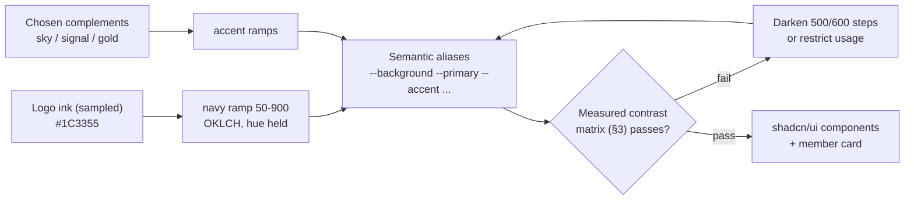
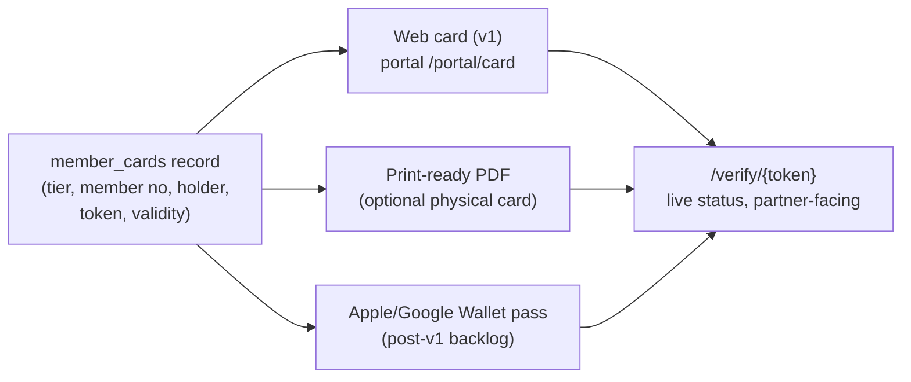

# 08 — Design System (Combined)

> **Purpose:** the visual and component language for all three surfaces — merging Fable's logo-derived palette, token skeleton, and member-card spec (primary), Opus's measured-contrast rigor, type-scale discipline, and card wallet/PDF/print craft, and Codex's member-card principles and component restraint rules — under the names, tiers, and WCAG 2.2 AA target locked in `00-foundation.md`. Implemented as Tailwind CSS 4 theme tokens + shadcn/ui components (00 §4.2).

---

## 1. Logo-driven brand

**The logo has been delivered.** It is a horizontal lockup — the wordmark **AEROSKILL · CLUB** in a bold geometric uppercase sans, with a single-engine low-wing propeller-aircraft silhouette (banking pose) set between the two words — printed in **one color: deep navy** on white. That monochrome fact resolves the brand method:

- **`navy` (primary) is logo-derived:** anchored to the sampled logo ink ≈ **`#1C3355`**, mapped to `navy-800` below. Sampled from the delivered PNG — re-confirm against the source vector when it arrives (10), but the palette is now live, not placeholder.
- **`sky`, `signal`, and the Captain gold are *chosen complements*, not extractions** — the logo carries no second color. They are locked as club design decisions and always defer to navy in hierarchy: navy leads every composition, accents punctuate.



### 1.1 Logo usage rules

| Rule | Specification |
|------|---------------|
| Variants | **Primary:** navy lockup on white/light surfaces. **Reverse:** all-white lockup on `navy-800`+ surfaces (member card, footer, hero) — produced by recoloring the source vector, never by CSS-filtering the PNG |
| Clearspace | ≥ the height of the aircraft glyph on all sides; nothing enters it — no text, rule, image edge, or button |
| Minimum size | Full lockup ≥ 140px wide on screen; below that use the **aircraft glyph alone** (doubles as favicon, app icon, watermark, loading mark; ≥ 24px on screen) |
| Placement | Public header left; member-card front top-left (reverse variant); email headers; PDF letterhead |
| Watermark use | Aircraft glyph at 4–8% opacity behind hero corners and on the member card; always `aria-hidden` |
| Don'ts | No colors other than navy/white; no stretching, re-letter-spacing, gradients, bevels, or drop shadows; never rotate or flip the aircraft; no navy lockup over photography without a light scrim; never box the logo in a colored chip except the square app-icon container (navy field, white mark) |
| Outstanding asset | The delivered file is raster (PNG) — obtain the source vector (SVG/AI) for the reverse variant, favicon set, and crisp card rendering (tracked in 10) |

## 2. Color tokens

Token architecture in three layers (Opus's discipline, Fable's values): **primitives** (the only place hex literals live) → **semantic aliases** (what components consume) → **tier accents**. No component file contains a raw hex value or px font size; a future re-skin edits the primitive ramps and re-runs the §3 matrix, and everything downstream follows.

### 2.1 Brand scales (navy logo-derived; accents chosen)

| Scale | Role | 500 value | Notes |
|-------|------|-----------|-------|
| `navy` | `primary` — headers, primary buttons, card base | `#34568A` | **Logo-derived**; 800 = `#1C3355` (logo ink), 900 = `#12213A` |
| `sky` | `secondary` — links, info, Cadet tier | `#3BA7E0` | Chosen complement: clear-sky blue |
| `signal` | `accent` — CTAs, highlights, Pilot tier | `#F0731F` | Chosen complement: high-visibility "signal orange" |
| `gold` | Captain tier, Founding badge | `#C9A227` | Single token, no ramp — a finish, not a UI color |
| `slate` | neutrals — text, borders, surfaces | `#64748B` | Standard slate ramp 50–900 |

Full ramps (50–900) generated in OKLCH with uniform lightness steps, hue held. The steps components actually reference:

| Ramp | Named steps |
|------|-------------|
| `navy` | 50 `#EEF2F8` · 100 `#D8E1EE` · 200 `#B0C3DD` · 300 `#84A2C7` · 400 `#5578A6` · 500 `#34568A` · 600 `#27446F` · 700 `#203A5F` · 800 `#1C3355` · 900 `#12213A` |
| `sky` | 50 `#EFF8FD` · 300 `#85C7EC` · 500 `#3BA7E0` · 600 `#2286BD` · 700 `#1C6D9A` |
| `signal` | 50 `#FEF3EB` · 300 `#F5A76B` · 500 `#F0731F` · 600 `#C05808` · 700 `#A34605` |
| `slate` | Tailwind slate: 50 `#F8FAFC` · 100 `#F1F5F9` · 200 `#E2E8F0` · 400 `#94A3B8` · 600 `#475569` · 900 `#0F172A` |

The `sky-600` and `signal-600/700` steps are darkened beyond the naive OKLCH interpolation specifically to clear the §3 matrix — the accent 500s are vivid by design and cannot carry text (measured below).

### 2.2 Semantic aliases (what components actually use)

| Token | Light value | Usage |
|-------|-------------|-------|
| `--background` | `slate-50` | Page background |
| `--surface` | `#FFFFFF` | Cards, panels, tables |
| `--surface-inverse` | `navy-900` | Footer, member card, hero |
| `--text` | `slate-900` | Body text |
| `--text-muted` | `slate-600` | Secondary text, captions |
| `--text-faint` | `slate-400` | Placeholders and disabled labels **only** — fails 4.5:1 (§3), never meaningful content |
| `--border` | `slate-200` | Dividers, input borders |
| `--primary` / `--primary-fg` | `navy-600` / white | Primary actions |
| `--accent` / `--accent-fg` | `signal-600` / white | Key CTA buttons (Join, Renew, Pay) — **darkened from `signal-500` by the §3 matrix** |
| `--accent-text` | `signal-700` | Accent-colored body-size text and inline accent links |
| `--link` | `sky-700` | Inline links — **darkened from `sky-600` by the §3 matrix** |
| `--focus` | `sky-600` | Focus ring — **darkened from `sky-500` by the §3 matrix** (`sky-500` is 2.7:1 on white, below the 3:1 non-text minimum) |
| `--success` | `#15803D` | Confirmed payments, `active` states |
| `--warning` | `#B45309` | `grace`, `pending`, expiring soon |
| `--danger` | `#B91C1C` | `expired`, `failed`, destructive actions |
| `--info` | `sky-700` | Announcements, neutral notices |

### 2.3 Tier colors (locked mapping, per 00 §3.1)

| Tier | Token | Value | Used on |
|------|-------|-------|---------|
| Cadet | `--tier-cadet` | `sky-500` `#3BA7E0` | Tier badge, pricing-card top border, member-card stripe |
| Pilot | `--tier-pilot` | `signal-500` `#F0731F` | same |
| Captain | `--tier-captain` | gold `#C9A227` | same, plus a gold border on the whole member card |

Tier 500s are **decorative accents** (stripes, borders, badge fills); tier-colored *text* on light surfaces always uses the 700 step (or navy-900 on a gold fill) — see §3.

### 2.4 Light/dark stance

**v1 is light-mode only** on all surfaces; every color flows through the semantic aliases above so a dark theme is a token-file addition later, not a refactor. The one deliberate exception: the **member card is always rendered on `navy-900`** (§7) regardless of surrounding theme — it is a physical-object metaphor, not a themed panel.

### 2.5 The tokens file (single source of truth)

One `tokens.css` file carries every value in this document (adopted from Codex's token block, layered per Opus). Tailwind's theme maps utilities to `var(--…)`, and shadcn/ui components reference only the semantic layer — a re-skin is three edits: swap the primitive ramps, swap the two logo treatments, re-run the §3 matrix.

```css
:root {
  /* 1 — primitives (the only hex literals in the codebase) */
  --navy-50:#EEF2F8;  --navy-100:#D8E1EE; --navy-200:#B0C3DD; --navy-300:#84A2C7;
  --navy-400:#5578A6; --navy-500:#34568A; --navy-600:#27446F; --navy-700:#203A5F;
  --navy-800:#1C3355; /* logo ink */      --navy-900:#12213A;
  --sky-50:#EFF8FD;   --sky-300:#85C7EC;  --sky-500:#3BA7E0;
  --sky-600:#2286BD;  --sky-700:#1C6D9A;
  --signal-50:#FEF3EB; --signal-300:#F5A76B; --signal-500:#F0731F;
  --signal-600:#C05808; --signal-700:#A34605;
  --gold:#C9A227;
  /* slate = Tailwind slate ramp, imported as-is */

  /* 2 — semantics (what components consume) */
  --background:var(--slate-50); --surface:#FFFFFF; --surface-inverse:var(--navy-900);
  --text:var(--slate-900); --text-muted:var(--slate-600); --text-faint:var(--slate-400);
  --border:var(--slate-200);
  --primary:var(--navy-600);   --primary-fg:#FFFFFF;
  --accent:var(--signal-600);  --accent-fg:#FFFFFF;  --accent-text:var(--signal-700);
  --link:var(--sky-700);       --focus:var(--sky-600);
  --success:#15803D; --warning:#B45309; --danger:#B91C1C; --info:var(--sky-700);

  /* 3 — tier accents (resolved via data-tier on tier-scoped components) */
  --tier-cadet:var(--sky-500); --tier-pilot:var(--signal-500); --tier-captain:var(--gold);

  /* 4 — type / space / radius / elevation / motion scales per §§4–5 */
}
```

No component, document, or Claude Code prompt hardcodes a hex or a px font size — everything resolves through these custom properties.

## 3. Measured contrast matrix (adopted from Opus)

Every token pairing used by a component is **measured, not eyeballed**. Ratios below are computed from the hex values with the WCAG 2.2 relative-luminance formula (sRGB linearization, `(L1+0.05)/(L2+0.05)`), rounded to two decimals. Targets: **4.5:1** normal text · **3:1** large text (≥ 24px, or ≥ 18.66px bold), UI components, and focus indicators.

| # | Foreground | Background | Ratio | 4.5:1 | 3:1 | Where it appears |
|---|------------|------------|-------|-------|-----|------------------|
| 1 | `slate-900 #0F172A` | white | **17.85:1** | ✅ | ✅ | Body text on cards |
| 2 | `slate-600 #475569` | `slate-50 #F8FAFC` | **7.24:1** | ✅ | ✅ | Muted text on page background |
| 3 | white | `navy-800 #1C3355` | **12.70:1** | ✅ | ✅ | Reverse logo, footer, hero text |
| 4 | white | `navy-900 #12213A` | **16.10:1** | ✅ | ✅ | Member-card name and labels |
| 5 | `navy-600 #27446F` | white | **9.80:1** | ✅ | ✅ | Primary button (inverted: white on navy-600, same ratio); headings |
| 6 | `sky-600 #2286BD` | white | **4.03:1** | ✗ | ✅ | Focus ring, large text, icons |
| 7 | `sky-700 #1C6D9A` | white | **5.67:1** | ✅ | ✅ | Inline links, info text |
| 8 | `sky-500 #3BA7E0` | white | **2.70:1** | ✗ | ✗ | Cadet stripe/border — decorative only |
| 9 | `sky-300 #85C7EC` | `navy-900 #12213A` | **8.72:1** | ✅ | ✅ | Member number on the card |
| 10 | `signal-500 #F0731F` | white | **2.93:1** | ✗ | ✗ | Pilot stripe/border — decorative only |
| 11 | white | `signal-500 #F0731F` | **2.93:1** | ✗ | ✗ | **Forbidden** — this killed the naive accent button |
| 12 | white | `signal-600 #C05808` | **4.53:1** | ✅ | ✅ | Accent CTA button (Join/Pay/Renew) |
| 13 | `signal-700 #A34605` | white | **6.11:1** | ✅ | ✅ | Accent body text, "Renew now" links |
| 14 | gold `#C9A227` | `navy-900 #12213A` | **6.66:1** | ✅ | ✅ | Captain accents on the member card |
| 15 | gold `#C9A227` | white | **2.42:1** | ✗ | ✗ | Gold keyline/border only on light |
| 16 | `navy-900 #12213A` | gold `#C9A227` | **6.66:1** | ✅ | ✅ | Captain badge chip text on gold fill |
| 17 | `--success #15803D` | white | **5.02:1** | ✅ | ✅ | Success text/icons |
| 18 | `--warning #B45309` | white | **5.02:1** | ✅ | ✅ | Warning text/icons |
| 19 | `--danger #B91C1C` | white | **6.47:1** | ✅ | ✅ | Danger text; white-on-danger buttons also pass (6.47:1) |
| 20 | `slate-400 #94A3B8` | white | **2.56:1** | ✗ | ✗ | Placeholders/disabled only |

**Rules that fall out of the failing rows (each one is binding):**

1. **Row 8 — `sky-500` on white fails even 3:1:** `sky-500` never carries text or stands alone as an icon/focus color on light surfaces. It is the Cadet decorative accent (stripe, border, badge fill with dark text). The Cadet badge on white is a `sky-50` fill with `sky-700` text (5.27:1 ✅).
2. **Rows 10–11 — `signal-500` fails both directions:** signal-500 is the Pilot decorative accent only. The accent CTA button uses a **`signal-600` fill with white text** (4.53:1 ✅); the vivid 500 survives as the pricing-card stripe and tier badge fill, never as a text carrier.
3. **Row 6 — `sky-600` on white passes only 3:1:** `sky-600` is reserved for large text, icons, and the focus ring; **inline body links use `sky-700`** (5.67:1 ✅). This amends the naive `--link: sky-600` alias.
4. **Row 15 — gold on white fails both:** gold never carries text on light surfaces. The "Founding member" badge on white is a gold **outline** with `slate-900` text; the Captain badge on light is a gold **fill** with `navy-900` text (6.66:1 ✅, row 16). Gold-as-text exists only on the navy card field (row 14).
5. **Row 20 — `slate-400` fails both:** placeholders and disabled labels only; any string a user must read uses `slate-600` or darker.

**Maintenance rule:** any new token pairing (new component, new tier, dark theme later) gets a matrix row before it ships. If it fails, darken the step or restrict the usage — never waive the threshold.

## 4. Typography

All fonts self-hosted via `next/font` (no external font requests — GDPR posture, 09). All chosen families fully cover Romanian diacritics **ă â î ș ț** with correct **comma-below** forms (U+0218–U+021B, never the Turkish cedilla forms) — verified: Inter and Manrope both ship complete Latin Extended coverage. Always load the **`latin-ext`** subset (a `latin`-only subset silently drops ă/â/î/ș/ț); re-verify glyph coverage for any future font swap — ș/ț rendering is the most common Romanian-web typography failure. Set `lang="ro"` / `lang="en"` on `<html>` per locale.

| Role | Family | Weights |
|------|--------|---------|
| Display / headings | **Manrope** | 600, 800 |
| Body / UI | **Inter** | 400, 500, 600 |
| Numeric / codes (member number, prices, ICAO codes, payment references) | **JetBrains Mono** | 500 |

Type scale (16px base; px given for design-tool fidelity, rem is the source of truth in tokens):

| Token | rem / px | Line height | Family / weight | Usage |
|-------|----------|-------------|-----------------|-------|
| `display` | 3rem / 48px | 1.1 | Manrope 800 | Public hero only |
| `h1` | 2.375rem / 38px | 1.15 | Manrope 800 | Page titles |
| `h2` | 1.875rem / 30px | 1.2 | Manrope 600 | Section titles |
| `h3` | 1.5rem / 24px | 1.25 | Manrope 600 | Card titles |
| `h4` | 1.25rem / 20px | 1.3 | Inter 600 | Table/list headers |
| `body-lg` | 1.125rem / 18px | 1.6 | Inter 400 | Public lead paragraphs |
| `body` | 1rem / 16px | 1.6 | Inter 400 | Default |
| `body-sm` | 0.875rem / 14px | 1.5 | Inter 400/500 | Admin tables, meta |
| `caption` | 0.75rem / 12px | 1.4 | Inter 500 | Labels, hints, chips |
| `mono` | 0.875rem / 14px | 1.5 | JetBrains Mono 500 | Member numbers, prices, ICAO codes |

**Layout rules (adopted from Opus):** headings use `letter-spacing: -0.01em`; all-caps only for short labels/chips with `+0.06em`. Body text max measure **66ch**. **Design every layout to the Romanian string** — Romanian runs ~15–25% longer than English ("Membership" → "Abonament", "Sign out" → "Deconectează-te"); never size fixed-width buttons or labels from the English measure. Hero-scale type never appears inside cards or admin panels.

## 5. Spacing, radius, elevation, motion

- **Spacing** (4px base): `1`=4, `2`=8, `3`=12, `4`=16, `5`=20, `6`=24, `8`=32, `10`=40, `12`=48, `16`=64. Public sections use `12`/`16` vertical rhythm; admin density uses `2`–`4`.
- **Radius:** `sm` 6px (inputs, chips) · `md` 10px (buttons, cards) · `lg` 16px (panels, modals) · `card` 20px (member card, pricing cards) · `full` (avatars, badges). No pill-shaped everything; no cards inside cards.
- **Elevation:** `0` none (admin tables — borders and background contrast, not shadows) · `1` subtle (cards) · `2` raised (dropdowns, popovers) · `3` modal. Shadows in `navy-900` at 6–16% alpha — never pure black. No glassmorphism, no layered translucent panels.
- **Motion:** `fast` 150ms (hover, focus) · `base` 250ms (dropdowns, toasts) · `slow` 400ms (card flip, page transitions), all `ease-out`. Loading uses skeletons for content, spinners only for button-scoped async. **`prefers-reduced-motion: reduce` is a hard guardrail:** replace all movement (including the card flip) with opacity cross-fades; no flashing above 3Hz; no autoplaying carousels or decorative loops.

### 5.1 Grid & breakpoints (adopted from Opus)

- 12-column fluid grid; gutter 24px; max content width **1200px** (public) / **1320px** (admin tables). The member portal constrains content to **960px** for readability.
- Breakpoints are Tailwind defaults, unmodified: `sm` 640 · `md` 768 · `lg` 1024 · `xl` 1280 · `2xl` 1536.
- Public pages are mobile-first single-column, expanding to the 12-column grid at `lg`. The admin CRM keeps a persistent left rail at `lg`+, collapsing to a sheet below.
- Full-width navy bands and unframed sections structure public pages; cards are for repeated items, never for whole page sections (§6).

## 6. Component inventory

Built on shadcn/ui, themed via §2 tokens. States required for every interactive component: default, hover, focus-visible, active, disabled, loading (where async). Focus-visible is always a 2px `--focus` (`sky-600`) ring with a 2px offset.

| Component | Key rules |
|-----------|-----------|
| **Button** | Variants: `primary` (navy-600), `accent` (signal-600 — reserved for Join/Pay/Renew, max one per view region), `secondary` (outline), `ghost`, `destructive` (danger fill, white text). Min touch target 44×44px. Loading = spinner + `aria-busy` with the label retained — never collapse the width (the Romanian label is longer) |
| **Input / Select / Textarea / Date picker** | Label always above and visible (no placeholder-as-label); placeholder in `--text-faint`; error text below in `--danger` with an alert icon and `aria-invalid`; Zod messages verbatim |
| **Form section** | Title + description + fields; single-column on mobile; required fields marked; long admin forms use a sticky footer for Save/Cancel |
| **Card** | `surface`, radius `md`, elevation `1`. Cards are for repeated items, credentials, and forms — never for whole page sections or hero copy |
| **Pricing card (tier)** | Radius `card`; tier-color top border (4px) + tier badge; price in JetBrains Mono, ro-formatted (`3.000 RON`); middle tier (Pilot) visually elevated as the recommended choice; the shared benefit core is shown ticked on all three tiers, never hidden to upsell |
| **Sponsor grid** | Grayscale logos, color on hover; grouped by package (Gold row largest); equal optical sizing, never stretch a partner mark; links `rel="sponsored"` |
| **Status chip** | Pill, `caption` type, **icon + translated label + tinted fill** — never color alone, never the raw enum value. Mapping in §6.1 |
| **Data table (admin)** | `body-sm`, sticky header, sticky first column on horizontal scroll, row hover, column sort with `aria-sort`, filter bar above; mono columns (member numbers, ICAO, dates, money) right-aligned for money/dates; zebra striping only where row height demands it; horizontal overflow scrolls inside the container, never the page; bulk-select only where a bulk action exists |
| **Nav — public header** | Logo left; Mission, Membership, Sponsors, Fleet, Contact; locale switcher (preserves route, sets `hreflang`); `accent` Join button; login link; `aria-current="page"` on the active item |
| **Nav — portal** | Top bar: Dashboard, My membership, My card, Benefits, Profile; mobile bottom-tab equivalent |
| **Nav — admin sidebar** | Groups per 05: Overview · People · Partners · Agreements · Comms · Fleet · System. Admin views carry no decorative imagery or marketing composition |
| **Badge** | Tier badges per §2.3 rules (700-step text on light); "Founding member" badge = gold outline + `slate-900` text on light, gold fill + `navy-900` text on the card |
| **Toast** | Bottom-right, `base` motion, auto-dismiss 5s — **errors persist until dismissed**; max 3 stacked; polite live region; optional action button |
| **Modal / Confirm** | Focus trapped, `Esc` closes, focus returns to trigger; destructive confirms restate the object name and require typed confirmation for irreversible actions (member archive, contract terminate) |
| **Tooltip** | 200ms open delay; never the sole carrier of essential information |
| **Empty state** | Icon + one sentence + primary action; specified for every list view in 04 |
| **QR code block** | Min 160×160px on-screen, quiet zone preserved, error correction level M |

### 6.1 Status-chip color mapping (keyed to the locked enums, 00 §7.2)

| Chip color | Fill / text (measured) | Enum values |
|------------|------------------------|-------------|
| **Success** | `#DCFCE7` / `#15803D` (4.57:1 ✅) | `active` · `confirmed` · `sent` |
| **Warning** | `#FEF3C7` / `#B45309` (4.51:1 ✅) | `pending` · `grace` · `scheduled` · `maintenance` |
| **Danger** | `#FEE2E2` / `#B91C1C` (5.30:1 ✅) | `expired` · `failed` · `terminated` · `cancelled` |
| **Neutral** | `slate-100` / `slate-600` (6.92:1 ✅) | `draft` · `archived` · `retired` · `refunded` |

The same status renders identically in portal and admin. Chip text is the enum value translated (ro/en), never the raw token; the icon (check / clock / x / minus circle) makes the state legible without color.

### 6.2 Interaction-state spec (adopted from Opus's per-state rigor)

| State | Treatment |
|-------|-----------|
| default | Token values as specified per variant |
| hover | Fill variants darken one perceptual step (navy-600 → navy-700, signal-600 → signal-700); clickable cards lift one elevation step |
| active (pressed) | `translateY(1px)` + the hover darkening |
| focus-visible | 2px `--focus` ring, 2px offset — always, on every interactive element, never clipped |
| disabled | 40% opacity, no pointer events; disabled text uses `--text-faint` (§3 row 20 — placeholders/disabled only) |
| loading | Spinner + `aria-busy="true"`; label and width retained (Romanian labels are the sizing measure, §4) |

## 7. Member card spec (the flagship component)

The digital member card is the product's daily touchpoint (01). Rendered in the portal at `/portal/card` and designed to be shown at a partner desk. Three principles govern every rendering (adopted from Codex):

1. **It must work as a screenshot** — members will screenshot it; all information must be legible in a static image, and validity is always re-checkable live via the QR.
2. **It must not look like a payment card** — no chip graphic, no embossed 16-digit styling, no network-logo placement; it is a club credential.
3. **It is not a licence** — the card back/details carry the disclaimer "Acesta este un card de membru, nu o licență de zbor / This is a membership card, not a pilot licence."

### 7.1 Layout — front

- **Aspect:** CR80 card ratio (85.6 × 54 mm → 1.586:1), radius `card`, always on `--surface-inverse` (`navy-900`) with a subtle horizon-line graphic motif and the aircraft glyph watermarked at 4–8% opacity.
- **Top row:** club logo (white reverse variant) left; tier badge right (tier color, §2.3) — Captain additionally gets a **gold border on the whole card** with gold accents (gold on navy-900 = 6.66:1 ✅).
- **Middle:** member full name (Manrope 600, white — 16.10:1 ✅); member number `ASC-YYYY-NNNN` in JetBrains Mono, `sky-300` (8.72:1 ✅); "Founding member" badge when applicable (gold fill, navy-900 text).
- **Bottom row:** validity — "Valabil până la / Valid until `DD.MM.YYYY`" (locale-formatted per 00 §7.3) left; **QR code** right (white module on navy, 160px min, quiet zone respected) with an adjacent plain-text fallback link.
- QR encodes the absolute verification URL `https://{domain}/verify/{token}` (token per 00 §6).
- **Tier differentiation:** identical layout across tiers — only the stripe/badge accent changes (Cadet `sky-500`, Pilot `signal-500`, Captain gold + full gold border), so the card family reads as one credential climbing in prestige.

**Required fields (complete list — nothing else goes on the card):**

| Field | Rendering |
|-------|-----------|
| Club branding | White reverse lockup, top-left |
| Member name | Manrope 600, white |
| Member number | `ASC-YYYY-NNNN`, JetBrains Mono, `sky-300` |
| Tier | Badge, tier color per §2.3 |
| Valid until | Locale-formatted date, white |
| Status | Implicit when `active`; explicit grayscale + overlay when not (§7.3) |
| QR code | White block, verification URL |
| Founding badge | Only when applicable |

### 7.2 Details panel (below the card, not on it)

Tier benefits summary (from the live benefits catalog), grace-period notice when status is `grace` ("Abonament în perioada de grație până la `data` — reînnoiește acum" with the `accent` Renew button), the not-a-licence disclaimer, and a brightness hint for scanning.

### 7.3 States

| Member status | Card rendering |
|---------------|----------------|
| `active` | Full color as specified |
| `grace` | Full color + warning banner in details panel |
| `expired` / `archived` | Card desaturated to grayscale, "Expirat / Expired" overlay — unmistakable at a glance; QR still resolves (the verification page reports the invalid status — screenshots can't lie, 02) |

### 7.4 Outputs: web, PDF/print, wallet

One card design renders to three outputs; the web card is v1, the rest reuse its layout.



- **Web:** all card information is real text, never baked into an image (screen readers get everything); offline-tolerant (renders the last-known card from cache; verification is always live); "add to home screen" guidance in the portal.
- **PDF / print (adopted from Opus):** the CR80 layout doubles as a print-ready PDF for optional physical cards — print-safe navy (no reliance on screen luminance), 300dpi assets, crop-safe margins, bilingual labels stacked RO over EN; the QR must scan from matte print.
- **Wallet:** native Apple/Google Wallet passes are **post-v1** (10 backlog). The field mapping is fixed now so the pass is a rendering, not a redesign: tier → pass color, member number → primary field, validity → expiry, token → QR barcode.

### 7.5 Verification page (`/verify/{token}`) — partner-facing

Same brand, radically simple, one screen, no login: giant status verdict — ✅ "Membru activ / Active member" (success green) or ❌ "Card invalid / expirat" (danger red) — then member first name + last initial, tier badge, validity date, and "checked at `timestamp`". No other personal data (GDPR minimization). Rendered server-side, live from the database; works on any phone at a partner desk (mobile-first, rate-limited per 09).

## 8. Accessibility (per 00 §8 — WCAG 2.2 AA)

Regulatory context (researched, 00 §8): the EAA has been enforced since 2025-06-28; its harmonized standard EN 301 549 v3.2.1 embeds WCAG 2.1 AA, with the WCAG 2.2 revision (v4.1.1) expected in 2026. The club is very likely EAA-exempt as a services microenterprise, but we target **WCAG 2.2 AA** and publish an accessibility statement (04) so growth never triggers a retrofit.

1. Text contrast ≥ 4.5:1 (≥ 3:1 for large text and UI); **every pairing measured in the §3 matrix** — the failing rows carry binding usage restrictions, and new pairings get a row before shipping.
2. Full keyboard operability; visible `focus-visible` ring (2px `sky-600`, 2px offset — 4.03:1 against white, above the 3:1 non-text minimum) on every interactive element; ring never clipped by overflow containers.
3. Touch targets ≥ 44×44px (portal is mobile-first, 00 §8) — comfortably above WCAG 2.2's new 24×24px minimum.
4. All form inputs labeled; errors announced via `aria-live`; status chips carry icon + text, never color alone.
5. `lang` attribute switches with locale; comma-below diacritics render correctly in all three families (§4); both language versions meet contrast at their longer string lengths — no clipped Romanian labels.
6. Images: meaningful `alt`; sponsor logos alt = sponsor name; decorative motifs and watermarks `alt=""` / `aria-hidden`.

**The five success criteria new in WCAG 2.2 AA, with their concrete design consequences here:**

| New criterion | Consequence in this system |
|---------------|----------------------------|
| 2.4.11 Focus Not Obscured | Sticky headers/admin filter bars must never cover the focused element — scroll-margin on all focusable rows |
| 2.5.8 Target Size (Minimum, 24px) | Already exceeded by rule 3; applies to inline links in dense admin tables too |
| 3.2.6 Consistent Help | Contact/help link sits in the same footer position on every public and portal page |
| 3.3.7 Redundant Entry | The application flow (04) never re-asks data already given at registration; renewal/upgrade forms prefill everything known |
| 3.3.8 Accessible Authentication | Email+password with paste allowed and password-manager friendly; no CAPTCHAs or cognitive puzzles on `/login` (rate limiting per 09 does the anti-abuse work instead) |

## 9. Imagery & tone

- **Photography:** real Romanian GA — aircraft on grass strips, cockpit details, pre-flight walk-arounds, hangar life, golden-hour aprons, instructors with students. **Never:** airliner/business-jet stock, airport terminals, anonymous clouds from a cabin window, stock handshakes, "diverse team pointing at a laptop", AI-perfect renders. Text over photography always sits on a navy scrim holding ≥ 4.5:1.
- **Iconography:** Lucide (ships with shadcn/ui), 1.5px stroke, `slate-600` default, `currentColor` inheritance. Icons clarify actions, they don't decorate empty space — the logo's aircraft is the aviation signal; the UI does not repeat airplane decorations.
- **Voice:** confident, warm, plain — "Zbori mai mult. Plătești mai puțin. Aparții." (01). Romanian copy is the master; English translates the Romanian, never vice versa. Lead with the member's benefit; be specific and numeric where it builds trust ("3.000 RON/an", "valabil până la 28.07.2027"); at most one light aviation flourish per flow, never on errors or legal content; errors are plain, blame-free, and say what to do next. No aviation gatekeeping jargon on public pages; ICAO codes and registrations are welcome in fleet/admin contexts (real reference points: Clinceni `LRCN`, Ploiești-Strejnic `LRPV`, Brașov-Sânpetru `LRSP`, Tuzla `LRTZ`).

### 9.1 Voice examples (Romanian primary, English peer)

| Context | Română | English |
|---------|--------|---------|
| Hero CTA | **Înscrie-te în club** | Join the club |
| Renewal reminder | Abonamentul tău expiră pe **28.07.2027**. Reînnoiește-l acum. | Your membership expires on **28 Jul 2027**. Renew now. |
| Payment error | Plata nu a putut fi procesată. Verifică datele cardului și încearcă din nou. | We couldn't process the payment. Check your card details and try again. |
| Card disclaimer | Acesta este un card de membru, **nu o licență de zbor**. | This is a membership card, **not a pilot licence**. |
| GDPR consent | Îți respectăm datele. Alege ce comunicări vrei să primești. | We respect your data. Choose which communications you'd like to receive. |

Avoid: "unlock your potential" copy, exclamation stacking, ALL-CAPS shouting (caps are for the wordmark and short labels only), untranslated English inside Romanian copy, and machine-translated Romanian anywhere.

## 10. Do / Don't and per-surface summary

### 10.1 System-wide do / don't (merged from Codex's restraint rules and Opus's brand guardrails)

| Do | Don't |
|----|-------|
| Let the logo be the primary aviation signal | Fill the UI with airplane icons and decorations |
| Use real Romanian GA imagery | Use airline/terminal stock, gradient-blob heroes, or AI-perfect renders |
| Keep navy anchoring, accents punctuating | Flood every section with navy until the app feels heavy |
| Make the member card a premium credential | Make it look like a payment card, or hide the expired state |
| Use status chips identically everywhere | Convey any state with color alone |
| Keep admin screens dense, calm, data-first | Put marketing composition, oversized cards, or decorative imagery in admin |
| Measure every new color pairing (§3) | Eyeball contrast or waive a failing ratio |
| Design layouts to the Romanian string | Size buttons and labels from the English measure |

### 10.2 Per-surface summary (adopted from Codex)

| Surface | Visual feeling | Primary design job |
|---------|----------------|--------------------|
| Public website | Aspirational, credible, GA-specific | Convert visitors and build trust — tiers easy to compare, break-even math up front (02) |
| Member portal | Personal, clear, useful | Show status, valid-until date, card, benefits, renewal state — always in that order |
| Admin CRM | Calm, dense, operational | Manage members, partners, contracts, benefits fast; navy for navigation and primary actions only |
| `/verify/{token}` | Radically simple, one verdict | Let a partner confirm a card in under three seconds, on any phone |

---

*Sources for the researched claims in this document: [EAA e-commerce requirements](https://accessible.org/eaa-ecommerce-services-requirements/), [EN 301 549 / WCAG mapping](https://www.levelaccess.com/blog/is-wcag-conformance-enough-for-eaa-compliance/), [EN 301 549 v4.1.1 / WCAG 2.2 timeline](https://digital-strategy.ec.europa.eu/en/policies/latest-changes-accessibility-standard). Contrast ratios computed from token hex values with the WCAG 2.2 relative-luminance formula. Full research basis: 00 §10.*
