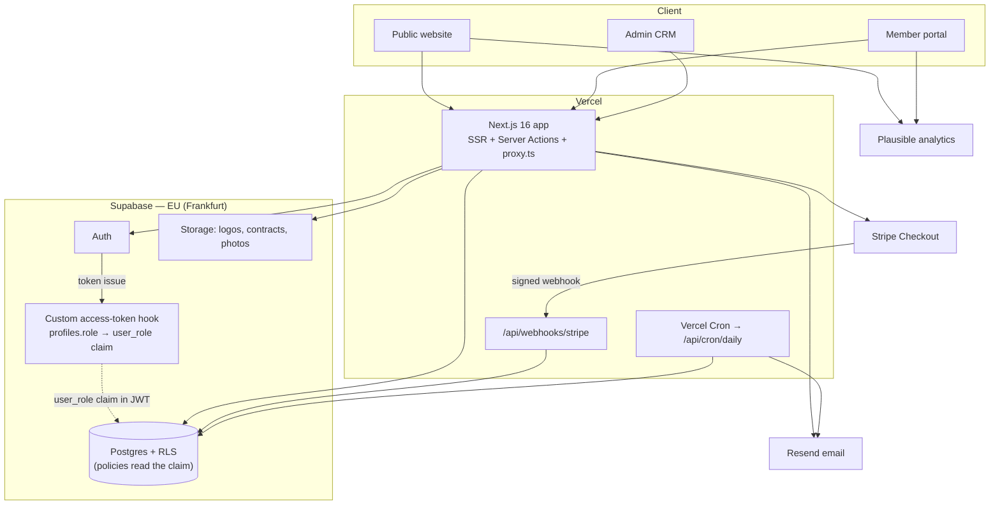
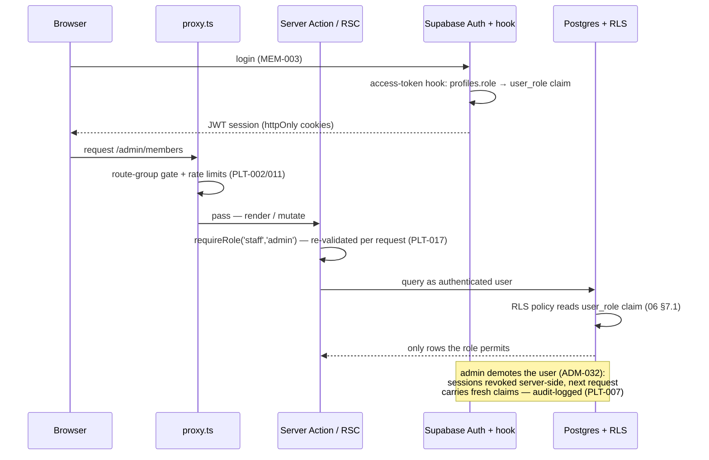
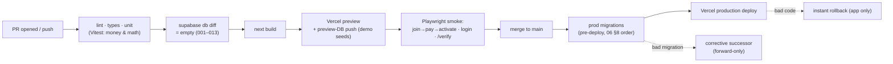

# 09 — Technical Infrastructure (Combined)

> **Purpose:** stack, services, repository layout, environments, security/GDPR posture, and deployment for the platform — **Combined edition**. Structure: **Fable's** infrastructure skeleton kept intact (architecture diagram, stack rationale table, verified services-and-cost table, env-var registry, GDPR data map with Romanian legal bases, EAA and e-Factura boundaries, deployment and observability). Craft: **Opus's** repository directory tree and CI-pipeline depth — redrawn here against `05-information-architecture.md`'s actual route canon (Opus's own tree drifted from its IA; this one is verified against 05 §1–§2 line by line). Breadth: **Codex's** env-var completeness, its honest free-tier/commercial-use notes, and its dated source-notes hygiene (folded into the sources footer). Stack choices are locked in `00-foundation.md` §4.2 — this document operationalizes them. Depends on `04-prd.md` (PLT requirements) and `06-database-schema.md` (RLS, migrations); every route named here is 05's canon verbatim.

---

## 1. Architecture overview

One Next.js app serving all three surfaces; Supabase as the data/auth/storage plane; a small set of external services. The one Combined addition to Fable's diagram: the **custom access-token auth hook** is drawn where it lives — on the Supabase side, between Auth and the RLS policies that consume its claim (00 §4.2, 06 §7.1).



Key properties: no self-managed servers; the only stateful system is Supabase Postgres; every write path goes through Server Actions or the two machine endpoints (webhook, cron), all Zod-validated (PLT-008) and RLS-backstopped (PLT-002). The auth hook is configuration, not code — it is set per environment in Supabase Auth settings and sits on the §5.3 setup checklist (06 §8, migration 002 note).

The diagram has exactly four trust boundaries, each with a named gate:

1. **Browser → app:** `proxy.ts` — locale, route-group gating, rate limits (PLT-002/011).
2. **App → database:** the caller's JWT under RLS — the app can only ask for what the role permits (06 §7).
3. **Stripe → app:** webhook signature verification against the raw body (PLT-009) — the only inbound third-party path.
4. **Scheduler → app:** the `CRON_SECRET` header on `/api/cron/daily` (PLT-005) — the only other machine path.

Everything else on the diagram is outbound from trusted server code.

## 2. Stack detail

| Piece | Version / plan | Why for a solo Claude Code developer (00 §4.2) |
|-------|----------------|------------------------------------------------|
| Next.js | **16.x (LTS since 2025-10)**, App Router, TypeScript strict, Turbopack default | One framework, three surfaces via route groups; server-first by default; route gating in `proxy.ts` (Next 16's renamed middleware); React 19 + stable React Compiler |
| Supabase | Pro plan | Postgres + Auth + Storage + RLS in one managed service; local dev via `supabase` CLI; the auth hook feeds the JWT role claim (06 §7.1) |
| Tailwind CSS + shadcn/ui | 4.x / latest | Token-driven implementation of 08; components live in-repo, fully editable |
| next-intl | latest | Locale routing per 00 §4.4 (`ro` at root, `/en` prefix); typed message catalogs |
| Stripe | Checkout + webhooks | RON support; hosted Checkout means no card data ever touches the app (SAQ-A scope) |
| Resend + react-email | latest | Transactional + campaign batch sends from one provider; layout components in the repo, staff-editable bodies in `email_templates` (06 §3.7, ADM-023) |
| Zod | latest | Single validation idiom at every boundary (PLT-008) |
| Plausible | EU-hosted | Cookieless analytics (PLT-010) — no consent banner |
| Vitest + Playwright | latest | Test posture per 03: unit-test the money and the math, smoke-test the golden path (§4, §8) |

## 3. Third-party services (doubles as GDPR processor list)

Plan prices verified against published pricing, July 2026:

| Service | Purpose | Cost / month (verified) | Personal data shared |
|---------|---------|-------------------------|----------------------|
| Vercel (Pro) | Hosting, cron, previews | ~100 RON ($20/seat) | IP addresses (transient logs) |
| Supabase (Pro) | DB, auth, storage, backups | ~125 RON ($25, includes $10 compute credit) | All member data (primary store, EU region) |
| Stripe | Card payments | 0 fixed; **≈1.5% + 1 RON** per EEA card, 100 RON per dispute | Name, email, payment metadata |
| Resend (Pro) | Email (transactional + campaigns) | ~100 RON ($20, 50k emails/mo — far above v1 volume) | Name, email addresses |
| Plausible | Analytics | ~45 RON (€9, 10k pageviews/mo tier) | None (aggregate, cookieless) |
| Domain + misc | DNS | ~10 RON | — |
| **Total fixed** | | **~480 RON/month** | |

**Card-fee context:** at the Year-1 base case (120 members / 435,000 RON dues, 02 §5) an all-card year costs **~6,700 RON in Stripe fees** (~1.5% + 1 RON × ~120 payments); every bank-transfer payment reduces that but adds staff reconciliation minutes (ADM-006). Netopia plan B at 0.99% + 0.30 RON (~60% RO market share, 00 §4.2) would roughly halve card fees at the cost of a heavier integration — revisit only if Stripe onboarding fails or card volume makes the delta material (>500 members). Annual picture: ~5,760 RON fixed + ~6,700 RON worst-case card fees ≈ **12,500 RON/year — under 3% of base-case dues**; infrastructure is never the club's cost problem.

**Free-tier honesty** *(adopted from Codex)*: Supabase Free, Resend Free (3,000 emails/mo), and Vercel Hobby exist and are fine for local work and throwaway experiments — but **a dues-collecting club is commercial use**, which Vercel's Hobby terms exclude, and the Free Supabase tier lacks the backup guarantees 00 §8 requires. Production launches on the paid plans above; ~480 RON/month is the honest baseline, not a free-tier fantasy. Stripe is never "free tier" — no fixed fee, but every transaction pays the processing fee.

All providers under EU SCCs or EU-region hosting; DPAs signed with each (GDPR non-negotiable, 00 §8). All four core providers are US-incorporated companies operating EU regions — the privacy policy discloses this plainly rather than pretending otherwise. This table is the processor list referenced by the privacy policy (PUB-010 AC2).

## 4. Repository layout

*(Technique adopted from Opus; every path below is verified against 05 §1–§2 — route groups `(public)`/`(auth)`/`(portal)`/`(admin)`, the two API routes, and nothing else. Opus's news/MDX, events, bookings, documents-vault, and wallet directories are rejected with their features — 00 §9, 04 §6.)*

One Next.js 16 app. The `[locale]` segment covers public, auth, and portal surfaces (`ro` at root via `as-needed` prefixing, `/en` prefixed — 00 §4.4). **Admin sits outside `[locale]`** because it is `ro`-only and takes no locale prefix (05 §2.3); `/verify/{token}` is locale-less and bilingual on one screen.

```text
aeroskill-club/
├── proxy.ts                             # Next 16 network boundary: locale routing (next-intl),
│                                        # route-group gating per 05 §6, rate limits (PLT-002/011)
├── app/
│   ├── [locale]/                        # ro at root (no prefix) · /en prefix (00 §4.4)
│   │   ├── layout.tsx                   # html lang, fonts, NextIntlClientProvider, hreflang (05 §8)
│   │   ├── (public)/                    # marketing shell: header/footer per 05 §4
│   │   │   ├── layout.tsx
│   │   │   ├── page.tsx                 # /                      PUB-001/005/017
│   │   │   ├── mission/page.tsx         # /mission               PUB-002
│   │   │   ├── membership/page.tsx      # /membership            PUB-003/004/016/019/020
│   │   │   ├── sponsors/page.tsx        # /sponsors              PUB-006
│   │   │   ├── fleet/page.tsx           # /fleet                 PUB-007
│   │   │   ├── contact/page.tsx         # /contact               PUB-008/018
│   │   │   ├── join/page.tsx            # /join?tier={slug}      PUB-009
│   │   │   └── legal/
│   │   │       ├── privacy/page.tsx     # PUB-010 — renders the §3 processor list
│   │   │       ├── terms/page.tsx       # PUB-010
│   │   │       ├── cookies/page.tsx     # PUB-010
│   │   │       └── accessibility/page.tsx  # PUB-015
│   │   ├── (auth)/                      # focused shell, no marketing nav (05 §3.1)
│   │   │   ├── login/page.tsx           # MEM-003
│   │   │   ├── register/page.tsx        # MEM-001
│   │   │   └── reset-password/page.tsx  # MEM-004
│   │   └── (portal)/                    # authenticated member shell
│   │       └── portal/
│   │           ├── layout.tsx           # member session; status banner per 05 §5
│   │           ├── page.tsx             # /portal                MEM-008/026/027
│   │           ├── apply/page.tsx       # MEM-002
│   │           ├── membership/
│   │           │   ├── page.tsx         # MEM-011
│   │           │   ├── pay/page.tsx     # MEM-005/006/027
│   │           │   ├── renew/page.tsx   # MEM-012/029
│   │           │   └── upgrade/page.tsx # MEM-013
│   │           ├── payments/page.tsx    # MEM-014
│   │           ├── card/page.tsx        # MEM-015/016
│   │           ├── benefits/page.tsx    # MEM-017/018
│   │           ├── announcements/page.tsx  # MEM-020
│   │           ├── profile/page.tsx     # MEM-009/010 + licenses section MEM-023/024
│   │           └── settings/page.tsx    # MEM-019/021/022/028
│   ├── (admin)/                         # OUTSIDE [locale] — ro-only, no /en prefix (05 §2.3)
│   │   └── admin/
│   │       ├── layout.tsx               # requireRole(staff|admin); sidebar groups per 05 §4
│   │       ├── page.tsx                 # /admin                 ADM-001/002
│   │       ├── reports/renewals/page.tsx   # ADM-045
│   │       ├── members/                 # list + [id] 360°       ADM-003..011/036/037/041
│   │       ├── payments/                # register + matching    ADM-039/006/043/044, PLT-014 triage
│   │       ├── flight-schools/          # list + [id]            ADM-012/016/041/042
│   │       ├── associations/            # list + [id]            ADM-013/016/041/042
│   │       ├── aerodromes/              # list + [id]            ADM-014/016/041/042
│   │       ├── sponsors/                # list + [id]            ADM-015/016/041/042
│   │       ├── contracts/               # list + [id]            ADM-017..020
│   │       ├── benefits/                # list + [id]            ADM-021/022
│   │       ├── campaigns/               # list + [id] composer   ADM-024..027/040
│   │       ├── templates/page.tsx       # ADM-023
│   │       ├── send-log/page.tsx        # ADM-028
│   │       ├── fleet/                   # list + [id]            ADM-029..031
│   │       ├── users/page.tsx           # ADM-032 [admin]
│   │       ├── settings/page.tsx        # ADM-033 [admin]
│   │       └── audit/page.tsx           # ADM-034 + job-run tab PLT-015 [admin]
│   ├── verify/[token]/page.tsx          # locale-less, bilingual  PUB-013, PLT-013
│   ├── api/
│   │   ├── webhooks/stripe/route.ts     # PLT-009/014 — raw body, signature-first
│   │   └── cron/daily/route.ts          # PLT-005/006/015 — CRON_SECRET header
│   ├── sitemap.ts · robots.ts           # PUB-012
│   └── not-found.tsx · forbidden.tsx    # branded 404/403 (PUB-014)
├── actions/                             # Server Actions by domain — every one Zod-guarded (PLT-008)
│   ├── application.ts                   # register/apply (MEM-001/002)
│   ├── membership.ts                    # renew/upgrade pricing + execution (MEM-012/013/029)
│   ├── payments.ts                      # Checkout session, transfer instructions, staff confirm/refund
│   ├── licenses.ts                      # MEM-023/024 member side · ADM-036 staff side
│   ├── profile.ts · consent.ts          # MEM-009/010 · MEM-019 (writes consent_events)
│   ├── privacy.ts                       # export MEM-021 · erasure request MEM-022 / execute ADM-035
│   └── admin/                           # entity CRUD, campaigns, users — audit-logged (PLT-007)
├── lib/
│   ├── supabase/                        # server client (cookies) + service-role client (server-only)
│   ├── payments/                        # stripe.ts · reference-code.ts (ASC-P-NNNNN) · reconcile.ts
│   ├── membership/                      # THE ENGINE: dates.ts (anniversary/grace math, 00 §3.2),
│   │                                    # proration.ts (MEM-013), transitions.ts (PLT-006),
│   │                                    # founding.ts (price lock MEM-029, counter PUB-017)
│   ├── rbac.ts                          # requireRole() guards for actions + layouts (PLT-002/017)
│   ├── rate-limit.ts                    # per-IP ceilings behind proxy.ts (PLT-011/013)
│   ├── audit.ts                         # audit_logs writer with actor_label (PLT-007)
│   ├── email/                           # Resend client + send helpers; every send writes email_log
│   ├── i18n/                            # next-intl request config, ro/en formatters (00 §7.3)
│   └── validation/                      # shared Zod schemas incl. the SAUM/AACR pairing (MEM-024)
├── components/                          # shadcn/ui on 08 tokens: status chips, card, QR block, tables
├── emails/                              # react-email base layout + renderer that merges the
│                                        # DB-stored subject/body of email_templates (06 §3.7)
├── messages/
│   ├── ro.json                          # primary catalog — no hardcoded copy anywhere (PLT-003)
│   └── en.json
├── supabase/
│   ├── migrations/                      # 001–013, exactly the 06 §8 order — the schema source of truth
│   ├── seed.sql                         # production seeds: tiers, singleton, 21 template keys (06 §8)
│   ├── seed.dev.sql                     # local/preview demo data only — never production (06 §8)
│   └── config.toml
├── tests/
│   ├── unit/                            # Vitest, per 03's posture — the bug-costly math:
│   │                                    # proration (00 §3.3), date arithmetic + transitions (PLT-006),
│   │                                    # founding lock (MEM-029), segment resolution (ADM-040),
│   │                                    # Zod schemas incl. MEM-024 pairing
│   └── e2e/                             # Playwright smoke: join→pay→activate golden path in Stripe
│                                        # test mode, login, /verify — run in CI against preview (§8)
├── public/                              # static assets, OG image (PUB-012)
└── vercel.json                          # cron schedule (§8)
```

### 4.1 Where each kind of server code lives *(adapted from Opus)*

| Need | Mechanism | Lives in | Why |
|------|-----------|----------|-----|
| Form submit / mutation (member or staff) | **Server Action** | `actions/*` | Co-located, type-safe; Zod at the boundary (PLT-008); `requireRole()` guard first line (PLT-002) |
| Inbound Stripe callback | **Route Handler** | `app/api/webhooks/stripe` | Stable public URL + raw body for signature verification (PLT-009) |
| Scheduled work | **Route Handler** | `app/api/cron/daily` | Vercel Cron target; `CRON_SECRET` header (PLT-005) |
| Data read for a page | **RSC** (`async` component) | `app/**/page.tsx` | Reads run server-side under the caller's RLS context; nothing leaks to the client bundle |
| Locale routing, route gating, rate limits | **`proxy.ts`** | repo root | Next 16's network boundary — the first of the three PLT-002 enforcement layers |

**Rule:** anything that writes is a Server Action or one of the two machine endpoints — never a client-side call to a privileged endpoint. The Supabase **service-role key** is used only in the webhook handler, the cron job, and the export/erasure modules (06 §7.1) — never in a Server Action running under a user's identity, and every service-role mutation writes `audit_logs` with a system `actor_label` (PLT-007).

### 4.2 Storage buckets *(breadth adopted from Opus/Codex bucket tables, cut to Combined scope)*

Four buckets — exactly the assets 04's requirements upload, nothing more (no member-documents vault, no content media: both rejected with their features, 04 §6).

| Bucket | Visibility | Holds | Access pattern |
|--------|------------|-------|----------------|
| `sponsor-logos` | **Public** | Sponsor logos (ADM-015 → PUB-006) | CDN-cacheable; non-sensitive by definition — a sponsor's logo exists to be shown |
| `aircraft-photos` | **Public** | Fleet photos (ADM-029 → PUB-007) | CDN-cacheable; only `public_visible` aircraft are ever linked from public pages |
| `avatars` | **Private** | Member avatars, JPEG/PNG ≤ 2 MB (MEM-010) | Short-lived signed URLs; rendered in the portal header (owner) and member 360° (staff) |
| `contracts` | **Private** | Signed contract PDFs ≤ 10 MB (ADM-019) | Signed URLs minted server-side for `staff`/`admin` only; no browser path to a raw object key |

Private is the default posture (00 §8); a file is reached only through a signed URL minted after the server-side role check — storage policies mirror the 06 §7.2 table access rights.

## 5. Environments & configuration

### 5.1 Environments

| Env | Purpose | Data | URL |
|-----|---------|------|-----|
| **Local** | Development | `supabase start` local stack; demo seeds (`seed.dev.sql`, 06 §8) | localhost |
| **Preview** | Per-PR review | Isolated Supabase preview branch or shared staging project; demo data only, **never** production data | `*.vercel.app` per PR |
| **Production** | Live | Real data; EU region (Frankfurt) | `aeroskill.club`* |

\* Domain assumed; confirm before launch (10 §dependencies). Service modes per environment:

| Service | Local | Preview | Production |
|---------|-------|---------|------------|
| Supabase | local Docker stack | preview branch / staging project | Pro project, Frankfurt |
| Stripe | test mode + `stripe listen` forwarding webhooks to localhost | test mode, preview webhook endpoint | live mode |
| Resend | test key (sandbox recipients) | test key | live key, verified domain |
| Plausible / Sentry | off | off | on |

### 5.2 Environment-variable registry

All secrets in Vercel/Supabase env config, never in the repo (00 §8). Registry completeness adopted from Codex; every variable, its purpose, and where it lives:

| Variable | Purpose | Envs |
|----------|---------|------|
| `NEXT_PUBLIC_SITE_URL` | Canonical origin (QR URLs `/verify/{token}`, email links) | all |
| `NEXT_PUBLIC_SUPABASE_URL` / `NEXT_PUBLIC_SUPABASE_ANON_KEY` | Client SDK (anon key is the only key the browser ever sees) | all |
| `SUPABASE_SERVICE_ROLE_KEY` | Server-only privileged ops (webhook, cron, export, erasure) — bypasses RLS; rotate on any suspicion | all (server) |
| `SUPABASE_DB_URL` | Migrations in CI (`supabase db push`, drift check) | CI |
| `STRIPE_SECRET_KEY` | Checkout session creation (server-side) | all |
| `STRIPE_WEBHOOK_SECRET` | Webhook signature verification (PLT-009) | all |
| `RESEND_API_KEY` | Email sends (server-only) | all |
| `EMAIL_FROM` | Verified sender address on the club domain *(adopted from Codex)* | all |
| `CRON_SECRET` | Authenticates `/api/cron/daily` (05 §2, PLT-005) | all |
| `NEXT_PUBLIC_PLAUSIBLE_DOMAIN` | Analytics (PLT-010) | prod |
| `SENTRY_DSN` | Error tracking (§9) | prod |

Deliberately absent: `NEXT_PUBLIC_STRIPE_PUBLISHABLE_KEY` — hosted Checkout is reached by redirect to the server-created session URL, so no client-side Stripe.js runs in v1 (add the key only if embedded Checkout is ever adopted); Codex's `ADMIN_BOOTSTRAP_EMAIL` — the bootstrap `admin` is a seed + Supabase invite (06 §8), not an env toggle. **Verified against 04's Combined additions:** PLT-013..017 force no new variables — anti-abuse, anomaly handling, job evidence, and role propagation all ride on the keys above; `CRON_SECRET` covers PLT-005/015.

Rule: any new variable is added to this table in the same PR that introduces it (03's spec-update rule).

### 5.3 Per-environment setup checklist

The configuration that is not code and must be repeated per environment — the checklist 06 §8 (migration 002) points at:

1. Supabase project in **Frankfurt** (or local stack); apply migrations 001–013 in order.
2. **Configure the Custom Access Token auth hook** in Supabase Auth settings so `profiles.role` is copied into the `user_role` JWT claim (06 §7.1) — then verify with a smoke query that a fresh token carries the claim. RLS is broken-by-default without this step.
3. Auth settings: password min 10 chars + breach check (MEM-001), email confirmation mandatory (PLT-001), reset tokens single-use, 1-hour expiry (MEM-004).
4. Storage buckets: private by default; public buckets only for sponsor logos and aircraft photos; contract PDFs private, staff/admin download only (ADM-019).
5. Stripe: webhook endpoint registered, signing secret captured; test mode everywhere except production.
6. Resend: club domain verified, **SPF/DKIM/DMARC** records set *(deliverability hygiene, adopted from Opus)*; `EMAIL_FROM` matches.
7. Vercel: env vars scoped per environment; cron schedule from `vercel.json` (§8).
8. Production only: Plausible domain registered; Sentry DSN set; uptime checks pointed at `/` and the verify path (§9).

## 6. Security

- **Authentication:** Supabase Auth, HTTP-only secure cookies, email confirmation mandatory (PLT-001); password ≥ 10 chars + breach check (MEM-001); no account enumeration anywhere — registration, login, and reset respond identically for known and unknown emails (MEM-001/003/004).
- **Authorization — three enforcement layers (PLT-002):** the Next.js network boundary `proxy.ts` (route gating per 05 §6), **server-action guards** (`requireRole()` re-check inside every mutation), and **RLS as the backstop** (06 §7, deny-by-default, role via the JWT claim from the auth hook). A UI bug can never widen data access.
- **Role-change propagation (PLT-017):** the JWT claim is a performance cache, not the only gate. Demotion or deactivation (ADM-032) revokes the user's sessions server-side, and admin-surface guards re-validate the role per request — no stale-claim window on staff surfaces (06 §7.1). The full life of a role, end to end:


- **Webhooks (PLT-009/014):** signature verified first against the raw body; event id inserted into the `stripe_events` ledger (`ON CONFLICT DO NOTHING`) so processing happens at most once. Beyond idempotency, every odd event has a decided answer (PLT-014): duplicate/out-of-order delivery → no-op, recorded as `duplicate`; **paid amount ≠ expected tier price → never auto-confirmed** — flagged `anomaly` into the ADM-002 queue for staff decision; event referencing no known session → acknowledged 2xx (Stripe stops retrying) and logged for investigation; invalid signature → rejected 4xx and logged. The cron endpoint requires the `CRON_SECRET` header.
- **Card-verification anti-abuse (PLT-013):** the 22-char URL-safe token is CSPRNG-generated (≈131 bits, non-sequential) — enumeration is computationally infeasible. Unknown and revoked tokens produce **indistinguishable responses**: same layout, same invalid verdict, same HTTP 200, no wording confirming a token ever existed (06 §7.4's RPC returns the identical invalid shape for both). Per-IP requests beyond the ceiling receive **HTTP 429** and the trip is logged.
- **Rate limiting (PLT-011):** per-IP ceilings on `/login`, `/reset-password`, `/contact`, and `/verify/*`, enforced in the `proxy.ts` boundary; an in-memory store is acceptable at v1 scale (04 §5 data volumes) — per-instance counting makes limits approximate on serverless, which is fine because they are defense-in-depth on top of non-enumerable tokens and non-enumerating auth copy, not the primary control.
- **Input validation:** Zod at every boundary (PLT-008); file uploads type- and size-checked (JPEG/PNG ≤ 2 MB avatars MEM-010, PDF ≤ 10 MB contracts ADM-019); storage private by default.
- **Sensitive columns:** `members.date_of_birth` is masked via column-privilege revocation plus a security-definer accessor (staff read year only — 06 §7.5); that pattern is the template for any future sensitive column. License data never reaches public surfaces (MEM-025).
- **Secrets:** env-only, least privilege — the browser only ever sees the anon key; the service-role key is confined per §4.1.
- **Backups:** Supabase daily automated backups, plus a scheduled nightly `pg_dump` (GitHub Actions) to a private encrypted bucket retaining **30 daily snapshots** — the plan-included retention window alone (7 days on Pro) is shorter than the locked 30-day requirement (00 §8, 04 §5). **Restore drill before public launch:** restore the latest snapshot into a scratch project and verify a member 360°, a payment, and a card verification against it (10 §launch checklist).
- **Runbook:** a single page in the repo, one row per incident class — provider status pages are the first check in every row:

| Incident | First moves | Evidence trail |
|----------|-------------|----------------|
| Suspected secret leak | Rotate the **service-role key first** (it bypasses RLS), then Stripe/Resend keys; redeploy; review recent writes | `audit_logs` by `actor_label`, Vercel logs |
| Bad deploy | Vercel instant rollback; if a migration shipped, write the corrective successor — never a down-migration (§8) | Deploy history, migration log |
| Data mistake / corruption | Restore the latest snapshot into a **scratch project**, diff, repair production via reviewed SQL — never restore over production blindly | Nightly `pg_dump` snapshots (§6 backups) |
| Stripe outage / onboarding failure | Portal payment page degrades to bank-transfer-only (MEM-006 is a first-class path, not a fallback); webhook retries replay safely against the `stripe_events` ledger when service resumes | `stripe_events` outcomes |
| Daily job failed | Re-run manually (`curl` with the `CRON_SECRET` header) — safe and idempotent; the re-run's zero-count `job_runs` entry is the proof (PLT-015) | `job_runs`, `alert_job_failure` email |
| Card token leaked | Staff reissue via ADM-010 — the old token verifies invalid immediately, indistinguishable from never-existed (PLT-013) | `member_cards.revoked_at`, audit log |
| Any of the above, member-visible | Status note on the public site; affected members emailed via a campaign (ADM-024) | Campaign send log |

## 7. GDPR

Supervisory authority: **ANSPDCP** (Autoritatea Națională de Supraveghere a Prelucrării Datelor cu Caracter Personal).

**Data map** (category → purpose → legal basis → retention). Fable's rows, plus the two rows the Combined schema additions require (`member_licenses`, `consent_events` — 06 §3.2):

| Data | Purpose | Legal basis | Retention |
|------|---------|-------------|-----------|
| Identity & contact (name, email, phone, county, DOB) | Membership administration + statutory member register (OG 26/2000, 00 §2) | Contract (membership terms) + legal obligation (register) | Membership + 3 years |
| Pilot status | Tier/benefit relevance | Legitimate interest | As above |
| **Pilot licenses** (`member_licenses`: type, authority, number, dates) | Benefit relevance and community credibility — matching members to flying benefits and keeping the register credible (MEM-023) | **Consent (Art. 6(1)(a))** — chosen over legitimate interest: the feature is optional and member-initiated, membership works fully without it, and members add, edit, or delete their rows at will (MEM-023), so withdrawal is native and granular; legitimate interest would require an Art. 6(1)(f) balancing test for data the club has no operational need to hold. Not special-category data — medical certificates are deliberately not collected (04 §6). Staff verification (`verified_by_staff`, ADM-036) is data quality under the same basis, not a new purpose | Membership + 3 years; **erased with the member** — rows deleted and `license_number` nulled on erasure (ADM-035, MEM-025); member self-deletion at any time = consent withdrawal |
| Payment records | Dues accounting | Legal obligation | **5 years** for supporting documents per Law 36/2023 (from July 1 of the year after the financial year; annual financial statements — kept by the accountant, not the platform — 10 years); anonymized on erasure |
| Marketing consent (current flag) + campaign sends | Communication | Consent (opt-in, MEM-019) | Flag until withdrawn; sends retained as anonymized delivery facts after erasure (06 §6); history in the row below |
| **Consent history** (`consent_events`) | Demonstrating that consent was given or withdrawn, when, and via which source | **Legal obligation (Art. 6(1)(c))** — Art. 7(1) GDPR requires the controller to be able to *demonstrate* consent; the append-only ledger is that demonstration | **Never deleted while the member exists**; on erasure the rows are detached/anonymized — the consent facts survive without an identifiable subject (06 §6) |
| Card verification hits | Fraud prevention | Legitimate interest | Aggregate only, no PII (PLT-010) |
| Audit logs | Security/accountability | Legitimate interest | 3 years |
| Rejected applications | Processing the application | Pre-contract steps | Purged at +90 days (ADM-005, executed by PLT-005) |

**Subject rights implementation:** access/portability → self-service machine-readable JSON export covering profile, **licenses**, memberships, payments, and **consent history** (MEM-021, MEM-025, MEM-028), audit-logged (PLT-007); erasure → member request (MEM-022, with the legal-retention carve-outs disclosed on the request screen) + admin execution in the 06 §6 order — anonymize `members`, delete/null licenses, detach consent and send history, delete profile + auth account, completion email before the address is erased; rectification → profile edit (MEM-009) or staff correction with audit diff (ADM-007); consent withdrawal → one click in `/portal/settings` or any marketing email's unsubscribe link — each change appending a `consent_events` row (MEM-019/028).

**Breach response:** a confirmed personal-data breach is a runbook incident (§6) plus a legal clock — notification to **ANSPDCP within 72 hours** of awareness (Art. 33) where risk to members exists, and direct member notification for high-risk breaches (Art. 34), via the campaign path in the runbook's last row. The §3 processor DPAs carry each provider's duty to notify the club without undue delay; the audit log and `stripe_events` ledger are the forensic record.

**Cookies:** auth session cookie (strictly necessary) + zero third-party cookies (Plausible is cookieless, 00 §4.2) → cookie notice at `/legal/cookies`, no consent banner.

**Accessibility law (researched):** the European Accessibility Act (enforced 2025-06-28) covers e-commerce services; the club almost certainly qualifies for the services **microenterprise exemption** (<10 employees *and* <€2M turnover — both conditions required, and the exemption lapses immediately if either threshold is crossed). Policy: build to **WCAG 2.2 AA** regardless (00 §8, 08 §8) and publish the accessibility statement (PUB-015); harmonized-standard status: EN 301 549 v3.2.1 (WCAG 2.1 AA) today, v4.1.1 (WCAG 2.2) expected 2026.

**Fiscal boundary (researched):** RO e-Factura is mandatory B2C since 2025-01-01 and for NGOs with economic activity since 2025-07-01. Membership *cotizații* are dues, not invoiceable supplies — outside e-Factura. **Sponsorship/service invoices to companies are B2B e-Factura documents, issued by the club's accountant via ANAF SPV, entirely outside this platform** (00 §2). The platform stores contract values and payment confirmations only — the MEM-014 confirmation PDF explicitly states it is not a fiscal invoice; the accountant's SPV workflow must be confirmed before the first sponsor contract (10 §3).

## 8. Deployment & CI

Pipeline (GitHub Actions + Vercel) — Fable's stages deepened with Opus's step rigor:

| # | Stage | Runs | Gate |
|---|-------|------|------|
| 1 | Lint | `eslint` (+ format check) | every PR push |
| 2 | Types | `tsc --noEmit`, TypeScript strict | fails PR |
| 3 | Unit | Vitest — proration, date/status arithmetic, founding lock, segment resolution, Zod schemas incl. the MEM-024 pairing (03's posture: the money and the math) | fails PR |
| 4 | Migration drift | `supabase db diff` must be empty against `supabase/migrations/` — schema truth lives in 001–013 (06 §8), never in dashboard edits | fails PR |
| 5 | Build | `next build` (Turbopack) | fails PR |
| 6 | Preview deploy | Vercel preview + migrations pushed to the isolated preview DB (demo seeds only) | manual review URL |
| 7 | Smoke | Playwright against the preview: golden join→pay→activate path in Stripe test mode, login, `/verify/{token}` valid + invalid verdicts | fails before promote |
| 8 | Promote | Merge to `main` → migrations applied to production via `supabase db push` **in a pre-deploy step, in the 06 §8 order**, then the Vercel production deploy | — |



**Migration discipline:** migrations run before the app that depends on them, and are written expand-first (add column → deploy code → tighten) so the pre-deploy window is safe. **Rollback is forward-only:** Vercel instant rollback covers app code; a bad migration ships a corrective successor — no down-migrations in production, ever.

**Scheduled jobs:** Vercel Cron (`vercel.json`) hits `/api/cron/daily` authenticated by the `CRON_SECRET` header. Vercel cron schedules are UTC: `0 4 * * *` fires at 06:00 Europe/Bucharest in winter and 07:00 in summer — the one-hour DST drift is accepted because every job action is date-arithmetic-based, never time-of-day-sensitive. The run executes, in order: status transitions (PLT-006), renewal reminders T−30/T−7/T0/T+14/T+30, the day-3 onboarding send (PLT-016, deduped via `email_log`), contract and aircraft-document expiry alerts (ADM-020/030), and the rejected-application purge (ADM-005).

**PLT-015 evidence:** every run upserts its `job_runs` row (one per calendar day, 06 §3.8) with per-action counts and errors, viewable on the `/admin/audit` job-run tab. Idempotency is provable, not assumed: a same-day re-run appends an execution entry whose counts are all zero — that zero is the evidence; a missed day catches up correctly because transitions compute from `ends_on` arithmetic, never from "today only". A failed run leaves `finished_at` null and triggers the `alert_job_failure` email (§9).

**What CI deliberately does not do** (03's posture, kept honest): no coverage targets — tests exist where regressions are expensive (payments, dates, statuses, RLS-adjacent schemas), not to hit a number; no auto-destructive migrations on deploy — anything that drops or rewrites data is a hand-reviewed, expand-first pair of migrations; no production data in previews, ever — preview databases seed from `seed.dev.sql` only; no visual-regression suite — pixels are eyeballed on the preview URL, the money and the math are what the machines guard.

## 9. Observability

- **Error tracking:** Vercel runtime logs + a lightweight Sentry (free tier) integration for server-action and webhook exceptions — with PII scrubbing: no license numbers, tokens, or member emails in error payloads or breadcrumbs (04 §5 NFR).
- **Uptime:** external ping on `/` and a `/verify/{fixed-invalid-token}` probe every 5 minutes (UptimeRobot free) — the verification page is the availability-critical path (04 §5), and probing an invalid token exercises the real render path without touching member data (PLT-013 guarantees it is indistinguishable from any other miss). Availability target: 99.5% monthly on the single-region managed stack (04 §5) — met by the providers' own SLAs, no further engineering.
- **Email failures:** per-send outcomes land in `email_log`/`campaign_sends` and surface at `/admin/send-log` (ADM-028); Resend's dashboard covers provider-side bounces.
- **Log hygiene:** structured log lines reference members by UUID, never by name or email; tokens, license numbers, and payment references never appear in logs or error payloads (04 §5 NFR — no sensitive personal data in logs).
- **The alerts that matter** — Fable's five ops alerts plus the application-plane job alert:

| # | Alert | Trigger | Channel |
|---|-------|---------|---------|
| 1 | Error spike | Production exception rate jumps | Sentry → email |
| 2 | Webhook failure | Stripe event unprocessed > 1 h | Stripe dashboard + Sentry |
| 3 | Cron missed | No `job_runs` row for today by 09:00 Bucharest, or run failed at the ops level | Uptime/ops check |
| 4 | **Job failure (PLT-015)** | The daily job ran but recorded errors (or crashed mid-run: `finished_at` null) | `alert_job_failure` email to staff — seeded template, 06 §8 |
| 5 | Capacity | Supabase storage/DB > 80% | Supabase dashboard alert |
| 6 | Downtime | Uptime check down > 5 min | UptimeRobot → email |

- **Business observability** lives in the CRM dashboard and queues (ADM-001/002), not in ops tooling — pending transfers, anomalies, expiring contracts are work queues, not pager alerts.

## 10. Platform-requirement traceability

Where each of 04's seventeen PLT requirements is realized in this document's infrastructure — the closing consistency check (mirror of 05 §2.2's coverage discipline):

| ID | Requirement | Infrastructure mechanism | Here |
|----|-------------|--------------------------|------|
| PLT-001 | Authentication | Supabase Auth, HTTP-only secure cookies, confirmation + reset settings on the environment checklist | §5.3, §6 |
| PLT-002 | Authorization (RBAC + RLS) | Three layers: `proxy.ts` gating → `requireRole()` server-action guards → RLS backstop via the JWT claim | §4.1, §6 |
| PLT-003 | i18n mechanics | next-intl `[locale]` segment (`ro` root, `/en` prefix); admin outside the segment, `ro`-only | §2, §4 |
| PLT-004 | Transactional email set | Resend + `emails/` renderer over DB-stored `email_templates`; every send logged to `email_log` | §2, §4, §5.3 |
| PLT-005 | Scheduled jobs | Vercel Cron → `/api/cron/daily` with `CRON_SECRET`; UTC schedule ≈ 06:00 Bucharest | §8 |
| PLT-006 | Status transition engine | `lib/membership/transitions.ts` executed by the daily job; date arithmetic, unit-tested | §4, §8 |
| PLT-007 | Audit logging | `lib/audit.ts`; service-role mutations carry system `actor_label`; insert-only table (06) | §4.1 |
| PLT-008 | Validation | `lib/validation/` Zod schemas at every Server Action, webhook, and form boundary | §4, §6 |
| PLT-009 | Stripe webhook handling | Signature-first route handler + `stripe_events` idempotency ledger | §6 |
| PLT-010 | Analytics | Plausible, EU-hosted, cookieless; aggregate-only on `/verify` | §3, §7 |
| PLT-011 | Rate limiting | Per-IP ceilings in `proxy.ts` on login/reset/contact/verify; in-memory at v1 scale | §6 |
| PLT-012 | Empty & error states | Branded `not-found`/`forbidden` special files; the rest is component-level (08 §6) — no further infra surface | §4 |
| PLT-013 | Card-verification anti-abuse | ≈131-bit CSPRNG tokens; indistinguishable invalid responses; HTTP 429 + logging | §6 |
| PLT-014 | Webhook anomaly handling | Decided outcomes on the `stripe_events` ledger (`duplicate`/`anomaly`/`ignored`); ADM-002 queue feed | §6 |
| PLT-015 | Daily-job run log | `job_runs` evidence rows, zero-count re-run proof, missed-day catch-up, `alert_job_failure` | §8, §9 |
| PLT-016 | Onboarding mini-sequence | Day-3 send inside the daily job, deduped once-per-member via `email_log` | §8 |
| PLT-017 | Role-change propagation | Server-side session revocation + per-request role re-validation on `/admin/*`; claim = cache, not gate | §6 |

Coverage: the PUB/MEM/ADM requirements are realized in §4's tree — each path is annotated with the IDs it renders, matching 05 §2's route table exactly. The PLT set is this document's direct responsibility, and every one of its 17 rows lands on a named mechanism. No platform requirement is homeless; no piece of infrastructure exists without a requirement.

---

## Sources

*Verified July 2026* — plan prices and platform facts in this document were checked against the providers' published pages (dated-check hygiene adopted from Codex, whose pass of 2026-06-28 was re-verified for this edition): [Next.js 16 release](https://nextjs.org/blog/next-16) (LTS, `proxy.ts`), [Vercel pricing](https://vercel.com/pricing) (Pro $20/seat; Hobby non-commercial), [Supabase pricing](https://supabase.com/pricing) (Pro $25 incl. $10 compute credit; daily backups, 7-day plan retention), [Resend pricing](https://resend.com/pricing) (Pro $20 / 50k emails; Free 3k), [Plausible plans](https://plausible.io/docs/subscription-plans) (€9 / 10k pageviews), [Stripe Romania pricing](https://stripe.com/en-ro/pricing) (≈1.5% + 1 RON EEA cards; 100 RON dispute), [Netopia fees review](https://noda.live/ro/articles/recenzie-netopia-payments) (0.99% + 0.30 RON, ~60% RO share), [Stripe webhooks docs](https://docs.stripe.com/webhooks) (signature verification, retries), [Supabase RLS guidance](https://supabase.com/docs/guides/troubleshooting/rls-performance-and-best-practices-Z5Jjwv) and [custom claims/RBAC](https://supabase.com/docs/guides/database/postgres/custom-claims-and-role-based-access-control-rbac) (auth hook, initPlan caching), [Law 36/2023 retention](https://www.contzilla.ro/documentele-contabile-se-vor-pastra-in-arhiva-contabila-5-ani-in-loc-de-10-ani/), [e-Factura NGO deadlines](https://www.avocatnet.ro/articol_67338/e-Factura-ONG-urile-cultele-%C8%99i-agricultorii-persoane-fizice-scap%C4%83-temporar-de-obliga%C8%9Bia-folosirii-sistemului.html), [EAA requirements](https://accessible.org/eaa-ecommerce-services-requirements/). Full research basis: 00 §10.*

*Merged from: Fable `09-technical-infrastructure.md` (architecture, stack table, verified cost/processor table, env registry, GDPR data map, EAA + e-Factura text, deployment, the five alerts), Opus `09-technical-infrastructure.md` (directory-tree and CI-step technique, service-role confinement rule, DNS/deliverability checklist item, PII-scrubbing note — its news/MDX, events, bookings, documents-vault, wallet-pass, Payload CMS, per-module RBAC, and Hetzner-migration content rejected per 00 §0/§9 and 04 §6), Codex `09. aeroskill-club-v1-technical-architecture.md` (env-var completeness, free-tier/commercial-use honesty, dated source-notes hygiene — its Drizzle ORM, `/api/upload` route, and multi-role admin model rejected: migrations are plain SQL per 06 §8, uploads ride Server Actions + signed URLs, and 00 §5 has a single role per profile). All requirement IDs trace to Combined `04-prd.md`; all tables to `06-database-schema.md`; all routes to `05-information-architecture.md`.*
