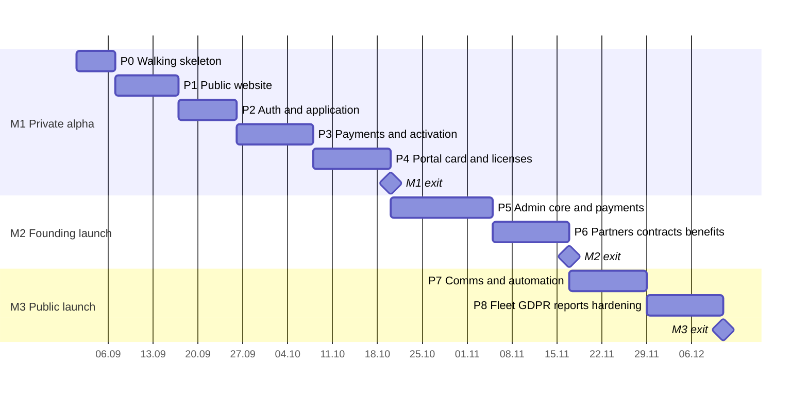
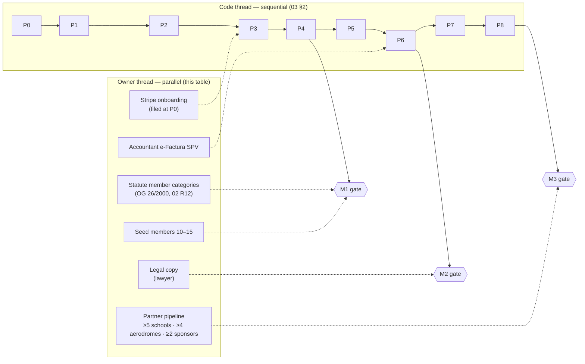

# 10 — Roadmap (Combined)

> **Purpose:** the sequenced, phase-by-phase build roadmap for the solo Claude Code developer — **Combined edition**, written last. Structure: **Fable's** roadmap skeleton (phases 1:1 to 03's slices, entry criteria, demo checkpoints, dependencies table, launch-readiness checklist, post-v1 backlog, indicative Gantt), re-sequenced over Combined's real scope — 04's 111 requirements, 06's 24 tables and migrations 001–013, 05's route canon including `/admin/payments` and `/admin/reports/renewals`, and 07's 18 flows + 32 test scenarios. Craft: **Opus's** per-phase "not in this phase" guardrails and rationale-carrying backlog; **Codex's** demo-checkpoint and dependency-map discipline. Phases P0–P8 map 1:1 to slices S0–S8; milestones M1–M3, session estimates, and cut lines are exactly those of `03-implementation-plan.md`.

---

## 1. Overview

| Phase | Theme | Slice (03) | Sessions | Lands in |
|-------|-------|-----------|----------|----------|
| P0 | Walking skeleton | S0 | 3–4 | M1 — Private alpha |
| P1 | Public website | S1 | 5–6 | M1 |
| P2 | Auth & application | S2 | 4–6 | M1 |
| P3 | Payments & activation | S3 | 6–8 | M1 |
| P4 | Portal, card & licenses | S4 | 6–8 | **M1 exit** |
| P5 | Admin core & payments register | S5 | 8–10 | M2 — Founding launch |
| P6 | Partners, contracts, benefits | S6 | 6–8 | **M2 exit** |
| P7 | Communication & automation | S7 | 6–8 | M3 — Public launch |
| P8 | Fleet, GDPR, reports, hardening | S8 | 6–8 | **M3 exit** |

Total **50–66 sessions** (03 §2 — Fable's 42–59 recalibrated for the 27 Combined-addition requirements). Strictly sequential (03 §2); no phase starts before the previous phase's demo checkpoint passes.

Indicative sequencing at **~4 sessions/week** from an illustrative start date — durations are the 03 §2 midpoints translated to calendar days, **not commitments**:

At that cadence the whole build reads as roughly **14–15 working weeks**; real calendars stretch with the dependencies in §3, which is why the Gantt is indicative and the milestone gates — not dates — are the contract.

### 1.1 Sessions to calendar, honestly

A session ≈ one focused half-day (03 §2). Three cadences, same plan:

| Cadence | Low estimate (50 sessions) | High estimate (66 sessions) | Reads as |
|---------|---------------------------|-----------------------------|----------|
| ~4 sessions/week (the Gantt's assumption) | ~12.5 weeks | ~16.5 weeks | A committed part-time build: M1 ~week 6, M2 ~week 10–12, launch inside a quarter |
| ~6 sessions/week (near full-time) | ~8.5 weeks | ~11 weeks | Compressed; the §3 dependencies (statute, lawyer, partner signatures) become the long poles, not the code |
| ~2 sessions/week (evenings/weekends) | ~25 weeks | ~33 weeks | Viable but risky: the partner pipeline and seed-member enthusiasm must be actively kept warm across two quarters |

Two honesty rules carried from 03: estimates price the **27 Combined-addition requirements** rather than absorbing them, and no phase "borrows" sessions from a later one — a phase that overruns triggers its milestone's cut line (03 §5), never a schedule fiction.

## 2. Phases

### P0 — Walking skeleton

**Objective:** production-deployed empty app with the entire toolchain proven. **Entry criteria:** repo + accounts exist; domain decision made (§3).

1. Next.js 16 + TypeScript strict (Turbopack, `proxy.ts` route gating) + Tailwind/shadcn on the 08 tokens; layout shells for the three route groups (05 §1).
2. next-intl `ro`/`en` scaffold (PLT-003 partial); branded 404/403 in both locales (PUB-014).
3. Supabase project + local stack; migrations 001–002 (`profiles`, `club_settings`); **custom access-token auth hook configured and verified** (06 §7.1, 09 §5.3 step 2).
4. CI: lint, types, unit, migration drift; Vercel deploy + preview pipeline (09 §8); env-var registry seeded (09 §5.2).

**Demo checkpoint:** the production URL shows the bilingual shell; a PR shows preview deploy + green CI; a fresh JWT provably carries the `user_role` claim. **Not in this phase:** any real page content; any table beyond identity.

### P1 — Public website

**Objective:** the club exists publicly — bilingual, fast, honest about the math. **Entry criteria:** P0 checkpoint; Stripe onboarding paperwork already filed (03 §7).

1. `/` home with mission hero + static tier teaser (PUB-001); `/mission` (PUB-002).
2. `/membership`: tier comparison from seeded `tiers` (PUB-003, migration 003 partial), **break-even module** (PUB-019 — only contract-backed categories), **FAQ** (PUB-020).
3. `/contact` with **inquiry categories** + rate-limited submission (PUB-008, PUB-018); `/legal/*` incl. the accessibility statement (PUB-010, PUB-015).
4. `/join` entry with `?tier=` preselect (PUB-009); locale switcher + hreflang (PUB-011); SEO meta/sitemap/robots/JSON-LD (PUB-012, 05 §8).

**Demo checkpoint:** Lighthouse mobile LCP ≤ 2.5 s on `/`; both locales fully navigable; contact submission lands in the club inbox with its category in the subject. **Not in this phase:** live benefit rows (P6), sponsors (P6), founding counter (P6), fleet page (P8).

### P2 — Auth & application

**Objective:** a visitor can become an applicant; the RLS pattern is set for good. **Entry criteria:** P1 checkpoint.

1. Register/confirm/login/logout with non-enumerating copy (MEM-001, MEM-003; PLT-001); password reset (MEM-004); auth rate limits (PLT-011 partial).
2. Application form → `members` + `memberships` `pending` rows, consent checkbox default-unticked (MEM-002); migration 003 complete (GiST overlap exclusion) + first RLS policies + **assertion script** (PLT-002, 03 §1.7); the Zod idiom set (PLT-008).
3. Portal shell with status-shaped nav (05 §5); `/portal/profile` basics (MEM-009).

**Demo checkpoint:** fresh email → confirmed account → submitted application visible in the database with correct `pending` statuses; anon/member/staff RLS assertions pass. **Not in this phase:** payment (P3), licenses on the profile (P4).

### P3 — Payments & activation

**Objective:** money in, membership on — both rails, one activation engine, every odd event decided. **Entry criteria:** P2 checkpoint; Stripe account usable in test mode; club IBAN entered in `club_settings` (§3).

1. Stripe Checkout + signature-first idempotent webhook over the `stripe_events` ledger (MEM-005, PLT-009; migration 004).
2. **Decided anomaly outcomes** — duplicates no-op, amount mismatches flag `anomaly` and never auto-confirm, unknown sessions are acknowledged and logged (PLT-014; queue surface arrives in P5).
3. Bank-transfer rail: instructions + unique `ASC-P-NNNNN` + pending records (MEM-006).
4. Activation engine: approval + confirmed payment → member number, card issuance, founding flag **inside one transaction** (MEM-007, PUB-017; migration 005); minimal staff approve action for alpha (ADM-005 minimal, 03 §7).
5. Lifecycle-email subset via `email_log` (PLT-004; migration 010 partial): application received, transfer instructions, payment confirmed, activated, pending-transfer staff alert.
6. **Resume without re-entry or duplicates**: fresh Checkout on the same pending payment, same transfer reference re-shown (MEM-027).

**Demo checkpoint:** FLOW-01 end-to-end twice — once card (test mode), once bank transfer via the minimal action; a replayed webhook is a no-op (TS-05); a wrong-amount event parks as `anomaly` (TS-06); an abandoned Checkout resumes on the same payment row (TS-03/04). **Not in this phase:** the full CRM review queue (P5), renewal/upgrade (P4).

### P4 — Portal, card & licenses  → **M1: Private alpha**

**Objective:** membership feels real — dashboard, history, the flagship card, hardened verification, licensing depth. **Entry criteria:** P3 checkpoint; seed members recruited (§3); logo vector ideally in hand for card polish (§3).

1. Dashboard with status chip + context action + resume entry (MEM-008, MEM-027); membership view/history (MEM-011).
2. Renewal with the **founding price lock** (MEM-012, MEM-029) and upgrade with server-side pro-rata (MEM-013) — unit-tested to TS-10/14/16/17 first.
3. Payment history + non-fiscal confirmation PDFs (MEM-014).
4. The card per 08 §7 (MEM-015) + offline cache (MEM-016) + `/verify/{token}` (PUB-013) with **anti-abuse**: CSPRNG tokens, indistinguishable invalids, HTTP 429 (PLT-013).
5. **Member licenses** on `/portal/profile`: the SAUM-vs-AACR rule at UI, Zod, and CHECK (MEM-023, MEM-024; migration 013 partial), off every public surface (MEM-025).
6. Expired-state portal experience (MEM-026).

**Demo checkpoint — M1 exit (03 §3):** 10–15 seed members join with real money on both rails; every card verified from a real phone at desk distance; a forced `ulm`+`aacr` pairing is rejected (TS-27); Playwright smoke green in CI. **Not in this phase:** staff-side license verification (P5), benefits catalog content (P6).

### P5 — Admin core & payments register

**Objective:** staff replace the developer for people-ops and money-ops. **Entry criteria:** M1 exit; accountant conversation about the e-Factura SPV workflow started (§3).

1. CRM shell (05 §4 sidebar groups, `ro`-only) + dashboard metrics + action queues incl. mismatches and webhook anomalies (ADM-001, ADM-002; PLT-014 queue surface).
2. The **ADM-038 list fabric built once, generically** — pagination 50, URL filter state, chips, empty states — proven on `/admin/members` (ADM-003).
3. Member 360°: full application review replacing P3's minimal action (ADM-005), edits with audit diff (ADM-007), archive (ADM-008), **licenses with staff verification** (ADM-036), internal notes (ADM-041).
4. **Payments register** at `/admin/payments`: filters, deep links, the accountant's period CSV (ADM-039).
5. Transfer confirmation (ADM-006) + the **ADM-044 mismatch decision tree** (partial / surplus / unmatched-parked / returned — FLOW-18); `admin`-only refund recording (ADM-043).
6. Adjustments, card reissue, member CSV, bulk actions (ADM-009, ADM-010, ADM-011, ADM-037).
7. Users/roles with **session-revoking role propagation** (ADM-032, PLT-017), club settings (ADM-033), audit log view (ADM-034; PLT-007; migration 011).

**Demo checkpoint:** a staff member (not the developer) executes FLOW-09, FLOW-10, and FLOW-18 unaided — including one below-amount and one unmatched transfer (TS-29/30); every mutation appears in `/admin/audit`; a demoted staff account loses `/admin` on its next request. **Not in this phase:** partner/contract modules (P6), campaigns (P7), the cohort report (P8).

### P6 — Partners, contracts, benefits  → **M2: Founding launch**

**Objective:** the promise becomes contractual and the public site starts telling live truth. **Entry criteria:** P5 checkpoint; ≥ 2 partner contracts signed on paper; accountant's SPV workflow confirmed before the first sponsorship invoice (§3).

1. Partner CRUDs on the P5 list fabric: flight schools (+aerodrome links), associations, aerodromes, sponsors (ADM-012–ADM-015; migration 006), partner 360° (ADM-016), **archive/delete policy** (ADM-042).
2. Contracts: `CTR-YYYY-NNN`, exactly-one counterparty, lifecycle + termination reasons (ADM-017, ADM-018; migration 007); private PDF documents (ADM-019); expiry queue entries (ADM-020 — alert *emails* arrive with P7's cron).
3. Benefits + the live publication predicate (ADM-021, ADM-022; migration 008).
4. Public go-live: benefit rows with the **tease rule** (PUB-004, PUB-016), founding counter (PUB-005, PUB-017 display), sponsors page + homepage Gold strip (PUB-006); member catalog with tier locks + filters (MEM-017, MEM-018).

**Demo checkpoint — M2 exit (03 §3):** FLOW-11 + FLOW-12 + FLOW-16 executed for real partners; ≥ 2 contracts and ≥ 1 sponsor live on the public site; the founding counter counts down and an expired-contract fixture removes its benefit from both surfaces without staff action. **Not in this phase:** contract-expiry *emails* (P7), fleet (P8).

### P7 — Communication & automation

**Objective:** the machine talks and remembers by itself — and can prove it. **Entry criteria:** M2 exit.

1. Cron engine `/api/cron/daily`: status transitions from `ends_on` arithmetic (PLT-006), **`job_runs` evidence rows** with per-action counts and the zero-count re-run proof (PLT-015; migration 013 partial), rejected-application purge (ADM-005/PLT-005).
2. Full dunning set T−30/T−7/T0/T+14/T+30 + all 21 template keys seeded (PLT-004 full); contract and aircraft alert emails live (ADM-020 wiring; ADM-030 arrives with P8's fleet data).
3. Template management with preview (ADM-023); consent toggle + unsubscribe path (MEM-019).
4. Campaigns: composer + segments + live counts (ADM-024), test send (ADM-025), **send-time re-resolution with authoritative `send_stats`** (ADM-040), per-recipient log + scoped retry (ADM-026; migration 010 complete).
5. Announcements (ADM-027, MEM-020), automated-send log (ADM-028), day-3 onboarding deduped via `email_log` (PLT-016).

**Demo checkpoint:** a compressed-clock staging cohort walks FLOW-04 (`active → grace → expired`) with every email observed and every transition evidenced in `job_runs` (TS-11/12/31/32); a real campaign reaches a consented segment with authoritative counts (FLOW-14; TS-25/26). **Not in this phase:** GDPR execution (P8), analytics (P8).

### P8 — Fleet, GDPR, reports, hardening  → **M3: Public launch**

**Objective:** complete the CRM, honor the law, watch the tripwire, harden the edges. **Entry criteria:** P7 checkpoint; partner threshold on track (§3).

1. Fleet CRUD + ARC/insurance document alerts + public visibility (ADM-029–ADM-031; migration 009); `/fleet` page (PUB-007).
2. GDPR: machine-readable export incl. licenses and consent history (MEM-021), erasure request + admin execution in the 06 §6 order (MEM-022, ADM-035 — FLOW-08 end-to-end).
3. **Consent ledger** completed with backfill + member-visible history (MEM-028; migration 013 complete).
4. **Renewal cohort report** at `/admin/reports/renewals`, reconciling with the dashboard rate and flagging the 02 §5 65% tripwire (ADM-045).
5. Hardening: rate-limit full pass (PLT-011), Plausible (PLT-010), empty/error-state sweep (PLT-012), WCAG 2.2 AA audit + manual keyboard/screen-reader pass (08 §8, 04 §5), backup **restore drill** (09 §6).

**Demo checkpoint — M3 exit:** the §4 launch-readiness checklist is 100% green — including all 32 test scenarios.

### 2.1 Milestone gates — what the club can actually do after each

The operational reading of the three gates (03 §3 holds the formal exit criteria):

| After | The club can… | The club still cannot… |
|-------|---------------|------------------------|
| **M1 — Private alpha** | Take real money on both rails, activate members, issue cards that verify live at a partner desk, resume any interrupted join, record pilot licenses | Operate without the developer (the CRM is minimal), promise contract-backed benefits publicly, send campaigns, or survive a GDPR request gracefully |
| **M2 — Founding launch** | Run people-ops and money-ops through staff alone — applications, transfers, mismatches, refunds; sign and administer partner contracts; show live benefits, sponsors, and the founding counter publicly | Rely on automated dunning (reminders are still manual), send segmented campaigns, or execute erasure |
| **M3 — Public launch** | Everything in 04's Must set: automated lifecycle with provable idempotency, consent-gated campaigns, GDPR self-service end-to-end, fleet showcase, cohort retention watch against the 65% tripwire (02 §5) | Anything on the §5 backlog — by decision, not omission (03 §6) |

### 2.2 Between-phase review ritual

Each phase ends with a fixed half-session review before the next begins — the roadmap's only ceremony:

1. **Demo checkpoint** walked exactly as written above; failures reopen the phase (03 §4's Definition of Done applies per slice).
2. **TS ledger updated** — which of the 32 scenarios now pass and stay passing; regressions block the next phase.
3. **§3 dependency table reviewed** — every row needed within the next two phases has a named action in flight (e.g. at P3's review: statute drafting, IBAN, seed-member recruitment).
4. **Cut-line pre-decision** — if the phase overran its high estimate, the milestone's 03 §5 cut order is applied *now*, on paper, not discovered under pressure at the gate.
5. **Spec drift check** — `docs/Combined/` diff since the last review is empty or explained (the spec-update rule, 03 §1.1).

## 3. Dependencies (watch from day one)

The roadmap runs as **two parallel threads**: the sequential code thread (P0→P8, one developer) and the owner/administrator thread — paperwork, signatures, recruitment — whose items gate specific phases and milestones. The dashed arrows are the ones no amount of code accelerates:

| Dependency | Needed by | Owner action |
|------------|-----------|--------------|
| Stripe account activated for the *asociație* | P3 | Start paperwork during P0 (03 §7); the bank-transfer rail is the hedge; Netopia documented as plan B (00 §4.3, 09 §3) |
| Club statute defines Cadet/Pilot/Captain as member categories with general-assembly-set dues (OG 26/2000; 02 R12) | First real payment (M1) | Draft/amend the statute with the lawyer alongside P1's legal pages |
| Accountant's e-Factura SPV workflow for sponsorship invoices (mandatory for NGOs with economic activity since 2025-07-01 — 00 §2; 02 R11) | First sponsor contract (P6/M2) | Confirm the process with the accountant during P5 |
| Logo **source vector** (SVG/AI) — the logo itself is delivered (navy lockup, PNG; palette anchored in 08 §1–2) | P4 card polish (raster fallback OK before) | Request from the designer: needed for the white/reverse variant, favicon set, and crisp card rendering (08 §1.1) |
| Legal pages content (privacy/terms/cookies/accessibility) | P1 draft, lawyer-reviewed by M2 | Commission during P1; the privacy policy must list the 09 §3 processors verbatim (PUB-010) |
| Domain + DNS (`aeroskill.club` assumed — 09 §5.1) | P0 | Confirm and configure at P0; Resend domain + SPF/DKIM/DMARC by P3 (09 §5.3) |
| Club IBAN + entity data for `club_settings` | P3 | Available at association registration; entered via seed, then ADM-033 |
| Partner threshold: **≥ 5 flight schools, ≥ 4 aerodromes, ≥ 2 sponsors** with `active` contracts (02 §6) | M3 gate | Administrator pipeline runs in parallel from M1 — one partner conversation per week (02 §6); lead with training-package discounts (02 §3 contracting rule) |
| Seed members willing to pay real dues | M1 (before P4 completes) | Recruit from the Bucharest cluster (02 §6 geography) |

### 3.1 If a dependency slips — calendar impact per phase *(risk lens adopted from Opus's per-phase risk notes)*

The build sequence is code-sequential, but the calendar is dependency-sequential. The decided responses:

| Slip scenario | Phase hit | Response (never a redesign) |
|---------------|-----------|------------------------------|
| Stripe onboarding still pending at P3 | P3–P4 | Ship the transfer-only alpha — MEM-006 + the minimal approve carry M1 alone (03 §7); card rail lands whenever Stripe clears, webhook first (TS-05/06 before real money) |
| Statute amendment not adopted by M1 | M1 gate | **Hard gate — do not take real money.** Alpha proceeds in Stripe test mode with fake dues until the general assembly adopts the categories (02 R12); everything else continues |
| Lawyer late on legal pages | M2 gate | P1 ships reviewed *drafts* clearly labeled; M2 blocks on final copy (03 §5's never-cut list includes PUB-010) |
| Partner signatures behind the ≥5/≥4/≥2 threshold at P8 | M3 gate | Launch waits on paper, not code — the platform is done; the administrator pipeline (02 §6: one conversation/week) is the critical path and should be treated as such from M1 |
| Logo vector never arrives | P4 polish | Raster fallbacks are launch-acceptable; only the white card variant and favicon crispness suffer (08 §1.1) |
| Seed members below 10 at P4 | M1 gate | Delay the M1 *declaration*, not the P5 build — the CRM work does not depend on cohort size; the founding offer (00 §3.5) is the recruitment lever to pull |
| Accountant SPV workflow unconfirmed at P6 | First sponsor invoice | Sign the sponsorship contract, invoice waits — the platform never issues fiscal documents anyway (00 §2); do not let this block the P6 code |

## 4. Launch-readiness checklist (M3 gate)

- [ ] All 04 **Must** requirements demonstrably done (walk the §7 index; every M has a phase checkpoint above)
- [ ] **All 32 test scenarios (TS-01..TS-32, 07 §catalog) pass** against the seeded environment — the acceptance floor, not the full suite
- [ ] FLOW-01 through FLOW-18 each executed at least once on production or staging
- [ ] Partner threshold met: ≥ 5 flight schools, ≥ 4 aerodromes, ≥ 2 sponsors with `active` contracts (02 §6)
- [ ] Dunning engine proven on the compressed-clock cohort (P7 checkpoint); `job_runs` shows the zero-count re-run proof (PLT-015)
- [ ] GDPR: export + erasure executed for real; privacy policy lists the 09 §3 processors; DPAs on file; consent ledger reconciles with the current flags (MEM-028)
- [ ] **Restore drill completed and timed with the 09 §6 mechanism**: latest nightly `pg_dump` snapshot restored into a scratch project; a member 360°, a payment, and a card verification verified against the restored data
- [ ] The six 09 §9 alerts firing and routed (error spike, webhook failure, cron missed, job failure, capacity, downtime)
- [ ] **WCAG 2.2 AA** pass on public + portal, both locales (08 §8; automated CI checks + the manual keyboard/screen-reader pass over join, pay, card, verify — 04 §5); accessibility statement live at `/legal/accessibility` (PUB-015); LCP ≤ 2.5 s on 4G mobile
- [ ] Legal pages lawyer-approved; cookie notice accurate (no banner needed — Plausible is cookieless, 09 §7); statute categories confirmed (02 R12); accountant e-Factura workflow confirmed (02 R11)
- [ ] Founding counter correct against the database (PUB-017); price lock realized via `memberships.price_ron` (MEM-029)
- [ ] Rate limits verified on `/login`, `/reset-password`, `/contact`, `/verify/*` (PLT-011/013 — a scripted burst gets 429)
- [ ] Runbook (09 §6) rehearsed: key rotation, DB restore, Stripe outage degrade-to-transfer, manual job re-run

## 5. Post-v1 backlog (priority order, deferral-register style)

From 00 §9 and the 03 §6 deferral register — each item carries its one-line rationale; the register holds the revisit triggers:

1. **Auto-recurring renewals** (saved cards / Stripe subscriptions) — the biggest renewal-rate lever once ADM-045 cohorts show where friction costs members.
2. **Benefit redemption tracking at partners** — turns the card into a measurable channel and gives contract renewals per-benefit ROI; the natural companion to the cohort report.
3. **Apple/Google Wallet passes** — the card in the pocket without a browser; the 08 §7.4 field mapping is already reserved, so this is packaging, not remodeling.
4. **Fiscal e-invoicing integration** (e-Factura/SmartBill) — removes the manual accountant seam (00 §2) when sponsor-invoice volume justifies it.
5. **Events module** with registration and tier-based pricing — the first structured member-value expansion; guest passes become concrete instead of concierge-handled.
6. **Flight booking / aircraft scheduling** — parked with **Opus's GiST-exclusion no-overlap design** noted in 00 §9 (the same constraint family already guards membership years, 06 §3.2); relevant only if the club ever operates aircraft for member hire.
7. **Admin analytics** — cohort renewals beyond ADM-045, benefit popularity, campaign engagement; build on questions the CRM data actually raises.
8. **Flight-school student pipeline** — instrumented referral tracking from `/join` through partner schools (02 §6 channel 1); today the school desk is measured only anecdotally.
9. **Sponsor self-service portal** — assets, invoices, campaign previews; staff-mediated works to ~10 sponsors.
10. **Member directory & community features** (opt-in, privacy-first) — only after an explicit consent model is designed; a directory is a safety surface, not a page.
11. **E-learning / ground-school content** — out of the club's operating lane until partners ask for a distribution channel.
12. **English admin CRM** — if non-Romanian staff ever join (00 §4.4 locks `ro`-only for v1).
13. **Multi-club / white-label** — a different product; revisit only with a concrete second club.

Explicitly **not** on this backlog: a free/trial tier, lifetime memberships, and monthly billing — evaluated via Opus and rejected as off-brief (00 §0/§9); recorded in the 03 §6 register so they are never "rediscovered".

## 6. After launch — the first 90 days *(stabilization discipline adopted from Codex's post-launch milestone)*

Not a phase — the operating posture once M3 gates. No new feature work before day 30 unless it is a launch defect:

1. **Watch the queues, not the code.** The ADM-002 surface is the health monitor: pending applications, transfers, mismatches, anomalies, expiring contracts. A queue that grows week-over-week is the first product signal.
2. **Payment-rail mix review at day 30** — the 03 §8 assumption 3 checkpoint: card vs transfer share decides whether ADM-006/044 tooling or the Netopia evaluation moves up.
3. **First real dunning cohort observed live** — every T−30…T+30 send checked against `job_runs` and `/admin/send-log` for the first members to cross their window; the compressed-clock test met reality here.
4. **Benefit-economics validation closed out** — the first partner-contract terms measured against the ≤50%-of-usage rule (02 §3); if the math moved, PUB-019's public examples are corrected in the same week.
5. **Backlog grooming at day 90** — §5 re-ordered against observed member behavior and the ADM-045 report's first meaningful rows; only then is post-v1 item 1 or 2 scheduled.

---

*Merged from: Fable `10-roadmap.md` (phase skeleton, entry/demo-checkpoint structure, dependencies table, launch-readiness checklist, Gantt convention — re-sequenced over Combined's slices and requirement set), Opus `10-roadmap.md` (per-phase guardrails, dual-granularity effort honesty, the rationale-carrying deferral technique in §5 — its 19-increment scope, ~68–86-session plan, and portfolio framing rejected per 00 §0/§9: Combined is built to operate, not to demo), Codex `10. aeroskill-club-v1-milestone-roadmap.md` (demo/acceptance/risk milestone discipline and the dependency-map habit; its "do not defer" list lives in 03 §5). All requirement IDs trace to Combined `04-prd.md` §7; routes to `05-information-architecture.md` §2; tables and migrations to `06-database-schema.md` §8; flows and test scenarios to `07-user-flows.md`; thresholds and the 65% tripwire to `02-product-strategy.md` §5–§6. No new external claims.*
