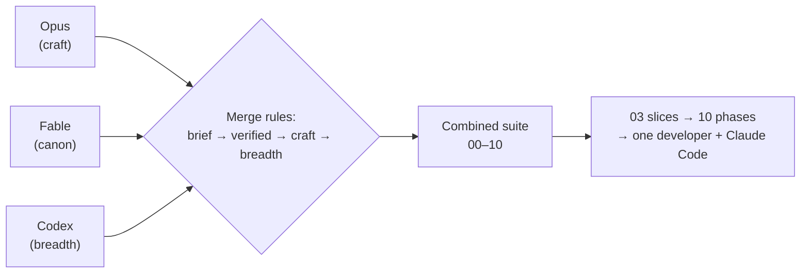

# Combined — Aeroskill Club Platform Specification

Combined is the **synthesis suite** for the **Aeroskill Club** web platform — a Romanian general-aviation club with a public website, a member portal, and an admin CRM, built end-to-end by a **single developer working with Claude Code**. Three complete suites were written independently for the same brief (Opus, Fable, Codex); a July 2026 cross-review profiled them, and Combined merges them under explicit precedence rules into one canonical, buildable set of eleven documents.

## The merge rules

1. **The brief is law.** Three paid tiers at 3000/4500/6000 RON/year, three surfaces, general-aviation focus, one developer. Anything a source suite added beyond the brief is adopted only if it *deepens* it, never if it *widens* it.
2. **Verified beats plausible.** Where suites disagreed on facts, the researched-and-cited value won (the evidence table lives in Foundation §10).
3. **Deepest craft wins the format.** Requirement style, edge-case treatment, wireframes, matrices — the strongest technique was taken from whichever suite had it.
4. **Breadth artifacts complete the set.** Checklists, catalogs, and matrices that make the spec operable were swept in last.

**Provenance in one line per source:**

| Source | What Combined took |
|--------|--------------------|
| **Fable** | The locked canon — brief-fit tiers and prices, statuses, glossary, ID formats, stack, i18n/GDPR/e-Factura posture, the 53-source research base, and every document's structural skeleton |
| **Opus** | Specification craft — Given/When/Then acceptance criteria, per-flow edge-case tables, the measured contrast matrix, constraint engineering, aviation-licensing depth (the SAUM-vs-AACR rule), deferral registers with rationale |
| **Codex** | Breadth artifacts — ASCII wireframes, the error/recovery matrix, the test-scenario catalog, deletion/archive policy, the index catalog, the "do not defer" discipline |

## Reading order

| # | Document | One-liner |
|---|----------|-----------|
| 00 | [Foundation](Combined/00-foundation.md) | The canonical decision registry everything else inherits — read first; when documents conflict, this one wins |
| 01 | [Product Vision](Combined/01-product-vision.md) | Why the club exists, who it serves, what success looks like — honest market sizing included |
| 02 | [Product Strategy](Combined/02-product-strategy.md) | Positioning ("ACR for pilots — at aviation prices"), tier and sponsor strategy, break-even economics, the 65% renewal tripwire, risks |
| 03 | [Implementation Plan](Combined/03-implementation-plan.md) | Build philosophy, slices S0–S8 with sessions and risks, milestones M1–M3, the solo Claude Code workflow, cut lines, deferral register |
| 04 | [PRD](Combined/04-prd.md) | All **111 requirements** with stable IDs, MoSCoW, and Given/When/Then acceptance criteria; the traceability index at §7 |
| 05 | [Information Architecture](Combined/05-information-architecture.md) | Sitemap and route canon (incl. `/admin/payments`, `/admin/reports/renewals`), RBAC map, URL/i18n rules, 12 ASCII wireframes |
| 06 | [Database Schema](Combined/06-database-schema.md) | **24 tables**, enums, ERD, 47-row index catalog, deletion/archive policy, full RLS, migrations 001–013, seeds |
| 07 | [User Flows](Combined/07-user-flows.md) | **18 flows** with per-flow edge-case tables, the 16-row error/recovery matrix, the **32-scenario test catalog** (TS-01..32) |
| 08 | [Design System](Combined/08-design-system.md) | Logo-derived brand, tokens, measured contrast matrix, components, the member-card spec, WCAG 2.2 AA rules |
| 09 | [Technical Infrastructure](Combined/09-technical-infrastructure.md) | Stack detail, verified costs (~480 RON/mo), repo layout, environments, security, GDPR data map, CI/CD, observability |
| 10 | [Roadmap](Combined/10-roadmap.md) | Phases P0–P8 mapped 1:1 to 03's slices, the two-thread dependency view, launch-readiness checklist, post-v1 backlog |

Reading order is 00 → 10; **writing order was dependency order** (00 → 01/02/08 → 04 → 05/06 → 07/09 → 03/10), because the plan and roadmap sequence the full scope and had to come last.

## Headline locked facts (from 00)

- **Club:** Aeroskill Club, Romanian non-profit association (*asociație*, OG 26/2000), general-aviation focus; Romanian-first with English (`ro` at root, `/en` prefix); admin CRM Romanian-only.
- **Tiers (per brief, locked):** **Cadet — 3000 RON/an · Pilot — 4500 RON/an · Căpitan/Captain — 6000 RON/an**; anniversary years, 30-day grace, member-initiated renewal; founding offer: first 50 members, 2-year price lock.
- **Stack:** Next.js 16 (LTS) + Supabase (Postgres/RLS, Auth, Storage) + Tailwind 4/shadcn + next-intl + Stripe Checkout **and** bank transfer (Netopia as documented plan B) + Resend + Vercel + Plausible; Zod at every boundary.
- **Roles:** visitor · `member` · `staff` · `admin` — one role per profile, carried in the JWT, backstopped by deny-by-default RLS.
- **The numbers:** 111 requirements (70 Must · 37 Should · 4 Could) · 24 tables, migrations 001–013 · 18 flows · 32 test scenarios · 12 wireframes · 21 seeded email templates · 50–66 build sessions.
- **Non-negotiables:** GDPR self-service, WCAG 2.2 AA, mobile-first card, signed idempotent webhooks, insert-only audit log, daily backups with a pre-launch restore drill.

## Conventions at a glance (locked in Foundation §7)

- **Requirement IDs:** `PUB-` public · `MEM-` portal · `ADM-` admin · `PLT-` cross-cutting; flows are `FLOW-NN`, test scenarios `TS-NN`. IDs are assigned once and never reused or renumbered.
- **Statuses** come only from the locked enum vocabularies (Foundation §7.2) — e.g. `member_status`: `pending` · `active` · `grace` · `expired` · `archived`.
- **Identifiers:** member number `ASC-YYYY-NNNN` · payment reference `ASC-P-NNNNN` · card token 22-char at `/verify/{token}` · contract `CTR-YYYY-NNN`.
- **Formatting:** specs write `3000 RON` and ISO dates; UI renders `3.000 RON`/`3,000 RON` and `DD.MM.YYYY`/`DD MMM YYYY` per locale.
- **Depth formats:** every 04 requirement has Given/When/Then criteria; every 07 flow ends with an edge-case table; every document carries at least one Mermaid diagram and a sources footer where research is cited.

## How to build from this suite

Start every build session from the **[Implementation Plan](Combined/03-implementation-plan.md)** — it defines the slices, which Combined documents to load as context per slice, the branch/commit conventions, the per-slice Definition of Done, and the spec-update rule that keeps these documents and the code from drifting. The **[Roadmap](Combined/10-roadmap.md)** tells you which phase is next, what gates it, and what the club can operationally do after each milestone. The 07 test catalog is the acceptance floor: launch means **all 32 scenarios pass**.

## What Combined rejected

Reviewed and **rejected as off-brief**, not merely deferred: Opus's free Cadet tier and 490/1.490/4.990-lifetime pricing with monthly billing (the brief sets three paid annual tiers), Opus's events/bookings/news/member-directory scope (parked in the post-v1 backlog, with its GiST booking design noted), and Codex's "configurable prices, decide later" posture (the brief decides). The full rejection record is [Foundation §0](Combined/00-foundation.md) and the deferral register in [03 §6](Combined/03-implementation-plan.md).

---

*Every document carries its own sources footer where research is cited; the consolidated evidence table (verified July 2026) is Foundation §10. Links above are site-root-relative for the docsify site; Mermaid diagrams render via the site's mermaid plugin and natively on GitHub.*
