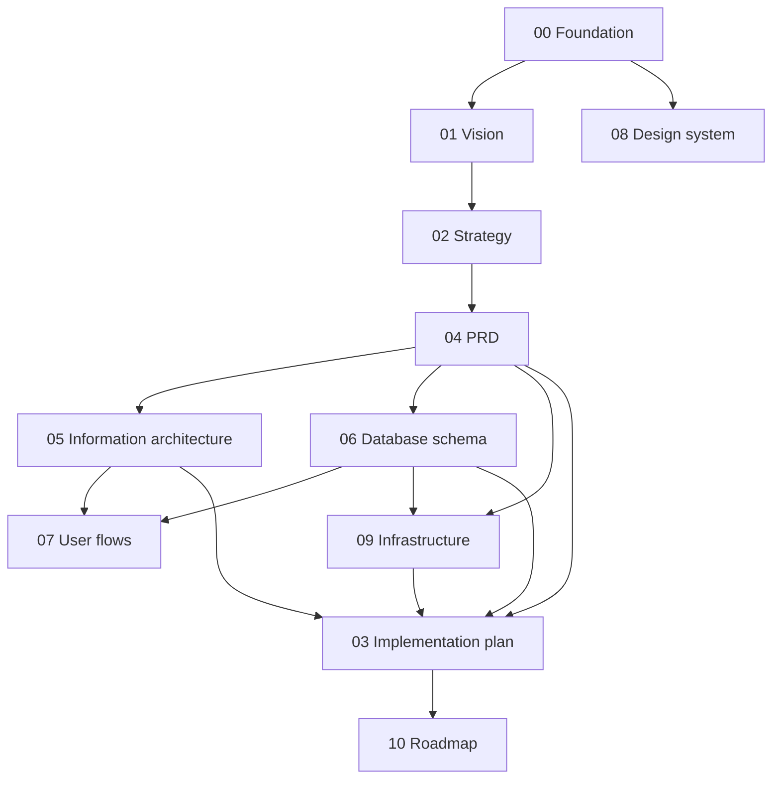

# 00 — Foundation

> **Purpose:** the canonical decision registry for the Aeroskill Club platform. Every other document in the Fable suite inherits the names, prices, stack, roles, vocabularies, and conventions locked here. When any document appears to conflict with this one, **this one wins**. Read this first.

---

## 1. The Fable suite

Fable is the third, self-contained specification set for the Aeroskill Club platform, written for a **single developer building with Claude Code**. Reading order:

| # | Document | What it covers |
|---|----------|----------------|
| 00 | `00-foundation.md` | The canonical decisions everything else inherits — read first |
| 01 | `01-product-vision.md` | Why we exist, who we serve, what success looks like |
| 02 | `02-product-strategy.md` | Positioning, tier & sponsor strategy, monetization, GTM, risks |
| 03 | `03-implementation-plan.md` | Build philosophy, scope slices, milestones, solo Claude Code workflow |
| 04 | `04-prd.md` | Detailed requirements per surface, with IDs & acceptance criteria |
| 05 | `05-information-architecture.md` | Sitemap, navigation, URL/i18n structure, RBAC access map |
| 06 | `06-database-schema.md` | Entities, columns, relationships, ERD, RLS posture |
| 07 | `07-user-flows.md` | Step-by-step flows across all three surfaces |
| 08 | `08-design-system.md` | Logo-driven brand, tokens, type, components, member card |
| 09 | `09-technical-infrastructure.md` | Stack, services, environments, security/GDPR, deployment |
| 10 | `10-roadmap.md` | Sequenced solo Claude Code build roadmap, phase by phase |

> **Note on writing order:** the suite was *written* in dependency order (00 → 01 → 02 → 08 → 04 → 05/06 → 07 → 09 → 03 → 10) because 03 and 10 plan over the full scope and therefore had to be written last, even though they read early.

*Arrows = "was written from" — the dependency graph behind the writing order.*

---

## 2. Club identity & legal shape

| Fact | Decision |
|------|----------|
| Name | **Aeroskill Club** — always written as two words, "Club" capitalized. Abbreviation for internal identifiers: **ASC** |
| Logo | Delivered: monochrome deep-navy lockup — "AEROSKILL ✈ CLUB" with an aircraft silhouette between the words. Brand navy is anchored from its ink (≈ `#1C3355`); usage rules and derived palette in 08 §1–2 |
| Legal form | Romanian non-profit association (*asociație*), governed by OG 26/2000. Membership fees are annual association dues (*cotizație anuală*) |
| Focus | **General aviation**: student pilots, PPL/LAPL holders, and aviation enthusiasts. Not airline/commercial aviation |
| Market | Romania. Romanian-first product; English as secondary locale |
| Jurisdiction | EU — GDPR applies in full; supervisory authority is **ANSPDCP** |
| Fiscal note | Formal fiscal invoicing is handled outside the platform in v1; the platform issues payment confirmations, not fiscal invoices. See the e-Factura boundary below |

**OG 26/2000 constraints the product must respect (researched):**

- Dues (*cotizații*) are set by the **general assembly** (*adunarea generală*) and must be **equal for all members within a category**. The three tiers therefore exist legally as **statutory member categories** — the club statute must define Cadet/Pilot/Captain as categories, and any price change requires a general-assembly decision (which is why 02 §7 mandates 60 days' notice).
- The association must maintain a **member register**; the platform's `members` table is its operational form, so member data quality is a legal duty, not just hygiene.
- Statutory voting rights are governed by the statute, not by tier — a Captain membership buys benefits, never extra votes (01 §4).

**e-Factura boundary (researched, locked):** Romania's RO e-Factura became mandatory B2C on 2025-01-01 and for NGOs conducting economic activity on 2025-07-01. Membership *cotizații* from individuals are association dues, not invoiceable supplies, and stay **outside** e-Factura. **Sponsorship and service invoices to companies are B2B invoices and must go through ANAF SPV/e-Factura** — issued by the club's accountant outside the platform. The platform records contract values and payment confirmations only; it never issues fiscal invoices (00 §9 item 8).

---

## 3. Locked product decisions

### 3.1 Membership tiers

Three tiers, annual dues, prices **locked**:

| Tier (canonical) | Romanian UI | English UI | Price / year | One-line promise |
|------------------|-------------|------------|--------------|------------------|
| **Cadet** | Cadet | Cadet | **3000 RON** | Join the community: member card, base partner discounts, events, newsletter |
| **Pilot** | Pilot | Pilot | **4500 RON** | Fly more for less: enhanced discounts, fleet preferential rates, priority event access, 2 guest passes/year |
| **Captain** | Căpitan | Captain | **6000 RON** | The full club experience: top discounts, first access to fleet, all events included, 4 guest passes/year, concierge support |

Tier names are ranked: Cadet (rank 1) < Pilot (rank 2) < Captain (rank 3). A benefit with a *minimum tier* is available to that tier and every tier above it. The three tiers are mirrored as member categories in the club statute (§2) so that per-tier dues are lawful under OG 26/2000.

**Price context (researched):** 3000 RON ≈ €600 ≈ roughly four wet rental hours at Romanian schools (€120–145/h) and ~7% of a PPL(A) course (€8,000–10,000 at Romanian ATOs/DTOs). This is deliberately **6–10× typical advocacy-association dues** (AOPA US charges $59–179/year): Aeroskill is a *buying club* whose dues must be recouped through contracted benefits, not a representation body — the benefit-economics rules in 02 §3 make that promise enforceable.

*Rejected alternatives:* "Solo / Cross-Country / Commander" (poor Romanian rendering), "Bronze / Silver / Gold" (reserved for sponsor packages, §3.4).

### 3.2 Membership year model

- **Anniversary-based**: a membership starts on its activation date and runs 12 months (`ends_on = starts_on + 1 year − 1 day`). No calendar-year proration.
- **Renewal window** opens 30 days before expiry. Renewal is **member-initiated** (no automatic card charging in v1) via card payment or bank transfer.
- **Grace period**: 30 days after expiry. During grace the member keeps portal access and card validity; benefits are honored. After grace, status becomes `expired` and the card verifies as invalid.
- **Reminder schedule** (email, automated): T−30, T−7, T0 (expiry day), T+14, and a final lapse notice at T+30.
- A renewal during grace starts the new membership year **from the previous expiry date** (no gap, no punishment).

### 3.3 Upgrades & downgrades

- **Upgrade**: any time, effective immediately. Member pays the price difference pro-rated by remaining days of the membership year, rounded up to whole RON.
- **Downgrade**: only at renewal — the next membership year is purchased at the lower tier.
- No refunds on downgrade or cancellation; membership dues are non-refundable except legal obligation.

### 3.4 Sponsor program

Sponsor packages are **guide prices**, finalized per contract in the CRM:

| Package | Guide price / year | Headline deliverables |
|---------|--------------------|----------------------|
| **Bronze** | 10,000 RON | Logo + link on public sponsors page |
| **Silver** | 25,000 RON | Bronze + logo on member communications, 1 dedicated campaign mention/year |
| **Gold** | 50,000 RON | Silver + homepage placement, event presence, 2 dedicated campaign mentions/year |

Every sponsor relationship is backed by a **contract** record; only sponsors with `visible_on_site = true` appear publicly.

### 3.5 Founding-member offer (GTM, locked)

The first **50** approved members receive a permanent "Founding member" badge and a **2-year price lock** at their joining tier's current price. No percentage discounts — price integrity is a policy (see 02).

---

## 4. Locked platform decisions

### 4.1 The three surfaces

1. **Public website** — mission, tier comparison, sponsors, fleet showcase, contact, join.
2. **Member portal** — login-gated: profile, membership & payments, digital member card, benefits catalog, communication preferences, GDPR self-service.
3. **Admin CRM** — staff-only: members, flight schools, associations, aerodromes, sponsors, benefits, contracts, communication, fleet, users, audit.

All three surfaces live in **one Next.js application** (route groups), one deployment.

### 4.2 Stack (locked)

| Layer | Choice | Why (solo + Claude Code) |
|-------|--------|--------------------------|
| Framework | **Next.js 16** (App Router, TypeScript, Server Actions; LTS since 2025-10, Turbopack default, route gating via `proxy.ts`) | One framework for all three surfaces; first-class Vercel deploys |
| Database | **Supabase Postgres** with **Row Level Security** | Managed Postgres + auth + storage in one service; RLS as the authorization backstop |
| Auth | **Supabase Auth** — email + password, email confirmation, password reset | No extra service; integrates with RLS via JWT claims |
| Styling | **Tailwind CSS 4 + shadcn/ui** | Token-driven, component library Claude Code works well with |
| i18n | **next-intl** | App Router native; locale routing per §4.4 |
| Email | **Resend** (+ **react-email** templates) | One provider for transactional **and** campaign sends (batch API) |
| Payments | **Stripe Checkout** (primary) + **manual bank transfer** with staff reconciliation (fallback) | Stripe supports RON and Romanian entities; bank transfer is culturally expected for association dues |
| Storage | **Supabase Storage** | Logos, contract PDFs, aircraft photos, avatars |
| Hosting | **Vercel** | Zero-ops deploys, preview environments |
| Analytics | **Plausible** (EU-hosted, cookieless) | GDPR-friendly; no consent banner needed for analytics |
| Validation | **Zod** at every boundary (forms, server actions, webhooks) | Single validation idiom |

*Rejected alternatives:* Netopia (heavier integration, weaker docs — revisit only if Stripe onboarding fails for the association), auto-recurring subscriptions (v1 renewals are member-initiated), separate admin app (needless second deploy).

### 4.3 Payment mechanics (locked)

- **Card**: Stripe Checkout session per membership purchase/renewal/upgrade; confirmation via Stripe **webhook**, never via redirect alone. Checkout handles PSD2/SCA (3-D Secure) automatically for EEA cards.
- **Card fees (researched, for planning):** Stripe EEA standard cards ≈ **1.5% + 1 RON** per transaction; disputes 100 RON. On a 3000 RON Cadet payment that is ~46 RON (~1.5%) — immaterial to tier economics (02 §5).
- **Bank transfer**: portal shows the club IBAN and a unique **payment reference code** `ASC-P-NNNNN` generated per payment (member numbers don't exist before first activation, so the reference must be payment-scoped); staff match the statement line by code and confirm in the CRM, which activates the membership.
- **Plan B (researched):** Netopia Payments — Romania's largest local processor (~60% of online card volume, NGO-friendly) at **0.99% + 0.30 RON** for standard cards. Cheaper than Stripe but a heavier integration for a solo developer; switch only if Stripe onboarding for the *asociație* fails (02 R2).
- All amounts stored in **whole RON** (integer); no cents, no other currencies in v1.

### 4.4 i18n (locked)

- Locales: **`ro` (default)** and **`en`**.
- URL scheme: Romanian at root (no prefix), English under **`/en`** prefix. URL path segments are **English, unlocalized** in both locales (e.g. `/membership`, `/en/membership`).
- All UI strings via next-intl message catalogs. Public/member-facing **content** fields are bilingual in the database (`*_ro` / `*_en` columns).
- Admin CRM is **Romanian-only** in v1 (staff are Romanian; halves the admin string surface).

### 4.5 Analytics & tracking

Plausible on the public site and portal. No ad pixels, no third-party marketing trackers. Cookie banner is therefore **not required** for analytics; a minimal cookie notice covers the auth session cookie.

---

## 5. Roles & access (locked)

| Role | Stored | Scope |
|------|--------|-------|
| *visitor* | not a DB role | Anonymous: public website + card verification page |
| **`member`** | `profiles.role` | Member portal: own data only |
| **`staff`** | `profiles.role` | Admin CRM: all entity management, manual payment confirmation, campaigns |
| **`admin`** | `profiles.role` | Everything `staff` can do + admin-user management, club settings, audit log, GDPR erasure execution |

Role is a single value per profile (no multi-role). Partners verifying member cards are **anonymous visitors** hitting the public verification route — they need no accounts in v1.

---

## 6. Canonical domain glossary

Locked entity names. Database tables are **snake_case, plural**.

| Entity (EN, canonical) | Romanian UI | Table |
|------------------------|-------------|-------|
| Profile (any authenticated user) | Profil | `profiles` |
| Member (club member record) | Membru | `members` |
| Tier | Nivel de membru | `tiers` |
| Membership (one member-year) | Abonament | `memberships` |
| Payment | Plată | `payments` |
| Member card | Card de membru | `member_cards` |
| Flight school | Școală de zbor | `flight_schools` |
| Association (partner org) | Asociație parteneră | `associations` |
| Aerodrome | Aerodrom | `aerodromes` |
| Sponsor | Sponsor | `sponsors` |
| Contract | Contract | `contracts` |
| Benefit | Beneficiu | `benefits` |
| Campaign (email or announcement) | Campanie / Anunț | `campaigns` |
| Campaign send (per-recipient log) | — (internal) | `campaign_sends` |
| Email template | Șablon de email | `email_templates` |
| Aircraft (fleet unit) | Aeronavă | `aircraft` |
| Audit log entry | Jurnal de audit | `audit_logs` |
| Club settings (singleton) | Setări club | `club_settings` |

**Partner** is the collective term for the four contractable counterparty types: flight school, association, aerodrome, sponsor. Polymorphic references to a partner use the **one-nullable-FK-per-type + CHECK(exactly one)** mechanism (see 06).

**Identifier formats (locked):**
- Member number: `ASC-YYYY-NNNN` (year of joining + 4-digit sequence), e.g. `ASC-2026-0001`. Permanent — never reissued.
- Payment reference code (bank transfers): `ASC-P-NNNNN`, unique per payment (§4.3).
- Card verification token: 22-character URL-safe random token; verification URL `/verify/{token}`.
- Contract number: `CTR-YYYY-NNN`.

---

## 7. Conventions registry

### 7.1 Requirement IDs (used in 04, referenced everywhere)

| Prefix | Surface |
|--------|---------|
| `PUB-NNN` | Public website |
| `MEM-NNN` | Member portal |
| `ADM-NNN` | Admin CRM |
| `PLT-NNN` | Cross-cutting platform (auth, i18n, GDPR, email, audit, NFR-adjacent behavior) |

Zero-padded three digits, assigned once, never reused. Flows in 07 are `FLOW-NN`.

### 7.2 Status vocabularies (locked enum values)

| Enum | Values (exact) |
|------|----------------|
| `member_status` | `pending` · `active` · `grace` · `expired` · `archived` |
| `membership_status` | `pending` · `active` · `grace` · `expired` · `cancelled` |
| `payment_method` | `card` · `bank_transfer` |
| `payment_status` | `pending` · `confirmed` · `failed` · `refunded` |
| `contract_status` | `draft` · `active` · `expired` · `terminated` |
| `contract_type` | `partnership` · `sponsorship` · `service` |
| `partner_type` | `flight_school` · `association` · `aerodrome` · `sponsor` |
| `sponsor_package` | `bronze` · `silver` · `gold` |
| `campaign_kind` | `email` · `announcement` |
| `campaign_status` | `draft` · `scheduled` · `sent` · `cancelled` |
| `aircraft_status` | `active` · `maintenance` · `retired` |
| `aircraft_ownership` | `owned` · `leased` · `partner` |
| `role` | `member` · `staff` · `admin` |

`members.status` mirrors the member's latest membership and is maintained by application logic (see 06 §RLS notes).

### 7.3 Formatting

| Context | Rule |
|---------|------|
| Prices in these specs | Plain digits + RON: `3000 RON` |
| Prices in UI (ro) | Dot thousands separator: `3.000 RON` |
| Prices in UI (en) | Comma thousands separator: `3,000 RON` |
| Dates in these specs | ISO 8601: `2026-07-06` |
| Dates in UI (ro) | `DD.MM.YYYY` |
| Dates in UI (en) | `DD MMM YYYY` |
| Times | 24-hour, Europe/Bucharest |

### 7.4 Cross-referencing

Docs reference each other by number ("see 06 §4") and requirements by ID ("covers PUB-003"). Flows cite the routes of 05 and tables of 06 verbatim.

---

## 8. Non-negotiables

1. **GDPR**: lawful bases documented (09 §GDPR); member self-service data export and erasure request (04 `MEM-`/`PLT-` requirements); marketing consent is opt-in and separate from transactional email; processor list maintained in 09.
2. **Security baseline**: HTTPS only; Supabase RLS enabled on every table (deny-by-default); secrets only in environment variables; webhooks signature-verified; admin actions audit-logged.
3. **Accessibility**: **WCAG 2.2 AA** on public site and portal. Researched context: the European Accessibility Act is enforced since 2025-06-28 and covers e-commerce services; its current harmonized standard (EN 301 549 v3.2.1) bakes in WCAG 2.1 AA, with the WCAG 2.2 update (v4.1.1) expected in 2026. The club almost certainly qualifies for the EAA **microenterprise services exemption** (<10 employees *and* <€2M turnover — both required), but we build to WCAG 2.2 AA anyway and publish an accessibility statement (04 PUB-015): the exemption vanishes the moment the thresholds are crossed, with no grace period.
4. **Mobile-first**: the member card and portal must be flawless on a phone — that is where the card lives.
5. **Performance budget**: public pages LCP < 2.5 s on mid-range mobile; portal interactive < 3 s.
6. **Backups**: daily automated database backups with tested restore (09).

---

## 9. Explicitly out of scope for v1

Locked — these do **not** appear in 04 as requirements:

1. Native mobile apps (the portal is a responsive web app; card supports "add to home screen").
2. Flight booking / aircraft scheduling / dispatch.
3. E-learning, ground-school content, exam prep.
4. Forum, chat, or member-to-member messaging; public member directory.
5. Events module with registration/ticketing (announcements cover event comms in v1).
6. Benefit redemption tracking/limits at partners (card verification only in v1).
7. Auto-recurring card payments / saved cards.
8. Fiscal invoicing integration (e-Factura, SmartBill) — post-v1 integration.
9. Multi-club / white-label support.
10. Online sponsor self-service portal (sponsors are managed by staff via CRM).

Backlog placement for all of the above: 10 §Post-v1.

---

## 10. Research basis

Facts marked "researched" in this suite were verified against primary or near-primary sources (July 2026). The load-bearing ones:

| Fact | Basis |
|------|-------|
| PPL(A) in Romania costs €8,000–10,000; hour building €120–145/h wet | Romanian school price lists ([Aviation Academy](https://aviationacademy.ro/tarife-cursuri-personal-navigant/), [Cruiser Aviation](https://cruiseraviation.com/ro/articole/cat-costa-scoala-de-zbor), [Zbor cu Avionul](https://zborcuavionul.ro/scoala-de-zbor/)) |
| Aeroclubul României offers **free** gliding/parachuting/ultralight courses for ages 15–23; PPL(A) paid; ~11 territorial aeroclubs | [aeroclubulromaniei.ro](https://aeroclubulromaniei.ro/page/cursuri-gratuite), [ar.ro](https://ar.ro/articol/cursuri-gratuite-2026) |
| AOPA Romania exists since 2006 (IAOPA member) — advocacy body, not a benefits club | [aopa.ro](https://www.aopa.ro/) |
| AOPA US dues $59–179/year (membership-price benchmark) | [aopa.org](https://www.aopa.org/membership) |
| e-Factura: B2C mandatory 2025-01-01; NGOs with economic activity from 2025-07-01 | [mfinante.gov.ro](https://mfinante.gov.ro/en/acasa/-/asset_publisher/uwgr/content/id/11741330), [avocatnet.ro](https://www.avocatnet.ro/articol_67338/e-Factura-ONG-urile-cultele-%C8%99i-agricultorii-persoane-fizice-scap%C4%83-temporar-de-obliga%C8%9Bia-folosirii-sistemului.html) |
| OG 26/2000: dues set by general assembly, equal within member category; member register | [legislatie.just.ro](https://legislatie.just.ro/Public/DetaliiDocument/20740), [lege5.ro](https://lege5.ro/Gratuit/gi3tsnrt/ordonanta-nr-26-2000-cu-privire-la-asociatii-si-fundatii) |
| Accounting retention: 5 years for supporting documents, 10 for financial statements (Law 36/2023) | [contzilla.ro](https://www.contzilla.ro/documentele-contabile-se-vor-pastra-in-arhiva-contabila-5-ani-in-loc-de-10-ani/), [accace.ro](https://www.accace.ro/pastrarea-si-arhivarea-documentelor-financiar-contabile/) |
| EAA enforced 2025-06-28; microenterprise services exemption (<10 employees AND <€2M); EN 301 549 v3.2.1 = WCAG 2.1 AA, v4.1.1 (WCAG 2.2) expected 2026 | [accessible.org](https://accessible.org/eaa-ecommerce-services-requirements/), [levelaccess.com](https://www.levelaccess.com/blog/is-wcag-conformance-enough-for-eaa-compliance/) |
| Stripe Romania: EEA cards ≈ 1.5% + 1 RON, dispute 100 RON; Netopia: 0.99% + 0.30 RON, ~60% local market share | [stripe.com/en-ro/pricing](https://stripe.com/en-ro/pricing), [noda.live Netopia review](https://noda.live/ro/articles/recenzie-netopia-payments) |
| Next.js 16 is the current LTS (2025-10-21): Turbopack default, `proxy.ts` replaces `middleware.ts` | [nextjs.org/blog/next-16](https://nextjs.org/blog/next-16) |
| Real GA aerodromes used as examples: Clinceni `LRCN`, Ploiești-Strejnic `LRPV`, Tuzla `LRTZ`, Brașov-Sânpetru `LRSP`, București-Băneasa `LRBS` | [metar-taf.com](https://metar-taf.com/airport/LRCN-clinceni-airfield), [skyvector.com](https://skyvector.com/airport/LRSP/Sanpetru-Airport), AACR aerodrome register |

**Known unknowns (flagged, not guessed):** no public AACR census of active PPL/LAPL holders or of the GA fleet exists — market-size figures in 01/02 are explicit assumptions with a validation plan, not statistics.
