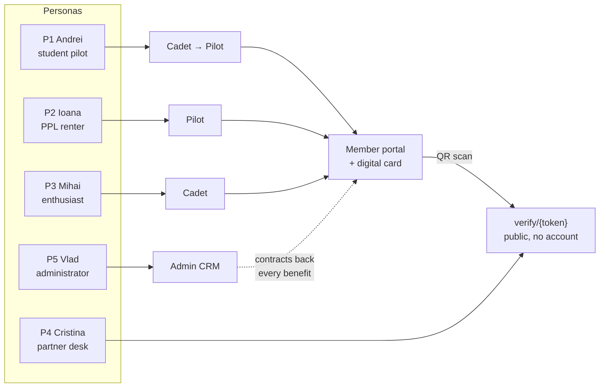

# 01 — Product Vision

> **Purpose:** why Aeroskill Club exists, who it serves, and what success looks like. Inherits all locked decisions from `00-foundation.md`. Everything measurable here is restated (not re-decided) by `02-product-strategy.md`.

---

## 1. Mission

**Aeroskill Club exists to make general aviation in Romania more accessible, more affordable, and less lonely — by pooling the buying power and community of pilots and enthusiasts into one club that partners with the flight schools, aerodromes, and associations they already use.**

One-line version (website hero):

> **Zbori mai mult. Plătești mai puțin. Aparții.** / *Fly more. Pay less. Belong.*

## 2. The problem

General aviation in Romania is fragmented and expensive — and the numbers are researched, not guessed (00 §10):

1. **Cost is the #1 dropout reason.** A PPL(A) at a Romanian school costs **€8,000–10,000** (~40,000–50,000 RON: €8,305 on a Tecnam P2008, €9,965 on a Cessna 172 at published price lists) and staying current afterwards costs **€120–145 per wet rental hour**. Students abandon licenses mid-way and licensed pilots fly too few hours to stay proficient. Nobody negotiates on their behalf — every pilot pays rack rate at every school and aerodrome.
2. **The pipeline has a cliff.** The state Aeroclubul României gives youth aged 15–23 **free** gliding, parachuting, and ultralight training across ~11 territorial aeroclubs — then the subsidy ends. At 24, a freshly hooked aviator faces full PPL prices with zero collective buying power. That cliff is exactly where a buying club belongs.
3. **The community is invisible.** GA life happens in scattered WhatsApp and Facebook groups tied to individual schools. AOPA Romania (IAOPA member since 2006) does valuable *advocacy*, but no one plays the neutral, benefits-first home that connects pilots *across* schools and aerodromes.
4. **Partners lack a channel.** Flight schools, aerodromes, and aviation businesses want reliable access to an engaged pilot audience, but have no structured way to reach one — sponsorships today are handshake deals with no deliverables.
5. **Clubs run on spreadsheets.** Where associations exist, membership, dues, contracts, and communication are managed manually, so renewals lapse silently and partner deals expire unnoticed.

Aeroskill Club answers all five with one platform: a public site that sells the promise, a member portal that delivers it, and a CRM that keeps the machine running — operated by a single administrator.

### Market reality (honest sizing)

There is **no public AACR census** of active PPL/LAPL holders or of the Romanian GA fleet (the authority publishes airline statistics — 19 carriers, 66 aircraft in 2023 — but not GA licensing counts). Our working assumption: a serviceable community in the **low thousands** — active license holders, students in training at ATOs/DTOs, Aeroclubul României alumni aging out of free courses, and enthusiasts. The Year-1 target of 120 members (§5) deliberately requires only a sliver of any plausible market size. **Validation plan:** request aggregate licensing counts from AACR, and instrument the partner-school channel (02 §6) — schools know exactly how many students they enroll per year, which grounds the Cadet funnel within the first quarter of operation.

## 3. Who we serve

Five personas anchor every requirement in `04-prd.md`. How they map to tiers and surfaces:

### P1 — Andrei, the student pilot (28, Bucharest)
Mid-way through a €9,000 PPL(A) at a DTO flying Tecnam P2008s from Clinceni (`LRCN`). Burning savings; every hour matters.
- **Goals:** finish the license without going broke; meet pilots beyond his school.
- **Frustrations:** rack-rate pricing; no visibility into deals; feels like a customer, not a peer.
- **Platform must:** show him concretely how a **Cadet** (3000 RON) membership pays for itself — a contracted 10% discount on the remainder of his training package alone can exceed the dues (02 §3) — and give him a card he can show at the school desk.

### P2 — Ioana, the licensed pilot (41, Cluj)
PPL holder, ~40 hours/year in rented aircraft at €135–145/h wet (≈ €5,500/year of flying), cross-country with friends.
- **Goals:** fly more hours for the same budget; preferential access to well-maintained aircraft.
- **Frustrations:** rental availability and cost; benefits scattered and undocumented.
- **Platform must:** make **Pilot** (4500 RON) obviously worth it — enhanced rental discounts, fleet preferential rates, waived landing fees at partner aerodromes, priority event access — with the break-even math visible in one benefits catalog (02 §3).

### P3 — Mihai, the enthusiast (35, Brașov)
Aviation photographer and sim pilot; not licensed (yet). Hangs around Sânpetru (`LRSP`) on weekends. Aged out of the Aeroclubul României free-course window years ago.
- **Goals:** belong to the scene; aerodrome access moments; a realistic path toward the license.
- **Frustrations:** GA feels closed to outsiders.
- **Platform must:** make **Cadet** a legitimate enthusiast membership, not a lesser pilot one; events and community first — and when he's ready, the training discount is his on-ramp.

### P4 — Cristina, the partner contact (38, flight school operations manager)
Runs day-to-day ops at a partner school operating from Ploiești-Strejnic (`LRPV`).
- **Goals:** predictable student inflow; honor club discounts without friction or fraud.
- **Frustrations:** can't tell who is actually a member in good standing.
- **Platform must:** let her verify a member card in **under 10 seconds** by scanning its QR — no account, no phone call (route `/verify/{token}`).

### P5 — Vlad, the club administrator (founder, `admin` role)
Runs the club solo, alongside the developer building this platform with Claude Code.
- **Goals:** grow membership without drowning in ops; never let a contract or renewal lapse silently.
- **Frustrations:** spreadsheets, manual reconciliation, ad-hoc email.
- **Platform must:** one CRM for members, partners, contracts, benefits, campaigns, and fleet — with alerts doing the remembering.

## 4. Value proposition by tier

| Persona | Natural tier | The trade they're making (grounded in real prices) |
|---------|-------------|--------------------------|
| Mihai (enthusiast) | **Cadet** — 3000 RON | Belonging + base discounts + events for the price of ~4 rental hours |
| Andrei (student) | **Cadet → Pilot** | A contracted 10% training-package discount (€800–1,000 on a full PPL) exceeds the dues on its own; upgrade when licensed |
| Ioana (active pilot) | **Pilot** — 4500 RON | Rental discounts + waived landing fees + fleet preferential rates target break-even at ~20 flying hours/year — half her actual usage (02 §3) |
| Power users / patrons | **Captain** — 6000 RON | Everything, first, everywhere — plus visible support of Romanian GA |

The tier ladder is a commitment ladder, not a paywall ladder: every member gets a card, the community, and real benefits; higher tiers deepen the same promise (per `00-foundation.md` §3.1).

## 5. What success looks like

### North-star metric

**Active members** (members with status `active`) — the single number that proves the promise is worth paying for, year after year.

### Targets

| Metric | Year 1 | Year 2 | Year 3 |
|--------|--------|--------|--------|
| Active members | **120** | **250** | **450** |
| — Cadet / Pilot / Captain mix | 80 / 30 / 10 | 150 / 70 / 30 | 260 / 130 / 60 |
| Membership revenue (RON) | 435,000 | 945,000 | 1,725,000 |
| Renewal rate | — (first cohort) | ≥ 70% | ≥ 80% |
| Active sponsors | 4 | 8 | 12 |
| Sponsor revenue (RON) | 60,000 | 150,000 | 300,000 |
| Partner flight schools | 5 | 10 | 15 |
| Partner aerodromes | 4 | 8 | 12 |

(Revenue = tier mix × locked prices from `00-foundation.md`; scenario spreads in `02-product-strategy.md` §5.)

### Qualitative outcomes

- A member card that partners **ask for** rather than tolerate.
- Zero contracts or memberships lapsing *unnoticed* (alerts fired, decisions made).
- The club administrator runs everything in ≤ 5 hours/week inside the CRM.
- Members introduce themselves at aerodromes as "Aeroskill" before naming their school.

## 6. Guiding principles

Later documents cite these by name:

1. **Members first, always.** Every feature must make membership more valuable or easier to keep. Sponsor and partner features exist to fund and deepen member value.
2. **Every benefit is backed by a contract.** Nothing is promised publicly that isn't secured in the CRM (`contracts` → `benefits`).
3. **The card is the product.** The digital member card is the daily, physical-world proof of membership — it gets design priority (08) and a public verification route (05).
4. **Romanian-first, bilingual always.** Default `ro`, full `en` parity on public and member surfaces (00 §4.4).
5. **Boring technology, exciting flying.** One app, few services, managed everything (00 §4.2). Excitement belongs at the aerodrome, not in the stack.
6. **Privacy is a feature.** GDPR self-service, cookieless analytics, no data ever sold or shared beyond the processor list (09).
7. **Ship vertical slices.** Every increment is demoable end-to-end (03).

---

*Sources for the researched figures in this document: Romanian school price lists ([Aviation Academy](https://aviationacademy.ro/tarife-cursuri-personal-navigant/), [Cruiser Aviation](https://cruiseraviation.com/ro/articole/cat-costa-scoala-de-zbor), [Zbor cu Avionul](https://zborcuavionul.ro/scoala-de-zbor/)), [Aeroclubul României free-course program](https://aeroclubulromaniei.ro/page/cursuri-gratuite), [AOPA Romania](https://www.aopa.ro/). Full research basis: 00 §10.*
