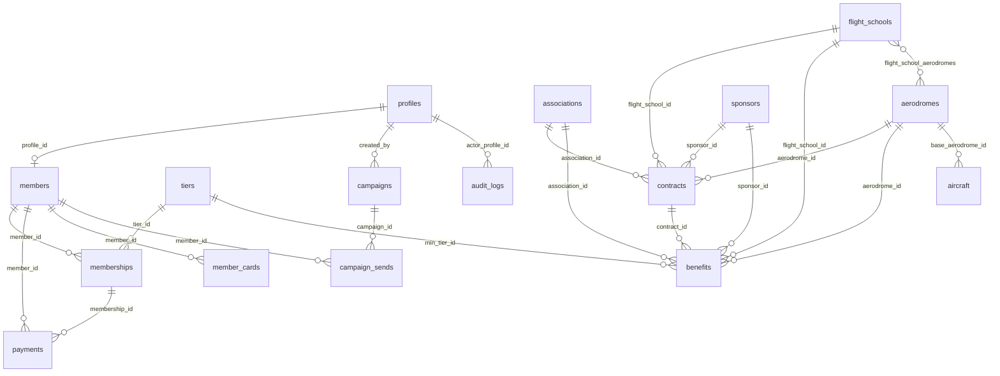

# 06 — Database Schema

> **Purpose:** the complete Postgres data model — enums, tables, relationships, ERD, and RLS posture — for Supabase (00 §4.2). Derived from `04-prd.md`; table names locked in the `00-foundation.md` §6 glossary. `07-user-flows.md` references these tables verbatim.

---

## 1. Conventions

- Tables: **snake_case, plural**, exactly as the 00 §6 glossary. Columns: snake_case.
- PKs: `id uuid DEFAULT gen_random_uuid()` unless noted (`tiers` uses smallint; `audit_logs` bigserial).
- Money: **integer whole RON** (00 §4.3), columns suffixed `_ron`. Dates that are day-granular: `date`; instants: `timestamptz`.
- Every mutable table has `created_at timestamptz DEFAULT now()` and `updated_at` (trigger-maintained) — omitted from the column tables below for brevity.
- Polymorphic partner references use **one nullable FK per partner type + `CHECK` exactly-one** (00 §6). Chosen over a party-supertype table because there are exactly four fixed partner types, each with different fields, and FK integrity stays native. Applied identically in `contracts` and `benefits`.
- `auth.users` is Supabase-managed; `profiles` is its 1:1 public mirror.

## 2. Enums registry

Values are locked in 00 §7.2; this file adds three schema-local enums (`pilot_status`, `payment_purpose`, `send_status`) that 00 does not govern.

```sql
CREATE TYPE role            AS ENUM ('member','staff','admin');
CREATE TYPE member_status   AS ENUM ('pending','active','grace','expired','archived');
CREATE TYPE membership_status AS ENUM ('pending','active','grace','expired','cancelled');
CREATE TYPE payment_method  AS ENUM ('card','bank_transfer');
CREATE TYPE payment_status  AS ENUM ('pending','confirmed','failed','refunded');
CREATE TYPE contract_status AS ENUM ('draft','active','expired','terminated');
CREATE TYPE contract_type   AS ENUM ('partnership','sponsorship','service');
CREATE TYPE partner_type    AS ENUM ('flight_school','association','aerodrome','sponsor');
CREATE TYPE sponsor_package AS ENUM ('bronze','silver','gold');
CREATE TYPE campaign_kind   AS ENUM ('email','announcement');
CREATE TYPE campaign_status AS ENUM ('draft','scheduled','sent','cancelled');
CREATE TYPE aircraft_status AS ENUM ('active','maintenance','retired');
CREATE TYPE aircraft_ownership AS ENUM ('owned','leased','partner');
-- schema-local:
CREATE TYPE pilot_status    AS ENUM ('enthusiast','student','licensed');
CREATE TYPE payment_purpose AS ENUM ('new','renewal','upgrade');
CREATE TYPE send_status     AS ENUM ('sent','failed');
```

## 3. Tables

### 3.1 Identity & access

**`profiles`** — 1:1 with `auth.users`; every authenticated person (members and staff).

| Column | Type | Null | Default / constraints |
|--------|------|------|-----------------------|
| id | uuid | no | PK, FK → `auth.users(id)` ON DELETE CASCADE |
| email | text | no | mirror of auth email, kept in sync |
| full_name | text | no | |
| role | role | no | `'member'` |
| locale | text | no | `'ro'`, CHECK in (`'ro'`,`'en'`) |
| avatar_path | text | yes | Supabase Storage path (MEM-010) |
| active | boolean | no | `true` — staff deactivation (ADM-032) |

**`club_settings`** — singleton (ADM-033).

| Column | Type | Null | Notes |
|--------|------|------|-------|
| id | smallint | no | PK, CHECK (id = 1) |
| club_name, contact_email, contact_phone, address | text | no | used in emails/legal/contact |
| iban, bank_name, beneficiary_name | text | no | bank-transfer instructions (MEM-006) |
| updated_by | uuid | yes | FK → profiles |

### 3.2 Membership & billing

**`tiers`** — seeded, matches 00 §3.1 exactly.

| Column | Type | Null | Notes |
|--------|------|------|-------|
| id | smallint | no | PK (1, 2, 3) |
| slug | text | no | UNIQUE: `cadet` / `pilot` / `captain` |
| name_ro / name_en | text | no | Cadet/Cadet · Pilot/Pilot · Căpitan/Captain |
| rank | smallint | no | UNIQUE: 1 / 2 / 3 (min-tier comparisons) |
| annual_price_ron | integer | no | 3000 / 4500 / 6000 |
| active | boolean | no | `true` |

**`members`** — the club-member record (application + status), 1:1 with a profile.

| Column | Type | Null | Notes |
|--------|------|------|-------|
| id | uuid | no | PK |
| profile_id | uuid | no | FK → profiles, UNIQUE |
| member_number | text | yes | UNIQUE, `ASC-YYYY-NNNN` (00 §6); null until first activation |
| status | member_status | no | `'pending'`; mirrors latest membership (PLT-006) |
| phone | text | no | |
| county | text | no | |
| date_of_birth | date | no | |
| pilot_status | pilot_status | no | MEM-002 |
| founding_member | boolean | no | `false`; set by activation logic (MEM-007 AC3) |
| terms_accepted_at | timestamptz | no | |
| marketing_consent | boolean | no | `false` (MEM-019) |
| consent_updated_at | timestamptz | yes | |
| erasure_requested_at | timestamptz | yes | MEM-022 queue flag |
| staff_notes | text | yes | never member-visible |
| archived_at | timestamptz | yes | ADM-008 |

**`memberships`** — one row per member-year (00 §3.2).

| Column | Type | Null | Notes |
|--------|------|------|-------|
| id | uuid | no | PK |
| member_id | uuid | no | FK → members |
| tier_id | smallint | no | FK → tiers; updated in place on upgrade (MEM-013) |
| status | membership_status | no | `'pending'` |
| starts_on / ends_on | date | yes | set at activation; `ends_on = starts_on + interval '1 year' - interval '1 day'` |
| price_ron | integer | no | price locked at purchase (founding price lock lives here) |
| activated_at / cancelled_at | timestamptz | yes | |

Constraints: `EXCLUDE USING gist (member_id WITH =, daterange(starts_on, ends_on, '[]') WITH &&) WHERE (status IN ('active','grace'))` — no overlapping active years. Index `(member_id, ends_on DESC)`; index `(status, ends_on)` for the daily job (PLT-006).

**`payments`**

| Column | Type | Null | Notes |
|--------|------|------|-------|
| id | uuid | no | PK |
| membership_id | uuid | no | FK → memberships |
| member_id | uuid | no | FK → members (denormalized for RLS) |
| amount_ron | integer | no | > 0 |
| method | payment_method | no | |
| purpose | payment_purpose | no | `new` / `renewal` / `upgrade` |
| status | payment_status | no | `'pending'` |
| stripe_session_id | text | yes | UNIQUE; card payments only |
| reference_code | text | yes | UNIQUE, `ASC-P-NNNNN` (00 §4.3); generated for bank transfers — payment-scoped because member numbers don't exist before first activation |
| bank_reference | text | yes | statement line recorded at manual confirmation (ADM-006) |
| paid_at | timestamptz | yes | |
| confirmed_by | uuid | yes | FK → profiles; staff for bank transfers, null for webhook |

**`stripe_events`** — webhook idempotency ledger (PLT-009).

| Column | Type | Null | Notes |
|--------|------|------|-------|
| id | text | no | PK = Stripe event id |
| processed_at | timestamptz | no | `now()` |

**`member_cards`** — verification tokens (00 §6; MEM-015, ADM-010).

| Column | Type | Null | Notes |
|--------|------|------|-------|
| id | uuid | no | PK |
| member_id | uuid | no | FK → members |
| verification_token | text | no | UNIQUE, 22-char URL-safe random |
| issued_at | timestamptz | no | `now()` |
| revoked_at | timestamptz | yes | reissue revokes (ADM-010) |

Partial unique index: one unrevoked card per member (`UNIQUE (member_id) WHERE revoked_at IS NULL`).

### 3.3 Partners

**`flight_schools`** (ADM-012)

| Column | Type | Null |
|--------|------|------|
| id | uuid | no |
| name | text | no |
| contact_name / email / phone | text | yes |
| notes | text | yes |
| active | boolean | no (`true`) |

**`flight_school_aerodromes`** — m:n operating locations: `flight_school_id` FK, `aerodrome_id` FK, PK (both).

**`associations`** (ADM-013): as `flight_schools`, plus `scope text` (what the association does).

**`aerodromes`** (ADM-014)

| Column | Type | Null | Notes |
|--------|------|------|-------|
| id | uuid | no | PK |
| name | text | no | |
| icao_code | char(4) | no | UNIQUE, CHECK `~ '^[A-Z]{4}$'` (e.g. `LRBS`) |
| county | text | no | |
| latitude / longitude | numeric | yes | |
| contact_name / email / phone | text | yes | |
| notes | text | yes | |
| active | boolean | no | `true` |

**`sponsors`** (ADM-015)

| Column | Type | Null | Notes |
|--------|------|------|-------|
| id | uuid | no | PK |
| name | text | no | |
| package | sponsor_package | no | |
| logo_path | text | yes | Storage |
| website_url | text | yes | |
| contact_name / email / phone | text | yes | |
| visible_on_site | boolean | no | `false` (PUB-006) |
| display_order | integer | no | `100` |
| notes | text | yes | |

### 3.4 Contracts

**`contracts`** (ADM-017..020)

| Column | Type | Null | Notes |
|--------|------|------|-------|
| id | uuid | no | PK |
| contract_number | text | no | UNIQUE, `CTR-YYYY-NNN` (00 §6) |
| type | contract_type | no | |
| status | contract_status | no | `'draft'` |
| flight_school_id | uuid | yes | FK → flight_schools |
| association_id | uuid | yes | FK → associations |
| aerodrome_id | uuid | yes | FK → aerodromes |
| sponsor_id | uuid | yes | FK → sponsors |
| starts_on / ends_on | date | yes | required before `active` (ADM-018) |
| value_ron | integer | yes | |
| terms_summary | text | yes | deliverables/obligations |
| document_path | text | yes | private Storage, PDF (ADM-019) |
| terminated_reason | text | yes | required on `terminated` |
| created_by | uuid | no | FK → profiles |

```sql
CHECK (num_nonnulls(flight_school_id, association_id, aerodrome_id, sponsor_id) = 1)
```
Indexes: `(status, ends_on)` for expiry alerts; one per FK column.

### 3.5 Benefits

**`benefits`** (ADM-021/022, PUB-004, MEM-017) — same polymorphic mechanism + CHECK as `contracts`.

| Column | Type | Null | Notes |
|--------|------|------|-------|
| id | uuid | no | PK |
| flight_school_id / association_id / aerodrome_id / sponsor_id | uuid | yes | exactly one non-null (CHECK as above) |
| contract_id | uuid | yes | FK → contracts; publication gate (ADM-022) |
| title_ro / title_en | text | no | bilingual content (00 §4.4) |
| description_ro / description_en | text | no | |
| redemption_note_ro / redemption_note_en | text | yes | "show your card at the desk…" |
| min_tier_id | smallint | no | FK → tiers; available to `rank >=` this tier's rank |
| active | boolean | no | `true` |

### 3.6 Fleet

**`aircraft`** (ADM-029..031, PUB-007)

| Column | Type | Null | Notes |
|--------|------|------|-------|
| id | uuid | no | PK |
| registration | text | no | UNIQUE (e.g. `YR-ABC`) |
| manufacturer / model | text | no | |
| year | integer | yes | |
| seats | integer | yes | |
| ownership | aircraft_ownership | no | |
| base_aerodrome_id | uuid | no | FK → aerodromes |
| status | aircraft_status | no | `'active'` |
| hourly_rate_note | text | yes | free-text (no booking in v1, 00 §9) |
| photo_path | text | yes | Storage |
| arc_expires_on / insurance_expires_on | date | yes | ADM-030 alerts |
| public_visible | boolean | no | `false` (ADM-031) |
| notes | text | yes | |

### 3.7 Communication

**`email_templates`** (ADM-023) — seeded with the PLT-004 lifecycle set.

| Column | Type | Null | Notes |
|--------|------|------|-------|
| id | uuid | no | PK |
| key | text | no | UNIQUE (see §6 seed list) |
| subject_ro / subject_en | text | no | |
| body_ro / body_en | text | no | react-email-compatible markup with `{{variables}}` |
| variables | text[] | no | documented placeholders |
| updated_by | uuid | yes | FK → profiles |

**`campaigns`** (ADM-024..027) — staff-authored in `ro` (admin surface is ro-only; single-language content by design).

| Column | Type | Null | Notes |
|--------|------|------|-------|
| id | uuid | no | PK |
| kind | campaign_kind | no | |
| status | campaign_status | no | `'draft'` |
| title | text | no | internal + announcement headline |
| subject | text | yes | email kind only |
| body | text | no | rich text |
| segment | jsonb | no | `{"tiers":[1,2],"statuses":["active","grace"]}` or `{"all":true}` |
| scheduled_at / sent_at / published_at | timestamptz | yes | published_at: announcements (MEM-020) |
| created_by | uuid | no | FK → profiles |

**`campaign_sends`** (ADM-026) — one row per email recipient.

| Column | Type | Null | Notes |
|--------|------|------|-------|
| id | uuid | no | PK |
| campaign_id | uuid | no | FK → campaigns |
| member_id | uuid | no | FK → members |
| email | text | no | snapshot at send time |
| status | send_status | no | |
| error | text | yes | |
| sent_at | timestamptz | no | |

**`email_log`** (ADM-028) — automated/lifecycle sends: `id` PK, `template_key` text, `recipient_profile_id` uuid null FK, `recipient_email` text, `status send_status`, `error` text null, `sent_at`.

### 3.8 Audit

**`audit_logs`** (PLT-007, ADM-034) — insert-only.

| Column | Type | Null | Notes |
|--------|------|------|-------|
| id | bigserial | no | PK |
| actor_profile_id | uuid | yes | null for system jobs |
| actor_label | text | no | e.g. `admin:vlad`, `cron:daily`, `webhook:stripe` |
| action | text | no | verb, e.g. `payment.confirm` |
| entity_type / entity_id | text | no | |
| before / after | jsonb | yes | diff payloads |
| created_at | timestamptz | no | `now()` |

## 4. ERD



(`contracts`/`benefits` show four partner edges each — exactly one is populated per row, per the CHECK in §3.4/§3.5.)

## 5. RLS posture

RLS is **enabled on every table, deny-by-default** (00 §8.2). The role-check mechanism follows Supabase's researched RBAC guidance (custom claims via auth hook — see sources at §7):

1. **Role lives in the JWT, not in a per-row subquery.** A **Custom Access Token Auth Hook** copies `profiles.role` into a `user_role` claim when a token is issued. Policies read the claim — no `profiles` lookup per row:

```sql
CREATE FUNCTION public.jwt_role() RETURNS role
LANGUAGE sql STABLE
AS $$ SELECT COALESCE((auth.jwt() ->> 'user_role'), 'member')::role $$;
```

2. **Never trust `user_metadata` in policies** — it is end-user-writable. Only the hook-issued claim (or `app_metadata`) is authoritative.
3. **Role changes propagate on token refresh** (~1 h max staleness). Consequence: demoting or deactivating a staff account (ADM-032) must also revoke the user's sessions server-side, not just flip `profiles.role`.
4. **Performance rules** (researched): wrap volatile calls so Postgres caches them per statement instead of per row — `(SELECT auth.uid())`, `(SELECT public.jwt_role())`; scope every policy `TO authenticated` (or `TO anon` where truly public) so the other role skips evaluation entirely; and **index every column referenced by a policy** — `members.profile_id`, `payments.member_id`, `memberships.member_id`, `benefits.contract_id`, `contracts.sponsor_id` etc. (`auth.uid() = column` checks are >100× faster indexed).

| Table | anon | member (own) | staff | admin |
|-------|------|--------------|-------|-------|
| profiles | — | select/update own row (not `role`, not `active`) | select all | all (role changes via ADM-032 action) |
| club_settings | — | — | select | select/update |
| tiers | select where `active` | select | select | all |
| members | — | select own; update own contact fields; insert own application | select/update all | all |
| memberships | — | select own; insert own `pending` | select/update all | all |
| payments | — | select own; insert own `pending` | select all; update (confirm) | all |
| stripe_events | — | — | — | — (service-role only) |
| member_cards | — (verification via RPC) | select own | select all; insert/update (reissue) | all |
| flight_schools / associations / aerodromes / sponsors | sponsors: select where `visible_on_site` + active sponsorship contract; aerodromes: select where `active` (fleet page); others: — | same as anon | all | all |
| contracts | — | — | all | all |
| benefits | select where publishable* | select where publishable* | all | all |
| aircraft | select where `public_visible` and `status='active'` | same | all | all |
| email_templates / campaigns / campaign_sends / email_log | — | announcements: select `campaigns` where `kind='announcement' and published_at is not null` | all | all |
| audit_logs | — | — | — | select only; inserts via service role/trigger |

\* Publishable = `active = true AND (contract_id IS NULL OR contract is 'active')` (ADM-022).

### Instructive policies

```sql
-- members: self-read (auth.uid() wrapped in SELECT → cached initPlan, not per-row)
CREATE POLICY members_self_select ON members FOR SELECT
  TO authenticated
  USING (profile_id = (SELECT auth.uid()));

-- payments: member sees own payments only (payments.member_id is indexed)
CREATE POLICY payments_self_select ON payments FOR SELECT
  TO authenticated
  USING (member_id IN (SELECT id FROM members WHERE profile_id = (SELECT auth.uid())));

-- staff/admin: full access on members (role from JWT claim, no table lookup)
CREATE POLICY members_staff_all ON members FOR ALL
  TO authenticated
  USING ((SELECT public.jwt_role()) IN ('staff','admin'));

-- benefits: public read only when publishable
CREATE POLICY benefits_public_select ON benefits FOR SELECT
  TO anon, authenticated
  USING (active AND (contract_id IS NULL OR EXISTS (
    SELECT 1 FROM contracts c WHERE c.id = contract_id AND c.status = 'active')));

-- sponsors: public read gated by active sponsorship contract
CREATE POLICY sponsors_public_select ON sponsors FOR SELECT
  TO anon, authenticated
  USING (visible_on_site AND EXISTS (
    SELECT 1 FROM contracts c WHERE c.sponsor_id = sponsors.id
      AND c.type = 'sponsorship' AND c.status = 'active'));

-- audit_logs: admin read, no one updates/deletes
CREATE POLICY audit_admin_select ON audit_logs FOR SELECT
  TO authenticated
  USING ((SELECT public.jwt_role()) = 'admin');
```

**Card verification** (PUB-013) never exposes tables to anon; it calls a `security definer` RPC returning the minimal verdict payload:

```sql
CREATE FUNCTION public.verify_card(p_token text)
RETURNS TABLE (valid boolean, first_name text, last_initial text,
               tier_slug text, valid_until date)
LANGUAGE sql SECURITY DEFINER STABLE ...
```

It returns `valid = true` only for an unrevoked token whose member is `active` or `grace` (00 §3.2), and nothing but the five columns above.

**Identifier generation:** `member_number` and `contract_number` come from `security definer` functions using per-year sequences (`ASC-2026-0001`, `CTR-2026-001`) so numbering is race-safe and never reused (00 §6).

## 6. Migrations & seeds

Ordered migration list (one concern per migration, 03 §philosophy):

| # | Migration | Contents |
|---|-----------|----------|
| 001 | extensions & enums | `pgcrypto`, `btree_gist`; §2 enums |
| 002 | identity | `profiles` (+ auth trigger creating profile on signup), `club_settings` |
| 003 | membership core | `tiers`, `members`, `memberships` (+ overlap constraint) |
| 004 | billing | `payments`, `stripe_events` |
| 005 | cards | `member_cards`, `verify_card()`, number-generator functions |
| 006 | partners | `flight_schools`, `flight_school_aerodromes`, `associations`, `aerodromes`, `sponsors` |
| 007 | contracts | `contracts` + CHECK + indexes |
| 008 | benefits | `benefits` + CHECK |
| 009 | fleet | `aircraft` |
| 010 | communication | `email_templates`, `campaigns`, `campaign_sends`, `email_log` |
| 011 | audit | `audit_logs`, `updated_at` triggers, audit helpers |
| 012 | RLS | enable RLS everywhere + all §5 policies |

**Auth hook migration note:** the Custom Access Token hook (§5.1) ships with migration 002 alongside `profiles`; it is configured in Supabase Auth settings per environment and must be part of the environment checklist (09 §5).

**Seeds:** the three `tiers` rows exactly per 00 §3.1; `club_settings` placeholder row; `email_templates` for every PLT-004 key — `application_received`, `application_rejected`, `bank_transfer_instructions`, `payment_confirmed`, `membership_activated`, `renewal_minus_30`, `renewal_minus_7`, `renewal_day_0`, `renewal_grace_14`, `lapse_final_30`, `upgrade_confirmed`, `erasure_received`, `erasure_completed`, `staff_invite`, `alert_contract_expiry`, `alert_aircraft_docs`, `alert_pending_transfer`; one bootstrap `admin` profile (created via Supabase invite, promoted by seed). Local/dev additionally seeds demo partners, contracts, benefits, and members for development (never in production) — using **real Romanian GA aerodromes** so demo data reads true: Clinceni `LRCN`, Ploiești-Strejnic `LRPV`, Brașov-Sânpetru `LRSP`, Tuzla `LRTZ`, București-Băneasa `LRBS`.

---

## 7. Sources

*RLS mechanics per Supabase's published guidance: [RLS performance & best practices](https://supabase.com/docs/guides/troubleshooting/rls-performance-and-best-practices-Z5Jjwv), [Custom claims & RBAC](https://supabase.com/docs/guides/database/postgres/custom-claims-and-role-based-access-control-rbac), [Row Level Security](https://supabase.com/docs/guides/database/postgres/row-level-security). Aerodrome codes: AACR aerodrome register and flight-planning databases (00 §10).*
