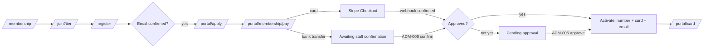
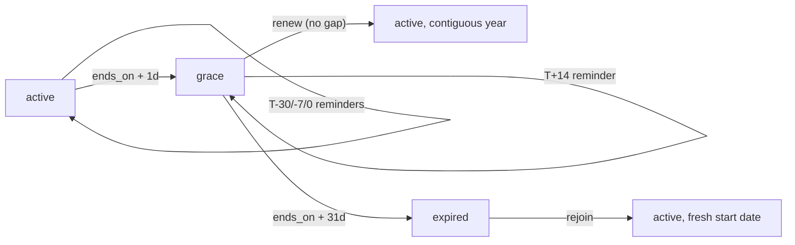
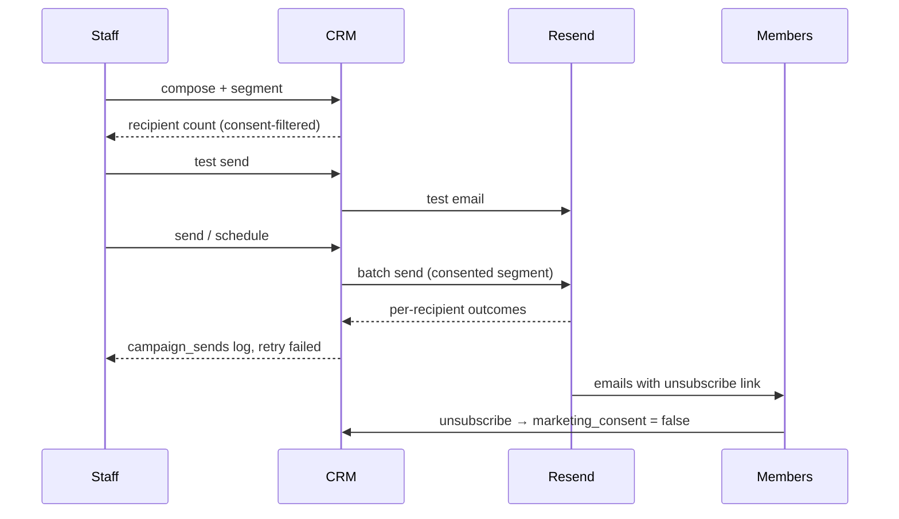

# 07 — User Flows

> **Purpose:** step-by-step flows across the public website, member portal, and admin CRM. Routes are cited verbatim from `05-information-architecture.md`, tables from `06-database-schema.md`, requirements from `04-prd.md`. Statuses and timing rules come from `00-foundation.md` §3.2/§7.2.

**Step format:** `route → user action → system response`. Failure/edge paths are indented under the step where they branch. Post-conditions list resulting data states.

## Flow index

| ID | Flow | Surface | Actor | Covers |
|----|------|---------|-------|--------|
| FLOW-01 | Visitor becomes active member (golden path) | Public + Portal | Visitor → member | PUB-003/009, MEM-001/002/005/006/007 |
| FLOW-02 | Login & password reset | Portal | Member | MEM-003, MEM-004 |
| FLOW-03 | Renewal — happy path | Portal | Member | MEM-012, PLT-004 |
| FLOW-04 | Lapsed renewal — dunning, grace, expiry | Portal + system | System + member | PLT-005/006, MEM-008, MEM-012 (grace behavior per 05 §4) |
| FLOW-05 | Tier upgrade | Portal | Member | MEM-013 |
| FLOW-06 | Card issuance & partner verification | Portal + Public | Member + partner desk | MEM-015, PUB-013 |
| FLOW-07 | Profile update | Portal | Member | MEM-009 |
| FLOW-08 | GDPR export & erasure | Portal + Admin | Member + admin | MEM-021/022, ADM-035 |
| FLOW-09 | Application review | Admin | Staff | ADM-005, MEM-007 |
| FLOW-10 | Manual bank-transfer confirmation | Admin | Staff | ADM-006, MEM-007 |
| FLOW-11 | Onboard flight school + contract | Admin | Staff | ADM-012/016/017/018/019 |
| FLOW-12 | Create benefit linked to contract | Admin | Staff | ADM-021/022, PUB-004, MEM-017 |
| FLOW-13 | Contract expiry alert → renewal decision | Admin + system | System + staff | ADM-020/018, PLT-005 |
| FLOW-14 | Campaign to a member segment | Admin | Staff | ADM-024/025/026, MEM-019 |
| FLOW-15 | Add aircraft to fleet | Admin | Staff | ADM-029/030/031, PUB-007 |
| FLOW-16 | Sponsor onboarding → public site | Admin + Public | Staff | ADM-015/017, PUB-006 |

---

## FLOW-01 — Visitor becomes active member (golden path)

**Actor:** anonymous visitor (persona P1–P3). **Trigger:** lands on `/` or `/membership`. **Preconditions:** none.

1. `/membership` → compares tiers → tier cards show locked prices; Pilot recommended (PUB-003).
2. `/membership` → clicks "Join as Cadet" → redirected to `/join?tier=cadet` (PUB-009).
3. `/join` → clicks "Create account" → `/register` opens with tier carried in state.
4. `/register` → submits email + password → account created (`auth.users` + `profiles` row via trigger); confirmation email sent (MEM-001).
   - Email already registered → non-enumerating error, link to `/login`.
5. Email inbox → clicks confirmation link → session established → redirected to `/portal/apply`.
6. `/portal/apply` → fills application (name, phone, county, DOB, pilot status, terms; optional marketing consent) → `members` row (`status='pending'`) + `memberships` row (`tier_id`, `status='pending'`, `price_ron=3000`) created (MEM-002); "application received" email sent (`email_log`).
   - Validation failure → inline Zod errors, nothing persisted.
7. `/portal/membership/pay` → chooses **card** → Stripe Checkout session created (`payments` row: `card`, `purpose='new'`, `status='pending'`, `stripe_session_id`) → redirect to Stripe (MEM-005).
   - Chooses **bank transfer** → IBAN + unique reference code `ASC-P-NNNNN` generated on the `payments` row (`bank_transfer`, `pending`, `reference_code`) → member sees "awaiting confirmation" with the code prominently copyable (MEM-006). *Flow continues at FLOW-10.*
   - Cancels Stripe Checkout → returned to `/portal/membership/pay` with retry + bank-transfer alternative.
8. Stripe → member completes payment (any PSD2/SCA 3-D Secure challenge happens inside Checkout) → webhook `/api/webhooks/stripe` verifies signature, records `stripe_events`, sets payment `confirmed` (PLT-009).
   - SCA challenge failed/abandoned → session expires unpaid → step 7 retry path; the success redirect alone never activates anything (MEM-005 AC2).
9. System → if application already approved (FLOW-09) → **activation** (MEM-007): membership `active`, `starts_on=today`, `ends_on=+1y−1d`; member `active`; `member_number` assigned; `member_cards` row issued; founding flag if among first 50; "membership activated" email with card link.
   - Application not yet approved → member stays `pending` with "payment received, awaiting approval" state; activation fires on approval.
10. `/portal` → dashboard shows `active` chip, card CTA → member opens `/portal/card` (FLOW-06).

**Post-conditions:** `members.status='active'`, one `active` membership, `confirmed` payment, unrevoked card, audit rows for activation.

## FLOW-02 — Login & password reset

**Actor:** member. **Trigger:** visits `/login`.

1. `/login` → submits credentials → session cookie set → redirect by role: `member` → `/portal`, `staff`/`admin` → `/admin` (MEM-003).
   - Wrong credentials → non-enumerating error; rate limit after repeated failures (PLT-011).
   - Deep link (`/login?next=/portal/card`) → honored post-login.
2. Forgot password → `/reset-password` → submits email → "if the address exists, a link was sent" (MEM-004).
3. Email link (single-use, ≤ 1 h) → set new password → session established → `/portal`.
   - Expired/used link → error with restart option.

**Post-conditions:** active session; no data changes beyond auth.

## FLOW-03 — Renewal, happy path

**Actor:** active member. **Trigger:** renewal reminder email at T−30 (PLT-004). **Preconditions:** membership `active`, `ends_on` within 30 days.

1. Email → "Renew now" → `/portal/membership/renew` (post-login).
2. Renew page → shows current tier, next-year dates (`starts_on = ends_on + 1 day`), price (or founding locked price from `memberships.price_ron` history) and optional downgrade choice (00 §3.3) → member confirms tier.
3. → chooses payment method → as FLOW-01 steps 7–8 with `purpose='renewal'`; new `memberships` row (`pending`).
4. Payment `confirmed` → new membership `active` with no-gap dates; "payment confirmed" email; card validity extends automatically (card reads live membership — no reissue).

**Post-conditions:** two membership rows (old `active` until its `ends_on`, new `active` contiguous), payment `confirmed`.

## FLOW-04 — Lapsed renewal: dunning, grace, expiry

**Actor:** system (daily job, PLT-005/006) + member. **Trigger:** `ends_on` approaches without renewal.

1. T−30 / T−7 / T0 → job sends reminder emails (`renewal_minus_30`, `renewal_minus_7`, `renewal_day_0`) → `email_log` rows.
2. `ends_on + 1 day` → job transitions membership `active → grace`; member mirrors `grace`; audit row (actor `cron:daily`).
3. Portal during grace → warning banner with days left; card renders full-color; `/verify/{token}` still returns valid (00 §3.2).
4. T+14 → `renewal_grace_14` email.
5. Member renews during grace → FLOW-03 from step 2; new year starts at old `ends_on + 1 day` — no gap, no punishment.
6. `ends_on + 31 days`, still unpaid → job transitions `grace → expired`; member `expired`; `lapse_final_30` email; card page renders expired (08 §6.3); verification returns invalid.
7. Expired member later returns → `/portal/membership/renew` offers **rejoin**: new membership starting today (fresh anniversary), same member number.

**Post-conditions:** statuses per 00 §7.2 at every stage; every transition audit-logged.

## FLOW-05 — Tier upgrade

**Actor:** active member (Cadet → Pilot shown). **Trigger:** locked benefit in catalog or self-initiated.

1. `/portal/benefits` → benefit shows "Pilot and above" lock → "Upgrade" → `/portal/membership/upgrade` (MEM-017 AC1).
2. Upgrade page → server computes pro-rated difference per 00 §3.3 (e.g. 200 days remaining: `(4500−3000) × 200/365`, rounded up) → shows amount and immediate effect.
3. → pays (card or transfer; `payments.purpose='upgrade'`).
4. Confirmation → current membership row's `tier_id` updates in place (06 §3.2); `upgrade_confirmed` email; card and catalog reflect Pilot immediately.

**Post-conditions:** same membership row, higher tier; payment `confirmed`; audit row.

## FLOW-06 — Card issuance & partner verification

**Actors:** member + partner desk (persona P4, no account). **Preconditions:** member `active` or `grace`.

1. Activation (FLOW-01 step 9) issued `member_cards` row with `verification_token`.
2. Member: `/portal/card` → card renders per 08 §6 with QR of `/verify/{token}` (MEM-015).
3. Desk: scans QR with any camera → `/verify/{token}` → server RPC `verify_card` (06 §5) → ✅ "Membru activ / Active member", name (first + initial), tier badge, validity, timestamp (PUB-013).
   - Expired/archived member → ❌ invalid verdict, no personal data.
   - Unknown/revoked token → ❌ invalid verdict.
   - Screenshot of an old card → still live-checked: verdict reflects current status (02 R5).
4. Desk applies the tier benefit per its contract terms (no redemption logging in v1, 00 §9).

**Lost card variant:** member reports → staff `/admin/members/{id}` → "Reissue card" (ADM-010) → old token `revoked_at` set (verifies invalid), new `member_cards` row → member's `/portal/card` shows new QR instantly.

## FLOW-07 — Profile update

1. `/portal/profile` → edits phone/county/address → Zod-validated save on own row only (RLS, 06 §5) → toast confirm (MEM-009).
   - Name change → saved as pending change flag for staff review (MEM-009 AC1); staff applies via ADM-007.
2. Email change → Supabase re-confirmation cycle; effective on confirm.

## FLOW-08 — GDPR export & erasure

**Export:** `/portal/settings` → "Download my data" → server compiles JSON (member, memberships, payments, consents) → file download + audit row (MEM-021).

**Erasure:**
1. `/portal/settings` → "Delete my account" → typed confirmation → `members.erasure_requested_at` set; `erasure_received` email (MEM-022).
2. Admin queue (`/admin` ADM-002) → admin opens `/admin/members/{id}` → "Execute erasure" → typed confirmation (ADM-035).
3. System → anonymizes personal fields in place, deletes auth account, retains anonymized payment records (legal basis, 09 §GDPR), revokes card → `erasure_completed` email sent **before** the address is erased → audit row.

**Post-conditions:** member row anonymized (`status='archived'`), no personal data recoverable, payment totals intact.

## FLOW-09 — Application review (admin)

**Actor:** staff. **Trigger:** ADM-002 queue shows pending applications.

1. `/admin` → "Pending applications (3)" → `/admin/members?status=pending`.
2. `/admin/members/{id}` → reviews application data → **Approve** (ADM-005).
   - **Reject** → mandatory reason → `application_rejected` email → data purge scheduled at +90 days (09 §retention).
3. System → if payment already `confirmed` → activation exactly as FLOW-01 step 9; else member remains `pending` awaiting payment.

## FLOW-10 — Manual bank-transfer confirmation (admin)

**Actor:** staff. **Trigger:** bank statement shows an incoming transfer; ADM-002 queue lists `pending` bank-transfer payments.

1. `/admin` → "Pending transfers (2)" → payment detail via `/admin/members/{id}`.
2. Matches statement line by the payment's unique reference code `ASC-P-NNNNN` and amount → **Confirm payment** → records `paid_at` + `bank_reference`, `confirmed_by` = staff profile (ADM-006).
   - Member forgot the code and referenced their name instead → staff searches pending payments by member name/amount; the code is a fast path, not a hard gate.
   - Amount mismatch → staff contacts member; may confirm partial as `pending` note or mark `failed`.
   - Unannounced transfer (no `pending` row) → staff creates the payment against the member's membership directly (ADM-006 AC2).
3. System → confirmation triggers activation/renewal/upgrade effects identically to the Stripe webhook path (FLOW-01 step 9, FLOW-03 step 4, FLOW-05 step 4).

**Post-conditions:** payment `confirmed`, downstream activation effects, audit row.

## FLOW-11 — Onboard a flight school + contract (admin)

1. `/admin/flight-schools` → "Add school" → name, contacts, operating aerodromes (m:n, 06 §3.3) → saved `active` (ADM-012).
2. `/admin/contracts` → "New contract" → counterparty = the school (exactly-one rule), type `partnership`, dates, terms summary → saved `draft` (ADM-017).
3. Contract detail → uploads signed PDF (ADM-019) → **Activate** → status `active` (ADM-018; requires dates + counterparty).
4. School detail `/admin/flight-schools/{id}` → shows linked contract `active` (ADM-016). *Benefits follow in FLOW-12.*

## FLOW-12 — Create a benefit linked to a contract (admin)

1. `/admin/benefits` → "New benefit" → partner = school from FLOW-11, contract linked, bilingual title/description, `min_tier` = Cadet, redemption note → saved `active` (ADM-021).
2. Publication rule evaluates (ADM-022): contract `active` → benefit is publishable.
3. Public `/membership` shows it in the live benefit rows (PUB-004); portal `/portal/benefits` lists it with partner name (MEM-017); members below `min_tier` see the upgrade lock (FLOW-05 entry).
4. Later, contract expires (FLOW-13) → benefit auto-hides everywhere without staff action.

## FLOW-13 — Contract expiry alert → renewal decision

1. Daily job (PLT-005) → contract `ends_on` in 60 days → `alert_contract_expiry` email to staff + ADM-002 queue entry (ADM-020); repeats at 30 days.
2. `/admin/contracts/{id}` → staff negotiates with partner:
   - **Renewed** → staff creates a successor contract (new `CTR-` number, new dates) → activates it → relinks benefits to the new contract.
   - **Not renewed** → contract lapses: day after `ends_on`, job sets `expired` (PLT-006 AC2) → linked benefits unpublish (ADM-022), sponsor logos drop off (PUB-006).
   - **Early termination** → **Terminate** with mandatory reason → same cascades immediately.

## FLOW-14 — Campaign to a member segment (admin)

1. `/admin/campaigns` → "New campaign" → kind `email`, subject, body, segment `{tiers:[pilot,captain], statuses:[active,grace]}` → live recipient count shows eligible members and how many are excluded for missing marketing consent (ADM-024, MEM-019).
2. → **Test send** to own address → checks rendering (ADM-025).
3. → **Send now** (or schedule) → status `scheduled` → job/send loop delivers via Resend batch → one `campaign_sends` row per recipient with `sent`/`failed` (ADM-026).
   - Failures → visible per recipient → "Retry failed" re-sends only the failed subset.
4. Campaign becomes `sent` (immutable); send log visible at `/admin/campaigns/{id}` and `/admin/send-log`.

## FLOW-15 — Add aircraft to the fleet (admin)

1. `/admin/fleet` → "Add aircraft" → registration `YR-ABC`, manufacturer/model, ownership, base aerodrome (FK — aerodrome must exist, else FLOW via `/admin/aerodromes` first), photo, ARC + insurance expiry dates → saved `active` (ADM-029/030).
2. → toggles `public_visible` → aircraft appears on `/fleet` (ADM-031, PUB-007).
3. Daily job → document expiry ≤ 60 days → `alert_aircraft_docs` email + ADM-002 queue (ADM-030).
4. Maintenance → status `maintenance` → drops off public page until `active` again.

## FLOW-16 — Sponsor onboarding → public site

1. `/admin/sponsors` → "Add sponsor" → name, package `gold`, logo upload, website, contacts → saved (ADM-015); form warns "not publicly visible until an active sponsorship contract exists".
2. FLOW-11 pattern with type `sponsorship`, value 50000 RON (guide, ±20% policy per 02 §7) → contract `active`.
3. → toggle `visible_on_site` → sponsor appears on `/sponsors` under Gold and on `/` homepage placement (PUB-006, PUB-001 AC2).
4. Deliverables (02 §4): campaign mentions executed via FLOW-14 and noted on the contract record; at expiry, FLOW-13 governs renewal — logo drops automatically if not renewed.
