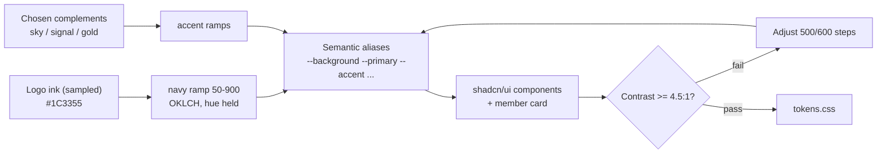

# 08 — Design System

> **Purpose:** the visual and component language for all three surfaces — logo-driven brand, design tokens, typography, component inventory, and the member card spec. Inherits `00-foundation.md` (tier names, status vocabularies, accessibility non-negotiables). Implemented as Tailwind CSS 4 theme tokens + shadcn/ui components (00 §4.2).

---

## 1. Logo-driven brand

**The logo has been delivered.** It is a horizontal lockup — the wordmark **AEROSKILL · CLUB** in a bold geometric uppercase sans, with a single-engine low-wing propeller-aircraft silhouette (banking pose) set between the two words — printed in **one color: deep navy** on white. That monochrome fact resolves the brand method:

- **`navy` (primary) is logo-derived:** anchored to the sampled logo ink ≈ **`#1C3355`**, mapped to `navy-800` below. Sampled from the delivered PNG — re-confirm against the source vector when it arrives (10 §3), but the palette is now live, not placeholder.
- **`sky`, `signal`, and the Captain gold are *chosen complements*, not extractions** — the logo carries no second color. They are locked as club design decisions and always defer to navy in hierarchy: navy leads every composition, accents punctuate.

### 1.1 Logo usage rules

| Rule | Specification |
|------|---------------|
| Variants | **Primary:** navy lockup on white/light surfaces. **Reverse:** all-white lockup on `navy-800`+ surfaces (member card, footer, hero) — produced by recoloring the source vector, never by CSS-filtering the PNG |
| Clearspace | ≥ the height of the aircraft glyph on all sides; nothing enters it |
| Minimum size | Full lockup ≥ 140px wide on screen; below that use the **aircraft glyph alone** (doubles as favicon, watermark, loading mark) |
| Placement | Public header left; member-card front top-left (reverse variant); email headers |
| Don'ts | No colors other than navy/white, no stretching, no drop shadows, no navy lockup over photography without a light scrim |
| Outstanding asset | The delivered file is raster (PNG) — obtain the source vector (SVG/AI) for the reverse variant, favicon set, and crisp card rendering (tracked in 10 §3) |

## 2. Color tokens

### 2.1 Brand scales (navy logo-derived; accents chosen)

| Scale | Role | 500 value | Notes |
|-------|------|-----------|-------|
| `navy` | `primary` — headers, primary buttons, card base | `#34568A` | **Logo-derived**; 800 = `#1C3355` (logo ink), 900 = `#12213A` |
| `sky` | `secondary` — links, info, Cadet tier | `#3BA7E0` | Chosen complement: clear-sky blue |
| `signal` | `accent` — CTAs, highlights, Pilot tier | `#F0731F` | Chosen complement: high-visibility "signal orange" |
| `slate` | neutrals — text, borders, surfaces | `#64748B` | Standard slate ramp 50–900 |

Full ramps (50, 100, 200, 300, 400, 500, 600, 700, 800, 900) generated in OKLCH with uniform lightness steps, hue held from the logo ink. `navy` ramp:
`#EEF2F8 · #D8E1EE · #B0C3DD · #84A2C7 · #5578A6 · #34568A · #27446F · #203A5F · #1C3355 · #12213A`

### 2.2 Semantic aliases (what components actually use)

| Token | Light value | Usage |
|-------|-------------|-------|
| `--background` | `slate-50` | Page background |
| `--surface` | `#FFFFFF` | Cards, panels, tables |
| `--surface-inverse` | `navy-900` | Footer, member card, hero |
| `--text` | `slate-900` | Body text |
| `--text-muted` | `slate-600` | Secondary text, captions |
| `--border` | `slate-200` | Dividers, input borders |
| `--primary` / `--primary-fg` | `navy-600` / white | Primary actions |
| `--accent` / `--accent-fg` | `signal-500` / white | Key CTAs (Join, Renew, Pay) |
| `--link` | `sky-600` | Inline links |
| `--success` | `#15803D` | Confirmed payments, `active` states |
| `--warning` | `#B45309` | `grace`, `pending`, expiring soon |
| `--danger` | `#B91C1C` | `expired`, `failed`, destructive actions |
| `--info` | `sky-600` | Announcements, neutral notices |

### 2.3 Tier colors (locked mapping)

| Tier | Token | Value | Used on |
|------|-------|-------|---------|
| Cadet | `--tier-cadet` | `sky-500` `#3BA7E0` | Tier badge, pricing card border, member-card stripe |
| Pilot | `--tier-pilot` | `signal-500` `#F0731F` | same |
| Captain | `--tier-captain` | gold `#C9A227` | same |

### 2.4 Light/dark stance

**v1 is light-mode only** on all surfaces; every color flows through the semantic aliases above so a dark theme is a token-file addition later, not a refactor. The one deliberate exception: the **member card is always rendered on `navy-900`** (§8) regardless of surrounding theme — it is a physical-object metaphor, not a themed panel.

## 3. Typography

All fonts self-hosted via `next/font` (no external font requests — GDPR posture, 09). All chosen families fully cover Romanian diacritics **ă â î ș ț** with correct **comma-below** forms (U+0218–U+021B, not the Turkish cedilla forms) — verified: Inter and Manrope both ship complete Latin Extended coverage; this must be re-verified for any future font swap, as ș/ț rendering is the most common Romanian-web typography failure.

| Role | Family | Weights |
|------|--------|---------|
| Display / headings | **Manrope** | 600, 800 |
| Body / UI | **Inter** | 400, 500, 600 |
| Numeric / codes (member number, prices, ICAO codes) | **JetBrains Mono** | 500 |

Type scale (rem, 16px base):

| Token | Size / line | Usage |
|-------|-------------|-------|
| `display` | 3rem / 1.1, Manrope 800 | Public hero |
| `h1` | 2.375rem / 1.15, Manrope 800 | Page titles |
| `h2` | 1.875rem / 1.2, Manrope 600 | Section titles |
| `h3` | 1.5rem / 1.25, Manrope 600 | Card titles |
| `h4` | 1.25rem / 1.3, Inter 600 | Table/list headers |
| `body-lg` | 1.125rem / 1.6 | Public lead paragraphs |
| `body` | 1rem / 1.6 | Default |
| `body-sm` | 0.875rem / 1.5 | Admin tables, meta |
| `caption` | 0.75rem / 1.4 | Labels, hints |

## 4. Spacing, radius, elevation, motion

- **Spacing** (4px base): `1`=4, `2`=8, `3`=12, `4`=16, `5`=20, `6`=24, `8`=32, `10`=40, `12`=48, `16`=64. Public sections use `12`/`16` vertical rhythm; admin density uses `2`–`4`.
- **Radius:** `sm` 6px (inputs, chips) · `md` 10px (buttons, cards) · `lg` 16px (panels, modals) · `card` 20px (member card, pricing cards) · `full` (avatars, badges).
- **Elevation:** `0` none (admin tables) · `1` subtle (cards) · `2` raised (dropdowns, popovers) · `3` modal. Shadows in `navy-900` at 6–16% alpha — never pure black.
- **Motion:** `fast` 150ms (hover, focus) · `base` 250ms (dropdowns, toasts) · `slow` 400ms (card flip, page transitions), all `ease-out`. Respect `prefers-reduced-motion`: replace movement with opacity.

## 5. Component inventory

Built on shadcn/ui, themed via §2 tokens. States required for every interactive component: default, hover, focus-visible, active, disabled, loading (where async).

| Component | Key rules |
|-----------|-----------|
| **Button** | Variants: `primary` (navy), `accent` (signal — reserved for Join/Pay/Renew, max one per view), `secondary` (outline), `ghost`, `destructive`. Min touch target 44×44px |
| **Input / Select / Textarea / Date picker** | Label always visible (no placeholder-as-label); error text below in `--danger`; Zod messages verbatim |
| **Form section** | Title + description + fields; single-column on mobile |
| **Card** | `surface`, radius `md`, elevation `1` |
| **Pricing card (tier)** | Radius `card`; tier-color top border (4px) + tier badge; price in JetBrains Mono; middle tier (Pilot) visually elevated as the recommended choice |
| **Sponsor grid** | Grayscale logos, color on hover; grouped by package (Gold row largest); links `rel="sponsored"` |
| **Status chip** | Locked color mapping: `active`/`confirmed`→success · `grace`/`pending`/`scheduled`→warning · `expired`/`failed`/`terminated`/`cancelled`→danger · `draft`/`archived`/`retired`→slate · `sent`→success · `maintenance`→warning. Chip text = enum value translated, never raw |
| **Data table (admin)** | `body-sm`, sticky header, row hover, column sort, filter bar above; bulk-select only where a bulk action exists |
| **Nav — public header** | Logo left; Mission, Membership, Sponsors, Fleet, Contact; locale switcher; `accent` Join button; login link |
| **Nav — portal** | Top bar: Dashboard, My membership, My card, Benefits, Profile; mobile bottom-tab equivalent |
| **Nav — admin sidebar** | Groups per 05 §3: Overview · People · Partners · Agreements · Comms · Fleet · System |
| **Badge** | Tier badges in tier colors; "Founding member" badge in gold outline |
| **Toast** | Bottom-right, `base` motion, auto-dismiss 5s, action button optional |
| **Modal / Confirm** | Destructive confirms restate the object name and require typed confirmation for irreversible actions (member archive, contract terminate) |
| **Empty state** | Icon + one sentence + primary action; specified for every list view in 04 |
| **QR code block** | Min 160×160px on-screen, quiet zone preserved, error correction level M |

## 6. Member card spec (the flagship component)

The digital member card is the product's daily touchpoint (01, principle 3). Rendered in the portal at `/portal/card` and designed to be shown at a partner desk.

### 6.1 Layout — front

- **Aspect:** CR80 card ratio (85.6 × 54 mm → 1.586:1), radius `card`, always on `--surface-inverse` (`navy-900`) with a subtle horizon-line graphic motif.
- **Top row:** club logo (white version) left; tier badge right (tier color, §2.3) — Captain additionally gets a gold border on the whole card.
- **Middle:** member full name (Manrope 600, white); member number `ASC-YYYY-NNNN` in JetBrains Mono, `sky-300`; "Founding member" badge when applicable.
- **Bottom row:** validity — "Valabil până la / Valid until `DD.MM.YYYY`" (locale-formatted per 00 §7.3) left; **QR code** right (white module on navy, 160px min, quiet zone respected).
- QR encodes the absolute verification URL `https://{domain}/verify/{token}` (token per 00 §6).

### 6.2 Details panel (below the card, not on it)

Tier benefits summary (from the live benefits catalog), grace-period notice when status is `grace` ("Membership in grace period until `date` — renew now" with `accent` Renew button), and a brightness hint for scanning.

### 6.3 States

| Member status | Card rendering |
|---------------|----------------|
| `active` | Full color as specified |
| `grace` | Full color + warning banner in details panel |
| `expired` / `archived` | Card desaturated to grayscale, "Expirat / Expired" overlay; QR still resolves (verification page reports invalid status — screenshots can't lie, 02 R5) |

### 6.4 Wallet & print

- "Add to home screen" guidance in portal; the card page works offline-tolerantly (renders last-known card from cache; verification always live).
- Native Apple/Google Wallet passes: **post-v1** (10 §backlog). The CR80 layout doubles as print-ready PDF for optional physical cards later.

### 6.5 Verification page (`/verify/{token}`) — partner-facing

Same brand, radically simple, one screen, no login: giant status verdict — ✅ "Membru activ / Active member" (success green) or ❌ "Card invalid / expirat" (danger red) — then member first name + last initial, tier badge, validity date, and "checked at `timestamp`". No other personal data (GDPR minimization). Result is rendered server-side, live from the database.

## 7. Accessibility rules (per 00 §8 — WCAG 2.2 AA)

Regulatory context (researched, 00 §8.3): the EAA has been enforced since 2025-06-28; its harmonized standard EN 301 549 v3.2.1 embeds WCAG 2.1 AA, with the WCAG 2.2 revision (v4.1.1) expected in 2026. The club is very likely EAA-exempt as a services microenterprise, but we target **WCAG 2.2 AA** and publish an accessibility statement (04 PUB-015) so growth never triggers a retrofit.

1. Text contrast ≥ 4.5:1 (≥ 3:1 for `h2`+); every §2.2 pairing validated, including tier colors on navy (card) and on white (badges) — `signal-500` on white is **large-text/badge only**, body text uses `signal-700`.
2. Full keyboard operability; visible `focus-visible` ring (2px `sky-500`, 2px offset) on every interactive element.
3. Touch targets ≥ 44×44px (portal is mobile-first, 00 §8) — comfortably above WCAG 2.2's new 24×24px minimum.
4. All form inputs labeled; errors announced via `aria-live`; status chips carry text, never color alone.
5. `lang` attribute switches with locale; diacritics render correctly in all three families (§3).
6. Images: meaningful `alt`; sponsor logos alt = sponsor name; decorative motifs `alt=""`.

**The five success criteria new in WCAG 2.2 AA, with their concrete design consequences here:**

| New criterion | Consequence in this system |
|---------------|----------------------------|
| 2.4.11 Focus Not Obscured | Sticky headers/admin filter bars must never cover the focused element — scroll-margin on all focusable rows |
| 2.5.8 Target Size (Minimum, 24px) | Already exceeded by rule 3; applies to inline links in dense admin tables too |
| 3.2.6 Consistent Help | Contact/help link sits in the same footer position on every public and portal page |
| 3.3.7 Redundant Entry | The application flow (MEM-002) never re-asks data already given at registration; renewal/upgrade forms prefill everything known |
| 3.3.8 Accessible Authentication | Email+password with paste allowed and password-manager friendly; no CAPTCHAs or cognitive puzzles on `/login` (rate limiting per PLT-011 does the anti-abuse work instead) |

## 8. Imagery & tone

- **Photography:** real Romanian GA — aircraft on grass strips, cockpit shots, golden-hour aprons. No stock airliner imagery, ever.
- **Iconography:** Lucide (ships with shadcn/ui), 1.5px stroke, `slate-600` default.
- **Voice:** confident, warm, plain — "Zbori mai mult. Plătești mai puțin. Aparții." (01 §1). Romanian copy is the master; English translates the Romanian, not vice versa. No aviation gatekeeping jargon on public pages; ICAO codes and registrations are welcome in fleet/admin contexts (real reference points: Clinceni `LRCN`, Ploiești-Strejnic `LRPV`, Brașov-Sânpetru `LRSP`, Tuzla `LRTZ`).

---

*Sources for the researched claims in this document: [EAA e-commerce requirements](https://accessible.org/eaa-ecommerce-services-requirements/), [EN 301 549 / WCAG mapping](https://www.levelaccess.com/blog/is-wcag-conformance-enough-for-eaa-compliance/), [EN 301 549 v4.1.1 / WCAG 2.2 timeline](https://digital-strategy.ec.europa.eu/en/policies/latest-changes-accessibility-standard). Full research basis: 00 §10.*
