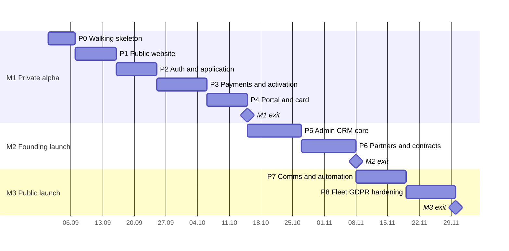

# 10 — Roadmap

> **Purpose:** the sequenced, phase-by-phase build roadmap for the solo Claude Code developer. Written last: it sequences the slices and milestones of `03-implementation-plan.md` over the requirements of `04-prd.md`. Phases map 1:1 to slices S0–S8; milestones M1–M3 and cut lines are exactly those of 03.

---

## 1. Overview

| Phase | Theme | Slice (03) | Sessions | Lands in |
|-------|-------|-----------|----------|----------|
| P0 | Walking skeleton | S0 | 3–4 | M1 — Private alpha |
| P1 | Public website | S1 | 4–6 | M1 |
| P2 | Auth & application | S2 | 4–6 | M1 |
| P3 | Payments & activation | S3 | 5–7 | M1 |
| P4 | Portal & member card | S4 | 4–6 | **M1 exit** |
| P5 | Admin CRM core | S5 | 6–8 | M2 — Founding launch |
| P6 | Partners, contracts, benefits | S6 | 6–8 | **M2 exit** |
| P7 | Communication & automation | S7 | 5–7 | M3 — Public launch |
| P8 | Fleet, GDPR, hardening | S8 | 5–7 | **M3 exit** |

Total 42–59 sessions. Strictly sequential (03 §2); no phase starts before the previous phase's demo checkpoint passes.

Indicative sequencing at ~4 sessions/week from an illustrative start date — durations are the 03 §2 midpoints, **not commitments**:

## 2. Phases

### P0 — Walking skeleton
**Objective:** production-deployed empty app with the entire toolchain proven. **Entry:** repos + accounts exist (see §3).
1. Next.js 16 + TypeScript strict (Turbopack, `proxy.ts` route gating) + Tailwind/shadcn with 08 tokens; layout shells for the three route groups (05 §1).
2. next-intl ro/en scaffold (PLT-003); branded 404/403 (PUB-014).
3. Supabase project + local stack + custom access token auth hook (06 §5); migrations 001–002 (`profiles`, `club_settings`); CI: lint, types, unit, migration drift; Vercel deploy + preview pipeline (09 §8).

**Demo checkpoint:** visiting the production URL shows the bilingual shell; a PR shows preview deploy + green CI. **Not in this phase:** any real page content.

### P1 — Public website
**Objective:** the club exists publicly, bilingual, fast. **Entry:** P0 checkpoint.
1. `/` home with mission hero + static tier teaser (PUB-001), `/mission` (PUB-002).
2. `/membership` tier comparison from seeded `tiers` (PUB-003); `/join` entry (PUB-009).
3. `/contact` + form with rate-limited submission (PUB-008), `/legal/*` incl. accessibility statement (PUB-010, PUB-015).
4. Locale switcher + hreflang (PUB-011), SEO meta/sitemap (PUB-012).

**Demo checkpoint:** Lighthouse mobile LCP < 2.5 s on `/`; both locales fully navigable. **Not yet:** live sponsors (P6), live benefit rows (P6), fleet page (P8), founding counter (P6).

### P2 — Auth & application
**Objective:** a visitor can become an applicant. **Entry:** P1 checkpoint.
1. Register/confirm/login/reset (MEM-001, MEM-003, MEM-004; PLT-001).
2. Application form → `members` + `memberships` pending rows (MEM-002); migrations 003 + first RLS policies + assertion script (PLT-002, 03 §1.7).
3. Portal shell with status-shaped nav (05 §4); `/portal/profile` basics (MEM-009).

**Demo checkpoint:** fresh email → confirmed account → submitted application visible in the database with correct `pending` statuses; anon/member RLS assertions pass.

### P3 — Payments & activation
**Objective:** money in, membership on — both rails. **Entry:** P2 checkpoint; Stripe account activation started back in P0 (03 §6).
1. Stripe Checkout + signature-verified idempotent webhook (MEM-005, PLT-009; `payments`, `stripe_events`).
2. Bank-transfer instructions + pending payment records (MEM-006).
3. Activation engine: approve + confirmed payment → active membership, member number, card issuance (MEM-007; `member_cards`), founding flag.
4. Lifecycle emails subset: application received, transfer instructions, payment confirmed, activated (PLT-004; `email_log`).
5. Minimal staff approve action (ADM-005 minimal, explicitly for alpha — 03 §6).

**Demo checkpoint:** FLOW-01 end-to-end twice — once card (test mode), once bank transfer confirmed via the minimal action; re-sent webhook events are no-ops.

### P4 — Portal & member card  → **M1: Private alpha**
**Objective:** membership feels real: dashboard, history, and the card. **Entry:** P3 checkpoint.
1. Dashboard with status chip + contextual action (MEM-008); membership view/history (MEM-011).
2. Renewal + upgrade actions with server-side pro-rata (MEM-012, MEM-013); payment history + confirmation PDFs (MEM-014).
3. The card per 08 §6 (MEM-015) + `/verify/{token}` via `verify_card()` RPC (PUB-013); offline tolerance (MEM-016).

**Demo checkpoint — M1 exit (03 §3):** seed members (10–15) join with real money; every card verified from a real phone at desk distance; Playwright smoke green in CI.

### P5 — Admin CRM core
**Objective:** staff replace the developer for people-ops. **Entry:** M1 exit.
1. CRM dashboard + action queues (ADM-001, ADM-002).
2. Member list/detail/360°, full application review, edits, archive (ADM-003–ADM-008), adjustments + card reissue + CSV (ADM-009–ADM-011).
3. Manual transfer confirmation, full version (ADM-006) replacing the P3 minimal action.
4. Users/roles, club settings, audit log everywhere (ADM-032–ADM-034, PLT-007; `audit_logs`).

**Demo checkpoint:** staff member (not the developer) executes FLOW-09 and FLOW-10 unaided; every mutation appears in `/admin/audit`.

### P6 — Partners, contracts, benefits  → **M2: Founding launch**
**Objective:** the promise becomes contractual and public. **Entry:** P5 checkpoint.
1. Partner CRUDs: flight schools (+aerodrome links), associations, aerodromes, sponsors (ADM-012–ADM-016).
2. Contracts: lifecycle, documents, expiry queue (ADM-017–ADM-020; alert *emails* arrive with P7 cron — queue entries only until then).
3. Benefits + publication rule (ADM-021, ADM-022).
4. Public goes live-data: benefit rows (PUB-004), founding counter (PUB-005), sponsors page + homepage placement (PUB-006); member benefits catalog (MEM-017, MEM-018).

**Demo checkpoint — M2 exit:** FLOW-11 + FLOW-12 + FLOW-16 executed for real partners; ≥ 2 contracts and ≥ 1 sponsor live on the public site; founding counter counting down.

### P7 — Communication & automation
**Objective:** the machine talks and remembers by itself. **Entry:** M2 exit.
1. Cron engine `/api/cron/daily`: status transitions + reminders + expiry alerts, idempotent (PLT-005, PLT-006; ADM-020/ADM-030 emails go live).
2. Full lifecycle email set incl. dunning T−30…T+30 (PLT-004).
3. Templates management (ADM-023), campaigns + segments + test send + send log (ADM-024–ADM-026; MEM-019 consent gating), announcements (ADM-027, MEM-020), automated-send log (ADM-028).

**Demo checkpoint:** compressed-clock staging cohort walks FLOW-04 (active → grace → expired) with every email observed; a real campaign reaches a consented segment (FLOW-14).

### P8 — Fleet, GDPR, hardening  → **M3: Public launch**
**Objective:** complete the CRM, honor the law, harden the edges. **Entry:** P7 checkpoint.
1. Fleet CRUD + document expiry alerts + public visibility (ADM-029–ADM-031); `/fleet` page (PUB-007).
2. GDPR: export, erasure request + admin execution (MEM-021, MEM-022, ADM-035 — FLOW-08 end-to-end).
3. Hardening: rate limits (PLT-011), Plausible (PLT-010), empty/error states pass (PLT-012), WCAG AA audit (08 §7), backup **restore drill** (09 §6).

**Demo checkpoint — M3 exit:** launch-readiness checklist (§4) 100% green.

## 3. Dependencies (watch from day one)

| Dependency | Needed by | Owner action |
|------------|-----------|--------------|
| Stripe account activated for the *asociație* | P3 | Start paperwork during P0 (03 §6); bank-transfer rail is the hedge; Netopia documented plan B (00 §4.3) |
| Club statute defines Cadet/Pilot/Captain as member categories with AG-set dues (OG 26/2000, 02 R12) | First real payment (M1) | Draft/amend statute with the lawyer alongside P1 legal pages |
| Accountant's e-Factura SPV workflow for sponsorship invoices (mandatory for NGOs since 2025-07-01, 00 §2) | First sponsor contract (P6/M2) | Confirm process with the accountant during P5 |
| Logo **source vector** (SVG/AI) — the logo itself is delivered (navy lockup, PNG; palette anchored in 08 §1–2) | P4 card polish (raster fallback OK before) | Request from the designer: needed for the white/reverse variant, favicon set, and crisp card rendering (08 §1.1) |
| Legal pages content (privacy/terms/cookies/accessibility) | P1 draft, reviewed by M2 | Lawyer review in parallel with P1–P5 |
| Domain + DNS (`aeroskill.club` assumed, 09 §4) | P0 | Confirm and configure at P0 |
| Club IBAN + entity data for `club_settings` | P3 | Available at association registration |
| ≥ 5 flight schools, ≥ 4 aerodromes, ≥ 2 sponsors signed | M3 gate (02 R1) | Administrator pipeline runs in parallel from M1; lead with training-package discounts (02 §3 contracting rule) |
| Seed members willing to pay real dues | M1 | Recruit before P4 completes |

## 4. Launch-readiness checklist (M3 gate)

- [ ] All 04 **Must** requirements demonstrably done (walk the PRD; every M has a checkpoint reference)
- [ ] Partner threshold met: ≥ 5 flight schools, ≥ 4 aerodromes, ≥ 2 sponsors with `active` contracts (02 §6)
- [ ] FLOW-01 through FLOW-16 each executed at least once on production or staging
- [ ] Dunning engine proven on compressed-clock cohort (P7 checkpoint)
- [ ] GDPR: export + erasure executed for real; privacy policy lists 09 §3 processors; DPAs on file
- [ ] Restore drill completed and timed (09 §6); the five alerts (09 §9) firing and routed
- [ ] WCAG **2.2** AA pass on public + portal (incl. the five new criteria, 08 §7); accessibility statement live at `/legal/accessibility` (PUB-015); LCP budget met on 4G mobile
- [ ] Legal pages lawyer-approved; cookie notice accurate (no banner needed — 00 §4.5); statute categories confirmed (02 R12); accountant e-Factura workflow confirmed (02 R11)
- [ ] Founding-member counter correct against the database; price lock recorded via `memberships.price_ron`
- [ ] Runbook (09 §6) rehearsed: key revocation, DB restore, Stripe pause

## 5. Post-v1 backlog (rough priority)

From 00 §9 and deferrals noted across the suite:

1. **Auto-recurring renewals** (saved cards / Stripe subscriptions) — biggest renewal-rate lever after v1 proof.
2. **Fiscal e-invoicing integration** (e-Factura/SmartBill) — removes the manual accounting seam (00 §2).
3. **Events module** with registration and tier-based pricing (guest passes become structured).
4. **Benefit redemption tracking** at partners — turns the card into a measurable channel; enables per-benefit ROI for contract renewals.
5. **Apple/Google Wallet passes** for the member card (08 §6.4).
6. **Sponsor self-service portal** (assets, invoices, campaign previews).
7. **Member directory & community features** (opt-in, privacy-first).
8. **Flight-school student pipeline** — referral tracking from `/join` through partner schools (02 §6 channel 1, instrumented).
9. **Admin analytics** — cohort renewals, benefit popularity, campaign engagement.
10. **English admin CRM** if non-Romanian staff join (00 §4.4 currently ro-only).
