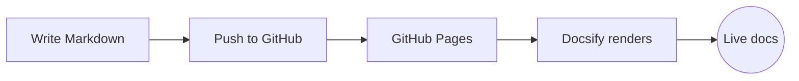

# Aeroskill Docs

> Documentation powered by [Docsify](https://docsify.js.org/), rendered straight from Markdown — with [Mermaid](https://mermaid.js.org/) diagram support.

Welcome 👋 This site is built from the Markdown files in the `docs/` folder of this repository. There is **no build step**: Docsify renders the `.md` files in the browser, and GitHub Pages serves them as a static site.

## Documentation sets

- 📘 **[Codex](Codex/README.md)** — Codex documentation.
- 📗 **[Claude](Claude/README.md)** — Claude documentation.

## Mermaid works out of the box

Open a ` ```mermaid ` code fence and it renders:



## Adding pages

1. Drop a `.md` file into `docs/Codex/` or `docs/Claude/`.
2. Link it in [`docs/_sidebar.md`](_sidebar.md) under the matching section.
3. Commit and push — it's live.
