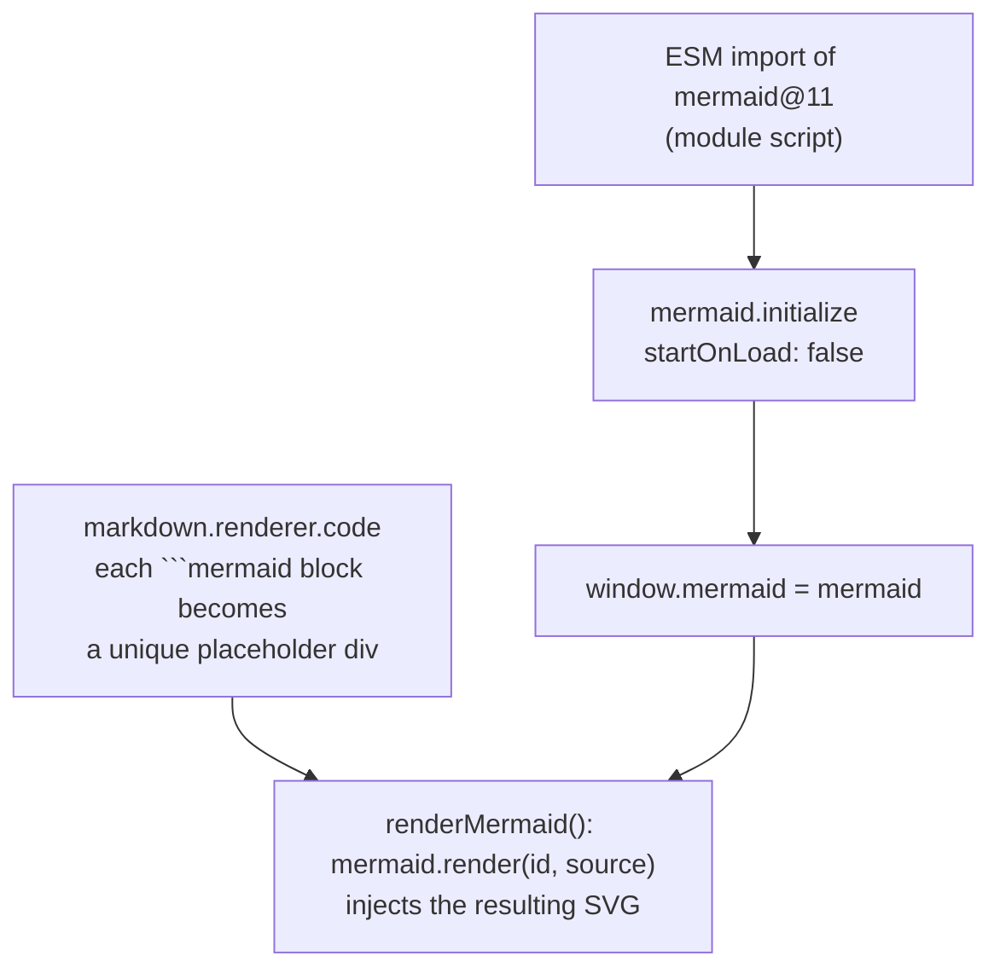

# Configuration Reference

All site configuration lives in the `window.$docsify` object inside [`index.html`](https://github.com/fulgeru99/aeroskill-docs/blob/main/index.html). This page documents what's set and how to change it.

## Core options

| Option | Value here | What it does |
| --- | --- | --- |
| `name` | `"Aeroskill Docs"` | Title shown in the sidebar header |
| `repo` | GitHub URL | Adds the GitHub "corner ribbon" link |
| `loadSidebar` | `true` | Loads `_sidebar.md` for left navigation |
| `loadNavbar` | `true` | Loads `_navbar.md` for the top navigation |
| `coverpage` | `true` | Loads `_coverpage.md` as a splash screen |
| `subMaxLevel` | `2` | Auto-generates sub-navigation down to `##` |
| `auto2top` | `true` | Scrolls to top on navigation |

Full list: <https://docsify.js.org/#/configuration>.

## Plugins loaded

These are added via `<script>` tags near the bottom of `index.html`:

| Plugin | Purpose |
| --- | --- |
| Search | Client-side full-text search box |
| docsify-copy-code | Copy button on every code block |
| docsify-pagination | Prev/next links at the page bottom |
| zoom-image | Click to zoom images |
| docsify-plugin-flexible-alerts | Renders `> [!NOTE]`/`[!TIP]`/`[!WARNING]` as styled callouts |
| Prism components | Syntax highlighting for bash, json, yaml, python |

## Mermaid integration

Mermaid support is wired up in `index.html` in three pieces:



1. **Load** — Mermaid v11 is ESM-only, so it's imported in a `<script type="module">` and exposed as `window.mermaid`.
2. **Convert** — a custom `markdown.renderer.code` turns each ` ```mermaid ` fenced block into a placeholder `<div>` with a **unique id**, then calls `renderMermaid()`.
3. **Render** — `renderMermaid()` calls the async `mermaid.render(id, source)` and injects the returned SVG into the placeholder. Because every diagram gets a fresh id, navigating between pages always produces new SVGs — there are no stale `data-processed` nodes, so diagrams never go blank on a second visit. (Requests that arrive before the Mermaid module finishes loading are queued and flushed once it's ready.)

To change the Mermaid theme, edit the `mermaid.initialize({ ... })` call, e.g.:

```js
mermaid.initialize({ startOnLoad: false, theme: "dark" });
```

## Adding syntax-highlighted languages

Prism only ships a few languages by default. Add more with another component script:

```html
<script src="//cdn.jsdelivr.net/npm/prismjs@1/components/prism-rust.min.js"></script>
```

## Pinning versions

The CDN URLs use major-version ranges (e.g. `docsify@4`, `mermaid@11`) so you get patches automatically. To lock exact versions for reproducibility, replace them with full versions (e.g. `docsify@4.13.1`, `mermaid@11.4.0`).
