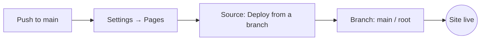
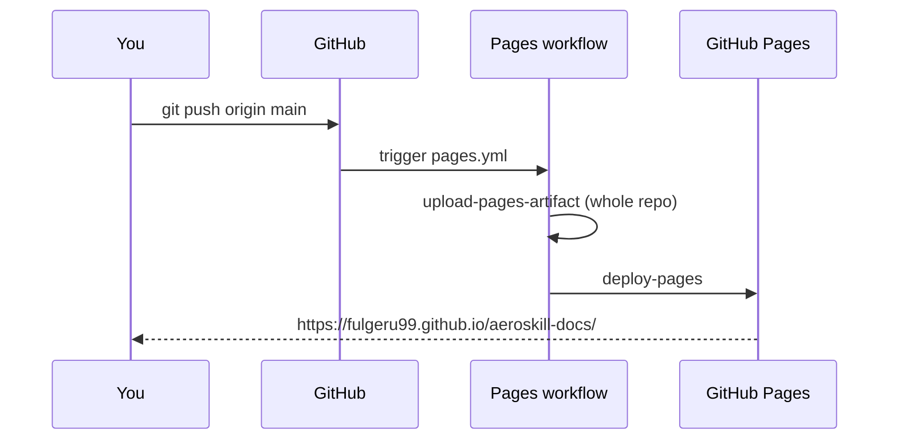

# Deploy to GitHub Pages

Because Docsify renders in the browser, there is **nothing to build** — GitHub Pages just serves the static files in this repo. There are two ways to publish. **Pick exactly one** — the two sources are mutually exclusive. Option A is recommended for a docs-only repo.

## The `.nojekyll` file (required either way)

GitHub Pages runs Jekyll by default, and Jekyll **ignores files and folders that start with an underscore** — which would silently drop `_sidebar.md`, `_navbar.md`, and `_coverpage.md`. The empty [`.nojekyll`](https://github.com/fulgeru99/aeroskill-docs/blob/main/.nojekyll) file at the repo root disables Jekyll so those files are served. It's already in this repo — don't delete it.

## Option A — Deploy from a branch (simplest)

No workflow, just a setting:

1. Push your Markdown + `index.html` to the `main` branch.
2. Go to **Settings → Pages**.
3. Under **Build and deployment → Source**, choose **Deploy from a branch**.
4. Set **Branch** to `main` and folder to **`/ (root)`**, then **Save**.
5. Wait ~1 minute. Your site is at:

   ```
   https://fulgeru99.github.io/aeroskill-docs/
   ```



## Option B — GitHub Actions (optional alternative)

This repo ships a workflow at [`.github/workflows/pages.yml`](https://github.com/fulgeru99/aeroskill-docs/blob/main/.github/workflows/pages.yml) that uploads the repo to Pages. It triggers on **manual dispatch** by default (so it can't produce failing runs before Pages is switched to this source).

1. Go to **Settings → Pages**.
2. Under **Build and deployment → Source**, choose **GitHub Actions**.
3. Open the **Actions** tab → **Deploy Docsify site to GitHub Pages** → **Run workflow**.
4. To auto-deploy on every push, uncomment the `push:` trigger at the top of `pages.yml`.

> [!WARNING]
> If you went with **Option A** instead, **delete `.github/workflows/pages.yml`** — keeping it serves no purpose under branch mode.



> [!TIP]
> Choose **Option B** only if you later want build steps (link-checking, generating a sidebar, etc.) or explicit deployment environments. For plain Markdown + Docsify, **Option A** is all you need.

## Project-page base path

The site lives under a subpath (`/aeroskill-docs/`), not at the domain root. Docsify handles this automatically as long as links use **relative paths** (e.g. `guide/mermaid.md`) — which is why the sidebar and page links in this repo are relative.

## Custom domain (optional)

To serve from your own domain, add a `CNAME` file at the repo root containing just the hostname (e.g. `docs.example.com`) and configure the DNS record, or set it under **Settings → Pages → Custom domain**.

## Troubleshooting

| Symptom | Fix |
| --- | --- |
| Sidebar/cover page missing in production but fine locally | `.nojekyll` is missing or was deleted |
| 404 on the whole site | Pages source/branch not set, or first deploy still running |
| Links 404 only in production | Use relative paths, not paths starting with `/` |
| Blank page, console fetch errors | You opened `index.html` via `file://` — serve over HTTP |
