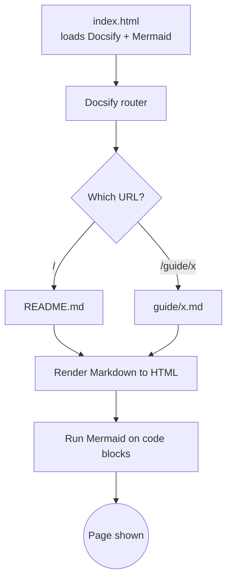

# Getting Started

This repository is a [Docsify](https://docsify.js.org/) site. There is **no build step** — the `index.html` at the repo root loads Docsify from a CDN, and Docsify fetches and renders the Markdown files in the browser.

## Preview locally

You only need a static file server, because everything runs client-side.

**Option A — Docsify CLI** (gives you live reload):

```bash
npm install -g docsify-cli
docsify serve .
# open http://localhost:3000
```

**Option B — any static server** (no install if you have Python):

```bash
python3 -m http.server 3000
# open http://localhost:3000
```

> [!NOTE]
> Opening `index.html` directly with `file://` will **not** work — browsers block the `fetch()` calls Docsify uses to load `.md` files. Always serve over HTTP.

## Add a new page

1. Create a Markdown file, e.g. `guide/my-page.md`.
2. Add a link to it in [`_sidebar.md`](../_sidebar.md) so it appears in the navigation:

   ```markdown
   - [My Page](guide/my-page.md)
   ```

3. Commit and push. Once GitHub Pages is enabled, it's live.

## How the pieces fit together



## Project layout

```text
.
├── index.html        # Docsify loader + plugin/Mermaid config (the only "code")
├── .nojekyll         # Tells GitHub Pages not to run Jekyll (keeps _files)
├── README.md         # Home page (/)
├── _coverpage.md     # Splash cover page
├── _sidebar.md       # Left navigation
├── _navbar.md        # Top navigation
└── guide/            # Your documentation pages
    ├── getting-started.md
    ├── mermaid.md
    └── ...
```

Next: [write your docs](guide/markdown.md) or [deploy to GitHub Pages](guide/deploy.md).
