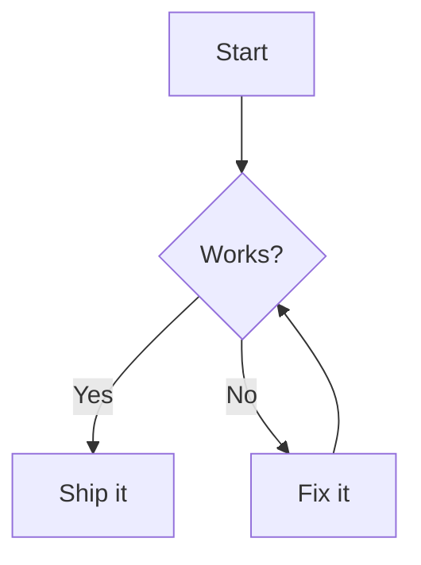
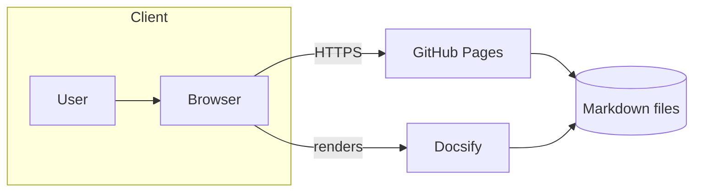
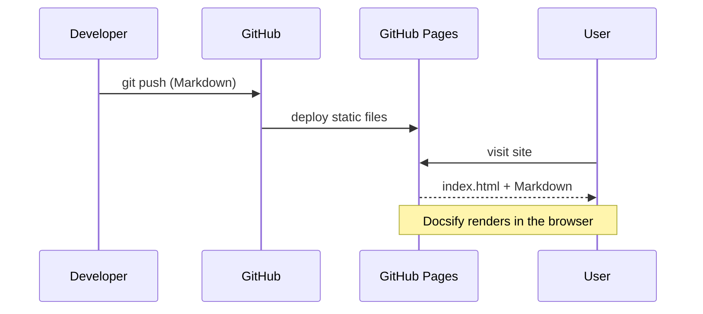
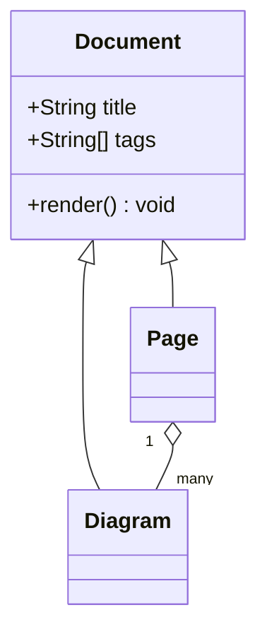
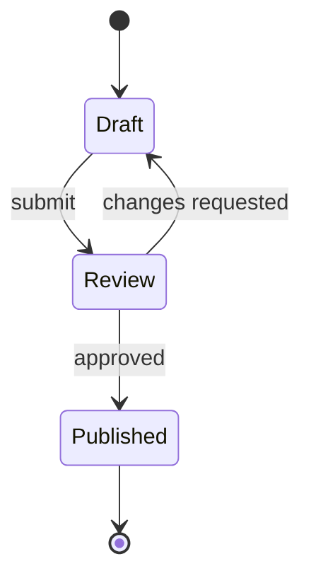
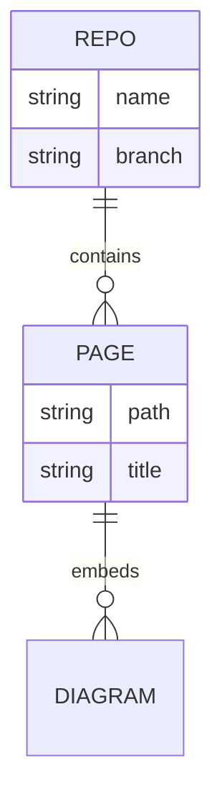
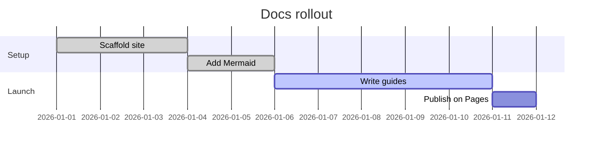
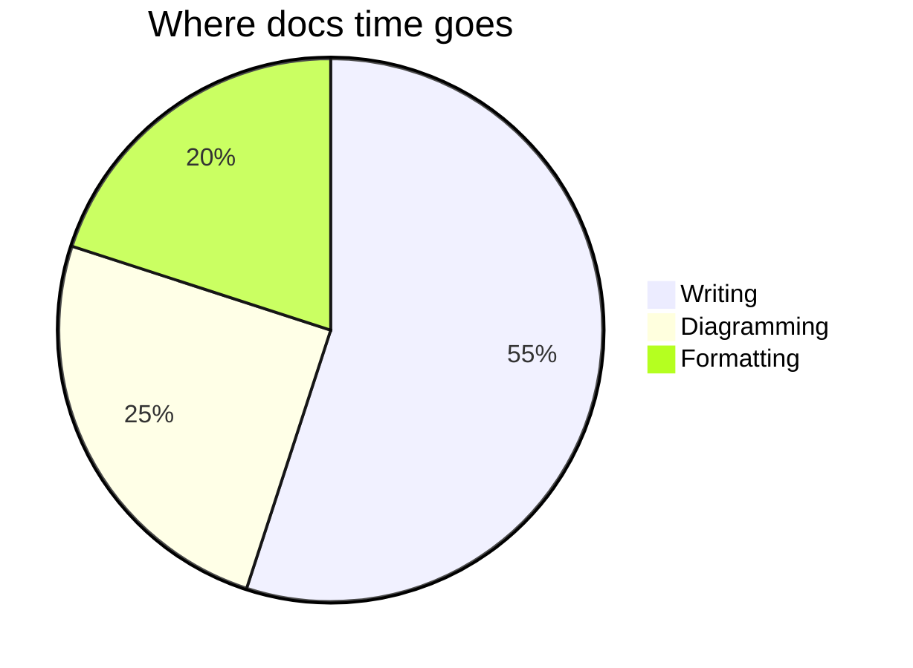
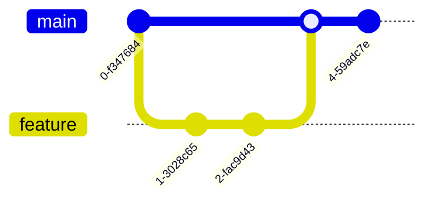

# Mermaid Diagrams

This site renders [Mermaid](https://mermaid.js.org/) diagrams directly from fenced code blocks. Just open a code fence with `mermaid` as the language and write Mermaid syntax inside:

````markdown

````

…which renders as:


> [!TIP]
> Diagrams re-render automatically as you navigate between pages — no full reload needed.

## Flowchart



## Sequence diagram



## Class diagram



## State diagram



## Entity relationship diagram



## Gantt chart



## Pie chart



## Git graph



## Troubleshooting

| Symptom | Likely cause | Fix |
| --- | --- | --- |
| Diagram shows as raw code | The code fence language isn't exactly `mermaid` | Use ` ```mermaid ` (lowercase, no spaces) |
| All diagrams blank, console shows a Mermaid import error | The browser can't reach the Mermaid CDN | Confirm `cdn.jsdelivr.net` is reachable, or self-host `mermaid.esm.min.mjs` |
| Inline `Mermaid error:` box | Invalid Mermaid syntax in that block | Test the snippet in the [Mermaid Live Editor](https://mermaid.live) |
